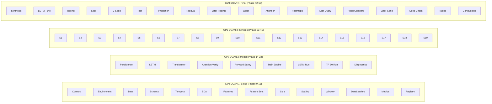
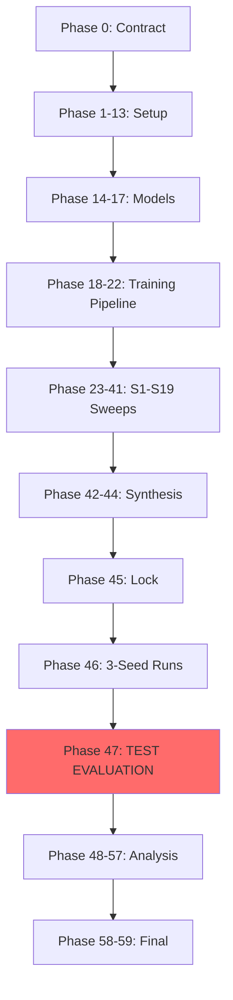

# Toàn bộ Project Summary (Phase 0-59)

## Project Overview

**Project**: Transformer Encoder cho hồi quy chuỗi thời gian đa biến trên UCI Appliances Energy Prediction

**Task**: Multivariate Time-Series Regression - Sequence-to-One, One-Step-Ahead Forecasting

**Target**: Appliances energy consumption (Wh), dự báo 10 phút tiếp theo

**Dataset**: UCI Appliances Energy Prediction Dataset (ID 374)

---

## Cấu trúc 4 Giai đoạn chính



---

## GIAI ĐOẠN 1: Setup & Foundation (Phase 0-13)

### Phase 0: Coursework Contract
**Output**: `CONTRACT-v1`

Lock toàn bộ experimental contract:
- Bài toán: Regression
- Target: Appliances (Wh)
- Horizon: H=1 (10 phút)
- Lookback: L36/L72/L144
- Feature Sets: FS0/FS1/FS2
- Metrics: RMSE, MAE, R²
- Test Firewall: Không xem test cho đến Phase 47

### Phase 1: Environment
**Output**: `ENVIRONMENT-v1`
- Python, PyTorch, CUDA/MPS/CPU
- Seeds: 42 (primary), 123, 2026 (final)

### Phase 2: Data Acquisition
**Output**: `DATA-v1`
- UCI Appliances Energy Dataset
- Immutable raw data
- Checksum verification

### Phase 3: Schema Audit
**Output**: `SCHEMA-v1`
- Columns, dtypes, target, units

### Phase 4: Temporal Integrity
**Output**: `TEMPORAL-v1`
- Timestamps, gaps, sampling (10 phút)

### Phase 5: EDA
**Output**: `EDA-v1`
- Distributions, seasonality, correlations

### Phase 6: Feature Engineering
**Output**: `FEATURES-v1`
- Cyclical encoding (hour_sin/cos, dow_sin/cos)
- Weekend indicator

### Phase 7: Feature Set Variants
**Output**: `FEATURESETS-v1`
- FS0: Exogenous only
- FS1: FS0 + autoregressive (historical Appliances)
- FS2: FS1 + random controls (rv1, rv2)

### Phase 8: Chronological Split
**Output**: `SPLIT-v1`
- Train / Validation / Test split theo thời gian
- Test Firewall

### Phase 9: Train-Only Scaling
**Output**: `SCALING-v1`
- Fit scalers chỉ trên Train
- YS0: Raw Wh, YS1: Standardized

### Phase 10: Window Builder
**Output**: `WINDOWS-v1`, `WINDOWPOP-v1`
- Sliding windows: X[t-L+1:t] -> y[t+H]
- L144 baseline

### Phase 11: DataLoaders
**Output**: `DATALOADERS-v1`
- PyTorch DataLoader
- Batch sizes: 32, 64

### Phase 12: Shared Metrics
**Output**: `METRICS-v1`
- RMSE (Wh), MAE (Wh), R²
- Validation RMSE là primary selection metric

### Phase 13: Experiment Registry
**Output**: `EXPERIMENTS-v1`
- Run IDs, configs, lineage, artifacts

---

## GIAI ĐOẠN 2: Model Implementation (Phase 14-22)

### Phase 14: Persistence Baseline
**Output**: `PERSISTENCE-v1`
- Baseline đơn giản: \hat{y}_{t+1} = y_t
- Hard to beat với strong autocorrelation

### Phase 15: LSTM Implementation
**Output**: `LSTM-v1`, `LSTM_IMPL-v1`
- Input: [B, L, F] -> Output: [B, 1]
- Unidirectional, stateless across windows
- Last-step readout

### Phase 16: Transformer Implementation
**Output**: `TRANSFORMER-v1`, `TRANSFORMER_IMPL-v1`
- Transformer Encoder
- Input projection F -> d_model
- Positional encoding (sinusoidal)
- Multi-head self-attention
- Last-step / Mean pooling
- **Attention hooks cho Phase 17+**

### Phase 17: Attention Verification
**Output**: `ATTENTION_VERIFY-v1`
- Verify attention weights shape [B, H, L, L]
- Per-head attention với average_attn_weights=False
- Training vs Inspection path separation

### Phase 18: Forward Sanity Tests
**Output**: `FORWARD_SANITY-v1`
- Integration gate cuối cùng
- Real data + real model + real device

### Phase 19: Training Engine
**Output**: `TRAINING_ENGINE-v1`
- Training loop reusable cho LSTM và Transformer
- Early stopping (patience=10)
- Checkpointing (best + last)
- Gradient clipping
- Logging

### Phase 20: LSTM Baseline Run
**Output**: `LSTM_BASELINE-v1`
- Official LSTM baseline với config từ Phase 0
- L144, FS1, TF1, YS1, MSE, AdamW, LR=3e-4

### Phase 21: Transformer B0 Run
**Output**: `TRANSFORMER_B0-v1`
- Official Transformer baseline
- Fair comparison với LSTM

### Phase 22: Learning-Curve Diagnostics
**Output**: `LEARNING_DIAGNOSTICS-v1`
- Analyze training dynamics
- KHÔNG tune gì
- Tạo hypotheses cho S1-S19

---

## GIAI ĐOẠN 3: Hyperparameter Sweeps (Phase 23-41)

### 19 One-Factor Sweeps

| Sweep | Phase | Factor | Conditions |
|-------|-------|--------|------------|
| S1 | 23 | Feature Set | FS0 vs FS1 vs FS2 |
| S2 | 24 | Time Features | TF0 vs TF1 |
| S3 | 25 | Target Scaling | YS0 vs YS1 |
| S4 | 26 | Lookback | L36 vs L72 vs L144 |
| S5 | 27 | Pooling | LAST_STEP vs MEAN |
| S6 | 28 | Activation | ReLU vs GELU |
| S7 | 29 | Batch Size | B32 vs B64 |
| S8 | 30 | Learning Rate | 1e-4 vs 3e-4 vs 1e-3 |
| S9 | 31 | Weight Decay | 0 vs 1e-4 vs 1e-3 |
| S10 | 32 | Dropout | 0.1 vs 0.2 vs 0.3 |
| S11 | 33 | d_model | 32 vs 64 |
| S12 | 34 | Heads | 2 vs 4 |
| S13 | 35 | Layers | 2 vs 4 |
| S14 | 36 | FFN Width | 64 vs 128 |
| S15 | 37 | Loss | MSE vs Huber |
| S16 | 38 | Epoch Cap | 50 vs 100 |
| S17 | 39 | Gradient Clip | 0.5 vs 1.0 vs None |
| S18 | 40 | RevIN | OFF vs ON |
| S19 | 41 | Boundary Protocol | carry-over vs strict isolation |

### Nguyên tắc Sweep
```
One Factor
+ Same Samples  
+ Same Training Protocol
+ Same Seed
+ Validation RMSE Selection
+ No Test
```

### Dependency Chain
```
S1 → S2 → S3 → S4 → S5 → S6 → S7 → S8 → S9 → S10
                                                    ↓
S11 → S12 → S13 → S14 → S15 → S16 → S17 → S18 → S19
```

---

## GIAI ĐOẠN 4: Final (Phase 42-59)

### Phase 42: Candidate Synthesis
**Output**: `CANDIDATE_SYNTHESIS-v1`
- Tổng hợp winners từ S1-S19
- Tạo shortlist candidates
- KHÔNG train mới

### Phase 43: LSTM Tuning
**Output**: `LSTM_TUNED-v1`
- Tune LSTM sau khi Transformer hoàn thành
- Fair comparison

### Phase 44: Rolling-Origin Robustness
**Output**: `ROLLING_ORIGIN-v1`
- Kiểm tra stability theo thời gian
- Multiple validation windows

### Phase 45: Final Model Lock
**Output**: `FINAL_MODEL_LOCK-v1`
- Khóa final Transformer configuration
- Freeze final config, scalers, epoch count, seeds

### Phase 46: Three-Seed Final Runs
**Output**: `THREE_SEED_FINAL_RUNS-v1`
- Train 3 seeds: 42, 123, 2026
- KHÔNG Early Stopping, KHÔNG Validation selection
- Fixed epochs từ Phase 45

### Phase 47: Final Test Evaluation
**Output**: `FINAL_TEST_EVAL-v1`
- **LẦN ĐẦU TIÊN mở Test set**
- Evaluate all models on Test
- KHÔNG retraining

### Phase 48-51: Error Analysis
| Phase | Tên | Analysis |
|-------|------|----------|
| 48 | Prediction Analysis | Error distribution |
| 49 | Residual Analysis | Residuals properties |
| 50 | Error-by-Regime | By hour, day, weekday |
| 51 | Worst-Error Analysis | Top 5% worst predictions |

### Phase 52-57: Attention Analysis
| Phase | Tên | Analysis |
|-------|------|----------|
| 52 | Attention Extraction | Extract attention weights |
| 53 | Attention Heatmaps | Visualize patterns |
| 54 | Last-Query Attention | Focus on final prediction |
| 55 | Head Comparison | Per-head patterns |
| 56 | Error-Conditioned | Attention khi errors cao |
| 57 | Seed-Stability | Consistency across seeds |

### Phase 58: Final Tables
**Output**: `FINAL_TABLES-v1`
- Summary tables

### Phase 59: Conclusions
**Output**: `FINAL_CONCLUSIONS-v1`
- Final scientific narrative
- Claim strength classification
- Limitations

---

## Key Contracts Summary

| Contract | Phase | Mô tả |
|----------|-------|--------|
| CONTRACT-v1 | 0 | Full experimental specification |
| DATA-v1 | 2 | Immutable raw data |
| SCHEMA-v1 | 3 | Column definitions |
| TEMPORAL-v1 | 4 | Time integrity |
| FEATURES-v1 | 6 | Engineered features |
| FEATURESETS-v1 | 7 | Feature set variants |
| SPLIT-v1 | 8 | Train/Val/Test split |
| SCALING-v1 | 9 | Train-only scalers |
| WINDOWS-v1 | 10 | Sliding windows |
| DATALOADERS-v1 | 11 | PyTorch loaders |
| METRICS-v1 | 12 | RMSE, MAE, R² |
| LSTM_IMPL-v1 | 15 | LSTM architecture |
| TRANSFORMER_IMPL-v1 | 16 | Transformer architecture |
| TRAINING_ENGINE-v1 | 19 | Training loop |

---

## Experiment Flow



---

## Đọc Ưu Tiên cho Implementation

### Top Priority (Cần hiểu sâu)
1. **Phase 0** - Contract toàn bộ
2. **Phase 6** - Feature engineering
3. **Phase 10** - Window builder
4. **Phase 15** - LSTM implementation
5. **Phase 16** - Transformer implementation (QUAN TRỌNG NHẤT)
6. **Phase 19** - Training engine

### Medium Priority
7. Phase 8 - Split logic
8. Phase 9 - Scaling
9. Phase 11 - DataLoader
10. Phase 12 - Metrics

---

*Summary created: 2026-08-19*
