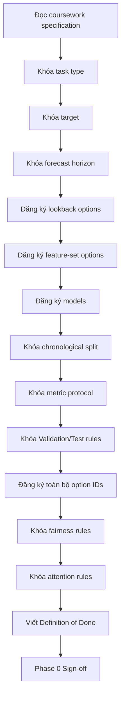

<div align="center">

# PHASE 0 — COURSEWORK CONTRACT

## Kế hoạch đặc tả và khóa phạm vi thực nghiệm

### Transformer Encoder cho hồi quy chuỗi thời gian đa biến trên UCI Appliances Energy Prediction

</div>

---

# 1. Vai trò của Phase 0

Phase 0 là giai đoạn **định nghĩa hợp đồng thực nghiệm** cho toàn bộ coursework.

Phase này chưa tải dữ liệu, chưa xây mô hình và chưa huấn luyện. Nhiệm vụ của nó là khóa rõ:

```text
Bài toán đang giải là gì?
Target là gì?
Input được phép chứa gì?
Forecast horizon là bao nhiêu?
Những lookback nào sẽ được thử?
Những mô hình nào bắt buộc phải có?
Metric nào dùng để chọn mô hình?
Validation và Test được phép dùng cho việc gì?
Những option nào phải được thử?
Những hành vi nào bị cấm để tránh leakage?
Khi nào coursework được xem là hoàn thành?
```

Phase 0 phải trở thành **nguồn sự thật duy nhất** cho mọi phase sau.

Nếu không khóa rõ từ đầu, coursework rất dễ gặp:

```text
Scope creep
Thay đổi target giữa chừng
Tuning trên test set
So sánh LSTM và Transformer không công bằng
Thay đổi split sau khi xem kết quả
Data leakage
Cherry-picking
Attention analysis không dùng đúng model cuối
```

---

# 2. Mục tiêu cần đạt

Sau Phase 0 phải trả lời được:

```text
1. Coursework chính xác yêu cầu gì?
2. Bài toán được mô hình hóa dưới dạng regression nào?
3. Một sample có input và target như thế nào?
4. Forecast horizon chính là bao nhiêu?
5. Những lookback nào sẽ được thử?
6. Feature-set chính và các ablation là gì?
7. Baseline nào bắt buộc?
8. Transformer chính thuộc kiến trúc nào?
9. LSTM đóng vai trò gì?
10. Persistence baseline có giữ không?
11. Metric nào dùng chọn checkpoint?
12. Metric nào dùng báo cáo cuối?
13. Validation dùng cho việc gì?
14. Test được dùng khi nào?
15. Attention được phân tích theo nguyên tắc nào?
16. Các hyperparameter option nào bắt buộc phải thử?
17. Những hành vi nào bị cấm để tránh leakage?
18. Tiêu chí khóa model cuối là gì?
19. Definition of Done là gì?
```

Nếu còn mục nào chưa rõ thì Phase 0 chưa hoàn thành.

---

# 3. Nguồn đầu vào của Phase 0

Coursework specification:

```text
Multivariate Time-Series Regression

Goal:
Predict energy consumption from past multivariate readings.

Dataset:
UCI Appliances Energy Prediction

Model:
Transformer Encoder for regression

Task Type:
Regression

Extension:
Compare with LSTM baseline
Analyze attention maps
```

Phase 0 cũng kế thừa các option trong master plan:

```text
Lookback: 36 / 72 / 144
Feature sets: FS0 / FS1 / FS2
Time features: TF0 / TF1
Target scaling: YS0 / YS1
Pooling: Last-step / Mean
Activation: ReLU / GELU
Batch: 32 / 64
Learning rate: 1e-4 / 3e-4 / 1e-3
Weight decay: 0 / 1e-4 / 1e-3 / 1e-2
Dropout: 0.1 / 0.2 / 0.3
d_model: 32 / 64
Heads: 2 / 4
Layers: 1 / 2
FFN: 64 / 128 / 256
Loss: MSE / Huber
Epoch cap: 50 / 100
Gradient clipping: Off / 1.0
RevIN: Off / On
Boundary protocol: Carry-over / Strict isolation
Rolling-origin validation
Seeds: 42 / 123 / 2026
```

---

# 4. Những việc Phase 0 không thực hiện

```text
Không tải CSV.
Không chạy EDA.
Không kiểm tra missing values bằng code.
Không tạo sliding windows.
Không fit scaler.
Không tạo DataLoader.
Không xây LSTM.
Không xây Transformer.
Không train model.
Không xem test metrics.
Không trích attention maps.
Không chọn hyperparameter dựa vào dữ liệu.
```

Phase 0 chỉ:

```text
Định nghĩa
Chuẩn hóa
Đặt tên
Khóa protocol
Xác định tiêu chí lựa chọn
```

---

# 5. Đặc tả bài toán

Loại bài toán:

```text
Multivariate Time-Series Regression
```

Input:

```text
Một chuỗi nhiều biến trong quá khứ
```

Output:

```text
Một giá trị liên tục trong tương lai
```

Không phải:

```text
Classification
Static tabular regression
Same-time regression
Sequence generation
```

---

# 6. Target contract

Target:

```text
Appliances
```

Đơn vị báo cáo:

```text
Wh
```

Mô hình dự đoán:

\[
\hat{y}\in\mathbb{R}
\]

Không:

```text
LOW / MEDIUM / HIGH
Softmax output
```

---

# 7. Forecasting-sample contract

Với lookback \(L\) và horizon \(H\):

\[
X_t=[x_{t-L+1},...,x_t]
\]

\[
y_t=Appliances_{t+H}
\]

Do đó:

\[
\boxed{X_{t-L+1:t}\rightarrow Appliances_{t+H}}
\]

---

# 8. Forecast-horizon contract

Khóa:

\[
\boxed{H=1}
\]

Với sampling 10 phút:

```text
H = 1
→ dự báo 10 phút tiếp theo
```

Không thay horizon trong main coursework.

Multi-horizon chỉ được xem là extension ngoài contract chính.

---

# 9. Lookback contract

Phải thử tất cả:

| ID | Lookback | Ý nghĩa |
|---|---:|---|
| `L36` | 36 | 6 giờ |
| `L72` | 72 | 12 giờ |
| `L144` | 144 | 24 giờ |

Baseline:

```text
L144
```

Nhưng không được tuyên bố `L144` tối ưu trước Phase 26.

---

# 10. Feature-set contract

## FS0 — Exogenous-only

```text
Temperature
Humidity
Weather
lights
Calendar/time features
```

Không có:

```text
past Appliances
```

## FS1 — Autoregressive + Exogenous

```text
Past Appliances
+
Temperature
+
Humidity
+
Weather
+
lights
+
Calendar/time features
```

Baseline chính:

```text
FS1
```

## FS2 — Random-control ablation

```text
FS1 + rv1 + rv2
```

Mục tiêu:

```text
Kiểm tra random controls và nguy cơ overfitting.
```

FS2 chỉ là ablation.

---

# 11. Time-feature contract

Phải thử:

```text
TF0 = Không calendar features
TF1 = hour_sin, hour_cos, dow_sin, dow_cos, weekend
```

Baseline:

```text
TF1
```

Raw `date` không đưa trực tiếp vào model.

---

# 12. Target-scaling contract

Phải thử:

```text
YS0 = Không scale target
YS1 = Standardize target bằng Train mean/std
```

Baseline:

```text
YS1
```

Nếu dùng YS1:

\[
y'=\frac{y-\mu_{train,y}}{\sigma_{train,y}}
\]

Evaluation cuối:

```text
inverse-transform
→ MAE/RMSE/R² trên Wh gốc
```

---

# 13. Split contract

Primary split:

```text
Train      = 70% đầu timeline
Validation = 15% tiếp theo
Test       = 15% cuối timeline
```

Không:

```text
random split
shuffle trước split
random split windows
```

Sample membership nên dựa trên:

```text
target timestamp
```

---

# 14. Validation contract

Validation được phép dùng cho:

```text
Early stopping
Checkpoint selection
Feature-set selection
Time-feature selection
Target-scaling selection
Lookback selection
Pooling selection
Activation selection
Batch-size selection
Learning-rate selection
Weight-decay selection
Dropout selection
d_model selection
Head selection
Layer selection
FFN selection
Loss selection
Epoch-cap analysis
Gradient-clipping analysis
RevIN analysis
Candidate synthesis
```

Validation không phải final unbiased estimate.

---

# 15. Test-set contract

Test chỉ được dùng sau khi khóa:

```text
Feature set
Lookback
Scaling
LSTM configuration
Transformer architecture
Loss
Regularization
Rolling-origin analysis
Final seeds
```

Sau khi xem test:

```text
Không quay lại tune model.
```

Nếu thay đổi model sau đó phải ghi nhận protocol violation.

---

# 16. Window-boundary contract

Phải thử cả:

## WB0 — Context Carry-over

Validation/Test target có thể dùng historical context từ giai đoạn trước nếu:

```text
input timestamp < target timestamp
không có future target
scaler vẫn fit Train-only
```

Đây là primary realistic forecasting protocol.

## WB1 — Strict Isolation

```text
Input của một split phải nằm hoàn toàn trong split đó.
```

Mục tiêu:

```text
methodological sensitivity analysis
```

---

# 17. Model contract

## M0 — Persistence

\[
\hat y_{t+1}=y_t
\]

Vai trò:

```text
Naive forecasting floor
```

## M1 — LSTM

Vai trò:

```text
Required recurrent deep-learning baseline
```

## M2 — Transformer Encoder

Vai trò:

```text
Main coursework model
```

Không thay M2 bằng:

```text
Informer
Autoformer
PatchTST
iTransformer
TFT
TimesFM
Chronos
```

---

# 18. Transformer architecture contract

```text
Input [B,L,F]
        ↓
Linear Input Projection
        ↓
Sinusoidal Positional Encoding
        ↓
Transformer Encoder
        ↓
Temporal Pooling
        ↓
Linear Regression Head
        ↓
Prediction [B,1]
```

Output là một scalar liên tục.

---

# 19. Attention-aware contract

Transformer phải được thiết kế để:

```text
return_attention=False
```

khi training và:

```text
return_attention=True
```

khi phân tích.

Attention phải lấy từ:

```text
chính final trained Transformer
```

không phải một model dựng lại sau này.

---

# 20. Pooling options

```text
P0 = Last-step
P1 = Mean pooling
```

Baseline:

```text
P0
```

---

# 21. Activation options

```text
A0 = ReLU
A1 = GELU
```

Phải thử cả hai.

---

# 22. Transformer-capacity options

```text
D32 = d_model 32
D64 = d_model 64

H2 = 2 heads
H4 = 4 heads

N1 = 1 encoder layer
N2 = 2 encoder layers

F64  = FFN 64
F128 = FFN 128
F256 = FFN 256
```

Constraint:

\[
d_{model}\bmod n_{heads}=0
\]

---

# 23. Dropout options

```text
DR01 = 0.1
DR02 = 0.2
DR03 = 0.3
```

Baseline:

```text
0.1
```

---

# 24. Optimizer contract

Main optimizer:

```text
AdamW
```

Không thay optimizer giữa main sweeps trừ khi có extension mới được khai báo.

---

# 25. Learning-rate options

```text
LR1 = 1e-4
LR2 = 3e-4
LR3 = 1e-3
```

Baseline:

```text
3e-4
```

---

# 26. Weight-decay options

```text
WD0 = 0
WD1 = 1e-4
WD2 = 1e-3
WD3 = 1e-2
```

Selection bằng validation RMSE.

---

# 27. Loss options

```text
L0 = MSE
L1 = Huber
```

Huber experiment chính:

```text
YS1
delta = 1.0
```

vì delta=1.0 có ý nghĩa rõ hơn trên standardized target.

---

# 28. Batch-size options

```text
B32 = 32
B64 = 64
```

Training DataLoader sau này:

```text
shuffle=True
```

Validation/Test:

```text
shuffle=False
```

---

# 29. Epoch-cap options

```text
E50  = 50
E100 = 100
```

Cả hai bật early stopping.

---

# 30. Early-stopping contract

Primary:

```text
monitor = Validation RMSE
patience = 10
```

Sensitivity:

```text
8
10
12
```

Checkpoint:

```text
lowest Validation RMSE
```

---

# 31. Gradient-clipping options

```text
GC0 = Off
GC1 = clip_grad_norm max_norm 1.0
```

Vai trò:

```text
Optimization stability
```

không phải anti-overfitting mechanism chính.

---

# 32. RevIN contract

```text
RN0 = Off
RN1 = On
```

RevIN được xem là:

```text
distribution-shift ablation
```

không phải baseline bắt buộc.

---

# 33. Experiment-strategy contract

Không full Cartesian search.

Dùng:

```text
B0 Baseline
        ↓
One-Factor Controlled Sweeps
        ↓
Candidate Synthesis
        ↓
Rolling-Origin Robustness
        ↓
Final Model Lock
        ↓
Three-Seed Runs
        ↓
Untouched Test
```

Mỗi sweep chỉ thay một yếu tố chính.

---

# 34. Baseline Transformer B0

```text
Feature set       = FS1
Time features     = TF1
Target scaling    = YS1
RevIN             = RN0
Lookback          = 144
Horizon           = 1

d_model           = 64
heads             = 4
layers            = 2
FFN               = 128
dropout           = 0.1
activation        = GELU
pooling           = Last-step

batch_size        = 64
learning_rate     = 3e-4
weight_decay      = 1e-4
loss              = MSE
max_epochs        = 50
patience          = 10
gradient_clip     = 1.0
seed              = 42
```

B0 là reference configuration, không phải optimum.

---

# 35. Option registry

| Nhóm | ID | Option |
|---|---|---|
| Feature set | FS0 | Exogenous-only |
| Feature set | FS1 | Past target + Exogenous |
| Feature set | FS2 | FS1 + rv1 + rv2 |
| Time feature | TF0 | Off |
| Time feature | TF1 | Cyclic calendar |
| Target scaling | YS0 | Off |
| Target scaling | YS1 | Standardize |
| Lookback | L36 | 6 h |
| Lookback | L72 | 12 h |
| Lookback | L144 | 24 h |
| Pooling | P0 | Last-step |
| Pooling | P1 | Mean |
| Activation | A0 | ReLU |
| Activation | A1 | GELU |
| Batch | B32 | 32 |
| Batch | B64 | 64 |
| LR | LR1 | `1e-4` |
| LR | LR2 | `3e-4` |
| LR | LR3 | `1e-3` |
| Weight decay | WD0 | 0 |
| Weight decay | WD1 | `1e-4` |
| Weight decay | WD2 | `1e-3` |
| Weight decay | WD3 | `1e-2` |
| Dropout | DR01 | 0.1 |
| Dropout | DR02 | 0.2 |
| Dropout | DR03 | 0.3 |
| d_model | D32 | 32 |
| d_model | D64 | 64 |
| Heads | H2 | 2 |
| Heads | H4 | 4 |
| Layers | N1 | 1 |
| Layers | N2 | 2 |
| FFN | F64 | 64 |
| FFN | F128 | 128 |
| FFN | F256 | 256 |
| Loss | L0 | MSE |
| Loss | L1 | Huber |
| Epoch cap | E50 | 50 |
| Epoch cap | E100 | 100 |
| Gradient clip | GC0 | Off |
| Gradient clip | GC1 | 1.0 |
| RevIN | RN0 | Off |
| RevIN | RN1 | On |
| Boundary | WB0 | Context carry-over |
| Boundary | WB1 | Strict isolation |

Naming convention này phải được giữ nguyên ở các phase sau.

---

# 36. Metric contract

Primary selection metric:

\[
\boxed{Validation\ RMSE}
\]

Supporting metrics:

\[
MAE=\frac1N\sum_i|y_i-\hat y_i|
\]

\[
R^2=
1-
\frac{\sum_i(y_i-\hat y_i)^2}
{\sum_i(y_i-\bar y)^2}
\]

Final report:

```text
MAE
RMSE
R²
```

trên original Wh scale.

---

# 37. Generalization contract

Trong training phải theo dõi:

```text
Train MAE
Validation MAE
Train RMSE
Validation RMSE
Train R²
Validation R²
```

Tính:

\[
Gap_{RMSE}=RMSE_{val}-RMSE_{train}
\]

Không dùng một threshold cố định để tự động kết luận overfitting.

Phải xem:

```text
learning curves
gap trend
best epoch
distribution shift
```

---

# 38. Rolling-origin contract

Rolling-origin chạy sau candidate synthesis.

Đối tượng:

```text
Top Transformer candidates
Best LSTM
Persistence
```

Mọi fold phải nằm trước final test period.

Mục tiêu:

```text
temporal robustness
giảm rủi ro overfit một validation block
```

---

# 39. Multiple-seed contract

Final models chạy:

```text
42
123
2026
```

Áp dụng cho:

```text
Final Transformer
Final LSTM
```

Report:

\[
mean\pm std
\]

Persistence không cần seed.

---

# 40. Attention-analysis contract

Chỉ phân tích:

```text
Final locked Transformer
```

Phải thực hiện:

```text
Per-head heatmaps
Average attention
Last-query attention
Head comparison
Low-error vs high-error attention
Normal vs spike attention
Seed-stability attention
```

---

# 41. Attention interpretation rule

Không viết:

```text
Attention chứng minh timestamp X gây ra prediction.
```

Chỉ viết theo hướng:

```text
Timestamp X nhận attention weight cao hơn
trong phép tính self-attention của sample này.
```

Attention là:

```text
model-behavior inspection
```

không phải causal proof.

---

# 42. Final-model selection contract

Thứ tự ưu tiên:

```text
1. Run hợp lệ, không leakage.
2. Validation RMSE cạnh tranh.
3. Rolling-origin robustness.
4. Generalization gap.
5. Parameter count.
6. Training stability.
7. Training time.
```

Test không được tham gia selection.

---

# 43. Fairness contract LSTM vs Transformer

Phải dùng cùng:

```text
forecast horizon
feature set
lookback
target
split
window protocol
scalers
target scaling
training samples
metrics
early stopping criterion
```

Có thể khác:

```text
architecture-specific parameters
learning rate nếu được tune công bằng
```

---

# 44. Reproducibility contract

Phase 1 sẽ triển khai nhưng Phase 0 phải yêu cầu lưu:

```text
Python version
PyTorch version
NumPy version
Pandas version
Scikit-learn version
Device
Seed
Experiment ID
Final config
Parameter count
Training time
Best epoch
```

---

# 45. Experiment-registry contract

Mỗi run phải lưu tối thiểu:

```text
run_id
seed
feature_set
time_features
target_scaling
RevIN
lookback
horizon
pooling
activation
d_model
heads
layers
FFN
dropout
batch_size
learning_rate
weight_decay
loss
max_epochs
patience
gradient_clip
parameter_count
best_epoch
train_mae
train_rmse
train_r2
val_mae
val_rmse
val_r2
generalization_gap
training_time
checkpoint_path
status
notes
```

---

# 46. Protocol violations

Run không được dùng làm evidence chính nếu:

```text
Scaler fit trên full dataset.

Random split windows.

Future target hoặc unavailable future feature nằm trong input.

Test được dùng để tune.

Hyperparameter bị đổi sau khi xem test.

LSTM và Transformer dùng split khác.

Metrics chưa inverse-transform nhưng báo như Wh.

Checkpoint chọn theo train loss.

Attention lấy từ model khác final Transformer.

Run thiếu config hoặc seed.
```

---

# 47. Cấu trúc notebook Phase 0

Khoảng:

```text
6–8 Markdown cells
+
tối đa 1 config cell
```

## Cell 0.1 — Title

## Cell 0.2 — Coursework specification

## Cell 0.3 — Problem definition

## Cell 0.4 — Research questions

## Cell 0.5 — Experimental contract

## Cell 0.6 — Option registry

## Cell 0.7 — Leakage/Fairness/Attention rules

## Cell 0.8 — Definition of Done

Optional config cell:

```python
COURSEWORK_CONTRACT = {...}
```

Không import package hoặc chạy computation nặng ở Phase 0.

---

# 48. Machine-readable contract đề xuất

```python
COURSEWORK_CONTRACT = {
    "task": "multivariate_time_series_regression",
    "dataset": "UCI Appliances Energy Prediction",
    "target": "Appliances",
    "sampling_minutes": 10,
    "forecast_horizon": 1,
    "lookbacks": [36, 72, 144],
    "primary_lookback": 144,
    "split": {
        "train": 0.70,
        "validation": 0.15,
        "test": 0.15,
        "type": "chronological",
    },
    "selection_metric": "validation_rmse",
    "final_metrics": ["mae", "rmse", "r2"],
    "models": ["persistence", "lstm", "transformer_encoder"],
    "final_seeds": [42, 123, 2026],
}
```

Đây là metadata contract, chưa phải training config đầy đủ.

---

# 49. Quy trình thực thi Phase 0



---

# 50. Sign-off checklist

```text
[ ] Task type đã khóa.
[ ] Target đã khóa.
[ ] Unit Wh đã ghi.
[ ] H=1 đã khóa.
[ ] L36/L72/L144 đã đăng ký.
[ ] FS0/FS1/FS2 đã định nghĩa.
[ ] TF0/TF1 đã định nghĩa.
[ ] YS0/YS1 đã định nghĩa.
[ ] WB0/WB1 đã định nghĩa.
[ ] Persistence đã giữ.
[ ] LSTM đã giữ.
[ ] Transformer Encoder đã giữ.
[ ] Pooling options đã ghi.
[ ] Activation options đã ghi.
[ ] Capacity options đã ghi.
[ ] Dropout options đã ghi.
[ ] LR options đã ghi.
[ ] Weight-decay options đã ghi.
[ ] Loss options đã ghi.
[ ] Epoch-cap options đã ghi.
[ ] Gradient clipping options đã ghi.
[ ] RevIN options đã ghi.
[ ] Validation RMSE là selection metric.
[ ] MAE/RMSE/R² là final metrics.
[ ] Split 70/15/15 chronological đã khóa.
[ ] Test-use policy đã khóa.
[ ] Rolling-origin đã đăng ký.
[ ] Three-seed protocol đã đăng ký.
[ ] Attention protocol đã khóa.
[ ] Causality warning đã ghi.
[ ] Experiment registry đã định nghĩa.
[ ] Protocol violations đã định nghĩa.
[ ] Definition of Done đã ghi.
```

---

# 51. Output bắt buộc của Phase 0

## O0.1 — Problem statement

Định nghĩa chính xác:

```text
Past multivariate sequence
→ Appliances 10 minutes ahead
```

## O0.2 — RQ1–RQ7

## O0.3 — Coursework contract table

```text
Task
Target
Horizon
Split
Models
Metrics
Validation/Test policy
```

## O0.4 — Option registry

## O0.5 — Anti-leakage rules

## O0.6 — Fair-comparison rules

## O0.7 — Attention rules

## O0.8 — Definition of Done

## O0.9 — Machine-readable contract

Rất nên có.

---

# 52. Tiêu chí chất lượng

Phase 0 đạt chuẩn khi:

```text
Không còn ambiguity về target.

Không còn ambiguity về horizon.

Không còn ambiguity về primary metric.

Không còn ambiguity về Validation/Test.

Không bỏ option nào.

Naming convention nhất quán.

Không gọi bất kỳ hyperparameter nào là optimal trước thực nghiệm.

Baseline và fairness rules đã khóa.

Leakage policy rõ.

Attention guardrail rõ.

Definition of Done rõ.
```

---

# 53. Các lỗi thường gặp

## Lỗi 1

```text
L144 là tốt nhất.
```

Sai.

Đúng:

```text
L144 là baseline; L36/L72/L144 sẽ được so sánh.
```

## Lỗi 2

```text
Transformer sẽ vượt LSTM.
```

Sai.

Đúng:

```text
Coursework kiểm tra liệu Transformer có vượt LSTM hay không.
```

## Lỗi 3

Gọi RevIN đơn giản là:

```text
anti-overfitting layer
```

Không chuẩn.

Nên xem RevIN là:

```text
distribution-shift normalization experiment
```

## Lỗi 4

Không khóa test policy.

## Lỗi 5

Không đặt ID cho options.

## Lỗi 6

Không chọn primary selection metric.

Phase 0 khóa:

```text
Validation RMSE
```

---

# 54. Điều kiện chuyển Phase 1

Chỉ chuyển sang:

```text
PHASE 1 — Environment
```

khi Phase 0 sign-off hoàn tất.

Không nên:

```text
cài môi trường
tải data
viết model
```

rồi mới quay lại thay target hoặc forecasting definition.

Nếu Phase 0 thay đổi sau khi đã chạy nhiều experiment:

```text
ghi protocol amendment:
what changed
why
prior runs nào trở nên incomparable
```

---

# 55. Kết luận Phase 0

Phase 0 có thể cô đọng thành:

\[
\boxed{
Define
+
Freeze
+
Name
+
Protect
}
\]

Trong đó:

```text
Define:
Định nghĩa bài toán.

Freeze:
Khóa protocol.

Name:
Đặt ID thống nhất.

Protect:
Ngăn leakage, unfair comparison và test tuning.
```

Sau Phase 0, các phase còn lại chỉ cần thực thi contract đã thống nhất.

---

<div align="center">

# PHASE 0 — DEFINITION OF DONE

**Coursework specification đã được chuyển thành một experimental contract rõ ràng.**

**Target, horizon, options, models, metrics, split, validation/test policy và attention rules đã được khóa.**

**Không có training hoặc data-dependent model selection nào xảy ra trong Phase 0.**

**Chỉ sau khi sign-off mới chuyển sang Phase 1.**

</div>
