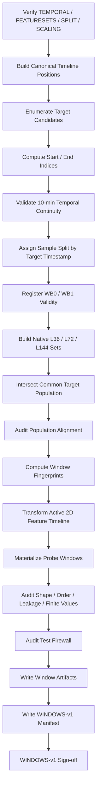
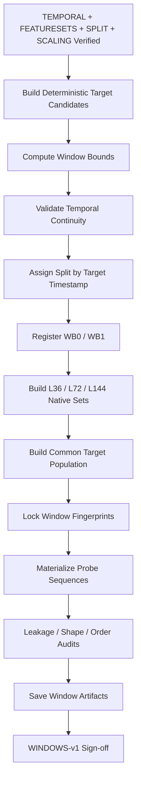

<div align="center">

# PHASE 10 — WINDOW BUILDER

## Kế hoạch xây dựng sliding windows, khóa sample population và chống temporal leakage

### Transformer Encoder cho hồi quy chuỗi thời gian đa biến trên UCI Appliances Energy Prediction

**Phase kế tiếp sau `Phase_9_Train_only_scaling.md`**

</div>

---

# 1. Vai trò của Phase 10

Phase 10 chịu trách nhiệm chuyển timeline đã được:

```text
kiểm toán temporal integrity,
gán feature variants,
chia Train/Validation/Test,
và chuẩn hóa bằng Train-only statistics
```

thành các **forecasting samples dạng sequence-to-one** cho LSTM và Transformer.

Nếu:

```text
Phase 8
→ khóa SPLIT-v1

Phase 9
→ khóa SCALING-v1
```

thì:

```text
Phase 10
→ khóa WINDOWS-v1
```

Phase này phải xác định chính xác:

```text
Một sample bắt đầu ở row nào?

Input kết thúc ở timestamp nào?

Target nằm ở timestamp nào?

Một sample có thực sự đủ L observations hay không?

Mọi bước trong input có thực sự cách nhau 10 phút hay không?

Target có thực sự nằm H bước thời gian sau input cuối hay không?

Sample thuộc TRAIN / VALIDATION / TEST dựa trên gì?

Validation/Test có được dùng context từ period trước không?

Lookback 36/72/144 có được so trên cùng target population không?

Feature variants có dùng cùng sample population không?

Target scaling có làm thay sample population không?

Có nên materialize toàn bộ tensor windows hay dùng lazy indexing?

Làm sao giữ Test firewall?

Làm sao chuẩn bị metadata cho attention analysis sau này?
```

Nguyên tắc cốt lõi:

\[
\boxed{
Index\ First
+
Validate\ Time
+
Assign\ by\ Target
+
Materialize\ Lazily
+
Never\ Cross\ Gaps
}
\]

---

# 2. Bài toán forecasting chính thức

Coursework contract:

\[
X_{t-L+1:t}
\rightarrow
Appliances_{t+H}
\]

Primary horizon:

\[
\boxed{H=1}
\]

Sampling interval:

```text
10 phút
```

Do đó:

\[
\boxed{
H=1
\Rightarrow
10\text{-minute-ahead forecasting}
}
\]

Lookback options:

```text
L36
L72
L144
```

tương ứng với:

```text
6 giờ
12 giờ
24 giờ lịch sử
```

---

# 3. Input shape contract

Với một feature variant có:

```text
F channels
```

một sample có:

\[
X\in\mathbb{R}^{L\times F}
\]

Sau batching:

\[
X_{batch}
\in
\mathbb{R}^{B\times L\times F}
\]

Đây là format dùng chung cho:

```text
LSTM với batch_first=True

Transformer Encoder với batch-first implementation
```

---

# 4. Target shape contract

Regression head trả:

\[
\hat y\in\mathbb{R}^{B\times1}
\]

Do đó target được chuẩn hóa shape:

```text
per sample:
[1]

per batch:
[B, 1]
```

Không dùng broadcasting ngầm giữa:

```text
[B]
và
[B,1]
```

trong loss.

---

# 5. Sequence direction contract

Input sequence luôn theo:

```text
oldest
→
newest
```

Tức:

```text
X[0]
=
quan sát xa target nhất

X[-1]
=
quan sát gần target nhất
```

Không đảo sequence.

Điều này rất quan trọng cho:

```text
LSTM recurrence
Transformer positional encoding
attention-map interpretation
```

---

# 6. Ví dụ với L = 144, H = 1

Nếu target là:

```text
2026-... 12:00
```

thì input cuối:

```text
11:50
```

input đầu:

```text
12:00 ngày trước
```

Input chứa các lags:

```text
1440 phút
1430 phút
...
20 phút
10 phút
```

so với target.

Có:

```text
144 observations.
```

---

# 7. Off-by-one nuance rất quan trọng

Với:

```text
L=144
H=1
interval=10 phút
```

input đầu cách target:

```text
144 × 10 = 1440 phút = 24 giờ
```

nhưng khoảng thời gian giữa:

```text
input đầu
và
input cuối
```

là:

```text
143 × 10 = 1430 phút = 23 giờ 50 phút
```

Điều này hoàn toàn đúng.

Không được sửa thành:

```text
145 observations
```

chỉ vì muốn first-to-last span bằng đúng 24 giờ.

---

# 8. Indexing formula tổng quát

Giả sử:

```text
target timeline position = j
```

Forecast horizon:

```text
H
```

Input end index:

\[
e=j-H
\]

Input start index:

\[
s=e-L+1
\]

hay:

\[
\boxed{
s=j-H-L+1
}
\]

Input:

\[
X = rows[s:e]
\]

theo inclusive mathematical indexing:

\[
s,s+1,\ldots,e
\]

Target:

\[
y = Appliances_j
\]

---

# 9. Với H = 1

Ta có:

\[
e=j-1
\]

\[
s=j-L
\]

Do đó:

```text
target row j

input rows:
j-L
...
j-1
```

Input tuyệt đối không chứa:

```text
row j
```

---

# 10. Hard target-leakage assertion

Với mọi sample:

\[
target\_index
>
input\_end\_index
\]

và:

\[
target\_index
\notin
input\_indices
\]

Với H=1:

\[
target\_index
=
input\_end\_index+1
\]

ở timeline index nếu chuỗi liên tục.

---

# 11. Temporal-delta assertion

Không chỉ kiểm tra row offset.

Phải kiểm tra:

\[
timestamp_{target}
-
timestamp_{input,end}
=
H\times10\text{ phút}
\]

Với H=1:

\[
\boxed{10\text{ phút}}
\]

---

# 12. Input continuity assertion

Với mọi hai input timestamps liên tiếp:

\[
timestamp_{k+1}
-
timestamp_k
=
10\text{ phút}
\]

Nếu bất kỳ delta khác:

```text
window invalid
```

---

# 13. Continuity-segment assertion

Phase 4 đã tạo:

```text
continuity_segment_id
```

Một valid primary window phải có:

```text
input start
input end
target
```

thuộc cùng một continuity segment đối với H=1.

Hard check:

```text
segment(input_start)
=
segment(input_end)
=
segment(target)
```

---

# 14. Vì sao cần cả segment check và timestamp-delta check?

Segment ID:

```text
nhanh
```

và phản ánh audit từ Phase 4.

Timestamp delta:

```text
là evidence trực tiếp
```

và bảo vệ khỏi lỗi metadata.

Do đó Phase 10 dùng:

```text
cả hai.
```

---

# 15. Input contract của Phase 10

Phase 10 chỉ bắt đầu khi:

```text
Phase 4 = PASS / PASS_WITH_WARNING
Phase 7 = PASS
Phase 8 = PASS
Phase 9 = PASS
```

và có:

```text
TEMPORAL-v1
FEATURES-v1
FEATURESETS-v1
SPLIT-v1
SCALING-v1
```

---

# 16. Lineage phải xác minh trước khi build

Phải verify:

```text
FEATURES-v1 checksum

FEATURESETS-v1 fingerprints

SPLIT-v1 global fingerprint

SCALING-v1 scaler fingerprints

TEMPORAL-v1 continuity contract
```

Nếu bất kỳ mismatch:

```text
STOP
```

---

# 17. Output version

Gán:

```text
WINDOWS-v1
```

Lineage:

```text
DATA-v1
   ↓
SCHEMA-v1
   ↓
TEMPORAL-v1
   ↓
FEATURES-v1
   ↓
FEATURESETS-v1
   ↓
SPLIT-v1
   ↓
SCALING-v1
   ↓
WINDOWS-v1
```

---

# 18. Window builder phải deterministic

Phase 10 không sử dụng randomness.

Cùng:

```text
timeline
lookback
horizon
boundary protocol
```

phải tạo:

```text
same sample IDs
same indices
same counts
same fingerprints
```

---

# 19. Seed không ảnh hưởng window construction

Không sử dụng:

```text
SEED=42
```

để build window.

Seed chỉ liên quan:

```text
model initialization
DataLoader shuffling
```

ở các phase sau.

---

# 20. Xây index trước, materialize data sau

Đây là thiết kế chính của Phase 10.

Không bắt đầu bằng:

```text
copy 144 rows × features
cho mọi sample
```

Mà:

```text
STEP 1:
build window metadata/index

STEP 2:
validate sample population

STEP 3:
transform active feature timeline

STEP 4:
slice lazily khi Dataset yêu cầu
```

---

# 21. Vì sao `Index First` tốt hơn?

Lợi ích:

```text
Feature variants dùng cùng sample population.

LSTM và Transformer dùng cùng samples.

YS0 và YS1 dùng cùng samples.

Không duplicate data lớn.

Dễ audit temporal leakage.

Dễ giữ Test firewall.

Dễ so lookback.

Dễ truy ngược sample về raw timeline.
```

---

# 22. Không materialize toàn bộ 3D windows mặc định

Không khuyến nghị lưu:

```text
X_FS0_L36.npy
X_FS1_L36.npy
X_FS2_L36.npy
X_FS0_L72.npy
...
```

vì:

```text
rất nhiều dữ liệu bị lặp giữa overlapping windows;

nhiều feature variants tạo storage redundancy;

dễ version drift;

sample population có thể vô tình lệch.
```

Canonical source of truth:

```text
2D feature timeline
+
window indices.
```

---

# 23. Lazy-window strategy

Cho một active feature variant:

```text
scaled feature matrix:
[N, F]
```

Mỗi sample chỉ lưu:

```text
start_idx
end_idx
target_idx
```

Khi cần:

```python
X = feature_matrix[start_idx:end_idx + 1]
```

và:

```python
y = target_array[target_idx]
```

---

# 24. Tại sao 2D feature matrix phù hợp?

Dataset chỉ khoảng:

```text
20k timestamps
```

và tối đa khoảng:

```text
33 model channels
```

nên 2D matrix nhỏ hơn rất nhiều so với mọi 3D window copy.

---

# 25. Không fit scaler trên flattened windows

Bị cấm:

```text
build overlapping windows
→ flatten all time positions
→ fit StandardScaler
```

Lý do:

```text
một timestamp có thể xuất hiện trong rất nhiều windows;

statistics sẽ bị weighted nhiều lần;

statistics phụ thuộc lookback;

vi phạm SCALING-v1.
```

Scaler đã được khóa ở Phase 9:

```text
Train row-level statistics.
```

---

# 26. Thứ tự đúng giữa indexing và scaling

Canonical:

```text
Temporal metadata
→ Build window indices
→ Load Train-fitted scaler
→ Transform 2D feature timeline
→ Lazy slice windows
```

Index validity không phụ thuộc feature scaling.

---

# 27. Feature-variant independence

Window metadata tuyệt đối không phụ thuộc:

```text
FS0
FS1
FS2
TF0
TF1
```

Tất cả variants dùng:

```text
same target indices
```

cho cùng lookback/protocol.

---

# 28. Target-scaling independence

Window metadata cũng không phụ thuộc:

```text
YS0
YS1
```

Target scaling chỉ thay:

```text
representation của y dùng cho loss.
```

Không thay:

```text
sample identity
```

---

# 29. Model independence

Persistence, LSTM, Transformer phải dùng:

```text
same target population
```

khi comparison yêu cầu fairness.

---

# 30. Window candidate generation

Phase 10 nên enumerate candidates theo:

```text
target timeline position
```

Không theo:

```text
input start
```

Pseudo logic:

```text
for each target row j:
    compute e = j - H
    compute s = e - L + 1
    validate
```

---

# 31. Candidate validation order

Khuyến nghị:

```text
1. target row exists

2. sufficient history

3. input indices valid

4. timestamps valid

5. continuity segment valid

6. input deltas valid

7. target horizon delta valid

8. target split membership valid

9. WB protocol valid

10. register sample
```

---

# 32. Insufficient-history rejection

Nếu:

\[
s<0
\]

sample bị reject:

```text
INSUFFICIENT_HISTORY
```

Không:

```text
pad zeros
repeat first row
```

trong baseline.

---

# 33. Gap rejection

Nếu window crossing:

```text
temporal gap
```

reject:

```text
INPUT_GAP
```

Không interpolate.

---

# 34. Target-gap rejection

Nếu:

```text
input end
→ target
```

không đúng H×10 phút:

```text
TARGET_GAP
```

---

# 35. Duplicate timestamp rejection

Nếu temporal contract cho biết ambiguous duplicate:

```text
DUPLICATE_TIMESTAMP
```

Không build sample cho đến khi temporal resolution policy rõ.

---

# 36. Off-grid rejection

Nếu timestamp không nằm đúng grid:

```text
OFF_GRID_TIMESTAMP
```

---

# 37. Target-not-future rejection

Nếu:

\[
timestamp_{target}
\le
timestamp_{input,end}
\]

reject:

```text
TARGET_NOT_FUTURE
```

---

# 38. Window rejection reason taxonomy

Canonical:

```text
VALID
INSUFFICIENT_HISTORY
INPUT_GAP
TARGET_GAP
DUPLICATE_TIMESTAMP
OFF_GRID_TIMESTAMP
TARGET_NOT_FUTURE
INVALID_TARGET_SPLIT
WB1_CONTEXT_CROSSES_SPLIT
FEATURE_MATERIALIZATION_FAILURE
NONFINITE_X
NONFINITE_Y
OTHER
```

---

# 39. Không silently drop invalid windows

Mọi rejected candidate phải:

```text
được count
```

và optional:

```text
được export row-level.
```

Không chỉ:

```text
continue
```

mà không log.

---

# 40. Canonical timeline position

Window builder nên tạo:

```text
timeline_position
```

trên canonical sorted timeline:

```text
0
1
2
...
N-1
```

Đây là metadata only.

Không model feature.

---

# 41. Giữ `raw_row_index`

Ngoài `timeline_position`, lưu:

```text
raw_row_index
```

để truy ngược:

```text
DATA-v1.
```

---

# 42. Sample target ID

Tạo deterministic:

```text
target_sample_id
```

Ví dụ:

```text
TGT_00000144
```

ID dựa canonical timeline position.

Timestamp vẫn được lưu riêng.

---

# 43. Window ID

Canonical:

```text
WIN_L144_H01_TGT_00000144
```

Hoặc:

```text
WIN_L036_H01_TGT_...
```

Không dùng random UUID.

---

# 44. Vì sao không random UUID?

Window identity phải:

```text
deterministic
reproducible
```

Random UUID làm fingerprint thay đổi không cần thiết.

---

# 45. Window-index fields

Mỗi valid window nên có:

```text
window_id
target_sample_id

lookback_steps
horizon_steps

timeline_input_start
timeline_input_end
timeline_target

input_start_timestamp
input_end_timestamp
target_timestamp

input_start_raw_row_index
input_end_raw_row_index
target_raw_row_index

continuity_segment_id

target_split_id

input_start_split_id
input_end_split_id

crosses_split_boundary

WB0_valid
WB1_valid
```

Không chứa:

```text
target value
```

trong canonical index artifact.

---

# 46. Vì sao không lưu target value trong window index?

Đặc biệt để bảo vệ:

```text
Test firewall.
```

Index artifact chỉ là:

```text
structure
```

không phải evaluation table.

---

# 47. Target access policy

Target values được truy xuất:

## TRAIN

```text
allowed
```

## VALIDATION

```text
allowed
```

## TEST

```text
structural index allowed

target-value analysis locked
until Phase 47
```

---

# 48. Historical target assumption

FS1/FS2 sử dụng:

```text
past Appliances
```

Phase 10 phải khóa deployment assumption:

> Tại thời điểm dự báo `Appliances(t+1)`, các giá trị thực tế của `Appliances` đến và bao gồm thời điểm `t` đã được quan sát.

Do đó:

```text
Appliances_t
```

là historical input hợp lệ.

---

# 49. Điều này có áp dụng bên trong Validation/Test không?

Có.

Ví dụ Test target:

```text
12:00
```

FS1 có thể dùng actual:

```text
11:50 Appliances
```

nếu 11:50 đã xảy ra trước prediction time.

Đây là:

```text
rolling one-step forecasting with observed history
```

không phải future leakage.

---

# 50. Đây không phải free-running multi-step forecasting

Main task không yêu cầu:

```text
dùng prediction trước làm input cho prediction sau.
```

Không thực hiện:

```text
recursive forecast chain
```

trong baseline.

---

# 51. Report phải nói rõ evaluation assumption

Final methodology nên ghi:

```text
one-step-ahead forecasting

historical target values are assumed observed
at prediction time for autoregressive feature variants
```

Điều này tránh nhầm với:

```text
multi-step open-loop forecasting.
```

---

# 52. Split assignment — nguyên tắc trung tâm

Sample split được xác định bởi:

```text
target timestamp
```

Không bởi:

```text
input start
input majority
input end
```

---

# 53. TRAIN sample

Nếu:

```text
target_split_id = TRAIN
```

thì sample:

```text
TRAIN
```

và được phép:

```text
optimizer update
```

---

# 54. VALIDATION sample

Nếu:

```text
target_split_id = VALIDATION
```

sample:

```text
VALIDATION
```

không optimizer update.

---

# 55. TEST sample

Nếu:

```text
target_split_id = TEST
```

sample:

```text
TEST
```

và Test firewall áp dụng.

---

# 56. WB0 — Context Carry-over

Primary protocol:

```text
WB0
```

Một Validation/Test sample có thể dùng history từ split trước nếu:

```text
history xảy ra trước target
```

và:

```text
temporal continuity valid.
```

---

# 57. WB0 example

Validation bắt đầu:

```text
08:00
```

Target:

```text
08:00
```

L144 input có thể chứa:

```text
previous day 08:00
...
07:50
```

trong đó phần lớn history có thể nằm ở Train.

Hợp lệ.

---

# 58. Cross-boundary không đồng nghĩa leakage

Leakage được xác định theo:

```text
temporal direction
```

không theo tên split của input row.

Nếu:

\[
timestamp_{input}
<
timestamp_{target}
\]

thì historical context có thể hợp lệ.

---

# 59. WB1 — Strict Isolation

WB1 yêu cầu:

```text
mọi input row
có cùng split_id
với target row.
```

Phase 41 mới đánh giá sensitivity.

---

# 60. Phase 10 phải chuẩn bị WB1 validity flag

Dù main windows dùng WB0, mỗi window index nên lưu:

```text
WB1_valid
```

để Phase 41 không cần rebuild temporal logic từ đầu.

---

# 61. WB1 validity formula

Một sample WB1 valid nếu:

```text
input_start_split_id
=
input_end_split_id
=
target_split_id
```

và mọi input row cùng split.

---

# 62. Không tạo separate raw dataset cho WB0/WB1

Cùng:

```text
FEATURES-v1
```

và cùng temporal index.

Chỉ window eligibility khác.

---

# 63. Lookback variants

Phải build/verify:

```text
L36
L72
L144
```

với:

```text
H1
```

---

# 64. Native window populations

Mỗi lookback có native valid targets riêng:

```text
NATIVE_L36
NATIVE_L72
NATIVE_L144
```

Vì shorter lookback có thể tạo được một số targets mà longer lookback không đủ history cho phép.

---

# 65. Vấn đề fairness khi so lookback

Nếu Phase 26 so:

```text
L36 trên 10,000 targets
L144 trên 9,900 targets
```

thì metric khác có thể đến từ:

```text
lookback
hoặc
sample population khác.
```

Do đó cần common target population.

---

# 66. Common target population

Tạo:

\[
CommonTargets
=
Valid(L36)
\cap
Valid(L72)
\cap
Valid(L144)
\]

cho cùng:

```text
H1
WB0
split policy.
```

---

# 67. Với dữ liệu liên tục, common set thường bằng L144-valid targets

Nhưng Phase 10 vẫn phải:

```text
tính intersection bằng code
```

không giả định.

---

# 68. Main controlled-experiment population

Khuyến nghị:

```text
COMMON-L144-ANCHOR
```

là sample population chính cho:

```text
L36
L72
L144 comparisons
LSTM vs Transformer
feature-set sweeps
target-scaling sweeps
regularization sweeps
final model comparison
```

---

# 69. Lợi ích của common target population

Giữ cố định:

```text
target timestamps
Train sample count
Validation sample count
Test sample count
```

khi thay:

```text
lookback
feature set
model
loss
seed
```

---

# 70. Shorter lookback native extra samples

Không xóa khỏi audit.

Report:

```text
native sample count
common sample count
excluded-for-fairness count
```

Nhưng main controlled experiments dùng:

```text
common targets.
```

---

# 71. Final evaluation nên dùng common target population

Khuyến nghị giữ:

```text
same common target population
```

đến Phase 47.

Lý do:

```text
final LSTM
final Transformer
persistence
```

được đánh giá trên cùng targets.

---

# 72. Nếu final selected lookback là L36

Không tự thêm các L36-only extra target timestamps ở final test.

Nếu thêm:

```text
test population thay đổi
```

và so sánh với LSTM/persistence có thể không còn trực tiếp.

Main report giữ common population.

---

# 73. Population version

Gán:

```text
WINDOWPOP-v1
```

cho common target universe.

---

# 74. Population artifact

Tạo:

```text
common_target_population.csv
```

Fields:

```text
target_sample_id
timeline_target
target_timestamp
target_split_id
continuity_segment_id
valid_L36
valid_L72
valid_L144
included_common_population
```

---

# 75. Population split counts

Tạo:

```text
window_population_summary.csv
```

Fields:

```text
population_id
lookback
split_id
native_valid_count
common_valid_count
excluded_for_common_count
```

---

# 76. Feature variants phải dùng same population

Hard invariant:

```text
targets(FS0_TF0)
=
targets(FS0_TF1)
=
targets(FS1_TF0)
=
targets(FS1_TF1)
=
targets(FS2_TF0)
=
targets(FS2_TF1)
```

cho cùng L/protocol.

---

# 77. YS0/YS1 phải dùng same population

Hard invariant:

```text
targets(YS0)
=
targets(YS1)
```

---

# 78. LSTM/Transformer phải dùng same population

Hard invariant cho fairness.

---

# 79. Seeds phải dùng same population

```text
42
123
2026
```

chỉ thay randomness model.

Không thay windows.

---

# 80. Persistence baseline population

Persistence nên được đánh giá trên:

```text
WINDOWPOP-v1 common target set
```

để comparison công bằng.

---

# 81. Persistence target-input relation

Prediction:

\[
\hat y_{target}
=
Appliances_{input,end}
\]

Với H1:

```text
last observed actual Appliances
```

---

# 82. FS0 nuance với Persistence

FS0 model không dùng historical Appliances.

Persistence có dùng.

Do đó Persistence là:

```text
task-level naive baseline
```

không phải:

```text
same-feature-set model.
```

Nhưng dùng cùng target population.

---

# 83. Train initial warm-up

Với common L144 anchor:

```text
đầu dataset
```

không có đủ 144 historical observations.

Những targets này bị loại:

```text
INSUFFICIENT_HISTORY
```

đây là expected.

---

# 84. Validation initial targets trong WB0

Không phải loại chỉ vì:

```text
lookback bắt đầu trước Validation.
```

Nếu history có trong Train và continuous:

```text
valid.
```

---

# 85. Test initial targets trong WB0

Tương tự:

```text
Validation/Test historical context
```

có thể được dùng nếu đã xảy ra trước target.

---

# 86. Test historical `Appliances` inside Test period

FS1/FS2 được phép dùng actual prior Test-period Appliances theo:

```text
rolling one-step observed-history assumption.
```

Không dùng future target.

---

# 87. Không teacher-force future trong cùng sample

Input chỉ đến:

```text
target - 10 phút
```

Không có:

```text
target
target + 10 phút
```

---

# 88. Feature timeline materialization

Cho active variant:

```text
load FEATURES-v1

load SCALING-v1 bundle

transform full 2D selected feature timeline
```

Output conceptual:

\[
Z\in\mathbb{R}^{N\times F}
\]

---

# 89. Full-timeline transform có leakage không?

Không, vì scaler đã:

```text
fit TRAIN only
```

`transform()` không học statistics mới.

---

# 90. Feature order phải giữ registry

After transform:

```text
columns
=
FEATURESETS-v1 ordered list
```

Hard assert:

```text
fingerprint matches.
```

---

# 91. Model feature matrix dtype

Trước PyTorch:

```text
float32
```

Khuyến nghị convert 2D matrix:

```text
contiguous float32 NumPy array
```

một lần cho active variant.

---

# 92. Vì sao float32?

PyTorch neural-network parameters baseline:

```text
float32
```

Dùng input float64 có thể:

```text
tăng memory
gây dtype mismatch
chậm hơn
```

---

# 93. Target raw array

Tạo conceptual:

```text
y_raw[N]
```

từ:

```text
Appliances
```

nhưng Test value access phải theo firewall.

---

# 94. Target model array

## YS0

```text
y_model = y_raw
```

## YS1

```text
y_model = YSCALER.transform(y_raw)
```

Scaler:

```text
frozen Train-only.
```

---

# 95. Target arrays không thay index

YS0/YS1 chỉ khác numerical representation.

---

# 96. Window materialization per sample

Given index record:

```text
s
e
j
```

Return:

```text
X = Z[s:e+1]

y_model = target_model[j]

y_raw = target_raw[j]
```

theo access policy.

---

# 97. Per-sample X shape assertion

\[
X.shape=(L,F)
\]

Hard fail nếu:

```text
L khác lookback
F khác feature registry
```

---

# 98. Per-sample y shape

Reshape:

```text
[1]
```

không scalar Python tùy ý.

---

# 99. Finite-value assertion

Train/Validation materialized sample:

```text
all X finite
y_model finite
y_raw finite
```

Test structural X:

```text
all X finite
```

---

# 100. Sample metadata return

Ngoài X/y, Dataset sau này nên có thể truy xuất:

```text
window_id
target_timestamp
input_start_timestamp
input_end_timestamp
target_split_id
timeline positions
```

để:

```text
prediction analysis
worst-error analysis
attention analysis
```

---

# 101. Không đưa metadata vào X tensor

Metadata trả riêng.

Không concatenate:

```text
timeline_position
split_id
window_id
```

vào features.

---

# 102. Relative lag metadata

Để Phase 54 attention analysis, định nghĩa relative lag cho input position \(p\):

\[
LagSteps_p
=
H+(L-1-p)
\]

Với interval 10 phút:

\[
LagMinutes_p
=
10\times
\left(
H+L-1-p
\right)
\]

---

# 103. Relative lag example L144/H1

Position:

```text
p = 0
```

lag:

```text
1440 min
```

Position:

```text
p = 143
```

lag:

```text
10 min
```

---

# 104. Attention axis contract

Sau này attention plot có thể label:

```text
-24h
...
-1h
-10m
```

vì Phase 10 đã chứng minh spacing đều.

---

# 105. Không tạo attention weights trong Phase 10

Chỉ chuẩn bị:

```text
temporal coordinates.
```

Attention thuộc Phase 52+.

---

# 106. Window metadata cho attention

Nên lưu:

```text
lookback_steps
horizon_steps
sampling_interval_minutes
input_start_timestamp
input_end_timestamp
target_timestamp
```

Không cần lưu toàn bộ 144 timestamps vì có thể reconstruct từ valid contiguous window.

---

# 107. Optional full timestamp sequence

Có thể reconstruct:

```text
timeline timestamps[s:e+1]
```

khi attention analysis.

Không duplicate trong CSV index.

---

# 108. Window fingerprint

Mỗi lookback/protocol index phải có SHA-256 fingerprint dựa:

```text
ordered window IDs
start indices
end indices
target indices
target split IDs
```

---

# 109. Fingerprint không hash feature values

Feature values đã có:

```text
FEATURES-v1 checksum
SCALING-v1 scaler checksums
```

WINDOWS fingerprint chỉ bảo vệ:

```text
sample geometry/population.
```

---

# 110. Window index artifacts

Tạo:

```text
window_index_L036_H01_WB0.csv
window_index_L072_H01_WB0.csv
window_index_L144_H01_WB0.csv
```

Các index main nên lọc về:

```text
WINDOWPOP-v1 common targets
```

hoặc có field:

```text
included_common_population.
```

---

# 111. Native index artifacts

Có thể lưu riêng:

```text
native_window_index_L036_H01.csv
native_window_index_L072_H01.csv
native_window_index_L144_H01.csv
```

nhưng không bắt buộc nếu main index có native/common flags.

---

# 112. Khuyến nghị giảm artifact duplication

Tạo một long-format:

```text
window_index.csv
```

Fields:

```text
window_id
lookback
...
```

cho cả 3 lookbacks.

Đây là lựa chọn ưu tiên nếu file vẫn nhỏ.

---

# 113. Long-format index lợi ích

Dễ:

```text
filter L36
filter TRAIN
compare sample IDs
compute fingerprints
```

Không cần maintain ba schema files.

---

# 114. Window candidate audit

Tạo:

```text
window_candidate_audit.csv
```

chỉ lưu:

```text
invalid/rejected candidates
```

để tránh file quá lớn nếu mọi target đều valid.

Fields:

```text
lookback
target_sample_id
target_timestamp
target_split_id
reason
details
```

---

# 115. Window summary

Tạo:

```text
window_summary.csv
```

Fields:

```text
lookback
horizon
boundary_protocol
split_id
candidate_count
native_valid_count
common_valid_count
rejected_count
cross_boundary_count
WB1_valid_count
feature_population_status
```

---

# 116. Boundary audit

Tạo riêng:

```text
window_boundary_audit.csv
```

Tập trung:

```text
first TRAIN sample
last TRAIN sample

first VALIDATION sample
last VALIDATION sample

first TEST sample
last TEST sample
```

và:

```text
input start/end split
cross-boundary status
```

---

# 117. First Validation window check

Phải inspect deterministic first valid Validation sample.

Xác minh:

```text
target in VALIDATION

input end before target

WB0 may include TRAIN context

continuity valid

H=1 exactly 10 min.
```

---

# 118. First Test window check

Tương tự nhưng:

```text
không print target value.
```

Chỉ structural metadata.

---

# 119. Last Train window check

Phải bảo đảm:

```text
target ∈ TRAIN
```

Input không lấn vào Validation.

Do temporal order, điều này phải tự nhiên đúng.

---

# 120. No future-split input for Train

Hard assertion:

```text
TRAIN target sample
không có VALIDATION/TEST input row.
```

Nếu có:

```text
split/timeline bug.
```

---

# 121. Validation input can contain Train

WB0:

```text
allowed.
```

---

# 122. Test input can contain prior periods

WB0:

```text
allowed
```

nếu timestamps trước target.

---

# 123. Common population split-specific intersection

Common targets phải được tạo **trong từng split** hoặc trên toàn target universe rồi giữ split labels.

Verify:

```text
Train common targets
Validation common targets
Test common targets
```

đều được alignment across lookbacks.

---

# 124. Fairness invariant across lookbacks

Main controlled set:

\[
Targets_{L36}
=
Targets_{L72}
=
Targets_{L144}
=
WINDOWPOP\text{-}v1
\]

---

# 125. Input geometry vẫn khác theo lookback

Dù target giống nhau:

```text
L36 X shape = [36,F]

L72 X shape = [72,F]

L144 X shape = [144,F]
```

Đây là factor duy nhất Phase 26 muốn thay.

---

# 126. Same target raw value across lookbacks

Với cùng:

```text
target_sample_id
```

y phải identical giữa:

```text
L36
L72
L144
```

Hard assertion.

---

# 127. Same target split across lookbacks

Hard assertion.

---

# 128. Same target scaling across lookbacks

YS1 cùng scaler:

```text
y_model identical
```

cho cùng target.

---

# 129. Same feature variant population

Feature channel choice không được làm sample bị mất.

Nếu một variant materialization fail do NaN:

```text
FAIL
```

không drop sample riêng variant.

---

# 130. Training chronology of index

Canonical window index nên được lưu theo:

```text
target_timestamp ascending
```

Không shuffle.

---

# 131. DataLoader shuffle sau này

Phase 11:

```text
TRAIN DataLoader
shuffle=True
```

có thể randomize sample iteration.

Điều đó không thay:

```text
window identity
split membership
```

---

# 132. Validation/Test order

Phase 11:

```text
shuffle=False
```

để giữ chronological prediction order.

---

# 133. Window cache policy

Không cache full 3D windows mặc định.

Có thể cache:

```text
2D scaled feature matrix
```

cho active run.

---

# 134. Cache key

Nếu cache:

```text
variant_id
feature_fingerprint
scaling_version
scaler_checksum
```

---

# 135. Không cache target-scaled arrays không versioned

Nếu lưu:

```text
YS0 / YS1 target arrays
```

phải bind option.

Nhưng baseline có thể compute on demand.

---

# 136. Window-builder abstraction

Khuyến nghị tách:

```text
WindowIndexBuilder

WindowMaterializer
```

## `WindowIndexBuilder`

Chịu trách nhiệm:

```text
timestamps
indices
continuity
split
population
```

## `WindowMaterializer`

Chịu trách nhiệm:

```text
feature scaling
X slicing
target transform
dtype
```

---

# 137. Vì sao tách IndexBuilder và Materializer?

Giảm coupling giữa:

```text
temporal validity
```

và:

```text
feature/scaling choice.
```

Đây là một trong những thiết kế quan trọng nhất Phase 10.

---

# 138. `WindowIndexBuilder` input

```text
timeline positions
timestamps
raw_row_index
continuity segments
split membership
lookback
horizon
boundary protocol
```

Không cần:

```text
sensor values.
```

---

# 139. `WindowMaterializer` input

```text
FEATURES-v1
feature variant
SCALING-v1 bundle
window index
target option
```

---

# 140. `WindowIndexBuilder` output

```text
window index DataFrame
rejection report
summary
fingerprint
```

---

# 141. `WindowMaterializer` output

Cho một sample:

```text
X
y_model
y_raw
metadata
```

theo access policy.

---

# 142. Training target access

TRAIN:

```text
return y_model
return y_raw optional for metrics
```

---

# 143. Validation target access

VALIDATION:

```text
return y_model
return y_raw
```

để:

```text
loss
Validation RMSE in Wh
```

---

# 144. Test target access

Trước Phase 47:

```text
do not generate/report Test y metrics.
```

Dataset class có thể được chuẩn bị nhưng evaluation access phải có explicit gate.

---

# 145. Test access gate concept

Có thể dùng:

```text
allow_test_targets=False
```

default.

Phase 47:

```text
allow_test_targets=True
```

sau final model lock.

---

# 146. Không xem gate như cryptographic security

Đây là:

```text
methodological guardrail
```

không bảo mật dữ liệu.

Raw dataset vốn chứa target.

Mục tiêu:

```text
ngăn thao tác vô tình.
```

---

# 147. Prediction target raw unit

`y_raw` luôn:

```text
Wh.
```

---

# 148. YS0 model target

```text
Wh
```

---

# 149. YS1 model target

```text
standardized unitless value
```

---

# 150. Output target naming

Khuyến nghị:

```text
y_model
y_raw_wh
```

Không gọi cả hai:

```text
y
```

trong cùng pipeline.

---

# 151. Shape naming

Per sample:

```text
X_seq: [L,F]

y_model: [1]

y_raw_wh: [1]
```

---

# 152. Model input feature count examples

Theo current expected schema:

```text
FS0_TF0 → F25
FS0_TF1 → F30
FS1_TF0 → F26
FS1_TF1 → F31
FS2_TF0 → F28
FS2_TF1 → F33
```

Runtime registry là source of truth.

---

# 153. Baseline B0 window shape

B0:

```text
FS1_TF1
L144
H1
```

Expected:

```text
X = [144,31]
y = [1]
```

nếu `FEATURESETS-v1` xác nhận F=31.

---

# 154. Batch shape B0

Với batch size 64:

```text
X = [64,144,31]

y = [64,1]
```

Batching chính thức thuộc Phase 11.

---

# 155. Forward-pass compatibility

Phase 18 sau này sẽ kiểm tra:

```text
LSTM(X)
Transformer(X)
```

với đúng shape do Phase 10 contract tạo.

---

# 156. Không flatten sequence

Không:

```text
[L,F]
→
[L×F]
```

cho LSTM/Transformer.

Giữ temporal axis.

---

# 157. Không transpose thành `[F,L]`

Canonical:

```text
[L,F]
```

per sample.

---

# 158. No padding baseline

Vì mọi window có fixed L:

```text
không cần padding.
```

---

# 159. No attention mask for padding

Không cần padding mask vì:

```text
mọi window fixed-length và valid.
```

Nếu gap:

```text
window bị reject
```

thay vì pad.

---

# 160. Causal-mask nuance

Window builder không tạo causal mask.

Toàn bộ input window:

```text
là history đã biết trước target.
```

Transformer Encoder có thể self-attend giữa mọi positions trong historical window.

Causal mask không bắt buộc cho sequence-to-one H1 setup này.

Model implementation thuộc Phase 16.

---

# 161. No future time feature in input

TF1 chỉ được lấy tại:

```text
historical input rows.
```

Không append:

```text
target-time hour_sin/cos
```

theo current contract.

---

# 162. No target row features

Không lấy:

```text
T1_target
RH_target
weather_target
lights_target
```

vào input.

Input dừng ở:

```text
target - 10 min.
```

---

# 163. Feature availability assertion

Mọi dynamic feature trong X:

```text
timestamp <= input_end
```

và:

```text
input_end < target.
```

---

# 164. Data leakage audit — FS1

Đặc biệt kiểm tra:

```text
Appliances channel
```

Input slice:

```text
s:e
```

không target row.

---

# 165. Leakage audit by indices tốt hơn by values

Không kiểm tra:

```text
X last Appliances != y
```

vì hai giá trị có thể tình cờ bằng nhau.

Kiểm tra:

```text
row identity / timestamp.
```

---

# 166. Window-specific split leakage audit

Mỗi window record:

```text
target split
input split composition
```

Giúp phát hiện:

```text
future split input
```

nếu bug.

---

# 167. TRAIN split hard rule

All input rows phải:

```text
TRAIN
```

cho TRAIN target.

---

# 168. VALIDATION WB0 rule

Input rows có thể:

```text
TRAIN
VALIDATION
```

nhưng không:

```text
TEST.
```

và tất cả trước target.

---

# 169. TEST WB0 rule

Input rows có thể:

```text
TRAIN
VALIDATION
TEST
```

nhưng chỉ timestamps trước target.

---

# 170. General prior-period rule

Input split temporal rank phải:

\[
rank(input\ split)
\le
rank(target\ split)
\]

Không future period.

---

# 171. Split-rank mapping

```text
TRAIN      = 0
VALIDATION = 1
TEST       = 2
```

Metadata audit only.

Không model feature.

---

# 172. Window fingerprint per lookback

Tạo:

```text
WINDOW_L036_H01_WB0 fingerprint
WINDOW_L072_H01_WB0 fingerprint
WINDOW_L144_H01_WB0 fingerprint
```

---

# 173. Common population fingerprint

Tạo:

```text
WINDOWPOP-v1 fingerprint
```

dựa ordered target IDs.

---

# 174. Boundary protocol fingerprint

Có thể tạo:

```text
WB0 population fingerprint
WB1 eligibility fingerprint
```

để Phase 41 audit.

---

# 175. Window manifest

Tạo:

```text
artifacts/windows/window_manifest.json
```

Fields:

```text
window_version
population_version

dataset_revision
temporal_version
feature_version
feature_set_version
split_version
scaling_version
environment_id

sampling_interval_minutes
forecast_horizon_steps
forecast_horizon_minutes

lookback_options
primary_lookback

sequence_direction
target_assignment_policy
primary_boundary_protocol

historical_target_availability_assumption

common_target_population_policy

window_index_fingerprints
common_population_fingerprint

test_target_access_policy

audit_status
warnings
created_at
```

---

# 176. Window population manifest fields

```text
population_version
included_lookbacks
intersection_policy
train_target_count
validation_target_count
test_target_count
total_target_count
population_fingerprint
```

Không lưu Test target statistics.

---

# 177. Window index long-format fields

```text
window_id
target_sample_id

lookback_steps
horizon_steps

timeline_input_start
timeline_input_end
timeline_target

input_start_timestamp
input_end_timestamp
target_timestamp

input_start_raw_row_index
input_end_raw_row_index
target_raw_row_index

continuity_segment_id

target_split_id
input_start_split_id
input_end_split_id

crosses_split_boundary
WB0_valid
WB1_valid
included_common_population
```

---

# 178. Rejected-candidate fields

```text
lookback_steps
target_sample_id
target_timestamp
target_split_id
reason
timeline_input_start
timeline_input_end
timeline_target
details
```

---

# 179. Window leakage audit artifact

Tạo:

```text
window_leakage_audit.csv
```

Checks:

```text
target_after_input
horizon_delta_valid
input_continuity_valid
target_not_in_input
target_assignment_by_timestamp
train_has_no_future_split_inputs
validation_has_no_test_inputs
feature_population_alignment
target_scaling_population_alignment
lookback_common_population_alignment
test_target_values_not_exported
status
```

---

# 180. Window materialization audit

Tạo:

```text
window_materialization_audit.csv
```

Checks per selected probe:

```text
variant_id
lookback
split_id
X_shape
expected_X_shape
y_shape
feature_fingerprint_match
finite_X
finite_y
timestamp_order_valid
status
```

---

# 181. Window boundary audit artifact

```text
window_boundary_audit.csv
```

---

# 182. Window population summary artifact

```text
window_population_summary.csv
```

---

# 183. Common target population artifact

```text
common_target_population.csv
```

---

# 184. Window fingerprint artifact

```text
window_fingerprints.json
```

---

# 185. README

Tạo:

```text
README_WINDOWS.md
```

Giải thích:

```text
L/H definitions
indexing formula
WB0/WB1
common target population
historical target assumption
lazy materialization
Test firewall
tensor shapes
```

---

# 186. Phase sign-off artifact

```text
phase_10_signoff.json
```

---

# 187. Output directory

```text
artifacts/
└── windows/
    ├── window_manifest.json
    ├── window_index.csv
    ├── common_target_population.csv
    ├── window_population_summary.csv
    ├── rejected_window_candidates.csv
    ├── window_boundary_audit.csv
    ├── window_leakage_audit.csv
    ├── window_materialization_audit.csv
    ├── window_fingerprints.json
    ├── README_WINDOWS.md
    └── phase_10_signoff.json
```

Không lưu full 3D tensor windows mặc định.

---

# 188. Window index file size

Dataset nhỏ đủ để long-format index cho:

```text
3 lookbacks
```

vẫn dễ quản lý.

Đây là preferred source of truth.

---

# 189. Candidate audit có thể chỉ lưu rejected rows

Nếu:

```text
0 rejected ngoài expected warm-up
```

file vẫn nên có:

```text
header
```

và 0 hoặc ít rows.

---

# 190. Common-population decision record

Manifest phải ghi rõ:

```text
Main model comparisons use common target population
anchored to the intersection of L36/L72/L144 validity.
```

Không để Phase 26 tự quyết lại.

---

# 191. Native sample counts vẫn phải report

Để người đọc biết:

```text
shorter lookbacks có thể có thêm native samples
```

nhưng chúng không được dùng trong controlled comparison.

---

# 192. Boundary-population note

WB1 có thể làm giảm:

```text
đầu Validation
đầu Test
```

sample count.

Phase 41 phải report điều này.

---

# 193. Không cố ép WB1 và WB0 có cùng sample count

Vì protocol semantics khác nhau.

Nếu so metric:

```text
phải ghi population difference.
```

Không cherry-pick intersection rồi tuyên bố protocol tương đương.

---

# 194. Phase 41 handoff

Phase 10 chuẩn bị:

```text
WB0_valid
WB1_valid
crosses_split_boundary
```

Phase 41 mới đánh giá sensitivity.

---

# 195. Validation window count

Phải đủ để:

```text
early stopping
hyperparameter comparison
```

Nếu quá ít:

```text
FAIL / protocol review
```

không tự đổi split.

---

# 196. Test window count

Chỉ structural count.

Không target distribution.

---

# 197. Window quality summary

Tạo table:

| L | Split | Native | Common | Rejected | Cross-boundary WB0 |
|---:|---|---:|---:|---:|---:|
| 36 | TRAIN | runtime | runtime | ... | ... |
| ... | ... | ... | ... | ... | ... |

---

# 198. Unit test — basic contiguous timeline

Synthetic:

```text
10-min timestamps
N sufficient
L=3
H=1
```

Expected:

```text
target j
input j-3:j-1
```

---

# 199. Unit test — insufficient history

Target quá sớm.

Expected:

```text
INSUFFICIENT_HISTORY
```

---

# 200. Unit test — input gap

Tạo missing timestamp trong input.

Expected:

```text
INPUT_GAP
```

---

# 201. Unit test — target gap

Input end:

```text
10:00
```

target:

```text
10:20
```

với H1.

Expected:

```text
TARGET_GAP
```

---

# 202. Unit test — duplicate timestamp

Expected:

```text
reject / fail according to temporal policy.
```

---

# 203. Unit test — WB0 validation carry-over

Validation first target có Train context.

Expected:

```text
WB0_valid=True
```

---

# 204. Unit test — WB1 same sample

Expected:

```text
WB1_valid=False
```

nếu input crossing Train→Validation.

---

# 205. Unit test — TRAIN future-split guard

Synthetic bug có Train target với Validation input.

Expected:

```text
hard fail.
```

---

# 206. Unit test — target row excluded

Check:

```text
timeline_target
not between
timeline_input_start..timeline_input_end
```

---

# 207. Unit test — sequence direction

For known values:

```text
[1,2,3]
```

input phải:

```text
[1,2,3]
```

không:

```text
[3,2,1].
```

---

# 208. Unit test — shape FS1_TF1

Nếu F=31:

```text
L144
→ [144,31]
```

---

# 209. Unit test — y shape

Expected:

```text
[1]
```

---

# 210. Unit test — common target population

Verify:

```text
target IDs identical
```

across:

```text
L36
L72
L144
```

sau common filtering.

---

# 211. Unit test — variant population

Verify:

```text
sample IDs identical
```

across all six feature variants.

---

# 212. Unit test — YS population

Verify:

```text
YS0 IDs
=
YS1 IDs.
```

---

# 213. Unit test — target raw equality across lookbacks

For same target ID:

```text
y_raw identical.
```

---

# 214. Unit test — feature order

Materialized X channel \(k\) phải map:

```text
FEATURESETS-v1[k]
```

---

# 215. Unit test — scaler binding

Wrong scaler bundle:

```text
must fail before materialization.
```

---

# 216. Unit test — no Test target export

Canonical index:

```text
không có target_value column.
```

---

# 217. Determinism test

Build WINDOWS-v1 hai lần.

Expected:

```text
same window fingerprints
same population fingerprint
same counts
same sample IDs
```

---

# 218. Idempotency

Nếu artifacts tồn tại và fingerprints giống:

```text
reuse.
```

Nếu khác:

```text
STOP.
```

Không overwrite âm thầm.

---

# 219. Version amendment

Nếu đổi:

```text
horizon
lookback set
common population policy
WB primary protocol
indexing convention
historical target assumption
```

phải tạo:

```text
WINDOWS-v2
```

---

# 220. Không đổi horizon giữa chừng

Main:

```text
H1
```

Nếu thử H6/H12 sau này:

```text
extension
```

và cần window version/protocol riêng.

---

# 221. Không tạo multi-horizon y

Không:

```text
[y_t+1,...,y_t+H]
```

trong main Phase 10.

Target là:

```text
single scalar.
```

---

# 222. Không tạo sequence-to-sequence target

Coursework là:

```text
sequence-to-one regression.
```

---

# 223. Không randomize window order khi lưu index

Index chronological.

Shuffle chỉ ở DataLoader Train.

---

# 224. Không oversample spikes

Không:

```text
duplicate high-energy windows
```

trong Phase 10.

Điều đó thay sample distribution.

---

# 225. Không stratify windows

Không chia/selection theo:

```text
energy regimes
```

ở Phase 10.

---

# 226. Không remove “hard” windows

Worst/error windows chưa biết.

Không lọc dựa target magnitude.

---

# 227. Không materialize windows trước temporal validity

Temporal index audit luôn trước data slicing.

---

# 228. Không use Pandas `.shift(-1)` rồi giữ target row features

Có thể dùng shift cẩn thận, nhưng dễ lỗi.

Preferred:

```text
explicit index formula
```

giúp audit.

---

# 229. Không dùng global `sliding_window_view` mù quáng

`sliding_window_view` có thể hữu ích nhưng:

```text
không tự biết continuity gaps
không tự biết split target membership
không tự biết Test firewall.
```

Baseline ưu tiên explicit index builder.

---

# 230. Không dùng PyTorch Dataset làm nơi quyết định split

Split/window eligibility phải được khóa:

```text
trước DataLoader.
```

Dataset chỉ materialize registered samples.

---

# 231. Notebook structure Phase 10

Khuyến nghị:

```text
20–26 cells
```

## Cell 10.1 — Phase title

## Cell 10.2 — Verify input versions/fingerprints

## Cell 10.3 — Declare window contract

## Cell 10.4 — Define timeline positions

## Cell 10.5 — Define sample/window IDs

## Cell 10.6 — Implement temporal validity checks

## Cell 10.7 — Build native L36 candidates

## Cell 10.8 — Build native L72 candidates

## Cell 10.9 — Build native L144 candidates

## Cell 10.10 — Build common target population

## Cell 10.11 — Assign target splits

## Cell 10.12 — Add WB0/WB1 validity

## Cell 10.13 — Population alignment audit

## Cell 10.14 — Boundary window audit

## Cell 10.15 — Build active 2D scaled feature view

## Cell 10.16 — Materialize deterministic probes

## Cell 10.17 — Shape/dtype/finiteness audit

## Cell 10.18 — Historical-target leakage test

## Cell 10.19 — Relative-lag metadata test

## Cell 10.20 — Test firewall audit

## Cell 10.21 — Compute fingerprints

## Cell 10.22 — Save window index

## Cell 10.23 — Save population artifacts

## Cell 10.24 — Save audits

## Cell 10.25 — Write WINDOWS-v1 manifest

## Cell 10.26 — Phase sign-off

---

# 232. Quy trình thực thi Phase 10



---

# 233. Function design khuyến nghị

```text
verify_window_inputs()

build_timeline_positions()

make_target_sample_id()

make_window_id()

compute_window_bounds()

validate_temporal_window()

assign_sample_split()

compute_boundary_flags()

build_native_window_index()

build_common_target_population()

validate_population_alignment()

compute_window_fingerprint()

transform_feature_timeline()

materialize_window()

transform_window_target()

build_relative_lag_axis()

run_window_leakage_audit()

write_window_artifacts()

write_window_manifest()
```

---

# 234. `compute_window_bounds`

Input:

```text
target_idx
lookback
horizon
```

Output:

```text
start_idx
end_idx
target_idx
```

No data values.

---

# 235. `validate_temporal_window`

Input:

```text
indices
timestamps
continuity segments
```

Output:

```text
valid
reason
```

---

# 236. `assign_sample_split`

Input:

```text
target_idx
SPLIT-v1 membership
```

Output:

```text
TRAIN / VALIDATION / TEST
```

---

# 237. `build_common_target_population`

Input:

```text
valid target IDs per lookback
```

Output:

```text
intersection ordered by target timestamp.
```

---

# 238. `transform_feature_timeline`

Input:

```text
variant_id
SCALING-v1 bundle
```

Output:

\[
[N,F]
\]

float32 preferred for model-ready matrix.

---

# 239. `materialize_window`

Input:

```text
2D feature matrix
window index row
```

Output:

\[
[L,F]
\]

No scaling fit.

---

# 240. `transform_window_target`

Input:

```text
target raw value
YS0/YS1
frozen target transform
```

Output:

```text
y_model [1]
```

---

# 241. Window builder should fail loudly

Không:

```text
try/except → return None
```

với critical integrity errors.

Use:

```text
explicit exceptions
+
audit log.
```

---

# 242. Warning vs failure

## Warning

Ví dụ:

```text
WB0 window crosses Train→Validation boundary
```

đây là expected.

## Failure

Ví dụ:

```text
target timestamp inside input
```

---

# 243. Window discrepancy categories

```text
INSUFFICIENT_HISTORY
TEMPORAL_GAP
TARGET_HORIZON_ERROR
DUPLICATE_TIMESTAMP
OFF_GRID_TIMESTAMP
SPLIT_ASSIGNMENT_ERROR
FUTURE_INPUT
TARGET_IN_INPUT
POPULATION_MISMATCH
FEATURE_FINGERPRINT_MISMATCH
SCALER_FINGERPRINT_MISMATCH
NONFINITE_MATERIALIZATION
TEST_FIREWALL_VIOLATION
OTHER
```

---

# 244. Window discrepancy log

Tạo:

```text
window_discrepancies.json
```

Fields:

```text
id
severity
lookback
target_sample_id
category
expected
actual
interpretation
recommended_action
resolved
notes
```

---

# 245. Status model

## PASS

```text
All required windows valid.
Common population aligned.
No leakage.
Fingerprints reproducible.
```

## PASS_WITH_WARNING

Ví dụ:

```text
temporal gaps reduce native sample counts,
nhưng continuity rules reject invalid windows
và common population vẫn hợp lệ.
```

## FAIL

Ví dụ:

```text
target leakage
split assignment inconsistency
gap crossing
variant-specific sample populations
wrong horizon timing
```

---

# 246. Output O10.1 — Window manifest

```text
window_manifest.json
```

---

# 247. Output O10.2 — Window index

```text
window_index.csv
```

---

# 248. Output O10.3 — Common target population

```text
common_target_population.csv
```

---

# 249. Output O10.4 — Population summary

```text
window_population_summary.csv
```

---

# 250. Output O10.5 — Rejected candidates

```text
rejected_window_candidates.csv
```

---

# 251. Output O10.6 — Boundary audit

```text
window_boundary_audit.csv
```

---

# 252. Output O10.7 — Leakage audit

```text
window_leakage_audit.csv
```

---

# 253. Output O10.8 — Materialization audit

```text
window_materialization_audit.csv
```

---

# 254. Output O10.9 — Fingerprints

```text
window_fingerprints.json
```

---

# 255. Output O10.10 — Discrepancy log

```text
window_discrepancies.json
```

---

# 256. Output O10.11 — README

```text
README_WINDOWS.md
```

---

# 257. Output O10.12 — Sign-off

```text
phase_10_signoff.json
```

---

# 258. Phase 10 sanity checklist

```text
[ ] Phase 4 PASS/PASS_WITH_WARNING.

[ ] Phase 7 PASS.

[ ] Phase 8 PASS.

[ ] Phase 9 PASS.

[ ] TEMPORAL-v1 verified.

[ ] FEATURES-v1 checksum verified.

[ ] FEATURESETS-v1 fingerprints verified.

[ ] SPLIT-v1 fingerprint verified.

[ ] SCALING-v1 verified.

[ ] H=1 fixed.

[ ] Sampling interval = 10 min.

[ ] L36 registered.

[ ] L72 registered.

[ ] L144 registered.

[ ] Sequence direction = oldest_to_newest.

[ ] Timeline positions created.

[ ] Deterministic target IDs created.

[ ] Deterministic window IDs created.

[ ] Index formula unit-tested.

[ ] Insufficient-history logic tested.

[ ] Input-gap logic tested.

[ ] Target-gap logic tested.

[ ] Duplicate logic tested.

[ ] Target row excluded from input.

[ ] Input end < target timestamp.

[ ] Target-input-end delta = 10 min.

[ ] Every adjacent input delta = 10 min.

[ ] Continuity segment check pass.

[ ] Sample split assigned by target timestamp.

[ ] TRAIN windows contain no future-split input.

[ ] VALIDATION WB0 context rule pass.

[ ] TEST WB0 context rule pass.

[ ] WB1 validity flags created.

[ ] Native L36 population created.

[ ] Native L72 population created.

[ ] Native L144 population created.

[ ] Common target population created.

[ ] Common population identical across lookbacks.

[ ] Common population identical across feature variants.

[ ] Common population identical across YS0/YS1.

[ ] Common population independent of model.

[ ] Common population independent of seed.

[ ] Historical Appliances assumption documented.

[ ] FS1/FS2 target leakage audit pass.

[ ] Test target values not exported in index.

[ ] 2D feature timeline transform works.

[ ] Wrong scaler fingerprint test pass.

[ ] Probe X shapes valid.

[ ] Probe y shapes valid.

[ ] Probe X finite.

[ ] Probe y finite for TRAIN/VALIDATION.

[ ] Feature order matches FEATURESETS-v1.

[ ] Relative lag axis formula validated.

[ ] Window fingerprints created.

[ ] WINDOWPOP-v1 assigned.

[ ] WINDOWS-v1 assigned.

[ ] Window manifest saved.

[ ] Window index saved.

[ ] Population summary saved.

[ ] Leakage audit PASS.

[ ] Phase 10 sign-off completed.
```

---

# 259. Acceptance criteria

Phase 10 chỉ PASS khi:

```text
Window indexing đúng toán học.

Horizon đúng 10 phút.

No target leakage.

No temporal-gap crossing.

No duplicate/off-grid ambiguity.

Sample split dựa target timestamp.

WB0 hoạt động đúng.

WB1 metadata sẵn sàng.

L36/L72/L144 được build.

Common target population được khóa.

Feature variants dùng cùng targets.

YS0/YS1 dùng cùng targets.

LSTM/Transformer có thể dùng cùng windows.

Sequence order đúng.

Feature order đúng.

Tensor probe shapes đúng.

Test firewall được giữ.

Window artifacts deterministic.
```

---

# 260. Khi nào Phase 10 FAIL?

```text
Target row xuất hiện trong input.

Input end không cách target đúng 10 phút.

Window crossing temporal gap.

Window dùng duplicate timestamp chưa resolve.

Sample split theo input start thay vì target.

TRAIN sample chứa Validation/Test input.

Feature variants có target population khác nhau.

Lookback sweep dùng target population khác nhau trong main comparison.

Wrong scaler bundle vẫn transform được.

X shape sai.

Feature order sai.

Test target values bị dùng để tune/debug.

Window construction phụ thuộc seed.

Window fingerprints không reproducible.
```

---

# 261. Các lỗi thường gặp

## Lỗi 1 — `X[i:i+L]`, `y[i+L]` nhưng không kiểm tra timestamp

Row-contiguous không đồng nghĩa time-contiguous.

---

## Lỗi 2 — Tạo windows trước temporal gap audit

Có thể làm 10-minute sequence giả.

---

## Lỗi 3 — Random split sau khi tạo windows

Overlapping windows gây leakage rất mạnh.

---

## Lỗi 4 — Target split dựa input-start

Sai forecasting protocol.

---

## Lỗi 5 — Cấm Train context cho Validation dù đang dùng WB0

Làm mất historical context hợp lệ.

---

## Lỗi 6 — Dùng actual future target trong FS1

Past Appliances hợp lệ.

Future Appliances không hợp lệ.

---

## Lỗi 7 — Free-running assumptions bị trộn với one-step observed history

Phải report task đúng.

---

## Lỗi 8 — Scale flattened windows

Làm duplicate timestamp weighting và phá SCALING-v1.

---

## Lỗi 9 — Build 6 feature variants × 3 lookbacks thành 18 full 3D arrays

Không cần và dễ drift.

---

## Lỗi 10 — So L36/L144 trên target populations khác nhau

Confound lookback effect.

---

## Lỗi 11 — Target y shape `[B]` trong khi model output `[B,1]`

Có thể gây broadcasting bug.

---

## Lỗi 12 — Sequence newest→oldest

Sai temporal direction contract.

---

## Lỗi 13 — Đưa metadata vào X

Không hợp lệ.

---

## Lỗi 14 — Test target summary trong Phase 10

Phá Test firewall.

---

# 262. Handoff sang Phase 11

Phase 11 nhận:

```text
WINDOWS-v1
WINDOWPOP-v1
FEATURESETS-v1
SCALING-v1
SPLIT-v1
```

và xây:

```text
PyTorch Dataset
DataLoader
```

Dataset nên dùng:

```text
lazy window materialization
```

thay vì duplicate 3D arrays.

---

# 263. Phase 11 Dataset contract

Conceptual Dataset giữ:

```text
2D scaled feature matrix
target arrays
window index subset
metadata
```

`__getitem__`:

```text
slice [start:end+1]
return X, y, metadata
```

---

# 264. Handoff sang Phase 12

Shared metrics phải nhận:

```text
y_raw_wh
```

hoặc inverse-transform predictions đúng target option.

---

# 265. Handoff sang Phase 13

Experiment registry bắt buộc log:

```text
window_version
population_version
lookback
horizon
boundary_protocol
window_fingerprint
population_fingerprint
train_sample_count
validation_sample_count
test_sample_count
```

---

# 266. Handoff sang Phase 14

Persistence dùng:

```text
same common target IDs
```

và:

```text
last historical Appliances
```

---

# 267. Handoff sang Phase 15

LSTM nhận:

```text
[B,L,F]
```

theo Phase 10.

---

# 268. Handoff sang Phase 16

Transformer nhận cùng:

```text
[B,L,F]
```

và dùng positional encoding theo L.

---

# 269. Handoff sang Phase 17

Attention-aware verification dùng:

```text
L×L
```

self-attention dimensions.

---

# 270. Handoff sang Phase 18

Forward sanity tests phải chọn deterministic windows từ:

```text
WINDOWS-v1.
```

---

# 271. Handoff sang Phase 20–21

Baseline LSTM và Transformer B0 dùng:

```text
L144
FS1_TF1
YS1
WB0
WINDOWPOP-v1
```

---

# 272. Handoff sang Phase 23

Feature-set sweep giữ:

```text
window IDs fixed.
```

Chỉ thay channels.

---

# 273. Handoff sang Phase 24

TF sweep giữ:

```text
window IDs fixed.
```

---

# 274. Handoff sang Phase 25

YS0/YS1 giữ:

```text
window IDs fixed.
```

---

# 275. Handoff sang Phase 26

Lookback sweep dùng:

```text
same target IDs
```

trên:

```text
WINDOWPOP-v1.
```

Đây là contract quan trọng nhất Phase 26 nhận từ Phase 10.

---

# 276. Handoff sang Phase 29

Batch sweep không rebuild windows.

---

# 277. Handoff sang Phase 40

RevIN không rebuild sample population.

---

# 278. Handoff sang Phase 41

Boundary protocol check dùng:

```text
WB0_valid
WB1_valid
crosses_split_boundary
```

đã được Phase 10 tính.

---

# 279. Handoff sang Phase 44

Rolling-origin robustness có thể cần:

```text
window index filtered theo fold target periods
```

không rebuild temporal geometry từ đầu.

---

# 280. Handoff sang Phase 46

Three-seed runs dùng:

```text
same WINDOWPOP-v1.
```

---

# 281. Handoff sang Phase 47

Phase 47 mở Test target access và dùng:

```text
same locked Test target IDs.
```

Không tạo test population mới.

---

# 282. Handoff sang Phase 48–51

Prediction/residual/worst-error analysis sử dụng:

```text
window_id
target_sample_id
target_timestamp
```

để trace từng prediction.

---

# 283. Handoff sang Phase 52–57

Attention analysis dùng:

```text
window_id
relative lag axis
input start/end
target timestamp
```

để gắn attention weights với đúng historical time.

---

# 284. Phase 10 Definition of Done



Phase 10 hoàn thành khi:

\[
\boxed{
Correct\ Temporal\ Geometry
+
No\ Leakage
+
Shared\ Sample\ Population
+
Lazy\ Materialization
+
Traceable\ Window\ Identity
}
\]

được đảm bảo.

---

# 285. Final status contract

```text
Phase 10 không train model.

Phase 10 không shuffle samples.

Phase 10 không tune lookback.

Phase 10 không chọn feature winner.

Phase 10 không refit scaler.

Phase 10 không inspect Test outcomes.

Phase 10 khóa window geometry và sample population.

Mọi model experiment sau phải sử dụng WINDOWS-v1
và WINDOWPOP-v1 thay vì tự build windows lại.
```

---

<div align="center">

# PHASE 10 — FINAL CHECK

**Không được đồng nhất “row kế tiếp” với “10 phút kế tiếp” nếu chưa kiểm tra timestamp.**

**Input phải luôn nằm hoàn toàn trong quá khứ của target.**

**Historical Appliances hợp lệ trong FS1/FS2 vì đây là one-step forecasting với observed past target history.**

**L36, L72 và L144 phải được so trên cùng target population trong controlled experiments.**

**Không materialize hàng loạt 3D windows khi một index-based lazy design đủ và an toàn hơn.**

**Chỉ sau khi `WINDOWS-v1` và `WINDOWPOP-v1` được sign-off mới chuyển sang PHASE 11 — DataLoaders.**

</div>
