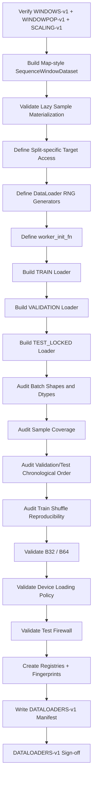
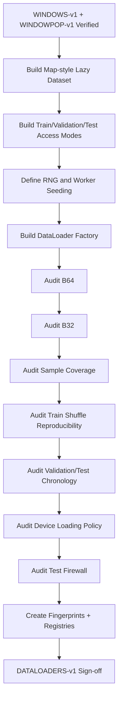

<div align="center">

# PHASE 11 — DATALOADERS

## Kế hoạch xây dựng PyTorch Dataset/DataLoader có thể tái lập, công bằng và an toàn cho chuỗi thời gian

### Transformer Encoder cho hồi quy chuỗi thời gian đa biến trên UCI Appliances Energy Prediction

**Phase kế tiếp sau `Phase_10_Window_builder.md`**

</div>

---

# 1. Vai trò của Phase 11

Phase 11 chịu trách nhiệm chuyển các sample geometry đã được khóa trong:

```text
WINDOWS-v1
WINDOWPOP-v1
```

thành **PyTorch `Dataset` và `DataLoader` chuẩn hóa** để các mô hình ở những phase sau nhận chính xác cùng dữ liệu, cùng thứ tự feature, cùng target population và cùng batching protocol.

Nếu:

```text
Phase 10
→ quyết định sample nào tồn tại
→ sample thuộc split nào
→ input nằm ở đâu
→ target nằm ở đâu
```

thì:

```text
Phase 11
→ quyết định sample được materialize thành tensor như thế nào
→ batch được tạo như thế nào
→ Train được shuffle ra sao
→ Validation/Test giữ chronology ra sao
→ worker randomness được kiểm soát như thế nào
→ dữ liệu được bàn giao cho CPU/CUDA/MPS như thế nào
```

Phase 11 **không được phép tự xây lại windows hoặc tự thay sample population**.

Nguyên tắc cốt lõi:

\[
\boxed{
Registered\ Samples
+
Map\text{-}Style\ Dataset
+
Deterministic\ Loading
+
Train\text{-}Only\ Shuffle
+
No\ Sample\ Loss
}
\]

---

# 2. Mục tiêu cần đạt sau Phase 11

Sau Phase 11 phải có:

```text
1. Một Dataset abstraction dùng chung cho LSTM và Transformer.

2. Dataset sử dụng WINDOWS-v1 thay vì tự tính window.

3. Lazy materialization từ 2D feature timeline.

4. Train Dataset.

5. Validation Dataset.

6. Test structural Dataset với target bị khóa.

7. Test evaluation Dataset factory cho Phase 47.

8. DataLoader factory dùng chung.

9. Batch size 32 được hỗ trợ.

10. Batch size 64 được hỗ trợ.

11. Baseline batch size = 64.

12. TRAIN shuffle=True.

13. VALIDATION shuffle=False.

14. TEST shuffle=False.

15. drop_last=False.

16. Separate RNG generator cho từng split.

17. Reproducible Train shuffling.

18. worker_init_fn chuẩn.

19. `num_workers=0` correctness baseline.

20. Optional multi-worker path có kiểm soát.

21. CUDA pin-memory policy.

22. MPS/CPU transfer policy.

23. `in_order=True`.

24. Batch shape audit.

25. Batch dtype audit.

26. Batch sample-coverage audit.

27. Chronological Validation-order audit.

28. Chronological Test-order audit.

29. Train shuffle reproducibility audit.

30. DataLoader fingerprint/configuration artifact.

31. DATALOADERS-v1 manifest.

32. Phase 11 sign-off.
```

---

# 3. Những việc Phase 11 không làm

Phase 11 không:

```text
Không tạo lại chronological split.

Không fit scaler.

Không tạo lại sliding windows.

Không đổi common target population.

Không train model.

Không tune learning rate.

Không tune dropout.

Không tune batch size bằng Validation RMSE.

Không chọn B32/B64 winner.

Không oversample energy spikes.

Không dùng WeightedRandomSampler.

Không tạo class balancing.

Không shuffle Validation.

Không shuffle Test.

Không drop batch cuối.

Không đưa Tensor trực tiếp lên CUDA/MPS trong Dataset worker.

Không xem Test target values.

Không tính Test metrics.
```

---

# 4. Nguồn kỹ thuật của Phase 11

PyTorch `DataLoader` hiện hỗ trợ:

```text
map-style Dataset
iterable-style Dataset
batching
shuffling/sampling
single-process loading
multi-process loading
memory pinning
worker initialization
generator-controlled randomness
prefetch
persistent workers
ordered delivery
```

Coursework này nên dùng:

```text
map-style Dataset
```

vì:

```text
WINDOWS-v1 đã cung cấp tập sample hữu hạn,
có deterministic sample index,
và mỗi sample có thể truy cập trực tiếp.
```

---

# 5. Vì sao không dùng `IterableDataset`?

`IterableDataset` phù hợp hơn khi:

```text
streaming data
unknown/infinite sequence
custom sequential source
```

Trong coursework này:

```text
sample IDs đã được khóa
window indices đã biết
sample count đã biết
```

Nên dùng:

```text
torch.utils.data.Dataset
```

map-style.

Lợi ích:

```text
__len__ chính xác
__getitem__ rõ ràng
RandomSampler hoạt động tự nhiên
SequentialSampler hoạt động tự nhiên
sample coverage dễ audit
```

---

# 6. Input contract

Phase 11 chỉ bắt đầu khi:

```text
Phase 9 = PASS
Phase 10 = PASS
```

và có:

```text
FEATURES-v1
FEATURESETS-v1
SPLIT-v1
SCALING-v1
WINDOWS-v1
WINDOWPOP-v1
```

Phải truy ngược được:

```text
ENV-v1
DATA-v1
SCHEMA-v1
TEMPORAL-v1
```

---

# 7. Input integrity checks

Trước khi tạo Dataset:

```text
WINDOWS-v1 fingerprint phải khớp.

WINDOWPOP-v1 fingerprint phải khớp.

FEATURESETS-v1 fingerprint phải khớp.

SCALING-v1 bundle fingerprint phải khớp.

SPLIT-v1 fingerprint phải khớp.

Target population count phải đúng.

Window index phải chronological.

No invalid windows trong active population.
```

Nếu mismatch:

```text
STOP.
```

---

# 8. Output version

Gán:

```text
DATALOADERS-v1
```

Lineage:

```text
DATA-v1
   ↓
SCHEMA-v1
   ↓
TEMPORAL-v1
   ↓
FEATURES-v1
   ↓
FEATURESETS-v1
   ↓
SPLIT-v1
   ↓
SCALING-v1
   ↓
WINDOWS-v1
   ↓
WINDOWPOP-v1
   ↓
DATALOADERS-v1
```

---

# 9. Dataset architecture tổng thể

Khuyến nghị:

```text
FEATURES-v1
        │
        ├── SCALING-v1
        │       ↓
        │   2D feature matrix [N,F]
        │
WINDOWS-v1
        ↓
Window index subset
        │
        ↓
SequenceWindowDataset
        │
        ↓
DataLoader
        │
        ↓
Batch [B,L,F]
```

---

# 10. Canonical Dataset class

Khuyến nghị:

```text
SequenceWindowDataset
```

Vai trò:

```text
nhận 2D feature timeline
nhận target arrays
nhận approved window-index subset
slice window lazily
trả tensor
```

Không:

```text
recompute temporal continuity
recompute split
refit scaler
```

---

# 11. Dataset phải lazy materialize

Dataset không lưu:

```text
X_all_windows [M,L,F]
```

Mà giữ:

```text
feature_matrix [N,F]

window_start_indices [M]

window_end_indices [M]

target_indices [M]
```

Trong `__getitem__(i)`:

```text
slice feature_matrix[start:end+1]
```

---

# 12. Vì sao lazy materialization?

Overlapping time-series windows chia sẻ phần lớn rows.

Ví dụ L144:

```text
Window 1:
rows 0..143

Window 2:
rows 1..144
```

Nếu materialize cả hai:

```text
143/144 observations bị copy lại.
```

Lazy slicing giảm:

```text
memory duplication
artifact duplication
version drift
```

---

# 13. Dataset source matrices

Mỗi active experiment có thể materialize một:

```text
2D scaled feature matrix
```

theo:

```text
variant_id
SCALING-v1 bundle
```

Shape:

\[
[N,F]
\]

Dataset dùng matrix này read-only.

---

# 14. Không fit scaler trong Dataset

Bị cấm:

```python
def __getitem__(...):
    scaler.fit(...)
```

hoặc:

```text
per-window normalization bằng full target/feature statistics
```

trừ model-side normalization đã được Phase 40 định nghĩa.

Dataset chỉ:

```text
slice
cast
return
```

---

# 15. Dataset không được mutate feature matrix

Không:

```text
in-place normalization
in-place clipping
in-place augmentation
```

trong `__getitem__`.

Feature matrix được xem là:

```text
READ-ONLY BY CONVENTION.
```

---

# 16. Canonical sample key

Dataset index:

```text
0 ... len(dataset)-1
```

map tới một:

```text
window_row_id
```

trong canonical `window_index.csv`.

Không map trực tiếp tới:

```text
raw timeline row
```

---

# 17. Stable `sample_idx`

Mỗi sample trả:

```text
sample_idx
```

là integer ổn định để truy ngược về:

```text
window_index.csv
```

Không trả random UUID.

---

# 18. Vì sao trả integer `sample_idx` thay vì metadata string?

Lợi ích:

```text
default collate hoạt động đơn giản
pin-memory dễ
batch nhỏ gọn
worker multiprocessing ít overhead
```

Khi cần:

```text
window_id
target_timestamp
input timestamps
```

Phase 48+ lookup bằng:

```text
sample_idx
→ window_index metadata.
```

---

# 19. TRAIN Dataset output contract

Khuyến nghị mỗi item:

```text
{
    "x":        FloatTensor [L,F],
    "y_model":  FloatTensor [1],
    "y_raw_wh": FloatTensor [1],
    "sample_idx": LongTensor scalar
}
```

---

# 20. VALIDATION Dataset output contract

Tương tự TRAIN:

```text
x
y_model
y_raw_wh
sample_idx
```

Validation cần target cho:

```text
validation loss
MAE/RMSE/R²
early stopping
```

---

# 21. TEST Dataset trước Phase 47

Để giữ Test firewall:

```text
TEST_STRUCTURAL
```

item chỉ trả:

```text
{
    "x": FloatTensor [L,F],
    "sample_idx": LongTensor scalar
}
```

Không:

```text
y_model
y_raw_wh
```

---

# 22. TEST evaluation Dataset ở Phase 47

Chỉ sau:

```text
Final model lock
```

mới tạo:

```text
TEST_EVALUATION
```

item:

```text
x
y_model
y_raw_wh
sample_idx
```

với cùng:

```text
WINDOWPOP-v1 Test IDs
```

---

# 23. Test lock là methodological guardrail

Raw dataset vốn chứa `Appliances`.

Do đó target lock không phải:

```text
cryptographic security.
```

Nó là:

```text
API-level protection
```

để tránh:

```text
vô tình inspect Test results trước Phase 47.
```

---

# 24. Dataset `target_access_mode`

Khuyến nghị enum:

```text
TRAIN
VALIDATION
TEST_LOCKED
TEST_EVALUATION
```

Rules:

```text
TRAIN
→ target access allowed

VALIDATION
→ target access allowed

TEST_LOCKED
→ target access forbidden

TEST_EVALUATION
→ allowed only Phase 47+
```

---

# 25. Test gate hard assertion

Nếu:

```text
split = TEST
```

và:

```text
target_access_mode != TEST_EVALUATION
```

Dataset không được trả target.

---

# 26. Target scaling integration

Dataset không fit target scaler.

Nó nhận:

```text
y_model array
```

đã được tạo theo:

```text
YS0
hoặc
YS1
```

bằng frozen SCALING-v1 utility.

---

# 27. `y_raw_wh`

TRAIN/VALIDATION giữ:

```text
raw Wh
```

để shared metrics Phase 12 có thể đánh giá đúng original unit.

---

# 28. Shape contract per item

\[
X\in\mathbb{R}^{L\times F}
\]

\[
y_{model}\in\mathbb{R}^{1}
\]

\[
y_{raw}\in\mathbb{R}^{1}
\]

---

# 29. Dtype contract per item

```text
x        → torch.float32

y_model  → torch.float32

y_raw_wh → torch.float32

sample_idx → torch.int64
```

---

# 30. Không dùng float64 model tensor

Pandas/NumPy preprocessing có thể là:

```text
float64
```

nhưng Dataset boundary phải đảm bảo:

```text
torch.float32
```

cho neural network.

---

# 31. Sequence-order invariant

Trong mỗi item:

```text
x[0]
→ oldest timestamp

x[-1]
→ most recent historical timestamp
```

Dataset không đảo sequence.

---

# 32. Shape validation trong `__getitem__`

Hard assert:

```text
x.ndim == 2

x.shape[0] == lookback

x.shape[1] == feature_count
```

Nếu fail:

```text
raise.
```

Không pad.

---

# 33. Finite-value validation

Trong development smoke tests phải kiểm tra:

```text
torch.isfinite(x).all()

torch.isfinite(y_model).all()

torch.isfinite(y_raw_wh).all()
```

Không nhất thiết chạy expensive assert cho mọi item trong production nếu Phase 10/9 đã audit, nhưng Dataset debug mode nên hỗ trợ.

---

# 34. No random transform

Dataset không có:

```text
augmentation
random crop
noise injection
random masking
```

Do đó `__getitem__` phải deterministic.

Cùng index:

```text
same x
same y
same sample_idx
```

---

# 35. Dataset determinism test

```text
dataset[i]
dataset[i]
```

Expected:

```text
x identical
y identical
sample_idx identical.
```

---

# 36. Dataset split subsets

Không dùng:

```text
torch.utils.data.random_split
```

vì split đã được khóa bởi `SPLIT-v1` và `WINDOWS-v1`.

Tạo Dataset từ:

```text
approved window-index rows
```

được filter theo:

```text
target_split_id.
```

---

# 37. Train Dataset population

Phải đúng:

```text
WINDOWPOP-v1 TRAIN target IDs
```

---

# 38. Validation Dataset population

Phải đúng:

```text
WINDOWPOP-v1 VALIDATION target IDs
```

---

# 39. Test Dataset population

Phải đúng:

```text
WINDOWPOP-v1 TEST target IDs
```

---

# 40. Split sample-count invariant

\[
len(train\_dataset)
=
N_{train,\ WINDOWPOP-v1}
\]

Tương tự:

```text
Validation
Test.
```

---

# 41. Dataset population fingerprint

Mỗi Dataset config bind:

```text
WINDOWPOP-v1 fingerprint
window fingerprint
lookback
boundary protocol
split
```

Không tự chọn rows.

---

# 42. LSTM/Transformer Dataset fairness

LSTM và Transformer phải dùng:

```text
same Dataset configuration
```

cho một comparison run.

Khác nhau chỉ:

```text
model implementation.
```

---

# 43. Feature-set sweep fairness

Khi Phase 23 đổi:

```text
FS0
FS1
FS2
```

sample IDs không đổi.

Dataset chỉ thay:

```text
2D feature matrix
feature_count
feature fingerprint.
```

---

# 44. Target-scaling sweep fairness

YS0 vs YS1:

```text
x identical
sample IDs identical
```

chỉ:

```text
y_model representation
```

khác.

---

# 45. Lookback sweep fairness

L36/L72/L144 dùng:

```text
WINDOWPOP-v1 common targets
```

Dataset length giữ cùng per split.

Chỉ:

```text
X.shape[0]
```

thay.

---

# 46. DataLoader batch-size options

Phase 0 đã khóa:

```text
B32 = 32
B64 = 64
```

Phase 11 phải hỗ trợ cả hai.

Baseline B0:

```text
batch_size = 64
```

Winner chưa được chọn ở đây.

Phase 29 mới so:

```text
32 vs 64
```

bằng Validation RMSE.

---

# 47. Không tune batch size ở Phase 11

Phase 11 chỉ:

```text
validate B32
validate B64
```

về:

```text
shape
coverage
memory feasibility
```

Không train model để chọn.

---

# 48. Train shuffle contract

TRAIN:

```text
shuffle=True
```

---

# 49. Vì sao time-series training vẫn được shuffle?

Window-level samples đã chứa:

```text
đúng chronological order bên trong mỗi sequence.
```

LSTM/Transformer baseline xử lý mỗi window độc lập.

Do đó có thể:

```text
shuffle thứ tự các windows giữa mini-batches
```

để stochastic optimization tốt hơn.

---

# 50. Điều kiện để Train shuffle hợp lệ

LSTM phải là:

```text
stateless across independent windows
```

Tức hidden state:

```text
không được carry từ batch trước sang batch sau.
```

Nếu sau này dùng stateful LSTM:

```text
shuffle=True sẽ không còn hợp lệ.
```

Nhưng stateful recurrent training:

```text
không thuộc coursework contract.
```

---

# 51. Validation shuffle contract

VALIDATION:

```text
shuffle=False
```

Lý do:

```text
chronological prediction order
reproducible diagnostics
easy timestamp alignment
```

---

# 52. Test shuffle contract

TEST:

```text
shuffle=False
```

Bắt buộc.

---

# 53. `drop_last` contract

Tất cả:

```text
drop_last=False
```

Bao gồm:

```text
TRAIN
VALIDATION
TEST
```

---

# 54. Vì sao không drop Train batch cuối?

Models không dùng BatchNorm phụ thuộc batch statistics theo current architecture.

Giữ:

```text
drop_last=False
```

đảm bảo:

```text
mọi TRAIN sample được dùng mỗi epoch.
```

---

# 55. Hệ quả của batch cuối nhỏ hơn

Nếu:

```text
N % B != 0
```

batch cuối có:

```text
< B samples.
```

Training engine Phase 19 phải tính epoch metrics/loss theo:

```text
sample-weighted aggregation
```

không average các batch means với weight bằng nhau.

---

# 56. Số batch kỳ vọng

Với:

```text
drop_last=False
```

\[
N_{batches}
=
\left\lceil
\frac{N_{samples}}{B}
\right\rceil
\]

Phase 11 phải audit công thức này.

---

# 57. Batch-size invariant

Mọi batch trừ batch cuối:

```text
B samples.
```

Batch cuối:

```text
1 ... B samples.
```

---

# 58. No oversampling

Không:

```text
WeightedRandomSampler
replacement=True
```

để tăng spike samples.

Điều này sẽ thay training distribution.

---

# 59. No undersampling

Không loại:

```text
low-energy windows
```

để cân bằng.

Regression dataset giữ natural distribution.

---

# 60. Sampler contract

TRAIN:

```text
shuffle=True
```

để PyTorch tạo random sampling order.

VALIDATION/TEST:

```text
shuffle=False
```

để sequential sampling order.

Không custom sampler trong baseline.

---

# 61. Không dùng cả `shuffle` và `sampler`

PyTorch DataLoader không nên nhận:

```text
shuffle=True
+
custom sampler
```

cùng lúc.

Baseline không cần custom sampler.

---

# 62. `batch_sampler`

Không cần.

Standard:

```text
batch_size
+
shuffle
+
drop_last
```

đủ.

---

# 63. Randomness contract

PyTorch DataLoader shuffle phải:

```text
reproducible.
```

Sử dụng:

```text
torch.Generator
```

và:

```text
worker_init_fn
```

theo reproducibility guidance chính thức.

---

# 64. Separate generator per split

Không dùng cùng một `torch.Generator` object cho:

```text
Train
Validation
Test
```

Khuyến nghị:

```text
train_generator
validation_generator
test_generator
```

---

# 65. Vì sao tách generator?

Nếu dùng một generator chung:

```text
việc iterate Validation
```

có thể tiêu thụ RNG state dùng cho worker-base seeding và làm:

```text
Train ordering phụ thuộc vào lịch gọi loader khác.
```

Separate generators giảm coupling.

---

# 66. Generator seed contract

Base experiment seed:

```text
seed
```

Khuyến nghị deterministic offsets:

```text
TRAIN      = seed + 0
VALIDATION = seed + 1
TEST       = seed + 2
```

Các offsets chỉ phục vụ:

```text
RNG stream separation.
```

---

# 67. Train generator

```python
g_train = torch.Generator()
g_train.manual_seed(seed)
```

---

# 68. Validation/Test generator

Dù:

```text
shuffle=False
```

generator vẫn hữu ích nếu:

```text
num_workers > 0
```

vì worker base seeds có thể được tạo từ generator.

---

# 69. Worker seeding

Official PyTorch reproducibility pattern:

```text
worker_seed
=
torch.initial_seed() mod 2^32
```

Sau đó seed:

```text
NumPy
Python random
```

trong worker.

---

# 70. Canonical worker init function

Khuyến nghị top-level function:

```python
def seed_worker(worker_id: int) -> None:
    worker_seed = torch.initial_seed() % 2**32
    np.random.seed(worker_seed)
    random.seed(worker_seed)
```

---

# 71. Không dùng lambda cho `worker_init_fn`

Khi multiprocessing dùng:

```text
spawn
```

lambda có thể không pickle được.

Do đó dùng:

```text
top-level function.
```

---

# 72. Mac/Windows spawn compatibility

Multi-process DataLoader có platform-specific behavior.

Nếu dùng script với spawn:

```text
Dataset class
collate function
worker_init_fn
```

nên là:

```text
top-level definitions
```

và script entry point cần:

```python
if __name__ == "__main__":
    ...
```

---

# 73. Notebook + macOS lưu ý

Trong notebook, multiprocessing DataLoader có thể:

```text
khó debug hơn
worker spawn overhead cao hơn
```

Do đó correctness baseline:

```text
num_workers = 0
```

đặc biệt phù hợp trong development.

---

# 74. `num_workers` baseline

Khóa Phase 11 correctness configuration:

```text
num_workers = 0
```

Lý do:

```text
dataset nhỏ
2D timeline nằm trong memory
window slicing nhẹ
debug trace rõ
ít multiprocessing complexity
```

---

# 75. `num_workers=0` nghĩa là gì?

Data loading chạy:

```text
trong main process.
```

PyTorch documentation cũng lưu ý single-process mode:

```text
dễ debug hơn
error traces dễ đọc hơn
```

---

# 76. Có được dùng `num_workers > 0` không?

Có, nhưng chỉ như:

```text
engineering optimization
```

sau khi correctness baseline PASS.

Không coi worker count là:

```text
research hyperparameter.
```

---

# 77. Optional worker throughput check

Chỉ khi profiling cho thấy DataLoader bottleneck:

```text
num_workers:
0
2
4
```

có thể được benchmark.

Selection criterion:

```text
data-loading throughput / epoch wall time
```

không:

```text
Validation RMSE.
```

---

# 78. Worker configuration phải freeze sau khi chọn

Nếu training-time comparison giữa:

```text
LSTM
Transformer
```

được báo cáo:

```text
cùng worker configuration
```

phải được sử dụng.

---

# 79. Không dùng worker count để giúp riêng một model

Không:

```text
LSTM workers=0
Transformer workers=4
```

rồi so training time trực tiếp.

---

# 80. Multi-worker memory caution

PyTorch documentation cảnh báo worker processes có thể làm tăng CPU memory vì mỗi worker có copy/reference tới các Python objects của parent process.

Dataset nên giữ dữ liệu lớn dưới dạng:

```text
NumPy arrays
Torch CPU tensors
compact numeric arrays
```

thay vì:

```text
large nested Python lists.
```

---

# 81. Dataset internal storage

Khuyến nghị:

```text
feature_matrix
→ contiguous NumPy float32 hoặc CPU Tensor

target arrays
→ NumPy/Tensor

indices
→ compact NumPy integer arrays
```

Không giữ:

```text
toàn bộ DataFrame phức tạp
+
large list of dicts
```

trong worker-facing Dataset nếu không cần.

---

# 82. CPU Tensor vs NumPy base matrix

Cả hai đều hợp lệ.

Khuyến nghị implementation đơn giản:

```text
contiguous NumPy float32
```

hoặc:

```text
torch.FloatTensor CPU
```

với cùng invariant:

```text
read-only by convention.
```

---

# 83. `torch.from_numpy` lưu ý

`torch.from_numpy` có thể chia sẻ memory với NumPy array.

Do đó:

```text
không mutate array sau khi tensor view được tạo.
```

---

# 84. Device placement contract

Dataset/DataLoader trả:

```text
CPU tensors.
```

Không trả:

```text
CUDA tensors
MPS tensors
```

từ worker.

---

# 85. Vì sao không đưa tensors lên GPU trong Dataset?

Device transfer thuộc:

```text
main training process.
```

Điều này:

```text
giảm multiprocessing complexity
phù hợp PyTorch guidance cho CUDA
tách data loading khỏi model execution
```

---

# 86. CUDA pin-memory policy

Nếu selected device:

```text
CUDA
```

khuyến nghị:

```text
pin_memory=True
```

---

# 87. Vì sao `pin_memory=True` cho CUDA?

PyTorch documentation nêu rằng host→GPU transfer từ:

```text
page-locked / pinned CPU memory
```

có thể nhanh hơn.

DataLoader có thể tự pin tensors trước khi trả batch.

---

# 88. CUDA device transfer contract

Training engine có thể dùng:

```python
x = x.to(device, non_blocking=True)
```

khi:

```text
device = CUDA
pin_memory=True
```

---

# 89. Không manual `tensor.pin_memory()` trong Dataset

Để:

```text
DataLoader
```

xử lý pinning.

Không pin từng sample thủ công.

---

# 90. MPS pin-memory policy

Current PyTorch DataLoader documentation mô tả memory pinning chủ yếu để tăng tốc:

```text
host → CUDA
```

Do đó baseline coursework:

```text
MPS:
pin_memory=False
```

và transfer bằng:

```text
tensor.to("mps")
```

ở main process.

---

# 91. CPU pin-memory policy

CPU-only:

```text
pin_memory=False
```

---

# 92. Canonical pin-memory rule

```text
CUDA → True

MPS  → False

CPU  → False
```

Nếu PyTorch behavior thay đổi trong môi trường tương lai:

```text
tạo DATALOADERS version mới
```

sau profiling/verification.

---

# 93. `pin_memory_device`

Không sử dụng.

Current PyTorch docs đánh dấu argument này:

```text
deprecated.
```

---

# 94. `persistent_workers`

Nếu:

```text
num_workers = 0
```

thì:

```text
persistent_workers=False
```

---

# 95. Khi `num_workers > 0`

Có thể dùng:

```text
persistent_workers=True
```

sau correctness test.

Lợi ích:

```text
tránh shutdown/restart workers mỗi epoch.
```

---

# 96. Persistent-worker warning

Nếu Dataset chứa state mutable hoặc epoch-dependent logic:

```text
persistent workers
```

có thể làm state management phức tạp.

Dataset Phase 11 là deterministic/read-only nên rủi ro thấp.

---

# 97. `prefetch_factor`

Với:

```text
num_workers=0
```

không set prefetch factor thủ công.

---

# 98. Với multi-worker

Baseline optional:

```text
prefetch_factor = 2
```

là lựa chọn hợp lý từ DataLoader defaults.

Không tune nếu không có bottleneck.

---

# 99. `in_order`

Khóa:

```text
in_order=True
```

nếu environment PyTorch version hỗ trợ argument này.

---

# 100. Vì sao `in_order=True`?

Current PyTorch documentation cảnh báo:

```text
in_order=False
```

có thể:

```text
làm giảm reproducibility
và gây skew data distribution trong một số tình huống.
```

Coursework không cần lợi ích từ out-of-order delivery.

---

# 101. Compatibility guard cho `in_order`

Nếu active PyTorch version cũ hơn và không hỗ trợ:

```text
không monkey-patch.
```

Ghi:

```text
in_order_supported=False
```

và sử dụng default ordered behavior của version đó.

---

# 102. `timeout`

Baseline:

```text
timeout=0
```

Không cần worker timeout cho dataset nhỏ/in-memory.

---

# 103. `collate_fn`

Không cần custom collate nếu Dataset trả:

```text
Tensor
dict of Tensors
```

có fixed shape.

Dùng:

```text
default_collate.
```

---

# 104. Vì sao tránh custom collate?

Giảm:

```text
code complexity
worker pickling issues
pin-memory complications
```

---

# 105. Metadata strategy giúp dùng default collate

Dataset chỉ trả:

```text
sample_idx int64
```

thay vì:

```text
datetime objects
strings
custom dataclasses
```

trong batch.

Metadata đầy đủ lookup ngoài batch.

---

# 106. Batch output TRAIN/VALIDATION

Default collate tạo:

```text
x:
[B,L,F]

y_model:
[B,1]

y_raw_wh:
[B,1]

sample_idx:
[B]
```

---

# 107. Batch output TEST_LOCKED

```text
x:
[B,L,F]

sample_idx:
[B]
```

---

# 108. Batch dtype contract

```text
x        torch.float32
y_model  torch.float32
y_raw_wh torch.float32
sample_idx torch.int64
```

---

# 109. Batch shape audit

Với B64/L144/FS1_TF1 expected F31:

```text
full batch:
x [64,144,31]
y [64,1]
```

Nhưng runtime:

```text
F từ FEATURESETS-v1
```

mới là source of truth.

---

# 110. Batch-size 32 audit

B32 phải tạo:

```text
x [32,L,F]
```

cho full batch.

Không train model để chọn.

---

# 111. Final incomplete batch audit

Ví dụ:

```text
N = 100
B = 64
```

batches:

```text
64
36
```

Expected sample coverage:

```text
100
```

---

# 112. Sample coverage audit — TRAIN

Trong một epoch:

```text
mỗi dataset index xuất hiện đúng một lần.
```

Vì train random sampler baseline không dùng replacement.

Check:

```text
no missing
no duplicate
```

trong collected `sample_idx`.

---

# 113. Sample coverage audit — VALIDATION

Expected:

```text
exactly once
chronological order.
```

---

# 114. Sample coverage audit — TEST

TEST_LOCKED:

```text
exactly once
chronological order
no target values.
```

---

# 115. Chronological order check

For Validation/Test:

```text
sample_idx sequence
```

map về:

```text
target_timestamp
```

Expected:

```text
monotonic increasing.
```

---

# 116. Train order không chronological

TRAIN loader shuffle:

```text
sample order được random permutation mỗi epoch.
```

Nhưng:

```text
x bên trong mỗi sample vẫn oldest→newest.
```

---

# 117. Reproducibility audit — same seed

Tạo **hai loader mới** với:

```text
same seed
same config
```

Collect first-epoch Train sample order.

Expected:

```text
identical order.
```

---

# 118. Reproducibility audit — fresh loader requirement

Không kiểm tra bằng:

```text
iterate cùng một DataLoader hai lần
```

và mong order giống nhau.

Vì generator state tiến lên sau mỗi epoch.

---

# 119. Consecutive epochs

Trong một Train DataLoader:

```text
epoch 1 order
epoch 2 order
```

thường khác nhau.

Đây là:

```text
desired reshuffling.
```

---

# 120. Same run reproducibility

Nếu recreate:

```text
same environment
same seed
same loader config
```

first-epoch order phải tái lập.

---

# 121. Different final seeds

Final runs:

```text
42
123
2026
```

có thể thay:

```text
model initialization
Train DataLoader permutation
dropout randomness
```

đồng thời.

Đây là robustness-to-random-seed experiment.

---

# 122. Validation generator không làm đổi Train ordering

Do separate generators:

```text
iterate Validation
```

không được làm Train generator state thay đổi.

Audit optional.

---

# 123. Smoke-test loader không được reuse cho training

Phase 11 sẽ iterate loader để audit.

Điều này tiêu thụ:

```text
generator state.
```

Do đó sau smoke tests:

```text
production loader phải được tạo mới
```

hoặc generator reset rõ ràng.

---

# 124. Disposable-loader principle

Tất cả:

```text
coverage tests
reproducibility tests
batch inspections
```

dùng:

```text
disposable DataLoader instances.
```

Final training engine tạo fresh loader cho từng run.

---

# 125. DataLoader factory

Khuyến nghị:

```text
build_dataloader(...)
```

Input:

```text
dataset
split_id
batch_size
seed
num_workers
device_type
```

Output:

```text
DataLoader
LoaderConfig
```

---

# 126. Loader config phải explicit

Không để behavior ẩn theo defaults nếu nó ảnh hưởng reproducibility.

Ghi:

```text
batch_size
shuffle
drop_last
num_workers
pin_memory
persistent_workers
prefetch_factor
timeout
in_order
generator_seed
worker_init_policy
```

---

# 127. Loader policy by split

| Setting | TRAIN | VALIDATION | TEST |
|---|---|---|---|
| `shuffle` | True | False | False |
| `drop_last` | False | False | False |
| `batch_size` | experiment | same/default | same/default |
| `num_workers` | frozen | frozen | frozen |
| `pin_memory` | device policy | same policy | same policy |
| `in_order` | True | True | True |
| target access | Yes | Yes | Locked until P47 |

---

# 128. Batch size Validation/Test

Khuyến nghị dùng:

```text
cùng batch size với run
```

để config đơn giản.

Có thể technically dùng batch lớn hơn cho inference, nhưng:

```text
không cần trong coursework baseline.
```

---

# 129. Phase 29 fairness

Khi so:

```text
B32 vs B64
```

Train batch size thay theo option.

Để controlled comparison đơn giản:

```text
Validation loader batch size
```

cũng có thể theo cùng option.

Metric kết quả không phụ thuộc batch partition nếu aggregation đúng.

---

# 130. Validation metric aggregation

Phase 19/12 phải aggregate:

```text
per sample
```

không phụ thuộc:

```text
last batch size.
```

---

# 131. No hidden state across DataLoader batches

LSTM Phase 15 phải reset/internalize hidden state per batch.

Không:

```text
carry hidden from previous shuffled batch.
```

---

# 132. Transformer batch independence

Transformer mặc định xử lý:

```text
mỗi sample sequence độc lập
```

trong batch.

---

# 133. DataLoader không thay sequence positions

Batching chỉ thêm:

```text
batch dimension.
```

Không transpose time/feature dims.

---

# 134. Canonical batch layout

\[
[B,L,F]
\]

Không:

```text
[L,B,F]
```

vì models sẽ dùng:

```text
batch_first=True
```

theo current contract.

---

# 135. `batch_first` handoff

Phase 15 LSTM:

```text
batch_first=True
```

Phase 16 Transformer implementation cũng phải nhận:

```text
[B,L,F].
```

---

# 136. Train batch sanity probe

Kiểm tra:

```text
x.ndim == 3
y_model.ndim == 2
y_raw_wh.ndim == 2
sample_idx.ndim == 1
```

---

# 137. Validation batch sanity probe

Tương tự.

---

# 138. Test-locked batch sanity probe

Check:

```text
keys
=
x
sample_idx
```

Không có:

```text
y_model
y_raw_wh
```

---

# 139. No test-target collate leak

Nếu TEST_LOCKED batch chứa target key:

```text
FAIL.
```

---

# 140. Dataset lookup audit

Với vài deterministic `sample_idx`:

```text
Dataset item X
```

phải giống Phase 10 direct `materialize_window()` output.

---

# 141. Why compare against Phase 10 materializer?

Để bảo đảm Dataset không:

```text
slice sai
reverse sequence
shift target
change feature order.
```

---

# 142. Dataset-vs-materializer equality

Expected:

```text
torch allclose
```

cho X/y probes.

---

# 143. First TRAIN sample probe

Dataset index:

```text
0
```

trong chronological Dataset metadata trước shuffle.

Xác minh:

```text
correct window.
```

---

# 144. First VALIDATION sample probe

Xác minh:

```text
correct WB0 context
correct target
```

---

# 145. First TEST sample probe

Chỉ kiểm tra:

```text
X
sample_idx
timestamps lookup
```

không target.

---

# 146. Last sample probe

Làm cho từng split.

Giúp phát hiện:

```text
off-by-one tại cuối population.
```

---

# 147. Feature-order probe

Chọn sample và position:

```text
x[-1,k]
```

map về:

```text
FEATURESETS-v1[k]
```

so với 2D feature timeline.

---

# 148. Target probe

TRAIN/VALIDATION:

```text
y_raw_wh
```

phải đúng `Appliances` ở:

```text
target index.
```

YS1:

```text
y_model
```

phải đúng frozen target transform.

---

# 149. No batch-level normalization

DataLoader không:

```text
normalize batch
center batch
standardize per batch
```

vì làm preprocessing phụ thuộc batch composition.

---

# 150. Không mix split trong cùng DataLoader

TRAIN loader chỉ:

```text
TRAIN target samples.
```

VALIDATION chỉ Validation.

TEST chỉ Test.

---

# 151. Không concatenate Train+Validation loader

Trước final model lock:

```text
không merge.
```

---

# 152. Final retraining on Train+Validation?

Không nằm trong current contract.

Final model selection/evaluation vẫn theo locked protocol.

Nếu sau này muốn retrain:

```text
phải tạo protocol riêng
```

và không được dùng Test để tune.

---

# 153. DataLoader throughput không phải research result

Không dành quá nhiều coursework report cho:

```text
samples/sec
worker count.
```

Chỉ log để reproducibility/performance.

---

# 154. Optional throughput smoke test

Nếu cần:

```text
iterate 3–5 full epochs without model
```

hoặc fixed number batches.

Measure:

```text
samples/sec
batches/sec
```

trên TRAIN only.

---

# 155. Không dùng Test cho throughput benchmark

Không cần.

---

# 156. Warm-up khi benchmark DataLoader

Nếu multi-worker/persistent workers:

```text
first epoch có worker startup overhead.
```

Nên phân biệt:

```text
cold-start
steady-state.
```

---

# 157. Không chọn workers theo Validation RMSE

Worker count không được ảnh hưởng model semantics.

Selection:

```text
throughput
stability
memory
```

---

# 158. Baseline recommendation

Với dataset hiện tại:

```text
Dataloader correctness baseline:
num_workers = 0
```

và chỉ tối ưu nếu:

```text
training profiler cho thấy input bottleneck.
```

---

# 159. DataLoader configuration IDs

Khuyến nghị:

```text
DL_B32
DL_B64
```

Batch option.

Base infrastructure:

```text
DLCFG-v1
```

---

# 160. Worker-mode IDs

Có thể ghi:

```text
WM0 = num_workers 0
WM2 = num_workers 2
WM4 = num_workers 4
```

nhưng:

```text
WM2/WM4 chỉ optional engineering profiles
```

không phải coursework hyperparameter sweep bắt buộc.

---

# 161. Pin-memory mode ID

```text
PM_CUDA
PM_OFF
```

tự động từ device policy.

Không coi là model option.

---

# 162. DataLoader config fingerprint

Hash canonical config fields:

```text
batch_size
shuffle
drop_last
num_workers
pin_memory
persistent_workers
prefetch_factor
in_order
generator seed policy
worker init policy
```

---

# 163. Dataset config fingerprint

Hash:

```text
window version
population fingerprint
variant fingerprint
scaler checksum
lookback
horizon
split
target option
target access mode
```

---

# 164. Vì sao cần hai fingerprints?

Dataset fingerprint bảo vệ:

```text
sample/data semantics.
```

Loader fingerprint bảo vệ:

```text
batching/order/runtime semantics.
```

---

# 165. Combined pipeline fingerprint

Experiment registry sau này có thể lưu:

```text
dataset_fingerprint
dataloader_config_fingerprint
```

---

# 166. DataLoader manifest

Tạo:

```text
artifacts/dataloaders/dataloader_manifest.json
```

Fields:

```text
dataloader_version
window_version
population_version
feature_set_version
scaling_version
split_version
environment_id
torch_version

dataset_class
dataset_type

baseline_batch_size
supported_batch_sizes

train_shuffle
validation_shuffle
test_shuffle

drop_last

baseline_num_workers
worker_init_policy
generator_policy

pin_memory_policy
persistent_workers_policy
prefetch_policy
in_order_policy

test_target_access_policy

audit_status
warnings
created_at
```

---

# 167. Dataset registry artifact

Tạo:

```text
dataset_registry.csv
```

Fields:

```text
dataset_config_id
split_id
variant_id
lookback
horizon
target_scaling
target_access_mode
sample_count
feature_count
window_fingerprint
population_fingerprint
feature_fingerprint
scaler_bundle_id
dataset_fingerprint
status
```

---

# 168. Loader registry artifact

Tạo:

```text
dataloader_registry.csv
```

Fields:

```text
loader_config_id
dataset_config_id
split_id
batch_size
shuffle
drop_last
num_workers
pin_memory
persistent_workers
prefetch_factor
in_order
generator_seed
loader_fingerprint
expected_batches
status
```

---

# 169. Sample coverage artifact

Tạo:

```text
dataloader_sample_coverage.csv
```

Fields:

```text
loader_config_id
split_id
dataset_size
observed_samples
unique_samples
duplicate_samples
missing_samples
coverage_ratio
status
```

---

# 170. Batch audit artifact

Tạo:

```text
dataloader_batch_audit.csv
```

Fields:

```text
loader_config_id
split_id
batch_index
observed_batch_size
x_shape
y_model_shape
y_raw_shape
sample_idx_shape
x_dtype
y_dtype
finite_status
status
```

Không cần lưu mọi batch nếu artifact quá lớn.

Có thể lưu:

```text
first
middle
last
```

batches + summary.

---

# 171. Shuffle reproducibility artifact

Tạo:

```text
shuffle_reproducibility_audit.csv
```

Fields:

```text
seed
loader_config
same_seed_run_1_order_fingerprint
same_seed_run_2_order_fingerprint
same_seed_match
epoch1_order_fingerprint
epoch2_order_fingerprint
status
```

---

# 172. Validation/Test order audit

Tạo:

```text
sequential_order_audit.csv
```

Fields:

```text
split
sample_count
timestamp_monotonic
first_sample_idx
last_sample_idx
order_fingerprint
status
```

---

# 173. Worker audit

Tạo:

```text
worker_configuration_audit.csv
```

Fields:

```text
num_workers
worker_init_function
generator_used
persistent_workers
prefetch_factor
spawn_compatible
status
notes
```

---

# 174. Device-transfer policy artifact

Tạo:

```text
device_transfer_policy.json
```

Ví dụ:

```text
CUDA:
pin_memory = true
non_blocking_transfer = true

MPS:
pin_memory = false
non_blocking_transfer = false baseline

CPU:
pin_memory = false
device_transfer = none
```

---

# 175. Test firewall audit

Tạo:

```text
dataloader_test_firewall_audit.csv
```

Checks:

```text
test_locked_dataset_has_no_target
test_locked_loader_has_no_target
test_sample_count_matches
test_order_chronological
same population fingerprint
evaluation_factory_requires_explicit mode
status
```

---

# 176. Discrepancy log

Tạo:

```text
dataloader_discrepancies.json
```

Categories:

```text
DATASET_COUNT_MISMATCH
WINDOW_FINGERPRINT_MISMATCH
FEATURE_FINGERPRINT_MISMATCH
SCALER_MISMATCH
BATCH_SHAPE_ERROR
DTYPE_ERROR
NONFINITE_BATCH
DUPLICATE_SAMPLE
MISSING_SAMPLE
TRAIN_NOT_SHUFFLED
VALIDATION_SHUFFLED
TEST_SHUFFLED
DROP_LAST_SAMPLE_LOSS
RNG_REPRODUCIBILITY_ERROR
WORKER_SEED_ERROR
TEST_TARGET_LEAK
ORDER_ERROR
DEVICE_TRANSFER_POLICY_ERROR
OTHER
```

---

# 177. Status model

## PASS

```text
Dataset/Loader semantics đúng.
Coverage đầy đủ.
Reproducibility audit pass.
Test firewall pass.
```

## PASS_WITH_WARNING

Ví dụ:

```text
multi-worker mode không ổn định trên notebook,
nên frozen configuration dùng num_workers=0.
```

Đây không phải modeling problem.

## FAIL

Ví dụ:

```text
sample loss
split mixing
target leak
shape mismatch
shuffle sai split
same-seed ordering không reproducible
```

---

# 178. DataLoader factory output

Khuyến nghị return:

```text
loader
loader_config
generator
```

Generator được giữ để:

```text
training/checkpoint reproducibility
```

nếu cần.

---

# 179. Generator-state handoff

Phase 19 nếu cần exact resume có thể lưu:

```text
train_generator.get_state()
```

cùng checkpoint.

Phase 11 phải thiết kế factory để generator object có thể truy cập.

---

# 180. Exact checkpoint resume nuance

Cùng:

```text
seed
```

không tự động bảo đảm exact batch order sau khi resume giữa chừng nếu RNG state không được khôi phục.

Đây là responsibility chính của:

```text
Phase 19 — Training Engine
```

Phase 11 chỉ bàn giao generator state interface.

---

# 181. DataLoader epoch control

Không recreate Train DataLoader:

```text
một cách ngẫu nhiên giữa mỗi epoch
```

với cùng seed nếu điều đó làm epoch order luôn giống.

Training engine nên:

```text
create fresh production loader once per run
iterate across epochs
```

để generator state tiến tự nhiên.

---

# 182. Không reset generator mỗi epoch

Nếu mỗi epoch:

```text
manual_seed(seed)
```

lại từ đầu thì shuffle order sẽ lặp.

Không làm vậy.

---

# 183. Separate audit loader vs production loader

Phase 11 tests:

```text
disposable audit loaders.
```

Phase 19:

```text
fresh production loader.
```

---

# 184. Cross-platform reproducibility limitation

PyTorch chính thức lưu ý:

```text
hoàn toàn identical results không được đảm bảo
giữa release, platform hoặc CPU/GPU khác nhau.
```

Do đó Phase 11 đảm bảo:

```text
controlled reproducibility
within fixed environment.
```

Không hứa:

```text
bitwise identical everywhere.
```

---

# 185. DataLoader does not define model determinism alone

Ngoài loader còn có:

```text
model initialization
dropout
device kernels
optimizer
```

Phase 1/19 xử lý các nguồn randomness này.

---

# 186. No custom multiprocessing context baseline

Dùng:

```text
platform default
```

với:

```text
num_workers=0.
```

Không force:

```text
fork
spawn
forkserver
```

trong baseline.

---

# 187. Nếu multi-worker trên macOS

Ưu tiên code Dataset/worker functions trong:

```text
importable Python module
```

ví dụ:

```text
src/data/dataset.py
src/data/loaders.py
```

thay vì chỉ nằm trong notebook cell.

---

# 188. Source-code organization đề xuất

```text
src/
└── data/
    ├── dataset.py
    ├── dataloaders.py
    └── seeding.py
```

---

# 189. `dataset.py`

Chứa:

```text
SequenceWindowDataset
target access enum
DatasetConfig
```

---

# 190. `dataloaders.py`

Chứa:

```text
build_dataloader
build_train_val_loaders
build_test_locked_loader
build_test_evaluation_loader
LoaderConfig
```

---

# 191. `seeding.py`

Chứa:

```text
seed_worker
build_split_generator
```

hoặc reuse seed utility từ Phase 1.

Không duplicate inconsistent seed logic.

---

# 192. Phase 1 seed utility integration

Phase 11 phải reuse:

```text
set_seed(seed)
```

cho global experiment RNG.

DataLoader riêng vẫn dùng:

```text
torch.Generator.
```

---

# 193. `seed_worker` ownership

Nên có:

```text
một canonical definition
```

không copy-paste nhiều notebook.

---

# 194. No stochastic dataset transforms

Dù worker seeding đầy đủ:

```text
Dataset hiện không dùng randomness.
```

Worker seed là:

```text
defensive reproducibility infrastructure.
```

---

# 195. DataLoader audit mode

Có thể thêm:

```text
AUDIT_MODE=True
```

để Dataset chạy extra assertions.

Production:

```text
AUDIT_MODE=False
```

sau sign-off để giảm overhead.

---

# 196. Không tắt những assertions critical

Ngay cả production nên giữ lightweight checks khi load config:

```text
fingerprint
feature count
split
```

Không cần kiểm tra every-item allclose.

---

# 197. Epoch coverage audit

Với disposable TRAIN loader:

```text
collect sample_idx entire epoch.
```

Verify:

\[
unique\_count=N
\]

\[
observed\_count=N
\]

---

# 198. `drop_last=False` audit

Nếu observed samples:

\[
<N
\]

FAIL.

---

# 199. Duplicate-sample audit

Nếu:

\[
observed\_count>unique\_count
\]

FAIL.

---

# 200. Validation/Test exact sequence audit

Expected `sample_idx` order:

```text
dataset index order
```

và target timestamps monotonic.

---

# 201. Train order fingerprint

Có thể hash:

```text
first epoch sample_idx sequence
```

cho reproducibility audit.

Không xem fingerprint là research result.

---

# 202. Epoch-2 order fingerprint

Optional:

```text
expected different from epoch 1
```

nhưng không hard-fail trên purely theoretical rare equality.

Với dataset lớn, equality cực kỳ khó xảy ra.

---

# 203. Same-seed fresh-loader fingerprint

Hard requirement:

```text
same.
```

trong same environment.

---

# 204. Different-seed fingerprint

Expected:

```text
different.
```

Nếu không:

```text
investigate generator wiring.
```

---

# 205. Loader batch count audit

For each split:

\[
ObservedBatches
=
\left\lceil
N/B
\right\rceil
\]

---

# 206. Last-batch size formula

\[
LastBatchSize
=
\begin{cases}
B,&N\bmod B=0\\
N\bmod B,&otherwise
\end{cases}
\]

---

# 207. Empty Dataset guard

Không tạo loader nếu:

```text
len(dataset)=0.
```

Hard fail.

---

# 208. One-sample final batch

Hợp lệ nếu:

```text
drop_last=False.
```

Current models không dùng BatchNorm.

---

# 209. BatchNorm caution

Nếu sau này kiến trúc thêm:

```text
BatchNorm
```

one-sample batch có thể gây issue.

Nhưng current LSTM/Transformer contract không cần BatchNorm.

Không thay `drop_last` chỉ vì hypothetical architecture.

---

# 210. Validation no-grad không thuộc DataLoader

`torch.no_grad()` / `torch.inference_mode()` thuộc:

```text
training/evaluation engine
```

không Dataset.

---

# 211. Device movement không thuộc Dataset

Training engine nhận CPU batch và move:

```text
x
y
```

lên selected device.

---

# 212. Metadata không move lên device

`sample_idx` có thể giữ CPU nếu chỉ dùng lookup.

Không cần:

```text
sample_idx.to(device)
```

cho model.

---

# 213. Recommended training-batch transfer

Conceptual:

```text
x → device

y_model → device

y_raw_wh
→ có thể giữ CPU cho metric accumulation
hoặc move tùy engine design
```

Phase 19 quyết định.

---

# 214. CUDA non-blocking rule

Nếu:

```text
CUDA + pin_memory=True
```

Phase 19 có thể:

```text
non_blocking=True.
```

---

# 215. MPS transfer baseline

```text
x.to("mps")
```

không phụ thuộc DataLoader pinned-memory path.

---

# 216. CPU transfer

Không cần.

---

# 217. Performance fairness

Nếu report training time:

```text
same:
batch size
num_workers
pin-memory policy
device
DataLoader implementation
```

phải được dùng cho LSTM và Transformer.

---

# 218. Batch-size sweep exception

Phase 29 cố ý thay:

```text
batch size.
```

Mọi loader setting khác giữ cố định.

---

# 219. Worker count không nên thay trong Phase 29

Nếu B64 làm loader chậm hơn:

```text
đó là một phần runtime consequence của batch option.
```

Không tăng workers riêng cho B64 nếu mục tiêu controlled comparison.

---

# 220. DataLoader manifest phải ghi actual device policy

Ví dụ:

```text
selected_device = mps
pin_memory = false
```

Không chỉ ghi generic rule.

---

# 221. Baseline DataLoader B0

Khuyến nghị:

```text
variant       = FS1_TF1
lookback      = 144
horizon       = 1
target scale  = YS1
boundary      = WB0
population    = WINDOWPOP-v1

batch_size    = 64

TRAIN:
shuffle       = True

VALIDATION:
shuffle       = False

TEST_LOCKED:
shuffle       = False

drop_last     = False
num_workers   = 0
in_order      = True
timeout       = 0

pin_memory:
True only if CUDA
False on MPS/CPU
```

---

# 222. B32 validation config

Giống B0 nhưng:

```text
batch_size = 32.
```

Không model training ở Phase 11.

---

# 223. Loader ID naming

Ví dụ:

```text
DL_TRAIN__FS1_TF1__L144__YS1__B64__SEED42

DL_VAL__FS1_TF1__L144__YS1__B64

DL_TEST_LOCKED__FS1_TF1__L144__YS1__B64
```

Không cần filename dài cho mọi artifact; registry có thể chứa IDs.

---

# 224. Production loader created per experiment

Không serialize DataLoader object.

Lưu:

```text
configuration
```

rồi rebuild.

DataLoader chứa runtime processes/generator state nên không phù hợp làm persistent model artifact.

---

# 225. Dataset serialization

Cũng không cần pickle Dataset.

Source of truth:

```text
configs
feature/scaler artifacts
window index.
```

---

# 226. DATALOADERS-v1 không lưu tensors lớn

Artifacts chủ yếu là:

```text
manifest
registry
audits
fingerprints
```

---

# 227. Notebook structure Phase 11

Khuyến nghị:

```text
20–26 cells
```

## Cell 11.1 — Phase title

## Cell 11.2 — Verify WINDOWS/POPULATION/SCALING

## Cell 11.3 — Define Dataset contract

## Cell 11.4 — Implement target-access modes

## Cell 11.5 — Implement `SequenceWindowDataset`

## Cell 11.6 — Dataset deterministic probes

## Cell 11.7 — Implement `seed_worker`

## Cell 11.8 — Implement split generators

## Cell 11.9 — Define DataLoader policy

## Cell 11.10 — Implement DataLoader factory

## Cell 11.11 — Build B64 disposable TRAIN loader

## Cell 11.12 — Build B64 Validation loader

## Cell 11.13 — Build TEST_LOCKED loader

## Cell 11.14 — Batch-shape audit

## Cell 11.15 — Sample-coverage audit

## Cell 11.16 — Validation/Test order audit

## Cell 11.17 — Same-seed shuffle reproducibility audit

## Cell 11.18 — Different-seed audit

## Cell 11.19 — B32 smoke test

## Cell 11.20 — Device pin-memory policy audit

## Cell 11.21 — Optional worker-mode smoke test

## Cell 11.22 — Test-firewall audit

## Cell 11.23 — Create fingerprints/registries

## Cell 11.24 — Save artifacts

## Cell 11.25 — Write DATALOADERS-v1 manifest

## Cell 11.26 — Phase sign-off

---

# 228. Quy trình thực thi Phase 11



---

# 229. Function/class design khuyến nghị

```text
SequenceWindowDataset

TargetAccessMode

DatasetConfig

LoaderConfig

seed_worker()

build_split_generator()

build_sequence_dataset()

build_dataloader()

build_train_validation_loaders()

build_test_locked_loader()

build_test_evaluation_loader()

audit_dataset_item()

audit_batch_shape()

audit_sample_coverage()

audit_shuffle_reproducibility()

audit_sequential_order()

compute_dataset_fingerprint()

compute_loader_fingerprint()

write_dataloader_artifacts()
```

---

# 230. `SequenceWindowDataset.__len__`

Phải trả:

```text
exact number of approved window records.
```

Không estimate.

---

# 231. `SequenceWindowDataset.__getitem__`

Chỉ:

```text
lookup registered indices

slice X

lookup target nếu allowed

convert/return tensors

return sample_idx
```

Không:

```text
randomize
fit
resample
split
```

---

# 232. Error handling

Critical mismatch:

```text
raise immediately.
```

Không:

```text
return zero tensor
skip sample
```

vì sẽ che data-integrity bug.

---

# 233. Dataset failure phải không thay population

Nếu một sample fail materialization:

```text
Phase 11 FAIL.
```

Không drop sample đó riêng khỏi một variant/model.

---

# 234. Optional worker exception handling

Nếu multi-worker obscure traceback:

```text
reproduce với num_workers=0
```

để debug.

---

# 235. Audit loader configuration

Correctness audit dùng:

```text
num_workers=0.
```

Sau khi PASS mới thử multi-worker optional.

---

# 236. Multi-worker performance mode không thay semantics

Phải verify:

```text
same sample IDs
same batch coverage
same Validation/Test order
```

so với workers=0.

---

# 237. Multi-worker order with `in_order=True`

Validation/Test phải vẫn chronological.

---

# 238. No `in_order=False`

Không cần.

---

# 239. No prefetch tuning sweep

Không biến Phase 11 thành performance micro-optimization study.

---

# 240. No distributed training

Không dùng:

```text
DistributedSampler
DistributedDataParallel
multi-GPU
```

trong main coursework.

Out of scope.

---

# 241. No weighted sampler

Không dùng.

---

# 242. No custom batch sampler

Không dùng.

---

# 243. No bucketing

Mọi sequence fixed length trong mỗi run.

Không cần length bucketing.

---

# 244. No padding collate

Không cần vì:

```text
fixed L.
```

---

# 245. Different lookbacks use separate loaders

Một loader cụ thể có một:

```text
fixed L.
```

Không mix:

```text
L36
L72
L144
```

trong cùng batch.

---

# 246. Why not mix lookbacks?

Shape mismatch:

```text
[36,F]
[72,F]
[144,F]
```

và làm controlled experiment khó.

---

# 247. Loader factory parameterization

`lookback` là config input:

```text
36
72
144
```

---

# 248. Feature variant parameterization

Loader factory không chọn columns.

Dataset creation nhận:

```text
FEATURESETS-v1 variant.
```

---

# 249. Target-scaling parameterization

```text
YS0
YS1
```

---

# 250. Boundary protocol parameterization

Main:

```text
WB0
```

Phase 41:

```text
WB1
```

Dataset config filter window index bằng validity flag.

---

# 251. Population policy parameterization

Main:

```text
WINDOWPOP-v1 common population.
```

Không native-only population trong controlled experiments.

---

# 252. Experiment seed parameterization

DataLoader factory nhận:

```text
seed.
```

---

# 253. Device type parameterization

Nhận:

```text
cuda
mps
cpu.
```

Dùng để chọn:

```text
pin_memory policy.
```

---

# 254. Dataloader config should not inspect model class

Không:

```text
if model == Transformer:
workers=4
```

hoặc:

```text
if model == LSTM:
shuffle=False
```

Loader policy độc lập model.

---

# 255. Batch-size memory smoke test

B32/B64 chỉ cần xác nhận:

```text
batch materializes

CPU memory reasonable

optional transfer to selected device succeeds
```

Không training.

---

# 256. Device-transfer smoke test

Có thể lấy:

```text
one disposable batch
```

và move:

```text
x
y
```

lên selected device rồi trả về.

Mục tiêu:

```text
handoff verification.
```

Không forward model.

---

# 257. CUDA pinned-memory smoke check

Nếu CUDA:

```text
batch x.is_pinned()
```

có thể kiểm tra khi pin_memory=True.

---

# 258. MPS/CPU pin status

Không yêu cầu pinned.

---

# 259. Performance artifacts optional

Nếu multi-worker benchmark thực sự được chạy:

```text
dataloader_throughput.csv
```

Fields:

```text
num_workers
persistent_workers
batch_size
samples_per_second
batches_per_second
cold_start_seconds
status
```

---

# 260. Throughput result không vào model-selection table

Không dùng để chọn Transformer architecture.

---

# 261. Human-readable README

Tạo:

```text
README_DATALOADERS.md
```

Nội dung:

```text
Dataset architecture

Lazy slicing

Batch shapes

Train/Val/Test shuffle policy

drop_last policy

seed/generator policy

worker policy

CUDA/MPS/CPU policy

Test target lock

batch-size options

handoff to training engine
```

---

# 262. Output directory

```text
artifacts/
└── dataloaders/
    ├── dataloader_manifest.json
    ├── dataset_registry.csv
    ├── dataloader_registry.csv
    ├── dataloader_sample_coverage.csv
    ├── dataloader_batch_audit.csv
    ├── shuffle_reproducibility_audit.csv
    ├── sequential_order_audit.csv
    ├── worker_configuration_audit.csv
    ├── dataloader_test_firewall_audit.csv
    ├── device_transfer_policy.json
    ├── dataloader_discrepancies.json
    ├── README_DATALOADERS.md
    └── phase_11_signoff.json
```

Optional:

```text
dataloader_throughput.csv
```

---

# 263. Output O11.1 — Dataset implementation

```text
SequenceWindowDataset
```

trong source code/notebook.

---

# 264. Output O11.2 — DataLoader factory

```text
build_dataloader(...)
```

---

# 265. Output O11.3 — Dataset registry

```text
dataset_registry.csv
```

---

# 266. Output O11.4 — DataLoader registry

```text
dataloader_registry.csv
```

---

# 267. Output O11.5 — Sample coverage audit

```text
dataloader_sample_coverage.csv
```

---

# 268. Output O11.6 — Batch audit

```text
dataloader_batch_audit.csv
```

---

# 269. Output O11.7 — Shuffle reproducibility audit

```text
shuffle_reproducibility_audit.csv
```

---

# 270. Output O11.8 — Sequential order audit

```text
sequential_order_audit.csv
```

---

# 271. Output O11.9 — Worker audit

```text
worker_configuration_audit.csv
```

---

# 272. Output O11.10 — Test firewall audit

```text
dataloader_test_firewall_audit.csv
```

---

# 273. Output O11.11 — Device transfer policy

```text
device_transfer_policy.json
```

---

# 274. Output O11.12 — Manifest

```text
dataloader_manifest.json
```

---

# 275. Output O11.13 — Discrepancy log

```text
dataloader_discrepancies.json
```

---

# 276. Output O11.14 — README

```text
README_DATALOADERS.md
```

---

# 277. Output O11.15 — Sign-off

```text
phase_11_signoff.json
```

---

# 278. Manifest minimum fields

```text
dataloader_version = DATALOADERS-v1

window_version = WINDOWS-v1
population_version = WINDOWPOP-v1
feature_set_version = FEATURESETS-v1
scaling_version = SCALING-v1
split_version = SPLIT-v1
environment_id = ENV-v1

dataset_type = map_style
dataset_class = SequenceWindowDataset

baseline_batch_size = 64
supported_batch_sizes = [32,64]

train_shuffle = true
validation_shuffle = false
test_shuffle = false

drop_last = false

baseline_num_workers = 0
worker_seed_policy
generator_seed_policy

pin_memory_policy
persistent_workers_policy
prefetch_policy
in_order_policy

test_target_access_policy

sample_coverage_passed
shuffle_reproducibility_passed
sequential_order_passed
batch_shape_audit_passed
test_firewall_passed

audit_status
warnings
created_at
```

---

# 279. Phase 11 sanity checklist

```text
[ ] Phase 9 PASS.

[ ] Phase 10 PASS.

[ ] WINDOWS-v1 fingerprint verified.

[ ] WINDOWPOP-v1 fingerprint verified.

[ ] FEATURESETS-v1 fingerprint verified.

[ ] SCALING-v1 verified.

[ ] SPLIT-v1 verified.

[ ] Map-style Dataset selected.

[ ] SequenceWindowDataset implemented.

[ ] Dataset does not rebuild windows.

[ ] Dataset uses lazy slicing.

[ ] Dataset does not fit scaler.

[ ] Dataset does not mutate feature matrix.

[ ] Dataset returns float32 X.

[ ] Dataset returns y shape [1].

[ ] Dataset returns stable int64 sample_idx.

[ ] TRAIN target access valid.

[ ] VALIDATION target access valid.

[ ] TEST_LOCKED has no target.

[ ] TEST_EVALUATION mode reserved for Phase 47.

[ ] Dataset counts match WINDOWPOP-v1.

[ ] FS variants use same target population.

[ ] YS0/YS1 use same target population.

[ ] L36/L72/L144 use common target population.

[ ] B32 supported.

[ ] B64 supported.

[ ] Baseline B64 registered.

[ ] TRAIN shuffle=True.

[ ] VALIDATION shuffle=False.

[ ] TEST shuffle=False.

[ ] drop_last=False.

[ ] Expected batch counts verified.

[ ] Last batch size verified.

[ ] No Train sample missing.

[ ] No Train sample duplicated.

[ ] Validation coverage = 100%.

[ ] Test coverage = 100%.

[ ] Validation chronological order verified.

[ ] Test chronological order verified.

[ ] Separate generators implemented.

[ ] worker_init_fn implemented.

[ ] worker_init_fn is top-level/picklable.

[ ] Same-seed fresh-loader order reproducible.

[ ] Audit loaders are disposable.

[ ] Production loader will be recreated fresh.

[ ] num_workers=0 correctness baseline.

[ ] CUDA pin_memory policy defined.

[ ] MPS pin_memory=False baseline.

[ ] CPU pin_memory=False.

[ ] in_order=True if supported.

[ ] timeout=0.

[ ] default collate sufficient.

[ ] No custom sampler.

[ ] No WeightedRandomSampler.

[ ] No oversampling.

[ ] No padding.

[ ] No variable-length batches.

[ ] Batch X shape = [B,L,F].

[ ] Batch y shape = [B,1].

[ ] X/y finite.

[ ] Dataset output equals Phase 10 materializer probes.

[ ] Test firewall audit PASS.

[ ] DataLoader config fingerprints created.

[ ] Dataset fingerprints created.

[ ] Manifest saved.

[ ] DATALOADERS-v1 assigned.

[ ] Phase 11 sign-off completed.
```

---

# 280. Acceptance criteria

Phase 11 chỉ PASS khi:

```text
Dataset population đúng WINDOWPOP-v1.

No sample is silently dropped.

No sample is duplicated.

Train shuffling reproducible.

Validation/Test stay chronological.

Batch shapes exactly follow [B,L,F] and [B,1].

Feature order remains correct.

Dataset is deterministic.

DataLoader does not alter scaling/windows/splits.

Test target remains locked.

Batch sizes 32 and 64 are supported.

num_workers=0 correctness configuration works.

Device-transfer policy is explicit.

Artifacts are reproducible.
```

---

# 281. Khi nào Phase 11 FAIL?

```text
Dataset tự rebuild windows.

Dataset count khác WINDOWS-v1.

DataLoader drop mất batch cuối.

Train sample bị duplicate.

Train sample bị missing.

Validation bị shuffle.

Test bị shuffle.

TEST_LOCKED trả target.

Feature order sai.

X shape sai.

y broadcasting-prone shape sai.

Dataset returns float64 model tensor.

Scaler bị fit trong Dataset.

Random transform làm cùng sample khác nhau.

Same-seed fresh loaders có order khác.

Wrong feature/scaler fingerprint vẫn load được.

DataLoader worker logic thay sample population.

Production loader reused after audit generator consumption.
```

---

# 282. Các lỗi thường gặp

## Lỗi 1 — Dùng `random_split`

Sai vì split đã được khóa chronological.

---

## Lỗi 2 — `shuffle=True` cho Validation/Test

Làm mất chronological alignment.

---

## Lỗi 3 — `drop_last=True` cho Train

Làm mất sample mỗi epoch mà không cần thiết.

---

## Lỗi 4 — Trung bình batch loss không weighted theo batch size

Batch cuối nhỏ hơn gây biased epoch loss.

Phase 19 phải xử lý.

---

## Lỗi 5 — Đưa tensor lên GPU trong `__getitem__`

Không nên.

---

## Lỗi 6 — `num_workers=4` mặc định chỉ vì GPU

Dataset nhỏ và notebook/macOS có thể chậm hơn.

Correctness trước performance.

---

## Lỗi 7 — Dùng cùng Generator object cho mọi split

Tạo coupling RNG không cần thiết.

---

## Lỗi 8 — Seed lại Train generator mỗi epoch

Khiến mỗi epoch dùng lại cùng permutation.

---

## Lỗi 9 — Audit loader rồi dùng chính loader đó để train

Generator state đã thay đổi.

---

## Lỗi 10 — `worker_init_fn=lambda ...`

Có thể lỗi với spawn multiprocessing.

---

## Lỗi 11 — Trả datetime/string metadata trong mỗi training batch

Tăng collate/worker overhead không cần thiết.

Dùng `sample_idx`.

---

## Lỗi 12 — Custom collate khi fixed tensor shapes đã đủ

Tăng complexity.

---

## Lỗi 13 — Oversample high-energy windows

Thay training distribution ngoài contract.

---

## Lỗi 14 — Stateful LSTM + shuffled windows

Không phù hợp.

Current LSTM phải độc lập per window.

---

## Lỗi 15 — Mix L36/L72/L144 trong cùng loader

Không phù hợp fixed-shape controlled experiment.

---

## Lỗi 16 — Scale từng batch

Sai preprocessing semantics.

---

## Lỗi 17 — MPS bật CUDA-style pinning mặc định

Current baseline giữ `pin_memory=False` cho MPS.

---

# 283. Handoff sang Phase 12

Phase 12 — Shared Metrics nhận contract:

```text
VALIDATION batch có:
y_raw_wh
sample_idx
```

để tính:

```text
MAE
RMSE
R²
```

trên original Wh.

---

# 284. Handoff sang Phase 13

Experiment registry phải log:

```text
dataloader_version
dataset_fingerprint
loader_fingerprint
batch_size
shuffle policy
drop_last
num_workers
pin_memory
generator seed
sample counts
```

---

# 285. Handoff sang Phase 14

Persistence baseline dùng:

```text
same WINDOWPOP-v1
```

không nhất thiết dùng Train DataLoader để tạo prediction.

Nhưng Validation/Test target ordering phải tương thích Dataset metadata.

---

# 286. Handoff sang Phase 15

LSTM nhận:

```text
x [B,L,F]
```

với:

```text
batch_first=True.
```

LSTM không carry hidden state giữa shuffled batches.

---

# 287. Handoff sang Phase 16

Transformer nhận cùng:

```text
x [B,L,F].
```

---

# 288. Handoff sang Phase 18

Forward-pass sanity test sử dụng:

```text
disposable loader
```

và một deterministic batch.

---

# 289. Handoff sang Phase 19

Training engine phải:

```text
create fresh loaders per run

không reuse audit loaders

move tensors to device

aggregate epoch loss sample-weighted

preserve DataLoader generator state if exact resume needed
```

---

# 290. Handoff sang Phase 20–21

LSTM baseline và Transformer B0 dùng:

```text
same:
WINDOWPOP-v1
FS1_TF1
L144
YS1
WB0
B64
DataLoader policy
```

---

# 291. Handoff sang Phase 23

Feature-set sweep:

```text
same sample IDs
same loader policy
same batch size
```

chỉ X channel dimension thay.

---

# 292. Handoff sang Phase 25

Target scaling sweep:

```text
same X
same sample order policy
same loader settings
```

chỉ target representation thay.

---

# 293. Handoff sang Phase 26

Lookback sweep:

```text
same target IDs
same loader config
```

X sequence length thay:

```text
36 / 72 / 144.
```

---

# 294. Handoff sang Phase 29

Batch sweep:

```text
B32
B64
```

sử dụng cùng:

```text
Dataset
sample population
workers
pinning
shuffle policy
```

---

# 295. Handoff sang Phase 43

LSTM tuning không được tạo DataLoader policy riêng khác Transformer nếu report runtime fairness.

---

# 296. Handoff sang Phase 46

Three seeds:

```text
42
123
2026
```

mỗi run tạo fresh DataLoader với:

```text
corresponding experiment seed.
```

---

# 297. Handoff sang Phase 47

Phase 47 mới gọi:

```text
build_test_evaluation_loader(...)
```

với explicit:

```text
TEST_EVALUATION
```

và cùng locked Test sample IDs.

---

# 298. Handoff sang Phase 48–57

`sample_idx` giúp lookup:

```text
window_id
target timestamp
prediction
residual
attention map
```

mà không đưa heavy metadata vào batches.

---

# 299. Phase 11 Definition of Done



Phase 11 hoàn thành khi:

\[
\boxed{
Correct\ Dataset
+
Complete\ Sample\ Coverage
+
Reproducible\ Shuffling
+
Ordered\ Evaluation
+
Safe\ Device\ Loading
+
Locked\ Test\ Targets
}
\]

được đảm bảo.

---

# 300. Final status contract

```text
Phase 11 không train model.

Phase 11 không đổi window population.

Phase 11 không đổi split.

Phase 11 không fit preprocessing.

Phase 11 không tune batch-size winner.

Phase 11 chỉ khóa Dataset/DataLoader semantics.

Mọi model experiment sau phải sử dụng
DATALOADERS-v1 factory/configuration
thay vì tự tạo loader theo cách riêng.
```

---

# 301. Nguồn tham chiếu kỹ thuật

## PyTorch — `torch.utils.data`

Tài liệu chính thức hiện tại xác nhận `DataLoader` hỗ trợ:

```text
map-style/iterable-style datasets
automatic batching
shuffle/sampler
single- and multi-process loading
worker_init_fn
generator
pin_memory
prefetch_factor
persistent_workers
in_order
```

Các điểm quan trọng được áp dụng trong Phase 11:

```text
num_workers=0 chạy data loading trong main process;

positive num_workers bật multi-process loading;

map-style sample order được sampler điều khiển;

worker PyTorch seeds dựa trên base seed + worker id;

worker_init_fn có thể dùng để seed NumPy/Python RNG;

generator có thể điều khiển RandomSampler và worker base seed;

returning CUDA tensors từ multiprocessing workers
không được khuyến nghị;

pin_memory=True hỗ trợ CPU-to-CUDA transfer;

in_order=False có thể làm giảm reproducibility.
```

---

## PyTorch — Reproducibility

Tài liệu chính thức khuyến nghị mô hình:

```python
def seed_worker(worker_id):
    worker_seed = torch.initial_seed() % 2**32
    numpy.random.seed(worker_seed)
    random.seed(worker_seed)

g = torch.Generator()
g.manual_seed(seed)
```

và truyền:

```text
worker_init_fn
generator
```

vào DataLoader để tăng reproducibility.

PyTorch cũng lưu ý:

```text
không thể đảm bảo reproducibility tuyệt đối
giữa mọi release/platform/device.
```

---

## PyTorch — Memory pinning / CUDA

Tài liệu chính thức giải thích:

```text
pinned/page-locked CPU memory
có thể tăng tốc host-to-CUDA transfer.
```

Do đó Phase 11 dùng:

```text
CUDA → pin_memory=True
MPS  → pin_memory=False baseline
CPU  → pin_memory=False
```

---

## PyTorch — MPS backend

MPS sử dụng:

```text
torch.device("mps")
```

để chạy tensors/models trên Apple GPU.

Phase 11 giữ DataLoader output ở CPU và chuyển batch sang MPS trong main training process.

---

<div align="center">

# PHASE 11 — FINAL CHECK

**DataLoader không được phép thay đổi sample population đã khóa ở Phase 10.**

**Train chỉ shuffle thứ tự windows giữa batches; chronology bên trong mỗi window luôn giữ nguyên.**

**Validation và Test luôn giữ chronological order.**

**Không drop batch cuối để mọi sample được sử dụng.**

**Worker randomness phải được seed có kiểm soát.**

**CUDA pinning là optimization; correctness luôn được xác nhận trước performance.**

**TEST targets vẫn bị khóa cho tới Phase 47.**

**Chỉ sau khi `DATALOADERS-v1` được sign-off mới chuyển sang PHASE 12 — Shared Metrics.**

</div>
