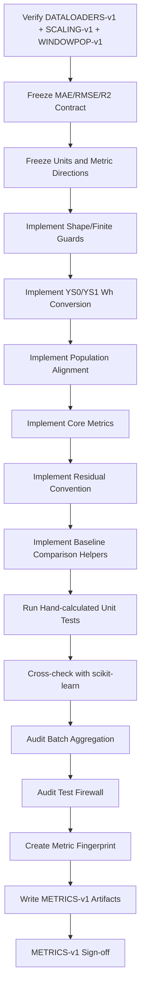
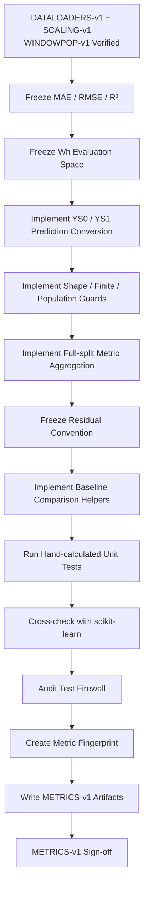

<div align="center">

# PHASE 12 — SHARED METRICS

## Kế hoạch xây dựng hệ thống metric dùng chung, nhất quán đơn vị và chống sai lệch đánh giá

### Transformer Encoder cho hồi quy chuỗi thời gian đa biến trên UCI Appliances Energy Prediction

**Phase kế tiếp sau `Phase_11_DataLoaders.md`**

</div>

---

# 1. Vai trò của Phase 12

Phase 12 chịu trách nhiệm xây dựng **một hệ thống đánh giá hồi quy duy nhất** dùng chung cho:

```text
Persistence baseline
LSTM
Transformer Encoder
mọi feature-set variant
mọi lookback
mọi target-scaling option
mọi regularization experiment
mọi seed
```

Nếu:

```text
Phase 10
→ khóa sample population

Phase 11
→ khóa Dataset/DataLoader semantics
```

thì:

```text
Phase 12
→ khóa METRICS-v1
```

Mục tiêu là ngăn tình trạng:

```text
model A tính RMSE trên standardized target

model B tính RMSE trên Wh

model C average RMSE theo từng batch

model D tính RMSE trên toàn Validation

model E accidentally dùng Test
```

nhưng các con số lại được đặt cạnh nhau như thể có thể so sánh.

Nguyên tắc cốt lõi:

\[
\boxed{
Same\ Targets
+
Same\ Units
+
Same\ Formulas
+
Same\ Aggregation
+
Same\ Access\ Rules
}
\]

---

# 2. Metrics contract đã khóa từ Phase 0

Metric chính:

```text
PRIMARY MODEL-SELECTION METRIC
=
Validation RMSE
```

Metric báo cáo bắt buộc:

```text
MAE
RMSE
R²
```

Đơn vị:

```text
MAE  → Wh

RMSE → Wh

R²   → dimensionless
```

Test:

```text
FINAL HOLDOUT ONLY
```

Không được dùng Test metrics trong development.

---

# 3. Mục tiêu cần đạt sau Phase 12

Sau Phase 12 phải có:

```text
1. Một metric module dùng chung.

2. Một metric contract machine-readable.

3. Định nghĩa toán học cố định cho MAE.

4. Định nghĩa toán học cố định cho RMSE.

5. Định nghĩa toán học cố định cho R².

6. Validation RMSE được khóa làm primary selection metric.

7. Metric input luôn được đưa về original Wh.

8. YS0 evaluation path.

9. YS1 inverse-transform evaluation path.

10. Prediction/target shape normalization.

11. Sample-count equality checks.

12. Sample-ID alignment checks.

13. Finite-value checks.

14. Split access guard.

15. Test firewall guard.

16. Full-split aggregation rule.

17. Không average metric theo batch.

18. Loss-vs-metric separation.

19. Residual sign convention.

20. Baseline-comparison helpers.

21. Optional MAPE policy.

22. Constant-target R² policy.

23. Single-sample R² policy.

24. Metric numerical precision policy.

25. Unit tests bằng hand-calculated examples.

26. Cross-check với scikit-learn.

27. Metric artifact schemas.

28. Metric fingerprints/versioning.

29. METRICS-v1 sign-off.
```

---

# 4. Những việc Phase 12 không làm

Phase 12 không:

```text
Không train model.

Không chọn model winner.

Không chạy Persistence baseline chính thức.

Không chạy LSTM.

Không chạy Transformer.

Không mở Test firewall.

Không tune loss.

Không tune target scaling.

Không tune feature set.

Không tune lookback.

Không tính confidence interval cuối cùng.

Không chạy multi-seed aggregation cuối cùng.

Không làm residual analysis sâu.

Không làm error-regime analysis.

Không làm attention analysis.
```

Phase 12 chỉ xây:

```text
measurement infrastructure.
```

---

# 5. Input contract

Phase 12 chỉ bắt đầu khi:

```text
Phase 11 = PASS
```

và truy ngược được:

```text
SCALING-v1
WINDOWS-v1
WINDOWPOP-v1
DATALOADERS-v1
SPLIT-v1
```

Phải biết rõ:

```text
target = Appliances

target original unit = Wh

target options = YS0 / YS1

Validation sample IDs

Test access policy.
```

---

# 6. Output version

Gán:

```text
METRICS-v1
```

Lineage:

```text
DATA-v1
   ↓
...
WINDOWS-v1
   ↓
DATALOADERS-v1
   ↓
METRICS-v1
```

Metric implementation không được tự ý thay formula giữa các experiment.

---

# 7. Ba metric bắt buộc

Core metrics:

```text
MAE
RMSE
R²
```

Không cần một “metric zoo” lớn.

Ba metric này đủ để trả lời ba góc nhìn khác nhau:

```text
MAE
→ typical absolute error magnitude

RMSE
→ penalizes large errors more strongly

R²
→ performance relative to variation of observed target
```

---

# 8. MAE — định nghĩa

Với:

\[
y_i
\]

là giá trị thực và:

\[
\hat y_i
\]

là prediction:

\[
\boxed{
MAE
=
\frac{1}{n}
\sum_{i=1}^{n}
|y_i-\hat y_i|
}
\]

---

# 9. MAE — interpretation

MAE trả lời:

> Trung bình prediction lệch khỏi actual bao nhiêu Wh, không xét dấu.

Lower is better.

Best possible:

\[
0
\]

Đơn vị:

```text
Wh
```

---

# 10. MAE không cho biết hướng bias

Ví dụ:

```text
+20 Wh error

-20 Wh error
```

đều đóng góp:

```text
20 Wh
```

vào MAE.

Hướng bias sẽ được xem qua:

```text
residual/signed-error diagnostics
```

ở phase sau.

---

# 11. MSE — internal mathematical quantity

Dù final required metrics không bắt buộc báo MSE, cần định nghĩa:

\[
MSE
=
\frac{1}{n}
\sum_{i=1}^{n}
(y_i-\hat y_i)^2
\]

RMSE được xây từ MSE.

MSE có đơn vị:

\[
Wh^2
\]

---

# 12. RMSE — định nghĩa

\[
\boxed{
RMSE
=
\sqrt{
\frac{1}{n}
\sum_{i=1}^{n}
(y_i-\hat y_i)^2
}
}
\]

Lower is better.

Best possible:

\[
0
\]

Đơn vị:

```text
Wh
```

---

# 13. Vì sao RMSE là primary metric?

RMSE:

```text
cùng đơn vị với target

phạt lỗi lớn mạnh hơn MAE

phù hợp với mục tiêu chú ý energy spikes

phù hợp contract đã khóa ở Phase 0
```

Quan trọng:

> RMSE được dùng làm primary metric vì experimental protocol đã định trước, không phải vì sau này Transformer tình cờ có RMSE đẹp.

---

# 14. RMSE nhạy với lỗi lớn

Do residual được bình phương:

```text
error 100 Wh
```

đóng góp lớn hơn đáng kể so với:

```text
error 10 Wh.
```

Điều này phù hợp với việc dataset có high-consumption spikes cần được xem xét nghiêm túc.

---

# 15. R² — định nghĩa

\[
\boxed{
R^2
=
1
-
\frac{
\sum_i(y_i-\hat y_i)^2
}{
\sum_i(y_i-\bar y)^2
}
}
\]

Trong đó:

\[
\bar y
=
\frac{1}{n}\sum_i y_i
\]

---

# 16. R² — interpretation

General interpretation:

```text
R² = 1
→ perfect prediction

R² = 0
→ squared-error performance tương đương predictor luôn dự đoán mean của y_true trên chính evaluation set

R² < 0
→ prediction tệ hơn mean reference theo định nghĩa R²
```

R² có thể âm.

Không ép:

```text
R² >= 0.
```

---

# 17. Không gọi R² là “accuracy”

Không viết:

```text
R² = 0.80
→ accuracy = 80%
```

Sai.

Nên viết:

```text
R² = 0.80
```

và diễn giải theo explained variation/coefficient of determination một cách thận trọng.

---

# 18. R² không có đơn vị

```text
dimensionless.
```

Không ghi:

```text
R² = 0.8 Wh.
```

---

# 19. Core metric direction registry

| Metric | Direction | Best |
|---|---|---:|
| MAE | lower | 0 |
| RMSE | lower | 0 |
| R² | higher | 1 |

Registry này phải được machine-readable để Phase 13/42 không đảo logic ranking.

---

# 20. Primary selection contract

Canonical:

```text
selection_metric
=
validation_rmse_wh
```

Không:

```text
Validation loss
Training loss
Validation R²
Test RMSE
```

làm primary selection metric.

---

# 21. Secondary model evidence

Secondary:

```text
Validation MAE
Validation R²

learning curves
generalization gap
rolling-origin robustness
seed robustness
```

Nhưng primary ranking vẫn:

```text
Validation RMSE.
```

---

# 22. Tie handling không thuộc core metric formula

Phase 12 không tự quyết:

```text
nếu RMSE chênh 0.1 Wh thì model nào thắng.
```

Tie/candidate synthesis logic thuộc:

```text
Phase 42.
```

Phase 12 chỉ cung cấp:

```text
full-precision metrics.
```

---

# 23. Loss khác evaluation metric

Đây là nguyên tắc bắt buộc.

Training loss có thể là:

```text
MSE
Huber
```

và có thể được tính trên:

```text
raw target
hoặc
standardized target.
```

Evaluation metrics:

```text
MAE
RMSE
R²
```

luôn phải được tính trên:

```text
original Wh.
```

---

# 24. Không so trực tiếp training loss giữa YS0 và YS1

Ví dụ:

```text
YS0 loss = 2000
YS1 loss = 0.4
```

không có nghĩa:

```text
YS1 tốt hơn.
```

Chúng ở scale khác nhau.

Model comparison dùng:

```text
Validation RMSE Wh
MAE Wh
R²
```

sau inverse transform.

---

# 25. YS0 evaluation path

YS0:

```text
model output
→ prediction Wh
```

Do đó:

```text
y_pred_wh = model_output
```

và metric được tính trực tiếp.

---

# 26. YS1 evaluation path

YS1:

```text
model output standardized
→ frozen YSCALER inverse_transform
→ Wh
→ metrics
```

Công thức:

\[
\hat y_{Wh}
=
\hat y_{scaled}\sigma_{train,y}
+
\mu_{train,y}
\]

---

# 27. Ground truth YS1 handling

Không cần lấy:

```text
y_model scaled
```

rồi inverse-transform nếu DataLoader đã cung cấp:

```text
y_raw_wh.
```

Preferred ground truth for evaluation:

```text
y_raw_wh
```

để giảm một transformation không cần thiết.

---

# 28. Prediction inverse-transform là bắt buộc

Nếu experiment dùng YS1 mà metric code nhận scaled prediction trực tiếp:

```text
FAIL.
```

---

# 29. Metric unit audit

Mỗi metric result phải lưu:

```text
target_unit = Wh

prediction_unit = Wh

metric_unit:
MAE  = Wh
RMSE = Wh
R²   = dimensionless
```

---

# 30. Không scale metric để “đẹp bảng”

Không tự:

```text
Wh → kWh
```

trong core metric artifact.

Coursework contract dùng:

```text
Wh.
```

Presentation sau này có thể thêm conversion nếu explicit, nhưng source metric giữ Wh.

---

# 31. Metric input canonical shape

Core function nhận:

```text
y_true
y_pred
```

và normalize về:

\[
[N]
\]

trước calculation.

Accepted external shapes:

```text
[N]

[N,1]
```

---

# 32. Multi-output bị cấm

Nếu input:

```text
[N,K]
```

với:

```text
K > 1
```

Phase 12 core function phải:

```text
raise error.
```

Vì main task là:

```text
single-output regression.
```

---

# 33. Không `squeeze()` mù quáng

Sai:

```python
arr.squeeze()
```

vì nếu:

```text
N = 1
```

có thể trở thành scalar.

Preferred helper:

```text
normalize_regression_vector
```

đảm bảo output cuối:

```text
1D [N].
```

---

# 34. Sample-count assertion

Hard check:

\[
len(y_{true})
=
len(y_{pred})
\]

Nếu không:

```text
FAIL.
```

Không truncate array dài hơn.

---

# 35. Empty-array guard

Nếu:

```text
N = 0
```

không tính metric.

Raise:

```text
EMPTY_EVALUATION_SET
```

---

# 36. Finite-value guard

Hard check:

```text
all y_true finite

all y_pred finite
```

Không silently:

```text
drop NaN
drop Inf
```

---

# 37. Vì sao không tự drop NaN prediction?

NaN prediction là:

```text
model/training failure
```

Nếu tự bỏ:

```text
metric có thể trông đẹp giả tạo.
```

Do đó:

```text
FAIL.
```

---

# 38. Sample-ID alignment

Evaluation bundle phải giữ:

```text
sample_idx
```

cùng predictions và ground truths.

Check:

```text
length(sample_idx)
=
length(y_true)
=
length(y_pred)
```

---

# 39. Unique sample-ID assertion

Trong một split evaluation:

```text
sample_idx unique.
```

Nếu duplicate:

```text
FAIL.
```

---

# 40. Expected sample population

Metric evaluator phải bind:

```text
WINDOWPOP-v1 fingerprint
```

và expected split sample IDs.

Không metric trên:

```text
một random subset
```

mà vẫn gọi là full Validation RMSE.

---

# 41. Full-split coverage assertion

Validation primary metric chỉ hợp lệ khi:

```text
observed sample IDs
=
expected Validation IDs
```

theo `WINDOWPOP-v1`.

---

# 42. Order vs metrics

MAE/RMSE/R² không phụ thuộc sample order nếu pair alignment đúng.

Tuy nhiên prediction artifacts phải được sort theo:

```text
sample_idx / target timestamp
```

để:

```text
traceability
plots
residual analysis
attention alignment.
```

---

# 43. Canonical prediction ordering

Sau collection:

```text
sort by canonical target chronology
```

trước save.

Không phụ thuộc:

```text
Train DataLoader shuffle order.
```

---

# 44. Validation loader đã chronological

Validation `shuffle=False`, nên prediction order dự kiến đã đúng.

Tuy vậy evaluator vẫn:

```text
verify sample IDs.
```

---

# 45. Train metrics

Train metrics có thể được tính cho diagnostics.

Nhưng không dùng:

```text
shuffled batch arrival order
```

để tạo timeline.

Sort bằng sample ID trước save.

---

# 46. Test metrics

Core metric module có thể hỗ trợ Test về mặt API.

Nhưng default:

```text
allow_test=False.
```

Trước Phase 47:

```text
TEST metric request
→ hard error.
```

---

# 47. Explicit Test unlock

Phase 47 mới gọi:

```text
allow_test=True
```

hoặc:

```text
EvaluationMode.FINAL_TEST
```

sau final model lock.

---

# 48. Test firewall guard fields

Metric call context phải có:

```text
split_id
evaluation_mode
model_lock_id
```

Nếu:

```text
split_id=TEST
```

nhưng chưa có final-lock context:

```text
FAIL.
```

---

# 49. Validation is development data

Validation metrics được phép tính nhiều lần trong sweeps.

Đó là intended use.

Nhưng phải log:

```text
run_id
```

để tránh cherry-pick không traceable.

---

# 50. Full-split metric aggregation

Core rule:

> Collect all predictions and ground truths for the split, then compute MAE/RMSE/R² **once on the concatenated arrays**.

Không tính:

```text
mean(batch_RMSE).
```

---

# 51. Vì sao average batch RMSE sai?

Vì:

\[
\frac{1}{K}\sum_k RMSE_k
\]

nói chung không bằng:

\[
RMSE_{all}
\]

đặc biệt khi:

```text
batch sizes khác nhau
```

hoặc residual distribution khác.

---

# 52. Correct RMSE aggregation

Nếu streaming:

\[
SSE
=
\sum_i(y_i-\hat y_i)^2
\]

\[
N
=
\sum_i1
\]

Sau đó:

\[
RMSE
=
\sqrt{SSE/N}
\]

Không average per-batch roots.

---

# 53. Correct MAE aggregation

Streaming:

\[
SAE
=
\sum_i|y_i-\hat y_i|
\]

\[
MAE
=
SAE/N
\]

---

# 54. R² cần global target mean

R² không được tính bằng:

```text
average(batch_R²).
```

Nó cần:

\[
\bar y
\]

của toàn evaluation set.

Preferred:

```text
collect full arrays
→ compute once.
```

Dataset đủ nhỏ nên không cần streaming two-pass complexity.

---

# 55. Prediction collection strategy

Validation dataset chỉ vài nghìn samples.

Khuyến nghị:

```text
collect:
sample_idx
y_true_wh
y_pred_wh
```

trên CPU NumPy arrays.

Sau đó:

```text
compute metrics once.
```

---

# 56. Metric numerical dtype

Model output:

```text
float32.
```

Metric calculation nên convert:

```text
NumPy float64.
```

Lợi ích:

```text
stable accumulation
consistent sklearn behavior
reduced roundoff.
```

---

# 57. Không cần float64 model inference

Chỉ:

```text
metric arrays
```

được cast float64 sau khi prediction về CPU.

---

# 58. CPU metric computation

Core metrics được tính:

```text
trên CPU.
```

Không cần:

```text
GPU metric kernels.
```

Dataset nhỏ và scikit-learn/NumPy là reference implementation.

---

# 59. Metric reference implementation

Khuyến nghị dùng:

```text
sklearn.metrics.mean_absolute_error

sklearn.metrics.root_mean_squared_error

sklearn.metrics.r2_score
```

nếu environment version hỗ trợ `root_mean_squared_error`.

---

# 60. RMSE compatibility helper

`root_mean_squared_error` được scikit-learn thêm từ version 1.4.

Để module bền hơn:

```text
nếu function tồn tại
→ dùng trực tiếp

nếu environment pinned cũ hơn
→ sqrt(mean_squared_error)
```

Nhưng Phase 1 nên đã pin modern environment.

---

# 61. Một source of truth cho formula

Không implement:

```text
PyTorch RMSE một cách
NumPy RMSE một cách
scikit-learn RMSE một cách
```

rồi dùng lẫn lộn.

Canonical evaluator:

```text
metrics.py
```

và test cross-reference.

---

# 62. R² `force_finite` policy

Scikit-learn mặc định có thể thay non-finite R² trong constant-target case bằng finite values khi `force_finite=True`.

Để audit minh bạch, `METRICS-v1` ưu tiên:

```text
force_finite=False
```

khi tính diagnostic R².

Nếu:

```text
R² = NaN / -Inf
```

thì evaluator phải:

```text
flag metric undefined
```

thay vì giả vờ một giá trị hữu hạn.

---

# 63. Vì sao policy này phù hợp coursework?

Main Train/Validation/Test target dự kiến không constant.

Do đó:

```text
main R² phải finite.
```

Nếu không:

```text
đó là anomaly cần biết.
```

Không nên che bằng automatic coercion.

---

# 64. Constant-target case

Nếu:

\[
\sum_i(y_i-\bar y)^2=0
\]

R² theo formula chuẩn không xác định.

Metric result:

```text
r2 = NaN
r2_status = UNDEFINED_CONSTANT_TARGET
```

Không dùng R² đó để rank.

---

# 65. Single-sample case

R² không có ý nghĩa với:

```text
N < 2.
```

Return/status:

```text
UNDEFINED_TOO_FEW_SAMPLES
```

MAE/RMSE vẫn có thể tính toán về toán học, nhưng official full-split evaluation không nên có N=1.

---

# 66. R² negative values phải được giữ

Không clamp:

```text
max(r2, 0)
```

Negative R² là information quan trọng.

---

# 67. Prediction clipping policy

Không:

```text
clip prediction < 0 thành 0
```

trước core metrics.

Nếu sau này muốn physical post-processing:

```text
separate explicit experiment.
```

Core evaluator dùng:

```text
raw model prediction after required inverse scaling.
```

---

# 68. Prediction rounding policy

Không round prediction trước metric.

Không:

```text
round to nearest Wh.
```

Metric dùng:

```text
full floating-point prediction.
```

---

# 69. Metric result rounding policy

Artifact machine-readable lưu:

```text
full floating-point precision.
```

Chỉ report/table presentation mới round, ví dụ:

```text
2–3 decimal places
```

theo formatting phase.

---

# 70. Không compare rounded metrics

Model selection phải dùng:

```text
raw stored values
```

không dùng:

```text
rounded table text.
```

---

# 71. Residual convention

Khóa:

\[
\boxed{
residual
=
y_{true}-y_{pred}
}
\]

Interpretation:

```text
residual > 0
→ model underpredicts

residual < 0
→ model overpredicts
```

---

# 72. Signed prediction error

Nếu cần:

\[
prediction\_error
=
y_{pred}-y_{true}
\]

Do đó:

\[
prediction\_error=-residual
\]

Không dùng hai thuật ngữ lẫn nhau.

---

# 73. Absolute error

\[
absolute\_error
=
|residual|
\]

---

# 74. Squared error

\[
squared\_error
=
residual^2
\]

---

# 75. Residual fields được chuẩn bị nhưng chưa phân tích sâu

Phase 12 có thể define schema.

Phase 49 mới phân tích:

```text
distribution
bias
heteroscedasticity
temporal structure.
```

---

# 76. Prediction bundle

Khuyến nghị dataclass/schema:

```text
PredictionBundle
```

Fields:

```text
run_id
split_id
sample_idx
target_timestamp optional lookup
y_true_wh
y_pred_wh
target_scaling_option
population_fingerprint
model_id
```

---

# 77. Core metric function

Khuyến nghị:

```python
compute_regression_metrics(...)
```

Input:

```text
y_true_wh
y_pred_wh
sample_idx
split_id
evaluation_context
```

Output:

```text
MetricResult
```

---

# 78. MetricResult schema

```text
n_samples
mae_wh
rmse_wh
r2
r2_status
target_unit
selection_metric_value
finite_status
population_fingerprint
```

---

# 79. Metric names phải canonical

Dùng:

```text
mae_wh
rmse_wh
r2
```

Không trộn:

```text
RMSE
root_mse
val_rmse
r_squared
```

trong machine-readable artifacts.

Split/model information nằm field riêng.

---

# 80. Selection metric alias

Có thể tạo:

```text
selection_metric_name = "rmse_wh"
```

và:

```text
selection_split = "VALIDATION"
```

Không tạo metric mới tên:

```text
validation_rmse
```

ở core calculator.

---

# 81. MAPE — optional only

MAPE không nằm trong primary required metric set.

Nếu muốn báo supplementary:

\[
MAPE
=
\frac{100}{n}
\sum_i
\left|
\frac{y_i-\hat y_i}{y_i}
\right|
\]

Nhưng chỉ:

```text
supplementary
```

không dùng selection.

---

# 82. MAPE caveat

MAPE có thể trở nên:

```text
rất lớn
không ổn định
```

khi:

```text
actual y gần 0.
```

Do đó core coursework không phụ thuộc MAPE.

---

# 83. MAPE zero-target policy

Nếu supplementary MAPE được bật:

```text
không tự thêm epsilon tùy ý
```

mà phải sử dụng một explicit implementation contract.

Khuyến nghị:

```text
không báo MAPE chính thức
trừ khi thật sự cần so với paper gốc.
```

---

# 84. Comparison với paper gốc

Nếu cần đối chiếu original paper:

```text
MAPE có thể được ghi supplementary
```

nhưng phải nhấn mạnh:

```text
evaluation protocol khác
random split vs chronological forecasting
```

nên không direct comparable.

---

# 85. Median Absolute Error có bắt buộc không?

Không.

Có thể hữu ích diagnostic cho spike-heavy target nhưng không nằm current contract.

Không thêm vào core model-selection table.

---

# 86. Max Error có bắt buộc không?

Không.

Worst-error analysis Phase 51 sẽ cung cấp thông tin mạnh hơn.

---

# 87. MSE có nên report?

Không cần main report.

MSE chủ yếu:

```text
training loss
intermediate calculation.
```

RMSE dễ interpret hơn vì cùng Wh.

---

# 88. Loss registry

Phase 12 nên định nghĩa semantic registry:

```text
training_loss
evaluation_metrics
```

Ví dụ:

| Name | Purpose | Unit depends on YS? | Used to rank? |
|---|---|---|---|
| MSE loss | optimization | Yes | No |
| Huber loss | optimization | Yes | No |
| MAE Wh | evaluation | No | Secondary |
| RMSE Wh | evaluation | No | Primary |
| R² | evaluation | No | Secondary |

---

# 89. Epoch training loss aggregation contract

Phase 19 phải aggregate batch training loss theo:

```text
number of samples
```

nếu criterion reduction là:

```text
mean.
```

Formula:

\[
Loss_{epoch}
=
\frac{
\sum_b Loss_b\times n_b
}{
\sum_b n_b
}
\]

---

# 90. Vì sao sample-weighted epoch loss?

Phase 11 dùng:

```text
drop_last=False
```

nên batch cuối có thể nhỏ hơn.

Average batch means unweighted sẽ:

```text
overweight batch cuối.
```

---

# 91. Validation loss aggregation

Tương tự:

```text
sample-weighted.
```

Nhưng model selection vẫn dựa:

```text
Validation RMSE Wh.
```

---

# 92. Training loss không cần inverse-transform

Loss dùng model-space target:

```text
YS0 raw
YS1 standardized.
```

Đây là optimization objective.

Không nhầm với evaluation metric.

---

# 93. Validation metric cần inverse-transform prediction

Luôn.

---

# 94. Prediction collection contract

Evaluation loop conceptual:

```text
model.eval()

for batch:
    forward
    obtain predictions
    inverse-transform predictions if YS1
    collect CPU arrays
    collect sample_idx

after loop:
    validate population
    sort
    compute metrics once
```

`model.eval()`/`inference_mode()` implementation chính thuộc Phase 19, nhưng metric interface phải yêu cầu output phù hợp.

---

# 95. Không compute metrics từ gradients

Prediction collection cho evaluation không cần gradient.

Phase 19 sẽ dùng:

```text
torch.inference_mode()
```

hoặc `no_grad`.

---

# 96. No stochastic train-mode evaluation

Validation/Test phải chạy:

```text
model.eval()
```

để dropout tắt.

Metric module không tự gọi model nhưng evaluation engine phải tuân thủ.

---

# 97. Training-set evaluation mode

Nếu tính Train metrics sau epoch:

```text
model.eval()
```

trên deterministic Train evaluation loader nếu muốn exact comparable metric.

Không dùng average predictions từ:

```text
train-mode dropout batches
```

để gọi là Train RMSE chuẩn.

---

# 98. Có cần Train evaluation loader riêng?

Không bắt buộc mỗi epoch vì tăng compute.

Có thể:

```text
training loss mỗi epoch

full Train RMSE theo checkpoints/diagnostic intervals
```

Phase 19 quyết định.

---

# 99. Validation metric luôn full Validation

Không chỉ:

```text
first 10 batches.
```

Primary model selection cần:

```text
100% Validation sample population.
```

---

# 100. No sample weighting trong primary metrics

Mọi sample:

```text
equal weight.
```

Không weighting theo:

```text
high energy
time-of-day
recentness.
```

---

# 101. Vì sao equal weighting?

Current coursework contract không định nghĩa:

```text
business cost weights.
```

Equal weighting giữ metric standard và dễ so baseline.

---

# 102. Regime-weighted metrics

Không thuộc Phase 12.

Phase 50 sẽ report:

```text
metrics by target regime
```

nhưng không thay core RMSE.

---

# 103. Baseline comparison helper

Phase 14 cần so model với Persistence.

Shared utility có thể cung cấp:

```text
compare_to_baseline(...)
```

---

# 104. MAE absolute improvement

\[
\Delta MAE
=
MAE_{baseline}
-
MAE_{model}
\]

Positive:

```text
model better.
```

Unit:

```text
Wh.
```

---

# 105. RMSE absolute improvement

\[
\Delta RMSE
=
RMSE_{baseline}
-
RMSE_{model}
\]

Positive:

```text
model better.
```

---

# 106. RMSE percentage improvement

\[
Improvement_{\%}
=
100
\times
\frac{
RMSE_{baseline}
-
RMSE_{model}
}{
RMSE_{baseline}
}
\]

chỉ nếu:

```text
baseline RMSE > 0.
```

---

# 107. MAE percentage improvement

Tương tự.

Không bắt buộc main table nhưng hữu ích cho narrative.

---

# 108. R² comparison

Dùng:

\[
\Delta R^2
=
R^2_{model}
-
R^2_{baseline}
\]

Không dùng:

```text
percentage R² improvement
```

vì interpretation không ổn định, nhất là khi baseline R² gần 0 hoặc âm.

---

# 109. Baseline comparison population guard

Không so metrics nếu:

```text
population_fingerprint khác.
```

Hard fail.

---

# 110. Same-population comparison

Persistence/LSTM/Transformer chỉ được so direct nếu:

```text
same split
same target IDs
same horizon
same population fingerprint.
```

---

# 111. Same-unit comparison

Hard check:

```text
metric units identical.
```

---

# 112. Same horizon comparison

Không so:

```text
H1 model
```

với:

```text
H6 baseline
```

như cùng task.

Metric artifact phải log:

```text
horizon_steps.
```

---

# 113. Same split comparison

Không so:

```text
Validation RMSE model A
```

với:

```text
Test RMSE model B.
```

Comparison utility phải reject split mismatch.

---

# 114. Metric result provenance

Mỗi result phải truy ngược:

```text
run_id
model_id
split_id
window_version
population_version
feature variant
lookback
horizon
target scaling
seed
```

Một phần fields do Phase 13 experiment registry quản lý.

---

# 115. Metrics module không duplicate experiment registry

Core MetricResult chỉ giữ:

```text
metric-specific provenance minimum.
```

Phase 13 join bằng:

```text
run_id.
```

---

# 116. Metric fingerprint

Hash metric contract:

```text
metric names
formulas/version
unit policy
r2 policy
MAPE policy
selection metric
aggregation rule
```

Gán:

```text
metric_contract_fingerprint.
```

---

# 117. Vì sao metric fingerprint cần thiết?

Nếu sau này đổi:

```text
R² force_finite policy
MAPE implementation
unit conversion
```

thì old/new results không được silently mixed.

---

# 118. METRICS-v2 khi nào cần?

Ví dụ đổi:

```text
primary metric RMSE → MAE

Wh → kWh

R² constant-case policy

sample weights

metric population logic
```

thì tạo:

```text
METRICS-v2.
```

---

# 119. Không version bump chỉ vì formatting

Nếu chỉ đổi:

```text
decimal places trong table
```

không cần metric version mới.

Formula/data semantics không đổi.

---

# 120. Unit test strategy

Phase 12 phải có:

```text
hand-calculated examples
perfect prediction
mean predictor
negative R²
constant target
single sample
shape normalization
NaN/Inf rejection
sample mismatch
YS1 round-trip
batch aggregation counterexample
```

---

# 121. Hand-calculated example E1

Cho:

```text
y_true = [10, 20, 30]

y_pred = [12, 18, 33]
```

Residual:

```text
[-2, 2, -3]
```

Absolute errors:

```text
[2, 2, 3]
```

Squared errors:

```text
[4, 4, 9]
```

---

# 122. E1 — MAE

\[
MAE
=
\frac{2+2+3}{3}
=
\frac{7}{3}
\approx
2.333333
\]

---

# 123. E1 — MSE

\[
MSE
=
\frac{4+4+9}{3}
=
\frac{17}{3}
\approx
5.666667
\]

---

# 124. E1 — RMSE

\[
RMSE
=
\sqrt{17/3}
\approx
2.380476
\]

---

# 125. E1 — R²

\[
\bar y = 20
\]

\[
SSE=17
\]

\[
SST=(10-20)^2+(20-20)^2+(30-20)^2=200
\]

\[
R^2
=
1-\frac{17}{200}
=
0.915
\]

---

# 126. E1 expected unit test

```text
MAE  ≈ 2.333333 Wh

RMSE ≈ 2.380476 Wh

R²   = 0.915
```

---

# 127. Perfect-prediction test

```text
y_pred = y_true
```

Expected:

```text
MAE = 0
RMSE = 0
R² = 1
```

cho nonconstant target.

---

# 128. Mean-predictor test

Nếu prediction luôn:

\[
\bar y
\]

trên same nonconstant evaluation set:

```text
R² = 0.
```

---

# 129. Negative-R² test

Tạo intentionally bad prediction.

Expected:

```text
R² < 0.
```

Verify evaluator không clamp.

---

# 130. Constant-target test

```text
y_true = [5,5,5]
```

Expected core policy:

```text
R² undefined
status explicit
```

Không silently 0/1.

---

# 131. Single-sample test

```text
N = 1
```

Expected:

```text
MAE/RMSE computable

R² undefined
```

Core full-split evaluator có thể warning/fail depending context.

---

# 132. NaN prediction test

Expected:

```text
hard error.
```

---

# 133. Inf prediction test

Expected:

```text
hard error.
```

---

# 134. Length mismatch test

Expected:

```text
hard error.
```

---

# 135. Duplicate sample-ID test

Expected:

```text
hard error.
```

---

# 136. Missing population test

Nếu Validation expected:

```text
N=100
```

nhưng bundle có:

```text
99
```

Expected:

```text
hard error.
```

---

# 137. Shape `[N,1]` test

Expected:

```text
normalize to [N]
```

không đổi values.

---

# 138. Invalid `[N,2]` test

Expected:

```text
hard error.
```

---

# 139. YS1 inverse-transform test

Synthetic:

```text
scaled predictions
```

inverse bằng:

```text
YSCALER__YS1
```

Expected metric giống hand calculation trên reconstructed Wh values.

---

# 140. Batch aggregation counterexample

Tạo hai batches có:

```text
different sizes
different errors.
```

Verify:

```text
mean(batch_RMSE)
!=
global_RMSE
```

và evaluator trả global formula.

---

# 141. Batch-loss weighting test

Ví dụ:

```text
batch 1:
64 samples
mean loss = 1

batch 2:
1 sample
mean loss = 100
```

Unweighted batch mean:

```text
50.5
```

Sample-weighted:

\[
\frac{64\times1+1\times100}{65}
\approx2.5231
\]

Phase 19 phải dùng sample-weighted aggregation.

---

# 142. Cross-check với scikit-learn

Unit tests phải so custom wrapper với:

```text
sklearn.metrics
```

trên same arrays.

Expected:

```text
allclose.
```

---

# 143. Không reimplement math without tests

Wrapper có thể đơn giản.

Mục tiêu không phải viết lại sklearn từ đầu.

Mục tiêu:

```text
enforce coursework-specific units, alignment and leakage guards.
```

---

# 144. Core code organization

Khuyến nghị:

```text
src/
└── evaluation/
    ├── metrics.py
    ├── prediction_bundle.py
    ├── comparison.py
    └── metric_guards.py
```

---

# 145. `metrics.py`

Chứa:

```text
compute_mae
compute_rmse
compute_r2
compute_regression_metrics
normalize_regression_vector
```

---

# 146. `prediction_bundle.py`

Chứa:

```text
PredictionBundle
bundle validation
sorting/alignment helper
```

---

# 147. `comparison.py`

Chứa:

```text
compare_metric_results
compare_to_baseline
absolute improvement
percentage improvement
```

---

# 148. `metric_guards.py`

Chứa:

```text
finite checks
population checks
split/test firewall checks
unit checks
```

---

# 149. Không duplicate metric formulas trong training notebook

Notebooks gọi:

```text
shared metrics module.
```

Không có:

```text
rmse = ...
```

viết lại ở Phase 20, 21, 23, ...

---

# 150. API design — compute metrics

Conceptual:

```python
compute_regression_metrics(
    y_true_wh,
    y_pred_wh,
    sample_idx,
    expected_sample_idx,
    split_id,
    evaluation_mode,
)
```

---

# 151. Evaluation mode enum

Khuyến nghị:

```text
TRAIN_DIAGNOSTIC
VALIDATION
FINAL_TEST
```

Không:

```text
TEST_DEV.
```

---

# 152. Validation mode

Cho phép:

```text
TRAIN
VALIDATION
```

Không cho:

```text
TEST.
```

---

# 153. FINAL_TEST mode

Chỉ:

```text
split = TEST
```

và cần:

```text
final_model_lock_id.
```

---

# 154. Prediction-unit helper

Khuyến nghị:

```text
to_wh_predictions(...)
```

Input:

```text
model_prediction
target_scaling_option
y_scaler
```

Output:

```text
float64 NumPy [N] Wh.
```

---

# 155. YS0 helper

```text
identity conversion
```

---

# 156. YS1 helper

```text
reshape [N,1]
inverse_transform
reshape [N]
```

để phù hợp scikit-learn scaler.

---

# 157. Scaler fingerprint check

YS1 inverse-transform function phải verify:

```text
active y scaler checksum/fingerprint
=
SCALING-v1.
```

---

# 158. No refit in metrics

Metric code tuyệt đối không:

```text
fit y scaler.
```

Chỉ load frozen scaler.

---

# 159. Ground-truth integrity

`y_true_wh` phải đến từ:

```text
DataLoader y_raw_wh
```

hoặc canonical target lookup theo sample IDs.

Không reconstruct từ scaled y nếu raw target đã có.

---

# 160. Prediction alignment function

Khuyến nghị:

```text
align_prediction_bundle_to_expected_population(...)
```

Steps:

```text
validate IDs
sort by expected IDs
reorder y_true/y_pred
return canonical bundle
```

---

# 161. Không sort y_true và y_pred độc lập

Sai nghiêm trọng.

Sort phải theo cùng:

```text
sample_idx permutation.
```

---

# 162. Timestamp alignment

Prediction artifact sau này join:

```text
sample_idx
→ target_timestamp
```

từ WINDOWS-v1.

Không infer timestamp bằng array position.

---

# 163. Training metrics vs Validation metrics naming

Machine-readable fields:

```text
split_id
```

và same metrics names.

Không tạo separate formulas:

```text
train_rmse()
val_rmse()
```

---

# 164. Metric result long format

Tạo schema:

```text
run_id
split_id
metric_name
metric_value
metric_unit
n_samples
metric_version
population_fingerprint
status
```

---

# 165. Long-format lợi ích

Dễ:

```text
group experiments
plot
pivot
rank
join Phase 13 registry.
```

---

# 166. Wide-format optional

Có thể tạo view:

```text
run_id
mae_wh
rmse_wh
r2
```

nhưng source of truth có thể là long format hoặc structured JSON.

---

# 167. Core metric registry artifact

Tạo:

```text
metric_registry.csv
```

Fields:

```text
metric_name
display_name
formula_version
direction
best_value
unit
primary_selection
required
notes
```

---

# 168. Metric contract artifact

Tạo:

```text
metric_contract.json
```

Fields:

```text
metric_version
target
target_unit
required_metrics
primary_selection_metric
primary_selection_split
aggregation_policy
prediction_unit_policy
target_scaling_policy
r2_policy
mape_policy
test_firewall_policy
numerical_dtype
metric_contract_fingerprint
```

---

# 169. Metric implementation audit

Tạo:

```text
metric_implementation_audit.csv
```

Checks:

```text
mae_hand_example
rmse_hand_example
r2_hand_example
perfect_prediction
mean_predictor_r2
negative_r2_preserved
constant_target_policy
single_sample_policy
nan_rejected
inf_rejected
length_mismatch_rejected
duplicate_ids_rejected
population_mismatch_rejected
ys1_inverse_transform
sklearn_crosscheck
batch_rmse_aggregation
batch_loss_weighting_rule
test_firewall
status
```

---

# 170. Metric unit-test artifact

```text
metric_unit_tests.csv
```

Fields:

```text
test_id
description
expected
actual
tolerance
status
```

---

# 171. Reference example artifact

```text
metric_reference_examples.csv
```

Có thể chứa:

```text
E1 values/results
perfect prediction
negative-R² example.
```

---

# 172. Prediction bundle schema artifact

```text
prediction_bundle_schema.json
```

Không chứa actual Test prediction.

Chỉ schema.

---

# 173. Metric comparison schema artifact

```text
metric_comparison_schema.json
```

Fields:

```text
baseline_run_id
model_run_id
split
population_fingerprint
delta_mae_wh
delta_rmse_wh
rmse_improvement_pct
delta_r2
status
```

---

# 174. Test-firewall audit artifact

Tạo:

```text
metric_test_firewall_audit.csv
```

Checks:

```text
validation_mode_rejects_test
final_test_requires_lock_id
test_metrics_not_computed_in_phase12
test_targets_not_materialized_for_metric_tests
status
```

---

# 175. Metric discrepancy log

Tạo:

```text
metric_discrepancies.json
```

Categories:

```text
UNIT_MISMATCH
SHAPE_MISMATCH
SAMPLE_COUNT_MISMATCH
SAMPLE_ID_DUPLICATE
SAMPLE_POPULATION_MISMATCH
NONFINITE_TRUE
NONFINITE_PRED
R2_UNDEFINED
WRONG_SCALING_SPACE
SCALER_FINGERPRINT_MISMATCH
TEST_FIREWALL_VIOLATION
AGGREGATION_ERROR
SKLEARN_CROSSCHECK_ERROR
OTHER
```

---

# 176. Metric status model

## PASS

```text
all core metrics computed correctly
population complete
units correct
guards pass
```

## PASS_WITH_WARNING

Ví dụ:

```text
R² undefined trên một tiny diagnostic subset
```

nhưng MAE/RMSE hợp lệ.

## FAIL

Ví dụ:

```text
scaled prediction dùng trực tiếp
missing samples
NaN prediction
Test accessed early.
```

---

# 177. Metric result status

MetricResult nên có:

```text
status
warnings
```

Không chỉ float.

---

# 178. Full-split R² expectation

Main Validation/Test có nhiều samples và target variance.

Expected:

```text
finite R².
```

Nếu undefined:

```text
investigate.
```

---

# 179. MAPE status

Default:

```text
DISABLED_SUPPLEMENTARY
```

Không tính trong every run để tránh clutter.

---

# 180. Reproducibility

Metric calculation deterministic.

Cùng:

```text
same y_true
same y_pred
same contract
```

phải cho:

```text
same values
```

trong numerical precision.

---

# 181. Seed không ảnh hưởng metric formula

Seed chỉ ảnh hưởng:

```text
prediction.
```

Formula không đổi.

---

# 182. Device không nên thay metric definition

CPU/CUDA/MPS predictions đều cuối cùng:

```text
convert to CPU float64 Wh
```

rồi dùng same evaluator.

---

# 183. Cross-device numeric differences

Predictions có thể khác nhẹ giữa devices.

Metric module không cố:

```text
round để che differences.
```

Lưu full precision.

---

# 184. Metric tolerance cho unit tests

Khuyến nghị:

```text
absolute/relative tolerance nhỏ
```

ví dụ:

```text
1e-10 hoặc phù hợp float64
```

cho pure NumPy/sklearn hand examples.

YS1 round-trip có thể dùng tolerance theo scaler precision.

---

# 185. No hidden epsilon in RMSE

RMSE:

```text
sqrt(MSE)
```

Không:

```text
sqrt(MSE + 1e-8)
```

trong evaluation metric.

Epsilon có thể dùng trong numerical training context khác nhưng không metric formula.

---

# 186. No hidden epsilon in R² denominator

Nếu denominator zero:

```text
mark undefined.
```

Không tự cộng epsilon để tạo fake R².

---

# 187. Model-selection result must be full Validation

Không dùng:

```text
best 90% samples
```

hay:

```text
exclude spikes.
```

Primary Validation RMSE tính trên toàn locked population.

---

# 188. High-energy subset metrics

Phase 50 mới tính.

Không thay core metric.

---

# 189. Time-of-day subset metrics

Có thể Phase 50/analysis mở rộng.

Không core.

---

# 190. Error clipping before metric bị cấm

Không:

```text
clip residual
```

trước RMSE.

---

# 191. Sample reweighting bị cấm

Không:

```text
sample_weight
```

trong sklearn metric calls cho primary evaluation.

Use:

```text
sample_weight=None.
```

---

# 192. Multioutput argument

Task single-output.

Không cần:

```text
multioutput logic.
```

Wrapper reject multi-output sớm.

---

# 193. Phase 12 notebook structure

Khuyến nghị:

```text
18–24 cells
```

## Cell 12.1 — Phase title

## Cell 12.2 — Verify upstream contracts

## Cell 12.3 — Declare metric registry

## Cell 12.4 — Define units/directions

## Cell 12.5 — Implement vector normalizer

## Cell 12.6 — Implement finite/population guards

## Cell 12.7 — Implement YS0/YS1 Wh conversion

## Cell 12.8 — Implement MAE/RMSE/R² wrapper

## Cell 12.9 — Implement residual convention

## Cell 12.10 — Implement PredictionBundle

## Cell 12.11 — Implement population alignment

## Cell 12.12 — Implement baseline comparison

## Cell 12.13 — Hand-calculated E1 tests

## Cell 12.14 — Perfect/mean/negative R² tests

## Cell 12.15 — Constant/single-sample R² tests

## Cell 12.16 — Shape/NaN/Inf guards

## Cell 12.17 — YS1 inverse-transform test

## Cell 12.18 — Batch aggregation tests

## Cell 12.19 — Scikit-learn cross-check

## Cell 12.20 — Test firewall test

## Cell 12.21 — Create metric contract/fingerprint

## Cell 12.22 — Save audit artifacts

## Cell 12.23 — Write README

## Cell 12.24 — Phase sign-off

---

# 194. Quy trình thực thi Phase 12



---

# 195. Function/class design khuyến nghị

```text
MetricResult

PredictionBundle

EvaluationMode

normalize_regression_vector()

validate_finite_arrays()

validate_prediction_alignment()

validate_population_coverage()

convert_predictions_to_wh()

compute_mae_wh()

compute_rmse_wh()

compute_r2()

compute_regression_metrics()

compute_residual_arrays()

compare_to_baseline()

compute_metric_contract_fingerprint()

write_metric_artifacts()
```

---

# 196. `normalize_regression_vector()`

Input:

```text
Tensor
NumPy
list
```

Accepted:

```text
[N]
[N,1]
```

Output:

```text
NumPy float64 [N].
```

---

# 197. Tensor handling

Nếu Tensor:

```text
detach()
cpu()
numpy()
```

Metric wrapper không giữ graph.

---

# 198. No accidental gradient retention

Không lưu:

```text
GPU tensors with grad
```

trong prediction bundles.

---

# 199. `convert_predictions_to_wh()`

YS0:

```text
identity
```

YS1:

```text
frozen inverse transform.
```

Return:

```text
float64 [N].
```

---

# 200. `compute_regression_metrics()`

Thứ tự:

```text
normalize
validate split access
validate sample IDs
validate expected population
validate finite
compute MAE
compute RMSE
compute R²
return structured result
```

---

# 201. Guard-before-metric principle

Không compute rồi mới check sample population.

Validation phải xảy ra:

```text
trước.
```

---

# 202. Baseline comparison function

Input:

```text
MetricResult baseline
MetricResult model
```

Hard verify:

```text
same split
same population
same units
same horizon
```

---

# 203. Comparison result

Return:

```text
delta_mae_wh
mae_improvement_pct

delta_rmse_wh
rmse_improvement_pct

delta_r2
```

---

# 204. Improvement percentage zero guard

Nếu baseline metric:

```text
= 0
```

percentage improvement:

```text
undefined
```

Không divide by zero.

---

# 205. Persistence baseline expected nonzero error

Trong real forecasting Validation, persistence RMSE likely > 0.

Nhưng helper vẫn phải robust.

---

# 206. Model ranking utility có nên nằm Phase 12?

Chỉ minimal:

```text
metric direction metadata.
```

Không implement global candidate ranking policy.

Phase 42 chịu trách nhiệm.

---

# 207. Metric result file naming

Sau khi training bắt đầu, recommended:

```text
metrics_<run_id>_<split>.json
```

hoặc long registry.

Phase 12 chỉ define schema.

---

# 208. Phase 12 không tạo actual model metric result

Chưa có trained model.

Artifacts chỉ:

```text
contract
reference tests
schemas
audits.
```

---

# 209. Metric manifest

Tạo:

```text
artifacts/metrics/metric_manifest.json
```

Fields:

```text
metric_version
dataset_revision
split_version
scaling_version
window_version
population_version
dataloader_version
environment_id
sklearn_version

target
target_unit

required_metrics
primary_selection_metric
primary_selection_split

aggregation_policy
prediction_space_policy
target_scaling_options

residual_definition
r2_force_finite_policy
mape_policy

numerical_dtype
rounding_policy
test_firewall_policy

metric_contract_fingerprint

audit_status
warnings
created_at
```

---

# 210. Metric registry fields

```text
metric_name
display_name
formula_version
direction
unit
best_value
primary_selection
required
enabled
notes
```

---

# 211. Metric source/reference fields

Có thể thêm:

```text
reference_implementation
```

ví dụ:

```text
sklearn.metrics.mean_absolute_error
sklearn.metrics.root_mean_squared_error
sklearn.metrics.r2_score
```

---

# 212. README_METRICS

Tạo:

```text
README_METRICS.md
```

Nội dung:

```text
Metric definitions
Wh policy
YS0/YS1 policy
RMSE selection rule
R² caveats
aggregation rule
residual convention
baseline comparison
Test firewall
```

---

# 213. Output directory

```text
artifacts/
└── metrics/
    ├── metric_manifest.json
    ├── metric_contract.json
    ├── metric_registry.csv
    ├── metric_unit_tests.csv
    ├── metric_reference_examples.csv
    ├── metric_implementation_audit.csv
    ├── metric_test_firewall_audit.csv
    ├── prediction_bundle_schema.json
    ├── metric_comparison_schema.json
    ├── metric_discrepancies.json
    ├── README_METRICS.md
    └── phase_12_signoff.json
```

---

# 214. Output O12.1 — Metric module

```text
src/evaluation/metrics.py
```

hoặc equivalent notebook implementation.

---

# 215. Output O12.2 — Prediction bundle contract

```text
prediction_bundle.py
+
prediction_bundle_schema.json
```

---

# 216. Output O12.3 — Metric contract

```text
metric_contract.json
```

---

# 217. Output O12.4 — Metric registry

```text
metric_registry.csv
```

---

# 218. Output O12.5 — Unit tests

```text
metric_unit_tests.csv
```

---

# 219. Output O12.6 — Reference examples

```text
metric_reference_examples.csv
```

---

# 220. Output O12.7 — Implementation audit

```text
metric_implementation_audit.csv
```

---

# 221. Output O12.8 — Test firewall audit

```text
metric_test_firewall_audit.csv
```

---

# 222. Output O12.9 — Comparison schema

```text
metric_comparison_schema.json
```

---

# 223. Output O12.10 — Metric manifest

```text
metric_manifest.json
```

---

# 224. Output O12.11 — Discrepancy log

```text
metric_discrepancies.json
```

---

# 225. Output O12.12 — README

```text
README_METRICS.md
```

---

# 226. Output O12.13 — Sign-off

```text
phase_12_signoff.json
```

---

# 227. Phase 12 sanity checklist

```text
[ ] Phase 11 PASS.

[ ] DATALOADERS-v1 verified.

[ ] WINDOWPOP-v1 fingerprint verified.

[ ] SCALING-v1 verified.

[ ] Target = Appliances.

[ ] Target unit = Wh.

[ ] Core MAE defined.

[ ] Core RMSE defined.

[ ] Core R² defined.

[ ] MAE direction = lower.

[ ] RMSE direction = lower.

[ ] R² direction = higher.

[ ] Validation RMSE Wh = primary selection metric.

[ ] Evaluation metrics always original Wh.

[ ] YS0 path implemented.

[ ] YS1 inverse-transform path implemented.

[ ] y_true uses raw Wh.

[ ] Prediction shape [N]/[N,1] normalized correctly.

[ ] Multi-output rejected.

[ ] Empty evaluation rejected.

[ ] Length mismatch rejected.

[ ] NaN true rejected.

[ ] NaN prediction rejected.

[ ] Inf true rejected.

[ ] Inf prediction rejected.

[ ] Sample IDs required.

[ ] Duplicate sample IDs rejected.

[ ] Missing expected sample IDs rejected.

[ ] Full Validation coverage required.

[ ] Prediction bundle alignment implemented.

[ ] Prediction bundle canonical sorting implemented.

[ ] Metric arrays converted to float64.

[ ] Metrics computed globally over full split.

[ ] Batch RMSE averaging prohibited.

[ ] Batch R² averaging prohibited.

[ ] Epoch loss sample-weighting rule documented.

[ ] Residual = y_true - y_pred locked.

[ ] Positive residual = underprediction.

[ ] Negative residual = overprediction.

[ ] R² negative values preserved.

[ ] Constant-target R² policy explicit.

[ ] Single-sample R² policy explicit.

[ ] `force_finite=False` audit policy registered.

[ ] Prediction clipping prohibited.

[ ] Prediction rounding prohibited.

[ ] Full-precision result storage registered.

[ ] MAPE disabled/supplementary only.

[ ] Baseline absolute improvements implemented.

[ ] Baseline percentage RMSE/MAE improvements guarded.

[ ] R² comparison uses delta, not percentage.

[ ] Same-population comparison guard implemented.

[ ] Same-split comparison guard implemented.

[ ] Same-horizon comparison guard implemented.

[ ] E1 hand calculation PASS.

[ ] Perfect prediction PASS.

[ ] Mean predictor R² PASS.

[ ] Negative R² PASS.

[ ] Constant-target test PASS.

[ ] Single-sample test PASS.

[ ] YS1 round-trip metric test PASS.

[ ] Batch aggregation counterexample PASS.

[ ] scikit-learn cross-check PASS.

[ ] Test metric request blocked before final lock.

[ ] Metric contract fingerprint created.

[ ] Metric manifest saved.

[ ] METRICS-v1 assigned.

[ ] Phase 12 sign-off completed.
```

---

# 228. Acceptance criteria

Phase 12 chỉ PASS khi:

```text
MAE/RMSE/R² formulas đúng.

Validation RMSE Wh được khóa làm primary selection metric.

YS0/YS1 cuối cùng cùng evaluation space Wh.

Metric population được kiểm tra đầy đủ.

No missing/duplicate samples.

No NaN/Inf silently ignored.

No batch-wise metric bias.

R² edge cases explicit.

Test firewall hoạt động.

Reference tests match scikit-learn.

Metric contract reproducible và fingerprinted.

Mọi model có thể dùng chung đúng một evaluator.
```

---

# 229. Khi nào Phase 12 FAIL?

```text
RMSE tính trên standardized target.

Model A và B dùng metric implementation khác nhau.

Average batch RMSE được dùng làm split RMSE.

Validation sample population bị thiếu.

Duplicate predictions không bị phát hiện.

NaN predictions bị drop.

Negative R² bị clamp.

Test metric được tính trước Phase 47.

MAPE được dùng làm primary metric.

Prediction bị clip trước metric mà không protocol.

Rounded metrics được dùng để select winner.

y_true/y_pred bị sort độc lập.

R² constant-target được silently coercion mà không audit.

Metric formula không cross-check được với reference implementation.
```

---

# 230. Các lỗi thường gặp

## Lỗi 1 — RMSE standardized target

Con số không còn Wh và không comparable với YS0.

---

## Lỗi 2 — `np.mean(batch_rmses)`

Sai global RMSE.

---

## Lỗi 3 — Average batch R²

Sai.

---

## Lỗi 4 — Unweighted mean của batch losses

Sai khi batch cuối nhỏ.

---

## Lỗi 5 — Dùng training loss để rank YS0 vs YS1

Scale khác nhau.

---

## Lỗi 6 — Test metrics “chỉ xem thử”

Phá holdout protocol.

---

## Lỗi 7 — R² âm bị xem là code bug

R² hoàn toàn có thể âm.

---

## Lỗi 8 — `R²=0.8` gọi là “80% accuracy”

Sai interpretation.

---

## Lỗi 9 — Clip negative predictions trước metric

Thay model output.

---

## Lỗi 10 — Round prediction trước metric

Làm metric phụ thuộc presentation.

---

## Lỗi 11 — Bỏ spikes để RMSE đẹp hơn

Thay evaluation population.

---

## Lỗi 12 — MAPE dùng mặc định vì paper gốc có MAPE

Current forecasting protocol đã khóa MAE/RMSE/R².

---

## Lỗi 13 — Sort prediction và ground truth riêng

Phá alignment.

---

## Lỗi 14 — Compute metrics trên subset first batches

Không phải full Validation.

---

## Lỗi 15 — Scikit-learn `r2_score` default behavior che constant-target diagnostic

Core audit policy phải explicit.

---

# 231. Handoff sang Phase 13

Phase 13 — Experiment Registry nhận:

```text
METRICS-v1
metric_contract_fingerprint
```

Mọi experiment result phải log:

```text
metric_version
selection_metric
metric values
population fingerprint.
```

---

# 232. Handoff sang Phase 14

Persistence baseline sẽ dùng:

```text
same compute_regression_metrics()
```

không có “baseline metric code” riêng.

---

# 233. Handoff sang Phase 19

Training engine nhận:

```text
epoch loss aggregation rule

Validation prediction collection contract

Wh inverse-transform metric contract

Test firewall.
```

---

# 234. Handoff sang Phase 20–21

LSTM và Transformer B0 phải báo:

```text
Validation MAE Wh
Validation RMSE Wh
Validation R²
```

bằng cùng METRICS-v1.

---

# 235. Handoff sang Phase 23–41

Mọi sweep selection:

```text
Validation RMSE Wh
```

và cùng metric contract.

---

# 236. Handoff sang Phase 22

Learning curves phải phân biệt:

```text
training loss
validation loss
validation RMSE Wh
```

Không trộn scales.

---

# 237. Handoff sang Phase 25

YS0 vs YS1:

```text
compare bằng Validation RMSE Wh
```

không bằng model-space loss.

---

# 238. Handoff sang Phase 37

MSE vs Huber:

```text
optimization objective khác
```

nhưng final Validation evaluation vẫn:

```text
MAE/RMSE/R² Wh.
```

---

# 239. Handoff sang Phase 42

Candidate synthesis dùng:

```text
Validation RMSE raw full precision
```

làm primary evidence.

---

# 240. Handoff sang Phase 44

Rolling-origin folds phải dùng:

```text
same METRICS-v1
```

trên từng fold.

Fold-level summary logic thuộc Phase 44.

---

# 241. Handoff sang Phase 46

Three-seed results dùng:

```text
same metric implementation.
```

Phase 46 sẽ aggregate:

```text
mean/std across seeds
```

không thay per-run metric formula.

---

# 242. Handoff sang Phase 47

Phase 47 mới unlock:

```text
FINAL_TEST
```

và tính:

```text
Test MAE Wh
Test RMSE Wh
Test R²
```

một lần cho locked final configuration theo protocol.

---

# 243. Handoff sang Phase 48

Prediction analysis nhận:

```text
PredictionBundle
sample_idx
y_true_wh
y_pred_wh.
```

---

# 244. Handoff sang Phase 49

Residual analysis dùng chính convention:

\[
residual=y_{true}-y_{pred}
\]

đã khóa ở Phase 12.

---

# 245. Handoff sang Phase 50

Error-by-regime dùng:

```text
same MAE/RMSE definitions
```

trên subsets có Train-derived thresholds.

R² subset chỉ dùng nếu target variance đủ và status hợp lệ.

---

# 246. Handoff sang Phase 51

Worst-error ranking dùng:

```text
absolute_error
```

đã định nghĩa ở Phase 12.

---

# 247. Handoff sang Phase 58

Final result tables lấy:

```text
metric names
units
direction
```

từ metric registry.

Không manually rename inconsistently.

---

# 248. Handoff sang Phase 59

Conclusion phải dựa:

```text
final Test metrics
seed robustness
rolling-origin evidence
```

chứ không dựa training loss.

---

# 249. Phase 12 Definition of Done



Phase 12 hoàn thành khi:

\[
\boxed{
Correct\ Formulas
+
Original\ Wh
+
Complete\ Population
+
Global\ Aggregation
+
Shared\ Implementation
+
Protected\ Test
}
\]

được đảm bảo.

---

# 250. Final status contract

```text
Phase 12 không train model.

Phase 12 không chọn winner.

Phase 12 không mở Test.

Phase 12 khóa MAE/RMSE/R² semantics.

Phase 12 khóa Validation RMSE Wh làm primary selection metric.

Phase 12 khóa residual convention.

Mọi phase sau phải gọi METRICS-v1
thay vì tự tính metric riêng.
```

---

# 251. Nguồn tham chiếu kỹ thuật

## Scikit-learn — Mean Absolute Error

Official documentation:

```text
https://scikit-learn.org/stable/modules/generated/sklearn.metrics.mean_absolute_error.html
```

Dùng làm reference cho:

```text
MAE regression loss
non-negative
best = 0
```

---

## Scikit-learn — Root Mean Squared Error

Official documentation:

```text
https://scikit-learn.org/stable/modules/generated/sklearn.metrics.root_mean_squared_error.html
```

Current stable documentation ghi:

```text
root_mean_squared_error
```

là regression loss và function này được thêm từ scikit-learn 1.4.

---

## Scikit-learn — R² Score

Official documentation/user guide:

```text
https://scikit-learn.org/stable/modules/model_evaluation.html
```

Dùng làm reference cho:

```text
best R² = 1

R² có thể âm

R² = 0 cho mean predictor trên nonconstant target

constant-target case cần được xử lý rõ.
```

`METRICS-v1` chủ động chọn transparent diagnostic policy:

```text
force_finite=False
```

để không che non-finite R² khi target constant.

---

<div align="center">

# PHASE 12 — FINAL CHECK

**Evaluation metric không phải training loss.**

**YS0 và YS1 chỉ được so sau khi prediction quay về Wh.**

**RMSE của toàn Validation không được tính bằng trung bình RMSE từng batch.**

**Không được bỏ NaN, Inf, spikes hoặc “sample khó” để làm metric đẹp hơn.**

**Validation RMSE Wh là primary selection metric đã được định trước.**

**Test metrics vẫn bị khóa cho tới PHASE 47.**

**Chỉ sau khi `METRICS-v1` được sign-off mới chuyển sang PHASE 13 — Experiment Registry.**

</div>
