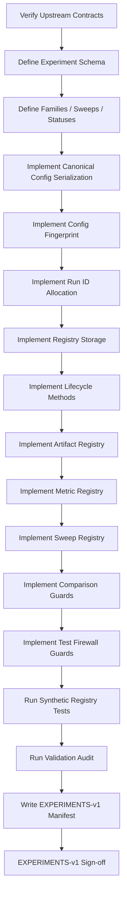
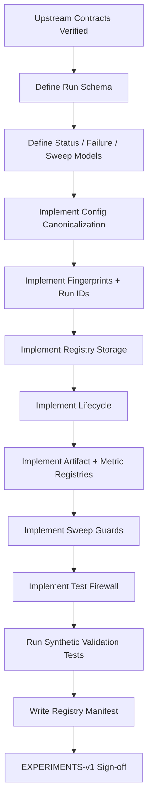

<div align="center">

# PHASE 13 — EXPERIMENT REGISTRY

## Kế hoạch xây dựng hệ thống đăng ký thí nghiệm, truy vết lineage, khóa cấu hình và quản lý kết quả

### Transformer Encoder cho hồi quy chuỗi thời gian đa biến trên UCI Appliances Energy Prediction

**Phase kế tiếp sau `Phase_12_Shared_metrics.md`**

</div>

---

# 1. Vai trò của Phase 13

Phase 13 chịu trách nhiệm xây dựng **một hệ thống đăng ký thí nghiệm thống nhất** để mọi run từ Persistence, LSTM, Transformer, các sweep, rolling-origin, multi-seed final run và Test evaluation đều:

```text
có ID duy nhất
có cấu hình đầy đủ
có lineage rõ
có trạng thái rõ
có artifact path rõ
có metric result rõ
có thể tái lập
có thể audit
```

Nếu các phase trước đã khóa:

```text
DATA-v1
SCHEMA-v1
TEMPORAL-v1
EDA-v1
FEATURES-v1
FEATURESETS-v1
SPLIT-v1
SCALING-v1
WINDOWS-v1
WINDOWPOP-v1
DATALOADERS-v1
METRICS-v1
```

thì Phase 13 phải tạo:

```text
EXPERIMENTS-v1
```

để kết nối toàn bộ các contract trên với từng model run.

Nguyên tắc cốt lõi:

\[
\boxed{
Every\ Run
=
Identity
+
Configuration
+
Lineage
+
Artifacts
+
Metrics
+
Status
}
\]

---

# 2. Vì sao Experiment Registry là bắt buộc?

Từ Phase 20 trở đi sẽ có rất nhiều run:

```text
Persistence baseline

LSTM baseline

Transformer B0

Feature-set sweep

Time-feature sweep

Target-scaling sweep

Lookback sweep

Pooling sweep

Activation sweep

Batch-size sweep

Learning-rate sweep

Weight-decay sweep

Dropout sweep

d_model sweep

head sweep

layer sweep

FFN sweep

loss sweep

epoch-cap sweep

gradient-clipping sweep

RevIN sweep

boundary protocol sensitivity

candidate synthesis

LSTM tuning

rolling-origin robustness

three-seed final runs

final Test evaluation
```

Nếu không có registry, rất dễ xảy ra:

```text
không biết run nào dùng scaler nào

không biết run nào dùng split nào

không biết checkpoint nào thuộc config nào

không biết metric nào là Validation hay Test

không biết seed nào được dùng

không biết feature order nào được dùng

không biết run thất bại hay chỉ chưa hoàn thành

không biết một kết quả có được tạo trước hay sau final model lock

không thể tái lập best run
```

---

# 3. Mục tiêu cần đạt sau Phase 13

Sau Phase 13 phải có:

```text
1. Experiment registry schema.

2. Run ID convention.

3. Experiment family convention.

4. Sweep ID convention.

5. Run lifecycle/status machine.

6. Upstream lineage fields.

7. Data-version fields.

8. Feature-set fields.

9. Split fields.

10. Scaling fields.

11. Window fields.

12. DataLoader fields.

13. Metric-version fields.

14. Model-family fields.

15. Architecture fields.

16. Training fields.

17. Optimizer fields.

18. Seed fields.

19. Loss fields.

20. Early-stopping fields.

21. Device/runtime fields.

22. Artifact fields.

23. Checkpoint fields.

24. Metric result fields.

25. Failure fields.

26. Timing fields.

27. Reproducibility fields.

28. Test-firewall fields.

29. Final-lock fields.

30. Controlled-sweep grouping.

31. Parent/child run lineage.

32. Immutable completed-run records.

33. Atomic writes.

34. Registry backup/versioning.

35. Duplicate-run detection.

36. Resume policy.

37. Dry-run registration.

38. Validation result registration.

39. Final Test result registration.

40. Registry validation tests.

41. Human-readable experiment index.

42. Machine-readable registry.

43. EXPERIMENTS-v1 manifest.

44. Phase 13 sign-off.
```

---

# 4. Những việc Phase 13 không làm

Phase 13 không:

```text
Không train model.

Không chọn winner.

Không chạy Persistence.

Không chạy LSTM.

Không chạy Transformer.

Không tune hyperparameter.

Không xem Test metric.

Không mở Test firewall.

Không thay split.

Không thay feature set.

Không thay scaler.

Không thay windows.

Không tự tính metric mới.

Không tạo checkpoint giả.

Không fabricate result.
```

Phase 13 chỉ xây:

```text
experiment tracking infrastructure.
```

---

# 5. Input contract

Phase 13 chỉ bắt đầu khi:

```text
Phase 12 = PASS
```

và truy ngược được:

```text
ENV-v1

DATA-v1
SCHEMA-v1
TEMPORAL-v1
EDA-v1

FEATURES-v1
FEATURESETS-v1

SPLIT-v1
SCALING-v1

WINDOWS-v1
WINDOWPOP-v1

DATALOADERS-v1
METRICS-v1
```

---

# 6. Output version

Gán:

```text
EXPERIMENTS-v1
```

Lineage:

```text
DATA-v1
   ↓
...
METRICS-v1
   ↓
EXPERIMENTS-v1
```

Mọi run từ Phase 14 trở đi phải được:

```text
registered
```

trước khi training/evaluation bắt đầu.

---

# 7. Experiment registry là source of truth nào?

Registry là source of truth cho:

```text
run identity

config identity

status

artifact paths

metrics

lineage
```

Registry **không thay thế**:

```text
model checkpoints

prediction files

metric artifacts

plots

raw logs
```

Nó chỉ:

```text
index
link
validate
trace.
```

---

# 8. Không dùng notebook output làm registry

Không dựa vào:

```text
scroll history
cell output
console print
filename memory
```

để nhớ experiment.

Mọi run phải có machine-readable record.

---

# 9. Canonical registry structure

Khuyến nghị:

```text
artifacts/
└── experiments/
    ├── experiment_registry.csv
    ├── experiment_registry.jsonl
    ├── experiment_families.csv
    ├── sweep_registry.csv
    ├── run_artifact_registry.csv
    ├── run_metric_registry.csv
    ├── run_failure_registry.csv
    ├── registry_manifest.json
    ├── registry_validation_audit.csv
    ├── registry_discrepancies.json
    ├── README_EXPERIMENTS.md
    └── phase_13_signoff.json
```

---

# 10. Vì sao dùng cả CSV và JSONL?

## CSV

Phù hợp:

```text
inspect
sort
filter
Excel/Pandas
```

## JSONL

Phù hợp:

```text
nested config
append-only records
schema evolution
machine parsing
```

Khuyến nghị:

```text
CSV = flattened human-friendly view

JSONL = canonical detailed run record
```

---

# 11. Không dùng Excel làm source of truth

Excel có thể dùng presentation.

Nhưng registry source:

```text
JSONL / structured JSON
```

vì:

```text
diff dễ
script-friendly
less manual corruption
```

---

# 12. Run concept

Một `run` là một lần thực thi cụ thể của:

```text
model/evaluation task
```

với một config đầy đủ.

Ví dụ:

```text
Transformer
FS1_TF1
L144
YS1
B64
LR=3e-4
WD=1e-4
Seed=42
```

là một run.

Nếu chạy lại cùng config sau code change:

```text
vẫn là run khác
```

vì runtime/code context khác.

---

# 13. Experiment family concept

`experiment_family` nhóm các run cùng mục tiêu.

Ví dụ:

```text
PERSISTENCE_BASELINE

LSTM_BASELINE

TRANSFORMER_BASELINE

S1_FEATURE_SET

S2_TIME_FEATURES

S3_TARGET_SCALING

S4_LOOKBACK

S5_POOLING

S6_ACTIVATION

S7_BATCH_SIZE

S8_LEARNING_RATE

S9_WEIGHT_DECAY

S10_DROPOUT

S11_D_MODEL

S12_HEADS

S13_LAYERS

S14_FFN

S15_LOSS

S16_EPOCH_CAP

S17_GRADIENT_CLIPPING

S18_REVIN

S19_BOUNDARY_PROTOCOL

LSTM_TUNING

ROLLING_ORIGIN

FINAL_SEED_RUN

FINAL_TEST
```

---

# 14. Sweep concept

Một `sweep_id` nhóm các run trong một controlled experiment.

Ví dụ:

```text
S1_FS_SWEEP_V1
```

có:

```text
FS0_TF1
FS1_TF1
FS2_TF1
```

với các factor khác giữ cố định.

---

# 15. Run ID phải unique

Mỗi run có:

```text
run_id
```

không trùng trong toàn project.

Hard invariant:

```text
run_id unique.
```

---

# 16. Run ID không nên chứa toàn bộ config

Không dùng ID dài kiểu:

```text
TRANSFORMER_FS1_TF1_L144_D64_H4_N2_F128...
```

vì:

```text
quá dài
dễ typo
config sau này đổi schema
```

Run ID chỉ cần:

```text
family + date/order + short hash.
```

---

# 17. Run ID convention đề xuất

Ví dụ:

```text
RUN_TR_B0_0001_A1B2C3D4
```

Trong đó:

```text
RUN
→ prefix

TR
→ Transformer

B0
→ baseline family

0001
→ sequential index

A1B2C3D4
→ short config fingerprint
```

---

# 18. Model code abbreviations

Canonical:

```text
PERSISTENCE → PS

LSTM → LS

TRANSFORMER_ENCODER → TR
```

Không dùng nhiều alias.

---

# 19. Run ID cho sweeps

Ví dụ:

```text
RUN_TR_S01_0001_XXXXXXXX
RUN_TR_S01_0002_XXXXXXXX
RUN_TR_S01_0003_XXXXXXXX
```

---

# 20. Run ID cho final seeds

Ví dụ:

```text
RUN_TR_FINAL_SEED42_0001_XXXXXXXX
RUN_TR_FINAL_SEED123_0002_XXXXXXXX
RUN_TR_FINAL_SEED2026_0003_XXXXXXXX
```

---

# 21. Run ID không encode result

Không dùng:

```text
BEST
WINNER
GOOD
FINAL2
```

trong ID trước khi evaluation.

---

# 22. Config fingerprint

Mỗi run có:

```text
config_fingerprint
```

SHA-256 trên canonical config.

Mục tiêu:

```text
phát hiện duplicate configs
trace exact config
```

---

# 23. Canonical config serialization

Trước hash:

```text
sort keys
normalize floats
normalize enum names
exclude runtime timestamps
exclude result values
```

Ví dụ:

```text
JSON canonical string
→ SHA-256
```

---

# 24. Fields không nên nằm config hash

Không include:

```text
run_id
created_at
started_at
completed_at
metrics
checkpoint path
error message
```

vì chúng không định nghĩa experiment config.

---

# 25. Fields nên nằm config hash

Include:

```text
model family
architecture
feature variant
lookback
horizon
target scaling
batch size
optimizer
LR
weight decay
dropout
loss
seed
max epochs
patience
grad clip
RevIN
boundary protocol
split version
scaling version
window population
metric version
```

---

# 26. Duplicate-config detection

Nếu một new run có cùng:

```text
config_fingerprint
```

với previous completed run:

Registry phải:

```text
warn
```

không hard block.

Vì rerun có thể cần:

```text
reproducibility
debug
environment change.
```

---

# 27. Rerun reason

Nếu duplicate config:

```text
rerun_reason
```

bắt buộc.

Examples:

```text
REPRODUCIBILITY_CHECK

CODE_FIX

DEVICE_CHANGE

ENVIRONMENT_CHANGE

CHECKPOINT_RECOVERY

MANUAL_RERUN
```

---

# 28. Parent run

Nếu run là:

```text
resume
rerun
fine-grained diagnostic
```

có thể có:

```text
parent_run_id.
```

---

# 29. Parent-child lineage

Examples:

```text
baseline run
→ diagnostic rerun

sweep winner
→ seed robustness run

candidate
→ rolling-origin run

final candidate
→ final Test evaluation.
```

---

# 30. Status machine

Canonical statuses:

```text
PLANNED

REGISTERED

RUNNING

COMPLETED

FAILED

CANCELLED

INVALIDATED

ARCHIVED
```

---

# 31. `PLANNED`

Run tồn tại trong sweep design nhưng chưa materialize config đầy đủ.

Không có:

```text
metrics.
```

---

# 32. `REGISTERED`

Config đầy đủ.

Run có thể bắt đầu.

---

# 33. `RUNNING`

Training/evaluation đang thực thi.

Phải có:

```text
started_at.
```

---

# 34. `COMPLETED`

Run hoàn thành đúng protocol.

Phải có:

```text
completed_at

required artifacts

Validation metrics nếu development run
```

---

# 35. `FAILED`

Run dừng vì error.

Phải có:

```text
failure_type
failure_message
failure_stage.
```

---

# 36. `CANCELLED`

User/dev chủ động dừng.

Không xem như model failure.

---

# 37. `INVALIDATED`

Run từng hoàn thành nhưng sau đó bị phát hiện protocol violation.

Ví dụ:

```text
wrong scaler
wrong split
leakage
feature-order bug
metric bug.
```

---

# 38. `ARCHIVED`

Run không còn active nhưng record vẫn giữ.

Không xóa.

---

# 39. Allowed status transitions

Ví dụ:

```text
PLANNED
→ REGISTERED

REGISTERED
→ RUNNING

RUNNING
→ COMPLETED

RUNNING
→ FAILED

REGISTERED
→ CANCELLED

COMPLETED
→ INVALIDATED

FAILED
→ ARCHIVED
```

---

# 40. Không sửa COMPLETED thành RUNNING

Nếu rerun:

```text
create new run_id.
```

---

# 41. Completed record immutability

Sau `COMPLETED`:

```text
config fields immutable.
```

Cho phép bổ sung:

```text
derived analysis links
archive notes
```

nhưng không đổi core config.

---

# 42. Nếu config sai sau completion

Không edit historical record.

Mark:

```text
INVALIDATED
```

và tạo new run.

---

# 43. Core run record groups

Một run record gồm:

```text
A. Identity

B. Experiment grouping

C. Upstream lineage

D. Data configuration

E. Model configuration

F. Training configuration

G. Reproducibility configuration

H. Runtime/device

I. Lifecycle/status

J. Artifacts

K. Metrics

L. Failure/notes
```

---

# 44. Group A — Identity fields

```text
run_id
config_fingerprint
registry_version
record_schema_version
```

---

# 45. Group B — Experiment grouping

```text
experiment_family
sweep_id
sweep_stage
parent_run_id
candidate_id
final_model_lock_id
```

---

# 46. `sweep_stage`

Examples:

```text
BASELINE

S1
S2
...
S19

LSTM_TUNING

ROLLING_ORIGIN

FINAL_SEED

FINAL_TEST
```

---

# 47. Group C — Upstream lineage

Mandatory:

```text
environment_id

dataset_revision

schema_version

temporal_version

eda_version

feature_version

feature_set_version

split_version

scaling_version

window_version

population_version

dataloader_version

metric_version
```

---

# 48. Why all upstream versions matter?

Nếu result khác giữa hai run, trước tiên phải biết:

```text
có thực sự chỉ model config khác không?
```

Nếu:

```text
split_version khác
```

thì direct comparison có thể invalid.

---

# 49. Upstream fingerprints

Ngoài version, lưu:

```text
feature_fingerprint

global_split_fingerprint

scaler_bundle_checksum

window_fingerprint

population_fingerprint

metric_contract_fingerprint

dataset_fingerprint

dataloader_fingerprint
```

---

# 50. Model comparison hard guard

Hai run chỉ direct comparable nếu required contract fields match, trừ factor intentionally swept.

Registry phải hỗ trợ:

```text
comparison compatibility check.
```

---

# 51. Group D — Data configuration

Fields:

```text
feature_variant_id

feature_count

lookback_steps

horizon_steps

sampling_interval_minutes

boundary_protocol

target_scaling_option

target_access_mode

train_sample_count

validation_sample_count

test_sample_count
```

---

# 52. Baseline data config B0

Reference:

```text
FS1_TF1
L144
H1
WB0
YS1
WINDOWPOP-v1
```

---

# 53. Group E — Model identity

Fields:

```text
model_family

model_name

model_version

implementation_version
```

Examples:

```text
PERSISTENCE

LSTM

TRANSFORMER_ENCODER
```

---

# 54. Model implementation version

Ví dụ:

```text
LSTM-v1

TRANSFORMER-v1
```

Nếu code logic thay đáng kể:

```text
version bump.
```

---

# 55. Architecture fields — LSTM

Khuyến nghị:

```text
input_size
hidden_size
num_layers
dropout
bidirectional
batch_first
pooling/readout
output_size
```

---

# 56. LSTM baseline expected semantics

Current main task:

```text
unidirectional
batch_first=True
sequence-to-one
```

Bidirectional LSTM không nằm current contract.

---

# 57. Architecture fields — Transformer

Khuyến nghị:

```text
input_size

d_model

num_heads

num_layers

ffn_dim

dropout

activation

pooling

positional_encoding_type

attention_aware

output_size

norm_first if used
```

---

# 58. Transformer B0 reference

```text
d_model = 64

heads = 4

layers = 2

FFN = 128

dropout = 0.1

activation = GELU

pooling = last-step
```

---

# 59. Architecture field naming phải nhất quán

Không mix:

```text
nhead
heads
num_heads
```

trong registry.

Canonical:

```text
num_heads.
```

---

# 60. Non-applicable fields

Ví dụ Persistence không có:

```text
dropout
optimizer
```

Use:

```text
null
```

không:

```text
0
```

nếu 0 có semantic khác.

---

# 61. Group F — Training configuration

Fields:

```text
batch_size

optimizer_name

learning_rate

weight_decay

loss_name

huber_delta

max_epochs

early_stopping_enabled

early_stopping_patience

early_stopping_metric

early_stopping_mode

gradient_clipping_enabled

gradient_clip_max_norm

scheduler_name

scheduler_config
```

---

# 62. Optimizer baseline

```text
AdamW
```

---

# 63. Baseline LR

```text
3e-4
```

---

# 64. Baseline weight decay

```text
1e-4
```

---

# 65. Baseline loss

```text
MSE
```

---

# 66. Baseline max epochs

```text
50
```

---

# 67. Baseline patience

```text
10
```

---

# 68. Baseline gradient clipping

```text
enabled
max_norm = 1.0
```

---

# 69. Scheduler baseline

Current master plan không bắt buộc scheduler.

Canonical:

```text
scheduler_name = null
```

không tự thêm ReduceLROnPlateau giữa các runs.

---

# 70. RevIN fields

```text
revin_enabled
revin_affine
revin_eps
revin_target_channels
```

Nếu off:

```text
revin_enabled=False
```

và other details có thể null/default.

---

# 71. Group G — Reproducibility fields

```text
seed

global_seed

dataloader_seed

deterministic_mode

torch_deterministic_algorithms

cudnn_deterministic

cudnn_benchmark

worker_seed_policy
```

---

# 72. Single seed source

Current run seed:

```text
seed
```

và derived loader streams theo Phase 11.

Không random generate seed nếu run config đã khóa.

---

# 73. Final seeds

```text
42
123
2026
```

---

# 74. Group H — Runtime/device fields

Fields:

```text
device_type

device_name

python_version

torch_version

sklearn_version

platform

hostname_optional

num_workers

pin_memory

mixed_precision

dtype

started_at

completed_at

duration_seconds
```

---

# 75. Hostname privacy

Hostname optional.

Không cần nếu:

```text
chứa username/private machine naming.
```

Có thể lưu:

```text
device type/model
```

đủ.

---

# 76. Mixed precision baseline

Current:

```text
False
```

trừ khi Phase 1/experimental protocol sau đổi.

---

# 77. Model dtype

Baseline:

```text
float32.
```

---

# 78. Runtime timing

Lưu:

```text
training_seconds

evaluation_seconds

total_seconds
```

nếu có.

Không dùng runtime làm primary model selection metric.

---

# 79. Group I — lifecycle timestamps

Fields:

```text
created_at

registered_at

started_at

completed_at

updated_at
```

Use:

```text
ISO-8601
```

---

# 80. Timezone convention

Khuyến nghị:

```text
UTC
```

trong machine-readable registry.

Có thể human display local timezone sau.

---

# 81. Group J — Artifact fields

Core:

```text
run_directory

config_path

training_log_path

checkpoint_best_path

checkpoint_last_path

learning_curve_path

prediction_path

metric_path

error_analysis_path

attention_path
```

Không phải run nào cũng có tất cả.

---

# 82. Run directory convention

```text
artifacts/runs/<run_id>/
```

Ví dụ:

```text
artifacts/runs/RUN_TR_B0_0001_AB12CD34/
```

---

# 83. Mỗi run directory có gì?

Khuyến nghị:

```text
config.json

status.json

logs/

checkpoints/

metrics/

predictions/

figures/

analysis/
```

---

# 84. Không tạo artifact giả

Nếu run chưa train:

```text
checkpoint path = null
```

Không tạo empty fake checkpoint.

---

# 85. Best checkpoint naming

```text
best_checkpoint.pt
```

---

# 86. Last checkpoint naming

```text
last_checkpoint.pt
```

---

# 87. Checkpoint checksum

Sau save:

```text
SHA-256
```

nên được lưu.

---

# 88. Checkpoint registry fields

```text
checkpoint_type

epoch

validation_rmse_wh

artifact_path

sha256

file_size_bytes
```

---

# 89. Best checkpoint selection metric

Must be:

```text
Validation RMSE Wh
```

theo METRICS-v1.

Không:

```text
Validation loss
```

nếu contract không đổi.

---

# 90. Group K — Metric fields

Không nên nhồi toàn bộ metric columns trong main registry nếu schema lớn.

Khuyến nghị:

```text
main registry:
best_validation_rmse_wh
best_epoch
```

và detailed metrics ở:

```text
run_metric_registry.csv
```

---

# 91. Run metric registry fields

```text
run_id

split_id

metric_name

metric_value

metric_unit

n_samples

metric_version

population_fingerprint

epoch_or_checkpoint

status
```

---

# 92. Development run metrics

Có thể có:

```text
TRAIN
VALIDATION
```

Không:

```text
TEST
```

trước Phase 47.

---

# 93. Final Test run metrics

Chỉ experiment family:

```text
FINAL_TEST
```

sau final model lock mới có:

```text
TEST
```

---

# 94. Test metric registry guard

Nếu:

```text
split_id = TEST
```

thì registry writer phải require:

```text
experiment_family = FINAL_TEST

final_model_lock_id not null

test_access_authorized = True.
```

---

# 95. Group L — Failure fields

```text
failure_type

failure_stage

exception_class

failure_message

traceback_path

recoverable

rerun_recommended
```

---

# 96. Failure taxonomy

Canonical:

```text
DATA_CONTRACT_ERROR

FEATURE_CONTRACT_ERROR

SPLIT_CONTRACT_ERROR

SCALER_CONTRACT_ERROR

WINDOW_CONTRACT_ERROR

DATALOADER_ERROR

MODEL_BUILD_ERROR

FORWARD_PASS_ERROR

NUMERICAL_ERROR

OOM_ERROR

TRAINING_ERROR

CHECKPOINT_ERROR

METRIC_ERROR

TEST_FIREWALL_VIOLATION

USER_CANCELLED

OTHER
```

---

# 97. OOM handling

Nếu CUDA/MPS/CPU OOM:

```text
status = FAILED

failure_type = OOM_ERROR
```

Không tự giảm batch size rồi tiếp tục dưới cùng run ID.

---

# 98. Nếu retry với batch size khác

Tạo:

```text
new run
```

vì config đã đổi.

---

# 99. NaN training loss

Mark:

```text
FAILED
failure_type = NUMERICAL_ERROR
```

Không drop bad batches rồi tiếp tục âm thầm.

---

# 100. Resume policy

Nếu run bị interruption nhưng config không đổi:

Có thể resume cùng run ID nếu:

```text
checkpoint valid

registry status cho phép resume

RNG state được restore theo training engine contract.
```

---

# 101. Resume status

Có thể thêm intermediate status:

```text
PAUSED
```

nếu muốn.

Nhưng baseline status model không bắt buộc.

Khuyến nghị giữ đơn giản.

---

# 102. Resume count

Field:

```text
resume_count
```

---

# 103. Resume source

```text
resume_checkpoint_path
resume_epoch
```

---

# 104. Không resume từ checkpoint run khác dưới same run ID

Nếu config/source run khác:

```text
new child run.
```

---

# 105. Dry run

Phase 18 forward-pass sanity có thể đăng ký:

```text
run_type = SANITY
```

hoặc separate sanity registry.

Khuyến nghị Experiment Registry hỗ trợ:

```text
execution_type
```

---

# 106. Execution type enum

```text
SANITY

TRAINING

EVALUATION

ROBUSTNESS

FINAL_TEST
```

---

# 107. SANITY runs có metric không?

Không nhất thiết.

Có thể chỉ có:

```text
shape audit
forward status
```

---

# 108. Experiment family vs execution type

Ví dụ:

```text
family = TRANSFORMER_BASELINE

execution_type = TRAINING
```

Khác nhau.

---

# 109. Controlled sweep principle

Một sweep phải ghi:

```text
factor_name

reference_config

varied_values

fixed_fields
```

---

# 110. Sweep registry

Tạo:

```text
sweep_registry.csv
```

Fields:

```text
sweep_id

sweep_stage

experiment_family

model_family

factor_name

factor_values

reference_run_id

selection_metric

selection_split

fixed_config_fingerprint

status

created_at

completed_at
```

---

# 111. Sweep fixed-config fingerprint

Hash tất cả fields:

```text
không được thay trong sweep
```

để phát hiện accidental confounding.

---

# 112. Sweep validation

Ví dụ S8 LR:

```text
learning_rate
```

được phép khác.

Nếu:

```text
dropout
```

cũng khác giữa runs:

```text
SWEEP_CONFOUNDING_ERROR
```

---

# 113. One-factor sweep audit

Tạo helper:

```text
compare_run_configs_except(...)
```

để xác minh:

```text
only intended field changed.
```

---

# 114. Sweep result status

Một sweep chỉ:

```text
COMPLETED
```

khi tất cả planned values có run hợp lệ hoặc documented failure.

Không silently omit failed option.

---

# 115. Failed sweep option

Nếu một option OOM:

```text
giữ FAILED run
```

và report:

```text
not evaluable under resource constraint.
```

Không xóa khỏi registry.

---

# 116. Sweep selection result

Phase-specific logic có thể ghi:

```text
selected_run_id
selected_value
selection_reason
```

sau sweep.

Nhưng Phase 13 chỉ định nghĩa schema.

---

# 117. Experiment family registry

Tạo:

```text
experiment_families.csv
```

Fields:

```text
family_id
family_name
purpose
phase
model_family
primary_factor
planned_runs
selection_metric
selection_split
status
```

---

# 118. Family IDs đề xuất

```text
F14_PERSISTENCE
F20_LSTM_BASELINE
F21_TRANSFORMER_B0
F23_S1_FEATURE_SET
F24_S2_TIME_FEATURE
...
F47_FINAL_TEST
```

---

# 119. Không dùng phase number một mình làm run ID

Phase number chỉ grouping.

Run ID phải unique.

---

# 120. Registry writer abstraction

Khuyến nghị module:

```text
ExperimentRegistry
```

Methods:

```text
register_run()

start_run()

complete_run()

fail_run()

cancel_run()

invalidate_run()

register_artifact()

register_metric()

register_checkpoint()

register_sweep()

validate_run()

get_run()

find_duplicates()

compare_runs()
```

---

# 121. Registry class không train model

Chỉ state management.

---

# 122. Atomic write requirement

Registry update phải:

```text
atomic.
```

Không viết thẳng file rồi crash giữa chừng.

Pattern:

```text
write temporary file
fsync/close
rename/replace atomically
```

---

# 123. Why atomic write?

Ngăn:

```text
corrupted JSONL/CSV
```

nếu process crash khi update.

---

# 124. Append-only vs rewrite

JSONL event log có thể:

```text
append-only.
```

Flattened CSV có thể:

```text
rebuild từ canonical records.
```

Khuyến nghị:

```text
canonical run records
+
derived CSV views.
```

---

# 125. Event log concept

Optional advanced design:

```text
registry_events.jsonl
```

Mỗi event:

```text
RUN_REGISTERED
RUN_STARTED
METRIC_LOGGED
RUN_COMPLETED
RUN_FAILED
```

---

# 126. Có bắt buộc event sourcing không?

Không.

Coursework đủ dùng:

```text
run JSON record
+
CSV registries.
```

Event log optional.

Không làm hệ thống quá phức tạp.

---

# 127. Per-run `config.json`

Mỗi run directory phải lưu:

```text
frozen config snapshot.
```

Không chỉ dựa global registry.

---

# 128. Per-run `status.json`

Lưu:

```text
run_id
status
timestamps
failure info
best epoch
best validation RMSE
```

---

# 129. Registry vs per-run config consistency

Audit:

```text
config fingerprint registry
=
config fingerprint config.json.
```

---

# 130. Configuration immutability

`config.json` phải viết:

```text
trước training.
```

Sau training không sửa core fields.

---

# 131. Runtime fields tách khỏi config

Không write:

```text
best_epoch
metrics
duration
```

vào immutable config block.

Dùng:

```text
result/status block.
```

---

# 132. Config schema groups

Khuyến nghị nested JSON:

```text
identity

lineage

data

model

training

reproducibility

runtime
```

---

# 133. Example conceptual config

```json
{
  "lineage": {
    "feature_set_version": "FEATURESETS-v1",
    "split_version": "SPLIT-v1",
    "scaling_version": "SCALING-v1",
    "window_version": "WINDOWS-v1",
    "metric_version": "METRICS-v1"
  },
  "data": {
    "variant_id": "FS1_TF1",
    "lookback": 144,
    "horizon": 1,
    "target_scaling": "YS1",
    "boundary_protocol": "WB0"
  },
  "model": {
    "family": "TRANSFORMER_ENCODER",
    "d_model": 64,
    "num_heads": 4,
    "num_layers": 2,
    "ffn_dim": 128
  }
}
```

Actual registry phải populate runtime fields khi run thực sự được tạo.

---

# 134. Không fabricate runtime values trong plan

Phase 13 plan chỉ định:

```text
fields
schemas
rules.
```

Không điền giả:

```text
duration
metric
checkpoint checksum.
```

---

# 135. Config validation trước registration

Run config phải pass:

```text
schema validation

upstream artifact validation

semantic validation

sweep consistency validation

test firewall validation.
```

---

# 136. Schema validation

Check:

```text
required keys tồn tại

enum hợp lệ

numeric ranges hợp lệ

null allowed đúng field.
```

---

# 137. Semantic validation examples

```text
d_model % num_heads == 0

lookback ∈ {36,72,144}

horizon = 1

batch_size ∈ {32,64}

seed int

dropout in [0,1)

patience > 0

max_epochs > 0
```

---

# 138. Transformer divisibility guard

Hard:

\[
d_{model}\bmod num\_heads=0
\]

---

# 139. Pooling enum

```text
LAST_STEP
MEAN
```

---

# 140. Activation enum

```text
RELU
GELU
```

---

# 141. Loss enum

```text
MSE
HUBER
```

---

# 142. Gradient clipping enum

Could be fields:

```text
enabled
max_norm
```

Không cần enum.

---

# 143. Boundary enum

```text
WB0_CONTEXT_CARRY_OVER

WB1_STRICT_ISOLATION
```

---

# 144. Feature-set enum

```text
FS0_TF0
FS0_TF1
FS1_TF0
FS1_TF1
FS2_TF0
FS2_TF1
```

---

# 145. Target scaling enum

```text
YS0
YS1
```

---

# 146. Device enum

```text
cuda
mps
cpu
```

Actual selected device từ Phase 1/runtime.

---

# 147. Test firewall registration rule

Development run config phải:

```text
test_access_authorized=False.
```

---

# 148. Final Test registration rule

Chỉ Phase 47:

```text
test_access_authorized=True
```

và cần:

```text
final_model_lock_id.
```

---

# 149. Final model lock record

Phase 45 sẽ tạo:

```text
final_model_lock.json
```

Experiment registry phải support reference:

```text
final_model_lock_id
```

---

# 150. Final Test config immutability

Final Test run phải derive config từ:

```text
locked final model.
```

Không cho override:

```text
feature set
lookback
architecture
LR
loss
```

ở Phase 47.

---

# 151. Final Test run validation

Compare:

```text
FINAL_TEST config
```

với:

```text
final_model_lock
```

Expected:

```text
exact match
```

trừ fields:

```text
evaluation mode
test access.
```

---

# 152. Registry comparison compatibility

Khuyến nghị function:

```text
assert_comparable_runs(run_a, run_b, allowed_differences)
```

---

# 153. Example — feature-set sweep

Allowed differences:

```text
feature_variant_id
feature_fingerprint
scaler_bundle
feature_count
```

Fixed:

```text
model
lookback
seed
LR
dropout
loss
batch size
split
population
metric version.
```

---

# 154. Example — LR sweep

Allowed:

```text
learning_rate.
```

Everything else fixed.

---

# 155. Example — seed robustness

Allowed:

```text
seed
dataloader seed
random states.
```

Everything else fixed.

---

# 156. Comparison guard output

```text
COMPARABLE

NOT_COMPARABLE

COMPARABLE_WITH_EXPECTED_DIFFERENCES
```

---

# 157. Comparison discrepancy artifact

Tạo:

```text
run_comparison_audit.csv
```

Fields:

```text
run_a
run_b
allowed_differences
actual_differences
unexpected_differences
status
```

---

# 158. Run artifact registry

Tạo:

```text
run_artifact_registry.csv
```

Fields:

```text
run_id

artifact_type

artifact_path

sha256

file_size_bytes

created_at

required

status
```

---

# 159. Artifact type enum

```text
CONFIG

STATUS

TRAIN_LOG

BEST_CHECKPOINT

LAST_CHECKPOINT

LEARNING_CURVE

METRICS

PREDICTIONS

RESIDUALS

ATTENTION

FIGURE

TABLE

OTHER
```

---

# 160. Required artifacts per run type

## SANITY

```text
config
status
audit
```

## TRAINING

```text
config
status
training log
best checkpoint
metrics
```

## FINAL_TEST

```text
config
status
final metrics
predictions
```

---

# 161. Required artifacts are phase-specific

Experiment registry supports rules.

Không mọi run cần attention file.

---

# 162. Artifact checksum policy

Khuyến nghị checksum cho:

```text
config
checkpoint
metrics
prediction files
```

Large plots optional.

---

# 163. Metrics artifact checksum

Hữu ích để:

```text
detect result modification.
```

---

# 164. Prediction artifact checksum

Đặc biệt quan trọng cho final Test.

---

# 165. Learning curve artifact

Có thể lưu:

```text
training_history.csv
```

per run.

Registry link path.

---

# 166. Training history schema

Fields:

```text
epoch
train_loss
validation_loss
validation_mae_wh
validation_rmse_wh
validation_r2
learning_rate
epoch_seconds
```

Fields chưa có thì null.

---

# 167. Early-stopping fields

Run record:

```text
best_epoch

stopped_epoch

early_stop_triggered

best_validation_rmse_wh.
```

---

# 168. Best epoch semantics

Best epoch xác định bằng:

```text
minimum Validation RMSE Wh.
```

Không minimum Validation loss nếu khác.

---

# 169. Checkpoint-best config consistency

Checkpoint metadata phải chứa:

```text
run_id
config_fingerprint
epoch
metric_version
validation_rmse_wh.
```

---

# 170. Last checkpoint semantics

`last_checkpoint.pt`:

```text
state ở epoch cuối thực thi
```

không nhất thiết best.

---

# 171. Registry lock file

Nếu nhiều process có thể update registry, cân nhắc:

```text
file lock
```

Nhưng coursework single-process có thể không cần.

---

# 172. Single-writer principle

Baseline:

```text
một process chịu trách nhiệm update registry.
```

Giảm concurrency complexity.

---

# 173. Atomic per-run updates

Per-run `status.json` update atomic.

Global registry derived sau.

---

# 174. Registry corruption recovery

Khuyến nghị backup:

```text
experiment_registry.backup.csv
```

hoặc snapshot định kỳ.

---

# 175. Registry snapshot

Sau major phases:

```text
Phase 21
Phase 41
Phase 46
Phase 47
```

có thể snapshot registry.

---

# 176. Snapshot naming

```text
experiment_registry_snapshot_phase21.csv
```

Không dùng timestamps làm source identity duy nhất.

---

# 177. Registry manifest

Tạo:

```text
registry_manifest.json
```

Fields:

```text
experiment_registry_version

record_schema_version

canonical_registry_file

flattened_registry_file

run_count

completed_count

failed_count

invalidated_count

active_count

metric_version

upstream_contract_versions

registry_fingerprint

audit_status

warnings

created_at

updated_at
```

---

# 178. Registry fingerprint

Hash canonical registry logical content.

Không include:

```text
updated_at
```

nếu muốn deterministic logical fingerprint.

---

# 179. Registry schema version

Tách:

```text
EXPERIMENTS-v1
```

và:

```text
record_schema_version = 1
```

Nếu thêm optional field:

```text
schema minor revision
```

có thể không cần toàn experiment version bump.

---

# 180. Khi nào EXPERIMENTS-v2?

Nếu thay fundamental semantics:

```text
run identity

status machine

config fingerprint policy

comparison policy

metric registration policy
```

---

# 181. Registry validation audit

Tạo:

```text
registry_validation_audit.csv
```

Checks:

```text
unique_run_ids

valid_statuses

valid_status_transitions

valid_config_fingerprints

valid_upstream_versions

artifact_paths_exist_when_required

metric_units_valid

test_metrics_authorized

completed_runs_have_required_fields

failed_runs_have_failure_info

no_duplicate_metric_rows

no_orphan_artifacts

no_orphan_metrics

no_orphan_parent_runs

sweep_consistency

status
```

---

# 182. Orphan metric

Metric record có:

```text
run_id
```

không tồn tại trong main registry.

Hard fail.

---

# 183. Orphan artifact

Artifact record có unknown:

```text
run_id.
```

Hard fail.

---

# 184. Orphan parent run

`parent_run_id` không tồn tại.

Warning/fail tùy case.

Khuyến nghị fail.

---

# 185. Duplicate metric row

Same:

```text
run_id
split_id
metric_name
epoch_or_checkpoint
```

xuất hiện hai lần conflicting.

Hard fail.

---

# 186. Completed run required fields

Phải có ít nhất:

```text
run_id

config_fingerprint

status=COMPLETED

started_at

completed_at

required artifacts

development metric nếu training run.
```

---

# 187. Failed run required fields

```text
failure_type

failure_stage

failure_message.
```

---

# 188. Invalidated run required fields

```text
invalidation_reason

invalidated_at.
```

---

# 189. Invalidation taxonomy

Examples:

```text
LEAKAGE_DISCOVERED

METRIC_BUG

SCALER_BUG

WINDOW_BUG

FEATURE_ORDER_BUG

WRONG_SPLIT

CODE_BUG

UPSTREAM_VERSION_INVALIDATED

OTHER
```

---

# 190. Invalidation cascade

Nếu:

```text
METRICS-v1
```

sau này bị invalidated:

Runs dùng nó có thể cần:

```text
metric recomputation
```

không necessarily model retraining.

Registry phải support:

```text
invalidation_scope.
```

---

# 191. Invalidation scopes

```text
METRICS_ONLY

EVALUATION_ONLY

TRAINING_AND_EVALUATION

FULL_RUN
```

---

# 192. Example — metric formula bug

Checkpoint vẫn valid.

Need:

```text
recompute metrics
```

không retrain.

---

# 193. Example — wrong scaler

Training itself invalid.

Need:

```text
FULL_RUN.
```

---

# 194. Registry notes

Human notes field:

```text
notes
```

không dùng làm machine decision.

---

# 195. Tags

Optional:

```text
tags
```

Examples:

```text
baseline
candidate
diagnostic
final
```

Nhưng tags không thay family/status.

---

# 196. Candidate IDs

Phase 42 có thể gán:

```text
CAND-01
CAND-02
```

Registry support:

```text
candidate_id.
```

---

# 197. Candidate does not mean selected

Candidate chỉ:

```text
shortlisted.
```

Final lock Phase 45 mới selected.

---

# 198. Final selected flag

Không nên dùng mutable boolean trong nhiều runs.

Khuyến nghị final model lock artifact reference.

---

# 199. Registry query helpers

Khuyến nghị:

```text
get_runs_by_family()

get_completed_runs()

get_failed_runs()

get_runs_by_sweep()

get_best_validation_run()

get_runs_by_seed()

get_run_metrics()

get_run_artifacts()
```

---

# 200. `get_best_validation_run()` caution

Chỉ dùng:

```text
within allowed experiment family/sweep
```

Không global search trên mọi runs để chọn final một cách uncontrolled.

---

# 201. Global best-run temptation

Không:

```text
SELECT MIN(validation_rmse) FROM all_runs
```

rồi gọi đó là final model.

Final selection theo:

```text
planned sequential sweep protocol
+
candidate synthesis
+
rolling-origin.
```

---

# 202. Registry không thay experimental protocol

Registry giúp tracking.

Không tự quyết scientific selection.

---

# 203. Phase sequencing trace

Mỗi family nên có:

```text
phase_number.
```

Ví dụ:

```text
23
24
25
...
```

---

# 204. Previous selected run reference

Mỗi sequential sweep có thể lưu:

```text
reference_run_id
```

để biết baseline cho phase đó đến từ đâu.

---

# 205. Sweep chain lineage

Ví dụ:

```text
B0
→ S1 winner
→ S2 winner
→ S3 winner
...
```

Registry có thể truy chain.

---

# 206. Không overwrite same reference config

Nếu S2 starting config lấy S1 selected run:

```text
store parent/reference.
```

---

# 207. Hyperparameter provenance

Mỗi selected option cuối cùng phải biết:

```text
được quyết định tại sweep nào.
```

Có thể tạo:

```text
selection_provenance.csv
```

optional.

---

# 208. Selection provenance fields

```text
parameter
selected_value
source_sweep_id
selected_run_id
selection_metric
metric_value
decision_date
notes
```

---

# 209. Có bắt buộc selection_provenance ở Phase 13?

Khuyến nghị tạo schema ngay.

Actual rows được populate sau Phase 23+.

---

# 210. Run config JSON should include nulls?

Khuyến nghị:

```text
explicit null
```

cho fields not applicable.

Lợi ích:

```text
stable schema.
```

---

# 211. Config schema strictness

Unknown keys:

```text
warning hoặc reject.
```

Khuyến nghị strict trong core sections.

---

# 212. Float normalization

Before fingerprint:

```text
3e-4
0.0003
```

phải canonicalize thành cùng logical value.

---

# 213. Integer normalization

```text
64
64.0
```

không nên hash khác nếu field semantic integer.

Schema coercion trước hash.

---

# 214. Enum normalization

```text
gelu
GELU
```

canonical:

```text
GELU.
```

---

# 215. Boolean normalization

Use actual:

```text
true/false
```

không strings.

---

# 216. Path normalization

Artifact path:

```text
project-relative
```

khuyến nghị.

Không hard-code absolute user machine path trong registry nếu có thể.

---

# 217. Why project-relative paths?

Giúp:

```text
portable repository
```

giữa machines.

---

# 218. External absolute paths

Nếu bắt buộc:

```text
record separately
```

không include in config fingerprint nếu environment-specific.

---

# 219. Code version provenance

Nếu project dùng Git:

Khuyến nghị fields:

```text
git_commit

git_dirty
```

---

# 220. Git fields có bắt buộc không?

Không nếu project không dùng Git.

Nhưng rất hữu ích.

---

# 221. Nếu `git_dirty=True`

Run vẫn có thể chạy.

Nhưng registry warning:

```text
UNCOMMITTED_CODE.
```

---

# 222. Code hash fallback

Nếu không Git:

Có thể hash key source files:

```text
model.py
training.py
metrics.py
dataset.py
```

thành:

```text
code_fingerprint.
```

---

# 223. Có cần hash toàn repo?

Không.

Chỉ core runtime files nếu cần.

---

# 224. Notebook code provenance

Nếu logic nằm notebook:

Khuyến nghị migrate core reusable code vào:

```text
src/
```

để provenance ổn định.

---

# 225. Notebook chỉ orchestration

Sau Phase 13, notebooks nên:

```text
load config
register run
call shared modules
save artifacts
```

không chứa logic khác nhau giữa experiments.

---

# 226. Experiment config source

Khuyến nghị:

```text
Python dataclass/dict
```

hoặc JSON/YAML config.

Do current project chưa khóa Hydra/MLflow/W&B:

```text
không thêm framework nặng.
```

---

# 227. Không bắt buộc MLflow/W&B

Manual local registry đủ cho coursework.

Lợi ích:

```text
dependency ít
offline
transparent
fully auditable.
```

---

# 228. Khi nào MLflow/W&B có thể hữu ích?

Nếu project scale lớn.

Nhưng không cần cho current scope.

Không đổi tool giữa chừng nếu registry local đã đủ.

---

# 229. Registry implementation language

Python standard library + Pandas đủ.

Optional:

```text
dataclasses
json
hashlib
pathlib
datetime
csv
```

Không cần database.

---

# 230. Có nên dùng SQLite?

Có thể.

Nhưng current run count dự kiến không quá lớn.

JSONL/CSV đơn giản hơn.

SQLite optional future extension.

---

# 231. Single-run transaction

Registration flow:

```text
validate config

compute fingerprint

allocate run_id

create run directory

write config.json atomically

insert registry record

status = REGISTERED
```

---

# 232. Start-run flow

```text
verify status REGISTERED

set RUNNING

started_at

write status
```

---

# 233. Complete-run flow

```text
verify required artifacts

verify required metrics

compute checksums

set completed_at

set COMPLETED.
```

---

# 234. Fail-run flow

```text
capture exception metadata

save traceback

set FAILED

preserve partial artifacts.
```

---

# 235. Never delete failed artifacts automatically

Failed run may be useful for:

```text
debug
OOM analysis
numerical instability diagnosis.
```

---

# 236. Cancel-run flow

Store:

```text
cancel_reason.
```

---

# 237. Invalidated-run flow

Store:

```text
invalidation_reason

scope

replacement_run_id optional.
```

---

# 238. Run locking

While RUNNING:

```text
config immutable.
```

---

# 239. Artifact registration timing

Artifact can be registered:

```text
as soon as created.
```

Final completion validates all required ones.

---

# 240. Metric registration timing

Validation metrics can be logged per epoch in:

```text
training_history.csv
```

Registry detailed metric table only cần:

```text
best/final checkpoint metrics
```

để tránh millions of rows.

---

# 241. Per-epoch metrics storage

Store:

```text
training_history.csv
```

not global metric registry.

---

# 242. Global run metric registry scope

Recommended:

```text
best validation checkpoint

final/last checkpoint optional

final Test metrics.
```

---

# 243. Early stopping trace

Run record must retain:

```text
best_epoch
best_validation_rmse
stopped_epoch.
```

---

# 244. Hyperparameter sweep result table

Phase-specific results có thể được generated từ registry:

```text
sweep_results_<sweep_id>.csv
```

Không manual copy.

---

# 245. Registry-driven tables

Phase 58 final tables nên query:

```text
experiment registry + metric registry
```

không paste numbers từ notebook output.

---

# 246. Registry-driven reproducibility

Một run có thể be reproduced by:

```text
load run config
verify upstream artifacts
rebuild DataLoader
build model
train/evaluate.
```

---

# 247. `reproduce_run(run_id)` helper

Optional.

Phải:

```text
load config
validate environment/upstream
```

trước run.

---

# 248. Reproduction is new run or same run?

Nếu rerun reproduction:

```text
new run_id
parent_run_id = original.
```

Không overwrite original.

---

# 249. Reproduction comparison

Registry can compare:

```text
config same
environment same/different
metrics difference.
```

---

# 250. Exact reproduction caveat

PyTorch may not guarantee bitwise results across:

```text
platform
release
device.
```

Registry must store environment details to interpret.

---

# 251. Registry validation before each phase

From Phase 14 onward:

```text
before executing run:
validate_registry()
```

---

# 252. Registry backup before sweep

Optional:

```text
snapshot before large sweep.
```

---

# 253. Registry status counts

Useful dashboard-like summary:

```text
planned
running
completed
failed
invalidated.
```

No fancy UI required.

---

# 254. Human-readable summary

Tạo:

```text
EXPERIMENT_INDEX.md
```

Có thể auto-generate:

```text
family
run count
best Validation RMSE
selected run
status.
```

---

# 255. Không manually maintain EXPERIMENT_INDEX.md

Generate from registry.

---

# 256. Phase 13 notebook structure

Khuyến nghị:

```text
20–28 cells
```

## Cell 13.1 — Phase title

## Cell 13.2 — Verify upstream versions

## Cell 13.3 — Declare run schema

## Cell 13.4 — Declare experiment families

## Cell 13.5 — Declare run statuses

## Cell 13.6 — Declare failure taxonomy

## Cell 13.7 — Implement canonical config serialization

## Cell 13.8 — Implement config fingerprint

## Cell 13.9 — Implement run ID allocator

## Cell 13.10 — Implement registry storage

## Cell 13.11 — Implement atomic writes

## Cell 13.12 — Implement `register_run`

## Cell 13.13 — Implement lifecycle transitions

## Cell 13.14 — Implement artifact registration

## Cell 13.15 — Implement metric registration

## Cell 13.16 — Implement sweep registration

## Cell 13.17 — Implement config comparison guard

## Cell 13.18 — Implement duplicate-run detection

## Cell 13.19 — Implement Test-firewall registry guard

## Cell 13.20 — Implement registry validation

## Cell 13.21 — Synthetic run registration tests

## Cell 13.22 — Status-transition tests

## Cell 13.23 — Duplicate-config tests

## Cell 13.24 — Sweep consistency tests

## Cell 13.25 — Test metric guard test

## Cell 13.26 — Save registry schemas/artifacts

## Cell 13.27 — Write README

## Cell 13.28 — Phase sign-off

---

# 257. Quy trình thực thi Phase 13



---

# 258. Function/class design khuyến nghị

```text
ExperimentRegistry

RunConfig

RunRecord

RunStatus

ExperimentFamily

ExecutionType

FailureType

SweepDefinition

ArtifactRecord

MetricRecord

canonicalize_config()

compute_config_fingerprint()

allocate_run_id()

validate_run_config()

validate_status_transition()

validate_sweep_consistency()

assert_comparable_runs()

register_run()

start_run()

complete_run()

fail_run()

invalidate_run()

register_artifact()

register_metric()

register_sweep()

snapshot_registry()

validate_registry()

write_registry_manifest()
```

---

# 259. Synthetic registry test strategy

Phase 13 chưa train thật.

Dùng synthetic records để test:

```text
register
start
complete
fail
duplicate
invalid transition
artifact link
metric guard.
```

Không fabricate model metric như real result.

Synthetic value phải rõ:

```text
TEST_ONLY
```

và không lưu vào production registry.

---

# 260. Test registry phải tách production registry

Dùng:

```text
temporary directory
```

hoặc:

```text
artifacts/experiments/_tests/
```

Không pollute production.

---

# 261. Unit test — unique run ID

Register nhiều synthetic runs.

Expected:

```text
all unique.
```

---

# 262. Unit test — same config fingerprint

Same logical config:

```text
same fingerprint.
```

---

# 263. Unit test — float canonicalization

```text
0.0003
3e-4
```

Expected:

```text
same fingerprint.
```

---

# 264. Unit test — enum canonicalization

```text
gelu
GELU
```

Expected normalized config same.

---

# 265. Unit test — invalid status transition

```text
COMPLETED → RUNNING
```

Expected:

```text
reject.
```

---

# 266. Unit test — failed run

Must require:

```text
failure info.
```

---

# 267. Unit test — completed run

Must require:

```text
required artifacts/metrics.
```

---

# 268. Unit test — duplicate config

Expected:

```text
warning
rerun_reason required.
```

---

# 269. Unit test — Test metric forbidden

Development run tries:

```text
split=TEST
```

Expected:

```text
reject.
```

---

# 270. Unit test — final Test allowed

Only synthetic final-lock context.

Expected:

```text
allowed.
```

---

# 271. Unit test — sweep confounding

S8 LR sweep where dropout differs.

Expected:

```text
reject/warn as confounded.
```

Preferred:

```text
hard fail.
```

---

# 272. Unit test — allowed sweep difference

Only LR differs.

Expected:

```text
PASS.
```

---

# 273. Unit test — orphan metric

Expected:

```text
FAIL.
```

---

# 274. Unit test — orphan artifact

Expected:

```text
FAIL.
```

---

# 275. Unit test — checksum mismatch

Artifact registered checksum differs.

Expected:

```text
FAIL.
```

---

# 276. Unit test — config file mismatch

Per-run config hash khác registry.

Expected:

```text
FAIL.
```

---

# 277. Unit test — parent run missing

Expected:

```text
FAIL.
```

---

# 278. Unit test — invalid upstream version

Expected:

```text
FAIL.
```

---

# 279. Unit test — immutable config

After completion attempt config edit.

Expected:

```text
reject.
```

---

# 280. Unit test — invalidation

Completed run → INVALIDATED.

Expected:

```text
allowed
reason required.
```

---

# 281. Unit test — rerun creates new ID

Expected:

```text
new run_id
same config_fingerprint possible.
```

---

# 282. Acceptance philosophy

Registry correctness quan trọng ngang training correctness.

Một model metric không traceable:

```text
không nên được dùng trong final conclusions.
```

---

# 283. Production registry empty at Phase 13 completion

Hoàn toàn hợp lệ.

Phase 13 kết thúc có thể chỉ có:

```text
schemas
families
sweep definitions
manifest
```

chưa có real training runs.

---

# 284. Có nên pre-register future runs?

Có thể pre-register:

```text
planned families/sweeps
```

nhưng không cần tạo toàn bộ hundreds run IDs trước.

Khuyến nghị:

```text
register run ngay trước execution.
```

---

# 285. Pre-register sweep definitions

Nên.

Ví dụ:

```text
S1 feature-set sweep
```

được khai báo trước Phase 23.

---

# 286. Sweep plan source of truth

Master plan đã khóa option list.

Registry sweep schema sẽ encode những option này khi phase tương ứng bắt đầu.

---

# 287. Run status không dựa filename existence

Không:

```text
checkpoint tồn tại → COMPLETED
```

Status phải explicit và validated.

---

# 288. Crash recovery

Nếu process crash khi status RUNNING:

On next startup:

```text
detect stale RUNNING
```

và mark:

```text
FAILED / INTERRUPTED
```

sau investigation.

---

# 289. `INTERRUPTED` failure type

Có thể thêm:

```text
failure_type = INTERRUPTED.
```

---

# 290. Partial metrics after failure

Giữ:

```text
training_history
```

nhưng không đăng ký best Validation metric là completed selection result nếu run invalid.

---

# 291. Failed run excluded from selection

Phase 42/etc. chỉ query:

```text
status = COMPLETED
```

và:

```text
not invalidated.
```

---

# 292. Invalidated run excluded from selection

Hard.

---

# 293. Cancelled run excluded

Hard.

---

# 294. Registry query filter

Selection query:

```text
status == COMPLETED
AND validation_metric_status == PASS
```

---

# 295. Resource failure reporting

Nếu option OOM:

Registry keeps:

```text
FAILED
OOM_ERROR
```

để report limitation.

---

# 296. No hidden reruns

Mỗi rerun phải có record.

Không chạy model thủ công rồi chỉ copy metric cuối.

---

# 297. No manual best-metric overwrite

Best metric phải derive từ:

```text
training history
```

và checkpoint metadata.

Registry writer validates.

---

# 298. Metric-to-checkpoint consistency

Best checkpoint metric:

```text
must match run_metric_registry
```

within tolerance.

---

# 299. Experiment result provenance chain

Final result phải truy:

```text
Table cell
→ metric record
→ run_id
→ checkpoint
→ config
→ feature set
→ scaler
→ split
→ windows
→ raw DATA-v1.
```

Đây là mục tiêu khoa học quan trọng nhất của Phase 13.

---

# 300. Human-readable run summary

Mỗi completed run có thể generate:

```text
RUN_SUMMARY.md
```

Optional.

Nội dung:

```text
Config
Best epoch
Validation metrics
Artifacts
Warnings
```

---

# 301. Không dùng summary làm source of truth

Source vẫn:

```text
registry + config + metrics.
```

---

# 302. Data schema fields — main registry

Khuyến nghị flattened main CSV có:

```text
run_id
status
experiment_family
sweep_id
execution_type
model_family

config_fingerprint

environment_id

feature_variant_id
feature_fingerprint

split_version
global_split_fingerprint

scaling_version
scaler_bundle_id

window_version
population_version
population_fingerprint

dataloader_version
metric_version

lookback_steps
horizon_steps
target_scaling
boundary_protocol

batch_size
seed

learning_rate
weight_decay
loss_name

max_epochs
patience

best_epoch
best_validation_rmse_wh

device_type

created_at
started_at
completed_at

parent_run_id
candidate_id
final_model_lock_id

notes
```

Architecture-specific detail để nested JSON.

---

# 303. Main CSV không cần mọi nested architecture field

Có thể flatten key fields:

```text
d_model
num_heads
num_layers
ffn_dim
dropout
```

nếu convenience.

Detailed source remains JSONL/config.

---

# 304. Registry merge safety

Không manual concatenate CSV files.

Use registry API.

---

# 305. Registry sorting

Human view sort:

```text
created_at
```

hoặc:

```text
family
run sequence.
```

Canonical logical identity không phụ thuộc row order.

---

# 306. Registry query reproducibility

Queries used to create final tables nên lưu:

```text
script/function
```

không thủ công filter Excel.

---

# 307. Final table traceability

Phase 58 table row should include:

```text
run_id
```

at least in supplementary artifact.

Main paper có thể ẩn run ID nếu cần presentation.

---

# 308. Final conclusion traceability

Mọi claim như:

```text
Transformer outperformed LSTM
```

phải truy được đến:

```text
specific comparable completed runs.
```

---

# 309. Experiment registry discrepancy categories

```text
DUPLICATE_RUN_ID

DUPLICATE_CONFIG_UNEXPLAINED

INVALID_STATUS_TRANSITION

CONFIG_FINGERPRINT_MISMATCH

UPSTREAM_VERSION_MISMATCH

UPSTREAM_FINGERPRINT_MISMATCH

SWEEP_CONFOUNDING

ORPHAN_METRIC

ORPHAN_ARTIFACT

ORPHAN_PARENT

ARTIFACT_MISSING

ARTIFACT_CHECKSUM_MISMATCH

METRIC_UNIT_MISMATCH

METRIC_POPULATION_MISMATCH

TEST_FIREWALL_VIOLATION

IMMUTABILITY_VIOLATION

FINAL_LOCK_MISMATCH

OTHER
```

---

# 310. Registry discrepancy log

Tạo:

```text
registry_discrepancies.json
```

Fields:

```text
id

severity

run_id optional

sweep_id optional

category

expected

actual

interpretation

recommended_action

resolved

notes
```

---

# 311. Registry status model

## PASS

```text
Schemas valid.
Lifecycle valid.
Guards valid.
Synthetic tests pass.
```

## PASS_WITH_WARNING

Ví dụ:

```text
Git provenance unavailable,
code fingerprint fallback used.
```

## FAIL

Ví dụ:

```text
run IDs can collide
Test metrics can be logged early
config mutations are possible
sweep confounding not detectable.
```

---

# 312. Output directory

```text
artifacts/
└── experiments/
    ├── experiment_registry.csv
    ├── experiment_registry.jsonl
    ├── experiment_families.csv
    ├── sweep_registry.csv
    ├── run_artifact_registry.csv
    ├── run_metric_registry.csv
    ├── run_failure_registry.csv
    ├── run_comparison_audit.csv
    ├── registry_validation_audit.csv
    ├── registry_manifest.json
    ├── registry_discrepancies.json
    ├── EXPERIMENT_INDEX.md
    ├── README_EXPERIMENTS.md
    └── phase_13_signoff.json
```

Source code recommended:

```text
src/
└── experiments/
    ├── registry.py
    ├── schemas.py
    ├── fingerprints.py
    ├── validation.py
    └── queries.py
```

---

# 313. Output O13.1 — Registry implementation

```text
ExperimentRegistry
```

---

# 314. Output O13.2 — Main registry schema

```text
experiment_registry.jsonl
```

---

# 315. Output O13.3 — Flattened registry

```text
experiment_registry.csv
```

---

# 316. Output O13.4 — Experiment family registry

```text
experiment_families.csv
```

---

# 317. Output O13.5 — Sweep registry

```text
sweep_registry.csv
```

---

# 318. Output O13.6 — Artifact registry

```text
run_artifact_registry.csv
```

---

# 319. Output O13.7 — Metric registry

```text
run_metric_registry.csv
```

---

# 320. Output O13.8 — Failure registry

```text
run_failure_registry.csv
```

---

# 321. Output O13.9 — Comparison audit

```text
run_comparison_audit.csv
```

---

# 322. Output O13.10 — Registry validation audit

```text
registry_validation_audit.csv
```

---

# 323. Output O13.11 — Manifest

```text
registry_manifest.json
```

---

# 324. Output O13.12 — Discrepancy log

```text
registry_discrepancies.json
```

---

# 325. Output O13.13 — Human-readable index

```text
EXPERIMENT_INDEX.md
```

---

# 326. Output O13.14 — README

```text
README_EXPERIMENTS.md
```

---

# 327. Output O13.15 — Sign-off

```text
phase_13_signoff.json
```

---

# 328. Registry manifest minimum fields

```text
experiment_registry_version = EXPERIMENTS-v1

record_schema_version

canonical_registry_format

flattened_registry_format

run_id_policy

config_fingerprint_policy

status_model

failure_taxonomy_version

artifact_registry_enabled

metric_registry_enabled

test_firewall_enabled

sweep_consistency_guard_enabled

completed_run_immutability

atomic_write_policy

upstream_versions

registry_fingerprint

validation_audit_status

warnings

created_at

updated_at
```

---

# 329. Phase 13 sanity checklist

```text
[ ] Phase 12 PASS.

[ ] All upstream versions known.

[ ] EXPERIMENTS-v1 declared.

[ ] Run schema defined.

[ ] Run status enum defined.

[ ] Failure taxonomy defined.

[ ] Execution type enum defined.

[ ] Experiment families defined.

[ ] Sweep schema defined.

[ ] Canonical config serialization implemented.

[ ] Float normalization implemented.

[ ] Enum normalization implemented.

[ ] Config fingerprint implemented.

[ ] Run ID allocator implemented.

[ ] Run ID uniqueness tested.

[ ] Duplicate-config detection implemented.

[ ] Rerun reason policy implemented.

[ ] Parent run policy implemented.

[ ] Status-transition guard implemented.

[ ] Completed-run immutability implemented.

[ ] Failed-run required fields implemented.

[ ] Invalidated-run policy implemented.

[ ] Atomic writes implemented.

[ ] Per-run config.json contract defined.

[ ] Per-run status.json contract defined.

[ ] Artifact registry implemented.

[ ] Metric registry implemented.

[ ] Checkpoint registry fields defined.

[ ] Test metric firewall implemented.

[ ] Final model lock reference supported.

[ ] Sweep fixed-field guard implemented.

[ ] One-factor difference checker implemented.

[ ] Comparison compatibility helper implemented.

[ ] Orphan metric detection implemented.

[ ] Orphan artifact detection implemented.

[ ] Orphan parent detection implemented.

[ ] Artifact checksum policy implemented.

[ ] Metric population guard implemented.

[ ] Metric unit guard implemented.

[ ] Registry manifest implemented.

[ ] Registry fingerprint implemented.

[ ] Synthetic production-independent tests pass.

[ ] Same logical config → same fingerprint.

[ ] Same config rerun → new run ID.

[ ] Invalid status transition rejected.

[ ] Development Test metric rejected.

[ ] Final Test context can be validated.

[ ] Sweep confounding rejected.

[ ] Config mutation after completion rejected.

[ ] Registry audit PASS.

[ ] README_EXPERIMENTS written.

[ ] EXPERIMENTS-v1 sign-off completed.
```

---

# 330. Acceptance criteria

Phase 13 chỉ PASS khi:

```text
Every future run can receive a unique run ID.

Every run has a frozen config fingerprint.

Every run traces to all upstream contracts.

Status transitions are controlled.

Completed configs are immutable.

Failed runs remain traceable.

Artifacts and metrics are linked by run ID.

Test metrics cannot be registered during development.

Sweeps can detect unintended config differences.

Duplicate configs are detectable.

Registry writes are atomic.

Synthetic registry tests pass.

Final result provenance can be reconstructed end-to-end.
```

---

# 331. Khi nào Phase 13 FAIL?

```text
Run IDs có thể trùng.

Config có thể sửa sau completion.

Metric có thể tồn tại không có run.

Artifact có thể tồn tại không có run.

Test metric có thể log trước final lock.

Sweep không biết field nào phải fixed.

Wrong split/scaler/window version vẫn được register.

Completed run không có checkpoint/metric required.

Failed run mất failure information.

Registry chỉ tồn tại trong notebook memory.

Config fingerprints không deterministic.

Rerun overwrite old run.

Registry update có thể corrupt file giữa chừng.
```

---

# 332. Các lỗi thường gặp

## Lỗi 1 — Tên file checkpoint là experiment tracker

Không đủ.

---

## Lỗi 2 — Chỉ ghi hyperparameters, không ghi data lineage

Không thể biết model dùng dữ liệu nào.

---

## Lỗi 3 — Chỉ ghi best RMSE, không ghi run ID

Không trace được.

---

## Lỗi 4 — Một run được sửa config sau khi chạy

Làm mất provenance.

---

## Lỗi 5 — Rerun overwrite checkpoint cũ

Mất lịch sử.

---

## Lỗi 6 — Failed runs bị xóa

Mất evidence resource/numerical issues.

---

## Lỗi 7 — Sweep option thất bại bị bỏ khỏi bảng

Gây selection bias.

---

## Lỗi 8 — S8 LR sweep nhưng dropout cũng đổi

Confounded experiment.

---

## Lỗi 9 — Test metric log “chỉ để xem”

Phá final holdout.

---

## Lỗi 10 — Global best Validation RMSE được chọn từ mọi run

Vi phạm sequential experimental protocol.

---

## Lỗi 11 — Metrics copy tay vào Excel

Dễ typo và mất provenance.

---

## Lỗi 12 — Không lưu environment/device

Khó tái lập.

---

## Lỗi 13 — Không lưu seed

Không đánh giá stochastic variation được.

---

## Lỗi 14 — Không lưu feature fingerprint

Có thể cùng tên variant nhưng khác order.

---

## Lỗi 15 — Không lưu population fingerprint

Có thể so metrics trên target populations khác nhau.

---

## Lỗi 16 — Registry dùng absolute machine paths

Khó portable.

---

# 333. Handoff sang Phase 14

Phase 14 — Persistence Baseline phải:

```text
register run trước evaluation.
```

Experiment family:

```text
PERSISTENCE_BASELINE.
```

Sau completion:

```text
Validation metrics
```

được ghi bằng `METRICS-v1`.

---

# 334. Handoff sang Phase 15–18

Model implementation/sanity runs có thể:

```text
execution_type = SANITY
```

và được registry trace nếu cần.

---

# 335. Handoff sang Phase 19

Training Engine sẽ dùng:

```text
register_run

start_run

register_checkpoint

register_metric

complete_run

fail_run.
```

Phase 19 là consumer chính của ExperimentRegistry.

---

# 336. Handoff sang Phase 20

LSTM baseline run phải ghi:

```text
family = LSTM_BASELINE
```

và full config.

---

# 337. Handoff sang Phase 21

Transformer B0 run:

```text
family = TRANSFORMER_BASELINE
```

và full B0 config.

---

# 338. Handoff sang Phase 22

Learning-curve diagnostics sẽ load:

```text
training_history path
```

qua run registry.

---

# 339. Handoff sang Phase 23–41

Mỗi sweep:

```text
register sweep

register planned/executed runs

validate one-factor differences

record selected run.
```

---

# 340. Handoff sang Phase 42

Candidate synthesis sẽ query:

```text
COMPLETED valid runs
```

và build candidate list.

Không đọc metrics thủ công từ notebooks.

---

# 341. Handoff sang Phase 43

LSTM tuning là:

```text
separate family/sweep.
```

---

# 342. Handoff sang Phase 44

Rolling-origin robustness:

```text
execution_type = ROBUSTNESS
```

có thể có:

```text
parent_run_id = candidate run.
```

---

# 343. Handoff sang Phase 45

Final model lock phải reference:

```text
selected run IDs
candidate IDs
config fingerprints.
```

---

# 344. Handoff sang Phase 46

Three-seed final runs:

```text
same locked config

different seed only.
```

Sweep-consistency helper phải chứng minh điều này.

---

# 345. Handoff sang Phase 47

Final Test:

```text
family = FINAL_TEST

execution_type = FINAL_TEST

final_model_lock_id required

test_access_authorized = True.
```

---

# 346. Handoff sang Phase 48–57

Prediction/residual/attention artifacts được:

```text
register_artifact(run_id, ...)
```

để trace.

---

# 347. Handoff sang Phase 58

Final result tables query:

```text
run_metric_registry
experiment_registry
```

---

# 348. Handoff sang Phase 59

Final conclusions chỉ dùng:

```text
valid completed runs
not invalidated
correct population
correct metric version.
```

---

# 349. Phase 13 Definition of Done



Phase 13 hoàn thành khi:

\[
\boxed{
Unique\ Identity
+
Frozen\ Config
+
Complete\ Lineage
+
Controlled\ Lifecycle
+
Traceable\ Results
+
Protected\ Test
}
\]

được đảm bảo.

---

# 350. Final status contract

```text
Phase 13 không train model.

Phase 13 không chọn winner.

Phase 13 không mở Test.

Phase 13 khóa cách mọi experiment được đăng ký và truy vết.

Mọi run từ Phase 14 trở đi
phải được đăng ký trong EXPERIMENTS-v1
trước khi thực thi.
```

---

<div align="center">

# PHASE 13 — FINAL CHECK

**Không có metric nào được phép “không biết đến từ run nào”.**

**Không có run nào được phép “không biết dùng data/split/scaler/window nào”.**

**Không overwrite rerun.**

**Không sửa config của completed run.**

**Không bỏ failed option khỏi lịch sử.**

**Không log Test metric trước final model lock.**

**Mọi controlled sweep phải chứng minh chỉ factor dự kiến được thay đổi.**

**Chỉ sau khi `EXPERIMENTS-v1` được sign-off mới chuyển sang PHASE 14 — Persistence Baseline.**

</div>
