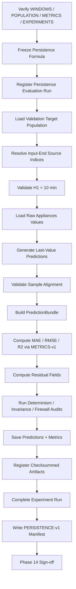
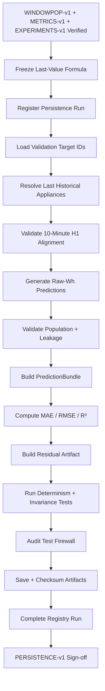

<div align="center">

# PHASE 14 — PERSISTENCE BASELINE

## Kế hoạch xây dựng baseline dự báo ngây thơ theo giá trị quan sát gần nhất

### Transformer Encoder cho hồi quy chuỗi thời gian đa biến trên UCI Appliances Energy Prediction

**Phase kế tiếp sau `Phase_13_Experiment_registry.md`**

</div>

---

# 1. Vai trò của Phase 14

Phase 14 chịu trách nhiệm xây dựng và đánh giá **Persistence baseline** cho bài toán dự báo điện năng tiêu thụ một bước thời gian phía trước.

Đây là baseline đơn giản nhất nhưng rất quan trọng đối với chuỗi thời gian có tính tự tương quan mạnh.

Nếu:

```text
Phase 12
→ khóa METRICS-v1

Phase 13
→ khóa EXPERIMENTS-v1
```

thì Phase 14 phải tạo baseline tham chiếu:

```text
PERSISTENCE-v1
```

với quy tắc:

\[
\boxed{
\hat y_{t+1}=y_t
}
\]

Trong coursework này:

```text
y = Appliances
sampling interval = 10 phút
horizon = H1
```

nên Persistence dự báo:

> Mức tiêu thụ điện của 10 phút tiếp theo bằng mức tiêu thụ điện quan sát ở 10 phút hiện tại.

Nguyên tắc:

\[
\boxed{
Simple
+
Leakage\text{-}Safe
+
Same\ Population
+
Original\ Wh
+
Hard\ To\ Beat
}
\]

---

# 2. Tại sao cần Persistence baseline?

Time-series neural models có thể đạt metric nhìn khá tốt chỉ vì target:

```text
có autocorrelation mạnh.
```

Nếu:

```text
Transformer RMSE
```

không tốt hơn một predictor cực đơn giản:

```text
last observed value
```

thì việc dùng architecture phức tạp chưa được chứng minh có giá trị.

Persistence baseline trả lời:

> Mô hình học sâu có thực sự học được predictive structure vượt quá việc “giữ nguyên mức tiêu thụ gần nhất” hay không?

---

# 3. Baseline phải có ý nghĩa khoa học

Persistence không phải:

```text
một baseline cho có.
```

Nó là benchmark bắt buộc để phân biệt:

```text
real forecasting improvement
```

khỏi:

```text
benefit chỉ đến từ strong local autocorrelation.
```

---

# 4. Mục tiêu cần đạt sau Phase 14

Sau Phase 14 phải có:

```text
1. Persistence formula được khóa.

2. Prediction horizon được xác minh là H1 = 10 phút.

3. Historical target availability được xác minh.

4. Baseline dùng đúng WINDOWPOP-v1.

5. Baseline Validation target IDs giống neural models sau này.

6. Baseline không dùng feature scaling.

7. Baseline không dùng target scaler.

8. Baseline output ở Wh.

9. Baseline không dùng optimizer.

10. Baseline không train.

11. Baseline không có checkpoint model.

12. Validation predictions được tạo deterministic.

13. Validation MAE được tính bằng METRICS-v1.

14. Validation RMSE được tính bằng METRICS-v1.

15. Validation R² được tính bằng METRICS-v1.

16. Residuals được tạo theo convention Phase 12.

17. Sample alignment được kiểm toán.

18. Test firewall được giữ nguyên.

19. Baseline run được đăng ký bằng EXPERIMENTS-v1.

20. Baseline prediction artifact được checksum.

21. Baseline metric artifact được checksum.

22. PERSISTENCE-v1 manifest.

23. Phase 14 sign-off.
```

---

# 5. Những việc Phase 14 không làm

Không:

```text
Không train model.

Không backpropagation.

Không optimizer.

Không learning rate.

Không weight decay.

Không dropout.

Không early stopping.

Không checkpoint model.

Không feature selection.

Không target scaling.

Không fit scaler.

Không tune persistence.

Không thử nhiều persistence variants rồi chọn best.

Không dùng Validation để sửa công thức baseline.

Không xem Test metrics.

Không mở Test targets.

Không dùng future target.

Không dùng future exogenous features.
```

---

# 6. Input contract

Phase 14 chỉ bắt đầu khi:

```text
Phase 10 = PASS
Phase 11 = PASS
Phase 12 = PASS
Phase 13 = PASS
```

và có:

```text
WINDOWS-v1
WINDOWPOP-v1
DATALOADERS-v1
METRICS-v1
EXPERIMENTS-v1
```

Phải truy ngược được:

```text
DATA-v1
SCHEMA-v1
TEMPORAL-v1
SPLIT-v1
```

---

# 7. Baseline version

Gán:

```text
PERSISTENCE-v1
```

Lineage:

```text
WINDOWS-v1
   ↓
WINDOWPOP-v1
   ↓
METRICS-v1
   ↓
EXPERIMENTS-v1
   ↓
PERSISTENCE-v1
```

---

# 8. Canonical baseline name

Machine-readable:

```text
PERSISTENCE_LAST_VALUE
```

Display name:

```text
Persistence Baseline
```

Không dùng lẫn:

```text
Naive
Naive1
LastValue
PersistenceModel
```

trong artifacts.

Nếu cần alias cho report:

```text
Last Observation Carried Forward
```

có thể ghi trong description.

---

# 9. Forecasting formulation

Main task:

\[
X_{t-L+1:t}
\rightarrow
Appliances_{t+1}
\]

Persistence chỉ cần:

\[
Appliances_t
\]

và dự đoán:

\[
\boxed{
\widehat{Appliances}_{t+1}
=
Appliances_t
}
\]

---

# 10. Horizon contract

Primary horizon:

```text
H = 1 step
```

Sampling:

```text
10 minutes
```

Do đó:

\[
\boxed{
Forecast\ Horizon
=
10\ minutes
}
\]

---

# 11. Persistence source observation

Với một window:

```text
timeline_input_end
```

là vị trí quan sát gần nhất trước target.

Persistence prediction:

```text
Appliances at timeline_input_end
```

---

# 12. Không dùng `input_start`

Sai:

```text
prediction = Appliances ở đầu window.
```

Persistence phải dùng:

```text
most recent observed target.
```

---

# 13. Không dùng target row

Sai:

```text
prediction = Appliances[target_idx]
```

Đó là:

```text
perfect target leakage.
```

Hard assertion:

\[
prediction\_source\_index
=
target\_index-1
\]

với H1 và contiguous timeline.

---

# 14. Timestamp assertion

Phải có:

\[
target\_timestamp
-
source\_timestamp
=
10\ minutes
\]

Không chỉ:

```text
row index difference = 1.
```

---

# 15. Continuity assertion

Persistence sample chỉ hợp lệ nếu:

```text
source
và
target
```

nằm đúng continuous H1 relation đã được WINDOWS-v1 xác nhận.

Không tự tạo prediction trên:

```text
gap 20 phút
```

rồi gọi là 10-minute persistence.

---

# 16. Baseline không cần toàn bộ lookback

Persistence prediction không phụ thuộc:

```text
L36
L72
L144
```

nó chỉ dùng:

```text
last observed Appliances.
```

Tuy nhiên **evaluation population** vẫn phải tuân thủ:

```text
WINDOWPOP-v1.
```

---

# 17. Vì sao phải dùng WINDOWPOP-v1?

Nếu Persistence được đánh giá trên nhiều target hơn Transformer:

```text
metric comparison không còn công bằng.
```

Do đó:

\[
Targets_{Persistence}
=
Targets_{LSTM}
=
Targets_{Transformer}
=
WINDOWPOP\text{-}v1
\]

cho controlled comparison.

---

# 18. Primary population

Persistence dùng:

```text
COMMON-L144-ANCHOR
```

đã khóa trong Phase 10.

Không dùng native L36 extra targets.

---

# 19. Persistence không gắn feature variant

Persistence không dùng:

```text
FS0
FS1
FS2
TF0
TF1
```

về mặt prediction.

Do đó registry field:

```text
feature_variant_id = null
```

hoặc:

```text
TASK_LEVEL_BASELINE
```

theo schema đã khóa.

Khuyến nghị:

```text
feature_variant_id = null
```

và field:

```text
baseline_scope = TASK_LEVEL
```

---

# 20. Vì sao Persistence vẫn so được với FS0?

FS0 neural model không dùng historical Appliances.

Persistence có dùng:

```text
Appliances_t.
```

Do đó Persistence không phải:

```text
FS0-feature-matched baseline.
```

Nó là:

```text
task-level temporal baseline.
```

Report phải nói rõ nuance này.

---

# 21. Persistence và FS1/FS2

FS1/FS2 có historical Appliances channel.

Persistence vì thế là benchmark đặc biệt mạnh để kiểm tra:

> Neural model có tận dụng historical target và exogenous context tốt hơn chỉ lấy giá trị cuối hay không?

---

# 22. Scaling policy

Persistence dùng:

```text
raw Appliances Wh
```

cho cả:

```text
source value
prediction
ground truth.
```

Không cần:

```text
X scaler
Y scaler.
```

---

# 23. Tại sao không cần YS1?

Persistence không được optimize.

Do đó việc standardize rồi inverse-transform:

```text
không tạo thêm thông tin.
```

Raw Wh là đơn giản và minh bạch nhất.

---

# 24. Metric comparability với YS1 neural model

Không vấn đề.

Neural YS1 prediction sau này:

```text
inverse-transform → Wh
```

Persistence:

```text
đã ở Wh.
```

METRICS-v1 so cả hai trên:

```text
same original unit.
```

---

# 25. No scaler artifact dependency

Persistence run vẫn phải ghi:

```text
scaling_version
```

trong upstream lineage nếu Experiment Registry yêu cầu project-wide lineage.

Nhưng model-specific field:

```text
scaler_bundle_id = null
```

vì prediction không dùng scaler.

---

# 26. No DataLoader requirement cho computation

Persistence có thể được tính trực tiếp từ:

```text
WINDOWS-v1 index
+
raw Appliances timeline
```

Không bắt buộc dùng neural DataLoader.

---

# 27. Vì sao không cần DataLoader?

Persistence:

```text
không batch compute neural forward pass.
```

Direct vectorized indexing:

```text
đơn giản
nhanh
ít lỗi.
```

---

# 28. Nhưng phải giữ DATALOADERS-v1 lineage

DATALOADERS-v1 vẫn là upstream evaluation infrastructure cho neural models và population contract.

Registry có thể ghi:

```text
dataloader_version = DATALOADERS-v1
```

nhưng:

```text
dataloader_config_id = null
```

cho direct baseline evaluation.

---

# 29. Recommended computation path

```text
WINDOWPOP-v1 Validation target IDs
        ↓
WINDOWS-v1 target/input-end indices
        ↓
raw Appliances timeline
        ↓
y_pred_wh = Appliances[input_end]
        ↓
y_true_wh = Appliances[target]
        ↓
METRICS-v1
```

---

# 30. Validation-only development evaluation

Phase 14 chính thức tạo:

```text
Validation baseline metrics.
```

Train metrics:

```text
optional diagnostic.
```

Test metrics:

```text
FORBIDDEN.
```

---

# 31. Vì sao Validation baseline là ưu tiên?

Từ Phase 20–41, model selection diễn ra trên:

```text
Validation RMSE Wh.
```

Do đó cần:

```text
Persistence Validation RMSE
```

làm benchmark development.

---

# 32. Có cần Train baseline metric?

Không bắt buộc để chọn model.

Có thể hữu ích để:

```text
diagnose regime shift
```

nhưng không phải primary output.

Khuyến nghị:

```text
optional
```

và nếu tính thì dùng cùng METRICS-v1.

---

# 33. Test baseline metric khi nào?

Chỉ:

```text
Phase 47
```

sau final model lock.

Phase 14 chỉ chuẩn bị:

```text
test-ready persistence evaluator
```

nhưng không execute target evaluation trên Test.

---

# 34. Test firewall

Phase 14 phải hard-code:

```text
allow_test=False
```

hoặc equivalent evaluation mode.

Nếu caller yêu cầu:

```text
split=TEST
```

Phase 14:

```text
FAIL.
```

---

# 35. Baseline Experiment Registry family

Canonical:

```text
PERSISTENCE_BASELINE
```

Family ID:

```text
F14_PERSISTENCE
```

---

# 36. Execution type

Persistence Phase 14:

```text
EVALUATION
```

Không:

```text
TRAINING.
```

---

# 37. Run registration bắt buộc

Trước calculation:

```text
register_run()
```

Sau đó:

```text
start_run()
```

Sau metric/artifacts:

```text
complete_run()
```

Nếu error:

```text
fail_run().
```

---

# 38. Persistence run configuration

Fields:

```text
model_family = PERSISTENCE

model_name = PERSISTENCE_LAST_VALUE

model_version = PERSISTENCE-v1

execution_type = EVALUATION

forecast_horizon_steps = 1

source_lag_steps = 1

source_lag_minutes = 10

population_version = WINDOWPOP-v1

metric_version = METRICS-v1

split = VALIDATION

test_access_authorized = False
```

---

# 39. Non-applicable training fields

Set:

```text
optimizer_name = null

learning_rate = null

weight_decay = null

loss_name = null

batch_size = null

max_epochs = null

patience = null

gradient_clipping = null

seed = null
```

Không set:

```text
0
```

nếu `0` có thể bị hiểu là actual value.

---

# 40. Seed contract

Persistence deterministic.

Không cần random seed.

Registry:

```text
seed = null

deterministic = true.
```

---

# 41. Device contract

Persistence computation có thể chạy:

```text
CPU
```

vì chỉ indexing/NumPy.

Không cần CUDA/MPS.

Registry:

```text
device_type = cpu
```

cho baseline evaluator.

---

# 42. Không cần GPU chỉ để “fair”

Metric fairness đến từ:

```text
same targets
same formulas
```

không từ device.

Runtime không phải primary comparison criterion.

---

# 43. Persistence evaluation class/function

Khuyến nghị:

```text
PersistenceBaseline
```

hoặc function:

```text
predict_persistence(...)
```

---

# 44. Class có cần kế thừa `nn.Module`?

Không.

Persistence không phải learned PyTorch model.

Không cần:

```text
nn.Module
state_dict
parameters.
```

---

# 45. Preferred function signature

Conceptual:

```python
predict_persistence(
    target_indices,
    input_end_indices,
    appliances_raw,
) -> np.ndarray
```

Output:

```text
y_pred_wh [N]
```

---

# 46. Stronger API design

Khuyến nghị input:

```text
window_index_subset
appliances_raw
```

và function tự dùng:

```text
timeline_input_end
timeline_target
```

để giảm index mismatch.

---

# 47. Function output

Return:

```text
sample_idx
y_pred_wh
```

Không cần y_true nếu evaluator lấy riêng.

---

# 48. PredictionBundle integration

Sau prediction:

```text
PredictionBundle
```

theo Phase 12:

```text
sample_idx
y_true_wh
y_pred_wh
split_id
population_fingerprint
run_id
```

---

# 49. Canonical shape

```text
y_true_wh → [N]
y_pred_wh → [N]
sample_idx → [N]
```

Metric wrapper normalize nếu [N,1], nhưng baseline nên produce [N].

---

# 50. Source target lookup

Raw target array:

```text
Appliances
```

phải là unmodified values truy ngược `FEATURES-v1/DATA-v1`.

Không dùng:

```text
scaled historical Appliances.
```

---

# 51. Why use raw target array instead of scaled feature timeline?

Nếu lấy historical Appliances từ:

```text
FS1 scaled X matrix
```

rồi quên inverse-transform:

```text
baseline metrics sai đơn vị.
```

Raw target array đơn giản hơn.

---

# 52. Sample alignment assertion

For every sample:

```text
window_index.sample_idx
```

must map exactly to:

```text
expected WINDOWPOP-v1 Validation sample.
```

---

# 53. Expected population assertion

\[
ObservedValidationIDs
=
ExpectedValidationIDs
\]

Hard fail otherwise.

---

# 54. No duplicate IDs

\[
unique(sample\_idx)=N
\]

---

# 55. Chronological ordering

Prediction artifact phải sort:

```text
target_timestamp ascending.
```

Metric mathematically không cần order, nhưng downstream analysis cần.

---

# 56. Source-before-target assertion

\[
source\_timestamp<target\_timestamp
\]

---

# 57. Exact H1 delta assertion

\[
target\_timestamp-source\_timestamp
=
10\ minutes
\]

---

# 58. Source index assertion

Với H1:

\[
source\_index=input\_end\_index
\]

Không:

```text
target_idx - L.
```

---

# 59. Source raw-row traceability

Prediction artifact nên có:

```text
source_raw_row_index
target_raw_row_index
```

để audit.

---

# 60. Prediction formula fingerprint

Tạo:

```text
persistence_formula_fingerprint
```

từ canonical spec:

```text
prediction = raw Appliances at input_end
horizon = H1
sampling = 10 min
```

---

# 61. Vì sao formula fingerprint?

Ngăn sau này baseline vô tình đổi thành:

```text
24h seasonal naive
moving average
```

nhưng vẫn dùng tên Persistence.

---

# 62. Persistence variant bị khóa

PERSISTENCE-v1 chỉ có:

```text
LAST_VALUE_H1.
```

Không sweep.

---

# 63. Seasonal naive có nên thêm?

Không trong Phase 14 core.

Ví dụ:

\[
\hat y_{t+1}=y_{t+1-144}
\]

có thể là seasonal naive 24h.

Nhưng không nằm master coursework contract.

Nếu muốn sau này:

```text
separate baseline extension
```

và version mới/family riêng.

---

# 64. Moving average baseline có nên thêm?

Không core.

Không làm:

```text
mean last 6
mean last 144
```

rồi chọn best bằng Validation.

Điều đó biến baseline phase thành mini hyperparameter sweep ngoài protocol.

---

# 65. Why keep baseline simple?

Persistence phải:

```text
interpretable
parameter-free
deterministic
```

để làm minimum benchmark.

---

# 66. Vectorized prediction

Khuyến nghị:

```text
source_indices = window_df["timeline_input_end"].to_numpy()
y_pred = appliances[source_indices]
```

Thay vì Python loop nếu không cần.

---

# 67. Complexity

Time complexity:

\[
O(N)
\]

Memory:

\[
O(N)
\]

cho predictions.

---

# 68. Không cần batch processing

Dataset nhỏ.

Vectorized NumPy đủ.

---

# 69. No training time

Persistence has:

```text
training_seconds = 0
```

hoặc field training duration:

```text
null / not applicable
```

Khuyến nghị:

```text
training_seconds = null
```

để không ngụ ý có training.

---

# 70. Evaluation duration

Có thể log:

```text
evaluation_seconds.
```

Không dùng để select model.

---

# 71. No checkpoint

Registry:

```text
checkpoint_best_path = null

checkpoint_last_path = null.
```

---

# 72. No parameter count?

Persistence trainable parameter count:

```text
0
```

Có thể ghi:

```text
trainable_parameters = 0
```

đây là semantic numeric zero hợp lệ.

---

# 73. Model complexity record

Khuyến nghị:

```text
trainable_parameters = 0

requires_training = False.
```

---

# 74. No optimizer state

Không artifact optimizer.

---

# 75. Validation metric calculation

Dùng duy nhất:

```text
METRICS-v1.compute_regression_metrics()
```

Không tự viết MAE/RMSE/R² trong Phase 14.

---

# 76. Required Validation metrics

```text
mae_wh

rmse_wh

r2
```

---

# 77. Primary baseline metric

```text
validation_rmse_wh
```

dùng làm comparison anchor cho neural models.

---

# 78. Residual arrays

Theo Phase 12:

\[
residual
=
y_{true}-y_{pred}
\]

---

# 79. Positive residual

```text
actual > persistence prediction
```

nghĩa là consumption tăng so với last observation.

Persistence:

```text
underpredicted.
```

---

# 80. Negative residual

```text
actual < last observation
```

Persistence:

```text
overpredicted.
```

---

# 81. Residual relation đặc biệt của Persistence

Vì:

\[
\hat y_{t+1}=y_t
\]

nên:

\[
residual_{t+1}
=
y_{t+1}-y_t
\]

Tức Persistence residual chính là:

```text
one-step change in Appliances.
```

Đây là interpretation rất hữu ích.

---

# 82. Không dùng residual insight để tune baseline

Chỉ dùng để hiểu benchmark.

Không sửa formula sau khi xem residual.

---

# 83. Persistence RMSE interpretation

Persistence RMSE phản ánh quy mô:

```text
one-step changes
```

với bình phương làm trọng số lớn hơn cho jumps.

Nếu energy consumption thay đổi đột ngột:

```text
Persistence sẽ bị phạt mạnh.
```

---

# 84. Persistence MAE interpretation

MAE phản ánh average magnitude của:

```text
10-minute absolute changes.
```

---

# 85. Persistence R² interpretation

R² cho biết last-value prediction giải thích target variation tốt đến đâu trên Validation set theo coefficient-of-determination definition.

Không gọi là:

```text
autocorrelation coefficient.
```

Hai đại lượng khác nhau.

---

# 86. Không suy autocorrelation từ R² trực tiếp

Persistence R² liên quan predictive quality nhưng không đồng nhất:

```text
lag-1 autocorrelation.
```

---

# 87. Sanity check — constant sequence

Synthetic:

```text
Appliances:
100,100,100,100
```

Persistence prediction:

```text
perfect.
```

Expected:

```text
MAE = 0
RMSE = 0
```

R² constant-target theo METRICS-v1:

```text
undefined diagnostic status.
```

---

# 88. Sanity check — increasing sequence

```text
100
110
120
130
```

One-step predictions:

```text
100
110
120
```

Targets:

```text
110
120
130
```

Residuals:

```text
10
10
10
```

Expected:

```text
MAE = 10
RMSE = 10.
```

---

# 89. Sanity check — decreasing sequence

```text
130
120
110
100
```

Residuals:

```text
-10
-10
-10
```

Expected:

```text
MAE = 10
RMSE = 10.
```

---

# 90. Sanity check — varying steps

```text
100
110
90
120
```

Predictions:

```text
100
110
90
```

Targets:

```text
110
90
120
```

Residuals:

```text
10
-20
30.
```

Used to test formula.

---

# 91. H1 source test

Synthetic timestamps 10-minute apart.

Verify prediction source:

```text
target - 10 min.
```

---

# 92. Gap test

Synthetic:

```text
10:00
10:20
```

H1 Persistence candidate:

```text
must not be treated as valid 10-minute sample.
```

WINDOWS-v1 should already reject.

Phase 14 guard confirms.

---

# 93. Target-leakage test

Intentionally set source:

```text
target_idx
```

Expected:

```text
hard failure.
```

---

# 94. Wrong-lag test

Use:

```text
target_idx - 2
```

Expected H1 assertion failure.

---

# 95. Population mismatch test

Remove one Validation target.

Expected:

```text
METRICS-v1 population guard FAIL.
```

---

# 96. Duplicate sample test

Duplicate one sample.

Expected:

```text
FAIL.
```

---

# 97. Wrong-unit test

Feed scaled values while declaring Wh.

Guard should fail if metadata/fingerprint reveals wrong source.

---

# 98. Test-firewall test

Attempt Phase 14 Test evaluation.

Expected:

```text
blocked.
```

---

# 99. Determinism test

Run Persistence evaluator twice.

Expected:

```text
identical predictions
identical metrics
identical prediction fingerprint.
```

---

# 100. No seed test

Changing arbitrary seed:

```text
must not change Persistence predictions.
```

---

# 101. Validation predictions artifact

Tạo:

```text
persistence_validation_predictions.csv
```

Fields:

```text
run_id

sample_idx

window_id

target_timestamp

source_timestamp

source_raw_row_index

target_raw_row_index

y_true_wh

y_pred_wh

residual_wh

absolute_error_wh

squared_error_wh
```

---

# 102. Có nên lưu feature values khác?

Không.

Persistence artifact chỉ cần:

```text
source target
actual target
errors
```

Không duplicate all sensors.

---

# 103. Validation predictions phải chronological

Sort:

```text
target_timestamp ascending.
```

---

# 104. Prediction artifact checksum

Tạo:

```text
SHA-256.
```

Register vào:

```text
run_artifact_registry.
```

---

# 105. Metric artifact

Tạo:

```text
persistence_validation_metrics.json
```

Fields:

```text
run_id

split_id = VALIDATION

n_samples

mae_wh

rmse_wh

r2

r2_status

metric_version

population_version

population_fingerprint

target_unit

prediction_unit

status
```

---

# 106. Metric artifact checksum

Register checksum.

---

# 107. Baseline summary artifact

Tạo:

```text
persistence_baseline_summary.json
```

Fields:

```text
baseline_version

model_name

formula

source_lag_steps

source_lag_minutes

horizon_steps

horizon_minutes

population_version

validation_sample_count

validation_metrics_path

prediction_path

run_id

status
```

---

# 108. Baseline manifest

Tạo:

```text
persistence_manifest.json
```

Fields:

```text
baseline_version = PERSISTENCE-v1

experiment_registry_version

metric_version

window_version

population_version

split_version

dataset_revision

target

target_unit

sampling_interval_minutes

horizon_steps

prediction_rule

source_lag_steps

validation_run_id

validation_population_fingerprint

prediction_artifact_sha256

metric_artifact_sha256

test_evaluation_status

audit_status

warnings

created_at
```

---

# 109. Test evaluation status

At Phase 14:

```text
LOCKED_UNTIL_PHASE_47
```

---

# 110. Baseline registry record

Main fields:

```text
run_id

status

experiment_family = PERSISTENCE_BASELINE

execution_type = EVALUATION

model_family = PERSISTENCE

model_name = PERSISTENCE_LAST_VALUE

model_version = PERSISTENCE-v1

population_version = WINDOWPOP-v1

metric_version = METRICS-v1

split_id = VALIDATION

requires_training = False

trainable_parameters = 0

seed = null

test_access_authorized = False.
```

---

# 111. Persistence run should be `COMPLETED` only if

```text
prediction artifact exists

metric artifact exists

checksums pass

population guard pass

metric guard pass

Test firewall pass.
```

---

# 112. Failure taxonomy

Persistence-specific likely failures:

```text
WINDOW_CONTRACT_ERROR

POPULATION_MISMATCH

TARGET_ALIGNMENT_ERROR

HORIZON_ERROR

METRIC_ERROR

TEST_FIREWALL_VIOLATION

ARTIFACT_WRITE_ERROR

OTHER
```

Use Phase 13 taxonomy where possible.

---

# 113. No fallback prediction

Nếu source missing:

```text
không dùng mean
không dùng previous available arbitrary timestamp.
```

WINDOWS-v1 phải define valid sample.

---

# 114. No imputation

Persistence baseline không fill missing target.

---

# 115. No clipping prediction

Persistence prediction raw `Appliances_t`.

Không clip.

---

# 116. No rounding

Không round prediction trước metric.

---

# 117. No negative issue

Raw Appliances expected nonnegative.

Nếu source value negative do data issue:

```text
do not silently correct.
```

Upstream data audit should have caught it.

---

# 118. Baseline sample count

Do not hard-code.

Source:

```text
WINDOWPOP-v1 Validation count.
```

---

# 119. Validation duration

Can report structurally:

```text
first target timestamp
last target timestamp
```

but not alter baseline.

---

# 120. No feature dependency

Persistence run should remain valid if:

```text
FS0/FS1/FS2 winner later changes.
```

Because evaluation population is task-level.

---

# 121. Lookback independence

Persistence remains same prediction on common target population regardless:

```text
L36
L72
L144.
```

---

# 122. Lookback invariance test

For same target ID across L36/L72/L144:

```text
timeline_input_end
```

should be identical for H1.

Persistence predictions must match.

---

# 123. Why input_end is same across lookbacks?

All lookbacks end at:

```text
t
```

for target:

```text
t+1.
```

Only input start changes.

---

# 124. Feature variant invariance test

Persistence prediction must be identical regardless active:

```text
FS0_TF0
...
FS2_TF1
```

because it does not use feature matrix.

---

# 125. Target-scaling invariance test

Persistence prediction/metric in Wh must be same whether a neural experiment context later uses:

```text
YS0
YS1.
```

---

# 126. DataLoader batch-size invariance

Persistence direct evaluator does not depend:

```text
B32
B64.
```

---

# 127. Device invariance

Numerically exact/near exact since raw array copy.

No model stochasticity.

---

# 128. Baseline as reference in future sweeps

Every neural run may optionally compute:

```text
RMSE improvement vs Persistence.
```

Using Phase 12 helper.

---

# 129. Do not use Persistence to select hyperparameter directly beyond shared benchmark

Primary sweep selection remains:

```text
minimum Validation RMSE.
```

Improvement vs Persistence is contextual evidence.

---

# 130. Model must beat Persistence?

Not a hard training condition.

If a model does not beat it:

```text
record honestly.
```

Do not discard run.

---

# 131. Early stopping should not reference Persistence threshold

No rule:

```text
stop if model worse than Persistence after 5 epochs
```

unless separately planned.

Not part of current contract.

---

# 132. Persistence line in learning curves?

Can optionally add horizontal reference:

```text
Persistence Validation RMSE
```

in Phase 22 figures.

This is useful.

---

# 133. Persistence reference line must use same metric/unit/population

Hard requirement.

---

# 134. Final Test comparison

Phase 47 should evaluate:

```text
Persistence
LSTM
Transformer
```

on same locked Test target IDs.

Persistence Test prediction formula remains unchanged.

---

# 135. Phase 14 must not precompute Test prediction file

Even though formula is deterministic.

Reason:

```text
avoid early Test outcome access.
```

---

# 136. Could Phase 14 compute Test source indices structurally?

Yes, because WINDOWS-v1 already contains structural indices.

But do not materialize:

```text
y_true
y_pred
errors
metrics
```

for Test.

---

# 137. Test baseline config template

Can prepare:

```text
formula
population ID
metric version
```

without values.

---

# 138. Prediction artifact lineage

Every row must trace:

```text
sample_idx
→ window_id
→ source row
→ target row
→ DATA-v1.
```

---

# 139. Metric lineage

Metric result traces:

```text
metric
→ prediction artifact
→ run_id
→ PERSISTENCE-v1 config
→ WINDOWPOP-v1.
```

---

# 140. Audit of prediction equality

For all Validation samples:

\[
y_{pred,i}
=
Appliances[source_i]
\]

Hard allclose/exact according to raw numeric dtype.

---

# 141. Residual equality

Verify:

\[
residual_i
=
y_{true,i}-y_{pred,i}
\]

---

# 142. Absolute error equality

\[
abs\_error_i
=
|residual_i|
\]

---

# 143. Squared error equality

\[
squared\_error_i
=
residual_i^2
\]

---

# 144. Metric reconstruction audit

From prediction artifact:

```text
recompute MAE/RMSE/R²
```

Expected:

```text
same metric artifact.
```

---

# 145. Metric checksum consistency

If predictions unchanged:

```text
metrics should reproduce.
```

---

# 146. Prediction artifact full precision

Do not round:

```text
y_true_wh
y_pred_wh
residual.
```

before save if CSV precision can preserve numeric values.

---

# 147. CSV float formatting

Use sufficiently high precision.

Do not format:

```text
2 decimals
```

in machine-readable artifact.

---

# 148. Human-readable summary can round

`README`/report can use:

```text
2–3 decimals
```

later.

---

# 149. Persistence metric result is baseline evidence, not final conclusion

Phase 14 does not yet know:

```text
LSTM
Transformer.
```

Do not claim superiority/inferiority.

---

# 150. No statistical significance testing

Not needed Phase 14.

---

# 151. No confidence intervals

Multi-seed does not apply to deterministic Persistence.

Could bootstrap prediction errors later if study requires, but not current contract.

---

# 152. Persistence has zero seed variance

Because deterministic.

Do not create fake three-seed persistence runs.

---

# 153. Final multi-seed table handling

Persistence can appear as:

```text
single deterministic row
```

while neural models have:

```text
mean ± std.
```

Phase 58 can format appropriately.

---

# 154. Training cost

Persistence:

```text
no training.
```

This may be mentioned as practical simplicity.

But coursework primary goal remains predictive performance.

---

# 155. Parameter count comparison

Persistence:

```text
0 trainable parameters.
```

LSTM/Transformer parameter counts later.

Useful supplementary complexity context.

---

# 156. Baseline model card

Optional artifact:

```text
README_PERSISTENCE.md
```

Include:

```text
formula
assumption
strengths
limitations
population
metrics
Test lock.
```

---

# 157. Persistence strengths

```text
parameter-free

deterministic

interpretable

fast

strong for highly autocorrelated short-horizon series.
```

---

# 158. Persistence limitations

```text
cannot anticipate abrupt changes

uses no exogenous sensors

uses no daily pattern explicitly

uses no nonlinear dynamics

uses no learned representation.
```

---

# 159. Scientific interpretation later

If Transformer beats Persistence materially:

```text
evidence of predictive value beyond last observation.
```

Still not causality.

---

# 160. If Transformer barely beats Persistence

Conclusion should acknowledge:

```text
short-horizon task largely dominated by persistence.
```

---

# 161. If Transformer loses to Persistence

Do not hide.

Potential interpretations:

```text
overfitting
optimization issue
task strongly autocorrelated
model unnecessarily complex
feature/scaling issue
distribution shift.
```

Phase 22+ investigate.

---

# 162. Persistence does not prove data leakage absence

A strong persistence score is normal for smooth time series.

Do not treat high R² as leakage by itself.

---

# 163. Baseline and target leakage distinction

Persistence legitimately uses:

```text
y_t
```

to predict:

```text
y_t+1.
```

This is not leakage under observed-history assumption.

---

# 164. Historical-target availability assumption

Must match Phase 10:

> At prediction time, actual `Appliances` observations up to time `t` are available.

If deployment assumption changes:

```text
Persistence baseline semantics change.
```

---

# 165. No recursive multi-step persistence

Main H1 only.

Not:

```text
forecast 6 future steps by repeating y_t.
```

---

# 166. If horizon changes later

Need:

```text
new baseline version/protocol
```

because source relation changes.

---

# 167. Version bump conditions

Create `PERSISTENCE-v2` if changing:

```text
prediction rule

horizon

source lag

population policy

target availability assumption

seasonal baseline inclusion under same name.
```

---

# 168. No version bump for formatting

Changing:

```text
plot labels
README wording
```

does not require baseline version bump.

---

# 169. Source code organization

Recommended:

```text
src/
└── baselines/
    ├── persistence.py
    └── validation.py
```

---

# 170. `persistence.py`

Contains:

```text
PersistenceConfig

predict_persistence()

build_persistence_prediction_bundle()
```

---

# 171. `validation.py`

Contains:

```text
validate_persistence_inputs()

validate_h1_alignment()

validate_population()

validate_persistence_predictions()
```

---

# 172. Notebook structure Phase 14

Khuyến nghị:

```text
16–22 cells
```

## Cell 14.1 — Phase title

## Cell 14.2 — Verify upstream contracts

## Cell 14.3 — Declare PERSISTENCE-v1 contract

## Cell 14.4 — Register Experiment run

## Cell 14.5 — Load WINDOWPOP-v1 Validation IDs

## Cell 14.6 — Load required window metadata

## Cell 14.7 — Load raw Appliances target array

## Cell 14.8 — H1/source temporal audit

## Cell 14.9 — Generate Persistence predictions

## Cell 14.10 — Build PredictionBundle

## Cell 14.11 — Population/alignment audit

## Cell 14.12 — Compute Validation metrics with METRICS-v1

## Cell 14.13 — Compute residual fields

## Cell 14.14 — Run synthetic baseline unit tests

## Cell 14.15 — Run lookback/variant invariance tests

## Cell 14.16 — Run Test-firewall test

## Cell 14.17 — Save prediction artifact

## Cell 14.18 — Save metric artifact

## Cell 14.19 — Register artifact checksums

## Cell 14.20 — Complete Experiment run

## Cell 14.21 — Write PERSISTENCE-v1 manifest

## Cell 14.22 — Phase sign-off

---

# 173. Quy trình thực thi Phase 14



---

# 174. Function design khuyến nghị

```text
PersistenceConfig

validate_persistence_contract()

load_persistence_population()

resolve_persistence_sources()

predict_persistence()

build_persistence_bundle()

validate_prediction_alignment()

compute_persistence_metrics()

build_persistence_residual_table()

compute_persistence_formula_fingerprint()

write_persistence_artifacts()

register_persistence_run()
```

---

# 175. `PersistenceConfig`

Fields:

```text
baseline_version

target_column

target_unit

horizon_steps

horizon_minutes

source_lag_steps

source_lag_minutes

population_version

metric_version

test_access_authorized
```

---

# 176. Baseline config fingerprint

Hash:

```text
formula
horizon
sampling interval
population version
metric version
```

---

# 177. Experiment config fingerprint

Separate from baseline formula fingerprint.

Includes:

```text
upstream versions
split
execution context
```

per EXPERIMENTS-v1.

---

# 178. Prediction fingerprint

Hash:

```text
ordered sample_idx
y_pred_wh
```

Optionally include:

```text
source indices.
```

---

# 179. Why prediction fingerprint?

Future model comparison can confirm baseline artifact has not changed.

---

# 180. Metric result fingerprint

Hash:

```text
run_id
metric version
population fingerprint
MAE
RMSE
R²/status.
```

---

# 181. Persistence audit artifact

Tạo:

```text
persistence_audit.csv
```

Checks:

```text
formula_valid

horizon_steps_valid

horizon_minutes_valid

source_before_target

source_target_delta_valid

continuity_valid

population_complete

sample_ids_unique

predictions_equal_raw_source

prediction_unit_wh

metric_version_valid

test_firewall_valid

lookback_invariance_valid

feature_variant_invariance_valid

determinism_valid

status
```

---

# 182. Persistence unit tests artifact

```text
persistence_unit_tests.csv
```

Fields:

```text
test_id
description
expected
actual
status
```

---

# 183. Discrepancy log

Tạo:

```text
persistence_discrepancies.json
```

Categories:

```text
WINDOW_VERSION_MISMATCH

POPULATION_MISMATCH

SOURCE_INDEX_ERROR

HORIZON_ERROR

TIMESTAMP_DELTA_ERROR

TARGET_LEAKAGE

RAW_TARGET_MISMATCH

NONFINITE_TARGET

PREDICTION_MISMATCH

METRIC_ERROR

ARTIFACT_CHECKSUM_ERROR

TEST_FIREWALL_VIOLATION

REGISTRY_ERROR

OTHER
```

---

# 184. Status model

## PASS

```text
formula correct

population correct

Validation metrics valid

Test locked

artifacts registered.
```

## PASS_WITH_WARNING

Ví dụ:

```text
R² diagnostic warning
```

nếu unusual Validation target condition.

## FAIL

Ví dụ:

```text
source uses target row

missing sample

wrong horizon

Test accessed

metric contract mismatch.
```

---

# 185. Output directory

```text
artifacts/
└── baselines/
    └── persistence/
        ├── persistence_manifest.json
        ├── persistence_baseline_summary.json
        ├── persistence_validation_predictions.csv
        ├── persistence_validation_metrics.json
        ├── persistence_audit.csv
        ├── persistence_unit_tests.csv
        ├── persistence_discrepancies.json
        ├── README_PERSISTENCE.md
        └── phase_14_signoff.json
```

Run-specific artifacts may additionally live at:

```text
artifacts/runs/<run_id>/
```

and be referenced from the baseline manifest.

---

# 186. Output O14.1 — Persistence implementation

```text
predict_persistence()
```

---

# 187. Output O14.2 — Registered run

```text
PERSISTENCE_BASELINE
```

record trong EXPERIMENTS-v1.

---

# 188. Output O14.3 — Validation predictions

```text
persistence_validation_predictions.csv
```

---

# 189. Output O14.4 — Validation metrics

```text
persistence_validation_metrics.json
```

---

# 190. Output O14.5 — Baseline summary

```text
persistence_baseline_summary.json
```

---

# 191. Output O14.6 — Audit

```text
persistence_audit.csv
```

---

# 192. Output O14.7 — Unit tests

```text
persistence_unit_tests.csv
```

---

# 193. Output O14.8 — Manifest

```text
persistence_manifest.json
```

---

# 194. Output O14.9 — Discrepancy log

```text
persistence_discrepancies.json
```

---

# 195. Output O14.10 — README

```text
README_PERSISTENCE.md
```

---

# 196. Output O14.11 — Sign-off

```text
phase_14_signoff.json
```

---

# 197. Persistence manifest minimum fields

```text
baseline_version = PERSISTENCE-v1

model_name = PERSISTENCE_LAST_VALUE

experiment_registry_version = EXPERIMENTS-v1

validation_run_id

dataset_revision

split_version

window_version

population_version

metric_version

target = Appliances

target_unit = Wh

sampling_interval_minutes = 10

horizon_steps = 1

horizon_minutes = 10

source_lag_steps = 1

source_lag_minutes = 10

prediction_rule

formula_fingerprint

population_fingerprint

validation_sample_count

prediction_artifact_path

prediction_artifact_sha256

metric_artifact_path

metric_artifact_sha256

test_evaluation_status = LOCKED_UNTIL_PHASE_47

audit_status

warnings

created_at
```

---

# 198. Phase 14 sanity checklist

```text
[ ] Phase 10 PASS.

[ ] Phase 11 PASS.

[ ] Phase 12 PASS.

[ ] Phase 13 PASS.

[ ] WINDOWS-v1 verified.

[ ] WINDOWPOP-v1 fingerprint verified.

[ ] METRICS-v1 fingerprint verified.

[ ] EXPERIMENTS-v1 available.

[ ] PERSISTENCE-v1 declared.

[ ] Formula = y_hat(t+1) = y(t).

[ ] Target = Appliances.

[ ] Target unit = Wh.

[ ] H = 1.

[ ] Horizon = 10 minutes.

[ ] Source = timeline_input_end.

[ ] Source timestamp precedes target.

[ ] Target-source delta exactly 10 minutes.

[ ] No target row used as prediction source.

[ ] Raw Appliances array used.

[ ] No scaler used for prediction.

[ ] No optimizer.

[ ] No training.

[ ] No checkpoint.

[ ] Validation population = WINDOWPOP-v1 Validation IDs.

[ ] No sample missing.

[ ] No duplicate sample.

[ ] Prediction IDs sorted chronologically.

[ ] Prediction values equal raw source Appliances.

[ ] y_true values equal target Appliances.

[ ] PredictionBundle valid.

[ ] MAE computed via METRICS-v1.

[ ] RMSE computed via METRICS-v1.

[ ] R² computed via METRICS-v1.

[ ] Residual convention correct.

[ ] Validation artifact full precision.

[ ] Synthetic constant test completed.

[ ] Synthetic increasing test PASS.

[ ] Synthetic decreasing test PASS.

[ ] H1 source test PASS.

[ ] Gap guard PASS.

[ ] Target-leakage guard PASS.

[ ] Population mismatch guard PASS.

[ ] Lookback invariance PASS.

[ ] Feature-variant invariance PASS.

[ ] Determinism PASS.

[ ] Test evaluation blocked.

[ ] Experiment run registered before evaluation.

[ ] Prediction artifact checksum created.

[ ] Metric artifact checksum created.

[ ] Artifacts registered.

[ ] Run status = COMPLETED only after checks.

[ ] Persistence manifest saved.

[ ] Test status = LOCKED_UNTIL_PHASE_47.

[ ] PERSISTENCE-v1 sign-off completed.
```

---

# 199. Acceptance criteria

Phase 14 chỉ PASS khi:

```text
Persistence formula đúng H1.

Prediction source đúng last observed Appliances.

No temporal leakage.

Same WINDOWPOP-v1 as future neural models.

Validation metrics computed in Wh using METRICS-v1.

No sample mismatch.

Deterministic outputs reproducible.

No unnecessary scaler/model/training dependencies.

Experiment run fully registered.

Artifacts checksum valid.

Test remains locked.
```

---

# 200. Khi nào Phase 14 FAIL?

```text
Prediction uses target row.

Prediction uses wrong lag.

Target-source delta is not 10 minutes.

Persistence evaluated on different target population.

Scaled Appliances used as Wh.

Validation sample missing.

Duplicate predictions.

Custom metric implementation differs from METRICS-v1.

Test metrics computed.

Run not registered.

Artifact checksum mismatch.

Prediction changes across deterministic rerun.
```

---

# 201. Các lỗi thường gặp

## Lỗi 1 — Dùng target row làm prediction

Đó là leakage hoàn toàn.

---

## Lỗi 2 — Dùng `shift(1)` mà không kiểm tra timestamp gap

Row trước không chắc là 10 phút trước.

---

## Lỗi 3 — Persistence dùng native L36 population

Sau này so với L144 không công bằng.

---

## Lỗi 4 — Persistence dùng scaled historical target

Dễ tạo metric sai đơn vị.

---

## Lỗi 5 — Tạo Persistence bằng `nn.Module`

Không cần thiết.

---

## Lỗi 6 — Tạo optimizer/checkpoint

Không có training.

---

## Lỗi 7 — Chạy ba seed Persistence

Không có stochasticity.

---

## Lỗi 8 — Tune moving-average/seasonal-naive trong cùng phase

Không còn là parameter-free Persistence baseline.

---

## Lỗi 9 — So Persistence FS0 như thể cùng feature restriction

Persistence là task-level baseline.

---

## Lỗi 10 — Xem Test Persistence trước vì “baseline đơn giản”

Vẫn phá Test holdout.

---

## Lỗi 11 — Chỉ báo RMSE, không MAE/R²

METRICS-v1 yêu cầu cả ba.

---

## Lỗi 12 — Copy metric bằng tay

Phải register và save artifact.

---

## Lỗi 13 — Không lưu prediction artifact

Sau này không audit được residual/comparison.

---

## Lỗi 14 — Không giữ sample IDs

Không đảm bảo cùng population.

---

# 202. Handoff sang Phase 15

Phase 15 — LSTM implementation có thể dùng:

```text
Persistence Validation RMSE Wh
```

làm benchmark tham chiếu.

Nhưng Phase 15 chỉ implement model, chưa nhất thiết train full baseline.

---

# 203. Handoff sang Phase 18

Forward-pass sanity không liên quan Persistence model.

Persistence đã có deterministic sanity tests riêng.

---

# 204. Handoff sang Phase 19

Training Engine không dùng optimizer/checkpoint logic cho Persistence.

Nhưng evaluation result format nên tương thích:

```text
PredictionBundle
MetricResult
Experiment Registry.
```

---

# 205. Handoff sang Phase 20

LSTM baseline sau training phải so:

```text
Validation RMSE/MAE/R²
```

với Persistence trên:

```text
same population fingerprint.
```

---

# 206. Handoff sang Phase 21

Transformer B0 tương tự.

---

# 207. Handoff sang Phase 22

Learning-curve plot có thể thêm horizontal:

```text
Persistence Validation RMSE.
```

---

# 208. Handoff sang Phase 23–41

Mọi sweep result có thể report:

```text
beats_persistence = true/false
```

nhưng primary selection vẫn Validation RMSE.

---

# 209. Handoff sang Phase 42

Candidate synthesis có thể loại/đánh giá context:

```text
candidate vs Persistence.
```

Không nhất thiết hard-filter candidate chỉ vì một run hơi kém Persistence nếu robustness evidence chưa đủ, nhưng đây là warning mạnh.

---

# 210. Handoff sang Phase 44

Rolling-origin phase có thể tính Persistence per fold làm local naive reference nếu protocol Phase 44 định nghĩa.

Không reuse một single Validation number cho mọi fold.

---

# 211. Handoff sang Phase 45

Final model lock nên lưu:

```text
Validation Persistence reference metric
```

để trace candidate advantage trước Test.

---

# 212. Handoff sang Phase 46

Persistence không cần 3 seeds.

Use same deterministic baseline row as development reference.

---

# 213. Handoff sang Phase 47

Phase 47 mới tạo:

```text
Persistence FINAL_TEST evaluation run
```

với:

```text
same PERSISTENCE-v1 formula
same locked Test population
METRICS-v1
test_access_authorized=True.
```

---

# 214. Handoff sang Phase 48

Final Test Persistence predictions có thể được join với neural predictions để plot:

```text
actual
Persistence
LSTM
Transformer.
```

---

# 215. Handoff sang Phase 49

Residual analysis có thể compare:

```text
Persistence residual
vs
neural residual.
```

---

# 216. Handoff sang Phase 50

Regime analysis có thể cho biết:

```text
neural model vượt Persistence ở regime nào.
```

---

# 217. Handoff sang Phase 51

Worst errors có thể compare:

```text
các timestamp Persistence thất bại mạnh
```

với neural model.

---

# 218. Handoff sang Phase 58

Final table nên có row:

```text
Persistence
```

cùng:

```text
MAE
RMSE
R²
```

trên final Test.

---

# 219. Handoff sang Phase 59

Conclusion phải trả lời:

> Transformer có vượt được Persistence baseline hay không?

Đây là một trong những câu hỏi quan trọng nhất của coursework.

---

# 220. Phase 14 Definition of Done



Phase 14 hoàn thành khi:

\[
\boxed{
Last\ Observation
+
Correct\ H1
+
Same\ Targets
+
Original\ Wh
+
METRICS\text{-}v1
+
No\ Test\ Leakage
}
\]

được đảm bảo.

---

# 221. Final status contract

```text
Phase 14 tạo một baseline duy nhất:
PERSISTENCE_LAST_VALUE.

Phase 14 không train.

Phase 14 không tune.

Phase 14 không dùng scaler.

Phase 14 dùng cùng WINDOWPOP-v1.

Phase 14 chỉ đánh giá Validation trong development.

Phase 14 tạo baseline reference bằng METRICS-v1.

Mọi neural model sau này phải được so với
Persistence trên cùng target population.
```

---

<div align="center">

# PHASE 14 — FINAL CHECK

**Persistence dự đoán `Appliances(t+1)` bằng `Appliances(t)`.**

**Không được dùng “row trước” nếu chưa chứng minh nó đúng 10 phút trước.**

**Persistence không cần feature set, scaler, optimizer hay checkpoint.**

**Baseline phải dùng cùng WINDOWPOP-v1 để comparison công bằng.**

**Validation baseline được tính bằng MAE/RMSE/R² trên Wh.**

**Test vẫn bị khóa tới PHASE 47.**

**Chỉ sau khi `PERSISTENCE-v1` được sign-off mới chuyển sang PHASE 15 — LSTM Implementation.**

</div>
