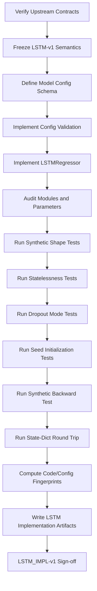
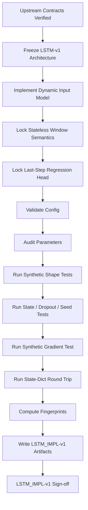

<div align="center">

# PHASE 15 — LSTM IMPLEMENTATION

## Kế hoạch thiết kế, hiện thực và kiểm toán LSTM baseline cho hồi quy chuỗi thời gian đa biến

### Transformer Encoder cho hồi quy chuỗi thời gian đa biến trên UCI Appliances Energy Prediction

**Phase kế tiếp sau `Phase_14_Persistence_baseline.md`**

</div>

---

# 1. Vai trò của Phase 15

Phase 15 chịu trách nhiệm xây dựng **implementation chuẩn, tái sử dụng được và có thể kiểm toán của mô hình LSTM regression baseline**.

Nếu:

```text
Phase 14
→ tạo benchmark Persistence không học tham số
```

thì:

```text
Phase 15
→ xây learned recurrent baseline architecture
```

để Phase 20 có thể huấn luyện LSTM trên đúng:

```text
WINDOWPOP-v1
FEATURESETS-v1
SCALING-v1
DATALOADERS-v1
METRICS-v1
EXPERIMENTS-v1
```

Phase 15 tập trung vào:

```text
architecture
tensor contracts
state semantics
parameterization
config validation
shape safety
implementation tests
reproducibility hooks
```

Phase này **không phải phase training chính thức**.

Nguyên tắc:

\[
\boxed{
Minimal
+
Causal\text{-}Compatible
+
Stateless\ Across\ Windows
+
Shape\ Safe
+
Configurable
+
Comparable
}
\]

---

# 2. Mục tiêu cần đạt sau Phase 15

Sau Phase 15 phải có:

```text
1. Một class LSTM regression dùng chung.

2. Input contract [B,L,F].

3. Output contract [B,1].

4. Unidirectional recurrent baseline.

5. batch_first=True.

6. Stateless behavior giữa các windows.

7. Zero initial hidden/cell state theo từng forward nếu không truyền state.

8. Multi-layer support.

9. Dropout semantics được xử lý đúng.

10. Last-step readout.

11. Linear regression head.

12. Không output activation.

13. Không Softmax.

14. Không prediction clipping.

15. Không bidirectional mode trong LSTM-v1.

16. Không projection trong LSTM-v1.

17. Không PackedSequence vì windows fixed-length.

18. Không state carry giữa mini-batches.

19. Config schema.

20. Config semantic validation.

21. Parameter-count audit.

22. Parameter-shape audit.

23. Parameter initialization policy.

24. Model-version contract.

25. Forward shape unit tests bằng synthetic tensors.

26. Batch-size invariance test.

27. Lookback-shape support test.

28. Feature-dimension support test.

29. Wrong-shape rejection tests.

30. Dtype/device compatibility hooks.

31. Deterministic initialization test trong fixed environment.

32. Train/eval mode behavior audit.

33. Dropout behavior audit.

34. Serialization-ready model config.

35. Checkpoint metadata contract cho Phase 19.

36. Experiment Registry integration contract.

37. `LSTM_IMPL-v1` manifest.

38. Phase 15 sign-off.
```

---

# 3. Những việc Phase 15 không làm

Phase 15 không:

```text
Không chạy full training.

Không tính final Validation RMSE.

Không chọn LSTM winner.

Không tune hidden size.

Không tune num_layers.

Không tune dropout.

Không tune learning rate.

Không tune batch size.

Không tune loss.

Không tune patience.

Không tune lookback.

Không tune feature set.

Không mở Test targets.

Không tính Test metrics.

Không thay WINDOWS-v1.

Không thay SCALING-v1.

Không fit preprocessing.

Không triển khai Transformer.
```

Official baseline training thuộc:

```text
Phase 20 — LSTM baseline run.
```

LSTM tuning thuộc:

```text
Phase 43 — LSTM tuning.
```

---

# 4. Input contract

Phase 15 chỉ bắt đầu khi:

```text
Phase 11 = PASS
Phase 12 = PASS
Phase 13 = PASS
Phase 14 = PASS
```

và có:

```text
FEATURESETS-v1
SCALING-v1
WINDOWS-v1
WINDOWPOP-v1
DATALOADERS-v1
METRICS-v1
EXPERIMENTS-v1
PERSISTENCE-v1
```

---

# 5. Output version

Gán:

```text
LSTM_IMPL-v1
```

Model implementation version:

```text
LSTM-v1
```

Tách hai khái niệm:

```text
LSTM_IMPL-v1
→ contract/source implementation

LSTM-v1
→ model family implementation version ghi vào run config
```

---

# 6. Vị trí của LSTM trong coursework

Coursework yêu cầu:

```text
Extension:
Compare with LSTM baseline
```

Do đó LSTM là:

```text
learned baseline
```

để so với:

```text
Transformer Encoder.
```

Comparison khoa học chính sau này:

```text
Persistence
vs
LSTM
vs
Transformer
```

trên cùng forecasting task.

---

# 7. LSTM là gì trong setup này?

Input sequence:

\[
X=
(x_1,x_2,\ldots,x_L)
\]

với:

\[
x_t\in\mathbb{R}^{F}
\]

LSTM xử lý tuần tự các historical feature vectors và tạo hidden representation:

\[
h_t
\]

Sau vị trí cuối cùng:

\[
h_L
\]

mô hình dùng một regression head:

\[
\hat y=W h_L+b
\]

để dự báo:

\[
Appliances_{t+1}
\]

---

# 8. LSTM gate equations

Một LSTM cell chuẩn cập nhật:

\[
i_t
=
\sigma(W_{ii}x_t+b_{ii}+W_{hi}h_{t-1}+b_{hi})
\]

\[
f_t
=
\sigma(W_{if}x_t+b_{if}+W_{hf}h_{t-1}+b_{hf})
\]

\[
g_t
=
\tanh(W_{ig}x_t+b_{ig}+W_{hg}h_{t-1}+b_{hg})
\]

\[
o_t
=
\sigma(W_{io}x_t+b_{io}+W_{ho}h_{t-1}+b_{ho})
\]

\[
c_t
=
f_t\odot c_{t-1}
+
i_t\odot g_t
\]

\[
h_t
=
o_t\odot\tanh(c_t)
\]

Phase 15 không tự viết LSTM cell thủ công.

Dùng:

```text
torch.nn.LSTM
```

để giảm implementation risk.

---

# 9. Không tự implement LSTMCell stack baseline

Không xây thủ công:

```text
four gates
manual recurrent loop
manual cell state
```

trừ khi assignment yêu cầu.

`nn.LSTM`:

```text
đã được PyTorch tối ưu
có API rõ
dễ kiểm toán
```

và là baseline thích hợp.

---

# 10. Canonical model class

Khuyến nghị:

```text
LSTMRegressor
```

Không dùng tên mơ hồ:

```text
Model
RNNModel
Net
```

trong source chính.

---

# 11. Source-code location

Khuyến nghị:

```text
src/
└── models/
    ├── lstm_regressor.py
    ├── configs.py
    └── validation.py
```

Nếu project đã có config/validation module chung:

```text
reuse
```

thay vì duplicate.

---

# 12. Canonical input contract

Per batch:

\[
\boxed{
X
\in
\mathbb{R}^{B\times L\times F}
}
\]

Trong code:

```text
[B, L, F]
```

với:

```text
B = batch size

L = lookback steps

F = number of model features
```

---

# 13. Input contract kế thừa Phase 11

DataLoader đã khóa:

```text
x.dtype = torch.float32

x shape = [B,L,F]
```

LSTM implementation không transpose input.

---

# 14. `batch_first=True`

PyTorch `nn.LSTM` mặc định dùng:

```text
[sequence, batch, feature]
```

nếu `batch_first=False`.

Coursework đã khóa DataLoader:

```text
[B,L,F]
```

Do đó LSTM-v1 dùng:

```python
batch_first=True
```

---

# 15. Output sequence shape

Với:

```text
batch_first=True
unidirectional
proj_size=0
```

LSTM output có shape:

\[
[B,L,H]
\]

trong đó:

```text
H = hidden_size.
```

---

# 16. Hidden-state shape nuance

`batch_first=True` chỉ ảnh hưởng:

```text
input
output
```

không thay hidden/cell state layout.

Với unidirectional LSTM:

```text
h_n:
[num_layers, B, H]

c_n:
[num_layers, B, H]
```

Phase 15 phải ghi rõ nuance này để tránh:

```text
[B,num_layers,H]
```

nhầm lẫn.

---

# 17. Regression output contract

Model cuối cùng trả:

\[
\boxed{
\hat y
\in
\mathbb{R}^{B\times1}
}
\]

Code shape:

```text
[B,1]
```

Không:

```text
[B]
```

---

# 18. Vì sao output phải `[B,1]`?

Phase 11/12 đã khóa:

```text
y_model = [B,1]
```

Do đó model output cùng shape giúp tránh:

```text
implicit broadcasting
```

trong loss.

---

# 19. Sequence-to-one readout

LSTM-v1 dùng:

```text
last-step readout.
```

Tức:

```python
last_hidden = lstm_output[:, -1, :]
```

Sau đó:

```python
prediction = regression_head(last_hidden)
```

---

# 20. Vì sao dùng `output[:, -1, :]`?

Nó biểu diễn:

```text
top recurrent layer output
tại historical timestep gần target nhất.
```

Rất phù hợp sequence-to-one forecasting.

---

# 21. `h_n[-1]` có thể dùng không?

Với:

```text
unidirectional
no projection
```

top-layer final hidden state có cùng semantic final recurrent representation.

Tuy nhiên LSTM-v1 ưu tiên:

```text
output[:, -1, :]
```

vì:

```text
shape dễ đọc

last-timestep semantics trực tiếp

ít nhầm hidden-state axes.
```

---

# 22. Không mean-pool LSTM output trong baseline

Không dùng:

```text
output.mean(dim=1)
```

trong LSTM-v1 reference.

Mean pooling sẽ tạo:

```text
một khác biệt architecture bổ sung
```

không cần cho baseline đơn giản.

---

# 23. Không attention layer trên LSTM baseline

Không thêm:

```text
LSTM + Attention
```

vì assignment yêu cầu:

```text
LSTM baseline
```

và Transformer mới là attention architecture chính.

LSTM attention extension sẽ làm baseline phức tạp không cần thiết.

---

# 24. Regression head

Canonical:

```python
nn.Linear(hidden_size, 1)
```

nếu:

```text
proj_size = 0
bidirectional = False.
```

---

# 25. Không output activation

Không thêm:

```text
ReLU
Sigmoid
Softplus
Tanh
Softmax
```

sau regression head.

---

# 26. Vì sao không ReLU ở output?

YS1 target có thể nhận:

```text
negative standardized values.
```

Nếu output bị ReLU:

```text
model không thể dự báo phần dưới train mean trong standardized space.
```

---

# 27. YS0 cũng không cần positivity constraint

Dù raw Appliances dự kiến không âm:

```text
unconstrained linear regression head
```

được giữ để:

```text
không thay optimization geometry
không post-process model output âm thầm.
```

---

# 28. Không prediction clipping trong model

Không:

```python
pred = pred.clamp(min=0)
```

Metric contract Phase 12 đã cấm clipping mặc định.

---

# 29. Unidirectional contract

LSTM-v1:

```text
bidirectional = False
```

Hard configuration default.

---

# 30. Vì sao không bidirectional?

Toàn bộ input window đều nằm trong quá khứ của target, nên bidirectional recurrence trên historical window không nhất thiết là target leakage.

Tuy nhiên baseline chính chọn unidirectional để:

```text
giữ recurrent direction tự nhiên từ quá khứ xa → quá khứ gần

đơn giản

dễ diễn giải

ít tham số

không làm baseline phức tạp hơn cần thiết.
```

---

# 31. Bidirectional không thuộc tuning set hiện tại

Phase 43 có thể tune LSTM baseline theo master protocol nếu đã định nghĩa.

Nhưng current LSTM-v1 không tự mở:

```text
bidirectional=True
```

như một hidden option.

---

# 32. Projection contract

LSTM-v1:

```text
proj_size = 0.
```

---

# 33. Vì sao không LSTM projection?

Projection LSTM thay đổi:

```text
hidden-output dimension
parameterization
architecture semantics.
```

Không cần cho baseline coursework.

---

# 34. Fixed-length windows

WINDOWS-v1 có:

```text
fixed lookback trong mỗi run.
```

Do đó không cần:

```text
pack_padded_sequence
pack_sequence
padding masks.
```

---

# 35. Không `PackedSequence`

Một run chỉ có:

```text
L36
hoặc
L72
hoặc
L144.
```

Mọi sample trong loader cùng length.

Do đó plain dense tensor:

```text
[B,L,F]
```

là đúng.

---

# 36. Hidden-state initialization

Nếu `h_0` và `c_0` không được truyền, PyTorch LSTM mặc định sử dụng:

```text
zero initial state.
```

LSTM-v1 dùng behavior này.

---

# 37. Không manually create zeros mỗi forward

Không cần:

```python
h0 = torch.zeros(...)
c0 = torch.zeros(...)
```

trừ khi cần explicit state control.

Omitting state:

```text
đơn giản hơn
đúng device/dtype tự nhiên theo PyTorch
ít code hơn.
```

---

# 38. Stateless across windows

Đây là hard contract:

> Mỗi input window được xử lý như một independent forecasting sample.

Không carry:

```text
h_n
c_n
```

từ batch trước sang batch sau.

---

# 39. Tại sao stateless là bắt buộc?

TRAIN DataLoader:

```text
shuffle=True.
```

Nếu carry hidden state giữa shuffled batches:

```text
hidden state sẽ nối các windows không liên tục về thời gian
```

và làm semantics sai hoàn toàn.

---

# 40. Không `detach()` hidden state để carry qua batch

Pattern stateful RNN:

```text
hidden = hidden.detach()
```

không dùng.

Model forward chỉ:

```text
x → prediction.
```

---

# 41. Forward return contract

Preferred:

```python
def forward(self, x):
    ...
    return y_hat
```

Không mặc định trả:

```text
hidden state
cell state
full sequence
```

cho training path.

---

# 42. Optional representation method

Nếu cần debugging, có thể có:

```text
encode_sequence(x)
```

trả final representation.

Nhưng forward main vẫn:

```text
[B,1].
```

---

# 43. Không trả tuple làm default prediction

Tránh:

```text
(pred, hidden, cell)
```

vì training engine dễ nhầm.

---

# 44. Input-size contract

`input_size` phải bằng:

```text
feature_count
```

từ `FEATURESETS-v1`.

Hard assertion:

\[
input\_size=F
\]

---

# 45. Baseline feature variant

Phase 20 baseline dự kiến dùng:

```text
FS1_TF1.
```

Runtime expected:

```text
F ≈ 31
```

nhưng source of truth:

```text
FEATURESETS-v1.
```

Không hard-code:

```python
input_size=31
```

trong class.

---

# 46. Dynamic feature dimension

Constructor nhận:

```text
input_size
```

từ active variant.

Nhờ vậy Phase 23/43 có thể reuse class.

---

# 47. Lookback không phải constructor parameter bắt buộc

`nn.LSTM` có thể xử lý:

```text
L36
L72
L144
```

với cùng parameterization.

Do đó class không cần hard-code:

```text
seq_len=144.
```

---

# 48. Forward shape checker vẫn có thể biết expected lookback

Model config có thể giữ:

```text
expected_lookback
```

cho audit.

Nhưng core recurrent weights không phụ thuộc L.

---

# 49. Recommended LSTM reference configuration

Phase 15 khóa một **reference implementation configuration**, không phải winner:

```text
LSTM_B0

hidden_size = 64

num_layers = 2

dropout = 0.1

bidirectional = False

proj_size = 0

bias = True

batch_first = True

readout = LAST_STEP

head = Linear(64,1)
```

---

# 50. LSTM_B0 không phải hyperparameter winner

Nó là:

```text
starting baseline configuration
```

để Phase 20 có run reproducible.

Phase 43 mới có quyền tune LSTM theo planned tuning space.

---

# 51. Vì sao hidden size 64 là reference hợp lý?

Nó:

```text
đủ nhỏ để baseline nhẹ

đủ lớn để represent multivariate history

cùng order-of-magnitude representation width với Transformer B0 d_model=64.
```

Đây không phải parameter-matching claim.

---

# 52. Không bắt buộc parameter-count matching Transformer

Fairness chính đến từ:

```text
same data
same target population
same metrics
same selection policy
same training protocol quality.
```

LSTM và Transformer không cần:

```text
exact same trainable parameter count.
```

---

# 53. Nếu cần parameter-count context

Report:

```text
trainable parameters
```

cho cả hai.

Không tự thay hidden size chỉ để exact match.

---

# 54. `num_layers=2`

Reference:

```text
2 stacked LSTM layers.
```

PyTorch layer 2 nhận output từ layer 1.

---

# 55. Dropout semantics của `nn.LSTM`

PyTorch LSTM `dropout>0` áp dropout:

```text
giữa recurrent layers
```

và không áp trên output của layer cuối theo `nn.LSTM` stack semantics.

---

# 56. Consequence khi `num_layers=1`

Nếu:

```text
num_layers = 1
```

built-in LSTM dropout không tạo inter-layer dropout có ý nghĩa.

Do đó constructor phải xử lý:

```text
effective_lstm_dropout = 0.0
```

khi chỉ có một layer.

---

# 57. Requested vs effective dropout

Config nên lưu:

```text
requested_dropout

effective_lstm_dropout
```

để Phase 43 không hiểu sai.

---

# 58. Reference LSTM_B0 dropout

Vì:

```text
num_layers = 2
```

nên:

```text
dropout = 0.1
```

có hiệu lực giữa layers.

---

# 59. Không thêm head dropout mặc định

LSTM-v1 không thêm:

```text
nn.Dropout
```

giữa final hidden và regression head.

Lý do:

```text
tránh hai dropout mechanisms
giữ baseline gọn.
```

---

# 60. Nếu sau này muốn head dropout

Phải:

```text
explicit config field
new planned tuning option
```

Không âm thầm thêm.

---

# 61. Bias contract

Reference:

```text
bias=True.
```

Đây là PyTorch LSTM standard.

---

# 62. Initialization policy

LSTM-v1 baseline dùng:

```text
PYTORCH_DEFAULT_INITIALIZATION
```

cho:

```text
nn.LSTM
nn.Linear.
```

Không custom gate initialization trong core baseline.

---

# 63. Vì sao không custom forget-gate bias?

Thiết lập forget-gate bias = 1 là một design choice phổ biến trong một số implementations, nhưng:

```text
không được coursework yêu cầu
thay optimization behavior
tăng customization.
```

Baseline nên minh bạch và gần PyTorch default.

---

# 64. Không Xavier tất cả LSTM matrices một cách mù quáng

LSTM có nhiều parameter matrices/gates.

Nếu muốn custom initialization:

```text
phải explicit
unit-tested
versioned.
```

Không làm trong LSTM-v1.

---

# 65. Seed-before-instantiation contract

Để initialization reproducible trong fixed environment:

```text
set global experiment seed

sau đó instantiate model.
```

Không instantiate rồi mới seed.

---

# 66. Deterministic initialization test

Trong same fixed environment:

```text
seed 42
instantiate model A

reset process/seed 42
instantiate model B
```

Expected:

```text
same parameter tensors.
```

---

# 67. Different-seed initialization test

Seed khác:

```text
model parameters should differ.
```

---

# 68. Parameter count

Phase 15 phải tính:

```python
sum(p.numel() for p in model.parameters())
```

và:

```python
sum(p.numel() for p in model.parameters() if p.requires_grad)
```

---

# 69. Trainable-parameter invariant

LSTM-v1:

```text
all model parameters trainable
```

trừ khi future experiment explicit freezes layers.

No freezing baseline.

---

# 70. Parameter-count formula — first layer

Với unidirectional standard LSTM:

```text
weight_ih_l0:
[4H, F]

weight_hh_l0:
[4H, H]

bias_ih_l0:
[4H]

bias_hh_l0:
[4H]
```

Do đó first recurrent layer:

\[
P_1
=
4HF
+
4H^2
+
8H
\]

---

# 71. Parameter-count formula — later layer

Với layer sau:

```text
input dim = H.
```

Mỗi additional layer:

\[
P_{later}
=
8H^2+8H
\]

---

# 72. Regression head parameters

\[
P_{head}=H+1
\]

---

# 73. Reference expected count example

Nếu runtime baseline xác nhận:

```text
F = 31
H = 64
num_layers = 2
```

thì expected total:

\[
P_{LSTM}
=
58,112
\]

\[
P_{head}
=
65
\]

\[
\boxed{
P_{total}
=
58,177
}
\]

Đây chỉ là audit expectation cho config cụ thể.

Runtime parameter count là source of truth.

---

# 74. Không hard-code parameter count

Nếu:

```text
feature variant
hidden size
layers
```

thay đổi, count phải được tính lại.

---

# 75. Parameter-name audit

Export:

```text
name
shape
numel
requires_grad
```

cho mọi parameter.

---

# 76. Expected key families

Ví dụ:

```text
lstm.weight_ih_l0

lstm.weight_hh_l0

lstm.bias_ih_l0

lstm.bias_hh_l0

...

regression_head.weight

regression_head.bias
```

Tên exact phụ thuộc attribute names trong class.

---

# 77. No hidden trainable state outside modules

Không tạo:

```text
plain torch.Tensor requires_grad=True
```

không register như parameter.

---

# 78. Model config dataclass

Khuyến nghị:

```text
LSTMConfig
```

Fields:

```text
input_size

hidden_size

num_layers

dropout

bias

batch_first

bidirectional

proj_size

readout

output_size

model_version
```

---

# 79. Reference config fields

Recommended:

```text
model_version = LSTM-v1

hidden_size = 64

num_layers = 2

dropout = 0.1

bias = True

batch_first = True

bidirectional = False

proj_size = 0

readout = LAST_STEP

output_size = 1
```

---

# 80. `input_size` không đặt default fixed

Bắt buộc truyền từ feature registry.

---

# 81. `output_size`

Hard:

```text
1
```

cho main coursework.

Reject:

```text
output_size > 1.
```

---

# 82. Config validation — hidden size

Require:

```text
hidden_size > 0
```

integer.

---

# 83. Config validation — num layers

Require:

```text
num_layers >= 1.
```

---

# 84. Config validation — dropout

Require:

\[
0\le dropout<1
\]

---

# 85. Config validation — batch first

LSTM-v1 requires:

```text
batch_first=True.
```

If False:

```text
reject
```

rather than silently transpose.

---

# 86. Config validation — bidirectional

LSTM-v1 requires:

```text
False.
```

---

# 87. Config validation — projection

LSTM-v1 requires:

```text
proj_size=0.
```

---

# 88. Config validation — readout

Allowed:

```text
LAST_STEP
```

for LSTM-v1.

Future version could add more.

---

# 89. Config validation — output size

Require:

```text
1.
```

---

# 90. Feature fingerprint binding

Model run config later phải bind:

```text
feature_variant_id
feature_fingerprint
input_size.
```

Hard:

\[
input\_size
=
feature\_count.
\]

---

# 91. Model constructor không đọc global dataframe

Không để class tự:

```text
load data
infer feature count from files
```

Constructor chỉ nhận config.

---

# 92. Model class không biết scaler

Không pass:

```text
StandardScaler
```

vào model.

Scaling là data preprocessing contract.

---

# 93. Model class không biết split

Không:

```text
if validation...
```

trong forward.

---

# 94. Model class không biết metrics

Không compute:

```text
RMSE
```

trong model.

---

# 95. Model class không biết optimizer

Không tạo:

```text
AdamW
```

bên trong model.

---

# 96. Separation of concerns

```text
Model
→ representation + prediction

Training Engine
→ loss + optimizer + backward

Metrics
→ evaluation

Registry
→ tracking
```

---

# 97. Forward method input validation

Development/debug mode nên check:

```text
x.ndim == 3

x.shape[-1] == input_size

x.shape[1] > 0

x.dtype floating.
```

---

# 98. Lookback-specific check

Nếu config/run biết expected lookback:

```text
x.shape[1] == expected_lookback
```

có thể check ngoài model hoặc wrapper.

Không cần core class hard-code L.

---

# 99. Nonfinite input

Phase 9–11 đã audit.

Phase 15 forward không nhất thiết scan toàn tensor production.

Synthetic/debug tests phải verify model handles valid finite tensors.

Training engine có numerical guards.

---

# 100. Contiguity requirement

Input tensor không nhất thiết phải manually call:

```text
contiguous()
```

nếu DataLoader already produces suitable tensors.

Không thêm copy không cần thiết.

---

# 101. Device contract

Model có thể được tạo trên CPU:

```text
model = LSTMRegressor(config)
```

sau đó Phase 18/19:

```text
model.to(device)
```

---

# 102. Không hard-code `.cuda()`

Không:

```python
self.lstm.cuda()
```

trong constructor.

Phải hỗ trợ:

```text
CPU
MPS
CUDA.
```

---

# 103. Dtype contract

Baseline parameters:

```text
float32.
```

Không force:

```text
float64
float16
```

trong class.

---

# 104. No mixed precision inside model

AMP/autocast nếu có thuộc:

```text
training engine.
```

Current baseline:

```text
mixed_precision=False.
```

---

# 105. Train/eval mode

`nn.LSTM` built-in dropout behavior phụ thuộc:

```text
model.train()
model.eval().
```

Phase 15 phải test mode semantics.

---

# 106. Train-mode dropout test

Với:

```text
num_layers=2
dropout>0
```

same input có thể produce different output across repeated train-mode forwards vì dropout.

Không yêu cầu equality.

---

# 107. Eval-mode deterministic forward test

Trong same model/inputs/device:

```text
model.eval()
```

repeated forwards should match trong numerical tolerance.

---

# 108. Num-layers=1 dropout test

Config:

```text
num_layers=1
requested_dropout=0.1
```

Implementation should record:

```text
effective_lstm_dropout=0.0
```

và avoid misleading expectation.

---

# 109. No explicit Dropout if num_layers=1

Không tự thêm head dropout chỉ để “bù” built-in dropout.

Đó là architecture khác.

---

# 110. PyTorch LSTM dropout semantics must be documented

README phải nói:

```text
dropout is inter-layer dropout
for multi-layer LSTM.
```

---

# 111. Reference forward implementation

Conceptual:

```python
def forward(self, x):
    output, _ = self.lstm(x)
    last_hidden = output[:, -1, :]
    y_hat = self.regression_head(last_hidden)
    return y_hat
```

---

# 112. Không cần explicitly receive hidden states

Main forward signature:

```text
forward(x)
```

đủ.

---

# 113. Optional `return_representation`

Không nên overload forward bằng flag quá nhiều.

Nếu cần analysis:

```text
separate method.
```

---

# 114. Hidden-state inspection

Phase 15 có thể unit test:

```text
output shape
h_n shape
c_n shape
```

bằng direct internal call hoặc helper.

Không expose trong production API.

---

# 115. Synthetic shape test — B64/L144/F31

Nếu current expected F=31:

```text
x:
[64,144,31]
```

Expected:

```text
prediction:
[64,1].
```

---

# 116. Synthetic shape test — B32

```text
x:
[32,L,F]
```

Expected:

```text
[32,1].
```

---

# 117. Last-batch shape test

Ví dụ:

```text
B=7
```

Expected:

```text
[7,1].
```

Model không giả định fixed B64.

---

# 118. Single-sample batch test

```text
B=1
```

Expected:

```text
[1,1].
```

Quan trọng vì Phase 11 có:

```text
drop_last=False.
```

---

# 119. Lookback L36 test

```text
[B,36,F]
→ [B,1].
```

---

# 120. Lookback L72 test

```text
[B,72,F]
→ [B,1].
```

---

# 121. Lookback L144 test

```text
[B,144,F]
→ [B,1].
```

---

# 122. Feature variant dimension tests

Class phải support runtime F tương ứng:

```text
FS0_TF0

FS0_TF1

FS1_TF0

FS1_TF1

FS2_TF0

FS2_TF1.
```

Không cần instantiate tất cả nếu unit tests parameterized.

---

# 123. Wrong feature dimension test

Model `input_size=31`.

Input:

```text
[B,L,30]
```

Expected:

```text
clear error.
```

---

# 124. Wrong rank test

Input:

```text
[B,F]
```

Expected:

```text
reject.
```

---

# 125. Empty sequence test

Input:

```text
[B,0,F]
```

Expected:

```text
reject.
```

---

# 126. Wrong dtype test

Input integer tensor:

```text
torch.int64
```

Expected:

```text
reject or PyTorch type error
```

Preferred pre-validation:

```text
clear error.
```

---

# 127. NaN synthetic test

Model can mathematically propagate NaN.

Phase 15 does not sanitize.

Test ensures:

```text
numerical guards belong upstream/training engine.
```

Không silently replace NaN.

---

# 128. Output finite test

For valid finite random synthetic input and valid initialization:

```text
output should be finite.
```

---

# 129. Output shape invariant across train/eval

Train/eval mode may change values due dropout.

Shape must remain:

```text
[B,1].
```

---

# 130. Batch permutation equivariance test

In eval mode:

```text
permute batch order
```

then outputs should permute correspondingly.

This verifies:

```text
no cross-sample hidden carry.
```

---

# 131. Cross-batch state leakage test

Evaluate sample A alone and within a batch.

Its output should match within tolerance in eval mode, subject to same input/model.

This tests:

```text
independence across samples.
```

---

# 132. Repeated-window statelessness test

Call same sample after unrelated sample.

Output unchanged in eval mode.

---

# 133. Parameter gradient requirement

All trainable model parameters:

```text
requires_grad=True.
```

---

# 134. No gradients before backward

Immediately after initialization:

```text
p.grad is None
```

expected.

---

# 135. Synthetic backward smoke test — scope

Phase 15 may run a minimal synthetic:

```text
forward
simple scalar loss
backward
```

only to verify computation graph.

This is **not training**.

Official actual-data forward sanity remains Phase 18.

---

# 136. Why include synthetic backward smoke?

It can detect:

```text
detached output
wrong dtype
non-differentiable accidental code
unregistered head.
```

---

# 137. Synthetic backward loss

Could use:

```text
prediction.mean()
```

or tiny MSE against synthetic target.

No optimizer step required.

---

# 138. Gradient existence test

After backward:

```text
core trainable parameters should receive gradients
```

subject to numerical tolerance.

---

# 139. Gradient finite test

Synthetic valid input:

```text
all existing grads finite.
```

---

# 140. No optimizer in Phase 15

Even if backward smoke passes:

```text
do not call optimizer.step().
```

Training belongs Phase 19/20.

---

# 141. Gradient clipping belongs training engine

Master baseline uses:

```text
clip_grad_norm_ max_norm=1.0
```

but LSTM model class does not call clipping.

---

# 142. Current PyTorch gradient clipping API

Training engine should use:

```text
torch.nn.utils.clip_grad_norm_
```

not deprecated non-underscore `clip_grad_norm`.

Phase 15 only records integration requirement.

---

# 143. `error_if_nonfinite`

Phase 19 may choose:

```text
error_if_nonfinite=True
```

for fail-fast gradient handling.

Phase 15 does not decide training-loop implementation detail unless Phase 19 contract locks it.

---

# 144. LSTM-specific exploding-gradient caution

Recurrent models can encounter:

```text
large gradient norms
```

especially with longer sequences.

Master contract already includes:

```text
gradient clipping max_norm=1.0.
```

Phase 15 must expose standard `parameters()` so Phase 19 can apply it cleanly.

---

# 145. No gradient hooks in baseline model

Không register custom:

```text
gradient hooks
```

unless diagnostics need them.

Keep implementation simple.

---

# 146. Reproducibility caveat — CUDA LSTM

PyTorch documentation notes some CUDA/cuDNN versions may exhibit nondeterministic RNN/LSTM behavior.

Therefore Phase 15 must not claim:

```text
absolute bitwise reproducibility across all devices/releases.
```

---

# 147. Reproducibility responsibility

Phase 1/19 manage:

```text
random seeds

deterministic algorithms

cuDNN settings

environment.
```

Phase 15 contributes by:

```text
no hidden randomness outside PyTorch modules

explicit dropout config

stateless windows.
```

---

# 148. Model init reproducibility is environment-scoped

Same:

```text
PyTorch version
device context
seed
code
```

is the meaningful reproducibility scope.

---

# 149. No internal random generator

LSTMRegressor does not create:

```text
its own Generator.
```

Use global PyTorch RNG seeded externally.

---

# 150. Model summary

Phase 15 should generate:

```text
model architecture string
```

via:

```text
print(model)
```

or structured summary.

Avoid adding dependency like `torchinfo` unless already installed/justified.

---

# 151. No new summary dependency required

Use native:

```text
named_modules()
named_parameters()
```

and custom audit tables.

---

# 152. Parameter audit artifact

Tạo:

```text
lstm_parameter_audit.csv
```

Fields:

```text
parameter_name

shape

numel

requires_grad

dtype

device

finite

status
```

---

# 153. Model module audit

Tạo:

```text
lstm_module_audit.csv
```

Fields:

```text
module_name

module_type

training_mode_sensitive

parameter_count

notes
```

---

# 154. Shape contract artifact

Tạo:

```text
lstm_shape_contract.json
```

Fields:

```text
input_layout = B_L_F

output_layout = B_1

hidden_layout = layers_B_H

cell_layout = layers_B_H

readout = LAST_STEP

batch_first = true

bidirectional = false

proj_size = 0
```

---

# 155. Config schema artifact

Tạo:

```text
lstm_model_config_schema.json
```

---

# 156. Reference config artifact

Tạo:

```text
lstm_reference_config.json
```

Conceptually:

```text
hidden_size 64
num_layers 2
dropout 0.1
...
```

Do not fill runtime:

```text
input_size
```

until active feature variant resolves it, or record it as registry-derived.

---

# 157. Model implementation manifest

Tạo:

```text
lstm_implementation_manifest.json
```

Fields:

```text
implementation_version

model_version

framework

torch_version

class_name

source_path

input_contract

output_contract

state_policy

initialization_policy

dropout_policy

readout_policy

output_activation

bidirectional

projection

reference_config

supported_lookbacks

supported_feature_variants

unit_test_status

parameter_audit_status

shape_audit_status

reproducibility_notes

audit_status

warnings

created_at
```

---

# 158. Code fingerprint

Hash source file:

```text
lstm_regressor.py
```

và config/validation source nếu desired.

Store:

```text
code_fingerprint.
```

---

# 159. Why code fingerprint?

Phase 20 run must prove which LSTM implementation was trained.

If source changes:

```text
implementation lineage changes.
```

---

# 160. Git integration

If Git available:

```text
git commit
```

is strong provenance.

Still keep:

```text
model_version
```

semantics.

---

# 161. Source code changes after sign-off

If behavior changes materially:

```text
LSTM_IMPL-v2
```

or model implementation version bump.

Do not silently edit LSTM-v1.

---

# 162. Version bump examples

Need new version if changing:

```text
unidirectional → bidirectional

last-step → mean pooling

linear head → MLP head

default initialization → custom gate init

stateful behavior

projection LSTM

output activation

head dropout.
```

---

# 163. No version bump examples

No version bump for:

```text
comments

README wording

type hints

non-semantic refactor
```

if code behavior/fingerprint remains logically equivalent, though code fingerprint may change.

---

# 164. Serialization contract

Model class must be compatible with:

```text
state_dict()
load_state_dict()
```

Phase 19 checkpoints should primarily save:

```text
state_dict
config
metadata
```

not pickle entire model object.

---

# 165. Why save `state_dict`?

More robust/explicit than serializing entire Python class instance.

Model reconstruction:

```text
load config
instantiate class
load state_dict.
```

---

# 166. Checkpoint metadata requirements

Phase 19 checkpoint should include at least:

```text
run_id

model_version

implementation_version

config

config_fingerprint

feature_variant_id

feature_fingerprint

lookback

target_scaling

state_dict

epoch

metric version.
```

---

# 167. No checkpoint in Phase 15

Phase 15 defines contract only.

Synthetic model state does not need production checkpoint artifact.

---

# 168. Optional serialization round-trip unit test

Can:

```text
save temporary state_dict
instantiate same config
load
compare eval output.
```

Use temporary test directory.

Do not pollute production checkpoints.

---

# 169. State-dict round-trip expectation

Same model config + loaded weights + same eval input:

```text
same prediction.
```

---

# 170. Wrong-config load test

Trying state dict from hidden_size 64 into hidden_size 32 should:

```text
fail.
```

This is expected.

---

# 171. Strict state loading

Use:

```text
strict=True
```

baseline.

Do not ignore missing/unexpected keys.

---

# 172. Regression head weight inclusion

State dict must include:

```text
regression_head.weight
regression_head.bias.
```

---

# 173. Model parameter device

After:

```text
model.to(device)
```

all parameters should lie on selected device.

Phase 18 official device test.

Phase 15 can CPU-test.

---

# 174. No hidden CPU tensors in forward

Do not construct state tensors on CPU manually.

Using default state avoids this issue.

---

# 175. MPS compatibility

Implementation uses only standard:

```text
nn.LSTM
nn.Linear
tensor indexing
```

which is intended to be portable across supported PyTorch backends.

Actual active-environment device smoke occurs Phase 18.

---

# 176. CUDA compatibility

Same principle.

Do not include device-specific code in model.

---

# 177. Input feature semantics are external

LSTM only sees channels.

It does not know:

```text
T1
RH1
Appliances
hour_sin
```

by name.

Therefore Experiment Registry must bind:

```text
feature fingerprint.
```

---

# 178. LSTM cannot validate feature semantic order itself

Model only validates:

```text
F count.
```

Feature order correctness is ensured upstream:

```text
FEATURESETS-v1
DATALOADERS-v1.
```

---

# 179. Feature-set comparison safety

When input F changes:

```text
LSTM input-layer parameter count changes.
```

This is expected.

Do not reuse checkpoint across feature variants.

---

# 180. Checkpoint-feature binding

Phase 19 must reject loading LSTM checkpoint if:

```text
feature fingerprint mismatches.
```

---

# 181. Lookback and checkpoint

LSTM weights mathematically can process different L.

But a trained checkpoint was optimized for a specific lookback experiment.

Therefore registry checkpoint must bind:

```text
lookback.
```

Do not reuse across L36/L144 as if same model run.

---

# 182. Target scaling and checkpoint

Weights trained under:

```text
YS0
```

cannot be interpreted identically under:

```text
YS1.
```

Checkpoint must bind target scaling option.

---

# 183. Boundary protocol and checkpoint

Checkpoint bind:

```text
WB0/WB1.
```

because training sample population/context changes.

---

# 184. Dataset population and checkpoint

Bind:

```text
WINDOWPOP-v1 fingerprint.
```

---

# 185. Model training mode and inference mode

Phase 15 implementation must respect standard:

```text
model.train()

model.eval().
```

No custom mode flags required.

---

# 186. Dropout inactive in eval

For multi-layer LSTM internal dropout:

```text
eval mode
```

disables stochastic dropout.

This is essential for deterministic validation.

---

# 187. Validation inference later

Phase 19 uses:

```text
model.eval()
torch.inference_mode()
```

or equivalent.

LSTM model requires no special method.

---

# 188. No Monte Carlo dropout

Not current contract.

---

# 189. No teacher forcing parameter

Sequence-to-one LSTM does not autoregress decoder outputs.

No decoder.

No teacher forcing.

---

# 190. No recurrent decoder

Architecture:

```text
Encoder-like LSTM
→ final representation
→ scalar head.
```

---

# 191. No sequence output loss

Loss only on:

```text
final scalar prediction.
```

Not every historical timestep.

---

# 192. No auxiliary losses

No:

```text
reconstruction
smoothness
attention
```

loss.

---

# 193. No target injection into sequence

Input features come entirely from Phase 10.

Model does not concatenate:

```text
future y.
```

---

# 194. FS1 historical target handling

If feature variant includes historical `Appliances`:

```text
it is just one input channel.
```

No special branch.

---

# 195. FS0 compatibility

If historical target absent:

```text
same LSTM class
```

with smaller F.

---

# 196. Time-feature compatibility

TF0/TF1 similarly only change F/channels.

No special architecture branch.

---

# 197. RevIN compatibility

Phase 40 is Transformer-focused in master plan unless later applied generically.

LSTM-v1 does not embed RevIN by default.

If LSTM tuning later requires normalization variant:

```text
explicit separate implementation/config.
```

---

# 198. Model family fairness

Persistence:

```text
no training
```

LSTM:

```text
learned recurrent baseline
```

Transformer:

```text
attention-based learned model.
```

Comparison uses shared metrics, not identical architecture.

---

# 199. LSTM vs Transformer input contract

Both receive:

\[
[B,L,F]
\]

This is a major fairness invariant.

---

# 200. Same feature scaling

For same feature variant:

```text
LSTM and Transformer receive same scaled X values.
```

No model-specific scaler.

---

# 201. Same target scaling

If baseline config uses:

```text
YS1
```

both models use same frozen Y scaler.

---

# 202. Same sample population

Hard:

```text
WINDOWPOP-v1.
```

---

# 203. Same Validation metrics

Hard:

```text
METRICS-v1.
```

---

# 204. Same Test lock

Hard until Phase 47.

---

# 205. Baseline reference training configuration handoff

Although Phase 15 does not train, it should publish recommended Phase 20 reference:

```text
Feature variant:
FS1_TF1

Lookback:
L144

Horizon:
H1

Target scaling:
YS1

Boundary:
WB0

Batch:
B64

Hidden size:
64

Layers:
2

LSTM dropout:
0.1

Readout:
last-step

Optimizer:
AdamW

LR:
3e-4

Weight decay:
1e-4

Loss:
MSE

Max epochs:
50

Patience:
10

Gradient clipping:
1.0

Seed:
42
```

Training hyperparameters are consumed from shared master protocol, not embedded in model class.

---

# 206. Why publish reference training config here?

Phase 20 needs an unambiguous starting point.

But distinction remains:

```text
model architecture config
vs
training config.
```

---

# 207. Training hyperparameters not class fields

Do not put:

```text
learning_rate
weight_decay
batch_size
patience
```

inside `LSTMConfig` if it represents model architecture.

Use separate:

```text
TrainingConfig.
```

---

# 208. Config separation

Recommended:

```text
LSTMModelConfig

TrainingConfig

DataRunConfig
```

Experiment registry combines them.

---

# 209. Model config fingerprint

Hash only model semantics:

```text
input_size
hidden_size
layers
dropout
direction
readout
head
```

---

# 210. Run config fingerprint

Includes:

```text
model config
training config
data contracts
seed.
```

from Phase 13.

---

# 211. Implementation test registry

Tạo:

```text
lstm_unit_tests.csv
```

Fields:

```text
test_id

category

description

config_id

input_shape

expected

actual

status

notes
```

---

# 212. Required test categories

```text
CONFIG

SHAPE

STATE

DROPOUT

INITIALIZATION

PARAMETERS

GRADIENT

SERIALIZATION

DEVICE_AGNOSTICISM

REGISTRY_COMPATIBILITY
```

---

# 213. Unit test L15-T01

Reference model builds successfully.

---

# 214. Unit test L15-T02

B64/L144/reference F:

```text
output [64,1].
```

---

# 215. Unit test L15-T03

B32:

```text
output [32,1].
```

---

# 216. Unit test L15-T04

B1:

```text
output [1,1].
```

---

# 217. Unit test L15-T05

L36 works.

---

# 218. Unit test L15-T06

L72 works.

---

# 219. Unit test L15-T07

L144 works.

---

# 220. Unit test L15-T08

Different valid input sizes work with corresponding model instances.

---

# 221. Unit test L15-T09

Wrong F rejected.

---

# 222. Unit test L15-T10

Wrong rank rejected.

---

# 223. Unit test L15-T11

Empty sequence rejected.

---

# 224. Unit test L15-T12

Output is float32 for float32 model/input.

---

# 225. Unit test L15-T13

Output finite on valid finite synthetic input.

---

# 226. Unit test L15-T14

Eval repeated forward deterministic within tolerance.

---

# 227. Unit test L15-T15

Batch permutation preserves per-sample mapping in eval.

---

# 228. Unit test L15-T16

Sample output independent of neighboring batch members in eval.

---

# 229. Unit test L15-T17

Stateless repeated calls.

---

# 230. Unit test L15-T18

Num-layers=1 effective dropout = 0.

---

# 231. Unit test L15-T19

Num-layers=2 requested dropout propagated correctly.

---

# 232. Unit test L15-T20

Same-seed initialization same.

---

# 233. Unit test L15-T21

Different-seed initialization differs.

---

# 234. Unit test L15-T22

Parameter count matches formula/reference.

---

# 235. Unit test L15-T23

All trainable parameters require grad.

---

# 236. Unit test L15-T24

Synthetic backward produces finite gradients.

---

# 237. Unit test L15-T25

State-dict round-trip preserves eval outputs.

---

# 238. Unit test L15-T26

Strict wrong-config state load fails.

---

# 239. Unit test L15-T27

No output activation module exists after regression head.

---

# 240. Unit test L15-T28

Bidirectional config rejected for LSTM-v1.

---

# 241. Unit test L15-T29

Projection config rejected for LSTM-v1.

---

# 242. Unit test L15-T30

output_size != 1 rejected.

---

# 243. Implementation audit

Tạo:

```text
lstm_implementation_audit.csv
```

Checks:

```text
class_exists

inherits_nn_module

input_layout_valid

batch_first_true

unidirectional

proj_size_zero

state_stateless

readout_last_step

linear_regression_head

no_output_activation

dropout_policy_valid

default_init_policy_valid

feature_count_not_hardcoded

lookback_not_hardcoded

device_not_hardcoded

dtype_policy_valid

parameter_count_valid

state_dict_roundtrip_valid

unit_tests_passed

status
```

---

# 244. Discrepancy categories

```text
CONFIG_SCHEMA_ERROR

INPUT_SHAPE_ERROR

OUTPUT_SHAPE_ERROR

FEATURE_COUNT_HARDCODED

LOOKBACK_HARDCODED

STATEFUL_BATCH_LEAK

BIDIRECTIONAL_VIOLATION

PROJECTION_VIOLATION

DROPOUT_POLICY_ERROR

OUTPUT_ACTIVATION_ERROR

PARAMETER_COUNT_ERROR

INITIALIZATION_REPRODUCIBILITY_ERROR

NONFINITE_OUTPUT

NONFINITE_GRADIENT

STATE_DICT_ERROR

DEVICE_HARDCODE_ERROR

VERSION_MISMATCH

OTHER
```

---

# 245. Discrepancy log

Tạo:

```text
lstm_discrepancies.json
```

Fields:

```text
id

severity

category

test_id optional

expected

actual

interpretation

recommended_action

resolved

notes
```

---

# 246. Status model

## PASS

```text
Implementation contract valid.

All required unit tests pass.

No hidden training/data behavior.
```

## PASS_WITH_WARNING

Ví dụ:

```text
strict reproducibility warning on active CUDA/cuDNN environment
```

while architecture itself is valid.

## FAIL

Ví dụ:

```text
output shape wrong

state leaks across windows

input_size hard-coded

bidirectional accidentally enabled

state_dict cannot restore model.
```

---

# 247. Experiment Registry integration

Phase 15 implementation artifact should register:

```text
model_version = LSTM-v1

implementation_version = LSTM_IMPL-v1

code_fingerprint
```

as model metadata available for future runs.

---

# 248. Có cần production experiment run ở Phase 15?

Không cần full training run.

Synthetic unit tests là:

```text
implementation tests
```

không phải scientific experiment.

Nếu dùng EXPERIMENTS-v1 để log a formal sanity execution:

```text
execution_type = SANITY
```

và tuyệt đối không trộn nó với Phase 20 baseline training result.

---

# 249. Phase 18 remains official actual-batch sanity

Phase 15:

```text
synthetic/model-level tests.
```

Phase 18:

```text
actual DataLoader batch
actual active feature config
selected device
LSTM + Transformer forward sanity.
```

Không duplicate phase responsibilities.

---

# 250. README_LSTM

Tạo:

```text
README_LSTM.md
```

Nội dung:

```text
Purpose

Architecture

Input/output shapes

LSTM state semantics

Dropout semantics

Reference config

Initialization policy

Stateless-window rule

Why unidirectional

Why no output activation

Parameter count

Training handoff

Limitations

Versioning
```

---

# 251. Model limitations phải ghi

LSTM baseline:

```text
compresses sequence into recurrent hidden dynamics

sequential recurrence may be less parallelizable than Transformer

last-step readout may bottleneck long history

no explicit attention map

may struggle with sharp regime changes.
```

Không tuyên bố Transformer chắc chắn tốt hơn.

---

# 252. LSTM strengths phải ghi

```text
strong sequential inductive bias

compact learned baseline

handles variable lookback lengths without changing recurrent weights

widely used for time-series modeling

appropriate comparator to Transformer.
```

---

# 253. No attention interpretation from LSTM

Không tạo fake:

```text
attention map.
```

LSTM hidden dynamics không tương đương attention weights.

---

# 254. Optional hidden-state analysis

Không cần main coursework.

Nếu làm:

```text
supplementary
```

và không gọi là attention.

---

# 255. Output directory

```text
artifacts/
└── models/
    └── lstm/
        ├── lstm_implementation_manifest.json
        ├── lstm_model_config_schema.json
        ├── lstm_reference_config.json
        ├── lstm_shape_contract.json
        ├── lstm_parameter_audit.csv
        ├── lstm_module_audit.csv
        ├── lstm_unit_tests.csv
        ├── lstm_implementation_audit.csv
        ├── lstm_discrepancies.json
        ├── README_LSTM.md
        └── phase_15_signoff.json
```

Recommended source:

```text
src/models/lstm_regressor.py
```

---

# 256. Output O15.1 — LSTM model class

```text
LSTMRegressor
```

---

# 257. Output O15.2 — Model config

```text
LSTMConfig
```

hoặc:

```text
LSTMModelConfig
```

---

# 258. Output O15.3 — Config schema

```text
lstm_model_config_schema.json
```

---

# 259. Output O15.4 — Reference config

```text
lstm_reference_config.json
```

---

# 260. Output O15.5 — Shape contract

```text
lstm_shape_contract.json
```

---

# 261. Output O15.6 — Parameter audit

```text
lstm_parameter_audit.csv
```

---

# 262. Output O15.7 — Module audit

```text
lstm_module_audit.csv
```

---

# 263. Output O15.8 — Unit tests

```text
lstm_unit_tests.csv
```

---

# 264. Output O15.9 — Implementation audit

```text
lstm_implementation_audit.csv
```

---

# 265. Output O15.10 — Manifest

```text
lstm_implementation_manifest.json
```

---

# 266. Output O15.11 — Discrepancy log

```text
lstm_discrepancies.json
```

---

# 267. Output O15.12 — README

```text
README_LSTM.md
```

---

# 268. Output O15.13 — Sign-off

```text
phase_15_signoff.json
```

---

# 269. Manifest minimum fields

```text
implementation_version = LSTM_IMPL-v1

model_version = LSTM-v1

framework = PyTorch

torch_version

class_name = LSTMRegressor

source_path

code_fingerprint

input_layout = B_L_F

output_layout = B_1

batch_first = true

state_policy = ZERO_INIT_PER_FORWARD_STATELESS

bidirectional = false

proj_size = 0

readout = LAST_STEP

output_activation = NONE

initialization_policy = PYTORCH_DEFAULT

dropout_policy = INTER_LAYER_ONLY_IF_NUM_LAYERS_GT_1

supported_lookbacks = [36,72,144]

reference_hidden_size = 64

reference_num_layers = 2

reference_dropout = 0.1

unit_test_status

parameter_audit_status

serialization_test_status

audit_status

warnings

created_at
```

---

# 270. Phase 15 notebook structure

Khuyến nghị:

```text
18–24 cells
```

## Cell 15.1 — Phase title

## Cell 15.2 — Verify upstream contracts

## Cell 15.3 — Declare LSTM_IMPL-v1 contract

## Cell 15.4 — Define LSTMModelConfig

## Cell 15.5 — Implement config validation

## Cell 15.6 — Implement LSTMRegressor

## Cell 15.7 — Inspect architecture/modules

## Cell 15.8 — Parameter-count audit

## Cell 15.9 — B64/L144 synthetic shape test

## Cell 15.10 — B32/B1 shape tests

## Cell 15.11 — L36/L72/L144 tests

## Cell 15.12 — Feature-dimension tests

## Cell 15.13 — Wrong-shape/config tests

## Cell 15.14 — Stateless/batch-independence tests

## Cell 15.15 — Dropout train/eval tests

## Cell 15.16 — Initialization reproducibility tests

## Cell 15.17 — Synthetic backward/gradient test

## Cell 15.18 — State-dict round-trip test

## Cell 15.19 — Build audits

## Cell 15.20 — Compute source/config fingerprints

## Cell 15.21 — Save config/shape artifacts

## Cell 15.22 — Save unit-test/audit artifacts

## Cell 15.23 — Write manifest/README

## Cell 15.24 — Phase sign-off

---

# 271. Quy trình thực thi Phase 15



---

# 272. Function/class design khuyến nghị

```text
LSTMModelConfig

LSTMRegressor

validate_lstm_config()

validate_lstm_input()

count_parameters()

audit_named_parameters()

audit_modules()

compute_model_config_fingerprint()

compute_lstm_code_fingerprint()

run_lstm_unit_tests()

write_lstm_manifest()
```

---

# 273. Phase 15 sanity checklist

```text
[ ] Phase 11 PASS.

[ ] Phase 12 PASS.

[ ] Phase 13 PASS.

[ ] Phase 14 PASS.

[ ] LSTM_IMPL-v1 declared.

[ ] LSTM-v1 declared.

[ ] LSTMRegressor implemented.

[ ] Inherits torch.nn.Module.

[ ] Uses torch.nn.LSTM.

[ ] Uses batch_first=True.

[ ] Input layout = [B,L,F].

[ ] Output layout = [B,1].

[ ] input_size derives from feature registry.

[ ] input_size not hard-coded.

[ ] lookback not hard-coded into recurrent weights.

[ ] Unidirectional only.

[ ] proj_size = 0.

[ ] bias = True reference.

[ ] Hidden size = 64 reference.

[ ] num_layers = 2 reference.

[ ] dropout = 0.1 reference.

[ ] Effective dropout logic handles num_layers=1.

[ ] Last-step readout implemented.

[ ] Regression head = Linear(H,1).

[ ] No output activation.

[ ] No clipping.

[ ] No Softmax.

[ ] No packed sequence.

[ ] No state carry across windows.

[ ] No hidden/cell state stored as model runtime state.

[ ] Zero-state per forward semantics.

[ ] Model config validation implemented.

[ ] Wrong batch_first rejected.

[ ] bidirectional=True rejected.

[ ] proj_size>0 rejected.

[ ] output_size != 1 rejected.

[ ] Parameter count computed.

[ ] Named-parameter audit saved.

[ ] Trainable parameters require grad.

[ ] Default PyTorch initialization policy documented.

[ ] Seed-before-instantiation requirement documented.

[ ] Same-seed initialization test PASS.

[ ] Different-seed initialization test PASS.

[ ] B64 shape test PASS.

[ ] B32 shape test PASS.

[ ] B1 shape test PASS.

[ ] L36 test PASS.

[ ] L72 test PASS.

[ ] L144 test PASS.

[ ] Feature dimension parameterized tests PASS.

[ ] Wrong feature dimension rejected.

[ ] Wrong input rank rejected.

[ ] Empty sequence rejected.

[ ] Output finite on valid synthetic input.

[ ] Eval repeated-forward test PASS.

[ ] Batch permutation test PASS.

[ ] Cross-sample state-independence test PASS.

[ ] Dropout mode audit PASS.

[ ] Synthetic backward test PASS.

[ ] Gradients finite.

[ ] State-dict round-trip PASS.

[ ] Strict wrong-config load test PASS.

[ ] Device not hard-coded.

[ ] Dtype not hard-coded beyond float model contract.

[ ] No optimizer inside model.

[ ] No metric inside model.

[ ] No scaler inside model.

[ ] No split logic inside model.

[ ] Code fingerprint created.

[ ] Config fingerprint created.

[ ] Shape contract saved.

[ ] Implementation audit PASS.

[ ] README_LSTM saved.

[ ] LSTM_IMPL-v1 sign-off completed.
```

---

# 274. Acceptance criteria

Phase 15 chỉ PASS khi:

```text
LSTMRegressor accepts [B,L,F].

Returns exactly [B,1].

Input size is dynamic and registry-driven.

No future/target logic exists inside model.

No hidden state persists across windows.

Unidirectional reference semantics are locked.

Dropout behavior matches multi-layer LSTM semantics.

Regression head is linear/unconstrained.

Reference architecture is explicit.

Parameter count is auditable.

Initialization is reproducible within fixed environment.

Synthetic forward/backward tests pass.

State-dict round-trip works.

Implementation is device-agnostic.

No training logic is embedded in model.

Artifacts/fingerprints are saved.
```

---

# 275. Khi nào Phase 15 FAIL?

```text
Model expects [L,B,F] while DataLoader emits [B,L,F].

Output returns [B].

input_size hard-coded to 31.

lookback hard-coded in architecture unnecessarily.

Hidden state carried between shuffled batches.

Bidirectional accidentally enabled.

Projection enabled without protocol.

Output ReLU/Sigmoid added.

Model creates scaler/optimizer internally.

Dropout semantics misunderstood for one-layer LSTM.

Same-seed initialization not reproducible in fixed environment.

Parameter count does not match architecture.

State dict cannot restore output.

Model source changes without version/fingerprint update.
```

---

# 276. Các lỗi thường gặp

## Lỗi 1 — Quên `batch_first=True`

DataLoader shape bị hiểu sai.

---

## Lỗi 2 — Dùng `output[-1]`

Với batch-first tensor:

```text
output[-1]
```

chọn batch item cuối, không phải timestep cuối.

Phải:

```text
output[:, -1, :].
```

---

# 277. Lỗi 3 — Dùng ReLU output vì energy không âm

Phá YS1 standardized target space.

---

# 278. Lỗi 4 — Carry hidden state qua shuffled mini-batches

Sai semantics.

---

# 279. Lỗi 5 — `num_layers=1`, dropout=0.5 rồi nghĩ dropout đang hoạt động

Built-in recurrent dropout là inter-layer.

---

# 280. Lỗi 6 — Tự thêm head dropout mà không log

Thay architecture.

---

# 281. Lỗi 7 — Bidirectional LSTM để metric đẹp hơn

Không còn baseline đã khóa.

---

# 282. Lỗi 8 — Hard-code F=31

Phase 23 feature-set sweep sẽ lỗi.

---

# 283. Lỗi 9 — Hard-code L=144

Phase 26 lookback sweep sẽ lỗi.

---

# 284. Lỗi 10 — Tạo h0/c0 trên CPU khi model ở MPS/CUDA

Device mismatch.

Baseline không cần manually create states.

---

# 285. Lỗi 11 — Xavier init mọi parameter mà không hiểu gate structure

Thay default initialization ngoài protocol.

---

# 286. Lỗi 12 — Save entire model object thay vì state dict + config

Kém portable/traceable hơn.

---

# 287. Lỗi 13 — Không lưu config cùng checkpoint

Không reconstruct được architecture.

---

# 288. Lỗi 14 — Dùng state dict checkpoint cho feature variant khác

Input layer mismatch hoặc semantic mismatch.

---

# 289. Lỗi 15 — Dùng LSTM validation loss thay RMSE để select checkpoint

Vi phạm METRICS-v1.

---

# 290. Lỗi 16 — So parameter count bằng cách đoán

Phải tính runtime.

---

# 291. Handoff sang Phase 16

Phase 16 — Transformer Implementation sẽ được thiết kế với cùng external contract:

```text
input [B,L,F]

output [B,1]
```

để Training Engine có thể dùng cùng interface.

---

# 292. Handoff sang Phase 18

Phase 18 phải instantiate:

```text
LSTM-v1 reference config
```

với actual:

```text
FS1_TF1 feature count

L144 actual batch

selected device.
```

---

# 293. Handoff sang Phase 19

Training engine sẽ consume:

```text
model.parameters()

model.train()

model.eval()

state_dict()

load_state_dict()
```

và thêm:

```text
loss
optimizer
gradient clipping
early stopping
checkpointing.
```

---

# 294. Handoff sang Phase 20

Phase 20 official baseline run:

```text
LSTM_B0
```

dùng implementation này.

Không sửa class ngay trong Phase 20 notebook.

---

# 295. Phase 20 reference data contract

```text
FS1_TF1

L144

H1

YS1

WB0

WINDOWPOP-v1

B64.
```

---

# 296. Phase 20 reference architecture

```text
hidden_size = 64

num_layers = 2

dropout = 0.1

unidirectional

last-step readout

Linear(H,1).
```

---

# 297. Phase 20 reference optimization

```text
AdamW

LR = 3e-4

weight decay = 1e-4

MSE

max epochs = 50

patience = 10

clip norm = 1.0

seed = 42.
```

---

# 298. Handoff sang Phase 22

Learning-curve diagnostics will use:

```text
LSTM training history
```

through Experiment Registry.

---

# 299. Handoff sang Phase 43

LSTM tuning must reuse:

```text
same LSTMRegressor implementation
```

unless a tuned option requires an explicitly versioned architectural capability.

Do not rewrite a second LSTM class.

---

# 300. Handoff sang Phase 46

If LSTM is included in final three-seed robustness:

```text
same locked architecture/config
```

and only seed changes.

---

# 301. Handoff sang Phase 47

Final Test evaluation reconstructs model via:

```text
saved config
+
LSTM-v1
+
best state_dict
```

then uses:

```text
METRICS-v1.
```

---

# 302. Handoff sang Phase 48–51

LSTM predictions use:

```text
same sample_idx
```

as Persistence/Transformer for aligned analysis.

---

# 303. Handoff sang Phase 58

Final table can report:

```text
trainable parameter count
```

alongside metrics if useful.

---

# 304. Handoff sang Phase 59

Conclusion can discuss whether LSTM:

```text
beats Persistence

matches or trails Transformer

offers a simpler sequential baseline.
```

---

# 305. Phase 15 Definition of Done



Phase 15 hoàn thành khi:

\[
\boxed{
Correct\ Shape
+
Stateless\ Recurrence
+
Unconstrained\ Regression
+
Configurable\ Inputs
+
Auditable\ Parameters
+
Reusable\ Implementation
}
\]

được đảm bảo.

---

# 306. Final status contract

```text
Phase 15 chỉ implement LSTM.

Phase 15 không train full model.

Phase 15 không tune architecture.

Phase 15 không chọn winner.

Phase 15 không mở Test.

LSTM-v1 luôn nhận [B,L,F].

LSTM-v1 luôn trả [B,1].

LSTM-v1 luôn stateless giữa windows.

LSTM-v1 baseline là unidirectional,
multi-layer configurable,
last-step regression model.

Chỉ sau khi LSTM_IMPL-v1 PASS
mới chuyển sang PHASE 16 — Transformer Implementation.
```

---

# 307. Nguồn tham chiếu kỹ thuật

## PyTorch — `torch.nn.LSTM`

Official documentation:

```text
https://docs.pytorch.org/docs/stable/generated/torch.nn.LSTM.html
```

Các điểm Phase 15 dựa vào:

```text
batch_first=True
→ input/output có batch dimension trước

batch_first không đổi hidden/cell-state layout

h_0/c_0 default zero nếu không cung cấp

dropout áp giữa recurrent layers trừ layer cuối

bidirectional/proj_size làm thay đổi output semantics

fixed-length dense input được hỗ trợ trực tiếp.
```

---

## PyTorch — Gradient clipping

Official API:

```text
https://docs.pytorch.org/docs/stable/generated/torch.nn.utils.clip_grad_norm_.html
```

Phase 15 không clip gradient trong model class.

Phase 19 sẽ sử dụng:

```text
torch.nn.utils.clip_grad_norm_
```

theo training contract.

---

## PyTorch — Reproducibility

Official guidance:

```text
https://docs.pytorch.org/docs/stable/notes/randomness.html
```

PyTorch lưu ý:

```text
bitwise reproducibility không được đảm bảo
giữa mọi release/platform/device;

một số CUDA RNN/LSTM paths có thể có
nondeterministic behavior tùy environment.
```

Do đó project phải duy trì:

```text
fixed environment
seed control
device/runtime provenance
```

thay vì tuyên bố universal determinism.

---

<div align="center">

# PHASE 15 — FINAL CHECK

**LSTM baseline phải đơn giản đủ để làm comparator, nhưng implementation phải nghiêm ngặt.**

**Không hard-code feature count hoặc lookback.**

**Không carry hidden state giữa shuffled windows.**

**Không dùng bidirectional/projection/output activation trong LSTM-v1.**

**Built-in LSTM dropout là inter-layer dropout; một-layer LSTM không có inter-layer dropout để áp.**

**LSTM và Transformer sau này phải chia sẻ cùng external tensor contract `[B,L,F] → [B,1]`.**

**Chỉ sau khi `LSTM_IMPL-v1` được sign-off mới chuyển sang PHASE 16 — Transformer Implementation.**

</div>
