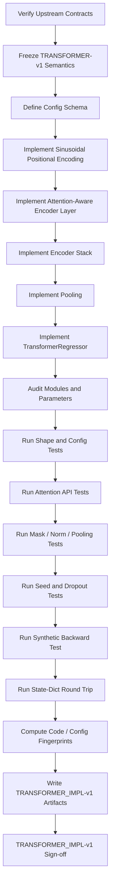
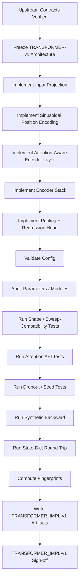

<div align="center">

# PHASE 16 — TRANSFORMER IMPLEMENTATION

## Kế hoạch thiết kế, hiện thực và kiểm toán Transformer Encoder cho hồi quy chuỗi thời gian đa biến

### UCI Appliances Energy Prediction — Sequence-to-One, One-Step-Ahead Forecasting

**Phase kế tiếp sau `Phase_15_LSTM_implementation.md`**

</div>

---

# 1. Vai trò của Phase 16

Phase 16 chịu trách nhiệm xây dựng **implementation Transformer Encoder chuẩn, tái sử dụng được, hỗ trợ attention inspection và có thể kiểm toán đầy đủ** cho bài toán hồi quy chuỗi thời gian đa biến.

Nếu:

```text
Phase 15
→ khóa LSTM_IMPL-v1
→ learned recurrent baseline
```

thì:

```text
Phase 16
→ khóa TRANSFORMER_IMPL-v1
→ model chính của coursework
```

Model phải nhận đúng external tensor contract đã được khóa từ Phase 10–15:

\[
\boxed{
X\in\mathbb{R}^{B\times L\times F}
\rightarrow
\hat y\in\mathbb{R}^{B\times1}
}
\]

và phải được thiết kế ngay từ đầu sao cho Phase 17 có thể lấy:

```text
attention weights theo từng layer
attention weights theo từng head
```

mà không cần viết lại model.

Nguyên tắc cốt lõi:

\[
\boxed{
Project
+
Position
+
Self\text{-}Attend
+
Encode
+
Pool
+
Regress
}
\]

đồng thời:

\[
\boxed{
Training\ Path
\neq
Attention\ Inspection\ Path
}
\]

về việc có trả attention weights hay không, nhưng **cùng một model weights và cùng một architecture**.

---

# 2. Mục tiêu cần đạt sau Phase 16

Sau Phase 16 phải có:

```text
1. Transformer regression model class dùng chung.

2. Input contract [B,L,F].

3. Output contract [B,1].

4. Linear input projection F → d_model.

5. Positional encoding rõ ràng.

6. Sinusoidal positional encoding baseline.

7. Custom encoder layer dựa trên nn.MultiheadAttention.

8. batch_first=True xuyên suốt.

9. Self-attention Q=K=V.

10. Multi-head attention support.

11. Feed-forward network support.

12. Residual connections.

13. LayerNorm.

14. Dropout đúng vị trí.

15. GELU/ReLU support.

16. Last-step pooling support.

17. Mean pooling support.

18. Baseline pooling = LAST_STEP.

19. Linear regression head.

20. Không output activation.

21. Không Transformer decoder.

22. Không causal mask baseline.

23. Không padding mask baseline.

24. Không CLS token baseline.

25. Không future target/features trong input.

26. Attention inspection switch.

27. Training path dùng need_weights=False.

28. Inspection path dùng need_weights=True.

29. Per-head attention với average_attn_weights=False.

30. Attention tensor contract [B,H,L,L].

31. Layer-wise attention collection.

32. Attention off không thay output semantics.

33. Config schema cho các sweep đã pre-register.

34. d_model % num_heads validation.

35. max_seq_len validation.

36. Positional buffer registration.

37. Parameter-count audit.

38. Module audit.

39. Initialization policy.

40. Synthetic forward tests.

41. Synthetic backward tests.

42. Train/eval dropout tests.

43. Pooling tests.

44. Activation tests.

45. Different lookback tests.

46. Different feature-size tests.

47. Different architecture-size tests.

48. Device-agnostic implementation.

49. state_dict serialization contract.

50. Code/config fingerprints.

51. Experiment Registry integration contract.

52. TRANSFORMER_IMPL-v1 manifest.

53. Phase 16 sign-off.
```

---

# 3. Những việc Phase 16 không làm

Phase 16 không:

```text
Không train Transformer chính thức.

Không tính final Validation RMSE.

Không chọn Transformer winner.

Không tune d_model.

Không tune number of heads.

Không tune number of layers.

Không tune FFN dimension.

Không tune dropout.

Không tune pooling winner.

Không tune activation winner.

Không tune learning rate.

Không tune loss.

Không tune lookback.

Không tune feature set.

Không tune RevIN.

Không mở Test targets.

Không tính Test metrics.

Không thay WINDOWS-v1.

Không thay SCALING-v1.

Không làm attention heatmap cuối cùng.

Không kết luận attention có ý nghĩa khoa học.
```

Official model training thuộc:

```text
Phase 21 — Transformer B0 run.
```

Attention correctness verification thuộc:

```text
Phase 17 — Attention-aware encoder verification.
```

Attention analysis thuộc:

```text
Phase 52–57.
```

---

# 4. Input contract

Phase 16 chỉ bắt đầu khi:

```text
Phase 11 = PASS
Phase 12 = PASS
Phase 13 = PASS
Phase 14 = PASS
Phase 15 = PASS
```

và có:

```text
FEATURESETS-v1
SCALING-v1
WINDOWS-v1
WINDOWPOP-v1
DATALOADERS-v1
METRICS-v1
EXPERIMENTS-v1
PERSISTENCE-v1
LSTM_IMPL-v1
```

---

# 5. Output version

Gán:

```text
TRANSFORMER_IMPL-v1
```

Model implementation version:

```text
TRANSFORMER-v1
```

Tách:

```text
TRANSFORMER_IMPL-v1
→ implementation contract / source implementation

TRANSFORMER-v1
→ model version ghi vào experiment config/checkpoints
```

---

# 6. Vai trò của Transformer trong coursework

Assignment khóa:

```text
Model:
Transformer Encoder for regression
```

Do đó kiến trúc chính phải là:

```text
Transformer Encoder
```

không phải:

```text
Transformer Decoder
Encoder-Decoder Transformer
GPT-style causal decoder
Temporal Fusion Transformer
PatchTST
Informer
Autoformer
```

Các kiến trúc nâng cao có thể là future work, không phải main coursework.

---

# 7. Forecasting formulation nhắc lại

Main task:

\[
X_{t-L+1:t}
\rightarrow
Appliances_{t+1}
\]

Trong đó toàn bộ:

```text
X window
```

đều xảy ra trước:

```text
target timestamp.
```

Transformer chỉ encode historical observations.

---

# 8. Canonical architecture

Pipeline:

```text
Input
[B,L,F]
    ↓
Linear Input Projection
F → d_model
    ↓
Add Positional Encoding
[B,L,d_model]
    ↓
Transformer Encoder Stack
N layers
    ↓
Encoded Sequence
[B,L,d_model]
    ↓
Pooling
LAST_STEP hoặc MEAN
    ↓
[B,d_model]
    ↓
Linear Regression Head
d_model → 1
    ↓
Prediction
[B,1]
```

---

# 9. Mathematical overview

Input:

\[
X\in\mathbb{R}^{B\times L\times F}
\]

Projection:

\[
E = XW_{in}+b_{in}
\]

với:

\[
W_{in}\in\mathbb{R}^{F\times d_{model}}
\]

Add position:

\[
Z^{(0)}=E+P
\]

Encoder:

\[
Z^{(N)}
=
Encoder_N(
\cdots Encoder_1(Z^{(0)})
)
\]

Pooling:

\[
z_{pool}
=
Pool(Z^{(N)})
\]

Prediction:

\[
\hat y
=
W_{out}z_{pool}+b_{out}
\]

---

# 10. Canonical model class

Khuyến nghị:

```text
TransformerRegressor
```

Không dùng tên mơ hồ:

```text
TransformerModel
Model
Net
TimeSeriesModel
```

trong source chính.

---

# 11. Source-code organization

Khuyến nghị:

```text
src/
└── models/
    ├── transformer_regressor.py
    ├── transformer_encoder_layer.py
    ├── positional_encoding.py
    ├── configs.py
    └── validation.py
```

Nếu project đã có:

```text
configs.py
validation.py
```

dùng chung thì không duplicate.

---

# 12. Vì sao dùng custom encoder layer?

PyTorch có:

```text
nn.TransformerEncoderLayer
```

nhưng coursework extension yêu cầu:

```text
analyze attention maps.
```

Để lấy attention weights theo head một cách explicit và ổn định, Phase 16 ưu tiên custom encoder layer sử dụng:

```text
nn.MultiheadAttention
```

trực tiếp.

Mục tiêu:

```text
không monkey-patch
không hook private internals
không rewrite model sau khi training.
```

---

# 13. Custom không có nghĩa viết attention từ đầu

Không tự viết:

```text
Q projection
K projection
V projection
scaled dot-product
softmax
head concat
```

bằng tensor math thủ công cho baseline.

Dùng:

```text
torch.nn.MultiheadAttention
```

để tận dụng implementation chuẩn và backend optimization của PyTorch.

---

# 14. Canonical custom layer name

Khuyến nghị:

```text
InspectableTransformerEncoderLayer
```

hoặc:

```text
AttentionAwareEncoderLayer
```

Chọn một tên và dùng nhất quán.

Khuyến nghị chính:

```text
AttentionAwareEncoderLayer
```

---

# 15. Encoder stack name

Khuyến nghị:

```text
AttentionAwareTransformerEncoder
```

chứa:

```text
nn.ModuleList
```

của encoder layers.

---

# 16. External input contract

Per batch:

\[
\boxed{
X
\in
\mathbb{R}^{B\times L\times F}
}
\]

DataLoader đã khóa:

```text
dtype = float32

sequence direction:
oldest → newest
```

---

# 17. External output contract

Prediction:

\[
\boxed{
\hat y
\in
\mathbb{R}^{B\times1}
}
\]

không:

```text
[B]
```

để khớp target:

```text
[B,1].
```

---

# 18. Internal encoder layout

Tất cả attention/encoder modules dùng:

```text
batch_first=True
```

nên internal sequence layout là:

```text
[B,L,d_model].
```

Không transpose qua lại giữa:

```text
[L,B,D]
```

và:

```text
[B,L,D].
```

---

# 19. Input projection

Raw/model features:

\[
F
\]

không nhất thiết bằng:

\[
d_{model}
\]

Do đó bắt buộc có:

```python
nn.Linear(input_size, d_model)
```

---

# 20. Input projection shape

\[
[B,L,F]
\rightarrow
[B,L,D]
\]

trong đó:

\[
D=d_{model}
\]

---

# 21. Không hard-code feature count

`input_size` lấy từ:

```text
FEATURESETS-v1
```

Không viết:

```python
nn.Linear(31, 64)
```

trực tiếp trong class.

---

# 22. Vì sao cần projection?

Transformer self-attention làm việc trong embedding space:

```text
d_model.
```

Projection giúp:

```text
map heterogeneous sensor channels
vào common latent representation.
```

---

# 23. Không dùng Conv1D input embedding baseline

Không thêm:

```text
Conv1d
Temporal convolution
patch embedding
```

vì làm architecture phức tạp hơn assignment yêu cầu.

---

# 24. Không dùng per-feature embedding riêng

Baseline:

```text
whole feature vector at each timestamp
→ one Linear projection.
```

Không token hóa từng sensor thành token riêng.

---

# 25. Positional information là bắt buộc

Self-attention tự thân không encode chronological position theo cách sequence recurrence làm.

Do đó model cần positional information.

Baseline dùng:

```text
fixed sinusoidal positional encoding.
```

---

# 26. Không dùng learned positional embedding baseline

Không:

```text
nn.Embedding(max_seq_len, d_model)
```

trong TRANSFORMER-v1 baseline.

Lý do:

```text
sinusoidal encoding deterministic

không thêm trainable positional parameters

phù hợp standard Transformer formulation

dễ audit.
```

---

# 27. Sinusoidal positional encoding

Với position:

\[
pos
\]

và embedding dimension:

\[
i
\]

dùng:

\[
PE(pos,2i)
=
\sin
\left(
\frac{pos}{10000^{2i/d_{model}}}
\right)
\]

\[
PE(pos,2i+1)
=
\cos
\left(
\frac{pos}{10000^{2i/d_{model}}}
\right)
\]

---

# 28. Position index direction

Input:

```text
oldest → newest
```

Do đó:

```text
position 0
=
oldest input observation

position L-1
=
most recent historical observation.
```

---

# 29. Relative time meaning

Với H1/L144:

```text
position 0
→ lag -24h relative to target

position 143
→ lag -10m.
```

Phase 10 đã khóa relative-lag mapping.

---

# 30. Positional encoding shape

Khuyến nghị precompute:

```text
[1, max_seq_len, d_model]
```

sau đó slice:

```text
[:, :L, :]
```

---

# 31. Positional encoding là buffer

Dùng:

```python
register_buffer(...)
```

không:

```text
nn.Parameter.
```

Nó không được optimizer update.

---

# 32. Buffer persistence policy

Khuyến nghị:

```text
persistent=True
```

để positional tensor xuất hiện trong:

```text
state_dict
```

và checkpoint reconstruction hoàn toàn explicit.

---

# 33. Positional encoding dtype

Khởi tạo theo:

```text
float32 baseline
```

và đảm bảo buffer move cùng model khi:

```text
model.to(device).
```

---

# 34. max_seq_len

Reference config:

```text
max_seq_len = 144
```

vì current planned lookbacks:

```text
36
72
144.
```

Model class vẫn nhận:

```text
max_seq_len
```

từ config.

Không hard-code 144 trong implementation logic.

---

# 35. Sequence-length guard

Nếu:

\[
L>max\_seq\_len
\]

model phải:

```text
raise clear error.
```

Không silently:

```text
truncate.
```

---

# 36. Odd d_model handling

Positional encoder implementation phải đúng nếu:

```text
d_model
```

lẻ, dù planned values 32/64 đều chẵn.

Không viết code chỉ tình cờ đúng cho even dimensions nếu dễ tránh.

---

# 37. Planned d_model values

Master sweep:

```text
D32 = 32

D64 = 64
```

Reference:

```text
D64.
```

---

# 38. Positional encoding no additional learnable scale baseline

Không thêm:

```text
learned positional scale alpha
```

trong TRANSFORMER-v1.

---

# 39. Có scale input projection bằng sqrt(d_model) không?

TRANSFORMER-v1 baseline **không** nhân projection output với:

\[
\sqrt{d_{model}}
\]

vì đây không phải token embedding lookup có magnitude convention giống NLP embedding table.

Canonical:

```text
projected = input_projection(x)

encoded_input =
projected + positional_encoding
```

Nếu sau này muốn embedding-scale ablation:

```text
explicit protocol/version.
```

---

# 40. Input dropout

Để tránh tạo thêm một dropout site ngoài encoder reference, TRANSFORMER-v1 baseline không thêm separate:

```text
input_embedding_dropout
```

sau positional addition.

Dropout parameter chính áp trong encoder layers.

Nếu sau này thêm input dropout:

```text
architecture semantic change.
```

---

# 41. Multi-head self-attention

Mỗi encoder layer dùng:

```python
nn.MultiheadAttention(
    embed_dim=d_model,
    num_heads=num_heads,
    dropout=dropout,
    batch_first=True,
)
```

---

# 42. Self-attention Q/K/V

Với encoder self-attention:

```text
query = x

key = x

value = x.
```

---

# 43. Attention head dimension

\[
d_{head}
=
\frac{d_{model}}{num\_heads}
\]

Do đó hard requirement:

\[
\boxed{
d_{model}\bmod num\_heads=0
}
\]

---

# 44. Planned heads

Master sweep:

```text
H2 = 2 heads

H4 = 4 heads.
```

Reference:

```text
H4.
```

---

# 45. Reference head dimension

B0:

```text
d_model = 64

num_heads = 4
```

nên:

\[
d_{head}=16
\]

---

# 46. Invalid head config

Ví dụ:

```text
d_model=32
num_heads=3
```

phải reject.

Không để error sâu trong PyTorch mới phát hiện nếu config validator có thể bắt sớm.

---

# 47. Attention scaling

`nn.MultiheadAttention` xử lý scaled dot-product attention nội bộ.

Không nhân thêm:

\[
1/\sqrt{d_{head}}
\]

ở wrapper.

---

# 48. Attention dropout

`dropout` truyền vào:

```text
nn.MultiheadAttention
```

để áp attention dropout theo module semantics.

Không thêm một random attention-mask dropout thủ công.

---

# 49. Training attention path

Khi training/normal validation không cần attention maps:

```text
need_weights=False.
```

PyTorch hiện khuyến nghị `need_weights=False` để có đường thực thi attention tối ưu hơn khi có thể.

---

# 50. Inspection attention path

Khi cần attention maps:

```text
need_weights=True

average_attn_weights=False.
```

---

# 51. Per-head attention shape

Với batched self-attention:

\[
\boxed{
A
\in
\mathbb{R}^{B\times H\times L\times L}
}
\]

Trong đó:

```text
B = batch

H = number of heads

query length = L

source/key length = L.
```

---

# 52. Layer-wise attention stack

Nếu:

```text
N encoder layers
```

attention collection conceptual:

```text
list length N
```

mỗi item:

```text
[B,H,L,L].
```

Có thể stack thành:

\[
[N,B,H,L,L]
\]

cho analysis utility nếu memory phù hợp.

---

# 53. Training không lưu attention history

Không:

```text
append all attention tensors every training batch.
```

Điều này:

```text
tăng memory
giữ computation graph
làm training chậm.
```

Default:

```text
return_attention=False.
```

---

# 54. Attention collection phải detach ở analysis boundary

Phase 52+ khi save attention:

```text
detach
cpu
```

sau inference.

Phase 16 chỉ expose raw tensors từ forward inspection API.

---

# 55. Không average heads ở source

Để Phase 55 so heads, phải giữ:

```text
per-head attention.
```

Average chỉ làm downstream:

```text
explicitly.
```

---

# 56. Không average layers ở source

Tương tự.

---

# 57. Attention weights không phải causal explanation

Implementation phải gọi chúng:

```text
attention weights
```

không:

```text
feature importance
causal importance
```

Scientific interpretation thuộc Phase 52–57 và phải thận trọng.

---

# 58. Encoder block structure

TRANSFORMER-v1 chọn:

```text
POST-NORM
```

để bám sát default `nn.TransformerEncoderLayer` và formulation reference.

Một layer:

```text
Input x
    ↓
Self-Attention
    ↓
Dropout
    ↓
Residual Add
    ↓
LayerNorm
    ↓
Feed-Forward
    ↓
Dropout
    ↓
Residual Add
    ↓
LayerNorm
```

---

# 59. norm_first contract

Reference:

```text
norm_first = False
```

tức:

```text
post-norm.
```

---

# 60. Vì sao không pre-norm baseline?

Pre-norm có thể hữu ích cho optimization sâu.

Nhưng current encoder chỉ:

```text
1–2 layers.
```

Để giảm hidden architecture choices, baseline dùng:

```text
PyTorch reference default semantics:
norm_first=False.
```

---

# 61. Pre-norm là semantic model change

Nếu sau này muốn:

```text
norm_first=True
```

phải:

```text
explicit config/version/ablation.
```

Không đổi khi thấy training khó mà không log.

---

# 62. Attention sub-block

POST-NORM:

\[
A=
MHA(x,x,x)
\]

\[
x_1=
LayerNorm(
x+
Dropout(A)
)
\]

---

# 63. Feed-forward sub-block

\[
FFN(x)
=
W_2
\phi(
W_1x+b_1
)
+b_2
\]

với dropout giữa hidden activation và output projection.

Sau đó:

\[
x_2
=
LayerNorm(
x_1+
Dropout(FFN(x_1))
)
\]

---

# 64. FFN dimensions

```text
Linear(d_model, ffn_dim)

activation

Dropout(dropout)

Linear(ffn_dim, d_model)
```

---

# 65. Planned FFN values

Master sweep:

```text
F64

F128

F256
```

Reference:

```text
F128.
```

---

# 66. Activation support

Planned:

```text
RELU

GELU.
```

Reference B0:

```text
GELU.
```

---

# 67. GELU implementation

Khuyến nghị:

```python
nn.GELU(approximate="none")
```

để dùng explicit exact/default GELU behavior.

Không đổi:

```text
tanh approximation
```

âm thầm.

---

# 68. ReLU implementation

Dùng:

```python
nn.ReLU()
```

nếu activation config:

```text
RELU.
```

---

# 69. Unsupported activation

Reject:

```text
SILU
SELU
TANH
```

trong TRANSFORMER-v1 config.

---

# 70. LayerNorm

Dùng:

```python
nn.LayerNorm(
    d_model,
    eps=1e-5,
    elementwise_affine=True,
)
```

baseline.

---

# 71. LayerNorm axis

Với tensor:

```text
[B,L,D]
```

`LayerNorm(D)` normalize trên:

```text
last dimension D
```

cho mỗi timestamp/sample independently.

---

# 72. Không BatchNorm

Không thêm:

```text
BatchNorm1d
```

vào encoder baseline.

LayerNorm phù hợp Transformer architecture và không phụ thuộc batch-size statistics.

---

# 73. LayerNorm epsilon

Reference:

```text
1e-5.
```

Phù hợp PyTorch Transformer reference defaults.

---

# 74. LayerNorm affine

Reference:

```text
elementwise_affine=True.
```

---

# 75. Encoder residual dropout sites

Mỗi layer có:

```text
MHA internal attention dropout

dropout after attention output before residual

dropout inside FFN after activation

dropout after FFN output before residual.
```

Không duplicate thêm arbitrary dropout ngoài contract.

---

# 76. Dropout config

Reference:

```text
dropout=0.1.
```

Planned sweep:

```text
0.1
0.2
0.3.
```

---

# 77. Train/eval behavior

Trong:

```text
model.train()
```

dropout active.

Trong:

```text
model.eval()
```

dropout inactive.

Attention analysis Phase 52+ phải dùng:

```text
eval mode.
```

---

# 78. Number of encoder layers

Planned:

```text
N1 = 1

N2 = 2.
```

Reference:

```text
N2.
```

---

# 79. Encoder stack

Dùng:

```python
nn.ModuleList([...])
```

để:

```text
iterate layers

collect per-layer attention

keep layer ownership explicit.
```

---

# 80. Không dùng một layer object lặp lại cùng reference

Sai:

```python
layers = nn.ModuleList([layer] * num_layers)
```

vì có thể share weights.

Phải tạo:

```text
independent layer instances.
```

---

# 81. Independent initialization

Mỗi encoder layer:

```text
có own parameters.
```

Không intentional weight tying baseline.

---

# 82. Final encoder LayerNorm?

TRANSFORMER-v1 POST-NORM stack **không thêm extra final LayerNorm** sau encoder stack.

Lý do:

```text
mỗi layer đã post-normalize
nn.TransformerEncoder mặc định cũng không bắt buộc final norm
tránh thêm hidden design choice.
```

---

# 83. Nếu dùng PRE-NORM trong future

Có thể cân nhắc final norm.

Nhưng không current contract.

---

# 84. Pooling options phải được implement từ đầu

Master Phase 27 cần:

```text
P0 = LAST_STEP

P1 = MEAN.
```

Do đó TransformerRegressor hỗ trợ cả hai.

Reference:

```text
LAST_STEP.
```

---

# 85. Last-step pooling

\[
z_{pool}
=
Z[:, -1, :]
\]

Shape:

```text
[B,D].
```

---

# 86. Why LAST_STEP baseline?

Most recent historical position:

```text
gần forecast target nhất.
```

Sau self-attention, representation vị trí cuối có thể tổng hợp thông tin từ toàn bộ historical window.

---

# 87. Mean pooling

\[
z_{pool}
=
\frac{1}{L}
\sum_{t=1}^{L}
Z_t
\]

Shape:

```text
[B,D].
```

---

# 88. Mean pooling không cần mask

Vì:

```text
fixed-length windows

no padding.
```

Nếu future dataset có padding:

```text
masked mean
```

sẽ cần implementation mới.

---

# 89. Không CLS token

Không prepend:

```text
learnable [CLS]
```

baseline.

Lý do:

```text
thêm trainable token
thay position length
thay attention geometry
không nằm planned pooling sweep.
```

---

# 90. Không max pooling

Không planned.

---

# 91. Regression head

Canonical:

```python
nn.Linear(d_model, 1)
```

---

# 92. Không MLP head baseline

Không:

```text
Linear → GELU → Dropout → Linear
```

ở head.

Giữ model comparison đơn giản.

---

# 93. Không output activation

Không:

```text
ReLU
Sigmoid
Softplus
Tanh
Softmax.
```

---

# 94. YS1 requirement reinforces linear output

YS1 target có thể:

```text
negative
zero
positive
```

nên output phải unconstrained.

---

# 95. No prediction clipping in model

Không:

```python
pred.clamp_min_(0)
```

Phase 12 đã khóa raw model output evaluation policy.

---

# 96. Causal mask — baseline decision

TRANSFORMER-v1 dùng:

```text
attn_mask = None

is_causal = False.
```

---

# 97. Vì sao không cần causal mask?

Toàn bộ sequence input:

```text
đã nằm trong quá khứ của target.
```

Model không dự báo output ở từng input timestep.

Nó chỉ tạo:

```text
một scalar target ở tương lai của toàn window.
```

Do đó việc một historical timestep sớm attend tới một historical timestep muộn hơn:

```text
không tiết lộ target hoặc future beyond forecast origin.
```

---

# 98. Causal mask và target leakage là hai chuyện khác nhau

Target leakage được chặn bởi:

```text
WINDOWS-v1:
max(input_timestamp) < target_timestamp.
```

Không phải bằng việc bắt buộc triangular mask bên trong historical encoder.

---

# 99. Không truyền `is_causal=True` như “optimization hint”

PyTorch docs cảnh báo incorrect causal hints có thể gây behavior không đúng.

Current contract:

```text
is_causal=False.
```

---

# 100. Key padding mask

Baseline:

```text
key_padding_mask=None.
```

Lý do:

```text
mọi sequence fixed L

không padding

gaps đã bị reject ở Phase 10.
```

---

# 101. Không padding missing timestamps

Phase 10 reject gap-crossing window.

Do đó không cần attention padding mask để che synthetic gaps.

---

# 102. Full attention geometry

Self-attention matrix:

\[
L\times L
\]

cho mỗi head/layer/sample.

Với L144:

\[
144\times144
\]

mỗi head.

---

# 103. Attention memory implication

Per sample, per layer:

\[
H\times L^2
\]

weights.

Reference:

```text
H=4
L=144
N=2
```

attention inspection không quá lớn cho selected batches, nhưng không nên lưu cho mọi training batch.

---

# 104. Attention training path vs analysis path

Main forward API nên hỗ trợ:

```text
return_attention=False
```

default.

Inspection:

```text
return_attention=True.
```

---

# 105. Preferred forward API

Conceptual:

```python
def forward(
    self,
    x,
    *,
    return_attention=False,
):
    ...
```

Default return:

```text
prediction tensor [B,1].
```

If:

```text
return_attention=True
```

return structured object/tuple:

```text
prediction
attention_weights
```

---

# 106. Avoid unstable return type ambiguity

Khuyến nghị explicit:

```text
TransformerOutput
```

dataclass với:

```text
prediction

attention_weights optional.
```

hoặc giữ simple:

```text
prediction only default
(prediction, attention_list) inspection.
```

Chọn một convention và unit-test.

---

# 107. Training engine compatibility

Phase 19/21 muốn model call đơn giản.

Do đó default:

```text
model(x)
→ Tensor [B,1].
```

Không bắt Training Engine hiểu dataclass chỉ để train.

Khuyến nghị:

```text
forward(x) → prediction

forward_with_attention(x)
→ prediction, attention.
```

---

# 108. Preferred API separation

Tốt nhất:

```text
forward(x)
```

training/inference prediction path.

Và:

```text
forward_with_attention(x)
```

inspection path.

Cả hai gọi cùng private encoder logic.

---

# 109. Không duplicate architecture logic giữa hai methods

Dùng internal:

```text
_encode(...)
```

hoặc:

```text
_forward_impl(...)
```

với flag.

Mục tiêu:

```text
same weights

same mathematical model

only attention-weight collection differs.
```

---

# 110. Prediction equivalence requirement

Trong:

```text
model.eval()
dropout off
same x
```

prediction từ:

```text
forward(x)
```

và:

```text
forward_with_attention(x)
```

phải:

```text
allclose.
```

---

# 111. Vì sao test equivalence?

Nếu attention path vô tình:

```text
dùng average weights khác

mask khác

normalization khác

code branch khác
```

thì analysis không còn phản ánh model đã đánh giá.

---

# 112. MultiheadAttention `need_weights` nuance

PyTorch current docs:

```text
need_weights=False
```

cho phép optimized scaled-dot-product attention path tốt hơn khi khả dụng.

Attention inspection bắt buộc:

```text
need_weights=True.
```

Do đó slight kernel/path differences có thể tồn tại ở low-level numeric precision.

Eval equivalence test nên dùng:

```text
reasonable allclose tolerance
```

không exact bit equality.

---

# 113. Average-attention config

Inspection luôn:

```text
average_attn_weights=False.
```

Không cho caller accidentally default True trong scientific attention pipeline.

---

# 114. Attention shape hard assertion

Per layer:

```text
attn.ndim == 4

attn.shape[0] == B

attn.shape[1] == num_heads

attn.shape[2] == L

attn.shape[3] == L.
```

---

# 115. Attention row-sum checks belong Phase 17

Phase 16 chuẩn bị contract.

Phase 17 mới kiểm:

```text
row sums ≈ 1 in eval mode
```

với caveats.

---

# 116. Attention non-negativity checks belong Phase 17

Tương tự.

---

# 117. Attention dropout caveat

Trong train mode:

```text
attention dropout
```

có thể làm returned weights không phù hợp để diễn giải như deterministic probability map.

Attention analysis phải:

```text
model.eval().
```

---

# 118. Positional encoding inspection

Phase 16 unit tests phải kiểm:

```text
same position encoding across batches

different positions not identical

buffer requires_grad=False.
```

---

# 119. Positional buffer device test

After:

```text
model.to(device)
```

positional buffer phải move cùng device.

No hidden CPU positional tensor.

---

# 120. Positional encoding length test

L36/L72/L144 đều slice đúng.

---

# 121. Position zero test

Standard sinusoidal:

```text
sin channels at pos0 = 0

cos channels at pos0 = 1
```

theo formula.

Có thể dùng như unit test.

---

# 122. No raw timestamp as positional input

Model không nhận:

```text
Unix timestamp
```

làm positional embedding.

Calendar effects đã có TF1 feature option.

Positional encoding chỉ biểu diễn:

```text
relative sequence position.
```

---

# 123. TF1 và positional encoding không duplicate hoàn toàn

TF1:

```text
hour-of-day
day-of-week
weekend
```

mang calendar semantics.

Sinusoidal Transformer positional encoding:

```text
position inside lookback window.
```

Hai loại khác nhau.

---

# 124. Config schema

Khuyến nghị:

```text
TransformerModelConfig
```

Fields:

```text
input_size

d_model

num_heads

num_layers

ffn_dim

dropout

activation

pooling

max_seq_len

batch_first

norm_first

layer_norm_eps

bias

positional_encoding_type

attention_aware

output_size

model_version
```

---

# 125. Reference B0 config

```text
input_size
→ derived from FS1_TF1 runtime

d_model = 64

num_heads = 4

num_layers = 2

ffn_dim = 128

dropout = 0.1

activation = GELU

pooling = LAST_STEP

max_seq_len = 144

batch_first = True

norm_first = False

layer_norm_eps = 1e-5

bias = True

positional_encoding_type = SINUSOIDAL

attention_aware = True

output_size = 1
```

---

# 126. Baseline B0 data config

Phase 21 reference:

```text
FS1_TF1

L144

H1

YS1

WB0

WINDOWPOP-v1

B64.
```

---

# 127. Baseline optimization config

Phase 21 reference:

```text
AdamW

learning_rate = 3e-4

weight_decay = 1e-4

loss = MSE

max_epochs = 50

patience = 10

gradient_clip = 1.0

seed = 42.
```

Những field này không nằm Transformer model class.

---

# 128. Planned configuration support — d_model

Allowed current:

```text
32
64.
```

Implementation có thể support arbitrary positive integer nhưng experiment schema chỉ pre-register planned options.

---

# 129. Planned configuration support — heads

```text
2
4.
```

---

# 130. Planned configuration support — layers

```text
1
2.
```

---

# 131. Planned configuration support — FFN

```text
64
128
256.
```

---

# 132. Planned configuration support — dropout

```text
0.1
0.2
0.3.
```

---

# 133. Planned configuration support — activation

```text
RELU
GELU.
```

---

# 134. Planned configuration support — pooling

```text
LAST_STEP
MEAN.
```

---

# 135. Config validation — input_size

Require:

```text
positive integer.
```

---

# 136. Config validation — d_model

Require:

```text
positive integer.
```

---

# 137. Config validation — num_heads

Require:

```text
positive integer.
```

---

# 138. Config validation — divisibility

Hard:

\[
d_{model}\bmod num\_heads=0
\]

---

# 139. Config validation — num_layers

Require:

```text
>=1.
```

---

# 140. Config validation — ffn_dim

Require:

```text
positive integer.
```

Không bắt buộc:

```text
ffn_dim > d_model
```

vì planned F64 with D64 is valid.

---

# 141. Config validation — dropout

Require:

\[
0\le p<1
\]

---

# 142. Config validation — activation

Allowed current:

```text
RELU
GELU.
```

---

# 143. Config validation — pooling

Allowed:

```text
LAST_STEP
MEAN.
```

---

# 144. Config validation — max_seq_len

Require:

```text
>= active lookback.
```

---

# 145. Config validation — batch_first

TRANSFORMER-v1 hard:

```text
True.
```

Reject False.

---

# 146. Config validation — norm_first

TRANSFORMER-v1 hard/reference:

```text
False.
```

Nếu muốn support future pre-norm, version separately.

---

# 147. Config validation — positional encoding

TRANSFORMER-v1:

```text
SINUSOIDAL only.
```

---

# 148. Config validation — output size

Require:

```text
1.
```

---

# 149. Config validation — attention aware

Require:

```text
True
```

cho implementation version vì coursework extension yêu cầu attention maps.

---

# 150. Model class không đọc files/global registry

Constructor nhận:

```text
config.
```

Không tự:

```text
open FEATURESETS file
load scaler
infer split.
```

---

# 151. Model class không biết target scaler

Không pass:

```text
YSCALER
```

vào model.

---

# 152. Model class không biết metrics

Không compute:

```text
RMSE
R².
```

---

# 153. Model class không biết optimizer

Không instantiate:

```text
AdamW.
```

---

# 154. Model class không biết split

Không branch:

```text
if validation
if test.
```

---

# 155. Model class không know sample IDs

Sample metadata nằm ngoài model.

---

# 156. Model separation of concerns

```text
TransformerRegressor
→ prediction

Training Engine
→ optimization

METRICS-v1
→ evaluation

EXPERIMENTS-v1
→ tracking

Attention analysis
→ Phase 52+.
```

---

# 157. Initialization policy

TRANSFORMER-v1 dùng:

```text
PYTORCH_DEFAULT_INITIALIZATION
```

cho:

```text
nn.Linear
nn.MultiheadAttention
nn.LayerNorm
```

và deterministic sinusoidal positional buffer.

---

# 158. Không custom Xavier reset baseline

PyTorch modules đã có initialization semantics.

Không gọi:

```text
custom reset_parameters()
```

trừ khi implementation cần.

---

# 159. Why no custom init?

Giữ:

```text
implementation đơn giản

reference behavior rõ

ít hidden choices.
```

Nếu custom initialization sau này:

```text
version/ablation.
```

---

# 160. Seed-before-instantiation

Hard reproducibility practice:

```text
set seed
→ instantiate model.
```

Không ngược lại.

---

# 161. Same-seed initialization test

Trong fixed environment:

```text
same config
same seed
```

→ same parameter tensors.

---

# 162. Different-seed initialization test

Expected:

```text
trainable weights differ.
```

Positional buffer vẫn giống vì deterministic formula.

---

# 163. Train/eval dropout test

Same model/input:

```text
train mode
```

can produce differing outputs.

```text
eval mode
```

repeated predictions should allclose.

---

# 164. Attention path eval equivalence

In eval:

```text
model(x)
```

và:

```text
model.forward_with_attention(x)
```

predictions should allclose.

---

# 165. Parameter count

Phase 16 phải compute runtime:

```python
total_params = sum(p.numel() for p in model.parameters())
trainable_params = sum(
    p.numel()
    for p in model.parameters()
    if p.requires_grad
)
```

---

# 166. Positional encoding không tính là parameter

Buffer:

```text
excluded from trainable parameter count.
```

Nếu report model state size riêng, buffer có thể được count ở state elements, nhưng không parameter.

---

# 167. Approximate/reference parameter audit

Parameter count phụ thuộc:

```text
F
d_model
heads
layers
FFN
bias.
```

Runtime là source of truth.

Không hard-code một count duy nhất vào project logic.

---

# 168. Parameter groups cần thấy

Typical:

```text
input_projection.weight
input_projection.bias

encoder.layers.0.self_attn.in_proj_weight
encoder.layers.0.self_attn.in_proj_bias
encoder.layers.0.self_attn.out_proj.weight
encoder.layers.0.self_attn.out_proj.bias

encoder.layers.0.linear1.*
encoder.layers.0.linear2.*

encoder.layers.0.norm1.*
encoder.layers.0.norm2.*

...

regression_head.weight
regression_head.bias.
```

---

# 169. Parameter-sharing audit

Đảm bảo layer 0 và layer 1:

```text
không cùng Parameter object.
```

---

# 170. Module audit

Export:

```text
module name
module type
parameter count
train/eval sensitivity
notes.
```

---

# 171. Input validation in forward

Development mode should check:

```text
x.ndim == 3

x.shape[-1] == input_size

1 <= x.shape[1] <= max_seq_len

x floating point.
```

---

# 172. Batch size dynamic

Không giả định:

```text
B64.
```

Model phải work:

```text
B1
B32
B64
last incomplete batch.
```

---

# 173. Lookback dynamic

Model support:

```text
L36
L72
L144
```

trong same class/config max_seq_len.

---

# 174. Feature dimension dynamic

Different feature variants dùng model instances với matching:

```text
input_size.
```

---

# 175. Wrong feature dimension

Input F mismatch config:

```text
clear error.
```

---

# 176. Wrong rank

Input:

```text
[B,F]
```

reject.

---

# 177. Empty sequence

Input:

```text
[B,0,F]
```

reject.

---

# 178. Too-long sequence

Input L:

```text
> max_seq_len
```

reject.

---

# 179. Integer input

Reject/prevent:

```text
torch.int64
```

model feature tensor.

Expected:

```text
floating point.
```

---

# 180. Nonfinite input

Upstream already audits.

Model không silently:

```text
nan_to_num
```

inside forward.

Numerical guard belongs training engine.

---

# 181. Synthetic shape test — reference B64

If runtime expected FS1_TF1 feature count is F:

```text
x [64,144,F]
```

Expected:

```text
y_hat [64,1].
```

---

# 182. Synthetic shape test — B32

```text
[32,L,F]
→
[32,1].
```

---

# 183. Synthetic shape test — B1

```text
[1,L,F]
→
[1,1].
```

---

# 184. L36 test

```text
[B,36,F]
→
[B,1].
```

---

# 185. L72 test

```text
[B,72,F]
→
[B,1].
```

---

# 186. L144 test

```text
[B,144,F]
→
[B,1].
```

---

# 187. Pooling LAST_STEP test

Given encoded tensor:

```text
Z
```

pool helper must produce:

```text
Z[:, -1, :].
```

Unit-test pooling separately from encoder.

---

# 188. Pooling MEAN test

Must equal:

```text
Z.mean(dim=1).
```

within exact/allclose expectations.

---

# 189. Activation test

Instantiate same valid architecture with:

```text
GELU
RELU.
```

Both forward successfully.

Do not compare metrics in Phase 16.

---

# 190. d_model/head combinations test

Planned valid:

```text
D32/H2

D32/H4

D64/H2

D64/H4.
```

All divisible.

---

# 191. Invalid divisibility test

Example:

```text
D32/H3
```

reject.

---

# 192. Layer-count test

```text
N1
N2
```

both build and forward.

---

# 193. FFN test

```text
64
128
256
```

build successfully.

---

# 194. Dropout configuration test

```text
0.1
0.2
0.3
```

propagates consistently to layer modules.

---

# 195. Attention-off output test

`forward(x)` returns:

```text
Tensor only
```

shape:

```text
[B,1].
```

---

# 196. Attention-on output test

`forward_with_attention(x)` returns:

```text
prediction [B,1]

list length num_layers

each attention [B,H,L,L].
```

---

# 197. Attention layer count test

If:

```text
num_layers=2
```

must return exactly:

```text
2 attention tensors.
```

---

# 198. Head count test

If:

```text
num_heads=4
```

attention second dimension:

```text
4.
```

---

# 199. Attention source/query length test

Self-attention:

```text
L_query = L_key = L.
```

Both final dimensions equal current sequence length.

---

# 200. No mask test

Baseline layer call should have:

```text
attn_mask=None

key_padding_mask=None

is_causal=False.
```

---

# 201. No accidental mask construction

Do not create triangular mask in model constructor.

---

# 202. Batch permutation equivariance

In eval:

```text
permute batch samples
```

outputs should permute correspondingly.

No cross-sample interaction.

---

# 203. Sample independence

Same sample alone vs within batch:

```text
prediction allclose
```

in eval.

Self-attention only attends:

```text
within sequence dimension
```

not across batch dimension.

---

# 204. Sequence permutation is NOT invariant

If timestamps/sequence positions are permuted:

```text
prediction can change
```

because:

```text
input order
+
positional encoding
```

matter.

Do not test temporal permutation invariance.

---

# 205. Position encoding sensitivity test

Two inputs with same feature rows but different order should generally produce different internal embeddings due to positional assignment.

Only structural sanity, not metric claim.

---

# 206. Synthetic backward smoke test

Phase 16 may run:

```text
forward
synthetic scalar loss
backward.
```

No optimizer step.

---

# 207. Gradient coverage

Expected core trainable modules receive gradients:

```text
input_projection

attention projections

FFN

LayerNorm affine

regression head.
```

Some individual gradient entries can be zero; test finite/non-None at module level rather than every element nonzero.

---

# 208. Gradient finite test

For valid random input/target:

```text
existing gradients finite.
```

---

# 209. No gradient for positional buffer

Expected:

```text
requires_grad=False

grad=None.
```

---

# 210. Gradient clipping not in model

Phase 19:

```text
torch.nn.utils.clip_grad_norm_
```

Model class không call.

---

# 211. No optimizer in Phase 16

Không:

```text
optimizer.step().
```

---

# 212. No actual-data training

Official data forward/device smoke:

```text
Phase 18.
```

Phase 16 synthetic/model-level tests only.

---

# 213. State-dict contract

Model must support:

```text
state_dict()

load_state_dict(strict=True).
```

---

# 214. Checkpoint format later

Phase 19 should save:

```text
state_dict
model config
run config
config fingerprint
implementation version
feature fingerprint
window/population lineage
epoch
metrics.
```

---

# 215. Positional buffer in state dict

Because persistent buffer:

```text
positional_encoding.pe
```

or chosen name should appear in state dict.

This is expected.

---

# 216. State-dict round-trip

Synthetic:

```text
save temp state_dict

new model same config

load strict

eval same x
```

Expected:

```text
same prediction.
```

---

# 217. Attention round-trip

After loading same state:

```text
attention inspection predictions
```

must also match within tolerance.

Attention tensors themselves should match in eval if same backend/path.

---

# 218. Wrong-config strict load

Example:

```text
d_model 64 checkpoint
→ d_model 32 model
```

must fail.

---

# 219. Wrong-feature-size strict load

Input projection shape mismatch should fail.

---

# 220. Checkpoint-feature binding

Even if a shape happens to match, Experiment Registry must validate:

```text
feature_fingerprint.
```

Do not rely only on state_dict shape.

---

# 221. Lookback binding

Model weights technically can operate shorter L if max_seq_len allows.

But a trained run is bound to:

```text
lookback
```

in registry/checkpoint.

Do not reuse L144 checkpoint as official L36 run.

---

# 222. Pooling binding

Checkpoint run config must bind:

```text
LAST_STEP
or
MEAN.
```

Because weights were trained under that output pathway.

---

# 223. Activation binding

Same.

---

# 224. Attention implementation binding

Checkpoint must bind:

```text
TRANSFORMER-v1
attention-aware code fingerprint.
```

---

# 225. Device agnosticism

Không hard-code:

```text
cuda
mps
cpu.
```

inside model.

Use:

```text
model.to(device)
```

outside.

---

# 226. Positional buffer device safety

`register_buffer` giúp buffer move với:

```text
.to(device).
```

Không gọi `.cuda()` khi build PE.

---

# 227. Dtype agnosticism within baseline

Model default float32.

Không explicitly cast every intermediate:

```text
.float()
```

inside forward nếu input contract đã float32.

Điều đó tránh phá future autocast experiments.

---

# 228. Mixed precision baseline

Current master:

```text
mixed_precision=False.
```

Phase 16 không thêm autocast.

---

# 229. MPS compatibility

Implementation chỉ dùng standard PyTorch modules:

```text
Linear
MultiheadAttention
LayerNorm
Dropout
GELU/ReLU
```

Actual active-environment test thuộc Phase 18.

---

# 230. CUDA compatibility

Tương tự.

---

# 231. CPU compatibility

Synthetic Phase 16 unit tests nên chạy được CPU.

---

# 232. Reproducibility

PyTorch không đảm bảo absolute reproducibility across:

```text
releases
platforms
CPU/GPU.
```

Phase 16 phải:

```text
không tạo hidden RNG riêng

seed externally before instantiation

record dropout/config

record PyTorch version

record code fingerprint.
```

---

# 233. Deterministic mode ownership

Phase 1/19 quản lý:

```text
torch.use_deterministic_algorithms
backend settings.
```

Transformer model không set global process flags.

---

# 234. `nn.MultiheadAttention` optimized kernels

Current PyTorch may use optimized scaled-dot-product attention when possible.

Không code phụ thuộc một specific kernel.

Scientific output contract dựa:

```text
tensor semantics
```

không backend implementation.

---

# 235. Fast path and attention inspection

`need_weights=False` may enable faster path.

`need_weights=True` required to inspect weights.

Do not benchmark these as though identical workloads.

---

# 236. Attention performance overhead must be acknowledged

Attention extraction:

```text
slower
more memory
```

than normal prediction mode.

Do not enable it throughout training.

---

# 237. Attention map dimension complexity

Full attention storage:

\[
O(N_{samples}\times N_{layers}\times H\times L^2)
\]

Do not save full maps for all dataset samples by default.

Phase 52 should choose:

```text
representative subsets
error-conditioned samples
aggregate summaries.
```

---

# 238. Model parameter complexity

Self-attention parameters scale roughly with:

\[
O(d_{model}^2)
\]

FFN with:

\[
O(d_{model}\times ffn_{dim})
\]

per layer.

Sequence compute/memory attention scales roughly:

\[
O(L^2)
\]

for standard full attention.

---

# 239. Lookback implication

L144 attention matrix has:

```text
4× more pairwise positions than L72 approximately
```

because:

\[
144^2 / 72^2 = 4.
\]

This is one reason lookback sweep also affects compute.

---

# 240. Do not interpret training-time differences solely as architecture merit

Longer L means more attention work.

Runtime analysis must consider:

```text
sequence length.
```

---

# 241. Transformer-v1 is full attention

Không dùng:

```text
sparse attention
local attention
linear attention
flash-specific custom architecture.
```

Backend optimization can occur internally without changing model semantics.

---

# 242. No decoder

Không tạo:

```text
nn.Transformer
```

full encoder-decoder nếu chỉ cần encoder.

Use custom encoder stack.

---

# 243. Why not `nn.Transformer`?

It includes:

```text
decoder machinery
```

not needed for sequence-to-one regression.

---

# 244. Why not stock `nn.TransformerEncoderLayer` only?

It is useful reference, but custom attention-aware layer gives:

```text
explicit per-head attention access
```

required for coursework extension.

Phase 16 should still mirror its core structure closely.

---

# 245. Reference semantic parity audit

Custom layer should be documented against:

```text
MultiheadAttention
residual
LayerNorm
FFN
dropout
activation
post-norm
```

of PyTorch TransformerEncoderLayer reference.

---

# 246. Optional parity test with stock layer?

Not required because weight layouts/internal operations may differ in accessibility.

Could build structural audit rather than numerical equality.

Do not spend excessive effort forcing weight transfer.

---

# 247. No private PyTorch internals

Avoid relying on:

```text
self_attn._qkv_same_embed_dim

private fastpath methods

private source implementation names.
```

Use public APIs only.

---

# 248. Model config fingerprint

Hash model semantics:

```text
input_size

d_model

num_heads

num_layers

ffn_dim

dropout

activation

pooling

max_seq_len

norm_first

PE type

output size.
```

---

# 249. Run config fingerprint

EXPERIMENTS-v1 additionally hashes:

```text
data
optimizer
seed
loss
training policy.
```

---

# 250. Code fingerprint

Hash relevant source:

```text
transformer_regressor.py

transformer_encoder_layer.py

positional_encoding.py
```

or combined canonical code fingerprint.

---

# 251. Why code fingerprint?

Một run phải chứng minh:

```text
exact implementation semantics
```

không chỉ config values.

---

# 252. Source change after sign-off

Material semantic change:

```text
TRANSFORMER_IMPL-v2
```

hoặc model version bump.

Không silently modify v1.

---

# 253. Version bump examples

Need version change if:

```text
POST-NORM → PRE-NORM

sinusoidal → learned positional encoding

last/mean support changed semantically

add CLS token

add input dropout

add final LayerNorm

add MLP regression head

add causal mask

add decoder

custom attention math

change residual ordering

change attention-return semantics.
```

---

# 254. No version bump examples

No semantic version bump for:

```text
comments
docstrings
type hints
non-semantic refactor.
```

Code fingerprint may still differ and registry should record.

---

# 255. Reference architecture summary

```text
TRANSFORMER_B0

Input:
[B,144,F]

Input Projection:
F → 64

PE:
Fixed sinusoidal

Encoder:
2 layers

Per layer:
MHA, 4 heads
FFN 64 → 128 → 64
GELU
Dropout 0.1
Post-Norm
Residuals

Pooling:
Last step

Head:
Linear(64,1)

Output:
[B,1]
```

---

# 256. Reference data summary

```text
FS1_TF1

WINDOWPOP-v1

L144

H1

WB0

YS1.
```

---

# 257. Fairness with LSTM

Shared:

```text
same X tensors

same y targets

same feature variant

same lookback

same target scaling

same population

same batch size reference

same metric system

same Test firewall.
```

Architecture differs by design.

---

# 258. LSTM vs Transformer width

Reference both use:

```text
64-dimensional main hidden/embedding width
```

but this does **not** imply equal parameter count or capacity.

Do not claim parameter-matched comparison.

---

# 259. Parameter count should be reported later if useful

Use runtime audit.

---

# 260. Transformer training objective

Model implementation does not know loss.

Phase 21 baseline:

```text
MSE.
```

Phase 37 later:

```text
Huber.
```

Same model class.

---

# 261. Target scaling

Model implementation does not know YS0/YS1.

Output always scalar model-space prediction.

---

# 262. YS1 model output

During YS1 training:

```text
prediction is standardized target space.
```

METRICS-v1 inverse transforms later.

No output activation.

---

# 263. YS0 model output

Raw Wh space.

Same head.

---

# 264. RevIN

Phase 40 planned:

```text
RN0 / RN1.
```

TRANSFORMER-v1 baseline keeps:

```text
RevIN off.
```

---

# 265. Do not embed RevIN silently in base class

Recommended:

```text
optional wrapper/module path
```

designed later under explicit Phase 40 contract.

Phase 16 can ensure model interface is composable, but does not enable RevIN.

---

# 266. Attention and RevIN later

Attention maps after RevIN-enabled model may differ because input normalization changes.

Registry must bind:

```text
RevIN config.
```

Phase 52 uses model-specific attention.

---

# 267. Forward output finite test

Valid finite synthetic input should produce:

```text
finite prediction.
```

---

# 268. Attention finite test

In eval synthetic inspection:

```text
attention tensor finite.
```

Detailed probability checks Phase 17.

---

# 269. No target info in model forward signature

Không:

```text
forward(x, y)
```

for inference model.

Loss/training engine receives y separately.

---

# 270. No timestamp info in forward signature

Không cần raw timestamps because:

```text
positional encoding uses sequence positions

calendar features already inside X if TF1.
```

---

# 271. No split mask in forward

Không.

---

# 272. No sample metadata in forward

Không.

---

# 273. Model object should be stateless across batches

Transformer naturally has no recurrent carry state.

Do not cache previous keys/values between windows.

---

# 274. No KV cache

Không dùng GPT-style:

```text
KV cache
```

because each window is independent and training samples shuffled.

---

# 275. No memory between windows

Hard fairness with LSTM stateless contract.

---

# 276. Batch independence test

Same sample alone vs batched:

```text
prediction allclose in eval.
```

---

# 277. Model serialization

Prefer:

```text
state_dict + config
```

not entire pickled model object.

---

# 278. `strict=True`

Checkpoint load baseline.

---

# 279. Positional encoding config in checkpoint

Must save:

```text
type

max_seq_len

d_model.
```

---

# 280. Attention-aware flag in checkpoint

Must save:

```text
True.
```

so future loader knows implementation supports analysis path.

---

# 281. Experiment Registry metadata

Future run records must include:

```text
model_family = TRANSFORMER_ENCODER

model_name = TRANSFORMER_REGRESSOR

model_version = TRANSFORMER-v1

implementation_version = TRANSFORMER_IMPL-v1

code_fingerprint

d_model

num_heads

num_layers

ffn_dim

dropout

activation

pooling

positional_encoding_type

norm_first

attention_aware.
```

---

# 282. No production run required in Phase 16

Synthetic tests are implementation tests.

Official actual-data sanity:

```text
Phase 18.
```

Official training:

```text
Phase 21.
```

---

# 283. Phase 17 dependency

Phase 17 consumes:

```text
forward_with_attention

per-layer per-head tensors

attention shape contract.
```

Do not defer attention access implementation entirely to Phase 17.

Phase 17 verifies it; Phase 16 builds it.

---

# 284. Attention inspection must not rely on hooks

Preferred direct return path.

Hooks can be useful debugging but not canonical scientific pipeline.

---

# 285. Why direct return path?

More explicit:

```text
which layer
which head
which batch
which sequence
```

and less fragile across PyTorch versions.

---

# 286. Attention layer object contract

Each layer method conceptual:

```python
forward(
    x,
    *,
    return_attention=False,
)
```

When false:

```text
attention weights not requested.
```

When true:

```text
per-head weights returned.
```

---

# 287. Encoder object contract

Loops:

```text
for layer in layers:
    x, optional_attention = layer(...)
```

Collect ordered by:

```text
layer index 0 → N-1.
```

---

# 288. Attention list ordering

Hard:

```text
attention_list[0]
→ encoder layer 0

attention_list[-1]
→ final encoder layer.
```

---

# 289. Head ordering

Head dimension ordering follows:

```text
PyTorch MultiheadAttention returned head index.
```

Do not sort heads by entropy/importance at extraction time.

---

# 290. Query/source axis contract

Attention tensor:

```text
[B,H,L_query,L_source]
```

For self-attention:

```text
L_query = L_source = L.
```

---

# 291. Last-query attention extraction later

Phase 54:

```text
attn[:, :, -1, :]
```

corresponds attention from most recent query position to all historical key positions.

This relies on Phase 10/16 sequence ordering.

---

# 292. Attention-map axes later

X-axis:

```text
source/key lag positions
```

Y-axis:

```text
query lag positions
```

for full heatmap.

Phase 53 finalizes visualization.

---

# 293. No feature-level attention claim

Self-attention here operates across:

```text
time positions in projected embedding space.
```

Returned MHA weights are:

```text
temporal-position attention
```

not direct raw-feature attention.

This distinction must be documented now.

---

# 294. Feature importance requires separate method

If desired future:

```text
permutation
SHAP
gradient methods
```

not implied by MHA attention map.

Out of current phase.

---

# 295. Parameter audit artifact

Tạo:

```text
transformer_parameter_audit.csv
```

Fields:

```text
parameter_name

shape

numel

requires_grad

dtype

device

finite

module_group

status
```

---

# 296. Module audit artifact

```text
transformer_module_audit.csv
```

Fields:

```text
module_name

module_type

layer_index

parameter_count

dropout_probability

activation

train_eval_sensitive

notes
```

---

# 297. Positional encoding audit artifact

```text
transformer_positional_encoding_audit.csv
```

Checks:

```text
buffer_registered

requires_grad_false

shape_valid

max_seq_len_valid

position0_sin_valid

position0_cos_valid

L36_slice_valid

L72_slice_valid

L144_slice_valid

device_mobility_valid

finite

status
```

---

# 298. Shape contract artifact

```text
transformer_shape_contract.json
```

Fields:

```text
input_layout = B_L_F

projected_layout = B_L_D

encoder_layout = B_L_D

pooled_layout = B_D

prediction_layout = B_1

attention_layout_per_layer = B_H_L_L

attention_collection_layout = LIST_N_OF_B_H_L_L

batch_first = true
```

---

# 299. Config schema artifact

```text
transformer_model_config_schema.json
```

---

# 300. Reference config artifact

```text
transformer_reference_config.json
```

---

# 301. Attention contract artifact

```text
transformer_attention_contract.json
```

Fields:

```text
attention_aware = true

self_attention = true

need_weights_training = false

need_weights_inspection = true

average_attn_weights = false

is_causal = false

attn_mask = none

key_padding_mask = none

per_layer_shape = B_H_L_L

layer_order = input_to_output

head_order = pytorch_native

attention_semantics = temporal_position_attention
```

---

# 302. Implementation audit artifact

```text
transformer_implementation_audit.csv
```

Checks:

```text
class_exists

inherits_nn_module

input_projection_valid

sinusoidal_pe_valid

pe_is_buffer

batch_first_true

self_attention_valid

per_head_attention_supported

post_norm_valid

residuals_valid

ffn_valid

activation_registry_valid

dropout_policy_valid

pooling_registry_valid

linear_head_valid

no_output_activation

no_decoder

no_causal_mask

no_padding_mask

no_cls_token

input_size_dynamic

lookback_dynamic

device_not_hardcoded

parameter_sharing_absent

state_dict_roundtrip_valid

unit_tests_passed

status
```

---

# 303. Unit tests artifact

```text
transformer_unit_tests.csv
```

Fields:

```text
test_id

category

description

config_id

input_shape

expected

actual

tolerance

status

notes
```

---

# 304. Required unit-test categories

```text
CONFIG

INPUT_PROJECTION

POSITIONAL_ENCODING

SHAPE

ATTENTION

RESIDUAL_NORM

POOLING

ACTIVATION

DROPOUT

INITIALIZATION

PARAMETERS

GRADIENT

SERIALIZATION

DEVICE_AGNOSTICISM

API_EQUIVALENCE

REGISTRY_COMPATIBILITY
```

---

# 305. Unit test T16-01

Reference config builds.

---

# 306. Unit test T16-02

Reference B64/L144/F:

```text
prediction [64,1].
```

---

# 307. Unit test T16-03

B32 output:

```text
[32,1].
```

---

# 308. Unit test T16-04

B1 output:

```text
[1,1].
```

---

# 309. Unit test T16-05

L36 works.

---

# 310. Unit test T16-06

L72 works.

---

# 311. Unit test T16-07

L144 works.

---

# 312. Unit test T16-08

L > max_seq_len rejected.

---

# 313. Unit test T16-09

Different valid F works with matching config.

---

# 314. Unit test T16-10

Wrong F rejected.

---

# 315. Unit test T16-11

Wrong rank rejected.

---

# 316. Unit test T16-12

Empty sequence rejected.

---

# 317. Unit test T16-13

Integer tensor rejected.

---

# 318. Unit test T16-14

Input projection shape [B,L,D].

---

# 319. Unit test T16-15

PE buffer registered.

---

# 320. Unit test T16-16

PE requires_grad=False.

---

# 321. Unit test T16-17

PE pos0 sin/cos formula valid.

---

# 322. Unit test T16-18

PE slice lengths valid.

---

# 323. Unit test T16-19

D32/H2 valid.

---

# 324. Unit test T16-20

D32/H4 valid.

---

# 325. Unit test T16-21

D64/H2 valid.

---

# 326. Unit test T16-22

D64/H4 valid.

---

# 327. Unit test T16-23

Invalid D/H divisibility rejected.

---

# 328. Unit test T16-24

N1 works.

---

# 329. Unit test T16-25

N2 works.

---

# 330. Unit test T16-26

FFN64 works.

---

# 331. Unit test T16-27

FFN128 works.

---

# 332. Unit test T16-28

FFN256 works.

---

# 333. Unit test T16-29

GELU works.

---

# 334. Unit test T16-30

ReLU works.

---

# 335. Unit test T16-31

LAST_STEP pooling exact helper test.

---

# 336. Unit test T16-32

MEAN pooling exact helper test.

---

# 337. Unit test T16-33

Default forward returns Tensor [B,1].

---

# 338. Unit test T16-34

Attention forward returns N attention tensors.

---

# 339. Unit test T16-35

Each attention tensor shape [B,H,L,L].

---

# 340. Unit test T16-36

No averaged-head source tensor.

---

# 341. Unit test T16-37

No causal mask baseline.

---

# 342. Unit test T16-38

No padding mask baseline.

---

# 343. Unit test T16-39

Eval prediction path vs attention path allclose.

---

# 344. Unit test T16-40

Eval repeated forward deterministic within tolerance.

---

# 345. Unit test T16-41

Batch permutation equivariance.

---

# 346. Unit test T16-42

Cross-sample independence.

---

# 347. Unit test T16-43

Train-mode dropout changes stochastic path as expected.

---

# 348. Unit test T16-44

Same-seed initialization same.

---

# 349. Unit test T16-45

Different-seed initialization differs.

---

# 350. Unit test T16-46

Independent encoder layer parameters not shared.

---

# 351. Unit test T16-47

Runtime parameter count self-consistent.

---

# 352. Unit test T16-48

All trainable parameters require_grad=True.

---

# 353. Unit test T16-49

Synthetic backward produces gradients.

---

# 354. Unit test T16-50

Gradients finite.

---

# 355. Unit test T16-51

PE buffer has no gradient.

---

# 356. Unit test T16-52

State-dict round-trip preserves predictions.

---

# 357. Unit test T16-53

State-dict round-trip preserves attention path prediction.

---

# 358. Unit test T16-54

Wrong d_model state load fails.

---

# 359. Unit test T16-55

Wrong input_size state load fails.

---

# 360. Unit test T16-56

output_size != 1 rejected.

---

# 361. Unit test T16-57

batch_first=False rejected.

---

# 362. Unit test T16-58

norm_first=True rejected for v1.

---

# 363. Unit test T16-59

unsupported positional encoding rejected.

---

# 364. Unit test T16-60

unsupported activation rejected.

---

# 365. Unit test T16-61

unsupported pooling rejected.

---

# 366. Unit test T16-62

No output activation module after head.

---

# 367. Unit test T16-63

No decoder module present.

---

# 368. Unit test T16-64

Model contains no persistent cross-window cache.

---

# 369. Synthetic tests do not equal model performance tests

Không dùng unit-test output để kết luận:

```text
Transformer works well on data.
```

Chúng chỉ chứng minh:

```text
implementation contracts.
```

---

# 370. Discrepancy categories

```text
CONFIG_SCHEMA_ERROR

INPUT_SHAPE_ERROR

OUTPUT_SHAPE_ERROR

INPUT_PROJECTION_ERROR

POSITIONAL_ENCODING_ERROR

POSITIONAL_BUFFER_ERROR

D_MODEL_HEAD_MISMATCH

ATTENTION_SHAPE_ERROR

ATTENTION_API_ERROR

MASK_POLICY_VIOLATION

NORM_POLICY_ERROR

RESIDUAL_ERROR

FFN_ERROR

ACTIVATION_ERROR

POOLING_ERROR

OUTPUT_ACTIVATION_ERROR

PARAMETER_SHARING_ERROR

PARAMETER_COUNT_ERROR

INITIALIZATION_REPRODUCIBILITY_ERROR

NONFINITE_OUTPUT

NONFINITE_GRADIENT

STATE_DICT_ERROR

DEVICE_HARDCODE_ERROR

CODE_VERSION_MISMATCH

OTHER
```

---

# 371. Discrepancy log

Tạo:

```text
transformer_discrepancies.json
```

Fields:

```text
id

severity

category

test_id optional

expected

actual

interpretation

recommended_action

resolved

notes
```

---

# 372. Status model

## PASS

```text
Implementation contract valid.

Attention-aware API exists.

Required unit tests pass.

Architecture matches TRANSFORMER-v1.
```

## PASS_WITH_WARNING

Ví dụ:

```text
active backend has reproducibility/performance caveat
```

but model semantics remain correct.

## FAIL

Ví dụ:

```text
wrong attention shape

causal mask accidentally active

feature count hard-coded

attention path changes prediction materially

layer weights shared

state_dict cannot restore model.
```

---

# 373. Implementation manifest

Tạo:

```text
transformer_implementation_manifest.json
```

Fields:

```text
implementation_version = TRANSFORMER_IMPL-v1

model_version = TRANSFORMER-v1

framework = PyTorch

torch_version

class_name = TransformerRegressor

encoder_layer_class

encoder_class

source_paths

code_fingerprint

input_layout

output_layout

input_projection_policy

positional_encoding_policy

max_seq_len_reference

self_attention_policy

attention_return_policy

attention_shape_contract

norm_policy

residual_policy

ffn_policy

dropout_policy

activation_support

pooling_support

regression_head_policy

mask_policy

initialization_policy

reference_config

supported_lookbacks

supported_feature_variants

unit_test_status

parameter_audit_status

serialization_test_status

audit_status

warnings

created_at
```

---

# 374. README_TRANSFORMER

Tạo:

```text
README_TRANSFORMER.md
```

Nội dung:

```text
Purpose

Forecasting formulation

Architecture

Tensor shapes

Input projection

Positional encoding

Self-attention

Encoder block

Residual + LayerNorm policy

FFN

Pooling

Regression head

Attention extraction API

Why no causal mask

Why no decoder

Why no output activation

Reference B0 config

Sweep-compatible options

Parameter/reproducibility notes

Checkpoint contract

Limitations

Versioning
```

---

# 375. Model limitations phải ghi

TRANSFORMER-v1:

```text
full self-attention has O(L²) sequence interaction cost

single-house dataset limits external generalization

attention weights are not causal explanations

last-step pooling may not always be optimal

small dataset creates overfitting risk

performance depends strongly on protocol and regularization.
```

---

# 376. Model strengths phải ghi

```text
global interactions across historical window

parallel sequence encoding

multi-head temporal pattern representation

direct attention-map availability

flexible lookback handling

natural comparison with LSTM.
```

---

# 377. No claim Transformer is superior before experiments

README không viết:

```text
Transformer outperforms LSTM.
```

Chưa có evidence.

---

# 378. Output directory

```text
artifacts/
└── models/
    └── transformer/
        ├── transformer_implementation_manifest.json
        ├── transformer_model_config_schema.json
        ├── transformer_reference_config.json
        ├── transformer_shape_contract.json
        ├── transformer_attention_contract.json
        ├── transformer_parameter_audit.csv
        ├── transformer_module_audit.csv
        ├── transformer_positional_encoding_audit.csv
        ├── transformer_unit_tests.csv
        ├── transformer_implementation_audit.csv
        ├── transformer_discrepancies.json
        ├── README_TRANSFORMER.md
        └── phase_16_signoff.json
```

Recommended source:

```text
src/models/transformer_regressor.py
src/models/transformer_encoder_layer.py
src/models/positional_encoding.py
```

---

# 379. Output O16.1 — Positional encoding class

```text
SinusoidalPositionalEncoding
```

---

# 380. Output O16.2 — Attention-aware encoder layer

```text
AttentionAwareEncoderLayer
```

---

# 381. Output O16.3 — Encoder stack

```text
AttentionAwareTransformerEncoder
```

---

# 382. Output O16.4 — Main model

```text
TransformerRegressor
```

---

# 383. Output O16.5 — Model config

```text
TransformerModelConfig
```

---

# 384. Output O16.6 — Config schema

```text
transformer_model_config_schema.json
```

---

# 385. Output O16.7 — Reference config

```text
transformer_reference_config.json
```

---

# 386. Output O16.8 — Shape contract

```text
transformer_shape_contract.json
```

---

# 387. Output O16.9 — Attention contract

```text
transformer_attention_contract.json
```

---

# 388. Output O16.10 — Parameter audit

```text
transformer_parameter_audit.csv
```

---

# 389. Output O16.11 — Module audit

```text
transformer_module_audit.csv
```

---

# 390. Output O16.12 — PE audit

```text
transformer_positional_encoding_audit.csv
```

---

# 391. Output O16.13 — Unit tests

```text
transformer_unit_tests.csv
```

---

# 392. Output O16.14 — Implementation audit

```text
transformer_implementation_audit.csv
```

---

# 393. Output O16.15 — Manifest

```text
transformer_implementation_manifest.json
```

---

# 394. Output O16.16 — Discrepancy log

```text
transformer_discrepancies.json
```

---

# 395. Output O16.17 — README

```text
README_TRANSFORMER.md
```

---

# 396. Output O16.18 — Sign-off

```text
phase_16_signoff.json
```

---

# 397. Phase 16 notebook structure

Khuyến nghị:

```text
24–32 cells
```

## Cell 16.1 — Phase title

## Cell 16.2 — Verify upstream contracts

## Cell 16.3 — Declare TRANSFORMER_IMPL-v1

## Cell 16.4 — Define TransformerModelConfig

## Cell 16.5 — Implement config validation

## Cell 16.6 — Implement SinusoidalPositionalEncoding

## Cell 16.7 — PE formula/buffer tests

## Cell 16.8 — Implement AttentionAwareEncoderLayer

## Cell 16.9 — Implement encoder stack

## Cell 16.10 — Implement pooling helper

## Cell 16.11 — Implement TransformerRegressor

## Cell 16.12 — Inspect modules

## Cell 16.13 — Parameter-count audit

## Cell 16.14 — B64/L144 synthetic forward

## Cell 16.15 — B32/B1 tests

## Cell 16.16 — L36/L72/L144 tests

## Cell 16.17 — Feature-dimension tests

## Cell 16.18 — d_model/head compatibility tests

## Cell 16.19 — Layer/FFN tests

## Cell 16.20 — GELU/ReLU tests

## Cell 16.21 — LAST_STEP/MEAN tests

## Cell 16.22 — Attention-off path test

## Cell 16.23 — Attention-on shape test

## Cell 16.24 — Prediction-equivalence test

## Cell 16.25 — Mask-policy tests

## Cell 16.26 — Train/eval dropout tests

## Cell 16.27 — Seed initialization tests

## Cell 16.28 — Synthetic backward test

## Cell 16.29 — State-dict round-trip

## Cell 16.30 — Build audits/fingerprints

## Cell 16.31 — Save artifacts/README/manifest

## Cell 16.32 — Phase sign-off

---

# 398. Quy trình thực thi Phase 16



---

# 399. Function/class design khuyến nghị

```text
TransformerModelConfig

SinusoidalPositionalEncoding

AttentionAwareEncoderLayer

AttentionAwareTransformerEncoder

TransformerRegressor

validate_transformer_config()

validate_transformer_input()

build_activation()

pool_encoded_sequence()

count_parameters()

audit_transformer_parameters()

audit_transformer_modules()

compute_transformer_config_fingerprint()

compute_transformer_code_fingerprint()

run_transformer_unit_tests()

write_transformer_manifest()
```

---

# 400. Attention-aware layer conceptual implementation

Pseudo-structure:

```python
class AttentionAwareEncoderLayer(nn.Module):
    def __init__(...):
        self.self_attn = nn.MultiheadAttention(
            embed_dim=d_model,
            num_heads=num_heads,
            dropout=dropout,
            batch_first=True,
        )

        self.linear1 = nn.Linear(d_model, ffn_dim)
        self.linear2 = nn.Linear(ffn_dim, d_model)

        self.norm1 = nn.LayerNorm(d_model, eps=layer_norm_eps)
        self.norm2 = nn.LayerNorm(d_model, eps=layer_norm_eps)

        self.dropout_attn_residual = nn.Dropout(dropout)
        self.dropout_ff_hidden = nn.Dropout(dropout)
        self.dropout_ff_residual = nn.Dropout(dropout)

        self.activation = ...
```

Đây là conceptual plan, không phải yêu cầu copy nguyên văn implementation.

---

# 401. Layer forward conceptual POST-NORM

```text
attn_out
=
MHA(
    query=x,
    key=x,
    value=x,
    need_weights=return_attention,
    average_attn_weights=False if return_attention else irrelevant,
    attn_mask=None,
    key_padding_mask=None,
    is_causal=False
)

x
=
norm1(
    x + dropout_attn_residual(attn_out)
)

ff
=
linear2(
    dropout_ff_hidden(
        activation(
            linear1(x)
        )
    )
)

x
=
norm2(
    x + dropout_ff_residual(ff)
)
```

---

# 402. MHA return handling

When:

```text
return_attention=False
```

use:

```text
need_weights=False
```

and ignore second return.

When:

```text
return_attention=True
```

use:

```text
need_weights=True
average_attn_weights=False.
```

---

# 403. No `average_attn_weights=True` anywhere in canonical inspection

Nếu downstream cần average:

```text
attention.mean(dim=head_axis)
```

explicit.

---

# 404. Pooling conceptual implementation

```text
LAST_STEP:
encoded[:, -1, :]

MEAN:
encoded.mean(dim=1)
```

---

# 405. Main forward conceptual implementation

```text
validate X

z = input_projection(X)

z = positional_encoding(z)

z = encoder(z, return_attention=False)

z_pool = pool(z)

prediction = regression_head(z_pool)

return prediction
```

---

# 406. Attention forward conceptual implementation

```text
validate X

same projection

same PE

same encoder weights
with attention collection

same pooling

same head

return prediction, attention_list
```

---

# 407. No detach inside main encoder

Do not:

```text
detach attention output
```

before it feeds residual stream.

Only returned attention metadata can be detached downstream during analysis.

---

# 408. No manual Softmax on returned MHA attention

PyTorch MHA already returns attention weights according to its implementation.

Do not softmax again.

---

# 409. No attention normalization post-hoc in Phase 16

Phase 17 validates actual returned semantics.

---

# 410. Phase 16 sanity checklist

```text
[ ] Phase 15 PASS.

[ ] TRANSFORMER_IMPL-v1 declared.

[ ] TRANSFORMER-v1 declared.

[ ] TransformerModelConfig implemented.

[ ] Config validation implemented.

[ ] TransformerRegressor implemented.

[ ] Uses PyTorch nn.Module.

[ ] Uses Linear input projection.

[ ] Feature count not hard-coded.

[ ] Positional encoding implemented.

[ ] Positional encoding sinusoidal.

[ ] PE registered as buffer.

[ ] PE requires_grad=False.

[ ] max_seq_len configurable.

[ ] max_seq_len >= 144 reference.

[ ] PE handles L36.

[ ] PE handles L72.

[ ] PE handles L144.

[ ] batch_first=True.

[ ] AttentionAwareEncoderLayer implemented.

[ ] Uses nn.MultiheadAttention.

[ ] Self-attention Q=K=V.

[ ] d_model divisible by num_heads.

[ ] Per-head attention supported.

[ ] Training path need_weights=False.

[ ] Inspection path need_weights=True.

[ ] Inspection average_attn_weights=False.

[ ] Attention per-layer shape = [B,H,L,L].

[ ] Attention list ordered by layer.

[ ] is_causal=False.

[ ] attn_mask=None baseline.

[ ] key_padding_mask=None baseline.

[ ] No triangular mask created.

[ ] No decoder.

[ ] POST-NORM locked.

[ ] norm_first=False.

[ ] LayerNorm eps=1e-5 reference.

[ ] Residual around attention implemented.

[ ] Residual around FFN implemented.

[ ] FFN d_model→ffn_dim→d_model.

[ ] FFN dropout implemented.

[ ] MHA dropout uses same config.

[ ] Residual dropout implemented.

[ ] GELU supported.

[ ] ReLU supported.

[ ] GELU reference.

[ ] LAST_STEP pooling supported.

[ ] MEAN pooling supported.

[ ] LAST_STEP reference.

[ ] No CLS token.

[ ] Regression head = Linear(d_model,1).

[ ] No output activation.

[ ] No prediction clipping.

[ ] d_model 32 supported.

[ ] d_model 64 supported.

[ ] 2 heads supported.

[ ] 4 heads supported.

[ ] 1 layer supported.

[ ] 2 layers supported.

[ ] FFN 64 supported.

[ ] FFN 128 supported.

[ ] FFN 256 supported.

[ ] Dropout .1/.2/.3 supported.

[ ] Input shape [B,L,F].

[ ] Output shape [B,1].

[ ] B64 test PASS.

[ ] B32 test PASS.

[ ] B1 test PASS.

[ ] L36 test PASS.

[ ] L72 test PASS.

[ ] L144 test PASS.

[ ] Wrong F rejected.

[ ] Wrong rank rejected.

[ ] Empty sequence rejected.

[ ] Too-long sequence rejected.

[ ] Invalid head divisibility rejected.

[ ] Attention-off output PASS.

[ ] Attention-on output PASS.

[ ] Attention layer count PASS.

[ ] Attention head count PASS.

[ ] Attention query/source dimensions PASS.

[ ] Eval standard/attention prediction equivalence PASS.

[ ] Eval repeated-forward test PASS.

[ ] Batch permutation test PASS.

[ ] Cross-sample independence PASS.

[ ] Train/eval dropout behavior audited.

[ ] Same-seed initialization PASS.

[ ] Different-seed initialization PASS.

[ ] Encoder layers do not share parameters.

[ ] Parameter count computed.

[ ] Parameter audit saved.

[ ] All trainable params require_grad=True.

[ ] PE buffer excluded from trainable params.

[ ] Synthetic backward PASS.

[ ] Gradients finite.

[ ] PE grad absent.

[ ] State-dict round-trip PASS.

[ ] Wrong-config strict load fails.

[ ] Device not hard-coded.

[ ] No optimizer inside model.

[ ] No metric inside model.

[ ] No scaler inside model.

[ ] No split logic inside model.

[ ] No target passed to forward.

[ ] Code fingerprint created.

[ ] Config fingerprint created.

[ ] Shape contract saved.

[ ] Attention contract saved.

[ ] PE audit saved.

[ ] Implementation audit PASS.

[ ] README_TRANSFORMER saved.

[ ] TRANSFORMER_IMPL-v1 manifest saved.

[ ] Phase 16 sign-off completed.
```

---

# 411. Acceptance criteria

Phase 16 chỉ PASS khi:

```text
Transformer receives [B,L,F].

Transformer returns [B,1].

Feature count is dynamic.

Lookback is dynamic up to configured max.

Input projection is correct.

Sinusoidal positional encoding is deterministic and buffered.

Encoder uses batch-first self-attention.

d_model/head compatibility is enforced.

POST-NORM residual architecture is explicit.

FFN and dropout semantics are explicit.

Last-step and mean pooling are both supported.

Regression output is unconstrained.

No decoder is present.

No causal/padding mask is active in baseline.

Attention inspection returns per-layer, per-head [B,H,L,L].

Normal prediction and attention-inspection prediction agree in eval.

Training path does not unnecessarily request attention weights.

Parameters are independent across encoder layers.

Synthetic forward/backward tests pass.

State-dict round-trip works.

Implementation is device agnostic.

Artifacts and fingerprints are saved.
```

---

# 412. Khi nào Phase 16 FAIL?

```text
Model expects [L,B,F] while DataLoader emits [B,L,F].

Feature count hard-coded.

Lookback hard-coded in a way that breaks L36/L72.

No positional encoding.

Positional encoding accidentally trainable.

d_model not divisible by heads.

Encoder layers share weights accidentally.

Attention weights only available averaged across heads.

Attention extraction requires rewriting trained model.

Causal mask accidentally enabled.

Target timestamp row appears in model input.

Decoder included unnecessarily.

POST/PRE norm semantics unclear.

Output returns [B].

Output activation constrains YS1 predictions.

Attention path produces materially different predictions in eval.

State dict cannot restore model.

Model hard-codes CUDA/MPS.

Source changes without implementation version/fingerprint update.
```

---

# 413. Các lỗi thường gặp

## Lỗi 1 — Dùng `nn.Transformer` full encoder-decoder

Không cần decoder.

---

# 414. Lỗi 2 — Quên input projection

F không bằng d_model.

---

# 415. Lỗi 3 — Không có positional encoding

Self-attention mất explicit order information.

---

# 416. Lỗi 4 — Hard-code F=31

Phase 23 feature sweeps hỏng.

---

# 417. Lỗi 5 — Hard-code L=144 trong slicing logic

Phase 26 lookback sweep hỏng.

---

# 418. Lỗi 6 — `batch_first=False`

Tạo shape confusion không cần thiết.

---

# 419. Lỗi 7 — `d_model % nhead != 0`

Invalid attention config.

---

# 420. Lỗi 8 — Dùng stock encoder rồi đến Phase 52 mới cố hack attention weights

Thiết kế muộn, dễ không traceable.

---

# 421. Lỗi 9 — `average_attn_weights=True`

Mất per-head information.

---

# 422. Lỗi 10 — Luôn `need_weights=True` trong training

Tốn compute/memory không cần.

---

# 423. Lỗi 11 — Causal mask vì “Transformer time series thì phải causal”

Không đúng với current sequence-to-one historical encoder setup.

---

# 424. Lỗi 12 — Không phân biệt target leakage với intra-window bidirectional self-attention

Toàn window đã historical so với target.

---

# 425. Lỗi 13 — Thêm CLS token tự phát

Thay architecture/pooling protocol.

---

# 426. Lỗi 14 — Thêm learned positional embedding tự phát

Thay model semantics.

---

# 427. Lỗi 15 — Pre-norm vì training khó nhưng không version/log

Confounds experiments.

---

# 428. Lỗi 16 — Thêm final LayerNorm tự phát

Architecture drift.

---

# 429. Lỗi 17 — Thêm MLP regression head tự phát

Architecture drift.

---

# 430. Lỗi 18 — ReLU output

Phá standardized target negative range.

---

# 431. Lỗi 19 — Treat attention as feature importance

Attention here is over temporal positions, not raw feature attribution.

---

# 432. Lỗi 20 — Save every attention matrix every epoch

Storage/memory explosion.

---

# 433. Lỗi 21 — Average heads/layers trước khi lưu source attention

Mất analysis degrees of freedom.

---

# 434. Lỗi 22 — Create positional tensor on CPU inside forward every batch

Performance/device risk.

Use registered precomputed buffer.

---

# 435. Lỗi 23 — Share same layer instance N times

Weight tying unintended.

---

# 436. Lỗi 24 — Manually softmax returned attention again

Sai semantics.

---

# 437. Lỗi 25 — Put optimizer/scaler/metric inside model

Break separation of concerns.

---

# 438. Handoff sang Phase 17

Phase 17 nhận:

```text
TRANSFORMER_IMPL-v1

AttentionAwareEncoderLayer

forward_with_attention()

attention contract
```

và sẽ verify sâu:

```text
attention shapes

per-head preservation

attention row behavior in eval

layer/head indexing

last-query extraction semantics

prediction equivalence

no mask leakage

attention numerical sanity.
```

---

# 439. Handoff sang Phase 18

Phase 18 dùng actual DataLoader batch:

```text
FS1_TF1

L144

B64

selected device
```

để kiểm:

```text
LSTM forward

Transformer forward

loss-compatible shapes

device/dtype

attention smoke.
```

---

# 440. Handoff sang Phase 19

Training Engine chỉ cần external model contract:

```text
model(x)
→ [B,1]

model.parameters()

model.train()

model.eval()

state_dict()
```

Không cần biết internal attention implementation.

---

# 441. Handoff sang Phase 21

Phase 21 official B0 run sử dụng:

```text
TRANSFORMER-v1
```

không sửa class trong notebook.

---

# 442. Phase 21 reference architecture

```text
FS1_TF1

L144

D64

H4

N2

FFN128

dropout .1

GELU

LAST_STEP

sinusoidal PE

POST-NORM

no mask

Linear head.
```

---

# 443. Handoff sang Phase 23

Feature-set sweep:

```text
same Transformer class

input_size changes.
```

---

# 444. Handoff sang Phase 24

TF sweep:

```text
same Transformer class

input_size changes.
```

---

# 445. Handoff sang Phase 26

Lookback sweep:

```text
same class

L36/L72/L144

same max_seq_len ≥ 144.
```

---

# 446. Handoff sang Phase 27

Pooling sweep:

```text
LAST_STEP vs MEAN
```

using same implementation.

---

# 447. Handoff sang Phase 28

Activation sweep:

```text
RELU vs GELU.
```

---

# 448. Handoff sang Phase 32

Dropout sweep:

```text
0.1 / 0.2 / 0.3.
```

---

# 449. Handoff sang Phase 33

d_model sweep:

```text
32 vs 64.
```

---

# 450. Handoff sang Phase 34

Head sweep:

```text
2 vs 4
```

with divisibility guard.

---

# 451. Handoff sang Phase 35

Layer sweep:

```text
1 vs 2.
```

---

# 452. Handoff sang Phase 36

FFN sweep:

```text
64 / 128 / 256.
```

---

# 453. Handoff sang Phase 40

RevIN optional wrapper must preserve Transformer external input/output contract.

---

# 454. Handoff sang Phase 42

Candidate synthesis queries runs bound to:

```text
TRANSFORMER-v1 code/config fingerprints.
```

---

# 455. Handoff sang Phase 45

Final model lock stores:

```text
Transformer config
implementation version
code fingerprint.
```

---

# 456. Handoff sang Phase 46

Three seeds instantiate same locked architecture.

Only:

```text
seed-related fields
```

may differ.

---

# 457. Handoff sang Phase 47

Final Test reconstructs:

```text
same model config
same implementation
best/locked weights.
```

No architecture edits after seeing Test.

---

# 458. Handoff sang Phase 52

Attention extraction uses:

```text
forward_with_attention()
```

in:

```text
model.eval()
inference mode.
```

---

# 459. Handoff sang Phase 53

Full heatmaps use:

```text
[B,H,L,L]
```

per layer.

---

# 460. Handoff sang Phase 54

Last-query attention uses:

```text
A[:, :, -1, :]
```

for each layer/head.

---

# 461. Handoff sang Phase 55

Head comparison uses unaveraged:

```text
H dimension.
```

---

# 462. Handoff sang Phase 56

Error-conditioned attention joins:

```text
sample_idx
```

with attention extraction batches.

---

# 463. Handoff sang Phase 57

Seed stability compares attention from:

```text
same sample IDs
same architecture
different final seeds.
```

---

# 464. Handoff sang Phase 58

Final tables may report:

```text
d_model

heads

layers

FFN

dropout

activation

pooling

parameter count.
```

---

# 465. Handoff sang Phase 59

Conclusion may discuss:

```text
predictive performance
vs LSTM/Persistence

and observed attention patterns
```

but must not overstate attention as causal explanation.

---

# 466. Phase 16 Definition of Done



Phase 16 hoàn thành khi:

\[
\boxed{
Correct\ Tensor\ Contract
+
Positional\ Awareness
+
Auditable\ Self\text{-}Attention
+
Stable\ Encoder\ Semantics
+
Sweep\ Compatibility
+
Reusable\ Regression\ Model
}
\]

được đảm bảo.

---

# 467. Final status contract

```text
Phase 16 chỉ implement Transformer.

Phase 16 không train full model.

Phase 16 không tune winner.

Phase 16 không mở Test.

TRANSFORMER-v1 nhận [B,L,F].

TRANSFORMER-v1 trả [B,1].

TRANSFORMER-v1 dùng:
Linear projection
+ sinusoidal PE
+ full self-attention encoder
+ POST-NORM
+ FFN
+ pooling
+ linear regression head.

Baseline không có:
decoder
causal mask
padding mask
CLS token
output activation.

Attention-aware implementation phải tồn tại
ngay từ Phase 16.

Chỉ sau khi TRANSFORMER_IMPL-v1 PASS
mới chuyển sang PHASE 17 —
Attention-aware Encoder Verification.
```

---

# 468. Nguồn tham chiếu kỹ thuật

## PyTorch — `torch.nn.MultiheadAttention`

Official documentation:

```text
https://docs.pytorch.org/docs/stable/generated/torch.nn.MultiheadAttention.html
```

Các điểm Phase 16 dựa vào:

```text
batch_first=True
→ [B,L,D]

need_weights=False
→ preferred when attention weights are not needed
and allows optimized attention paths when possible

need_weights=True
+ average_attn_weights=False
→ per-head attention weights

batched per-head weights:
[B,num_heads,L,S]

is_causal=False baseline.
```

---

## PyTorch — `torch.nn.TransformerEncoderLayer`

Official documentation:

```text
https://docs.pytorch.org/docs/stable/generated/torch.nn.TransformerEncoderLayer.html
```

Dùng làm structural reference cho:

```text
self-attention + feed-forward network

dropout

LayerNorm

batch_first

norm_first

activation.
```

TRANSFORMER-v1 custom layer giữ:

```text
norm_first=False
```

để dùng POST-NORM semantics.

---

## PyTorch — `torch.nn.LayerNorm`

Official documentation:

```text
https://docs.pytorch.org/docs/stable/generated/torch.nn.LayerNorm.html
```

Phase 16 dùng:

```text
LayerNorm(d_model)
```

trên last embedding dimension.

---

## PyTorch — `torch.nn.GELU`

Official documentation:

```text
https://docs.pytorch.org/docs/stable/generated/torch.nn.GELU.html
```

Reference activation:

```text
GELU(approximate="none").
```

---

## PyTorch — Reproducibility

Official guidance:

```text
https://docs.pytorch.org/docs/stable/notes/randomness.html
```

PyTorch lưu ý:

```text
không đảm bảo absolute reproducibility
giữa mọi release/platform/device;

deterministic modes có thể giảm performance.
```

Do đó project dùng:

```text
fixed environment

seed control

config/code fingerprints

device/runtime provenance.
```

---

<div align="center">

# PHASE 16 — FINAL CHECK

**Transformer phải dùng đúng tensor contract `[B,L,F] → [B,1]`.**

**Feature vector phải được projection sang `d_model` trước self-attention.**

**Positional encoding phải tồn tại và không được train trong baseline.**

**Không cần causal mask vì toàn bộ input window đã thuộc quá khứ của forecast target.**

**Per-head attention phải được giữ nguyên để Phase 55 có thể so các heads.**

**Training không được request attention weights nếu không cần.**

**Attention inspection phải sử dụng cùng model weights và cho prediction tương đương ở eval mode.**

**Không thêm decoder, CLS token, learned PE, output activation hoặc hidden architecture choices ngoài contract.**

**Chỉ sau khi `TRANSFORMER_IMPL-v1` được sign-off mới chuyển sang PHASE 17 — Attention-aware Encoder Verification.**

</div>
