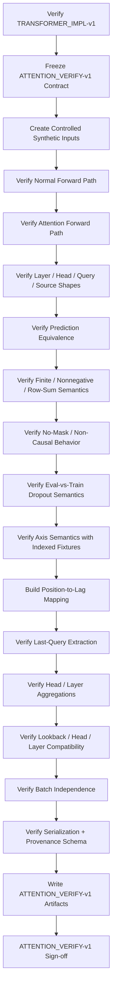
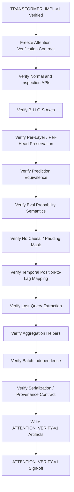

<div align="center">

# PHASE 17 — ATTENTION-AWARE ENCODER VERIFICATION

## Kế hoạch kiểm chứng tính đúng đắn của attention-aware Transformer Encoder trước khi sử dụng cho huấn luyện và phân tích attention

### UCI Appliances Energy Prediction — Sequence-to-One, One-Step-Ahead Forecasting

**Phase kế tiếp sau `Phase_16_Transformer_implementation.md`**

</div>

---

# 1. Vai trò của Phase 17

Phase 17 chịu trách nhiệm **kiểm chứng** rằng attention-aware Transformer Encoder được xây ở Phase 16 thực sự:

```text
trả đúng attention tensor

giữ nguyên thông tin từng head

giữ đúng thứ tự từng encoder layer

không bật causal mask ngoài ý muốn

không có padding mask ngoài ý muốn

không làm thay đổi prediction semantics

không làm sai tensor axes

không làm mất relation giữa attention position và temporal lag

không tạo attention artifact không thể truy vết
```

Phase 16 trả lời:

> Model attention-aware đã được implement như thế nào?

Phase 17 phải trả lời:

> Implementation đó có thực sự đúng với contract mà các Phase 21 và 52–57 sẽ dựa vào hay không?

Nguyên tắc cốt lõi:

\[
\boxed{
Shape
+
Semantics
+
Probability\ Sanity
+
Path\ Equivalence
+
Temporal\ Mapping
+
Traceability
}
\]

---

# 2. Tại sao Phase 17 phải tách riêng Phase 16?

Việc một class:

```text
chạy được
```

không đồng nghĩa:

```text
attention weights trả về đúng

head axis đúng

layer order đúng

query/key axes đúng

mask policy đúng

attention analysis sau này hợp lệ.
```

Một lỗi nhỏ ở đây có thể làm toàn bộ:

```text
Phase 53 — heatmaps

Phase 54 — last-query attention

Phase 55 — head comparison

Phase 56 — error-conditioned attention

Phase 57 — seed-stability attention
```

sai về interpretation dù model prediction vẫn chạy bình thường.

---

# 3. Mục tiêu cần đạt sau Phase 17

Sau Phase 17 phải có:

```text
1. ATTENTION_VERIFY-v1 contract.

2. Verification của standard forward path.

3. Verification của attention-inspection path.

4. Prediction equivalence giữa hai paths.

5. Per-layer attention collection verification.

6. Per-head attention preservation verification.

7. Attention tensor shape [B,H,L,L].

8. Layer-axis semantics được khóa.

9. Head-axis semantics được khóa.

10. Query-axis semantics được khóa.

11. Source/key-axis semantics được khóa.

12. Attention row-sum sanity trong eval mode.

13. Attention non-negativity sanity trong eval mode.

14. Attention finite-value sanity.

15. Attention no-NaN/no-Inf guard.

16. Không average heads trong source extraction.

17. Không average layers trong source extraction.

18. average_attn_weights=False được xác minh.

19. need_weights=False trên normal path.

20. need_weights=True trên inspection path.

21. is_causal=False được xác minh.

22. attn_mask=None được xác minh.

23. key_padding_mask=None được xác minh.

24. Upper-triangle accessibility smoke test.

25. No-padding behavior verification.

26. Attention dropout/eval-mode semantics được xác minh.

27. Train-mode attention không được dùng cho interpretation.

28. Positional sequence order được xác minh.

29. Position-to-lag mapping được khóa.

30. Last-query index = L-1 được xác minh.

31. Last-query attention shape [B,H,L].

32. Last-query source lag mapping được xác minh.

33. Head averaging helper được kiểm chứng.

34. Layer averaging helper được kiểm chứng.

35. Aggregation không mutate source attention.

36. Different lookback attention shapes được kiểm chứng.

37. Different head counts được kiểm chứng.

38. Different layer counts được kiểm chứng.

39. Batch-size independence được kiểm chứng.

40. Attention path state_dict round-trip được kiểm chứng.

41. Same-seed inspection determinism trong eval.

42. Attention result serialization schema.

43. Attention provenance schema.

44. Attention verification test suite.

45. Attention verification discrepancies.

46. ATTENTION_VERIFY-v1 manifest.

47. Phase 17 sign-off.
```

---

# 4. Những việc Phase 17 không làm

Phase 17 không:

```text
Không train Transformer trên dataset.

Không tính Validation RMSE chính thức.

Không chọn hyperparameter.

Không chọn head “tốt nhất”.

Không diễn giải head nào quan trọng hơn.

Không tạo scientific attention heatmap cuối cùng.

Không phân tích attention theo high/low error.

Không so attention giữa seeds cuối.

Không tính Test attention.

Không mở Test targets.

Không kết luận attention là feature importance.

Không kết luận attention là causal explanation.

Không thay architecture để attention nhìn đẹp hơn.
```

Phase này chỉ:

```text
verify mechanics and semantics.
```

---

# 5. Input contract

Phase 17 chỉ bắt đầu khi:

```text
Phase 16 = PASS
```

và phải có:

```text
TRANSFORMER_IMPL-v1

TRANSFORMER-v1

transformer_attention_contract.json

transformer_shape_contract.json

transformer_reference_config.json

transformer_implementation_manifest.json

transformer_unit_tests.csv
```

Ngoài ra truy ngược được:

```text
WINDOWS-v1
WINDOWPOP-v1
DATALOADERS-v1
EXPERIMENTS-v1
```

để khóa temporal/sample semantics cho các phase sau.

---

# 6. Output version

Gán:

```text
ATTENTION_VERIFY-v1
```

Lineage:

```text
TRANSFORMER_IMPL-v1
        ↓
ATTENTION_VERIFY-v1
```

Từ Phase 21 trở đi, attention-aware model chỉ được dùng nếu:

```text
ATTENTION_VERIFY-v1 = PASS.
```

---

# 7. Verification target

Phase 17 kiểm chứng ba tầng:

```text
TIER A — API correctness

TIER B — numerical/mechanical attention correctness

TIER C — temporal interpretation contract
```

---

# 8. TIER A — API correctness

Kiểm:

```text
forward(x)
→ prediction [B,1]

forward_with_attention(x)
→ prediction [B,1]
→ attention list
```

và normal path không yêu cầu attention weights.

---

# 9. TIER B — numerical/mechanical correctness

Kiểm:

```text
shape

finite

non-negative

row normalization in eval

head preservation

layer ordering

mask policy

prediction equivalence.
```

---

# 10. TIER C — temporal interpretation contract

Kiểm:

```text
position 0 = oldest

position L-1 = newest history

last query = index L-1

source axis = historical positions

position → lag mapping exact.
```

---

# 11. Canonical attention tensor

Với self-attention batched và:

```text
average_attn_weights=False
```

mỗi encoder layer phải trả:

\[
\boxed{
A^{(\ell)}
\in
\mathbb{R}^{B\times H\times L\times L}
}
\]

---

# 12. Axis semantics

Canonical:

```text
axis 0
→ batch/sample

axis 1
→ attention head

axis 2
→ query position

axis 3
→ source/key position.
```

---

# 13. Không được đảo query và source axes

Sai phổ biến:

```text
A[..., source, query]
```

được diễn giải như:

```text
A[..., query, source].
```

Phase 17 phải khóa convention:

\[
A[b,h,q,s]
\]

nghĩa:

> Tại sample `b`, head `h`, query position `q` phân bổ attention tới source/key position `s`.

---

# 14. Self-attention square matrix

Vì:

```text
query
key
value
```

cùng sequence:

\[
L_q=L_s=L
\]

nên mỗi head có matrix:

\[
L\times L.
\]

---

# 15. Attention collection theo layers

Nếu:

```text
N = num_layers
```

model trả:

```text
attention_list
```

với:

```text
len(attention_list) = N.
```

---

# 16. Layer ordering

Hard contract:

```text
attention_list[0]
→ encoder layer 0

attention_list[1]
→ encoder layer 1

...

attention_list[N-1]
→ final encoder layer.
```

Không reorder theo:

```text
entropy
magnitude
head importance.
```

---

# 17. Head ordering

Head index:

```text
0 ... H-1
```

được giữ nguyên theo native order của PyTorch MultiheadAttention.

Không reorder.

---

# 18. Source attention không được average head

Canonical source artifact:

```text
per-head.
```

Không lưu ngay:

\[
\frac{1}{H}\sum_h A_h
\]

thay cho source tensor.

---

# 19. Source attention không được average layer

Tương tự.

Aggregation chỉ tạo:

```text
derived view.
```

---

# 20. Normal forward path contract

`forward(x)` phải sử dụng layer attention calls với:

```text
need_weights=False.
```

Mục tiêu:

```text
prediction only

no unnecessary attention tensor allocation.
```

PyTorch hiện khuyến nghị `need_weights=False` khi không cần attention weights để có thể sử dụng optimized scaled-dot-product-attention path khi phù hợp.

---

# 21. Inspection path contract

`forward_with_attention(x)` phải sử dụng:

```text
need_weights=True

average_attn_weights=False.
```

---

# 22. `average_attn_weights=False` là hard requirement

Nếu accidentally True:

returned shape sẽ trở thành:

```text
[B,L,L]
```

thay vì:

```text
[B,H,L,L].
```

Điều này làm Phase 55 không thể so heads.

---

# 23. Attention path không phải model khác

Inspection path phải dùng:

```text
same model object

same trained parameters

same projection

same positional encoding

same encoder layers

same pooling

same regression head.
```

Chỉ khác:

```text
có request attention weights.
```

---

# 24. Prediction equivalence là core test

Trong:

```text
model.eval()

same x
```

so:

```text
y_standard = model(x)

y_attention, A = model.forward_with_attention(x)
```

Expected:

\[
y_{standard}
\approx
y_{attention}
\]

---

# 25. Không yêu cầu bitwise equality

Do PyTorch có thể đi qua:

```text
optimized attention path
```

khác khi:

```text
need_weights=False
```

so với:

```text
need_weights=True.
```

Do đó verification dùng:

```text
torch.testing.assert_close
```

với explicit tolerance.

---

# 26. Baseline CPU float32 tolerance

Khuyến nghị initial CPU synthetic verification:

```text
rtol = 1e-5

atol = 1e-6.
```

Không hard-code tolerance universal cho mọi backend nếu Phase 18 cho thấy active device cần documented tolerance khác.

---

# 27. Tolerance phải log

Artifact test phải ghi:

```text
atol

rtol

max_abs_diff

max_rel_diff

status.
```

---

# 28. Prediction equivalence failure

Nếu difference lớn hơn tolerance:

```text
FAIL.
```

Không chấp nhận:

> attention mode hơi khác model thường cũng được.

Vì attention analysis phải phản ánh cùng predictive model.

---

# 29. Eval mode bắt buộc cho inspection verification

Dùng:

```text
model.eval()
```

và:

```text
torch.inference_mode()
```

hoặc `no_grad`.

Lý do:

```text
dropout off

deterministic attention view

no graph retention

lower memory.
```

---

# 30. Attention dropout semantics

`nn.MultiheadAttention(dropout=p)` áp dropout lên:

```text
attention output weights
```

khi module ở training mode.

Do đó attention weights dùng cho interpretation phải lấy khi:

```text
model.eval().
```

---

# 31. Train-mode attention không phải source cho scientific analysis

Không dùng:

```text
attention weights từ model.train()
```

để tạo heatmaps cuối cùng.

Vì dropout làm map stochastic và row sums có thể không còn đúng dạng probability-normalized sau dropout.

---

# 32. Eval attention normalization

Trong eval mode với:

```text
no masks
no attention dropout
```

attention weights sau softmax phải có:

\[
A_{b,h,q,s}\ge0
\]

và:

\[
\sum_{s=1}^{L}A_{b,h,q,s}
\approx1
\]

cho mỗi:

```text
b,h,q.
```

---

# 33. Row-sum test

Compute:

```text
row_sums = attention.sum(dim=-1)
```

Expected shape:

```text
[B,H,L].
```

Expected:

```text
allclose(row_sums, ones).
```

---

# 34. Row-sum tolerance

Khuyến nghị CPU float32:

```text
atol = 1e-5

rtol = 1e-5.
```

Active-device tolerance có thể được Phase 18 xác minh thêm.

---

# 35. Non-negativity test

Eval attention:

```text
min_attention >= -numerical_tolerance.
```

Khuyến nghị:

```text
>= -1e-7
```

cho float32 sanity.

Không clamp negatives để làm test pass.

---

# 36. Upper bound test

Trong eval/no-mask/no-dropout, attention probability weights thường:

\[
A\le1
\]

within numerical tolerance.

Check:

```text
max_attention <= 1 + tolerance.
```

---

# 37. Finite-value test

Hard:

```text
torch.isfinite(attention).all()
```

Nếu:

```text
NaN
Inf
```

→ FAIL.

---

# 38. Zero-sum row bị cấm

Mỗi query phải distribute attention over all valid source positions.

No-mask baseline:

```text
row sum ≈ 1.
```

Zero rows:

```text
FAIL.
```

---

# 39. Attention entropy chỉ là mechanical diagnostic ở Phase 17

Có thể tính:

\[
H(A)
=
-\sum_s p_s\log p_s
\]

để kiểm finite/aggregation helpers.

Nhưng Phase 17 **không diễn giải**:

```text
high entropy = good/bad
low entropy = important.
```

---

# 40. Normalized entropy optional helper

Có thể define:

\[
H_{norm}
=
\frac{H(A)}{\log L}
\]

range approximately:

```text
0 ... 1
```

cho valid distribution.

Chỉ verify helper.

Scientific use later.

---

# 41. Entropy epsilon policy

Nếu helper dùng log:

```text
clamp_min(torch.finfo(dtype).tiny)
```

hoặc safe masking.

Không thay source attention tensor.

---

# 42. Attention source tensor immutable by convention

Derived computations:

```text
row sums

entropy

averages

last-query slices
```

không được mutate source `A`.

---

# 43. Clone có bắt buộc không?

Không nếu operations non-inplace.

Cấm:

```text
attention /= ...

attention.clamp_(...)

attention[...] = ...
```

trên source tensor trước save/analysis.

---

# 44. Mask policy verification

TRANSFORMER-v1 baseline khóa:

```text
attn_mask = None

key_padding_mask = None

is_causal = False.
```

Phase 17 phải verify cả:

```text
configuration
và
observable behavior.
```

---

# 45. Không chỉ tin config JSON

Nếu manifest nói:

```text
is_causal=False
```

nhưng code path truyền:

```text
True
```

thì config alone không đủ.

Phase 17 cần behavioral smoke tests.

---

# 46. No-causal-mask behavioral smoke test

Với random bounded synthetic input ở eval:

```text
attention matrix
```

nên có nonzero attention mass cả:

```text
trên
và dưới
main diagonal.
```

Nếu strict causal mask đang active, upper-triangle query→later-source weights sẽ bằng zero.

---

# 47. Upper triangle definition

Với matrix:

```text
[q,s]
```

upper triangle:

```text
s > q.
```

Đây là:

> query tại historical position sớm attend tới historical position muộn hơn trong cùng input window.

Current encoder cho phép điều này.

---

# 48. Upper-triangle mass test

For selected synthetic layer/head:

\[
M_{upper}
=
\sum_{s>q}A[q,s]
\]

Expected:

```text
> small positive threshold
```

trong no-mask random bounded test.

---

# 49. Vì sao test bằng bounded random input?

Để tránh extreme logits gây underflow gần zero ngoài ý muốn.

Use small-amplitude finite synthetic tensor.

---

# 50. Upper-triangle threshold không phải scientific metric

Chỉ:

```text
mechanical mask smoke test.
```

Không dùng để interpret model after training.

---

# 51. Stronger causal-mask test

Có thể compare:

```text
no-mask reference MHA behavior
```

trên tiny controlled synthetic layer nếu implementation exposes same module.

Không cần private PyTorch internals.

---

# 52. No padding mask behavioral implication

Vì tất cả positions đều valid:

```text
source positions đều được phép nhận attention.
```

Không có forced-zero columns do padding.

---

# 53. All-zero source-column test

Trong bounded random no-mask eval:

```text
không source column nào nên luôn zero trên mọi query/head
```

do mask.

Nếu có:

```text
investigate.
```

Không dùng đây như hard mathematical theorem nếu floating underflow extreme; bounded test giải quyết phần lớn.

---

# 54. Padding mask remains unnecessary

Reason inherited from Phase 10:

```text
fixed-length windows

gaps rejected

no padded samples.
```

---

# 55. Causal mask remains unnecessary

Reason inherited from forecasting contract:

```text
entire X window is historical relative to target.
```

No target row enters encoder.

---

# 56. Attention verification không được dùng target values

Phase 17 synthetic attention test:

```text
không cần y.
```

Do đó không có lý do truy cập Test target.

---

# 57. Temporal sequence semantics

Phase 10 locks:

```text
x[:,0,:]
→ oldest historical row

x[:,-1,:]
→ most recent historical row.
```

Phase 17 must preserve this interpretation.

---

# 58. Position-to-lag formula

For a lookback:

\[
L
\]

with horizon:

\[
H=1
\]

and position:

\[
p\in\{0,\dots,L-1\}
\]

lag from target is:

\[
\boxed{
lag\_steps=L-p
}
\]

---

# 59. Lag in minutes

Sampling:

```text
10 minutes.
```

Therefore:

\[
\boxed{
lag\_minutes
=
10(L-p)
}
\]

---

# 60. L144 mapping

For:

```text
L=144
```

```text
position 0
→ lag 144 steps
→ 1440 min
→ 24h before target

position 143
→ lag 1 step
→ 10 min before target.
```

---

# 61. L72 mapping

```text
position 0
→ 12h before target

position 71
→ 10m before target.
```

---

# 62. L36 mapping

```text
position 0
→ 6h before target

position 35
→ 10m before target.
```

---

# 63. Attention position mapping artifact

Tạo:

```text
attention_position_mapping.csv
```

Fields:

```text
lookback_id

lookback_steps

position_index

lag_steps_from_target

lag_minutes_from_target

lag_hours_from_target

relative_role
```

---

# 64. `relative_role`

Examples:

```text
OLDEST_CONTEXT

INTERMEDIATE_CONTEXT

MOST_RECENT_CONTEXT
```

Không cần label mỗi row quá phức tạp.

---

# 65. Last-query semantics

Last query:

```text
query index = L-1.
```

Đây là encoded representation tại:

```text
most recent historical position.
```

---

# 66. Last-query attention extraction

Per layer:

```text
A[:, :, -1, :]
```

Shape:

\[
\boxed{
[B,H,L]
}
\]

---

# 67. Last-query source axis

Index:

```text
0 ... L-1
```

trong last-query vector map sang:

```text
oldest → most recent source histories.
```

---

# 68. Last-query source lag

Source position `s`:

\[
lag\_steps=L-s
\]

regardless query position because lag measured relative to forecast target.

---

# 69. Why Phase 54 focuses on last query

Reference pooling:

```text
LAST_STEP
```

uses final encoded position:

```text
Z[:,-1,:]
```

directly for regression.

Therefore attention into last query is a particularly relevant mechanical view.

Nhưng không được nói:

> chỉ last query attention mới quyết định prediction.

Do multi-layer residual/FFN interactions phức tạp hơn.

---

# 70. Mean-pooling model nuance

Nếu Phase 27 chọn:

```text
MEAN
```

thì final prediction uses all query positions.

Attention analysis later phải adapt:

```text
full/aggregated query attention
```

và không ưu tiên last query như sole path.

Phase 17 phải document nuance này.

---

# 71. Pooling-aware attention metadata

Attention extraction artifact sau này phải log:

```text
pooling_type.
```

---

# 72. Last-query helper

Implement:

```text
extract_last_query_attention(attention)
```

Input:

```text
[B,H,L,L]
```

Output:

```text
[B,H,L].
```

---

# 73. Last-query helper shape test

Hard:

```text
result.ndim == 3

result.shape == [B,H,L].
```

---

# 74. Last-query helper exact test

Synthetic indexed tensor:

```text
A[b,h,q,s]
```

with distinguishable values.

Verify helper returns exactly:

```text
q = L-1.
```

---

# 75. Head-mean helper

Derived:

```text
mean_over_heads(A)
```

Input:

```text
[B,H,L,L]
```

Output:

```text
[B,L,L].
```

---

# 76. Head-mean helper semantics

\[
\bar A_{head}
=
\frac{1}{H}\sum_h A_h
\]

Only a derived visualization/statistical view.

Source per-head tensor retained.

---

# 77. Layer-mean helper

Given list/stack:

```text
[N,B,H,L,L]
```

Output if averaging layers:

```text
[B,H,L,L].
```

Again derived only.

---

# 78. Head-and-layer average helper

If needed later:

```text
[B,L,L].
```

But Phase 17 chỉ unit-test utility, not scientific default.

---

# 79. Averaging preserves row sums

If each attention row sums to 1:

```text
simple mean across heads/layers
```

also row-sums approximately 1.

Can be used as helper sanity test.

---

# 80. Aggregation order

Mean over head then layer equals layer then head mathematically for simple arithmetic mean.

Can unit-test.

---

# 81. No weighted head averaging baseline

Không assign:

```text
head importance weights
```

Phase 17.

---

# 82. Attention entropy helper shape

For per-head full attention:

```text
entropy over source axis
```

gives:

```text
[B,H,L_query].
```

---

# 83. Last-query entropy shape

```text
[B,H].
```

Useful later but no interpretation now.

---

# 84. Attention max-source helper

Could define:

```text
argmax over source axis
```

return:

```text
[B,H,L_query]
```

or last-query:

```text
[B,H].
```

Phase 17 can verify indices valid.

---

# 85. Do not use argmax alone for final interpretation

Attention distributions can be diffuse.

Argmax is only one summary.

---

# 86. Different lookback verification

Required:

```text
L36
→ A [B,H,36,36]

L72
→ A [B,H,72,72]

L144
→ A [B,H,144,144].
```

---

# 87. Different head-count verification

```text
H2
→ second dimension = 2

H4
→ second dimension = 4.
```

---

# 88. Different layer-count verification

```text
N1
→ list length 1

N2
→ list length 2.
```

---

# 89. Batch-size verification

```text
B1
B7
B32
B64
```

attention first dimension follows actual batch size.

No assumption full batch.

---

# 90. Feature-count independence

Attention shape depends on:

```text
B,H,L
```

not raw F after projection.

Different valid feature variants should still yield same attention shape if:

```text
same B,H,L.
```

---

# 91. d_model effect

Attention weight shape does not expose:

```text
d_model.
```

But config must log d_model/head dimension because semantics/model capacity differ.

---

# 92. Head dimension audit

\[
d_{head}
=
d_{model}/H
\]

Record in verification summary.

---

# 93. Reference B0 attention shape

For:

```text
B=64
H=4
L=144
N=2
```

per layer:

```text
[64,4,144,144].
```

Attention list:

```text
2 tensors.
```

Do not need allocate B64 for every verification if memory concern; structural B2/B4 synthetic tests may be sufficient, while B64 smoke can run if environment supports.

---

# 94. Memory-aware verification

Use small batch for expensive attention tests:

```text
B=2
or
B=4
```

because attention mechanics independent of production B64.

Then separate shape smoke for B64 if feasible.

---

# 95. No OOM heroics

Nếu B64 attention inspection unnecessary causes memory issue:

```text
do not change model
```

Use smaller inspection batch.

Training path still B64 because no attention weights returned.

---

# 96. Training vs inspection memory difference

Normal path:

```text
need_weights=False
```

Inspection path:

```text
materializes per-head attention matrices.
```

Therefore attention batch size later may be lower than training batch size.

This does **not** change model predictions/sample semantics.

---

# 97. Attention extraction batch size is engineering parameter

Phase 52 may use:

```text
attention_batch_size
```

different from training batch size.

Must not call it model hyperparameter.

---

# 98. Batch-invariance verification supports smaller analysis batches

Same sample prediction/attention should be independent of which other samples share batch in eval.

This justifies smaller extraction batches.

---

# 99. Attention batch invariance — prediction

Same sample alone vs larger batch:

```text
prediction allclose.
```

---

# 100. Attention batch invariance — attention weights

Same sample alone vs larger batch:

```text
per-layer per-head attention allclose
```

in eval within tolerance.

This is a strong verification that no cross-batch mixing occurs.

---

# 101. Batch-order invariance — attention

Permute batch samples.

Expected:

```text
attention tensors permute on batch axis only.
```

---

# 102. Cross-sample independence

Self-attention must operate:

```text
within each sample sequence
```

not across batch dimension.

---

# 103. Same-seed model inspection determinism

Fixed environment, same seed, same config, same synthetic input, eval:

```text
predictions same

attention same
```

within tolerance.

---

# 104. Same model repeated inspection

Repeated:

```text
forward_with_attention
```

in eval/inference:

```text
same outputs.
```

---

# 105. Train-mode stochastic test

Repeated in:

```text
model.train()
```

with dropout > 0:

```text
outputs/attention may differ.
```

This is expected.

---

# 106. Train-mode row sums caveat

Do not hard assert:

```text
attention row sum = 1
```

after attention dropout in train mode.

Probability sanity tests belong:

```text
eval mode.
```

---

# 107. Why attention row sum may change under dropout

Attention pipeline conceptually:

```text
softmax probabilities

then dropout on attention weights
```

during training.

Dropout can zero/rescale entries.

Therefore returned weights are not the deterministic pre-dropout map used for interpretation.

---

# 108. Attention verification mode contract

Create enum/metadata:

```text
ATTENTION_VERIFY_EVAL
```

No other mode considered scientifically valid for Phase 17 probability checks.

---

# 109. `torch.inference_mode()` preferred for verification

Because:

```text
no gradient

less overhead

clear inference semantics.
```

---

# 110. Attention requires_grad expectation

Inside:

```text
torch.inference_mode()
```

returned attention should not require gradients.

Check:

```text
attn.requires_grad == False.
```

---

# 111. Training-path graph remains intact

Normal training path Phase 21 still supports backward.

Phase 17 does not detach any internal tensors in implementation.

---

# 112. Attention inspection path in training not required

No need to support differentiating loss through returned attention metadata as scientific feature.

Prediction graph correctness already Phase 16-tested.

---

# 113. Standard vs inspection execution timing

Optional engineering benchmark:

```text
prediction path ms/batch

attention path ms/batch.
```

Only to document overhead.

Not model-selection evidence.

---

# 114. Do not tune model based on attention extraction speed

No.

---

# 115. Attention serialization — raw format

For later phases, source attention is better stored in:

```text
.npz
.pt
```

or similar tensor-friendly format than CSV.

Phase 17 defines schema but does not save full real-dataset attention.

---

# 116. Why not CSV for full matrices?

Attention is high-dimensional:

```text
layer × sample × head × query × source.
```

CSV:

```text
huge
slow
loses shape metadata easily.
```

---

# 117. Recommended future raw attention artifact

Example:

```text
attention_<run_id>_<subset_id>.npz
```

with arrays:

```text
attention

sample_idx

layer_ids

head_ids

position_to_lag.
```

---

# 118. Source attention precision

Khuyến nghị save:

```text
float32
```

unless later numerical analysis requires float64.

Do not round.

---

# 119. Attention provenance

Every future attention artifact must store/reference:

```text
run_id

model_version

implementation_version

code_fingerprint

checkpoint_sha256

feature_variant_id

feature_fingerprint

lookback

horizon

pooling

num_layers

num_heads

d_model

sample IDs

split

population fingerprint

attention verification version.
```

---

# 120. Why checkpoint checksum is mandatory later

Attention map depends on learned weights.

Same architecture but different checkpoint:

```text
different attention.
```

---

# 121. Why seed is not enough

Same seed with:

```text
different training history
code
checkpoint
```

may differ.

Use exact checkpoint identity.

---

# 122. Attention artifact must not be detached from PredictionBundle provenance

Phase 56 joins:

```text
attention
```

to:

```text
errors/residuals
```

by:

```text
sample_idx.
```

Therefore sample IDs are mandatory.

---

# 123. No Test attention before Phase 47+

Phase 17 test firewall:

```text
no Test target
no Test prediction
no Test attention interpretation.
```

Structural model verification uses synthetic data.

---

# 124. Could Test inputs be processed without targets?

Không cần.

Để giữ firewall simple:

```text
do not access Test loader in Phase 17.
```

---

# 125. Synthetic input design

Use:

```text
finite

small amplitude

fixed seed

float32

batch-first

multiple L values.
```

---

# 126. Recommended synthetic distribution

Example:

```text
torch.randn(...) * 0.1
```

with fixed seed.

Small amplitude helps avoid extreme logits during mask-probability sanity.

---

# 127. Structured synthetic input test

Ngoài random input, tạo position-distinguishable tensor để verify:

```text
position ordering

last-query slicing.
```

Không dùng attention magnitude để infer known answer because model weights random.

---

# 128. Indexed synthetic attention fixture

For helper tests, do **not** rely on model-produced attention.

Create artificial tensor:

\[
A[b,h,q,s]
=
1000b+100h+10q+s
\]

or normalized equivalent.

Then verify axes/slices exactly.

---

# 129. Why artificial fixture?

Model-produced attention values không cho biết dễ dàng:

```text
axis nào bị swapped.
```

Indexed tensor gives exact deterministic axis tests.

---

# 130. Helper-test tensor không phải valid attention distribution

Nếu using integer-like fixture:

```text
chỉ dùng slicing/axis tests.
```

Không dùng row-sum probability tests.

---

# 131. Separate fixtures

Use:

```text
Fixture A:
indexed tensor
→ axis/slicing tests

Fixture B:
valid normalized synthetic attention
→ aggregation/entropy tests

Fixture C:
actual model attention
→ mechanics/path tests.
```

---

# 132. Query/source axis test with indexed fixture

Verify:

```text
A[..., q, :]
```

selects source vector for query q.

---

# 133. Source slice test

Verify:

```text
A[..., :, s]
```

selects attention received by source position s from all queries.

---

# 134. Last-query fixture test

Verify:

```text
A[..., -1, :]
```

not:

```text
A[..., :, -1].
```

These represent different things.

---

# 135. Important distinction

```text
A[..., -1, :]
```

= last query attends to all sources.

```text
A[..., :, -1]
```

= all queries attend to most recent source.

Phase 54 needs the first.

---

# 136. Attention received vs attention assigned

Do not confuse:

```text
row
→ attention distribution assigned by query

column
→ attention mass received by source across queries.
```

---

# 137. Heatmap orientation contract

For future plots:

```text
rows/y-axis = query positions

columns/x-axis = source/key positions.
```

Phase 17 freezes this.

---

# 138. Temporal axis labels

Future source x-axis can label:

```text
-24h ... -10m
```

for L144.

Query y-axis similarly maps to historical position lags.

---

# 139. Lag sign convention

Khuyến nghị display:

```text
-1440 min
...
-10 min
```

relative to target.

Machine-readable artifact can use:

```text
positive lag_minutes_from_target = 1440 ... 10.
```

Do not mix signs silently.

---

# 140. Machine-readable lag convention

Canonical field:

```text
lag_minutes_from_target
```

is **positive magnitude**:

```text
1440
...
10.
```

Display label:

```text
t-1440m
...
t-10m.
```

---

# 141. Last-query label

Canonical:

```text
MOST_RECENT_QUERY

lag_steps = 1

lag_minutes = 10.
```

---

# 142. Query position mapping artifact

Same `attention_position_mapping.csv` can map both query/source indices because both share same historical sequence.

---

# 143. Attention row normalization helper

Implement:

```text
compute_attention_row_sums()
```

No normalization/mutation.

---

# 144. Attention validity helper

Implement:

```text
validate_attention_probabilities_eval(...)
```

Checks:

```text
finite

nonnegative

<=1 tolerance

row sums ~1.
```

---

# 145. Attention shape helper

Implement:

```text
validate_attention_shape(
    attention,
    batch_size,
    num_heads,
    sequence_length,
)
```

---

# 146. Attention collection helper

Implement:

```text
validate_attention_collection(
    attention_list,
    num_layers,
    ...
)
```

---

# 147. Attention equivalence helper

Implement:

```text
compare_prediction_paths(...)
```

Returns:

```text
max_abs_diff

max_rel_diff

allclose status.
```

---

# 148. No-mask helper

Implement mechanical:

```text
measure_upper_triangle_mass(...)
```

for synthetic no-mask smoke.

---

# 149. Head averaging helper

Implement:

```text
average_attention_heads(...)
```

without modifying source.

---

# 150. Layer averaging helper

Implement:

```text
average_attention_layers(...)
```

---

# 151. Last-query helper

Implement:

```text
extract_last_query_attention(...)
```

---

# 152. Position mapper

Implement:

```text
build_attention_position_mapping(
    lookback,
    sampling_minutes=10,
    horizon=1,
)
```

---

# 153. Horizon guard

Current mapper only supports:

```text
H1.
```

If future H changes:

```text
formula generalized or verification version updated.
```

---

# 154. General lag formula

For target at:

```text
t + H
```

if input ends at t, position p:

\[
lag\_steps
=
H+(L-1-p)
\]

For current:

\[
H=1
\]

this becomes:

\[
L-p.
\]

---

# 155. Why record generalized formula?

Prevents later confusion if coursework extension changes horizon.

But ATTENTION_VERIFY-v1 still locks:

```text
H=1.
```

---

# 156. `average_attn_weights` verification strategy

Do not only inspect config.

Behavioral test:

```text
attention.ndim must be 4

head dimension must equal H > 1.
```

If shape `[B,L,L]`:

```text
FAIL immediately.
```

---

# 157. Head identity preservation test

With H4:

```text
attention[:,0]
attention[:,1]
attention[:,2]
attention[:,3]
```

must all exist as separate tensors/slices.

Do not require them numerically different for every random seed, but likely they are.

Structural presence is requirement.

---

# 158. Optional head-nonidentity smoke

For random initialized model, check not all heads are exactly equal.

If all exactly equal:

```text
warning/investigate parameter sharing.
```

Not a universal hard theorem, but exact equality is suspicious.

---

# 159. Parameter-sharing cross-check

Phase 16 already tests encoder layers not shared.

Phase 17 can additionally verify:

```text
head-specific projection slices
```

exist within MHA parameter matrix dimensions.

No need private semantics beyond public parameter shapes.

---

# 160. MHA projection shape audit

For standard same-dim MHA:

```text
in_proj_weight
```

typically shape:

```text
[3*d_model,d_model].
```

This is implementation detail visible in public module parameters but not central scientific contract.

Use as informational audit, not fragile hard dependency across future PyTorch redesigns.

---

# 161. Prefer behavior over internal parameter layout

Core PASS criteria should rely on:

```text
public outputs
public config
attention shapes
numerical semantics.
```

Not private internals.

---

# 162. Attention row sums and floating precision

Use:

```text
float32 tolerances.
```

Do not convert attention to rounded CSV then test row sums.

Test raw tensor.

---

# 163. Attention test on CPU first

Phase 17 canonical verification:

```text
CPU float32
```

is recommended to reduce backend-specific variability.

---

# 164. Active-device verification deferred to Phase 18

Phase 18 will ensure:

```text
selected CUDA/MPS/CPU
```

can execute actual batches.

Do not duplicate full hardware test here.

---

# 165. Optional active-device attention smoke

If desired and available:

```text
one small synthetic batch
```

may be tested.

But CPU PASS remains implementation reference.

---

# 166. MPS/CUDA tolerance may differ

Record separately.

Do not loosen global tolerance solely to accommodate one backend without documentation.

---

# 167. Attention inspection under autocast

Current baseline:

```text
mixed_precision=False.
```

Do not verify autocast semantics Phase 17.

---

# 168. No NestedTensor

Baseline uses:

```text
dense fixed-length tensor.
```

Do not introduce NestedTensor fastpath.

---

# 169. No padding-aware fastpath

Not needed.

---

# 170. No FlashAttention-specific assumptions

PyTorch may select optimized backend internally.

ATTENTION_VERIFY-v1 is backend-agnostic.

---

# 171. Attention path may disable some fastpaths

That is acceptable.

Verification goal:

```text
semantic correctness.
```

Not maximum throughput.

---

# 172. No performance-based PASS criteria

Attention inspection being slower does not fail scientific verification.

Only unacceptable if:

```text
memory/runtime makes required analysis impossible
```

under reasonable small batches.

---

# 173. Memory estimate artifact

Can include formula:

\[
Elements
=
N\times B\times H\times L^2
\]

for all layer maps in a batch.

Bytes float32:

\[
Bytes=4\times Elements.
\]

---

# 174. Reference B0 attention-weight memory per inspection batch

For:

```text
N=2
B=64
H=4
L=144
```

elements:

\[
2\times64\times4\times144^2
=
10,616,832.
\]

Raw float32 weights alone approximately:

\[
42,467,328\ bytes
\approx40.5\ MiB.
\]

This excludes:

```text
other activations
model memory
framework overhead.
```

Hence smaller attention-extraction batches are reasonable.

---

# 175. B4 reference inspection memory

For:

```text
N2
B4
H4
L144
```

raw attention weights approximately:

\[
2\times4\times4\times144^2\times4
=
2,654,208\ bytes
\approx2.53\ MiB.
\]

Good for verification.

---

# 176. Memory calculation is estimate

Runtime actual memory differs.

Do not report estimate as measured memory.

---

# 177. Attention extraction batch recommendation

Phase 17 synthetic:

```text
B2/B4 preferred.
```

Phase 52 later chooses extraction batch after profiling.

---

# 178. Probability verification fixture

Recommended:

```text
B=2

L=12 or 16

D=32

H=4

N=2

dropout=0.1 but model.eval().
```

Small enough for fast exhaustive checks.

---

# 179. Why L12/L16 for basic checks?

Mechanics are same.

Use L36/L72/L144 separately for shape compatibility.

---

# 180. No scientific interpretation on random initialization

Attention maps from random model are meaningless scientifically.

Phase 17 only checks mathematical mechanics.

---

# 181. Do not plot “interesting” random attention

No need.

At most optional diagnostic matrix to verify orientation.

Not final artifact requirement.

---

# 182. Heatmap orientation diagnostic optional

If generated, label clearly:

```text
SYNTHETIC IMPLEMENTATION TEST — NOT MODEL RESULT.
```

---

# 183. Verification test categories

```text
API

SHAPE

AXES

PROBABILITY

MASK

DROPOUT

EQUIVALENCE

TEMPORAL_MAPPING

AGGREGATION

BATCH_INDEPENDENCE

LOOKBACK_COMPATIBILITY

CONFIG_COMPATIBILITY

SERIALIZATION

PROVENANCE
```

---

# 184. Test AV17-001

Normal forward returns:

```text
[B,1].
```

---

# 185. Test AV17-002

Inspection forward returns:

```text
prediction [B,1]
attention list.
```

---

# 186. Test AV17-003

Attention list length:

```text
num_layers.
```

---

# 187. Test AV17-004

Each attention shape:

```text
[B,H,L,L].
```

---

# 188. Test AV17-005

Head axis preserved.

---

# 189. Test AV17-006

Layer ordering preserved.

---

# 190. Test AV17-007

Query axis validated using indexed fixture.

---

# 191. Test AV17-008

Source axis validated using indexed fixture.

---

# 192. Test AV17-009

Last-query helper uses query axis, not source axis.

---

# 193. Test AV17-010

Attention finite in eval.

---

# 194. Test AV17-011

Attention non-negative within tolerance.

---

# 195. Test AV17-012

Attention max <= 1+tolerance.

---

# 196. Test AV17-013

Row sums ≈ 1 in eval.

---

# 197. Test AV17-014

No zero attention rows.

---

# 198. Test AV17-015

Normal and inspection prediction allclose.

---

# 199. Test AV17-016

`need_weights=False` normal path contract.

---

# 200. Test AV17-017

`need_weights=True` inspection path contract.

---

# 201. Test AV17-018

`average_attn_weights=False` behavioral shape.

---

# 202. Test AV17-019

`is_causal=False` config contract.

---

# 203. Test AV17-020

No attn mask config.

---

# 204. Test AV17-021

No key-padding mask config.

---

# 205. Test AV17-022

Upper triangle receives positive mass on bounded synthetic no-mask case.

---

# 206. Test AV17-023

No source column structurally masked in bounded synthetic case.

---

# 207. Test AV17-024

Eval repeated attention deterministic.

---

# 208. Test AV17-025

Train mode can be stochastic with dropout > 0.

---

# 209. Test AV17-026

Probability row-sum test only run in eval mode.

---

# 210. Test AV17-027

Attention requires_grad=False in inference mode.

---

# 211. Test AV17-028

Position mapping L36 correct.

---

# 212. Test AV17-029

Position mapping L72 correct.

---

# 213. Test AV17-030

Position mapping L144 correct.

---

# 214. Test AV17-031

L144 position 0 = 1440 min lag.

---

# 215. Test AV17-032

L144 position 143 = 10 min lag.

---

# 216. Test AV17-033

Last-query extraction shape [B,H,L].

---

# 217. Test AV17-034

Last-query source lag mapping correct.

---

# 218. Test AV17-035

Head mean shape [B,L,L].

---

# 219. Test AV17-036

Layer mean shape [B,H,L,L].

---

# 220. Test AV17-037

Head/layer aggregation does not mutate source.

---

# 221. Test AV17-038

Averaged attention row sums ≈ 1.

---

# 222. Test AV17-039

Aggregation order equivalence within tolerance.

---

# 223. Test AV17-040

Entropy helper finite.

---

# 224. Test AV17-041

Normalized entropy within expected numerical range for valid fixture.

---

# 225. Test AV17-042

B1 inspection works.

---

# 226. Test AV17-043

B4 inspection works.

---

# 227. Test AV17-044

Batch permutation reorders attention only on batch axis.

---

# 228. Test AV17-045

Sample-alone vs sample-in-batch attention allclose.

---

# 229. Test AV17-046

L36 attention shape correct.

---

# 230. Test AV17-047

L72 attention shape correct.

---

# 231. Test AV17-048

L144 attention shape correct.

---

# 232. Test AV17-049

H2 head shape correct.

---

# 233. Test AV17-050

H4 head shape correct.

---

# 234. Test AV17-051

N1 layer-list length correct.

---

# 235. Test AV17-052

N2 layer-list length correct.

---

# 236. Test AV17-053

D32/H2 compatible.

---

# 237. Test AV17-054

D32/H4 compatible.

---

# 238. Test AV17-055

D64/H2 compatible.

---

# 239. Test AV17-056

D64/H4 compatible.

---

# 240. Test AV17-057

Attention path survives state_dict round-trip.

---

# 241. Test AV17-058

Round-trip attention prediction matches pre-save model.

---

# 242. Test AV17-059

Wrong implementation/version metadata rejected by verifier.

---

# 243. Test AV17-060

Missing attention verification version rejected in future attention artifact schema.

---

# 244. Test AV17-061

Test split access not required/used.

---

# 245. Test AV17-062

Attention source artifact schema requires sample_idx.

---

# 246. Test AV17-063

Attention artifact schema requires checkpoint checksum.

---

# 247. Test AV17-064

Attention artifact schema requires pooling type.

---

# 248. Test AV17-065

Attention artifact schema requires layer/head counts.

---

# 249. Test AV17-066

Attention artifact schema requires lookback and lag mapping version.

---

# 250. Test AV17-067

Attention source tensor never head-averaged before serialization contract.

---

# 251. Test AV17-068

Attention source tensor never layer-averaged before serialization contract.

---

# 252. Verification pass tiers

Can group results:

```text
API_PASS

NUMERICAL_PASS

MASK_PASS

TEMPORAL_MAPPING_PASS

PROVENANCE_PASS.
```

Final:

```text
ATTENTION_VERIFY-v1 = PASS
```

only if all critical tiers pass.

---

# 253. Critical vs non-critical tests

Critical:

```text
shape

axes

per-head preservation

prediction equivalence

finite/nonnegative/row sums

mask policy

position mapping

last-query extraction

provenance schema.
```

Non-critical/diagnostic:

```text
entropy helper

performance timing

head nonidentity warning.
```

---

# 254. PASS_WITH_WARNING

Ví dụ:

```text
active-device attention path needs looser documented tolerance
```

while CPU canonical verification passes.

Or:

```text
inspection path slower than expected
```

but still feasible.

---

# 255. FAIL examples

```text
attention shape [B,L,L]

row sums invalid in eval

NaN attention

causal upper-triangle all zero unexpectedly

inspection predictions differ materially

last-query helper slices wrong axis

position mapping off by one

layer order wrong

source artifact schema lacks checkpoint identity.
```

---

# 256. Attention verification artifact directory

```text
artifacts/
└── attention_verification/
    ├── attention_verification_manifest.json
    ├── attention_verification_contract.json
    ├── attention_shape_audit.csv
    ├── attention_probability_audit.csv
    ├── attention_mask_audit.csv
    ├── attention_path_equivalence_audit.csv
    ├── attention_axis_audit.csv
    ├── attention_position_mapping.csv
    ├── attention_aggregation_audit.csv
    ├── attention_batch_independence_audit.csv
    ├── attention_serialization_schema.json
    ├── attention_provenance_schema.json
    ├── attention_verification_tests.csv
    ├── attention_verification_discrepancies.json
    ├── README_ATTENTION_VERIFICATION.md
    └── phase_17_signoff.json
```

---

# 257. Output O17.1 — Verification contract

```text
attention_verification_contract.json
```

---

# 258. Output O17.2 — Shape audit

```text
attention_shape_audit.csv
```

---

# 259. Output O17.3 — Probability audit

```text
attention_probability_audit.csv
```

---

# 260. Output O17.4 — Mask audit

```text
attention_mask_audit.csv
```

---

# 261. Output O17.5 — Path-equivalence audit

```text
attention_path_equivalence_audit.csv
```

---

# 262. Output O17.6 — Axis audit

```text
attention_axis_audit.csv
```

---

# 263. Output O17.7 — Position mapping

```text
attention_position_mapping.csv
```

---

# 264. Output O17.8 — Aggregation audit

```text
attention_aggregation_audit.csv
```

---

# 265. Output O17.9 — Batch-independence audit

```text
attention_batch_independence_audit.csv
```

---

# 266. Output O17.10 — Serialization schema

```text
attention_serialization_schema.json
```

---

# 267. Output O17.11 — Provenance schema

```text
attention_provenance_schema.json
```

---

# 268. Output O17.12 — Verification tests

```text
attention_verification_tests.csv
```

---

# 269. Output O17.13 — Manifest

```text
attention_verification_manifest.json
```

---

# 270. Output O17.14 — Discrepancy log

```text
attention_verification_discrepancies.json
```

---

# 271. Output O17.15 — README

```text
README_ATTENTION_VERIFICATION.md
```

---

# 272. Output O17.16 — Sign-off

```text
phase_17_signoff.json
```

---

# 273. Attention verification contract fields

Minimum:

```text
verification_version = ATTENTION_VERIFY-v1

transformer_implementation_version = TRANSFORMER_IMPL-v1

transformer_model_version = TRANSFORMER-v1

input_layout = B_L_F

attention_layout = B_H_Q_S

self_attention_expected = true

Q_equals_K_equals_V = true

need_weights_normal = false

need_weights_inspection = true

average_attn_weights = false

is_causal = false

attn_mask = none

key_padding_mask = none

attention_analysis_mode = EVAL

probability_row_axis = SOURCE

row_sum_expected = 1

source_tensor_aggregation = NONE

last_query_axis = QUERY

last_query_index = L_MINUS_1

lag_mapping_version

test_access = FORBIDDEN

status
```

---

# 274. Shape audit fields

```text
test_id

config_id

batch_size

lookback

d_model

num_heads

num_layers

layer_index

observed_shape

expected_shape

dtype

device

status
```

---

# 275. Probability audit fields

```text
test_id

layer_index

batch_size

num_heads

lookback

min_weight

max_weight

min_row_sum

max_row_sum

max_row_sum_abs_error

finite

nonnegative

upper_bound_valid

row_sum_valid

mode

status
```

---

# 276. Mask audit fields

```text
test_id

is_causal_config

attn_mask_config

key_padding_mask_config

upper_triangle_mass

lower_triangle_mass

zero_source_columns

bounded_input_used

status

notes
```

---

# 277. Path-equivalence audit fields

```text
test_id

config_id

batch_size

lookback

device

dtype

atol

rtol

max_abs_diff

max_rel_diff

allclose

status
```

---

# 278. Axis audit fields

```text
axis_name

axis_index

semantic_name

verification_fixture

slice_expression

expected_shape

observed_shape

status
```

---

# 279. Aggregation audit fields

```text
test_id

operation

input_shape

output_shape

source_mutated

row_sum_preserved

expected

actual

status
```

---

# 280. Batch-independence audit fields

```text
test_id

sample_reference_id

alone_batch_size

comparison_batch_size

prediction_max_abs_diff

attention_max_abs_diff

atol

rtol

status
```

---

# 281. Attention serialization schema minimum

Future attention artifact must include:

```text
artifact_version

run_id

checkpoint_sha256

attention_verification_version

model_version

implementation_version

code_fingerprint

split_id

sample_idx

lookback

horizon

sampling_minutes

pooling

num_layers

num_heads

d_model

attention_dtype

attention_shape

layer_order

head_order

query_axis

source_axis

position_mapping_reference

population_fingerprint

created_at
```

---

# 282. Attention provenance schema minimum

Must be able to trace:

```text
attention cell
→ layer
→ head
→ query position
→ source position
→ temporal lag
→ sample_idx
→ target timestamp
→ run_id
→ checkpoint
→ model config.
```

---

# 283. No anonymous attention arrays

Artifact named only:

```text
attention.npy
```

without metadata is invalid.

---

# 284. No screenshot-only attention evidence

Heatmap PNG alone is not source artifact.

Need underlying numeric attention data or reproducible extraction.

---

# 285. No manual matrix copy

Do not copy attention numbers by hand into report.

---

# 286. Verification discrepancies categories

```text
ATTENTION_SHAPE_ERROR

HEAD_AXIS_LOST

LAYER_ORDER_ERROR

QUERY_SOURCE_AXIS_SWAP

NONFINITE_ATTENTION

NEGATIVE_ATTENTION

ROW_SUM_ERROR

ATTENTION_PATH_MISMATCH

NEED_WEIGHTS_POLICY_ERROR

AVERAGED_HEADS_ERROR

CAUSAL_MASK_VIOLATION

PADDING_MASK_VIOLATION

UPPER_TRIANGLE_BLOCKED

DROPOUT_MODE_ERROR

POSITION_MAPPING_ERROR

LAST_QUERY_AXIS_ERROR

AGGREGATION_MUTATION

BATCH_CROSS_TALK

SERIALIZATION_SCHEMA_ERROR

PROVENANCE_SCHEMA_ERROR

VERSION_MISMATCH

OTHER
```

---

# 287. Discrepancy log fields

```text
id

severity

category

test_id

expected

actual

impact

recommended_action

resolved

resolution_notes
```

---

# 288. Severity

Suggested:

```text
CRITICAL

MAJOR

MINOR

INFO.
```

---

# 289. CRITICAL examples

```text
wrong attention axes

head averaging

causal mask unexpectedly active

prediction path mismatch

position mapping off-by-one.
```

---

# 290. MAJOR examples

```text
attention batch cross-talk

serialization missing checkpoint identity

row-sum failure.
```

---

# 291. MINOR examples

```text
performance overhead higher than expected

optional entropy helper tolerance issue.
```

---

# 292. INFO examples

```text
backend-specific tiny numerical differences within accepted tolerance.
```

---

# 293. Verification manifest

Tạo:

```text
attention_verification_manifest.json
```

Minimum fields:

```text
verification_version = ATTENTION_VERIFY-v1

transformer_implementation_version

transformer_model_version

torch_version

code_fingerprint

reference_config_id

canonical_device = cpu

canonical_dtype = float32

attention_layout = B_H_Q_S

normal_path_need_weights = false

inspection_path_need_weights = true

average_attn_weights = false

is_causal = false

attn_mask = none

key_padding_mask = none

eval_mode_required = true

row_sum_tolerance

prediction_equivalence_atol

prediction_equivalence_rtol

position_mapping_version

critical_tests_total

critical_tests_passed

warnings

audit_status

created_at
```

---

# 294. README content

`README_ATTENTION_VERIFICATION.md` phải giải thích:

```text
Why verification exists

Attention tensor axes

Layer/head ordering

Prediction-path equivalence

Eval-mode probability semantics

Dropout caveat

No-causal-mask rationale

Position-to-lag mapping

Last-query definition

Aggregation rules

Attention is not feature importance

Attention is not causal explanation

Artifact provenance requirements

Handoff to Phase 52–57.
```

---

# 295. Notebook structure Phase 17

Khuyến nghị:

```text
22–30 cells
```

## Cell 17.1 — Phase title

## Cell 17.2 — Verify TRANSFORMER_IMPL-v1

## Cell 17.3 — Declare ATTENTION_VERIFY-v1

## Cell 17.4 — Load reference Transformer config

## Cell 17.5 — Build bounded synthetic input

## Cell 17.6 — Standard forward API test

## Cell 17.7 — Attention forward API test

## Cell 17.8 — Attention shape/layer/head audit

## Cell 17.9 — Prediction path equivalence

## Cell 17.10 — Finite/nonnegative/upper-bound audit

## Cell 17.11 — Row-sum probability audit

## Cell 17.12 — Mask-policy structural audit

## Cell 17.13 — Upper-triangle no-causal smoke

## Cell 17.14 — Eval/train dropout semantics test

## Cell 17.15 — Indexed axis fixture

## Cell 17.16 — Query/source axis tests

## Cell 17.17 — Build position-to-lag mapping

## Cell 17.18 — Last-query helper tests

## Cell 17.19 — Head/layer aggregation tests

## Cell 17.20 — Entropy helper mechanical test

## Cell 17.21 — L36/L72/L144 tests

## Cell 17.22 — H2/H4 and N1/N2 tests

## Cell 17.23 — Batch permutation/independence tests

## Cell 17.24 — State-dict attention round-trip

## Cell 17.25 — Serialization/provenance schema tests

## Cell 17.26 — Test-firewall verification

## Cell 17.27 — Build audit tables

## Cell 17.28 — Save artifacts

## Cell 17.29 — Write manifest/README

## Cell 17.30 — Phase sign-off

---

# 296. Quy trình thực thi Phase 17



---

# 297. Function design khuyến nghị

```text
AttentionVerificationConfig

validate_attention_tensor()

validate_attention_collection()

validate_attention_probabilities_eval()

compare_prediction_paths()

measure_upper_triangle_mass()

extract_last_query_attention()

average_attention_heads()

average_attention_layers()

compute_attention_entropy()

compute_normalized_attention_entropy()

build_attention_position_mapping()

audit_attention_axes()

audit_batch_attention_independence()

validate_attention_serialization_metadata()

write_attention_verification_manifest()
```

---

# 298. Verification source-code organization

Recommended:

```text
src/
└── evaluation/
    └── attention_verification.py
```

or:

```text
src/
└── attention/
    ├── verification.py
    ├── mapping.py
    └── aggregation.py
```

Khuyến nghị:

```text
src/attention/
```

vì Phase 52–57 sẽ reuse utilities.

---

# 299. Không duplicate helpers ở Phase 53–57

Các helper đã verified:

```text
position mapping

last-query slice

head mean

layer mean

entropy
```

nên được reuse.

---

# 300. Source helper versioning

Có thể gán:

```text
ATTENTION_UTILS-v1
```

trong manifest nếu muốn trace rõ.

Không bắt buộc separate phase version.

---

# 301. Phase 17 sanity checklist

```text
[ ] Phase 16 PASS.

[ ] TRANSFORMER_IMPL-v1 verified.

[ ] TRANSFORMER-v1 verified.

[ ] ATTENTION_VERIFY-v1 declared.

[ ] Canonical CPU float32 verification environment recorded.

[ ] Normal forward returns [B,1].

[ ] Attention forward returns prediction + attention list.

[ ] Attention list length equals num_layers.

[ ] Every layer attention has [B,H,L,L].

[ ] Batch axis = 0.

[ ] Head axis = 1.

[ ] Query axis = 2.

[ ] Source/key axis = 3.

[ ] Query/source semantics verified with indexed fixture.

[ ] Last-query slice uses axis 2.

[ ] Source vector remains axis 3.

[ ] Per-head attention preserved.

[ ] No head averaging in source.

[ ] No layer averaging in source.

[ ] Normal path uses need_weights=False.

[ ] Inspection path uses need_weights=True.

[ ] Inspection path uses average_attn_weights=False.

[ ] Prediction path equivalence PASS.

[ ] Prediction max abs diff logged.

[ ] Prediction tolerances logged.

[ ] model.eval() used for probability verification.

[ ] inference_mode/no_grad used.

[ ] Attention finite.

[ ] Attention no NaN.

[ ] Attention no Inf.

[ ] Attention nonnegative within tolerance.

[ ] Attention <=1 within tolerance.

[ ] Attention row sums ≈1 in eval.

[ ] No zero attention rows.

[ ] is_causal=False verified.

[ ] attn_mask=None verified.

[ ] key_padding_mask=None verified.

[ ] Upper triangle has positive mass in bounded synthetic test.

[ ] No structurally zero source columns in bounded synthetic test.

[ ] Train-mode attention not used for interpretation.

[ ] Dropout caveat documented.

[ ] Attention requires_grad=False in inference verification.

[ ] Position 0 = oldest history.

[ ] Position L-1 = newest history.

[ ] Lag formula H+(L-1-p) documented.

[ ] Current H1 formula L-p verified.

[ ] L36 position mapping PASS.

[ ] L72 position mapping PASS.

[ ] L144 position mapping PASS.

[ ] L144 position 0 = 1440 min lag.

[ ] L144 position 143 = 10 min lag.

[ ] Last-query index = L-1.

[ ] Last-query shape = [B,H,L].

[ ] Last-query mapping PASS.

[ ] LAST_STEP pooling nuance documented.

[ ] MEAN pooling nuance documented.

[ ] Head mean helper PASS.

[ ] Layer mean helper PASS.

[ ] Aggregation does not mutate source.

[ ] Aggregated row sums preserved.

[ ] Entropy helper finite.

[ ] B1 inspection PASS.

[ ] B4 inspection PASS.

[ ] L36 attention shape PASS.

[ ] L72 attention shape PASS.

[ ] L144 attention shape PASS.

[ ] H2 attention shape PASS.

[ ] H4 attention shape PASS.

[ ] N1 list-length PASS.

[ ] N2 list-length PASS.

[ ] Batch permutation test PASS.

[ ] Sample-alone vs batched prediction PASS.

[ ] Sample-alone vs batched attention PASS.

[ ] Eval repeated inspection deterministic.

[ ] State-dict attention round-trip PASS.

[ ] Attention serialization schema defined.

[ ] Attention provenance schema defined.

[ ] run_id required in future artifacts.

[ ] checkpoint_sha256 required.

[ ] sample_idx required.

[ ] pooling required.

[ ] lookback required.

[ ] layer/head counts required.

[ ] population fingerprint required.

[ ] Test data not accessed.

[ ] Test targets not accessed.

[ ] Verification tests saved.

[ ] Discrepancies saved.

[ ] README saved.

[ ] Manifest saved.

[ ] ATTENTION_VERIFY-v1 sign-off completed.
```

---

# 302. Acceptance criteria

Phase 17 chỉ PASS khi:

```text
Inspection API exists and is stable.

Per-head, per-layer attention is preserved.

Attention axes are unambiguous.

Attention tensor has [B,H,L,L].

Prediction with/without attention extraction agrees in eval.

Attention is finite and probability-like in eval.

Attention row sums over source axis are approximately one.

No causal mask is active.

No padding mask is active.

Temporal position mapping is correct.

Last-query extraction is correct.

Aggregation helpers are verified and non-mutating.

Batch composition does not alter per-sample attention in eval.

State-dict reconstruction preserves inspection behavior.

Future attention artifacts have complete provenance schema.

Test remains untouched.
```

---

# 303. Khi nào Phase 17 FAIL?

```text
Attention returns [B,L,L] rather than [B,H,L,L].

Head axis is averaged away.

Layer list order is unknown.

Query/source axes are swapped.

Last-query helper slices last source column.

Row sums do not approach 1 in eval.

Attention contains NaN or Inf.

Strict causal pattern appears despite no-causal contract.

Inspection path materially changes prediction.

Same sample attention depends on unrelated batch members.

Position-to-lag mapping is off by one.

Attention artifacts cannot trace to checkpoint/run/sample.

Train-mode stochastic attention is treated as final interpretability evidence.

Test data is accessed unnecessarily.
```

---

# 304. Các lỗi thường gặp

## Lỗi 1 — Chỉ kiểm shape mà không kiểm axes

`[B,H,L,L]` vẫn có thể bị hiểu sai query/source.

---

# 305. Lỗi 2 — Dùng `average_attn_weights=True`

Mất head dimension.

---

# 306. Lỗi 3 — Heatmap `A[..., :, -1]` rồi gọi là last-query attention

Sai.

Đó là attention **được nhận bởi source cuối** từ mọi query.

Last-query phải là:

```text
A[..., -1, :].
```

---

# 307. Lỗi 4 — Kiểm row sums trong train mode

Attention dropout làm interpretation khác.

Probability sanity phải eval.

---

# 308. Lỗi 5 — Normalize lại attention để row sums thành 1

Che implementation bug.

Không renormalize source trước verification.

---

# 309. Lỗi 6 — Clamp negative/NaN values

Che bug.

---

# 310. Lỗi 7 — Bật causal mask vì nghĩ forecasting luôn bắt buộc causal

Không đúng current sequence-to-one historical encoder contract.

---

# 311. Lỗi 8 — Không kiểm upper triangle

Có thể causal mask bị bật âm thầm.

---

# 312. Lỗi 9 — Dùng random-trained-looking attention để diễn giải

Phase 17 model chưa được trained scientifically.

---

# 313. Lỗi 10 — Gọi temporal attention là sensor feature importance

Sai semantic.

---

# 314. Lỗi 11 — Average heads trước khi lưu

Không thể Phase 55 head comparison.

---

# 315. Lỗi 12 — Average layers trước khi lưu

Mất layer dynamics.

---

# 316. Lỗi 13 — Không lưu sample IDs

Không join được residual/error sau này.

---

# 317. Lỗi 14 — Không lưu checkpoint checksum

Không biết attention thuộc weights nào.

---

# 318. Lỗi 15 — Dùng B64 cho mọi attention inspection dù memory không cần

Inspection batch có thể nhỏ hơn training batch.

---

# 319. Lỗi 16 — Đòi exact bitwise equality giữa optimized/non-weight path

Cần numerical allclose với tolerance explicit.

---

# 320. Lỗi 17 — Không log pooling

Last-query interpretation khác nếu final winner dùng MEAN pooling.

---

# 321. Lỗi 18 — Không log lookback

Không map attention position sang temporal lag được.

---

# 322. Lỗi 19 — Dùng lag index theo row number mà không theo Phase 10 temporal contract

Attention position mapping phải follow locked chronological windows.

---

# 323. Lỗi 20 — Xem Test attention trước final lock

Phá holdout discipline dù không tính metric.

---

# 324. Handoff sang Phase 18

Phase 18 — Forward-pass sanity tests sẽ dùng:

```text
actual DataLoader batch

selected device

LSTM_IMPL-v1

TRANSFORMER_IMPL-v1

ATTENTION_VERIFY-v1
```

để verify:

```text
actual X shape

actual prediction shape

actual loss compatibility

device/dtype

small attention smoke.
```

---

# 325. Handoff sang Phase 19

Training Engine chỉ dùng:

```text
model(x)
```

normal path.

Không bật attention extraction trong training loop.

---

# 326. Handoff sang Phase 21

Transformer B0 training chỉ hợp lệ khi:

```text
ATTENTION_VERIFY-v1 = PASS.
```

---

# 327. Handoff sang Phase 27

Nếu pooling winner đổi:

```text
LAST_STEP → MEAN
```

attention verification mechanics vẫn valid, nhưng final interpretation contract phải log pooling and adapt Phase 54 narrative.

---

# 328. Handoff sang Phase 34

Head count changes:

```text
2 / 4
```

source attention always remains per-head.

---

# 329. Handoff sang Phase 35

Layer count changes:

```text
1 / 2
```

source attention list length follows run config.

---

# 330. Handoff sang Phase 45

Final model lock must include:

```text
attention verification version.
```

---

# 331. Handoff sang Phase 46

Every final-seed run uses same:

```text
attention implementation

attention verification contract.
```

---

# 332. Handoff sang Phase 47

Final Test model evaluation remains metric-first.

Attention extraction from Test should occur only after permitted final Test evaluation and under later analysis protocol.

---

# 333. Handoff sang Phase 52

Phase 52 — Attention Extraction must reuse:

```text
forward_with_attention()

attention_position_mapping

sample_idx provenance

checkpoint checksum

per-head/per-layer raw tensors.
```

---

# 334. Handoff sang Phase 53

Heatmaps use axes:

```text
Y = query

X = source/key.
```

Do not transpose silently for plotting.

If visualization transposes for display:

```text
explicitly document.
```

---

# 335. Handoff sang Phase 54

Last-query attention:

```text
A[:, :, -1, :].
```

This exact slice is locked Phase 17.

---

# 336. Handoff sang Phase 55

Head comparison uses:

```text
unaveraged H dimension.
```

---

# 337. Handoff sang Phase 56

Error-conditioned attention joins:

```text
sample_idx
```

with prediction/residual artifact.

---

# 338. Handoff sang Phase 57

Seed stability must compare:

```text
same sample IDs

same layer/head indexing semantics

same model architecture

different seed/checkpoint.
```

---

# 339. Handoff sang Phase 58

Final report methods can state:

```text
attention weights were extracted per head and per encoder layer
using the verified attention-aware inference path.
```

---

# 340. Handoff sang Phase 59

Conclusions may discuss attention patterns only with caveat:

```text
attention weights describe model-internal temporal weighting patterns,
not causal effects.
```

---

# 341. Phase 17 Definition of Done



Phase 17 hoàn thành khi:

\[
\boxed{
Correct\ Attention\ Shape
+
Correct\ Axes
+
Correct\ Probability\ Semantics
+
Correct\ Mask\ Policy
+
Correct\ Temporal\ Mapping
+
Same\ Predictive\ Model
+
Complete\ Provenance
}
\]

được đảm bảo.

---

# 342. Final status contract

```text
Phase 17 không train model.

Phase 17 không đánh giá predictive performance.

Phase 17 không interpret scientific attention patterns.

Phase 17 xác minh rằng attention-aware path
thực sự phản ánh cùng Transformer model.

Attention source luôn:
per layer
per head
per query
per source.

Canonical tensor:
[B,H,Q,S]
và với self-attention:
[B,H,L,L].

Probability checks chỉ được thực hiện
ở eval mode.

No causal mask.
No padding mask.
No Test access.

Chỉ sau khi ATTENTION_VERIFY-v1 PASS
mới chuyển sang PHASE 18 —
Forward-pass sanity tests.
```

---

# 343. Nguồn tham chiếu kỹ thuật

## PyTorch — `torch.nn.MultiheadAttention`

Official documentation:

```text
https://docs.pytorch.org/docs/stable/generated/torch.nn.MultiheadAttention
```

Các điểm verification quan trọng:

```text
batch_first=True
→ batched Q/K/V layout [B,L,D]

need_weights=False
→ không trả attention weights và được khuyến nghị
khi weights không cần thiết để tận dụng optimized attention path

need_weights=True
+ average_attn_weights=False
→ trả per-head attention weights

batched per-head attention shape:
[B,num_heads,L,S]

is_causal=False
→ không áp causal mask

boolean masks trong MultiheadAttention:
True có nghĩa position bị mask/không được attend.
```

---

# 344. PyTorch — scaled dot-product attention semantics

Official documentation:

```text
https://docs.pytorch.org/docs/stable/generated/torch.nn.functional.scaled_dot_product_attention
```

Reference formulation cho thấy:

```text
attention logits
→ scale
→ optional mask bias
→ softmax over source dimension
→ dropout
→ weighted sum of values.
```

Điều này giải thích tại sao:

```text
eval/no-dropout attention rows
≈ probability distributions summing to 1

training attention with dropout
không nên được dùng cho deterministic interpretation.
```

---

# 345. PyTorch — masking caution

Current PyTorch documentation phân biệt mask semantics giữa:

```text
MultiheadAttention

scaled_dot_product_attention.
```

Đặc biệt boolean mask meanings không giống nhau giữa hai APIs.

Vì TRANSFORMER-v1 canonical implementation gọi:

```text
nn.MultiheadAttention
```

Phase 17 phải verify theo semantics của chính API đó, không copy mask interpretation từ low-level SDPA một cách mù quáng.

Baseline hiện:

```text
không dùng mask
```

nên tránh phần lớn ambiguity này.

---

<div align="center">

# PHASE 17 — FINAL CHECK

**Attention verification không phải attention interpretation.**

**Per-head information phải được giữ từ source.**

**Tensor axes phải được khóa là `[B,H,QUERY,SOURCE]`.**

**Last-query attention là `A[..., -1, :]`, không phải `A[..., :, -1]`.**

**Row-sum probability checks chỉ hợp lệ trong eval mode khi attention dropout không hoạt động.**

**No-causal-mask phải được kiểm bằng cả contract và behavioral smoke test.**

**Attention extraction không được làm model prediction thay đổi ngoài numerical tolerance.**

**Mọi attention artifact sau này phải trace được tới run, checkpoint, sample, layer, head và temporal lag.**

**Chỉ sau khi `ATTENTION_VERIFY-v1` được sign-off mới chuyển sang PHASE 18 — Forward-pass sanity tests.**

</div>
