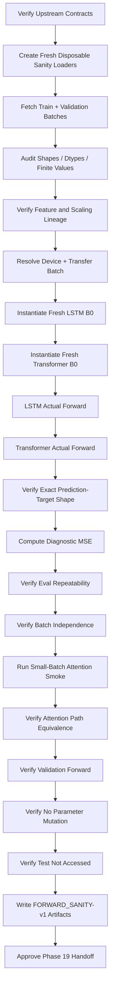
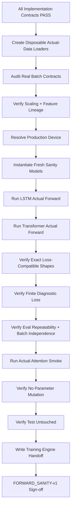

<div align="center">

# PHASE 18 — FORWARD-PASS SANITY TESTS

## Kế hoạch kiểm thử forward pass trên dữ liệu thật trước khi xây Training Engine và chạy thí nghiệm chính thức

### Transformer Encoder cho hồi quy chuỗi thời gian đa biến trên UCI Appliances Energy Prediction

**Phase kế tiếp sau `Phase_17_Attention-aware_encoder_verification.md`**

</div>

---

# 1. Vai trò của Phase 18

Phase 18 là **cổng kiểm tra tích hợp cuối cùng trước khi bắt đầu training thật**.

Các phase trước đã kiểm từng thành phần riêng:

```text
Phase 10
→ window semantics

Phase 11
→ Dataset / DataLoader

Phase 12
→ metrics

Phase 13
→ experiment registry

Phase 15
→ LSTM implementation

Phase 16
→ Transformer implementation

Phase 17
→ attention-aware encoder verification
```

Phase 18 phải kiểm tra rằng khi ghép toàn bộ chúng với nhau trên **actual project data**, pipeline vẫn đúng:

```text
Actual DataLoader batch
        ↓
actual shapes / dtypes / devices
        ↓
LSTM forward
        ↓
Transformer forward
        ↓
prediction [B,1]
        ↓
loss-compatible targets
        ↓
finite outputs
        ↓
attention smoke
        ↓
device transfer
        ↓
ready for Training Engine
```

Nguyên tắc cốt lõi:

\[
\boxed{
Real\ Batch
+
Correct\ Shape
+
Correct\ Device
+
Finite\ Forward
+
Loss\ Compatibility
+
No\ Leakage
}
\]

---

# 2. Mục tiêu cần đạt sau Phase 18

Sau Phase 18 phải có:

```text
1. FORWARD_SANITY-v1 contract.

2. Actual Train batch được kiểm.

3. Actual Validation batch được kiểm.

4. Test batch không được truy cập.

5. Disposable sanity DataLoaders được sử dụng.

6. Production DataLoader RNG state không bị tiêu hao.

7. Actual X shape được xác minh.

8. Actual target shapes được xác minh.

9. Actual sample_idx shape được xác minh.

10. Actual feature count khớp FEATURESETS-v1.

11. Actual lookback khớp L144 baseline.

12. Actual dtype khớp float32.

13. Actual tensors finite.

14. Actual sample metadata alignment đúng.

15. Actual target scaling path đúng.

16. YS1 round-trip sanity đúng.

17. CPU host batch contract đúng.

18. Selected runtime device được xác minh.

19. Batch transfer tới selected device đúng.

20. LSTM_B0 instantiate được từ actual F.

21. Transformer_B0 instantiate được từ actual F.

22. LSTM actual forward pass thành công.

23. Transformer actual forward pass thành công.

24. LSTM output [B,1].

25. Transformer output [B,1].

26. Outputs finite.

27. No target leakage through model API.

28. MSE loss compatibility được xác minh.

29. Loss scalar finite.

30. YS0/YS1 architecture independence được xác minh về shape.

31. Eval repeated-forward sanity.

32. Train/eval mode semantics smoke.

33. LSTM stateless actual-batch smoke.

34. Transformer batch-independence actual-batch smoke.

35. Transformer attention actual-batch smoke.

36. Attention shape đúng trên actual L/F.

37. Attention probability sanity nhỏ trên actual batch.

38. Standard/attention Transformer prediction equivalence.

39. Actual B64 full-batch compatibility nếu split đủ batch.

40. Last incomplete batch compatibility được kiểm.

41. B1 compatibility được kiểm bằng actual sample slice.

42. Device-specific output finite.

43. Optional CPU-vs-active-device numeric parity audit.

44. Model parameter device audit.

45. Positional buffer device audit.

46. No hidden CPU tensor/device mismatch.

47. No optimizer step.

48. No official training.

49. No checkpoint winner.

50. No Validation-based model selection.

51. Experiment registry SANITY records nếu dùng.

52. Forward sanity audit artifacts.

53. FORWARD_SANITY-v1 manifest.

54. Phase 18 sign-off.
```

---

# 3. Những việc Phase 18 không làm

Phase 18 không:

```text
Không train model qua nhiều epochs.

Không optimizer.step().

Không chọn learning rate.

Không chọn LSTM vs Transformer.

Không tính official Validation RMSE để chọn model.

Không tune batch size.

Không tune feature set.

Không tune lookback.

Không tune target scaling.

Không tune loss.

Không tune dropout.

Không tune architecture.

Không chạy early stopping.

Không save production best checkpoint.

Không mở Test targets.

Không iterate Test loader.

Không xem Test prediction.

Không tạo final attention analysis.

Không thay các upstream contracts nếu chỉ vì sanity test không PASS.
```

Nếu sanity test thất bại:

```text
fix đúng component gây lỗi
→ version/audit lại nếu semantic change
→ rerun Phase 18.
```

---

# 4. Input contract

Phase 18 chỉ bắt đầu khi:

```text
Phase 11 = PASS
Phase 12 = PASS
Phase 13 = PASS
Phase 14 = PASS
Phase 15 = PASS
Phase 16 = PASS
Phase 17 = PASS
```

Bắt buộc truy được:

```text
ENV-v1

FEATURES-v1
FEATURESETS-v1

SPLIT-v1
SCALING-v1

WINDOWS-v1
WINDOWPOP-v1

DATALOADERS-v1

METRICS-v1
EXPERIMENTS-v1

LSTM_IMPL-v1

TRANSFORMER_IMPL-v1
ATTENTION_VERIFY-v1
```

---

# 5. Output version

Gán:

```text
FORWARD_SANITY-v1
```

Lineage:

```text
DATALOADERS-v1
      +
LSTM_IMPL-v1
      +
TRANSFORMER_IMPL-v1
      +
ATTENTION_VERIFY-v1
      ↓
FORWARD_SANITY-v1
```

Chỉ sau khi:

```text
FORWARD_SANITY-v1 = PASS
```

mới chuyển sang:

```text
Phase 19 — Baseline Training Engine.
```

---

# 6. Reference B0 integration configuration

Phase 18 dùng cấu hình integration reference:

```text
Feature variant:
FS1_TF1

Lookback:
L144

Horizon:
H1

Target scaling:
YS1

Boundary protocol:
WB0

Population:
WINDOWPOP-v1

Batch size:
B64

Seed:
42
```

---

# 7. LSTM reference architecture

```text
hidden_size = 64

num_layers = 2

dropout = 0.1

bidirectional = False

proj_size = 0

readout = LAST_STEP

output = Linear(64,1)
```

---

# 8. Transformer reference architecture

```text
d_model = 64

num_heads = 4

num_layers = 2

ffn_dim = 128

dropout = 0.1

activation = GELU

pooling = LAST_STEP

sinusoidal positional encoding

POST-NORM

no causal mask

no padding mask

output = Linear(64,1)
```

---

# 9. Loss compatibility reference

Phase 18 dùng:

```text
MSE
```

chỉ như **shape/numerical compatibility check**.

Không dùng MSE result để:

```text
judge model quality.
```

---

# 10. Vì sao actual-data forward test là bắt buộc?

Synthetic unit tests có thể PASS nhưng actual data vẫn fail vì:

```text
feature count mismatch

tensor dtype mismatch

DataLoader key mismatch

wrong target shape

wrong scaler routing

wrong device transfer

metadata collation mismatch

actual lookback mismatch

unexpected NaN/Inf

attention max_seq_len mismatch.
```

Phase 18 bắt các lỗi integration này trước khi training hàng chục epochs.

---

# 11. Disposable DataLoader principle

Đây là hard rule:

> Phase 18 không reuse production DataLoader object sẽ dùng cho Phase 19/20/21.

Tạo:

```text
fresh disposable sanity loaders.
```

---

# 12. Vì sao cần disposable loaders?

Phase 11 đã khóa:

```text
Train shuffle uses torch.Generator.
```

Iterate một Train loader làm:

```text
advance RNG/generator state.
```

Nếu reuse loader đó cho official training:

```text
epoch-1 sample order thay đổi.
```

Do đó:

```text
sanity loader
≠
production loader.
```

---

# 13. Sanity loader seed

Có thể dùng:

```text
same seed 42
```

để test reproducibility.

Nhưng loader object phải mới.

---

# 14. Production loader creation time

Official production loaders cho Phase 19+ nên được:

```text
re-created fresh
```

sau Phase 18 PASS.

---

# 15. Data access policy

Phase 18 được truy cập:

```text
TRAIN

VALIDATION
```

Không truy cập:

```text
TEST.
```

---

# 16. Vì sao cần Validation batch sanity?

Để verify:

```text
shuffle=False path

evaluation batch schema

same shapes

same scaling

same population metadata.
```

Không phải để chọn model.

---

# 17. Test firewall

Hard:

```text
TEST loader must not be iterated.
```

Nếu Phase 18 code gọi:

```text
next(iter(test_loader))
```

→ FAIL.

---

# 18. Sanity loader scope

Khuyến nghị:

```text
1–2 Train batches

1 Validation batch

selected small sample slices
```

không iterate toàn dataset.

---

# 19. Actual Train batch contract

Expected batch fields theo Phase 11:

```text
x

y_model

y_raw_wh

sample_idx
```

và metadata nếu DataLoader contract có thêm.

---

# 20. Actual Validation batch contract

Same semantic fields:

```text
x

y_model

y_raw_wh

sample_idx
```

với:

```text
ordered sample IDs
```

do Validation `shuffle=False`.

---

# 21. TEST_LOCKED contract

Nếu project hỗ trợ:

```text
TEST_LOCKED
```

batch không được materialize trong Phase 18.

Không cần test bằng actual Test batch.

Test firewall đã được unit-test upstream.

---

# 22. Actual X tensor shape

Reference:

\[
\boxed{
X=[B,144,F]
}
\]

Trong đó:

```text
F
```

phải lấy runtime từ:

```text
FEATURESETS-v1 / FS1_TF1
```

không hard-code.

---

# 23. Feature-count assertion

\[
X.shape[-1]
=
feature\_count(FS1\_TF1)
\]

Hard fail nếu mismatch.

---

# 24. Feature-order fingerprint

Sanity batch phải bind:

```text
feature_fingerprint
```

đúng active FS1_TF1.

Model chỉ thấy F, nên pipeline metadata phải đảm bảo:

```text
channel order đúng.
```

---

# 25. Lookback assertion

Reference:

\[
X.shape[1]=144
\]

và:

```text
lookback_id = L144.
```

---

# 26. Batch dimension

Full Train batch expected:

```text
B=64
```

nếu dataset có đủ samples.

Nhưng implementation không được assume mọi batch đều 64.

---

# 27. Last batch

Do:

```text
drop_last=False
```

batch cuối có thể:

```text
B < 64.
```

Model phải support.

---

# 28. Target shapes

Expected:

```text
y_model
→ [B,1]

y_raw_wh
→ [B,1].
```

---

# 29. sample_idx shape

Recommended:

```text
[B]
```

dtype:

```text
torch.int64
```

hoặc equivalent collated integer tensor.

---

# 30. X dtype

Expected:

```text
torch.float32.
```

---

# 31. y_model dtype

Expected:

```text
torch.float32.
```

---

# 32. y_raw_wh dtype

Expected:

```text
torch.float32
```

hoặc documented floating dtype từ DataLoader contract.

Khuyến nghị:

```text
float32.
```

---

# 33. X finite-value assertion

Hard:

```text
torch.isfinite(x).all()
```

---

# 34. y_model finite-value assertion

Hard.

---

# 35. y_raw_wh finite-value assertion

Hard.

---

# 36. No silent sanitation

Không:

```text
nan_to_num

drop sample

replace Inf

fill zero
```

trong Phase 18.

Failure phải trace upstream.

---

# 37. Target scaling sanity — YS1

B0 dùng:

```text
YS1.
```

Do đó:

```text
y_model
```

là standardized target space.

```text
y_raw_wh
```

là original Wh.

---

# 38. Actual YS1 inverse round-trip smoke

Lấy:

```text
y_model
```

và frozen:

```text
YSCALER__YS1
```

inverse transform.

Expected:

\[
inverse(y_{model})
\approx
y_{raw\_wh}
\]

within scaler precision tolerance.

---

# 39. Why verify YS1 again?

Phase 9 đã audit scaler.

Phase 18 chỉ kiểm:

```text
DataLoader đúng target field routing
```

trên actual batch.

---

# 40. YS1 mean/std không được suy từ sanity batch

Không kiểm:

```text
batch mean ≈ 0
batch std ≈ 1.
```

Một random batch không cần có standard normal distribution.

---

# 41. X scaling sanity

Không yêu cầu batch feature means bằng 0.

Chỉ verify:

```text
finite

expected dtype

expected feature count

upstream scaler/fingerprint.
```

---

# 42. Actual sample metadata alignment

Nếu batch có:

```text
target_idx
input_end_idx
target_timestamp
```

thì có thể smoke:

```text
target timestamp > input-end timestamp
```

Nhưng Phase 18 không duplicate toàn Phase 10 temporal audit.

---

# 43. Metadata spot check

Khuyến nghị 3–5 samples:

```text
sample_idx
→ window registry row
→ target index
→ feature window identity.
```

---

# 44. No population mutation

Phase 18 không tạo sample population mới.

Use:

```text
WINDOWPOP-v1.
```

---

# 45. Actual device selection

Dùng device resolver đã khóa Phase 1:

```text
CUDA
→ nếu available

MPS
→ nếu available

CPU
→ fallback.
```

Không hard-code.

---

# 46. Device must be recorded

Store:

```text
device_type

device_name / backend metadata

torch version.
```

---

# 47. CPU host-batch stage

DataLoader output baseline ở:

```text
CPU.
```

Sau đó Training Engine-style transfer helper đưa:

```text
x
y_model
```

tới selected device.

---

# 48. sample_idx có cần move device?

Không cần cho model/loss.

Khuyến nghị giữ:

```text
CPU
```

để provenance/indexing dễ.

---

# 49. y_raw_wh có cần move device?

Không cần cho training loss nếu loss dùng:

```text
y_model.
```

Có thể giữ CPU trong actual Training Engine.

Phase 18 có thể giữ host.

---

# 50. Minimal device transfer set

Training path:

```text
x → device

y_model → device.
```

Metadata:

```text
CPU.
```

---

# 51. `non_blocking` policy

Nếu:

```text
CUDA + pin_memory=True
```

có thể dùng:

```text
non_blocking=True.
```

Nếu:

```text
MPS/CPU
```

không giả định CUDA transfer semantics.

Use helper theo DATALOADERS-v1 policy.

---

# 52. No `.cuda()` calls

Use:

```text
tensor.to(device)
model.to(device).
```

---

# 53. Model parameter device assertion

Sau:

```text
model.to(device)
```

mọi trainable parameter:

```text
p.device == selected device.
```

---

# 54. LSTM hidden-state device safety

LSTM-v1 không manual create h0/c0.

Do đó forward phải tự operate đúng device.

Nếu device mismatch:

```text
FAIL.
```

---

# 55. Transformer positional buffer device assertion

Sinusoidal PE buffer phải:

```text
same device as model/input.
```

Hard check.

---

# 56. No hidden CPU tensors in Transformer forward

Actual selected-device forward sẽ expose bug nếu positional tensor được tạo CPU trong forward.

---

# 57. Model instantiation seed order

For each sanity model:

```text
set seed 42

instantiate model

move to device.
```

---

# 58. LSTM and Transformer seed usage

Có thể reset seed trước mỗi model instantiation để:

```text
reproducible implementation smoke.
```

Không cần hai models có mathematically comparable initial random states.

---

# 59. Model configs must derive actual F

Example conceptual:

```text
input_size = x.shape[-1]
```

nhưng verify trước:

```text
x.shape[-1]
=
registered FS1_TF1 feature count.
```

Sau đó pass authoritative feature count.

---

# 60. Không infer config only from batch

Batch is verification source, not sole contract source.

Correct direction:

```text
Registry says F expected
↓
batch observed F
↓
assert equal
↓
model input_size = expected F.
```

---

# 61. LSTM actual forward pass

In eval smoke:

```text
lstm.eval()

with inference_mode:
    pred = lstm(x_device)
```

Expected:

```text
[B,1].
```

---

# 62. Transformer actual forward pass

Same:

```text
transformer.eval()

prediction = transformer(x_device)
```

Expected:

```text
[B,1].
```

---

# 63. Output dtype

Expected:

```text
float32
```

for baseline float32 model/input.

---

# 64. Output device

Expected:

```text
same selected device.
```

---

# 65. Output finite

Hard:

```text
torch.isfinite(pred).all().
```

---

# 66. No output range requirement

Randomly initialized model may predict:

```text
negative
positive
large/small
```

depending scale.

Không judge performance/range ở Phase 18 trừ:

```text
nonfinite/extreme numerical overflow.
```

---

# 67. No clipping

Không clamp output để make sanity pass.

---

# 68. Output shape compatibility with target

Hard:

\[
prediction.shape
=
y_{model}.shape
=
[B,1]
\]

---

# 69. Why this matters?

Nếu prediction `[B]` và target `[B,1]`, PyTorch loss có thể broadcast thành:

```text
[B,B]
```

hoặc warning/incorrect behavior.

Phase 18 phải fail trước Training Engine.

---

# 70. Broadcast guard

Before loss:

```text
assert pred.shape == y_model.shape.
```

Không rely warning.

---

# 71. MSE loss smoke

Use:

```text
nn.MSELoss(reduction="mean")
```

on:

```text
pred
y_model.
```

---

# 72. Loss shape

Expected:

```text
scalar 0-D tensor.
```

---

# 73. Loss finite

Hard:

```text
torch.isfinite(loss).
```

---

# 74. Loss non-negative

MSE:

```text
loss >= 0.
```

---

# 75. No loss-quality threshold

Không:

```text
loss must < 1
```

because model untrained.

---

# 76. YS1 scale makes initial MSE interpretable only loosely

Không compare LSTM vs Transformer initial random MSE.

Random initialization differences are meaningless for scientific comparison.

---

# 77. No Validation selection from untrained outputs

Validation batch forward only verifies integration.

Không log as scientific model performance.

---

# 78. Train-mode forward smoke

For each model:

```text
model.train()
```

forward one actual Train batch.

Expected:

```text
shape valid

finite output

loss finite.
```

No optimizer.

---

# 79. Why both train/eval modes?

Catch:

```text
dropout-specific issue

mode-dependent module bug.
```

---

# 80. Train-mode output may differ from eval

Expected due:

```text
dropout.
```

Không require allclose.

---

# 81. Eval repeated-forward test

Same actual mini-batch:

```text
model.eval()
```

run twice.

Expected:

```text
predictions allclose.
```

---

# 82. LSTM eval determinism

Internal inter-layer dropout off.

Same model/input:

```text
allclose.
```

---

# 83. Transformer eval determinism

Attention/FFN dropout off.

Same model/input:

```text
allclose.
```

---

# 84. Actual B1 smoke

Slice:

```text
x[:1]
y[:1]
```

Expected both models output:

```text
[1,1].
```

---

# 85. Actual small-batch smoke

Use:

```text
B=2 or B=4
```

for attention inspection.

---

# 86. Full B64 smoke

Normal prediction path should accept:

```text
B=64
```

reference full batch.

---

# 87. Incomplete-last-batch smoke

Preferred:

```text
obtain actual final Validation batch
```

only if this does not require iterating entire loader excessively.

Alternative:

```text
slice an actual batch to nonstandard B=7
```

for architecture shape compatibility.

---

# 88. Avoid consuming full Train loader just to reach last batch

Use:

```text
manual slice
```

or disposable sequential loader if necessary.

Goal:

```text
shape compatibility
```

not dataset traversal.

---

# 89. LSTM stateless actual-batch test

Take actual samples:

```text
A
B
```

Eval:

```text
pred_A_alone

pred_A_after_B_call.
```

Expected:

```text
allclose.
```

---

# 90. LSTM batch-composition independence

Prediction for sample A alone vs within batch:

```text
allclose in eval.
```

---

# 91. Transformer batch-composition independence

Same requirement.

---

# 92. Transformer attention batch independence

For small actual sample A:

```text
attention alone
```

vs:

```text
attention in B4 batch.
```

Expected per-layer attention for A:

```text
allclose.
```

---

# 93. Actual attention smoke

Use:

```text
transformer.eval()

forward_with_attention(
    x_device[:small_B]
)
```

---

# 94. Attention prediction shape

Expected:

```text
[small_B,1].
```

---

# 95. Attention list length

Reference:

```text
2.
```

---

# 96. Attention per-layer shape

Reference B0:

```text
[small_B,4,144,144].
```

---

# 97. Attention finite

Hard.

---

# 98. Attention row sums

In eval:

```text
sum source axis ≈ 1.
```

Use Phase 17 verified helper.

---

# 99. Attention non-negative

Use Phase 17 helper.

---

# 100. Standard/attention prediction equivalence actual data

On same actual small batch:

```text
transformer(x)
```

vs:

```text
forward_with_attention(x)
```

Expected:

```text
allclose using verified tolerance policy.
```

---

# 101. Why repeat Phase 17 equivalence?

Phase 17 used synthetic data.

Phase 18 proves same on:

```text
actual scaled model inputs.
```

---

# 102. No full attention save

Phase 18 does not save scientific attention matrices.

Only:

```text
summary audit stats
```

needed.

---

# 103. Actual input magnitude audit

Record descriptive:

```text
min
max
mean
std
```

for the sanity batch.

Do not use to tune model.

---

# 104. Why record magnitude?

Can catch gross scaling failure:

```text
1e20
NaN
Inf.
```

But no hard expectation that batch mean=0.

---

# 105. Actual target magnitude audit

Record:

```text
y_model min/max

y_raw_wh min/max.
```

No model-quality decision.

---

# 106. Device-specific numerical smoke

If selected device:

```text
MPS/CUDA
```

run both models on that device.

This is mandatory if project intends to train there.

---

# 107. CPU fallback scenario

If no accelerator:

```text
CPU is selected production device.
```

No warning needed beyond runtime record.

---

# 108. Optional CPU vs active-device parity

If active device is MPS/CUDA:

```text
instantiate same model weights on CPU

copy state_dict

run same actual small batch

compare eval predictions.
```

---

# 109. CPU-vs-device parity is diagnostic

Floating differences expected.

Use:

```text
allclose with documented device tolerance.
```

Not universal hard criterion unless differences are large/nonfinite.

---

# 110. Why parity can be useful?

Catches:

```text
device-specific bug

unsupported operation fallback anomaly

unexpected dtype cast.
```

---

# 111. Do not force exact parity

Different kernels may produce small differences.

---

# 112. Device parity artifact fields

```text
model

device_a

device_b

dtype

max_abs_diff

max_rel_diff

atol

rtol

status.
```

---

# 113. MPS caution

If active device MPS:

```text
do not silently enable CPU fallback env behavior
```

unless Phase 1 explicitly configured/logged.

---

# 114. CUDA caution

If CUDA:

```text
record CUDA device
torch version
```

from environment report.

---

# 115. No mixed precision

Baseline sanity:

```text
float32
mixed_precision=False.
```

---

# 116. No autocast

Phase 18 reference path does not use:

```text
torch.autocast.
```

---

# 117. No gradient accumulation

Not training.

---

# 118. No optimizer creation required

Phase 18 can avoid optimizer entirely.

---

# 119. Should Phase 18 call backward?

Canonical Phase 18:

```text
NO.
```

Synthetic backward already passed in Phases 15/16.

Actual-data gradient/update correctness belongs:

```text
Phase 19 Training Engine.
```

---

# 120. Why not backward in Phase 18?

Keeps phase focused:

```text
forward integration
```

and prevents partial training semantics.

Loss calculation is enough to verify:

```text
prediction-target compatibility.
```

---

# 121. Optional exception

If implementation team wants a one-batch actual backward smoke, place it at beginning of Phase 19, not Phase 18.

---

# 122. No parameter mutation

Before and after Phase 18:

```text
model parameter fingerprints
```

should remain unchanged because no optimizer step.

Optional check:

```text
hash selected parameters before/after.
```

---

# 123. Model remains randomly initialized

Sanity outputs are not research results.

---

# 124. No checkpoint artifact from random model required

Do not register:

```text
best_checkpoint.
```

---

# 125. Experiment Registry integration

Two valid policies:

```text
POLICY A
→ Phase 18 uses implementation audit registry only

POLICY B
→ register formal SANITY runs
```

Khuyến nghị:

```text
POLICY B
```

nếu EXPERIMENTS-v1 đã hỗ trợ:

```text
execution_type=SANITY.
```

---

# 126. SANITY run families

Could use:

```text
F18_LSTM_FORWARD_SANITY

F18_TRANSFORMER_FORWARD_SANITY.
```

---

# 127. SANITY runs are not scientific experiment results

They must never appear in:

```text
sweep winner queries

final result tables.
```

---

# 128. SANITY run status

Expected:

```text
COMPLETED
```

after forward audits.

No official model metrics required.

---

# 129. SANITY run artifact types

```text
CONFIG

STATUS

FORWARD_AUDIT

DEVICE_AUDIT

ATTENTION_SMOKE
```

No:

```text
BEST_CHECKPOINT.
```

---

# 130. Registry exclusion field

Recommended:

```text
eligible_for_model_selection=False.
```

for SANITY runs.

---

# 131. Upstream lineage in sanity record

Include:

```text
feature_set_version

feature_variant_id

scaling_version

window_version

population_version

dataloader_version

LSTM/Transformer implementation version

attention verification version.
```

---

# 132. Actual-batch identity

For reproducibility, log:

```text
sample_idx values
```

used in sanity checks.

Do not need full feature values.

---

# 133. Batch selection policy

Use deterministic selection.

Recommended:

```text
first batch from fresh disposable Validation loader

first batch from fresh disposable Train loader with seeded shuffle.
```

---

# 134. Train first batch reproducibility

Fresh same-seed Train sanity loader:

```text
first batch IDs should reproduce.
```

Can cross-check Phase 11 policy.

---

# 135. Validation first batch

Because:

```text
shuffle=False
```

should be earliest Validation sample IDs.

---

# 136. Do not cherry-pick “nice” batch

No selecting batch with:

```text
low target
few spikes
better output.
```

Use deterministic policy.

---

# 137. Attention small batch selection

Take:

```text
first small_B samples
```

from deterministic sanity batch.

No cherry-pick by attention appearance.

---

# 138. Batch audit table

Tạo:

```text
forward_batch_audit.csv
```

Fields:

```text
split_id

loader_role

batch_index

observed_batch_size

lookback

feature_count

x_shape

y_model_shape

y_raw_shape

sample_idx_shape

x_dtype

y_model_dtype

x_finite

y_model_finite

y_raw_finite

feature_fingerprint

population_fingerprint

status.
```

---

# 139. Scaling audit table

Tạo:

```text
forward_scaling_audit.csv
```

Fields:

```text
split_id

sample_count

target_scaling_option

inverse_roundtrip_max_abs_error

inverse_roundtrip_max_rel_error

atol

rtol

status.
```

---

# 140. Device audit table

Tạo:

```text
forward_device_audit.csv
```

Fields:

```text
model

selected_device

input_device

target_device

parameter_devices

buffer_devices

prediction_device

input_dtype

parameter_dtype

prediction_dtype

status.
```

---

# 141. Model-forward audit table

```text
model_forward_audit.csv
```

Fields:

```text
model

mode

split_id

batch_size

input_shape

prediction_shape

target_shape

prediction_finite

prediction_min

prediction_max

loss_name

loss_shape

loss_finite

loss_value_diagnostic

eligible_for_selection

status.
```

---

# 142. Important loss field label

If storing random-init loss:

```text
loss_value_diagnostic
```

not:

```text
validation_loss.
```

Avoid accidental scientific use.

---

# 143. Attention smoke audit

```text
forward_attention_smoke_audit.csv
```

Fields:

```text
batch_size

lookback

num_layers

num_heads

layer_index

attention_shape

attention_finite

min_weight

max_weight

max_row_sum_error

prediction_path_max_abs_diff

prediction_path_allclose

status.
```

---

# 144. Batch independence audit

```text
forward_batch_independence_audit.csv
```

Fields:

```text
model

sample_idx

alone_prediction

batched_prediction

max_abs_diff

atol

rtol

status.
```

For attention additionally:

```text
attention_max_abs_diff.
```

---

# 145. Mode audit

```text
forward_mode_audit.csv
```

Fields:

```text
model

mode

repeat_count

same_input

outputs_allclose_expected

outputs_allclose_observed

dropout_active_expected

status.
```

---

# 146. Parameter mutation audit

Optional:

```text
forward_parameter_mutation_audit.csv
```

Fields:

```text
model

before_fingerprint

after_fingerprint

unchanged

status.
```

---

# 147. Why parameter mutation audit?

Confirms Phase 18 truly:

```text
did not train.
```

---

# 148. Forward discrepancy log

Create:

```text
forward_sanity_discrepancies.json
```

Categories:

```text
BATCH_SCHEMA_MISMATCH

FEATURE_COUNT_MISMATCH

FEATURE_FINGERPRINT_MISMATCH

LOOKBACK_MISMATCH

DTYPE_MISMATCH

NONFINITE_INPUT

NONFINITE_TARGET

TARGET_SCALING_MISMATCH

DEVICE_TRANSFER_ERROR

PARAMETER_DEVICE_MISMATCH

BUFFER_DEVICE_MISMATCH

LSTM_FORWARD_ERROR

TRANSFORMER_FORWARD_ERROR

OUTPUT_SHAPE_MISMATCH

LOSS_BROADCAST_RISK

NONFINITE_OUTPUT

NONFINITE_LOSS

ATTENTION_SHAPE_ERROR

ATTENTION_PROBABILITY_ERROR

ATTENTION_PATH_MISMATCH

BATCH_CROSS_TALK

UNEXPECTED_PARAMETER_MUTATION

TEST_FIREWALL_VIOLATION

OTHER
```

---

# 149. Severity levels

```text
CRITICAL

MAJOR

MINOR

INFO.
```

---

# 150. CRITICAL examples

```text
output shape wrong

nonfinite actual input

Test loader accessed

wrong feature count

device mismatch preventing forward

attention path changes prediction materially.
```

---

# 151. MAJOR examples

```text
YS1 round-trip mismatch

feature fingerprint mismatch

unexpected parameter mutation.
```

---

# 152. MINOR examples

```text
device parity requires slightly looser tolerance

diagnostic timing variance.
```

---

# 153. INFO examples

```text
expected train/eval dropout difference.
```

---

# 154. Status model

## PASS

```text
all critical integration checks pass

both models forward successfully

loss-compatible shapes

attention smoke passes

Test untouched.
```

## PASS_WITH_WARNING

Ví dụ:

```text
CPU-vs-MPS difference within documented broader tolerance
```

while production-device forward is correct.

## FAIL

Ví dụ:

```text
wrong target shape

broadcast risk

NaN output

actual attention mismatch

Test access.
```

---

# 155. Actual Train forward flow

```text
fresh disposable train loader
        ↓
next(iter(loader))
        ↓
audit host batch
        ↓
move x/y_model
        ↓
LSTM eval forward
        ↓
Transformer eval forward
        ↓
loss compatibility
        ↓
train-mode smoke
```

---

# 156. Actual Validation forward flow

```text
fresh disposable validation loader
        ↓
first batch
        ↓
audit ordered IDs
        ↓
same model shape/device checks
        ↓
no model selection.
```

---

# 157. Recommended sequence of model testing

Do:

```text
CPU/synthetic contracts already upstream

Phase 18 actual:
1. host batch audit
2. selected-device LSTM
3. selected-device Transformer
4. Transformer attention
5. batch independence
6. Validation batch.
```

---

# 158. Fail-fast order

Do not attempt model forward if:

```text
batch schema
shape
dtype
finite
feature fingerprint
```

already failed.

---

# 159. Why fail fast?

Avoid interpreting downstream errors caused by upstream batch corruption.

---

# 160. Host batch audit first

Before `.to(device)` verify:

```text
keys

shape

dtype

finite

sample IDs.
```

---

# 161. Device transfer audit second

Then verify:

```text
x/y_model on device

metadata stays CPU.
```

---

# 162. Model construction third

Only after authoritative:

```text
F
```

verified.

---

# 163. Forward fourth

Only after:

```text
model parameters/buffers on device.
```

---

# 164. Loss fifth

Only after exact prediction-target shape equality.

---

# 165. Attention last

Only after normal Transformer forward passes.

---

# 166. No exception swallowing

Không:

```text
try/except: pass
```

for sanity.

Failures must be:

```text
recorded
raised or surfaced.
```

---

# 167. Clear assertion messages

Example:

```text
Expected x.shape[1] == 144 for L144,
observed ...
```

better than:

```text
AssertionError.
```

---

# 168. Forward helper design

Recommended:

```text
inspect_batch_contract()

move_training_batch_to_device()

run_model_forward_sanity()

run_loss_compatibility_sanity()

run_eval_repeatability_sanity()

run_batch_independence_sanity()

run_transformer_attention_sanity()

run_target_scaling_roundtrip_sanity()

write_forward_sanity_manifest()
```

---

# 169. Do not duplicate model-specific forward loops unnecessarily

Build generic helper for:

```text
model(x) → prediction.
```

Attention helper Transformer-specific.

---

# 170. Data structure for result

Recommended:

```text
ForwardSanityResult
```

Fields:

```text
model_name

split_id

batch_size

input_shape

prediction_shape

device

dtype

finite

loss_compatible

status

warnings.
```

---

# 171. Device transfer helper ownership

Phase 18 can test helper intended for Phase 19.

This is useful because Phase 19 will reuse exact transfer semantics.

---

# 172. Training batch transfer helper

Conceptual:

```python
def move_batch_for_training(batch, device, non_blocking=False):
    return {
        "x": batch["x"].to(device, non_blocking=non_blocking),
        "y_model": batch["y_model"].to(device, non_blocking=non_blocking),
        ...
    }
```

Metadata not necessarily moved.

---

# 173. Avoid returning mutated original dict

Preferred:

```text
new shallow/structured batch
```

to preserve CPU metadata source.

---

# 174. Loss helper

Canonical:

```text
criterion(prediction, y_model)
```

after:

```text
shape equality assertion.
```

---

# 175. No implicit squeeze

Không:

```text
prediction.squeeze()
y.squeeze()
```

to make shapes match.

Model and DataLoader contracts must already match.

---

# 176. No casting targets ad hoc

Không:

```text
y = y.float()
```

to hide DataLoader dtype mismatch.

If wrong:

```text
fix upstream.
```

---

# 177. No reshaping ad hoc

Không:

```text
y.view(-1,1)
```

in sanity to hide schema issue.

---

# 178. Why strictness matters?

If Phase 18 “fixes” tensors locally:

```text
Phase 19 training code may diverge
```

and upstream contract remains broken.

---

# 179. Sanity test should follow production code path

As much as possible, Phase 18 should call:

```text
same model constructors

same DataLoader builders

same device resolver

same transfer helper

same loss constructor
```

that Phase 19 will use.

---

# 180. But no optimizer/training state yet

Correct.

---

# 181. Actual batch IDs artifact

Save:

```text
forward_sanity_sample_ids.csv
```

Fields:

```text
sanity_subset_id

split_id

batch_role

sample_order

sample_idx

used_for_attention

used_for_batch_independence.
```

---

# 182. Why sample IDs?

Allows exact rerun of attention/device diagnostics if needed.

---

# 183. Do not save actual scaled feature matrix unless needed

Avoid duplicate sensitive/large artifacts.

IDs + upstream lineage sufficient.

---

# 184. Model config artifacts

Reference actual configs should be saved under sanity run directory:

```text
lstm_forward_sanity_config.json

transformer_forward_sanity_config.json.
```

---

# 185. Config must include actual input_size

Unlike Phase 15/16 reference schema, Phase 18 now knows actual:

```text
F.
```

Record runtime value.

---

# 186. Config fingerprints

Compute final sanity configs via:

```text
EXPERIMENTS-v1 canonical config fingerprint.
```

---

# 187. No reuse as Phase 20/21 run IDs

Phase 18 SANITY run IDs are separate.

Official training creates new run IDs.

---

# 188. Why separate IDs?

Because:

```text
execution type differs

no training occurred

results not model performance.
```

---

# 189. Training Engine handoff artifact

Create:

```text
training_engine_handoff.json
```

Fields:

```text
forward_sanity_version

active_feature_variant

feature_count

lookback

horizon

target_scaling

boundary_protocol

batch_size_reference

selected_device

non_blocking_policy

lstm_model_version

transformer_model_version

attention_verification_version

input_shape_contract

target_shape_contract

loss_shape_contract

sanity_status

approved_for_phase19
```

---

# 190. `approved_for_phase19`

Only:

```text
true
```

if Phase 18 PASS.

---

# 191. No auto-approval with warning involving critical path

PASS_WITH_WARNING only approves Phase 19 if warnings are:

```text
non-critical.
```

---

# 192. Phase 18 manifest

Create:

```text
forward_sanity_manifest.json
```

Fields:

```text
forward_sanity_version = FORWARD_SANITY-v1

environment_id

dataset_revision

feature_set_version

feature_variant_id

feature_fingerprint

split_version

scaling_version

window_version

population_version

dataloader_version

metric_version

experiment_registry_version

lstm_implementation_version

transformer_implementation_version

attention_verification_version

reference_lookback

reference_horizon

reference_batch_size

target_scaling_option

selected_device

canonical_dtype

train_sanity_sample_count

validation_sanity_sample_count

lstm_forward_status

transformer_forward_status

attention_smoke_status

loss_compatibility_status

test_access_status

parameter_mutation_status

audit_status

warnings

created_at
```

---

# 193. Test access status

Must be:

```text
NOT_ACCESSED.
```

---

# 194. Forward sanity test suite

Create:

```text
forward_sanity_tests.csv
```

Fields:

```text
test_id

category

model

split_id

description

expected

actual

atol

rtol

status

notes.
```

---

# 195. Test categories

```text
DATALOADER

BATCH_SCHEMA

SCALING

DEVICE

LSTM_FORWARD

TRANSFORMER_FORWARD

LOSS_COMPATIBILITY

MODE

BATCH_INDEPENDENCE

ATTENTION

PARAMETER_IMMUTABILITY

REGISTRY

TEST_FIREWALL.
```

---

# 196. Test F18-001

Fresh Train sanity loader builds.

---

# 197. Test F18-002

Fresh Validation sanity loader builds.

---

# 198. Test F18-003

No Test loader iterated.

---

# 199. Test F18-004

Train batch contains required keys.

---

# 200. Test F18-005

Validation batch contains required keys.

---

# 201. Test F18-006

Train X rank = 3.

---

# 202. Test F18-007

Validation X rank = 3.

---

# 203. Test F18-008

Reference lookback = 144.

---

# 204. Test F18-009

Observed feature count matches FS1_TF1 registry.

---

# 205. Test F18-010

Feature fingerprint matches.

---

# 206. Test F18-011

X dtype float32.

---

# 207. Test F18-012

y_model shape [B,1].

---

# 208. Test F18-013

y_raw_wh shape [B,1].

---

# 209. Test F18-014

sample_idx length B.

---

# 210. Test F18-015

Train X finite.

---

# 211. Test F18-016

Train y_model finite.

---

# 212. Test F18-017

Train y_raw_wh finite.

---

# 213. Test F18-018

Validation tensors finite.

---

# 214. Test F18-019

YS1 inverse target round-trip PASS.

---

# 215. Test F18-020

Selected runtime device resolved.

---

# 216. Test F18-021

X transfers to selected device.

---

# 217. Test F18-022

y_model transfers to selected device.

---

# 218. Test F18-023

LSTM parameters all selected device.

---

# 219. Test F18-024

Transformer parameters all selected device.

---

# 220. Test F18-025

Transformer positional buffer selected device.

---

# 221. Test F18-026

LSTM B64 eval forward works.

---

# 222. Test F18-027

LSTM output [B,1].

---

# 223. Test F18-028

LSTM output finite.

---

# 224. Test F18-029

LSTM prediction-target exact shape match.

---

# 225. Test F18-030

LSTM MSE scalar finite.

---

# 226. Test F18-031

Transformer B64 eval forward works.

---

# 227. Test F18-032

Transformer output [B,1].

---

# 228. Test F18-033

Transformer output finite.

---

# 229. Test F18-034

Transformer prediction-target exact shape match.

---

# 230. Test F18-035

Transformer MSE scalar finite.

---

# 231. Test F18-036

LSTM B1 works.

---

# 232. Test F18-037

Transformer B1 works.

---

# 233. Test F18-038

LSTM nonstandard batch B7 works.

---

# 234. Test F18-039

Transformer nonstandard batch B7 works.

---

# 235. Test F18-040

LSTM eval repeated forward allclose.

---

# 236. Test F18-041

Transformer eval repeated forward allclose.

---

# 237. Test F18-042

LSTM train-mode forward finite.

---

# 238. Test F18-043

Transformer train-mode forward finite.

---

# 239. Test F18-044

LSTM sample-alone vs batched prediction allclose in eval.

---

# 240. Test F18-045

Transformer sample-alone vs batched prediction allclose in eval.

---

# 241. Test F18-046

Transformer actual attention path works.

---

# 242. Test F18-047

Attention list length = 2 reference.

---

# 243. Test F18-048

Each attention shape [small_B,4,144,144].

---

# 244. Test F18-049

Actual attention finite.

---

# 245. Test F18-050

Actual attention row sums valid.

---

# 246. Test F18-051

Actual attention non-negative within tolerance.

---

# 247. Test F18-052

Standard vs attention prediction allclose.

---

# 248. Test F18-053

Attention sample-alone vs batched allclose.

---

# 249. Test F18-054

Validation LSTM forward works.

---

# 250. Test F18-055

Validation Transformer forward works.

---

# 251. Test F18-056

Validation sample order remains sequential.

---

# 252. Test F18-057

No custom squeeze/reshape required for loss.

---

# 253. Test F18-058

No optimizer created/stepped.

---

# 254. Test F18-059

Model parameters unchanged before/after sanity.

---

# 255. Test F18-060

SANITY run excluded from model selection.

---

# 256. Test F18-061

Test access status = NOT_ACCESSED.

---

# 257. Test F18-062

Handoff approved only if critical tests PASS.

---

# 258. Optional device parity tests

If accelerator active:

```text
F18-063
LSTM CPU vs active device allclose within device tolerance

F18-064
Transformer CPU vs active device allclose within device tolerance.
```

These are diagnostic unless discrepancy is gross.

---

# 259. Optional actual last Validation batch test

If cheap:

```text
F18-065
actual last partial batch forwards correctly.
```

Otherwise B7 slice test is sufficient architecture sanity.

---

# 260. Parameter mutation fingerprint

Can hash:

```text
state_dict tensors
```

before/after Phase 18.

Expected:

```text
same.
```

---

# 261. No optimizer means no mutation expected

Dropout forward does not mutate parameters.

BatchNorm absent.

LayerNorm has no running stats.

Therefore model state should remain unchanged.

---

# 262. Are there buffers that can mutate?

Sinusoidal positional buffer:

```text
fixed.
```

No running-stat buffers in LSTM/Transformer baseline.

State fingerprint should remain stable.

---

# 263. RNG state mutation is expected

Forward in train mode with dropout consumes RNG.

Do not require:

```text
global RNG state unchanged.
```

This is why sanity models/loaders are disposable.

---

# 264. Important distinction

```text
parameters unchanged
```

required.

```text
RNG state unchanged
```

not required.

---

# 265. Production seed reset after Phase 18

Phase 19 must:

```text
reseed

reinstantiate model

recreate DataLoaders.
```

Do not continue using Phase 18 model objects.

---

# 266. Why reinstantiate model?

Train-mode sanity dropout calls may consume RNG.

Even without optimizer, subsequent RNG stream differs.

Official run must start from clean:

```text
seed → instantiate.
```

---

# 267. Hard handoff rule

Phase 18 objects are disposable:

```text
sanity loaders

sanity LSTM

sanity Transformer.
```

Phase 19 creates fresh production objects.

---

# 268. This is critical for reproducibility

Without reinitialization:

```text
official run seed 42
```

would not mean same RNG trajectory as fresh run.

---

# 269. Registry must distinguish sanity and production

No reuse:

```text
run_id

checkpoint

training history.
```

---

# 270. Actual Validation batch must not alter model state

Eval mode/inference only for main validation sanity.

---

# 271. Train-mode smoke only on Train data

Do not call:

```text
model.train()
```

on Validation for any scientific reason.

Though forward alone would not update parameters, keep semantics clean.

---

# 272. Validation sanity uses eval mode

Hard.

---

# 273. Train sanity can test both modes

Use Train batch for:

```text
eval repeatability
train dropout smoke.
```

---

# 274. Attention sanity uses eval only

Hard.

---

# 275. No attention train-mode scientific audit

Phase 17 already documented dropout behavior.

---

# 276. Forward timing

Optional record:

```text
wall-clock forward milliseconds
```

but not scientific comparison.

---

# 277. Warm-up caveat

First device forward can include:

```text
kernel compilation/setup.
```

Do not treat first call as benchmark.

---

# 278. No performance benchmarking Phase 18

Only integration readiness.

---

# 279. Memory monitoring

Optional:

```text
peak memory
```

to ensure B64 normal forward feasible.

Not mandatory unless OOM risk.

---

# 280. If B64 normal forward OOM

This is a real integration failure for reference B64 on selected device.

Possible actions:

```text
confirm implementation

profile memory

consider B32 protocol option
```

But do not silently change baseline B64 inside Phase 18.

Any baseline batch-size protocol change must be explicit.

---

# 281. If attention B64 OOM but normal forward PASS

Not Phase 18 failure if:

```text
small-batch attention inspection passes
```

because analysis batch size can differ.

Document warning:

```text
ATTENTION_EXTRACTION_REQUIRES_SMALLER_BATCH.
```

---

# 282. If model forward B64 OOM but B32 works

Reference B64 engineering feasibility problem.

Do not label model invalid, but Phase 19 cannot proceed with B64 unchanged.

Requires:

```text
protocol/engineering decision
```

before sign-off.

---

# 283. No automatic batch fallback

Hard.

---

# 284. If MPS op unsupported

Do not silently move model to CPU inside forward.

Either:

```text
document fallback policy from Phase 1
```

or use CPU as official device after explicit environment decision.

---

# 285. If CUDA unavailable unexpectedly

Re-run device resolver and document.

Do not hard fail merely because accelerator absent if CPU is valid environment.

---

# 286. Feature-count mismatch triage

If:

```text
batch F != registry F
```

likely issue:

```text
feature order/variant assembly
scaler output
DataLoader.
```

Do not modify model input_size to observed F and continue.

---

# 287. Lookback mismatch triage

If:

```text
L != 144
```

check:

```text
Window config

DataLoader dataset selection

sanity config.
```

---

# 288. Target shape mismatch triage

If `[B]` observed instead of `[B,1]`:

```text
fix Dataset/DataLoader target construction.
```

Do not reshape locally.

---

# 289. Nonfinite X triage

Trace:

```text
SCALING-v1
feature matrix
window indexing.
```

---

# 290. Nonfinite prediction triage

Check:

```text
input finite

initialization

device/backend

model implementation.
```

Do not clip.

---

# 291. Attention row-sum failure triage

Ensure:

```text
eval mode

no mask

dropout inactive

correct source axis.
```

If still failing:

```text
Phase 17/16 implementation bug.
```

---

# 292. Prediction equivalence failure triage

Check:

```text
same model object

eval mode

same input

same mask settings

same pooling/head

need_weights branch only difference.
```

---

# 293. Batch-independence failure triage

Likely severe bug:

```text
wrong batch/sequence axis

cross-sample operation

state carry.
```

---

# 294. Output directory

```text
artifacts/
└── forward_sanity/
    ├── forward_sanity_manifest.json
    ├── forward_sanity_contract.json
    ├── forward_batch_audit.csv
    ├── forward_scaling_audit.csv
    ├── forward_device_audit.csv
    ├── model_forward_audit.csv
    ├── forward_mode_audit.csv
    ├── forward_batch_independence_audit.csv
    ├── forward_attention_smoke_audit.csv
    ├── forward_parameter_mutation_audit.csv
    ├── forward_sanity_sample_ids.csv
    ├── forward_sanity_tests.csv
    ├── forward_sanity_discrepancies.json
    ├── training_engine_handoff.json
    ├── README_FORWARD_SANITY.md
    └── phase_18_signoff.json
```

---

# 295. Output O18.1 — Forward sanity contract

```text
forward_sanity_contract.json
```

---

# 296. Output O18.2 — Batch audit

```text
forward_batch_audit.csv
```

---

# 297. Output O18.3 — Scaling audit

```text
forward_scaling_audit.csv
```

---

# 298. Output O18.4 — Device audit

```text
forward_device_audit.csv
```

---

# 299. Output O18.5 — Model forward audit

```text
model_forward_audit.csv
```

---

# 300. Output O18.6 — Mode audit

```text
forward_mode_audit.csv
```

---

# 301. Output O18.7 — Batch independence audit

```text
forward_batch_independence_audit.csv
```

---

# 302. Output O18.8 — Attention smoke audit

```text
forward_attention_smoke_audit.csv
```

---

# 303. Output O18.9 — Parameter mutation audit

```text
forward_parameter_mutation_audit.csv
```

---

# 304. Output O18.10 — Sanity sample IDs

```text
forward_sanity_sample_ids.csv
```

---

# 305. Output O18.11 — Test suite

```text
forward_sanity_tests.csv
```

---

# 306. Output O18.12 — Discrepancy log

```text
forward_sanity_discrepancies.json
```

---

# 307. Output O18.13 — Training Engine handoff

```text
training_engine_handoff.json
```

---

# 308. Output O18.14 — Manifest

```text
forward_sanity_manifest.json
```

---

# 309. Output O18.15 — README

```text
README_FORWARD_SANITY.md
```

---

# 310. Output O18.16 — Sign-off

```text
phase_18_signoff.json
```

---

# 311. Forward sanity contract minimum fields

```text
forward_sanity_version = FORWARD_SANITY-v1

reference_feature_variant = FS1_TF1

reference_lookback = 144

reference_horizon = 1

reference_target_scaling = YS1

reference_boundary_protocol = WB0

reference_batch_size = 64

input_layout = B_L_F

target_layout = B_1

prediction_layout = B_1

canonical_dtype = float32

test_access = FORBIDDEN

sanity_loaders_disposable = true

sanity_models_disposable = true

optimizer_step_allowed = false

scientific_metric_selection_allowed = false

attention_smoke_mode = EVAL

approved_for_phase19
```

---

# 312. README_FORWARD_SANITY content

Include:

```text
Purpose

Why actual-data integration test is needed

Disposable loader/model rule

Reference B0 integration config

Batch schema

Scaling smoke

Device transfer

LSTM forward

Transformer forward

Loss compatibility

Attention smoke

Train/eval mode semantics

No Test access

No optimizer step

Failure triage

Fresh-object requirement for Phase 19.
```

---

# 313. Notebook structure Phase 18

Khuyến nghị:

```text
24–32 cells
```

## Cell 18.1 — Phase title

## Cell 18.2 — Verify upstream manifests/sign-offs

## Cell 18.3 — Declare FORWARD_SANITY-v1

## Cell 18.4 — Resolve selected device

## Cell 18.5 — Recreate disposable Train/Validation loaders

## Cell 18.6 — Fetch deterministic Train sanity batch

## Cell 18.7 — Audit Train batch schema

## Cell 18.8 — Fetch deterministic Validation sanity batch

## Cell 18.9 — Audit Validation batch schema/order

## Cell 18.10 — Verify feature count/fingerprint

## Cell 18.11 — Verify target scaling round-trip

## Cell 18.12 — Build LSTM sanity model from actual F

## Cell 18.13 — Build Transformer sanity model from actual F

## Cell 18.14 — Move models/batch to selected device

## Cell 18.15 — Device/parameter/buffer audit

## Cell 18.16 — LSTM eval forward

## Cell 18.17 — LSTM MSE shape compatibility

## Cell 18.18 — Transformer eval forward

## Cell 18.19 — Transformer MSE shape compatibility

## Cell 18.20 — B1/B7 shape tests

## Cell 18.21 — Eval repeatability

## Cell 18.22 — Train-mode smoke

## Cell 18.23 — Batch independence tests

## Cell 18.24 — Actual attention small-batch smoke

## Cell 18.25 — Attention prediction equivalence

## Cell 18.26 — Validation forward sanity

## Cell 18.27 — Optional CPU-device parity

## Cell 18.28 — Parameter immutability audit

## Cell 18.29 — Registry SANITY completion

## Cell 18.30 — Save audit artifacts

## Cell 18.31 — Write Training Engine handoff/README

## Cell 18.32 — Phase sign-off

---

# 314. Quy trình thực thi Phase 18



---

# 315. Phase 18 sanity checklist

```text
[ ] Phase 11 PASS.

[ ] Phase 12 PASS.

[ ] Phase 13 PASS.

[ ] Phase 14 PASS.

[ ] Phase 15 PASS.

[ ] Phase 16 PASS.

[ ] Phase 17 PASS.

[ ] FORWARD_SANITY-v1 declared.

[ ] Reference variant FS1_TF1.

[ ] Reference lookback L144.

[ ] Reference horizon H1.

[ ] Reference target scaling YS1.

[ ] Reference boundary WB0.

[ ] Reference B64.

[ ] Sanity Train loader created fresh.

[ ] Sanity Validation loader created fresh.

[ ] Production loader not reused.

[ ] Test loader not iterated.

[ ] Train batch keys valid.

[ ] Validation batch keys valid.

[ ] Train X shape rank 3.

[ ] Validation X rank 3.

[ ] X lookback = 144.

[ ] Observed F matches feature registry.

[ ] Feature fingerprint matches.

[ ] X dtype float32.

[ ] y_model dtype float32.

[ ] y_model shape [B,1].

[ ] y_raw_wh shape [B,1].

[ ] sample_idx count = B.

[ ] X finite.

[ ] y_model finite.

[ ] y_raw_wh finite.

[ ] YS1 inverse round-trip PASS.

[ ] Selected device recorded.

[ ] X moved correctly.

[ ] y_model moved correctly.

[ ] sample_idx kept traceable.

[ ] LSTM constructed using authoritative actual F.

[ ] Transformer constructed using authoritative actual F.

[ ] LSTM parameters selected device.

[ ] Transformer parameters selected device.

[ ] Transformer PE buffer selected device.

[ ] No hidden device mismatch.

[ ] LSTM B64 eval forward PASS.

[ ] LSTM output exactly [B,1].

[ ] LSTM output finite.

[ ] LSTM output-target exact shape match.

[ ] LSTM diagnostic MSE scalar finite.

[ ] Transformer B64 eval forward PASS.

[ ] Transformer output exactly [B,1].

[ ] Transformer output finite.

[ ] Transformer output-target exact shape match.

[ ] Transformer diagnostic MSE scalar finite.

[ ] B1 LSTM PASS.

[ ] B1 Transformer PASS.

[ ] B7 LSTM PASS.

[ ] B7 Transformer PASS.

[ ] LSTM eval repeatability PASS.

[ ] Transformer eval repeatability PASS.

[ ] LSTM train-mode finite PASS.

[ ] Transformer train-mode finite PASS.

[ ] LSTM batch independence PASS.

[ ] Transformer batch independence PASS.

[ ] Transformer attention small batch PASS.

[ ] Attention list length correct.

[ ] Attention shape [Bsmall,4,144,144].

[ ] Attention finite.

[ ] Attention nonnegative within tolerance.

[ ] Attention row sums PASS.

[ ] Standard/attention prediction equivalence PASS.

[ ] Attention batch independence PASS.

[ ] Validation LSTM forward PASS.

[ ] Validation Transformer forward PASS.

[ ] Validation loader order unchanged.

[ ] No custom squeeze needed.

[ ] No custom reshape needed.

[ ] No ad hoc dtype cast needed.

[ ] No NaN sanitation used.

[ ] No output clipping used.

[ ] No optimizer.step executed.

[ ] No production checkpoint saved.

[ ] Random-init loss marked diagnostic only.

[ ] SANITY runs excluded from model selection.

[ ] Parameters unchanged before/after Phase 18.

[ ] Test access = NOT_ACCESSED.

[ ] Sanity model objects marked disposable.

[ ] Sanity loader objects marked disposable.

[ ] Phase 19 instructed to reseed.

[ ] Phase 19 instructed to recreate loaders.

[ ] Phase 19 instructed to instantiate fresh models.

[ ] Forward audit files saved.

[ ] Discrepancies saved.

[ ] Training Engine handoff saved.

[ ] approved_for_phase19 = true only after PASS.

[ ] Phase 18 sign-off completed.
```

---

# 316. Acceptance criteria

Phase 18 chỉ PASS khi:

```text
Actual Train/Validation batches satisfy locked contracts.

Actual feature count/fingerprint is correct.

No NaN/Inf enters models.

YS1 target routing is correct.

Both LSTM and Transformer run on selected production device.

Both return exactly [B,1].

Prediction and target shapes are exactly identical.

Diagnostic MSE is finite.

B1/non-full batch behavior works.

Eval-mode outputs are repeatable.

Per-sample predictions are batch-independent.

Transformer attention works on actual data.

Attention output preserves Phase 17 semantics.

Standard/attention Transformer predictions agree.

No parameter update occurs.

No Test data is accessed.

Fresh production objects are required after sign-off.
```

---

# 317. Khi nào Phase 18 FAIL?

```text
DataLoader emits wrong feature count.

DataLoader target is [B] rather than [B,1].

Feature fingerprint mismatches active variant.

Lookback is not 144 for reference B0.

Actual X/y contain NaN or Inf.

YS1 inverse round-trip fails.

Model cannot move/run on selected device.

Transformer positional buffer remains CPU.

LSTM/Transformer output shape differs from target.

Loss relies on broadcasting.

Forward produces NaN/Inf.

Attention path fails on actual data.

Attention path changes prediction materially.

Same sample output depends on unrelated batch composition.

Test loader is accessed.

Phase 18 accidentally mutates model parameters.

Sanity objects are reused as production training objects.
```

---

# 318. Các lỗi thường gặp

## Lỗi 1 — Dùng luôn Train DataLoader đã sanity để Phase 19 train

Làm tiêu hao shuffle generator state.

Phải recreate fresh loader.

---

# 319. Lỗi 2 — Dùng luôn model đã train-mode smoke làm production model

Dropout calls đã tiêu hao RNG stream.

Phải reseed và instantiate fresh model.

---

# 320. Lỗi 3 — `pred.squeeze()` để match target

Che output-contract bug.

---

# 321. Lỗi 4 — `y.view(-1,1)` trong sanity

Che DataLoader-contract bug.

---

# 322. Lỗi 5 — Cast `.float()` để “cho chạy”

Nếu dtype upstream sai, phải sửa upstream.

---

# 323. Lỗi 6 — Xem initial MSE model nào thấp hơn

Random-init loss không phải performance evidence.

---

# 324. Lỗi 7 — Tính Validation RMSE và bắt đầu chọn model ngay Phase 18

Sai phase.

---

# 325. Lỗi 8 — Bật optimizer.step “một lần thử”

Phase 18 không update parameters.

---

# 326. Lỗi 9 — B64 attention extraction OOM rồi kết luận B64 training không chạy được

Attention inspection memory khác normal forward.

Dùng small attention batch.

---

# 327. Lỗi 10 — B64 normal forward OOM rồi tự giảm B32

Không được silent protocol change.

---

# 328. Lỗi 11 — sample_idx chuyển GPU không cần thiết

Metadata nên giữ CPU.

---

# 329. Lỗi 12 — y_raw_wh chuyển GPU dù training không dùng

Không cần.

---

# 330. Lỗi 13 — MPS/CUDA fail thì silently `.cpu()`

Phải log device decision/fallback policy.

---

# 331. Lỗi 14 — Không verify PE buffer device

Có thể forward fail chỉ khi accelerator active.

---

# 332. Lỗi 15 — Attention test dùng model.train()

Sai deterministic interpretation mode.

---

# 333. Lỗi 16 — Attention batch được cherry-pick

Use deterministic first small subset.

---

# 334. Lỗi 17 — Test loader “chỉ lấy một batch xem shape”

Không cần; phá firewall discipline.

---

# 335. Lỗi 18 — Save random model checkpoint rồi dùng nhầm Phase 21

Không tạo production checkpoint Phase 18.

---

# 336. Lỗi 19 — Sanity run xuất hiện trong best-run query

Must:

```text
eligible_for_model_selection=False.
```

---

# 337. Lỗi 20 — Không reset seeds sau sanity

Official run sẽ không reproducible theo intended seed trajectory.

---

# 338. Handoff sang Phase 19

Phase 19 — Baseline Training Engine nhận:

```text
training_engine_handoff.json
```

và phải tạo **fresh**:

```text
production DataLoaders

LSTM model

Transformer model

optimizer

criterion

training state.
```

---

# 339. Phase 19 hard startup sequence

Recommended:

```text
1. verify FORWARD_SANITY-v1 PASS

2. set seed

3. recreate production DataLoaders

4. instantiate fresh model

5. move model to device

6. create criterion

7. create optimizer

8. begin training.
```

---

# 340. Phase 19 must not import Phase 18 model object

Only reuse:

```text
config
helpers
contracts
audit results.
```

---

# 341. Phase 19 must not reuse Phase 18 Train generator

Fresh generator seeded from run seed.

---

# 342. Handoff sang Phase 20

LSTM baseline official run uses:

```text
same LSTM-v1 config
same actual F
same B0 data contract
fresh seed 42 state.
```

---

# 343. Handoff sang Phase 21

Transformer B0 official run uses:

```text
same TRANSFORMER-v1
same attention-aware implementation
normal forward path only during training.
```

---

# 344. Attention extraction during Phase 21

Do not save attention every epoch.

Optional checkpoint sanity only if specifically planned; default:

```text
OFF.
```

---

# 345. Handoff sang Phase 22

Learning-curve diagnostics receive actual:

```text
training history
```

not Phase 18 diagnostic losses.

---

# 346. Handoff sang Phase 23–41

All sweep runs benefit from verified:

```text
dynamic F

dynamic L

dynamic B

model shape contract.
```

---

# 347. Handoff sang Phase 47

Phase 18 does not validate actual Test batch.

Phase 47 uses already proven general DataLoader/model contracts under authorized final Test mode.

---

# 348. Handoff sang Phase 52

Actual attention small-batch sanity proves extraction API works on real scaled inputs.

Phase 52 then performs controlled real attention extraction from final checkpoints.

---

# 349. Phase 18 Definition of Done



Phase 18 hoàn thành khi:

\[
\boxed{
Actual\ Data
+
Actual\ Device
+
Correct\ Forward
+
Exact\ Target\ Shape
+
Finite\ Loss
+
Attention\ Smoke
+
No\ Parameter\ Update
+
No\ Test\ Access
}
\]

được đảm bảo.

---

# 350. Final status contract

```text
Phase 18 là integration gate.

Phase 18 dùng actual Train/Validation batches.

Phase 18 không dùng Test.

Phase 18 không train.

Phase 18 không optimizer.step.

Phase 18 không chọn model.

LSTM và Transformer đều phải:
nhận [B,L,F]
trả [B,1]
trên actual data.

Transformer attention phải chạy được
trên actual scaled inputs.

Sanity loaders và sanity models
đều là disposable.

Sau Phase 18:
reseed
recreate loaders
reinstantiate models.

Chỉ sau khi FORWARD_SANITY-v1 PASS
mới chuyển sang PHASE 19 —
Baseline Training Engine.
```

---

<div align="center">

# PHASE 18 — FINAL CHECK

**Synthetic PASS chưa đủ; actual DataLoader batch phải PASS.**

**Không được `squeeze`, `reshape`, cast hoặc sanitize ad hoc chỉ để forward chạy.**

**Prediction và target phải tự nhiên cùng shape `[B,1]`.**

**Sanity DataLoader không được reuse cho official training vì shuffle RNG state đã bị tiêu hao.**

**Sanity model không được reuse cho official training vì RNG stream đã bị tiêu hao bởi dropout smoke tests.**

**B64 normal forward và small-batch attention inspection là hai workload khác nhau.**

**Không được truy cập Test dù chỉ để xem shape.**

**Phase 19 phải bắt đầu từ fresh seed + fresh loaders + fresh model.**

**Chỉ sau khi `FORWARD_SANITY-v1` được sign-off mới chuyển sang PHASE 19 — Baseline Training Engine.**

</div>
