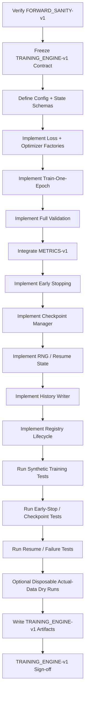
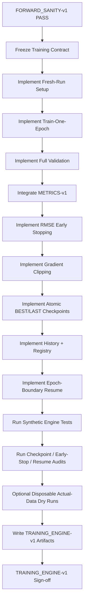

<div align="center">

# PHASE 19 — BASELINE TRAINING ENGINE

## Kế hoạch xây dựng Training Engine dùng chung cho LSTM và Transformer trước các run chính thức

### UCI Appliances Energy Prediction — Multivariate Time-Series Regression

**Phase kế tiếp sau `Phase_18_Forward-pass_sanity_tests.md`**

</div>

---

# 1. Vai trò của Phase 19

Phase 19 chịu trách nhiệm xây dựng **một Training Engine chuẩn, reusable, leakage-safe, reproducible và audit được** cho toàn bộ learned-model experiments của coursework.

Nếu:

```text
Phase 18
→ chứng minh actual data + actual model + actual device forward đúng
```

thì:

```text
Phase 19
→ khóa cách model được train, validate, checkpoint,
early-stop, log và recover.
```

Training Engine phải dùng được cho cả:

```text
LSTM-v1

TRANSFORMER-v1
```

và về sau phải tái sử dụng cho:

```text
Phase 20 — LSTM baseline run
Phase 21 — Transformer B0 run
Phase 23–41 — controlled sweeps
Phase 43 — LSTM tuning
Phase 44 — rolling-origin robustness
Phase 46 — final multi-seed runs
```

Nguyên tắc trung tâm:

\[
\boxed{
Fresh\ Run
+
Deterministic\ Setup
+
Correct\ Optimization
+
Full\ Validation
+
Best\ Checkpoint
+
Early\ Stopping
+
Complete\ Provenance
}
\]

---

# 2. Phase 19 không phải official model-performance run

Đây là distinction rất quan trọng.

Phase 19:

```text
IMPLEMENT
+
VERIFY
Training Engine
```

Phase 20 mới:

```text
TRAIN LSTM baseline chính thức.
```

Phase 21 mới:

```text
TRAIN Transformer B0 chính thức.
```

Do đó Phase 19 không được tạo một random/tiny run rồi gọi:

```text
LSTM baseline result

Transformer baseline result.
```

---

# 3. Output version

Gán:

```text
TRAINING_ENGINE-v1
```

Lineage:

```text
FORWARD_SANITY-v1
        ↓
TRAINING_ENGINE-v1
```

Mọi official learned-model run từ Phase 20 trở đi phải ghi:

```text
training_engine_version = TRAINING_ENGINE-v1.
```

---

# 4. Mục tiêu cần đạt sau Phase 19

Sau Phase 19 phải có:

```text
1. TrainingEngine class/function dùng chung.

2. TrainingRunConfig schema.

3. TrainingState schema.

4. EarlyStoppingState schema.

5. CheckpointManager.

6. History logger.

7. Fresh-run startup protocol.

8. Reproducible seeding protocol.

9. Fresh DataLoader creation protocol.

10. Fresh model creation protocol.

11. Device transfer protocol.

12. Criterion factory.

13. AdamW optimizer factory.

14. Baseline MSE criterion.

15. Baseline AdamW optimizer.

16. No scheduler baseline.

17. Standard train-one-epoch function.

18. Standard validate-one-epoch function.

19. Exact output-target shape guards.

20. Sample-weighted epoch-loss aggregation.

21. Nonfinite loss guard.

22. Backward pass.

23. Gradient norm clipping.

24. Gradient nonfinite fail-fast.

25. Optimizer step order đúng.

26. Full Validation evaluation mỗi epoch.

27. Validation loss aggregation.

28. Validation prediction collection.

29. YS1 prediction inverse transform.

30. Validation MAE Wh mỗi epoch.

31. Validation RMSE Wh mỗi epoch.

32. Validation R² mỗi epoch.

33. Validation RMSE Wh là selection metric.

34. Early stopping dùng Validation RMSE Wh.

35. Patience semantics rõ.

36. Baseline patience = 10.

37. Baseline max epochs = 50.

38. min_delta = 0 baseline.

39. Best checkpoint immediate save.

40. Last checkpoint save mỗi epoch.

41. Best-vs-last distinction.

42. General checkpoint schema.

43. Optimizer state save.

44. Early-stopping state save.

45. RNG-state save policy.

46. DataLoader-generator state save policy.

47. Atomic checkpoint writes.

48. Checkpoint SHA-256.

49. Checkpoint strict load verification.

50. Best-checkpoint re-evaluation verification.

51. Training history schema.

52. Epoch timing.

53. Gradient statistics logging.

54. LR logging.

55. No attention collection during training.

56. No Test access.

57. No full Train metrics mỗi epoch baseline.

58. No AMP baseline.

59. No gradient accumulation baseline.

60. No scheduler baseline.

61. No torch.compile baseline.

62. No EMA/SWA baseline.

63. No silent batch-size fallback.

64. Run registry lifecycle integration.

65. Exception/failure handling.

66. Epoch-boundary resume policy.

67. Resume config-fingerprint checks.

68. Tiny SANITY engine tests.

69. Optional disposable actual-data dry run.

70. Scientific-result exclusion for sanity runs.

71. TRAINING_ENGINE-v1 manifest.

72. Phase 19 sign-off.
```

---

# 5. Những việc Phase 19 không làm

Phase 19 không:

```text
Không chạy official LSTM baseline.

Không chạy official Transformer B0.

Không chọn LSTM vs Transformer.

Không chọn best feature set.

Không tune learning rate.

Không tune weight decay.

Không tune batch size.

Không tune loss.

Không tune patience.

Không tune epoch cap.

Không tune gradient clipping.

Không tune architecture.

Không xem Test.

Không tính Test metrics.

Không extract attention trong training loop.

Không dùng Validation để thay đổi Training Engine sau mỗi run theo kiểu trial-and-error không versioned.
```

---

# 6. Input contract

Phase 19 chỉ bắt đầu khi:

```text
Phase 18 = PASS
```

và:

```text
approved_for_phase19 = true
```

trong:

```text
training_engine_handoff.json.
```

Bắt buộc truy được:

```text
ENV-v1

FEATURESETS-v1
SPLIT-v1
SCALING-v1

WINDOWS-v1
WINDOWPOP-v1

DATALOADERS-v1

METRICS-v1
EXPERIMENTS-v1

LSTM_IMPL-v1

TRANSFORMER_IMPL-v1
ATTENTION_VERIFY-v1

FORWARD_SANITY-v1
```

---

# 7. Training Engine external model contract

Engine không được biết model internals.

Nó chỉ yêu cầu:

```text
model(x)
→ prediction tensor [B,1]
```

và standard PyTorch interface:

```text
model.train()

model.eval()

model.parameters()

model.state_dict()

model.load_state_dict().
```

---

# 8. Engine phải model-agnostic

Cùng TrainingEngine phải train được:

```text
LSTMRegressor

TransformerRegressor
```

không có code kiểu:

```python
if model_name == "LSTM":
    ...
elif model_name == "Transformer":
    ...
```

trong core optimization loop nếu không thật sự cần.

---

# 9. Attention không nằm core training loop

Transformer training path:

```text
model(x)
```

không:

```text
forward_with_attention(x).
```

Reason:

```text
attention weights không cần cho optimization

tốn memory

tốn compute

Phase 52+ mới extract.
```

---

# 10. Persistence baseline không dùng Training Engine

Persistence:

```text
no trainable parameters

no optimizer

no epochs.
```

Phase 14 evaluator riêng.

TRAINING_ENGINE-v1 chỉ cho:

```text
learned PyTorch models.
```

---

# 11. Baseline B0 run-level configuration

Reference shared training configuration:

```text
batch_size = 64

optimizer = AdamW

learning_rate = 3e-4

weight_decay = 1e-4

loss = MSE

max_epochs = 50

early_stopping = True

patience = 10

min_delta = 0.0

gradient_clipping = True

gradient_clip_max_norm = 1.0

gradient_norm_type = 2.0

seed = 42

scheduler = None

mixed_precision = False

gradient_accumulation_steps = 1
```

---

# 12. Model-specific architecture không nằm Training Engine

LSTM fields:

```text
hidden_size
num_layers
dropout
...
```

Transformer fields:

```text
d_model
heads
layers
ffn
...
```

nằm:

```text
model config.
```

Không nhồi vào engine logic.

---

# 13. Data-specific config cũng tách riêng

Examples:

```text
feature_variant_id

lookback

horizon

target_scaling

boundary_protocol

population fingerprint.
```

Experiment Registry hợp nhất:

```text
data config
+
model config
+
training config.
```

---

# 14. TrainingRunConfig

Recommended groups:

```text
optimization

epochs

early stopping

gradient control

runtime

validation

checkpointing

reproducibility.
```

---

# 15. Canonical TrainingRunConfig fields

```text
optimizer_name

learning_rate

weight_decay

criterion_name

max_epochs

early_stopping_enabled

patience

min_delta

gradient_clipping_enabled

gradient_clip_max_norm

gradient_norm_type

batch_size

seed

scheduler_name

mixed_precision

gradient_accumulation_steps

validation_every_n_epochs

checkpoint_best

checkpoint_last_each_epoch

strict_numerical_checks.
```

---

# 16. Baseline validation frequency

Lock:

```text
validation_every_n_epochs = 1.
```

Every completed train epoch:

```text
must run full Validation.
```

---

# 17. Vì sao validation mỗi epoch?

Early stopping được định nghĩa theo:

```text
Validation RMSE Wh.
```

Do đó cần metric sau mỗi epoch.

---

# 18. Baseline scheduler

Lock:

```text
scheduler_name = None.
```

Không thêm:

```text
ReduceLROnPlateau
CosineAnnealing
OneCycle
warmup
```

âm thầm.

---

# 19. Vì sao không scheduler baseline?

Master protocol chưa có scheduler sweep.

Giữ:

```text
learning-rate semantics rõ

controlled experiments đơn giản.
```

---

# 20. Baseline mixed precision

Lock:

```text
mixed_precision = False.
```

Không dùng:

```text
autocast
GradScaler
```

trong v1 baseline.

---

# 21. Gradient accumulation

Lock:

```text
gradient_accumulation_steps = 1.
```

Mỗi batch:

```text
one backward
one optimizer step.
```

---

# 22. No `torch.compile` baseline

Lock:

```text
compiled_model = False.
```

Lý do:

```text
giảm runtime/compiler variability

giữ debugging/checkpoint behavior đơn giản.
```

---

# 23. No EMA/SWA

Không:

```text
Exponential Moving Average

Stochastic Weight Averaging.
```

---

# 24. No warmup

Không.

---

# 25. No model-specific tricks

LSTM và Transformer cùng Training Engine semantics.

---

# 26. Fresh-run startup protocol

Official run phải bắt đầu theo đúng thứ tự:

```text
1. Verify upstream contracts.

2. Register run.

3. Set deterministic/reproducibility settings.

4. Seed RNGs.

5. Create fresh DataLoaders.

6. Instantiate fresh model.

7. Move model to device.

8. Create criterion.

9. Create optimizer.

10. Initialize TrainingState.

11. Start registry run.

12. Enter epoch loop.
```

---

# 27. Không đảo seed/model creation

Sai:

```text
instantiate model
→ then set seed.
```

Correct:

```text
set seed
→ instantiate model.
```

---

# 28. Không reuse Phase 18 objects

Hard:

```text
fresh DataLoader

fresh model.
```

Phase 18 đã tiêu hao RNG states.

---

# 29. Fresh Train generator

Train DataLoader phải có:

```text
fresh torch.Generator
```

được seed từ:

```text
run seed
```

theo DATALOADERS-v1.

---

# 30. Validation loader

Recreated fresh, but:

```text
shuffle=False.
```

---

# 31. Test loader không cần create cho development run

Preferred:

```text
do not materialize Test loader
```

trong Phase 20–46 development training.

---

# 32. Test firewall

TrainingEngine development mode:

```text
allowed splits:
TRAIN
VALIDATION

forbidden:
TEST.
```

---

# 33. Run registration phải trước training

EXPERIMENTS-v1 flow:

```text
register_run()

start_run()

...
complete_run()
```

Failure:

```text
fail_run().
```

---

# 34. TrainingEngine version in registry

Mandatory:

```text
training_engine_version = TRAINING_ENGINE-v1.
```

---

# 35. Seed fields

Registry/config phải lưu:

```text
seed

DataLoader seed policy

deterministic-mode fields.
```

---

# 36. Reproducibility caveat

PyTorch không đảm bảo bitwise reproduction giữa:

```text
mọi release
mọi platform
CPU/GPU
```

ngay cả với cùng seed.

Project reproducibility scope là:

```text
fixed code
fixed environment
fixed device class
fixed configs
fixed seeds
fixed data artifacts.
```

---

# 37. Seed ownership

One run seed drives:

```text
Python RNG

NumPy RNG

PyTorch RNG

DataLoader generator policy
```

theo ENV-v1/DATALOADERS-v1.

---

# 38. Engine không thay global deterministic policy tùy model

Không:

```text
LSTM deterministic mode khác
Transformer mode khác.
```

---

# 39. Device resolution

Dùng ENV-v1 resolver:

```text
CUDA
→ MPS
→ CPU
```

theo environment contract.

Record actual selected device.

---

# 40. Batch host/device split

Training batch:

```text
x
→ device

y_model
→ device
```

Metadata:

```text
y_raw_wh
sample_idx
```

có thể giữ CPU.

---

# 41. Validation y_raw_wh

Giữ:

```text
CPU original Wh
```

để build PredictionBundle.

---

# 42. No sample_idx GPU transfer required

Keep CPU.

---

# 43. Non-blocking transfer

Use DATALOADERS-v1 helper/policy.

Không hard-code:

```text
non_blocking=True
```

cho mọi backend.

---

# 44. Criterion factory

Recommended:

```text
build_criterion(config)
```

Core interface:

```text
criterion(pred, y_model)
→ scalar.
```

---

# 45. Baseline criterion

```python
torch.nn.MSELoss(reduction="mean")
```

---

# 46. Exact loss shape guard

Before criterion:

\[
prediction.shape=y_{model}.shape
\]

Hard.

---

# 47. Không dựa broadcasting

If:

```text
pred [B]
target [B,1]
```

→ FAIL.

---

# 48. MSE is model-space optimization objective

YS0:

```text
loss in Wh²-like model space.
```

YS1:

```text
loss in standardized-target squared units.
```

Do not compare optimization loss across YS0/YS1 as performance.

---

# 49. Loss vs metric separation

Training Engine records:

```text
train_loss_model_space

validation_loss_model_space.
```

Selection uses:

```text
validation_rmse_wh.
```

---

# 50. Criterion extensibility

TRAINING_ENGINE-v1 nên thiết kế criterion interface đủ generic để Phase 37 plug:

```text
Huber
```

mà không rewrite epoch loop.

Core baseline verification chỉ bắt buộc:

```text
MSE.
```

---

# 51. Optimizer factory

Recommended:

```text
build_optimizer(model, training_config)
```

Baseline:

```python
torch.optim.AdamW(
    model.parameters(),
    lr=3e-4,
    weight_decay=1e-4,
)
```

---

# 52. AdamW semantics

AdamW dùng:

```text
decoupled weight decay
```

thay vì cộng weight decay trực tiếp vào momentum/variance accumulation như classic coupled L2 treatment.

Use official PyTorch optimizer.

---

# 53. AdamW defaults

Không cần override nếu protocol không yêu cầu:

```text
betas
eps
amsgrad
foreach
fused
```

Dùng stable defaults của installed PyTorch và log version.

---

# 54. Do not set fused=True baseline

Không lock backend-specific fused optimizer path.

---

# 55. Do not set foreach=True baseline

Leave:

```text
foreach=None
```

unless environment contract explicitly changes.

---

# 56. Optimizer parameter source

Use:

```text
model.parameters()
```

không manually omit groups.

---

# 57. Weight decay applies to all model parameters baseline

No custom no-decay parameter groups for:

```text
bias
LayerNorm.
```

This would be a new optimization choice.

---

# 58. No frozen parameters baseline

All intended model trainable parameters:

```text
requires_grad=True.
```

---

# 59. Core train-batch order

Hard sequence:

```text
1. Move x/y_model to device.

2. optimizer.zero_grad(set_to_none=True)

3. prediction = model(x)

4. Assert prediction.shape == y_model.shape.

5. loss = criterion(prediction, y_model)

6. Assert loss finite.

7. loss.backward()

8. Gradient norm / clipping.

9. Assert gradient norm finite.

10. optimizer.step()

11. Accumulate sample-weighted loss/statistics.
```

---

# 60. `zero_grad(set_to_none=True)`

Use:

```python
optimizer.zero_grad(set_to_none=True)
```

Current PyTorch default also uses `set_to_none=True`.

Benefits include:

```text
lower memory footprint
possible modest performance benefit
```

with known semantics that parameters receiving no gradient retain `.grad=None`.

---

# 61. Why zero gradients before forward/backward?

Gradients accumulate by default.

Every baseline batch is an independent optimizer step.

---

# 62. No gradient accumulation

Therefore:

```text
zero_grad
every batch.
```

---

# 63. Prediction finite guard

Recommended strict check:

```text
torch.isfinite(prediction).all()
```

at least in baseline engine strict mode.

If nonfinite:

```text
FAIL run.
```

---

# 64. Loss finite guard

Hard:

```text
torch.isfinite(loss).
```

No optimizer step if loss nonfinite.

---

# 65. No NaN skip policy

Không:

```text
if NaN:
    continue
```

Skipping bad batches changes training population silently.

---

# 66. Backward

Use:

```python
loss.backward()
```

after finite loss.

---

# 67. Gradient clipping baseline

Enabled:

```text
max_norm = 1.0

norm_type = 2.0.
```

Use:

```python
torch.nn.utils.clip_grad_norm_(
    model.parameters(),
    max_norm=1.0,
    norm_type=2.0,
    error_if_nonfinite=True,
)
```

---

# 68. `clip_grad_norm_` ordering

Must happen:

```text
after backward

before optimizer.step.
```

---

# 69. Why `error_if_nonfinite=True`?

TRAINING_ENGINE-v1 chooses fail-fast behavior:

```text
NaN/Inf gradient norm
→ error
→ FAILED run
```

rather than silently applying a corrupted step.

---

# 70. Gradient norm return value

`clip_grad_norm_` returns:

```text
total norm of gradients
```

while modifying gradients in-place when clipping is needed.

Record returned norm as:

```text
grad_norm_preclip.
```

---

# 71. `foreach` clipping policy

Leave:

```text
foreach=None.
```

Current PyTorch can use optimized foreach implementation on supported native CPU/CUDA tensors and fall back otherwise.

This is more portable across:

```text
CPU
CUDA
MPS.
```

---

# 72. Gradient clipping statistic

For each batch:

```text
was_clipped =
grad_norm_preclip > max_norm.
```

---

# 73. Epoch gradient diagnostics

Record:

```text
mean_grad_norm_preclip

max_grad_norm_preclip

fraction_batches_clipped.
```

---

# 74. Gradient stats are diagnostics

Do not select model based on:

```text
lowest gradient norm.
```

---

# 75. Optimizer step

Only after:

```text
finite loss

successful backward

finite gradient norm/clipping.
```

---

# 76. No optimizer step on invalid batch

Hard fail run.

---

# 77. Training loss aggregation

Criterion:

```text
reduction="mean".
```

Do not average batch means equally.

Use sample-weighted aggregation:

\[
Loss_{train}
=
\frac{
\sum_b loss_b\times n_b
}{
\sum_b n_b
}
\]

---

# 78. Why sample-weighted?

Because:

```text
drop_last=False
```

last batch may be smaller.

---

# 79. Single-output nuance

Current prediction:

```text
[B,1]
```

so MSE mean over elements aligns with per-sample mean.

If future multi-output task changes:

```text
aggregation semantics must be revisited.
```

---

# 80. Train sample count audit

At epoch end:

```text
train_samples_seen
```

must equal expected Train sample count if sampler uses every sample once.

---

# 81. No accidental sample loss

If:

```text
drop_last=False
```

expected:

\[
samples\_seen=|Train|.
\]

---

# 82. Duplicate sample-ID audit in training?

Train loader shuffled IDs.

Optional debug/first-engine tests can collect IDs to prove:

```text
exactly-once coverage.
```

Official every-epoch collection may add overhead.

DATALOADERS-v1 already protects sampler semantics.

---

# 83. Train epoch function

Recommended:

```text
train_one_epoch(...)
```

Output:

```text
TrainEpochResult.
```

---

# 84. TrainEpochResult fields

```text
epoch

n_samples

n_batches

loss_model_space

mean_grad_norm_preclip

max_grad_norm_preclip

fraction_batches_clipped

learning_rate

duration_seconds

status.
```

---

# 85. No full Train MAE/RMSE every epoch baseline

To avoid extra full-pass compute:

```text
training loss
```

is sufficient learning diagnostic per epoch.

---

# 86. Full Train metrics can be computed later if needed

Phase 22 diagnostics may request selective evaluation.

Not required core engine behavior.

---

# 87. Validation function

Recommended:

```text
validate_one_epoch(...)
```

Must:

```text
model.eval()

torch.inference_mode()

iterate full Validation loader.
```

---

# 88. Validation loader

Hard:

```text
shuffle=False.
```

---

# 89. Validation uses full population

No:

```text
first N batches only.
```

Primary metric must use:

```text
100% WINDOWPOP-v1 Validation IDs.
```

---

# 90. Validation no gradients

Use:

```python
with torch.inference_mode():
    ...
```

---

# 91. Validation model path

Transformer:

```text
model(x)
```

not attention extraction.

---

# 92. Validation per-batch operations

```text
move x/y_model

prediction = model(x)

shape assert

finite prediction

validation loss

collect prediction model-space

collect y_raw_wh

collect sample_idx.
```

---

# 93. Validation loss aggregation

Same sample-weighted formula:

\[
Loss_{val}
=
\frac{
\sum_b loss_b n_b
}{
\sum_b n_b
}
\]

---

# 94. Validation predictions are collected over full split

After loop:

```text
concatenate

validate population

sort/alignment

convert prediction to Wh

compute METRICS-v1.
```

---

# 95. YS0 validation prediction conversion

```text
identity.
```

---

# 96. YS1 validation prediction conversion

```text
frozen Y scaler inverse_transform.
```

---

# 97. Ground-truth source

Use:

```text
y_raw_wh
```

from DataLoader.

Do not reconstruct ground truth unnecessarily.

---

# 98. Validation PredictionBundle

Must contain:

```text
run_id

split_id = VALIDATION

sample_idx

y_true_wh

y_pred_wh

population_fingerprint

model_id

target_scaling_option.
```

---

# 99. METRICS-v1 only

Validation:

```text
MAE Wh

RMSE Wh

R².
```

Do not compute custom alternatives in engine.

---

# 100. Primary selection metric

Hard:

```text
validation_rmse_wh.
```

---

# 101. Validation loss is not selection metric

Even if:

```text
MSE loss
```

correlates with RMSE under same scaling, project contract uses:

```text
Validation RMSE Wh.
```

---

# 102. Why Wh selection metric matters?

It keeps model selection comparable across:

```text
YS0

YS1.
```

---

# 103. Early stopping metric

Hard:

```text
Validation RMSE Wh.
```

---

# 104. Early stopping mode

```text
MIN.
```

Lower is better.

---

# 105. Baseline patience

```text
10 epochs.
```

---

# 106. Baseline min_delta

Lock:

```text
0.0.
```

No additional threshold tuned.

---

# 107. Improvement rule

Current epoch improves if:

\[
RMSE_{current}
<
RMSE_{best}-min\_delta
\]

With:

```text
min_delta=0
```

this is strict:

\[
RMSE_{current}<RMSE_{best}.
\]

---

# 108. Equal RMSE does not replace best checkpoint

If exactly equal full-precision RMSE:

```text
keep earlier best.
```

This preserves deterministic tie behavior.

---

# 109. First epoch

After first valid Validation:

```text
best_rmse = current_rmse

best_epoch = 1

bad_epochs = 0

save best checkpoint.
```

---

# 110. Subsequent improvement

If improved:

```text
best_rmse = current

best_epoch = epoch

bad_epochs = 0

save best checkpoint.
```

---

# 111. No improvement

```text
bad_epochs += 1.
```

---

# 112. Early-stop trigger

Stop after epoch if:

```text
bad_epochs >= patience.
```

With patience 10:

```text
10 consecutive non-improving completed validation epochs
```

trigger stop.

---

# 113. Early stopping does not terminate mid-epoch

Only:

```text
after full Train epoch
+
full Validation
+
checkpoint/history save.
```

---

# 114. Epoch cap

Hard maximum:

```text
50 baseline.
```

If no early stop:

```text
training ends after epoch 50.
```

---

# 115. E100 later

Phase 38 can set:

```text
max_epochs=100
```

using same engine.

---

# 116. Patience sensitivity later

Planned sensitivity:

```text
8
10
12
```

if required.

Same engine config.

---

# 117. Best epoch is not necessarily last epoch

Therefore both:

```text
best_checkpoint

last_checkpoint
```

must exist.

---

# 118. Best checkpoint purpose

Used for:

```text
official Validation result

later candidate evaluation

prediction analysis

final downstream evaluation if selected.
```

---

# 119. Last checkpoint purpose

Used for:

```text
resume/recovery

debugging

training-state continuity.
```

---

# 120. Best checkpoint save timing

Save immediately when Validation RMSE improves.

Do not keep only:

```text
best_model_state = model.state_dict()
```

in memory without copying/serializing.

PyTorch documentation notes `state_dict()` returns a reference-like mapping to live tensors; subsequent training can otherwise mutate the supposed “best” state.

---

# 121. Preferred best-state policy

```text
atomic serialize best checkpoint immediately.
```

This avoids reference-mutation mistakes.

---

# 122. General checkpoint format

Use dictionary containing at minimum:

```text
checkpoint_schema_version

checkpoint_type

run_id

epoch

model_family

model_version

implementation_version

training_engine_version

run_config

config_fingerprint

model_state_dict

optimizer_state_dict

best_epoch

best_validation_rmse_wh

bad_epochs

early_stopping_state

training_history_summary

feature_variant_id

feature_fingerprint

split_version

scaling_version

window_version

population_version

population_fingerprint

metric_version

seed

device_metadata

rng_state_bundle

train_generator_state

created_at.
```

---

# 123. Scheduler state

Baseline:

```text
scheduler_state_dict = null.
```

---

# 124. AMP scaler state

Baseline:

```text
amp_scaler_state = null.
```

---

# 125. Why optimizer state is needed?

PyTorch optimizer `state_dict` contains optimizer internal state and hyperparameters needed to resume training faithfully.

---

# 126. Best checkpoint optimizer state

Can be saved in same general checkpoint for complete provenance.

Even if final inference only needs model state, comprehensive checkpoint helps audit/recovery.

---

# 127. Last checkpoint optimizer state

Mandatory for resume.

---

# 128. Checkpoint type enum

```text
BEST

LAST.
```

---

# 129. Best checkpoint filename

```text
best_checkpoint.pt
```

---

# 130. Last checkpoint filename

```text
last_checkpoint.pt
```

---

# 131. Atomic checkpoint write

Procedure:

```text
serialize to temporary path

flush/close

atomic replace target path

compute SHA-256

register artifact.
```

---

# 132. Why atomic write?

Crash during save should not leave:

```text
half-written checkpoint
```

looking valid.

---

# 133. Checkpoint checksum

After each final file save:

```text
SHA-256.
```

---

# 134. Last checkpoint overwrite policy

`last_checkpoint.pt` may be atomically replaced each epoch.

Registry retains:

```text
current checksum

epoch.
```

Training history preserves progression.

---

# 135. Best checkpoint overwrite policy

Only replace when:

```text
strict RMSE improvement.
```

---

# 136. Optional historical epoch checkpoints

Not baseline requirement.

Avoid storing 50 large checkpoints.

---

# 137. Training history is source for epoch chronology

Not every epoch needs model file.

---

# 138. RNG-state capture

For epoch-boundary resume, capture available states:

```text
Python random

NumPy

PyTorch CPU RNG

active accelerator RNG state where supported

Train DataLoader generator state.
```

---

# 139. Exact resume scope

TRAINING_ENGINE-v1 supports:

```text
epoch-boundary resume
```

not arbitrary mid-batch replay.

---

# 140. Mid-epoch crash

Resume from:

```text
last successfully completed epoch checkpoint.
```

The interrupted partial epoch is discarded/re-run.

---

# 141. Why epoch-boundary resume?

Much simpler and less error-prone than serializing:

```text
sampler iterator position

worker internal state

partial optimizer step context.
```

---

# 142. Resume config must match

Hard:

```text
config_fingerprint
```

must equal checkpoint.

---

# 143. Resume upstream lineage must match

Hard:

```text
feature fingerprint

population fingerprint

scaler identity

model implementation

training engine version.
```

---

# 144. Resume model load

Use:

```text
strict=True.
```

---

# 145. Resume optimizer load

Restore:

```text
optimizer_state_dict.
```

---

# 146. Resume RNG

Restore saved states where supported in same environment.

---

# 147. Resume Train generator

Restore:

```text
train_generator_state
```

to preserve next-epoch shuffle stream.

---

# 148. Resume epoch

If last completed:

```text
epoch = k
```

resume:

```text
k+1.
```

---

# 149. Resume early-stop state

Restore:

```text
best_rmse

best_epoch

bad_epochs.
```

---

# 150. Resume does not reset patience

Hard.

---

# 151. Resume history

Load existing:

```text
training_history.csv
```

and append/rewrite from next epoch.

---

# 152. Resume status in Registry

Use Phase 13 policy:

```text
same run ID
```

only if resume is valid same config run.

Increment:

```text
resume_count.
```

---

# 153. Different config after failure

New:

```text
run_id.
```

---

# 154. Checkpoint load across devices

Loader must support:

```text
map_location
```

so checkpoint can be verified/recovered on available device/CPU.

---

# 155. Inference restore mode

After loading for evaluation:

```text
model.eval().
```

---

# 156. Training restore mode

After resume setup:

```text
model.train()
```

at next epoch start.

---

# 157. Checkpoint strict verification

After save, optionally lightweight:

```text
open/read metadata
verify run_id
epoch
fingerprints
```

At end of run, perform full best-checkpoint reconstruction.

---

# 158. Best-checkpoint final verification

After training stops:

```text
instantiate fresh model same config

load best checkpoint strict

model.eval()

run full Validation

recompute METRICS-v1.
```

Expected:

```text
reproduced RMSE
≈ recorded best RMSE.
```

---

# 159. Why re-evaluate best checkpoint?

Catches:

```text
corrupt save

wrong checkpoint path

state mismatch

registry/history mismatch.
```

---

# 160. Best verification is not new model selection

It verifies already-selected checkpoint.

Do not compare additional checkpoints after training.

---

# 161. Best metric consistency tolerance

Because same device/config/weights should reproduce closely.

Use explicit:

```text
atol/rtol
```

for metrics/predictions where needed.

RMSE artifact can compare numeric tolerance.

---

# 162. Best checkpoint validation prediction artifact

Official run phases may save:

```text
best_validation_predictions.csv
```

after successful best-checkpoint verification.

Phase 19 only defines schema.

---

# 163. Training history schema

Create one row per completed epoch.

Fields:

```text
run_id

epoch

train_loss_model_space

validation_loss_model_space

validation_mae_wh

validation_rmse_wh

validation_r2

train_samples_seen

validation_samples_seen

train_batches

validation_batches

learning_rate

mean_grad_norm_preclip

max_grad_norm_preclip

fraction_batches_clipped

is_best

best_epoch_so_far

best_validation_rmse_wh_so_far

bad_epochs_after_epoch

early_stop_triggered

epoch_duration_seconds

train_duration_seconds

validation_duration_seconds

checkpoint_best_updated

checkpoint_last_updated

status.
```

---

# 164. No rounding in history source

Store:

```text
full numeric precision.
```

Presentation rounds later.

---

# 165. LR logging

Read actual optimizer param-group LR.

Baseline should stay:

```text
3e-4
```

because no scheduler.

---

# 166. Multiple optimizer parameter groups baseline?

No.

Expected:

```text
one group.
```

If more:

```text
log all or validate planned behavior.
```

---

# 167. History write policy

Because max 50/100 rows:

```text
atomic rewrite after every completed epoch
```

is simple and robust.

---

# 168. Why not only keep history in memory?

Crash would lose progress diagnostics.

---

# 169. History and checkpoint ordering

Recommended end-of-epoch transaction:

```text
1. Complete Validation.

2. Determine improvement.

3. Update early-stop state.

4. Save BEST if improved.

5. Save LAST checkpoint.

6. Update/write training history atomically.

7. Register updated artifacts/checksums.

8. If patience reached, break.
```

---

# 170. Why save before stopping?

Early-stop epoch must remain:

```text
fully auditable/resumable.
```

---

# 171. Epoch number convention

Use:

```text
1-based epoch numbers
```

in human/registry artifacts.

Internal loops can be zero-based but convert explicitly.

---

# 172. Batch number convention

Optional logs may use:

```text
1-based batch number
```

for readability.

---

# 173. TrainingState

Recommended fields:

```text
current_epoch

best_epoch

best_validation_rmse_wh

bad_epochs

early_stop_triggered

completed_epochs

global_optimizer_steps

status.
```

---

# 174. global_optimizer_steps

Increment once per train batch baseline.

---

# 175. Expected optimizer-step count

Per epoch:

```text
len(train_loader)
```

because no gradient accumulation and no skipped batches.

---

# 176. No skipped batch

Hard unless run fails.

---

# 177. Progress logging

Console/progress bar optional.

Must not be source of truth.

---

# 178. Per-batch console loss

Can display but do not store every batch globally unless debugging.

Epoch summaries sufficient.

---

# 179. Structured run log

Recommended:

```text
training.log
```

for:

```text
startup config

epoch summary

checkpoint events

early stopping

failures.
```

---

# 180. Do not parse console log for final numbers

Source:

```text
training_history.csv

metric artifacts

registry.
```

---

# 181. Validation population guard every epoch

METRICS-v1 must verify:

```text
observed Validation IDs
=
expected WINDOWPOP-v1 Validation IDs.
```

---

# 182. Why every epoch?

A loader bug/reconfiguration should never silently produce partial primary metric.

---

# 183. Validation ordering

Prediction bundle sorted/aligned by canonical sample IDs/timestamps before artifact save.

---

# 184. Validation metrics on full concatenated arrays

Do not:

```text
mean(batch_RMSE).
```

---

# 185. Validation RMSE checkpoint selection precision

Use:

```text
raw full-precision metric.
```

Not rounded display.

---

# 186. R² undefined handling

Main Validation expected finite.

If METRICS-v1 returns undefined status:

```text
run cannot use that R²
```

but selection RMSE may still exist.

However unusual full Validation constant target should be investigated as data-contract anomaly.

---

# 187. Early stopping uses only RMSE

R²/MAE do not influence patience.

---

# 188. No composite score

No:

```text
0.5 RMSE + 0.5 MAE.
```

---

# 189. No baseline-threshold stopping

Do not stop just because model has not yet beaten Persistence.

---

# 190. No training-loss stopping

Not primary early-stop trigger.

---

# 191. No Test stopping

Forbidden.

---

# 192. Failure handling architecture

Wrap run-level execution:

```text
try:
    train
except:
    preserve artifacts
    fail registry run
    re-raise/report.
```

---

# 193. Do not swallow exceptions

Hard.

---

# 194. Failure record

Include:

```text
failure_type

epoch

batch if known

exception class

message

traceback path

last valid checkpoint path.
```

---

# 195. Numerical failure

If:

```text
NaN/Inf loss

NaN/Inf gradient norm

NaN/Inf prediction
```

mark:

```text
NUMERICAL_ERROR.
```

---

# 196. OOM

Mark:

```text
OOM_ERROR.
```

Do not automatically reduce batch size and continue same run.

---

# 197. Device error

Mark appropriate runtime failure.

---

# 198. Metric failure

If Validation population or metric guard fails:

```text
METRIC_ERROR
or
WINDOW/DATALOADER contract error
```

according to taxonomy.

---

# 199. Checkpoint failure

Do not mark run completed without valid best checkpoint.

---

# 200. Registry failure

If critical registry write fails:

```text
do not silently proceed as untracked scientific run.
```

---

# 201. Interrupt handling

Keyboard/process interruption:

```text
preserve last completed checkpoint
```

if available.

Status:

```text
FAILED/INTERRUPTED
```

per registry taxonomy.

---

# 202. Resume from incomplete current epoch?

No.

Resume from last completed epoch.

---

# 203. Training completion conditions

One of:

```text
EARLY_STOPPED

MAX_EPOCHS_REACHED.
```

---

# 204. Completion requires best checkpoint

Even if max epoch reached.

---

# 205. Completion requires history

Hard.

---

# 206. Completion requires best-checkpoint validation verification

Hard for official learned-model run.

---

# 207. Completion requires metric artifact

At minimum:

```text
best Validation MAE/RMSE/R².
```

---

# 208. Completion requires registry artifact checks

Checkpoint/history/metric paths registered.

---

# 209. Run result object

Recommended:

```text
TrainingRunResult
```

Fields:

```text
run_id

status

stop_reason

epochs_completed

best_epoch

best_validation_mae_wh

best_validation_rmse_wh

best_validation_r2

best_checkpoint_path

best_checkpoint_sha256

last_checkpoint_path

last_checkpoint_sha256

history_path

duration_seconds

warnings.
```

---

# 210. Stop reason enum

```text
EARLY_STOPPING

MAX_EPOCHS

FAILED

CANCELLED.
```

---

# 211. No Test fields in TrainingRunResult

Development result does not include Test.

---

# 212. Engine should return best Validation result

Not last-epoch metrics by default.

---

# 213. Last epoch metrics still in history

For diagnostics.

---

# 214. Best-checkpoint registry metric

Register:

```text
VALIDATION
MAE Wh
RMSE Wh
R²
```

for best checkpoint.

---

# 215. Training history per-epoch metrics remain run artifact

Do not flood global metric registry with every epoch unless registry design explicitly supports it.

---

# 216. Global metric registry scope

Recommended:

```text
best Validation checkpoint metrics
```

only for model-selection queries.

---

# 217. Model-selection eligibility

Official training run:

```text
eligible_for_model_selection=True
```

only after:

```text
COMPLETED

best checkpoint verified

metrics PASS.
```

---

# 218. Sanity engine test runs

```text
eligible_for_model_selection=False.
```

---

# 219. Training Engine verification strategy

Phase 19 must verify engine via:

```text
A. Pure synthetic tiny training test

B. Checkpoint/early-stop deterministic fixtures

C. Optional disposable tiny actual-data dry run
```

---

# 220. A — Synthetic tiny training test

Use small:

```text
TensorDataset / contract-compatible fake batches

simple tiny model
```

or actual LSTM/Transformer with tiny dimensions.

Goal:

```text
exercise:
forward
backward
optimizer
validation
metrics-compatible plumbing
checkpointing.
```

---

# 221. Synthetic test should not use Test split

No relevance.

---

# 222. B — Early-stopping deterministic fixture

Do not rely on real learning dynamics to test patience.

Create controlled metric sequence such as:

```text
10.0
9.0
9.0
9.1
9.2
...
```

and unit-test state machine directly.

---

# 223. Why state-machine fixture?

Early stopping logic can be proven without expensive training.

---

# 224. Early-stop test with patience=3

Example metrics:

```text
epoch1 10.0 → best

epoch2 9.0 → best

epoch3 9.1 → bad=1

epoch4 9.2 → bad=2

epoch5 9.3 → bad=3 → STOP.
```

---

# 225. Improvement reset test

Example:

```text
bad=2

next RMSE improves
→ bad=0.
```

---

# 226. Tie test

Same RMSE:

```text
not improvement.
```

---

# 227. min_delta test

Even though baseline 0:

Engine generic logic unit-test positive min_delta.

Do not use positive min_delta in baseline run.

---

# 228. Max-epoch test

No early stop sequence:

```text
ends exactly at configured max_epochs.
```

---

# 229. C — Optional actual-data dry run

Can use:

```text
small deterministic Train subset

small Validation subset

1–2 epochs

disposable fresh model.
```

Purpose:

```text
integration of backward + optimizer + checkpoint
on actual tensors.
```

---

# 230. Actual-data dry run is SANITY only

Must be explicitly marked:

```text
execution_type=SANITY

eligible_for_model_selection=False.
```

---

# 231. Do not use dry-run metric as Phase 20 result

Hard.

---

# 232. Dry-run subset does not alter WINDOWPOP-v1 scientific population

It is implementation test only.

Do not register subset metrics as official Validation metrics.

---

# 233. Could skip actual-data dry run?

Yes if:

```text
synthetic Training Engine tests PASS

Phase 18 actual forward PASS
```

and user wants minimal time.

But one 1-epoch disposable actual-data dry run is recommended before long official runs.

---

# 234. Dry-run model choice

Could test:

```text
LSTM
and
Transformer
```

for one or few batches.

Since Phase 18 already forward-tested both, Phase 19 dry run can prioritize:

```text
generic engine path
```

and one short backward for each model if feasible.

---

# 235. No full Validation in dry-run subset test labeled official

If testing validation function, use:

```text
temporary expected-population fixture
```

separate from METRICS-v1 production population guard.

Or run full real Validation once with untrained/briefly trained disposable model but mark SANITY—not scientific.

---

# 236. Preferred actual dry-run approach

Use:

```text
few Train batches
+
full Validation
```

only if cheap enough, to exercise production validation population guard.

Metrics remain SANITY and excluded.

---

# 237. Training Engine unit-test categories

```text
CONFIG

SEEDING

FRESH_OBJECTS

TRAIN_STEP

LOSS_AGGREGATION

GRADIENT_CLIPPING

VALIDATION

METRICS

EARLY_STOPPING

CHECKPOINT

RESUME

HISTORY

REGISTRY

FAILURE_HANDLING

TEST_FIREWALL.
```

---

# 238. Test TE19-001

Training config validates.

---

# 239. Test TE19-002

Invalid LR <=0 rejected.

---

# 240. Test TE19-003

Invalid weight decay <0 rejected.

---

# 241. Test TE19-004

max_epochs <=0 rejected.

---

# 242. Test TE19-005

patience <=0 rejected when early stopping enabled.

---

# 243. Test TE19-006

gradient max norm <=0 rejected when clipping enabled.

---

# 244. Test TE19-007

validation_every_n_epochs !=1 rejected for v1 baseline.

---

# 245. Test TE19-008

mixed_precision=True rejected for baseline v1 contract.

---

# 246. Test TE19-009

gradient accumulation !=1 rejected for baseline v1.

---

# 247. Test TE19-010

scheduler non-null rejected for baseline config.

---

# 248. Test TE19-011

fresh seed before model instantiation verified.

---

# 249. Test TE19-012

fresh Train generator created.

---

# 250. Test TE19-013

Phase 18 object reuse guard.

---

# 251. Test TE19-014

prediction-target shape mismatch raises.

---

# 252. Test TE19-015

finite MSE train step succeeds.

---

# 253. Test TE19-016

nonfinite loss fails before optimizer step.

---

# 254. Test TE19-017

zero_grad called each batch semantics.

---

# 255. Test TE19-018

backward generates gradients.

---

# 256. Test TE19-019

clip_grad_norm_ runs after backward.

---

# 257. Test TE19-020

nonfinite grad norm raises/fails.

---

# 258. Test TE19-021

optimizer step occurs after clipping.

---

# 259. Test TE19-022

one optimizer step per valid batch.

---

# 260. Test TE19-023

sample-weighted Train loss aggregation correct.

---

# 261. Test TE19-024

partial last batch does not bias epoch loss.

---

# 262. Test TE19-025

model.train() active in train epoch.

---

# 263. Test TE19-026

model.eval() active in Validation.

---

# 264. Test TE19-027

Validation inference mode has no gradients.

---

# 265. Test TE19-028

Validation sample-weighted loss correct.

---

# 266. Test TE19-029

Validation full population guard invoked.

---

# 267. Test TE19-030

YS1 prediction inverse-transform invoked.

---

# 268. Test TE19-031

METRICS-v1 returns MAE/RMSE/R².

---

# 269. Test TE19-032

Selection metric = Validation RMSE Wh.

---

# 270. Test TE19-033

Validation loss cannot replace selection metric.

---

# 271. Test TE19-034

First epoch becomes best.

---

# 272. Test TE19-035

Strict lower RMSE improves best.

---

# 273. Test TE19-036

Equal RMSE does not improve.

---

# 274. Test TE19-037

bad_epochs increments.

---

# 275. Test TE19-038

improvement resets bad_epochs.

---

# 276. Test TE19-039

patience trigger exact.

---

# 277. Test TE19-040

max epoch stop exact.

---

# 278. Test TE19-041

best checkpoint saved immediately.

---

# 279. Test TE19-042

last checkpoint saved each epoch.

---

# 280. Test TE19-043

best and last can differ.

---

# 281. Test TE19-044

checkpoint includes model state.

---

# 282. Test TE19-045

checkpoint includes optimizer state.

---

# 283. Test TE19-046

checkpoint includes early-stop state.

---

# 284. Test TE19-047

checkpoint includes lineage fingerprints.

---

# 285. Test TE19-048

checkpoint atomic write succeeds.

---

# 286. Test TE19-049

checkpoint checksum validates.

---

# 287. Test TE19-050

strict state_dict restore succeeds.

---

# 288. Test TE19-051

wrong config fingerprint resume rejected.

---

# 289. Test TE19-052

wrong population fingerprint resume rejected.

---

# 290. Test TE19-053

resume starts at last_epoch+1.

---

# 291. Test TE19-054

resume preserves best metric.

---

# 292. Test TE19-055

resume preserves bad_epochs.

---

# 293. Test TE19-056

resume restores optimizer state.

---

# 294. Test TE19-057

resume generator state policy works in fixed test.

---

# 295. Test TE19-058

history row count equals completed epochs.

---

# 296. Test TE19-059

history full precision source values.

---

# 297. Test TE19-060

best checkpoint re-evaluation matches recorded metric.

---

# 298. Test TE19-061

attention extraction not called during Transformer training.

---

# 299. Test TE19-062

Test split request rejected.

---

# 300. Test TE19-063

SANITY run excluded from model selection.

---

# 301. Test TE19-064

exception transitions Registry to FAILED.

---

# 302. Test TE19-065

OOM does not silently change batch size.

---

# 303. Test TE19-066

failed run preserves last valid checkpoint.

---

# 304. Test TE19-067

completed run requires verified best checkpoint.

---

# 305. Test TE19-068

TrainingRunResult returns best, not last, Validation result.

---

# 306. Test TE19-069

parameter updates occur in synthetic training test.

---

# 307. Test TE19-070

parameter updates do not occur in Validation.

---

# 308. Training-engine dry-run checks

If actual disposable dry run enabled, additionally:

```text
actual LSTM one-epoch train path

actual Transformer one-epoch train path

actual gradient clipping

actual full Validation

actual checkpoint save/load.
```

All outputs labeled:

```text
SANITY_ONLY.
```

---

# 309. Training Engine source structure

Recommended:

```text
src/
└── training/
    ├── engine.py
    ├── configs.py
    ├── losses.py
    ├── optimizers.py
    ├── early_stopping.py
    ├── checkpointing.py
    ├── history.py
    ├── rng_state.py
    └── validation.py
```

---

# 310. `engine.py`

Contains:

```text
TrainingEngine

train_one_epoch()

validate_one_epoch()

fit().
```

---

# 311. `configs.py`

Contains:

```text
TrainingRunConfig

TrainingState

TrainingRunResult.
```

---

# 312. `losses.py`

Contains:

```text
build_criterion().
```

---

# 313. `optimizers.py`

Contains:

```text
build_optimizer().
```

---

# 314. `early_stopping.py`

Contains:

```text
EarlyStoppingState

update_early_stopping().
```

---

# 315. `checkpointing.py`

Contains:

```text
CheckpointManager

save_checkpoint_atomic()

load_checkpoint()

verify_checkpoint_checksum().
```

---

# 316. `history.py`

Contains:

```text
TrainingHistoryWriter.
```

---

# 317. `rng_state.py`

Contains:

```text
capture_rng_state_bundle()

restore_rng_state_bundle().
```

---

# 318. `validation.py`

Contains integration with:

```text
PredictionBundle

METRICS-v1

population guard.
```

---

# 319. Avoid circular dependencies

Training package may import:

```text
evaluation metrics

experiment registry
```

but models should not import training engine.

---

# 320. TrainingEngine object responsibilities

It may own references to:

```text
model

criterion

optimizer

device

config

registry

checkpoint manager.
```

---

# 321. TrainingEngine should not own raw dataset creation logic

Use factories/builders passed in or prepared externally.

This keeps:

```text
data pipeline
```

separate.

---

# 322. Run factory/orchestrator

Recommended separate higher-level function:

```text
execute_training_run(...)
```

which performs:

```text
seed
loaders
model factory
optimizer
engine
registry lifecycle.
```

---

# 323. Why separate orchestrator?

Core TrainingEngine remains testable without:

```text
global project environment.
```

---

# 324. TrainingEngine config validation

Must fail before run starts if:

```text
unsupported optimizer

unsupported loss

invalid epochs

invalid patience

invalid clipping

test mode requested.
```

---

# 325. Learning rate validation

Require:

\[
lr>0.
\]

---

# 326. Weight decay validation

Require:

\[
weight\_decay\ge0.
\]

---

# 327. Epoch validation

Require:

```text
max_epochs >= 1.
```

---

# 328. Patience validation

If early stopping enabled:

```text
patience >= 1.
```

---

# 329. min_delta validation

Require:

```text
min_delta >= 0.
```

---

# 330. Clip norm validation

If enabled:

```text
max_norm > 0.
```

---

# 331. Batch-size binding

Training config batch size must match:

```text
DataLoader config.
```

Hard audit.

---

# 332. Target-scaling binding

Training run target scaling must match:

```text
DataLoader y_model semantics

Y scaler identity.
```

---

# 333. Model input binding

Model input_size must match:

```text
feature count.
```

Phase 18 proved reference; official run verifies again.

---

# 334. Population binding

Run must bind:

```text
WINDOWPOP-v1 fingerprint.
```

---

# 335. Metric binding

Run must bind:

```text
METRICS-v1 fingerprint.
```

---

# 336. Training-engine fingerprint

Compute from semantic contract:

```text
train-step order

loss aggregation

validation behavior

selection metric

early stopping rule

checkpoint policy

gradient clipping policy.
```

---

# 337. Why engine fingerprint?

If future code changes:

```text
early stopping semantics

loss aggregation

checkpoint timing
```

old/new runs must not silently mix.

---

# 338. TRAINING_ENGINE-v2 conditions

Need version bump if changing:

```text
primary checkpoint metric

early-stop rule

gradient accumulation

AMP

scheduler semantics

epoch loss aggregation

validation frequency

checkpoint-selection policy

optimizer-step ordering.
```

---

# 339. No version bump for

```text
logging wording

progress bar style

comments

non-semantic refactor.
```

Code fingerprint may still change.

---

# 340. Engine implementation audit

Create:

```text
training_engine_implementation_audit.csv
```

Checks:

```text
fresh_run_protocol

model_agnostic_interface

train_mode_correct

validation_mode_correct

exact_shape_guard

loss_finite_guard

sample_weighted_loss

zero_grad_policy

backward_order

gradient_clip_order

nonfinite_grad_failfast

optimizer_step_order

full_validation

metric_version

selection_metric

early_stopping_semantics

best_checkpoint_policy

last_checkpoint_policy

atomic_write_policy

resume_policy

test_firewall

attention_off_training

status.
```

---

# 341. Training-engine unit-test artifact

```text
training_engine_unit_tests.csv
```

---

# 342. Early-stopping audit

```text
early_stopping_audit.csv
```

Fields:

```text
test_case

epoch

metric_value

previous_best

new_best

improved

bad_epochs_before

bad_epochs_after

should_stop

expected

status.
```

---

# 343. Gradient audit

```text
training_gradient_audit.csv
```

Synthetic/dry-run fields:

```text
model

epoch

batch

grad_norm_preclip

max_norm

was_clipped

finite

optimizer_step_executed

status.
```

Do not necessarily store every official batch later; official history stores aggregated grad stats.

---

# 344. Checkpoint audit

```text
training_checkpoint_audit.csv
```

Fields:

```text
test_id

checkpoint_type

epoch

exists

sha256_valid

metadata_valid

strict_load_valid

model_output_restore_valid

optimizer_state_present

resume_state_present

status.
```

---

# 345. Resume audit

```text
training_resume_audit.csv
```

Fields:

```text
test_id

resume_checkpoint_epoch

expected_next_epoch

observed_next_epoch

config_match

population_match

optimizer_restored

early_stop_restored

rng_policy_status

status.
```

---

# 346. History audit

```text
training_history_audit.csv
```

Checks:

```text
row_per_completed_epoch

full_precision

best_epoch_consistent

best_metric_consistent

bad_epoch_sequence_consistent

last_epoch_consistent

stop_reason_consistent.
```

---

# 347. Registry audit

```text
training_registry_audit.csv
```

Checks:

```text
run_registered_before_train

status_running_during_train

best_checkpoint_registered

last_checkpoint_registered

metric_registered

failure_transition

completed_transition

sanity_excluded

test_not_registered.
```

---

# 348. Discrepancy categories

```text
ENGINE_CONFIG_ERROR

FRESH_OBJECT_VIOLATION

SEED_ORDER_ERROR

DATALOADER_BINDING_ERROR

MODEL_BINDING_ERROR

OUTPUT_SHAPE_ERROR

NONFINITE_PREDICTION

NONFINITE_LOSS

NONFINITE_GRADIENT

LOSS_AGGREGATION_ERROR

GRADIENT_CLIP_ORDER_ERROR

OPTIMIZER_STEP_ORDER_ERROR

VALIDATION_POPULATION_ERROR

METRIC_CONTRACT_ERROR

EARLY_STOPPING_ERROR

BEST_CHECKPOINT_ERROR

LAST_CHECKPOINT_ERROR

CHECKPOINT_CHECKSUM_ERROR

CHECKPOINT_RESTORE_ERROR

RESUME_CONFIG_MISMATCH

RESUME_RNG_ERROR

HISTORY_ERROR

REGISTRY_ERROR

TEST_FIREWALL_VIOLATION

ATTENTION_TRAINING_VIOLATION

SILENT_BATCH_FALLBACK

OTHER
```

---

# 349. Training Engine output directory

```text
artifacts/
└── training_engine/
    ├── training_engine_manifest.json
    ├── training_engine_contract.json
    ├── training_run_config_schema.json
    ├── training_state_schema.json
    ├── checkpoint_schema.json
    ├── training_history_schema.json
    ├── training_engine_unit_tests.csv
    ├── training_engine_implementation_audit.csv
    ├── early_stopping_audit.csv
    ├── training_gradient_audit.csv
    ├── training_checkpoint_audit.csv
    ├── training_resume_audit.csv
    ├── training_history_audit.csv
    ├── training_registry_audit.csv
    ├── training_engine_discrepancies.json
    ├── README_TRAINING_ENGINE.md
    └── phase_19_signoff.json
```

---

# 350. Official run directory contract

From Phase 20 onward:

```text
artifacts/
└── runs/
    └── <run_id>/
        ├── config.json
        ├── status.json
        ├── training_history.csv
        ├── training.log
        ├── checkpoints/
        │   ├── best_checkpoint.pt
        │   └── last_checkpoint.pt
        ├── metrics/
        │   └── best_validation_metrics.json
        └── predictions/
            └── best_validation_predictions.csv
```

Model-specific analysis added later.

---

# 351. Output O19.1 — Training Engine implementation

```text
TrainingEngine
```

---

# 352. Output O19.2 — Training config schema

```text
training_run_config_schema.json
```

---

# 353. Output O19.3 — Training state schema

```text
training_state_schema.json
```

---

# 354. Output O19.4 — Checkpoint schema

```text
checkpoint_schema.json
```

---

# 355. Output O19.5 — History schema

```text
training_history_schema.json
```

---

# 356. Output O19.6 — Early stopping implementation

```text
EarlyStoppingState
```

---

# 357. Output O19.7 — Checkpoint manager

```text
CheckpointManager
```

---

# 358. Output O19.8 — RNG-state utilities

```text
capture/restore RNG state bundle.
```

---

# 359. Output O19.9 — Unit tests

```text
training_engine_unit_tests.csv
```

---

# 360. Output O19.10 — Implementation audit

```text
training_engine_implementation_audit.csv
```

---

# 361. Output O19.11 — Early stopping audit

```text
early_stopping_audit.csv
```

---

# 362. Output O19.12 — Gradient audit

```text
training_gradient_audit.csv
```

---

# 363. Output O19.13 — Checkpoint audit

```text
training_checkpoint_audit.csv
```

---

# 364. Output O19.14 — Resume audit

```text
training_resume_audit.csv
```

---

# 365. Output O19.15 — Registry audit

```text
training_registry_audit.csv
```

---

# 366. Output O19.16 — Manifest

```text
training_engine_manifest.json
```

---

# 367. Output O19.17 — Discrepancy log

```text
training_engine_discrepancies.json
```

---

# 368. Output O19.18 — README

```text
README_TRAINING_ENGINE.md
```

---

# 369. Output O19.19 — Sign-off

```text
phase_19_signoff.json
```

---

# 370. Training Engine manifest minimum fields

```text
training_engine_version = TRAINING_ENGINE-v1

environment_id

dataloader_version

metric_version

experiment_registry_version

supported_model_versions

optimizer_baseline = AdamW

criterion_baseline = MSE

baseline_learning_rate = 3e-4

baseline_weight_decay = 1e-4

baseline_max_epochs = 50

baseline_patience = 10

baseline_min_delta = 0

baseline_gradient_clip_max_norm = 1.0

baseline_gradient_norm_type = 2

validation_frequency = every_epoch

selection_metric = validation_rmse_wh

selection_direction = MIN

checkpoint_best = true

checkpoint_last_each_epoch = true

checkpoint_atomic_write = true

scheduler = none

mixed_precision = false

gradient_accumulation_steps = 1

attention_collection_during_training = false

test_access = forbidden

resume_scope = epoch_boundary

code_fingerprint

training_engine_fingerprint

unit_test_status

audit_status

warnings

created_at
```

---

# 371. Training contract file

`training_engine_contract.json` nên khóa:

```text
train batch operation order

validation operation order

loss aggregation

gradient clipping semantics

early stopping semantics

checkpoint timing

metric selection rule

resume rule

test firewall.
```

---

# 372. README_TRAINING_ENGINE content

Must explain:

```text
Purpose

Phase boundaries

Fresh-run rule

Training batch order

Validation loop

Loss vs metrics

AdamW baseline

Gradient clipping

Early stopping

Best vs last checkpoint

Atomic save

Checkpoint contents

Resume policy

RNG-state caveats

Failure handling

No Test access

No attention during training

Handoff to Phase 20/21.
```

---

# 373. Notebook structure Phase 19

Khuyến nghị:

```text
30–38 cells
```

## Cell 19.1 — Phase title

## Cell 19.2 — Verify FORWARD_SANITY-v1

## Cell 19.3 — Declare TRAINING_ENGINE-v1

## Cell 19.4 — Define TrainingRunConfig

## Cell 19.5 — Config validation

## Cell 19.6 — Implement criterion factory

## Cell 19.7 — Implement AdamW optimizer factory

## Cell 19.8 — Implement RNG capture/restore

## Cell 19.9 — Implement EarlyStoppingState

## Cell 19.10 — Early-stopping deterministic fixtures

## Cell 19.11 — Implement training-state structures

## Cell 19.12 — Implement batch transfer helper

## Cell 19.13 — Implement train_one_epoch

## Cell 19.14 — Verify train-step ordering

## Cell 19.15 — Verify sample-weighted loss

## Cell 19.16 — Verify gradient clipping

## Cell 19.17 — Implement validate_one_epoch

## Cell 19.18 — Integrate PredictionBundle/METRICS-v1

## Cell 19.19 — Implement CheckpointManager

## Cell 19.20 — Atomic checkpoint tests

## Cell 19.21 — Checkpoint strict load tests

## Cell 19.22 — Implement history writer

## Cell 19.23 — Implement TrainingEngine.fit

## Cell 19.24 — Implement registry lifecycle integration

## Cell 19.25 — Synthetic training run

## Cell 19.26 — Best-vs-last checkpoint test

## Cell 19.27 — Max-epoch test

## Cell 19.28 — Early-stop integration test

## Cell 19.29 — Resume test

## Cell 19.30 — Failure/nonfinite test

## Cell 19.31 — Test-firewall test

## Cell 19.32 — Transformer no-attention-training test

## Cell 19.33 — Optional actual-data disposable LSTM dry run

## Cell 19.34 — Optional actual-data disposable Transformer dry run

## Cell 19.35 — Build audits

## Cell 19.36 — Write schemas/manifests

## Cell 19.37 — Write README

## Cell 19.38 — Phase sign-off

---

# 374. Quy trình thực thi Phase 19



---

# 375. Core `fit()` conceptual flow

```text
verify contracts

register/start run

for epoch in 1..max_epochs:

    train_result
    =
    train_one_epoch(...)

    validation_result
    =
    validate_one_epoch(...)

    determine improvement

    update early stopping state

    if improved:
        save BEST checkpoint

    save LAST checkpoint

    write epoch history

    register/update artifacts

    if should_stop:
        break

reconstruct BEST checkpoint

re-evaluate full Validation

verify recorded best metrics

register best metrics/artifacts

complete run

return TrainingRunResult.
```

---

# 376. `train_one_epoch()` conceptual flow

```text
model.train()

running_loss_sum = 0
samples_seen = 0

for batch:

    transfer x/y_model

    optimizer.zero_grad(set_to_none=True)

    prediction = model(x)

    assert exact shape match

    assert finite prediction

    loss = criterion(prediction, y_model)

    assert finite loss

    loss.backward()

    grad_norm =
    clip_grad_norm_(...)

    assert finite grad_norm

    optimizer.step()

    accumulate:
        loss * batch_size
        samples
        grad stats

return sample-weighted epoch result.
```

---

# 377. `validate_one_epoch()` conceptual flow

```text
model.eval()

initialize:
validation loss accumulator
sample IDs
raw ground truths
model-space predictions

with inference_mode():

    for batch:
        transfer x/y_model

        pred_model = model(x)

        assert shape

        assert finite

        val_loss = criterion(...)

        accumulate sample-weighted loss

        collect pred_model CPU

        collect y_raw_wh CPU

        collect sample_idx CPU

validate full population

convert prediction to Wh

build PredictionBundle

compute METRICS-v1

return ValidationEpochResult.
```

---

# 378. ValidationEpochResult

Fields:

```text
epoch

n_samples

n_batches

loss_model_space

mae_wh

rmse_wh

r2

r2_status

population_fingerprint

prediction_bundle optional

duration_seconds

status.
```

---

# 379. Prediction bundle memory

Validation set size is manageable.

Collect full arrays in CPU memory.

No need streaming R² implementation.

---

# 380. Do not keep GPU predictions for whole Validation

Move/detach to CPU batch by batch.

---

# 381. `inference_mode` output handling

Returned tensors can be:

```text
detach/cpu
```

for storage.

No graph.

---

# 382. Validation metric artifacts per epoch?

Not necessary as separate file for every epoch.

Store:

```text
history row.
```

Only best checkpoint receives detailed metric/prediction artifact.

---

# 383. Why no per-epoch prediction files?

Avoid storage explosion.

---

# 384. Best prediction artifact timing

After run stops and best checkpoint is reloaded/verified.

---

# 385. Best Validation predictions source

Must come from:

```text
best checkpoint re-evaluation
```

not arbitrary cached epoch predictions unless exact identity is guaranteed.

---

# 386. Best checkpoint metric path

```text
metrics/best_validation_metrics.json
```

---

# 387. Best prediction path

```text
predictions/best_validation_predictions.csv
```

---

# 388. Validation residual fields

Can be included:

```text
residual_wh
absolute_error_wh
squared_error_wh
```

using METRICS-v1 convention.

Official phase may generate.

---

# 389. Early stop and checkpoint consistency

If final stopped epoch is not best:

```text
best_checkpoint remains earlier epoch

last_checkpoint = stopped epoch.
```

Correct.

---

# 390. Do not overwrite best with last at run end

Common bug.

---

# 391. Completion model object state

After best-checkpoint verification, returned model can remain:

```text
best weights
```

if convenient.

But source of truth is:

```text
best checkpoint artifact.
```

---

# 392. Run-level timing

Record:

```text
total_duration_seconds

training_seconds_total

validation_seconds_total.
```

---

# 393. Runtime not selection metric

No.

---

# 394. Gradient-clipping analysis later

Phase 39? Actually master:

```text
Phase 39 — gradient clipping sweep
```

Engine must support:

```text
enabled=False / True.
```

Baseline:

```text
True max_norm=1.
```

---

# 395. GC0 behavior

If clipping disabled:

```text
do not call clip_grad_norm_ for modification.
```

Could compute diagnostic norm separately only if cheap, but that would add logic.

Recommended:

```text
GC0:
no clipping
optional grad norm diagnostic helper.
```

---

# 396. GC1 behavior

Use:

```text
clip_grad_norm_ max_norm=1.
```

---

# 397. Gradient-sweep fairness

Only clipping field changes.

No change to:

```text
LR

loss

batch size.
```

---

# 398. Loss sweep support

Phase 37:

```text
MSE vs Huber.
```

Engine loop unchanged.

Only criterion factory changes.

---

# 399. Epoch-cap sweep support

Phase 38:

```text
50 vs 100.
```

Engine loop unchanged.

---

# 400. LR/WD/batch sweeps

Engine config supports changes without code edits.

---

# 401. No code edits during sweeps

Scientific requirement:

```text
same TRAINING_ENGINE-v1
```

different config only.

---

# 402. Training Engine fingerprint in every run

Hard.

---

# 403. Phase 19 sanity checklist

```text
[ ] Phase 18 PASS.

[ ] approved_for_phase19 = true.

[ ] TRAINING_ENGINE-v1 declared.

[ ] TrainingRunConfig implemented.

[ ] TrainingState implemented.

[ ] TrainingRunResult implemented.

[ ] Engine is model-agnostic.

[ ] LSTM interface supported.

[ ] Transformer interface supported.

[ ] Persistence excluded.

[ ] Fresh-run startup order locked.

[ ] Seed occurs before model creation.

[ ] Fresh Train DataLoader required.

[ ] Fresh Validation DataLoader required.

[ ] Phase 18 objects cannot be reused.

[ ] Test loader not required/used.

[ ] Baseline batch size B64.

[ ] AdamW optimizer implemented.

[ ] Baseline LR 3e-4.

[ ] Baseline WD 1e-4.

[ ] MSE criterion implemented.

[ ] MSE reduction=mean.

[ ] Scheduler=None.

[ ] Mixed precision=False.

[ ] Gradient accumulation=1.

[ ] torch.compile=False baseline.

[ ] No EMA/SWA.

[ ] No attention extraction in train loop.

[ ] optimizer.zero_grad(set_to_none=True).

[ ] prediction-target exact shape guard.

[ ] finite prediction guard.

[ ] finite loss guard.

[ ] backward before clipping.

[ ] clip_grad_norm_ used.

[ ] max_norm=1 reference.

[ ] norm_type=2.

[ ] error_if_nonfinite=True.

[ ] optimizer.step after clipping.

[ ] No skipped invalid batch.

[ ] Train loss sample-weighted.

[ ] Train sample coverage count audited.

[ ] Validation every epoch.

[ ] model.eval() in Validation.

[ ] inference_mode in Validation.

[ ] Validation loss sample-weighted.

[ ] Validation full population required.

[ ] y_raw_wh used as truth.

[ ] YS1 prediction inverse-transform implemented.

[ ] METRICS-v1 used.

[ ] Validation MAE Wh available.

[ ] Validation RMSE Wh available.

[ ] Validation R² available.

[ ] Selection metric = Validation RMSE Wh.

[ ] Validation loss not selection metric.

[ ] Early stopping uses RMSE Wh.

[ ] patience=10 baseline.

[ ] min_delta=0 baseline.

[ ] Strict lower RMSE = improvement.

[ ] Equal RMSE not improvement.

[ ] bad_epochs reset on improvement.

[ ] stop when bad_epochs >= patience.

[ ] max_epochs=50 baseline.

[ ] Best checkpoint saved immediately on improvement.

[ ] Last checkpoint saved each epoch.

[ ] Best and last are separate.

[ ] Checkpoint includes model state.

[ ] Checkpoint includes optimizer state.

[ ] Checkpoint includes lineage.

[ ] Checkpoint includes early-stop state.

[ ] Checkpoint includes RNG policy/state.

[ ] Train generator state captured.

[ ] Atomic checkpoint writes implemented.

[ ] SHA-256 implemented.

[ ] Strict load verification implemented.

[ ] Epoch-boundary resume implemented.

[ ] Resume config fingerprint checked.

[ ] Resume population fingerprint checked.

[ ] Resume optimizer restored.

[ ] Resume bad_epochs restored.

[ ] Resume starts at next epoch.

[ ] History written every epoch.

[ ] History source uses full precision.

[ ] Grad diagnostics logged.

[ ] LR logged.

[ ] Stop reason logged.

[ ] Best checkpoint re-evaluated at completion.

[ ] Best metric consistency verified.

[ ] Registry run lifecycle integrated.

[ ] Failure path integrated.

[ ] OOM does not auto-change batch.

[ ] Nonfinite loss does not skip batch.

[ ] Test split rejected.

[ ] SANITY runs excluded from selection.

[ ] Early-stopping unit tests PASS.

[ ] Loss aggregation unit tests PASS.

[ ] Gradient clipping tests PASS.

[ ] Checkpoint tests PASS.

[ ] Resume tests PASS.

[ ] Registry tests PASS.

[ ] Test-firewall tests PASS.

[ ] Training Engine manifest saved.

[ ] TRAINING_ENGINE-v1 sign-off completed.
```

---

# 404. Acceptance criteria

Phase 19 chỉ PASS khi:

```text
A fresh run is reproducibly initialized.

Train loop performs correct zero-grad → forward →
loss → backward → clip → step order.

Loss aggregation is sample-weighted.

Validation is full-split and inference-only.

Validation metrics are computed in original Wh.

Validation RMSE Wh is the only primary selection metric.

Early stopping semantics are deterministic and tested.

Best checkpoint is saved immediately and cannot be
accidentally replaced by later weights.

Last checkpoint is recoverable.

Checkpoint save/load/checksum works.

Epoch-boundary resume restores required state.

History and Registry are consistent.

No attention extraction occurs during training.

No Test access is possible in development mode.

Synthetic/dry-run tests pass without creating scientific results.
```

---

# 405. Khi nào Phase 19 FAIL?

```text
Training loss is averaged equally over batches.

Validation RMSE is averaged per batch.

Validation loss selects best checkpoint.

Test metric is used for stopping.

Gradient clipping occurs before backward.

Optimizer step occurs before clipping.

NaN batch is skipped silently.

Best state is stored as a live state_dict reference only.

Best checkpoint is overwritten by last epoch.

Resume resets early-stopping patience.

Resume uses different config/population.

Checkpoint cannot reconstruct model.

Training Engine requires separate LSTM/Transformer loops.

Transformer training always returns attention weights.

Phase 18 model/DataLoader object is reused.

Scheduler/AMP is enabled without protocol.

Sanity dry-run appears in scientific result registry.
```

---

# 406. Các lỗi thường gặp

## Lỗi 1 — `mean(batch_losses)`

Sai khi last batch nhỏ.

Phải sample-weight.

---

# 407. Lỗi 2 — checkpoint theo Validation loss

Primary metric đã khóa là:

```text
Validation RMSE Wh.
```

---

# 408. Lỗi 3 — Early stopping theo training loss

Sai protocol.

---

# 409. Lỗi 4 — Save best state bằng reference trong memory

Subsequent training có thể làm best state trở thành weights cuối.

Serialize/deep-copy ngay.

---

# 410. Lỗi 5 — Chỉ save model weights cho resume

Thiếu:

```text
optimizer state

early-stop state

epoch

RNG/generator state.
```

---

# 411. Lỗi 6 — Reset `bad_epochs=0` sau resume

Làm thay early stopping semantics.

---

# 412. Lỗi 7 — Recreate optimizer nhưng không load optimizer state

Resume không còn same training trajectory.

---

# 413. Lỗi 8 — Không restore Train generator state

Next-epoch shuffle có thể đổi.

---

# 414. Lỗi 9 — Tính attention maps mỗi epoch

Không cần, tốn memory/compute.

---

# 415. Lỗi 10 — `optimizer.step()` rồi mới clip gradients

Clipping lúc đó quá muộn.

---

# 416. Lỗi 11 — Clip gradient trước `loss.backward()`

Không có gradients để clip.

---

# 417. Lỗi 12 — Không kiểm prediction-target shape trước loss

Broadcast bug có thể âm thầm xảy ra.

---

# 418. Lỗi 13 — Skip NaN batch

Thay population/training trajectory.

---

# 419. Lỗi 14 — Auto B64 → B32 khi OOM

Đây là protocol change.

Phải new config/run.

---

# 420. Lỗi 15 — Dùng Test loader để “check overfitting”

Forbidden.

---

# 421. Lỗi 16 — Tune patience sau khi nhìn nhiều results mà không registry

Patience là experimental option/protocol field.

---

# 422. Lỗi 17 — Training history chỉ print console

Không reproducible/auditable.

---

# 423. Lỗi 18 — Round RMSE trước checkpoint selection

Use full precision.

---

# 424. Lỗi 19 — Re-evaluate many checkpoints after training và chọn checkpoint đẹp hơn

Data snooping trong same Validation history ngoài predeclared best rule.

Use minimum recorded Validation RMSE rule only.

---

# 425. Lỗi 20 — Save entire pickled model object làm sole checkpoint

Prefer:

```text
state_dict + config + metadata.
```

---

# 426. Handoff sang Phase 20

Phase 20 — LSTM Baseline Run must:

```text
verify TRAINING_ENGINE-v1 PASS

create fresh run ID

seed 42

recreate loaders

instantiate fresh LSTM-v1

build MSE

build AdamW

train through TRAINING_ENGINE-v1.
```

---

# 427. Phase 20 reference config

```text
FS1_TF1
L144
H1
YS1
WB0
B64

LSTM H64
2 layers
dropout .1

AdamW
LR 3e-4
WD 1e-4
MSE
max_epochs 50
patience 10
clip 1.0
seed 42.
```

---

# 428. Handoff sang Phase 21

Same Training Engine.

Only model factory changes to:

```text
TRANSFORMER-v1 B0.
```

---

# 429. Transformer training path in Phase 21

Must stay:

```text
model(x)
```

not:

```text
forward_with_attention.
```

---

# 430. Handoff sang Phase 22

Training history provides:

```text
train loss

Validation loss

Validation MAE

Validation RMSE

Validation R²

grad norms

best epoch

early-stop trajectory.
```

Phase 22 analyzes these curves.

---

# 431. Handoff sang Phase 23–41

Controlled sweeps reuse:

```text
same TRAINING_ENGINE-v1.
```

Only intended config factor changes.

---

# 432. Handoff sang Phase 30

LR sweep changes:

```text
learning_rate
```

only.

Engine code unchanged.

---

# 433. Handoff sang Phase 31

Weight decay sweep changes:

```text
weight_decay.
```

---

# 434. Handoff sang Phase 37

Loss sweep plugs:

```text
MSE / Huber
```

into criterion factory.

Selection remains:

```text
Validation RMSE Wh.
```

---

# 435. Handoff sang Phase 38

Epoch-cap sweep changes:

```text
max_epochs 50 / 100.
```

---

# 436. Handoff sang Phase 39

Gradient-clipping sweep changes:

```text
enabled off/on.
```

---

# 437. Handoff sang Phase 43

LSTM tuning uses same engine to ensure:

```text
comparison fairness.
```

---

# 438. Handoff sang Phase 44

Rolling-origin folds must instantiate:

```text
fresh model

fresh optimizer

fresh loaders/scalers per fold as protocol requires
```

using same engine semantics.

No fold warm-start unless Phase 44 explicitly defines it; baseline recommendation:

```text
fresh model each fold.
```

---

# 439. Handoff sang Phase 45

Final lock stores:

```text
training_engine_version/fingerprint.
```

---

# 440. Handoff sang Phase 46

Three final seeds:

```text
42
123
2026
```

reuse exact engine/config, changing only allowed seed fields.

---

# 441. Handoff sang Phase 47

Phase 47 is evaluation, not training selection.

Test never enters Training Engine early-stop loop.

---

# 442. Handoff sang Phase 52+

Attention extraction loads:

```text
verified best checkpoint.
```

Training engine's checkpoint identity/checksum enables exact provenance.

---

# 443. Phase 19 Definition of Done



Phase 19 hoàn thành khi:

\[
\boxed{
Correct\ Optimization
+
Full\ Validation
+
RMSE\text{-}Based\ Selection
+
Robust\ Checkpointing
+
Deterministic\ State
+
Recoverable\ Runs
+
No\ Test\ Leakage
}
\]

được đảm bảo.

---

# 444. Final status contract

```text
Phase 19 builds the Training Engine.

Phase 19 does not create official model-performance results.

Every official learned-model run must:

start fresh,
register first,
seed first,
recreate loaders,
instantiate fresh model,
use TRAINING_ENGINE-v1.

Training order:
zero_grad
→ forward
→ exact shape check
→ loss
→ backward
→ gradient clipping
→ optimizer.step.

Validation:
full split
→ original Wh metrics.

Selection:
Validation RMSE Wh only.

Checkpoint:
BEST on strict RMSE improvement.
LAST every completed epoch.

Early stopping:
patience 10 baseline,
min_delta 0,
10 consecutive non-improving epochs.

Test:
never accessed.

Only after TRAINING_ENGINE-v1 PASS
may Phase 20 start the official LSTM baseline run.
```

---

# 445. Nguồn tham chiếu kỹ thuật

## PyTorch — AdamW

Official documentation:

```text
https://docs.pytorch.org/docs/stable/generated/torch.optim.AdamW.html
```

TRAINING_ENGINE-v1 sử dụng:

```text
torch.optim.AdamW
```

với baseline:

```text
lr = 3e-4

weight_decay = 1e-4.
```

---

# 446. PyTorch — MSELoss

Official documentation:

```text
https://docs.pytorch.org/docs/stable/generated/torch.nn.MSELoss.html
```

Baseline criterion:

```text
MSELoss(reduction="mean").
```

PyTorch yêu cầu input và target có cùng shape cho intended element-wise comparison; project còn thêm hard exact-shape guard trước criterion để tránh broadcasting errors.

---

# 447. PyTorch — `Optimizer.zero_grad`

Official documentation:

```text
https://docs.pytorch.org/docs/stable/generated/torch.optim.Optimizer.zero_grad.html
```

Current API default:

```text
set_to_none=True.
```

TRAINING_ENGINE-v1 gọi explicit:

```text
optimizer.zero_grad(set_to_none=True)
```

để semantics được ghi rõ trong protocol.

---

# 448. PyTorch — Gradient clipping

Official documentation:

```text
https://docs.pytorch.org/docs/stable/generated/torch.nn.utils.clip_grad_norm_.html
```

TRAINING_ENGINE-v1 dùng:

```text
torch.nn.utils.clip_grad_norm_
```

sau:

```text
loss.backward()
```

và trước:

```text
optimizer.step().
```

The function modifies gradients in place and returns total gradient norm.

---

# 449. PyTorch — Saving and Loading Models

Official tutorial:

```text
https://docs.pytorch.org/tutorials/beginner/saving_loading_models.html
```

Project follows:

```text
state_dict-based checkpointing
```

and additionally saves:

```text
optimizer state
epoch
early-stop state
lineage
RNG/generator state
```

for resumable training.

A critical PyTorch note is that assigning:

```text
best_model_state = model.state_dict()
```

without serialization/deep copy does not freeze a best snapshot; subsequent training can update the referenced tensors. Therefore v1 saves the BEST checkpoint immediately.

---

# 450. PyTorch — Reproducibility

Official guidance:

```text
https://docs.pytorch.org/docs/stable/notes/randomness.html
```

PyTorch does not promise complete reproducibility across all:

```text
releases
platforms
CPU/GPU executions.
```

TRAINING_ENGINE-v1 therefore combines:

```text
seed control
environment provenance
code fingerprints
data fingerprints
checkpoint state
```

rather than claiming universal bitwise determinism.

---

<div align="center">

# PHASE 19 — FINAL CHECK

**Phase 19 phải khóa Training Engine trước khi chạy LSTM/Transformer chính thức.**

**Không được average batch losses một cách unweighted khi `drop_last=False`.**

**Checkpoint selection và early stopping phải dùng Validation RMSE trên Wh, không phải model-space loss.**

**Gradient clipping phải nằm sau backward và trước optimizer step.**

**BEST checkpoint phải được serialize ngay khi cải thiện; không giữ một live `state_dict()` reference rồi tiếp tục train.**

**Resume phải phục hồi optimizer, early-stopping state và RNG/DataLoader-generator policy, không chỉ model weights.**

**Transformer training không được request attention weights.**

**Test không được xuất hiện trong Training Engine development path.**

**Chỉ sau khi `TRAINING_ENGINE-v1` được sign-off mới chuyển sang PHASE 20 — LSTM Baseline Run.**

</div>
