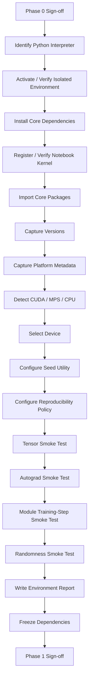
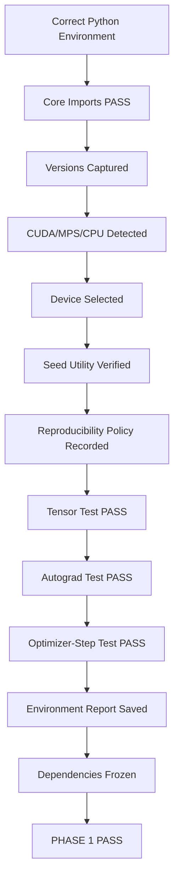

<div align="center">

# PHASE 1 — ENVIRONMENT

## Kế hoạch thiết lập, xác minh và khóa môi trường thực nghiệm

### Transformer Encoder cho hồi quy chuỗi thời gian đa biến trên UCI Appliances Energy Prediction

**Phase kế tiếp sau `Phase_0_Coursework_contract.md`**

</div>

---

# 1. Vai trò của Phase 1

Phase 1 xây dựng **môi trường thực thi có kiểm soát** cho toàn bộ coursework.

Nếu Phase 0 trả lời:

```text
Ta sẽ làm bài toán gì?
Ta sẽ đánh giá như thế nào?
Ta được phép thay đổi những gì?
```

thì Phase 1 phải trả lời:

```text
Code sẽ chạy trong môi trường nào?
Phiên bản Python và thư viện nào đang thực sự được dùng?
PyTorch đang chạy trên CUDA, MPS hay CPU?
Randomness được kiểm soát như thế nào?
Có thể tái chạy cùng một experiment trong cùng môi trường hay không?
Notebook đang dùng đúng interpreter/kernel hay không?
Thiết bị có chạy forward/backward đúng hay không?
Môi trường có đủ ổn định để chuyển sang Phase 2 hay chưa?
```

Phase này **không tối ưu mô hình** và **không xử lý dataset**.

Mục tiêu là tạo một nền thực nghiệm có thể:

```text
Reproduce
Audit
Debug
Compare
Trace
```

các experiment từ Phase 2 đến Phase 59.

---

# 2. Mối liên hệ với Phase 0

Phase 1 phải tuân thủ contract đã khóa trong Phase 0:

```text
Primary development seed = 42

Final seeds:
42
123
2026

Main frameworks:
Python
PyTorch
NumPy
Pandas
Scikit-learn
Matplotlib

Device candidates:
CUDA
MPS
CPU

Final model comparison:
Persistence
LSTM
Transformer

Test set:
Không được dùng trong development.
```

Phase 1 không được thay:

```text
Target
Forecast horizon
Split policy
Model-selection metric
Option registry
```

Nếu Phase 1 phát hiện incompatibility phần mềm buộc phải sửa protocol, thay đổi đó phải được ghi dưới dạng:

```text
Protocol Amendment
```

không được sửa âm thầm.

---

# 3. Mục tiêu cụ thể của Phase 1

Sau Phase 1 phải đạt được toàn bộ:

```text
1. Xác định đúng Python interpreter.

2. Xác nhận notebook đang dùng đúng kernel/environment.

3. Xác nhận import thành công:
   PyTorch
   NumPy
   Pandas
   Scikit-learn
   Matplotlib.

4. Ghi lại version thực tế của toàn bộ package quan trọng.

5. Phát hiện thiết bị:
   CUDA
   MPS
   CPU.

6. Chọn một device chính bằng rule cố định.

7. Xác minh tensor operations trên device.

8. Xác minh autograd/backward trên device.

9. Thiết lập seed utility thống nhất.

10. Định nghĩa reproducibility mode.

11. Xác minh cùng seed tạo cùng random sequence
    trong cùng environment ở mức có thể kiểm soát.

12. Định nghĩa DataLoader seeding contract cho Phase 11.

13. Ghi environment report ra artifact.

14. Freeze package versions.

15. Hoàn thành Environment Smoke Test.

16. Đạt toàn bộ Phase 1 sign-off checklist.
```

---

# 4. Những việc Phase 1 không làm

Không thực hiện:

```text
Không tải UCI dataset.

Không đọc energydata_complete.csv.

Không chạy EDA.

Không tạo feature engineering.

Không chia Train/Validation/Test.

Không fit scaler.

Không tạo windows.

Không huấn luyện LSTM.

Không huấn luyện Transformer.

Không tune batch size.

Không benchmark model performance.

Không đo test metrics.
```

Các nhiệm vụ này thuộc Phase 2 trở đi.

---

# 5. Thành phần môi trường bắt buộc

## Core runtime

```text
Python
```

## Deep Learning

```text
PyTorch
```

## Numerical computing

```text
NumPy
```

## Data processing

```text
Pandas
```

## Classical preprocessing / metrics

```text
Scikit-learn
```

## Visualization

```text
Matplotlib
```

## Notebook runtime

Khuyến nghị:

```text
Jupyter
IPython
ipykernel
```

## Utility tùy chọn nhưng hữu ích

```text
tqdm
psutil
```

Không thêm package chỉ vì “có thể dùng”.

Mỗi dependency mới phải có vai trò rõ.

---

# 6. Chính sách phiên bản Python

Không hard-code một Python minor version chỉ vì đó là bản mới nhất.

Nguyên tắc:

```text
1. Kiểm tra Python hiện tại.

2. Xác minh version đó còn được PyTorch stable hỗ trợ.

3. Nếu hợp lệ:
   Giữ nguyên để giảm thay đổi môi trường.

4. Nếu không hợp lệ:
   Tạo isolated environment với Python được hỗ trợ.

5. Sau khi môi trường ổn định:
   Freeze exact version.
```

Yêu cầu tối thiểu của project:

```text
Python version phải nằm trong phạm vi được stable PyTorch hiện tại hỗ trợ.
```

Không dùng:

```text
Python beta
release candidate
nightly-only environment
```

cho coursework chính nếu không có lý do bắt buộc.

---

# 7. Chính sách môi trường cô lập

Khuyến nghị sử dụng:

```text
.venv
```

đặt ngay trong project root.

Sơ đồ:

```text
coursework/
│
├── .venv/
├── notebooks/
├── src/
├── artifacts/
└── ...
```

Lợi ích:

```text
Không làm bẩn Python hệ thống.
Giảm package conflict.
Kernel notebook rõ ràng.
Dễ freeze dependency.
Dễ tái tạo project.
```

Không commit:

```text
.venv/
```

vào Git nếu sử dụng version control.

---

# 8. Quy trình tạo virtual environment

Ví dụ cho macOS/Linux:

```bash
python3 -m venv .venv
source .venv/bin/activate
python -m pip install --upgrade pip
```

Windows:

```text
Tạo bằng:
python -m venv .venv

Sau đó activate theo shell đang sử dụng.
```

Sau activation phải kiểm tra:

```bash
which python
python --version
python -m pip --version
```

Trên Windows có thể dùng:

```text
where python
```

Interpreter phải trỏ vào environment của project.

---

# 9. Quy tắc cài PyTorch

Không copy một command CUDA từ máy khác.

Quy trình chuẩn:

```text
1. Xác định OS.
2. Xác định accelerator thực tế.
3. Dùng official PyTorch installation selector.
4. Cài stable build.
5. Verify import.
6. Verify device.
```

Đối với macOS:

```text
Không cài CUDA build.

PyTorch có thể sử dụng MPS nếu hardware/software hỗ trợ.
```

Đối với NVIDIA CUDA:

```text
Chọn wheel phù hợp từ official selector.
```

Nếu không có accelerator:

```text
CPU vẫn là fallback hợp lệ.
```

---

# 10. Package installation strategy

Core packages:

```text
torch
numpy
pandas
scikit-learn
matplotlib
jupyter
ipykernel
```

Utility:

```text
tqdm
psutil
```

Không pin version trước khi xác định combination thực tế chạy ổn.

Quy trình:

```text
Install
    ↓
Import Test
    ↓
Device Test
    ↓
Smoke Test
    ↓
Freeze exact versions
```

Thứ tự này tránh freeze một environment chưa được kiểm tra.

---

# 11. Kernel registration

Nếu sử dụng Jupyter:

```bash
python -m ipykernel install --user \
  --name coursework-transformer-energy \
  --display-name "Coursework Transformer Energy"
```

Sau đó notebook phải chọn đúng:

```text
Coursework Transformer Energy
```

Không giả định kernel đúng chỉ vì terminal đã activate `.venv`.

---

# 12. Kiểm tra interpreter bên trong notebook

Cell đầu Phase 1 phải ghi:

```python
import sys

print(sys.executable)
print(sys.version)
```

Kết quả phải trỏ tới interpreter của environment dự kiến.

Nếu terminal và notebook trả hai interpreter khác nhau:

```text
STOP
```

và sửa kernel trước khi tiếp tục.

Đây là lỗi môi trường phổ biến và có thể khiến:

```text
pip install thành công
nhưng notebook vẫn ModuleNotFoundError.
```

---

# 13. Import contract

Phải import thành công:

```python
import torch
import numpy as np
import pandas as pd
import sklearn
import matplotlib
```

Optional:

```python
import tqdm
import psutil
```

Không dùng:

```text
try/except rồi bỏ qua ImportError
```

cho core dependencies.

Nếu core import fail:

```text
Phase 1 = FAIL
```

---

# 14. Version inventory

Ghi ít nhất:

```text
Python
PyTorch
NumPy
Pandas
Scikit-learn
Matplotlib
Jupyter/IPython nếu dùng
```

Ví dụ field:

```text
python_version
torch_version
numpy_version
pandas_version
sklearn_version
matplotlib_version
```

Không chỉ chụp màn hình.

Phải lưu machine-readable output.

---

# 15. System inventory

Nên ghi:

```text
Operating system
OS release
Architecture
Machine type
CPU count
Python executable
Working directory
```

Nếu có accelerator:

```text
Device name
Backend
CUDA version nếu có
MPS built/available nếu có
```

Mục tiêu:

```text
Giải thích khác biệt runtime
và hỗ trợ reproducibility.
```

---

# 16. Device-selection contract

Dùng một rule duy nhất:

```text
CUDA available?
    YES → CUDA

ELSE MPS available?
    YES → MPS

ELSE
    → CPU
```

Pseudo-code:

```python
if torch.cuda.is_available():
    device = torch.device("cuda")
elif torch.backends.mps.is_available():
    device = torch.device("mps")
else:
    device = torch.device("cpu")
```

Không hard-code:

```python
device = "cuda"
```

hoặc:

```python
device = "mps"
```

---

# 17. Vì sao ưu tiên CUDA → MPS → CPU?

Rule này nhằm tạo code:

```text
device-agnostic
```

và cho phép cùng notebook chạy trên:

```text
NVIDIA GPU environment
Apple GPU environment
CPU-only environment
```

Đây là **routing policy**, không phải tuyên bố rằng một backend luôn nhanh hơn backend khác trong mọi workload.

---

# 18. CUDA audit

Nếu CUDA available:

Ghi:

```text
torch.cuda.is_available()
torch.version.cuda
device_count
current device
device name
```

Có thể ghi thêm:

```text
total VRAM
```

nếu API và platform hỗ trợ.

Không bắt buộc chạy:

```text
nvidia-smi
```

trong notebook nếu PyTorch đã cung cấp đủ thông tin.

---

# 19. MPS audit

Nếu môi trường macOS:

Kiểm tra:

```python
torch.backends.mps.is_built()
torch.backends.mps.is_available()
```

Phân biệt:

```text
is_built = PyTorch binary có MPS support.

is_available = MPS thực sự dùng được trên máy hiện tại.
```

Nếu:

```text
is_built=True
is_available=False
```

không được giả định GPU đang hoạt động.

Fallback:

```text
CPU
```

cho đến khi nguyên nhân được xác định.

---

# 20. CPU audit

CPU luôn phải được giữ như fallback.

Ghi:

```text
CPU count
architecture
PyTorch CPU capability nếu có thể truy vấn
```

Không coi CPU là lỗi.

CPU có thể hữu ích cho:

```text
Debugging
Determinism checks
Small smoke tests
Cross-device sanity
```

---

# 21. Không bật MPS fallback một cách âm thầm

PyTorch hỗ trợ environment variable:

```text
PYTORCH_ENABLE_MPS_FALLBACK
```

để fallback một số operation chưa được MPS hỗ trợ sang CPU.

Trong coursework:

```text
Không bật mặc định.
```

Nếu buộc phải dùng:

```text
1. Ghi rõ biến môi trường.
2. Ghi reason.
3. Ghi backend thực tế có mixed execution.
4. Không so training time trực tiếp với run không fallback mà không chú thích.
```

Fallback âm thầm có thể:

```text
che giấu unsupported operation
làm runtime khó giải thích
```

---

# 22. Device smoke test — Tensor

Sau device selection:

```python
x = torch.randn(4, 4, device=device)
y = torch.randn(4, 4, device=device)
z = x @ y
```

Xác minh:

```text
z.device đúng
z.shape đúng
all finite
```

Không cần benchmark tốc độ ở Phase 1.

---

# 23. Device smoke test — Autograd

Tạo phép tính có gradient:

```python
x = torch.randn(8, 4, device=device, requires_grad=True)
w = torch.randn(4, 1, device=device, requires_grad=True)

loss = (x @ w).pow(2).mean()
loss.backward()
```

Xác minh:

```text
loss finite
x.grad tồn tại
w.grad tồn tại
gradients finite
```

Nếu forward chạy nhưng backward fail:

```text
Phase 1 chưa pass.
```

---

# 24. Device smoke test — `nn.Module`

Tạo một model nhỏ:

```text
Linear
→ activation
→ Linear
```

Chuyển:

```python
model.to(device)
```

Tạo input cùng device.

Thực hiện:

```text
forward
loss
backward
optimizer step
```

Mục tiêu:

```text
kiểm tra end-to-end PyTorch training primitive
```

trước khi xây LSTM/Transformer.

---

# 25. Float dtype contract

Baseline:

```text
torch.float32
```

Không đổi global default sang:

```text
float64
```

vì Pandas/NumPy có thể tạo `float64` trong preprocessing.

Từ Phase 10 trở đi phải đảm bảo:

```text
model input tensor = float32
target tensor = float32
```

Không bật mixed precision trong baseline contract.

Mixed precision chỉ được thêm nếu sau này có một extension rõ ràng.

---

# 26. Reproducibility — nguyên tắc

Phải hiểu đúng:

```text
Same seed
≠
guaranteed identical results across every version/device/platform.
```

Reproducibility trong coursework nghĩa là:

```text
Cố định nguồn randomness chính.
Ghi version.
Ghi device.
Giữ pipeline nhất quán.
Giảm nondeterminism trong cùng environment.
Báo cáo nhiều seeds cho final comparison.
```

Không hứa:

```text
bitwise identical across CPU/CUDA/MPS.
```

---

# 27. Development seed contract

Seed chính:

```text
SEED = 42
```

Phase 1 phải định nghĩa một hàm duy nhất:

```text
set_seed(seed)
```

Không scatter:

```python
random.seed(...)
np.random.seed(...)
torch.manual_seed(...)
```

khắp notebook.

---

# 28. Seed utility phải kiểm soát

Ít nhất:

```text
Python random
NumPy
PyTorch
CUDA khi relevant
MPS khi relevant
```

Skeleton:

```python
def set_seed(seed: int) -> None:
    ...
```

Mục tiêu:

```text
mọi experiment gọi cùng utility.
```

Final seeds đã được Phase 0 khóa:

```text
42
123
2026
```

---

# 29. NumPy randomness

Không chỉ nghĩ tới:

```python
np.random.seed(seed)
```

Nếu code dùng:

```python
np.random.default_rng(...)
```

thì generator đó cũng phải nhận seed rõ ràng.

Quy tắc:

```text
Không tạo unseeded RNG object trong experiment code.
```

---

# 30. PyTorch randomness

Sử dụng:

```python
torch.manual_seed(seed)
```

làm seed chính của PyTorch.

Nếu CUDA multi-device được sử dụng:

```text
manual_seed_all
```

có thể được gọi rõ ràng trong utility.

Nếu MPS được dùng và API seed khả dụng:

```text
MPS RNG cũng phải được ghi nhận/seed.
```

---

# 31. Deterministic-algorithm policy

Tạo hai mode:

## Mode D0 — Practical Reproducibility

Dùng trong phần lớn development:

```text
Fixed seeds
Version logging
Device logging
cuDNN benchmark disabled nếu CUDA
Deterministic warnings thay vì crash nếu cần
```

## Mode D1 — Strict Diagnostic

Dùng cho sanity/debug:

```python
torch.use_deterministic_algorithms(True)
```

Nếu unsupported operation gây lỗi:

```text
Không che lỗi.
Ghi operation/backend.
Quyết định có chuyển sang warn_only hay không.
```

Không cần bắt mọi final run dùng strict mode nếu nó làm một backend không thể chạy; nhưng policy phải thống nhất và được ghi lại.

---

# 32. cuDNN policy cho CUDA

Nếu CUDA/cuDNN:

```python
torch.backends.cudnn.benchmark = False
```

được ưu tiên khi muốn giảm một nguồn nondeterminism.

Có thể kết hợp:

```python
torch.backends.cudnn.deterministic = True
```

nếu phù hợp.

Các flag CUDA-specific:

```text
Không có tác dụng tương đương trên MPS/CPU.
```

Không viết code giả định cuDNN luôn tồn tại.

---

# 33. DataLoader reproducibility contract cho Phase 11

Phase 1 chưa tạo DataLoader nhưng phải khóa cách seed sau này.

Khi `num_workers > 0`, dùng:

```text
worker_init_fn
+
torch.Generator
```

để kiểm soát worker randomness.

Protocol:

```text
Generator được seed bằng experiment seed.

Worker seed lấy từ torch.initial_seed().

Python random và NumPy trong worker được reseed.
```

Khi debug ban đầu:

```text
num_workers = 0
```

là lựa chọn an toàn, dễ tái lập và dễ tìm lỗi.

Tuning DataLoader performance thuộc Phase 11, không thuộc Phase 1.

---

# 34. Notebook-output determinism test

Một sanity test nhỏ:

```text
1. set_seed(42)
2. tạo tensor A
3. set_seed(42)
4. tạo tensor B
5. kiểm tra A == B
```

Làm tương tự cho:

```text
Python random
NumPy
PyTorch
```

Mục tiêu:

```text
xác minh seed utility đang thực sự hoạt động.
```

Đây không chứng minh toàn training pipeline deterministic.

---

# 35. Environment report

Tạo một dictionary:

```python
ENVIRONMENT_REPORT = {
    ...
}
```

Nên gồm:

```text
timestamp
python_version
python_executable
platform
architecture
torch_version
numpy_version
pandas_version
sklearn_version
matplotlib_version
device
cuda_available
cuda_version
mps_built
mps_available
seed
deterministic_mode
working_directory
```

Chỉ thêm field có thể truy vấn đáng tin cậy.

---

# 36. Artifact directory cho Phase 1

Tạo hoặc dành trước:

```text
artifacts/
└── environment/
    ├── environment_report.json
    ├── requirements_freeze.txt
    ├── smoke_test_report.json
    └── phase_1_signoff.json
```

Nếu project chưa tạo directory structure ở Phase 1:

```text
chỉ tạo phần environment cần thiết.
```

Không cần tạo toàn bộ artifact tree của Phase 59 ngay lập tức.

---

# 37. `requirements_freeze.txt`

Sau khi environment pass smoke test:

```bash
python -m pip freeze > artifacts/environment/requirements_freeze.txt
```

Mục đích:

```text
ghi exact installed versions
```

Không nhầm:

```text
requirements_freeze.txt
```

với một carefully curated production `requirements.txt`.

Freeze file có thể chứa transitive dependencies.

---

# 38. Environment report JSON

Ví dụ structure:

```json
{
  "python": "...",
  "torch": "...",
  "numpy": "...",
  "pandas": "...",
  "sklearn": "...",
  "matplotlib": "...",
  "device": "...",
  "seed": 42
}
```

Không hard-code values.

Phải lấy từ runtime thực tế.

---

# 39. Smoke-test report

Lưu:

```text
imports_ok
device_detected
tensor_forward_ok
autograd_ok
module_training_step_ok
seed_test_ok
all_finite
```

và:

```text
PASS / FAIL
```

Nếu fail:

```text
Phase 2 không bắt đầu.
```

---

# 40. Package shadowing check

Trước khi kết luận package lỗi, kiểm tra project không có file:

```text
torch.py
numpy.py
pandas.py
sklearn.py
matplotlib.py
random.py
```

hoặc folder trùng tên package.

Các file này có thể gây:

```text
import shadowing
```

và làm lỗi rất khó hiểu.

---

# 41. Working-directory contract

Notebook phải in:

```python
from pathlib import Path
print(Path.cwd())
```

Quy tắc:

```text
Không phụ thuộc vào cwd ngẫu nhiên.
```

Các path trong project nên được định nghĩa từ:

```text
PROJECT_ROOT
```

thay vì chuỗi đường dẫn tuyệt đối gắn với một máy.

---

# 42. Path portability

Không hard-code:

```text
/Users/<name>/...
C:\Users\<name>\...
```

trong notebook.

Nên dùng:

```python
from pathlib import Path
PROJECT_ROOT = Path(...)
```

Phase 2 sẽ dùng nó cho raw data path.

---

# 43. Environment variables

Phase 1 phải snapshot những environment variables có thể ảnh hưởng runtime nếu chúng tồn tại, ví dụ:

```text
PYTORCH_ENABLE_MPS_FALLBACK
CUDA_VISIBLE_DEVICES
```

Không cần dump toàn bộ environment vì có thể chứa secrets.

Chỉ log allow-list các biến liên quan tới computation.

---

# 44. Không ghi secrets vào artifact

Không ghi:

```text
API keys
tokens
passwords
private environment variables
```

vào:

```text
environment_report.json
pip freeze
notebook output
```

Phase 1 chỉ cần technical runtime metadata.

---

# 45. Runtime-timing policy

Phase 1 không benchmark model.

Nếu cần kiểm tra tensor operation:

```text
chỉ smoke test.
```

Training-time comparison chính sẽ được thực hiện về sau.

Lý do:

```text
Device warm-up
asynchronous execution
small synthetic workload
```

có thể làm timing Phase 1 không có ý nghĩa.

---

# 46. CUDA timing lưu ý

CUDA operations có thể asynchronous.

Nếu sau này đo runtime chính xác:

```text
cần synchronization phù hợp.
```

Không giải quyết ở Phase 1; chỉ ghi note để tránh dùng naive `time.time()` rồi kết luận tốc độ GPU.

---

# 47. MPS timing lưu ý

MPS cũng có execution/backend đặc thù.

Nếu sau này đo training time:

```text
cần đo cùng protocol cho toàn model
```

và ghi device.

Không so:

```text
LSTM trên CPU
vs
Transformer trên MPS
```

rồi kết luận architecture nào nhanh hơn.

Fair runtime comparison cần cùng hardware/backend.

---

# 48. Device fairness contract

LSTM và Transformer final comparison phải:

```text
chạy trên cùng device class
```

trong một comparison table nếu report training time.

Nếu device khác:

```text
training time không được dùng để so architecture trực tiếp.
```

Metric prediction vẫn có thể so nếu model/data protocol giống nhau, nhưng runtime không còn công bằng.

---

# 49. Environment-change policy

Sau Phase 1 sign-off:

```text
Không tự ý upgrade PyTorch
Không tự ý đổi Python
Không tự ý đổi NumPy
Không đổi kernel giữa experiment
```

Nếu cần thay:

```text
1. Ghi version cũ.
2. Ghi version mới.
3. Ghi lý do.
4. Tạo environment revision ID.
5. Xác định các run trước có còn so sánh được không.
```

---

# 50. Environment revision ID

Khuyến nghị đặt:

```text
ENV-v1
```

sau Phase 1.

Nếu thay dependency quan trọng:

```text
ENV-v2
```

Experiment registry sau này nên có field:

```text
environment_id
```

để biết run thuộc môi trường nào.

---

# 51. Phase 1 notebook structure

Khuyến nghị khoảng:

```text
8–12 cells
```

## Cell 1.1 — Phase title

## Cell 1.2 — Environment objectives

Markdown.

## Cell 1.3 — Imports

Core imports.

## Cell 1.4 — Version inventory

In versions.

## Cell 1.5 — Platform inventory

OS, architecture, executable, cwd.

## Cell 1.6 — Device detection

CUDA → MPS → CPU.

## Cell 1.7 — Seed utility

`set_seed`.

## Cell 1.8 — Reproducibility configuration

Deterministic policy.

## Cell 1.9 — Device smoke test

Tensor + autograd.

## Cell 1.10 — Seed smoke test

Python + NumPy + PyTorch.

## Cell 1.11 — Environment report

Create/save report.

## Cell 1.12 — Phase sign-off

PASS/FAIL summary.

---

# 52. Quy trình thực thi Phase 1



---

# 53. Kỹ thuật follow chuẩn khi triển khai

Thứ tự phải giữ:

```text
Interpreter
→ Dependencies
→ Kernel
→ Imports
→ Versions
→ Device
→ Reproducibility
→ Smoke Tests
→ Freeze
```

Không freeze trước smoke test.

Không bắt đầu data acquisition nếu device/autograd chưa pass.

Không debug dataset bằng một kernel khác với kernel sẽ train model.

---

# 54. Error-handling protocol

Nếu lỗi xảy ra:

## ImportError

Kiểm tra:

```text
python executable
pip executable
kernel
package shadowing
```

trước khi reinstall.

## CUDA unavailable

Kiểm tra:

```text
CUDA build
driver/runtime environment
device visibility
```

Không force `cuda`.

## MPS unavailable

Kiểm tra:

```text
is_built
is_available
OS/hardware support
```

Fallback CPU nếu cần.

## Autograd fail trên accelerator

```text
Không bỏ qua.
```

Tạo minimal reproduction.

Nếu operation cần cho coursework không được backend hỗ trợ:

```text
ghi issue
quyết định CPU fallback toàn model
hoặc explicit backend strategy
```

Không để model tự chia giữa CPU/GPU mà không biết.

---

# 55. Kỹ thuật chống environment drift

Sau sign-off:

```text
Freeze dependencies.
Không pip install -U ngẫu nhiên.
Không đổi kernel.
Không đổi device giữa candidate runs nếu không ghi log.
```

Khi mở notebook ở ngày khác:

```text
Run environment-verification cell trước.
```

Nếu version mismatch:

```text
WARNING
```

và không tiếp tục experiment chính cho tới khi xác nhận.

---

# 56. Reproducibility validation không nên hiểu sai

Phase 1 có thể xác minh:

```text
same seed → same basic random sample
```

nhưng không được tuyên bố:

```text
mọi neural-network run sẽ bitwise identical trên mọi backend.
```

Final robustness vẫn dùng:

```text
3 seeds
```

ở Phase 46.

---

# 57. Output bắt buộc của Phase 1

## O1.1 — Environment inventory

Bao gồm:

```text
Python
PyTorch
NumPy
Pandas
Scikit-learn
Matplotlib
OS
Architecture
```

## O1.2 — Device report

```text
CUDA status
MPS status
Selected device
Device name khi có
```

## O1.3 — Seed utility

Một hàm duy nhất:

```text
set_seed(seed)
```

## O1.4 — Reproducibility policy

```text
D0 practical
D1 strict diagnostic
```

## O1.5 — Smoke-test result

```text
Tensor
Autograd
nn.Module
Optimizer step
Randomness
```

## O1.6 — Environment report JSON

```text
artifacts/environment/environment_report.json
```

## O1.7 — Dependency freeze

```text
artifacts/environment/requirements_freeze.txt
```

## O1.8 — Phase sign-off

```text
artifacts/environment/phase_1_signoff.json
```

---

# 58. Environment-report fields đề xuất

```text
environment_id
created_at
python_version
python_executable
pip_version
torch_version
numpy_version
pandas_version
sklearn_version
matplotlib_version
platform
platform_release
architecture
cpu_count
working_directory
cuda_available
cuda_version
cuda_device_name
mps_built
mps_available
mps_device_name
selected_device
default_dtype
development_seed
deterministic_mode
mps_fallback_enabled
```

Field không applicable:

```text
null
```

không tự điền giá trị giả.

---

# 59. Phase 1 sanity checks

```text
[ ] sys.executable đúng environment.

[ ] Python version được PyTorch hiện tại hỗ trợ.

[ ] `python -m pip` trỏ đúng environment.

[ ] Notebook kernel đúng.

[ ] torch import OK.

[ ] numpy import OK.

[ ] pandas import OK.

[ ] sklearn import OK.

[ ] matplotlib import OK.

[ ] Version inventory đã lưu.

[ ] CWD đã xác nhận.

[ ] Device detection chạy.

[ ] Device routing không hard-code.

[ ] Tensor smoke test pass.

[ ] Autograd smoke test pass.

[ ] nn.Module training step pass.

[ ] Loss finite.

[ ] Gradient finite.

[ ] Seed utility hoạt động.

[ ] Python random seed test pass.

[ ] NumPy seed test pass.

[ ] PyTorch seed test pass.

[ ] Deterministic policy được ghi.

[ ] MPS fallback status được ghi.

[ ] requirements freeze đã tạo.

[ ] environment report đã tạo.

[ ] Phase 1 sign-off = PASS.
```

---

# 60. Phase 1 acceptance criteria

Phase 1 chỉ PASS khi:

```text
Core packages import được.

Interpreter và kernel thống nhất.

Device được phát hiện tự động.

Selected device chạy được tensor computation.

Selected device chạy được backward.

Selected device chạy được optimizer step.

Random seed utility hoạt động.

Môi trường được versioned và freeze.

Không có unresolved environment error.
```

---

# 61. Các lỗi thường gặp cần tránh

## Lỗi 1 — `pip` và `python` khác environment

Fix:

```text
Dùng:
python -m pip ...
```

thay vì dựa vào `pip` không rõ interpreter.

---

## Lỗi 2 — Terminal activate đúng nhưng Jupyter kernel sai

Luôn kiểm tra:

```python
sys.executable
```

trong notebook.

---

## Lỗi 3 — Hard-code CUDA

Sai:

```python
device = torch.device("cuda")
```

Đúng:

```text
detect → select → report
```

---

## Lỗi 4 — MPS `is_built` được xem như `is_available`

Hai khái niệm khác nhau.

---

## Lỗi 5 — Bật MPS CPU fallback rồi quên ghi

Có thể làm runtime khó diễn giải.

---

## Lỗi 6 — Freeze dependency trước khi xác minh environment

Freeze chỉ sau:

```text
imports + device + autograd + smoke test PASS.
```

---

## Lỗi 7 — Chỉ seed PyTorch

Cần xem xét:

```text
Python
NumPy
PyTorch
DataLoader workers ở Phase 11
```

---

## Lỗi 8 — Tuyên bố “100% reproducible”

Không chính xác giữa version/device khác nhau.

---

## Lỗi 9 — Dùng float64 từ NumPy/Pandas đưa thẳng vào model

Contract model input:

```text
float32
```

---

## Lỗi 10 — Upgrade package giữa sweep

Điều này tạo environment drift.

---

# 62. Điều kiện chuyển sang Phase 2

Chỉ chuyển sang:

```text
PHASE 2 — Data acquisition
```

khi:

```text
Phase 1 Sign-off = PASS
```

và tồn tại:

```text
environment_report.json
requirements_freeze.txt
smoke_test_report
selected device
working seed utility
```

Nếu không:

```text
STOP
```

và sửa Phase 1 trước.

---

# 63. Nguồn kỹ thuật tham chiếu

Phase 1 dựa trên các nguyên tắc kỹ thuật từ tài liệu chính thức của PyTorch:

```text
PyTorch — Start Locally
PyTorch — Reproducibility
PyTorch — torch.use_deterministic_algorithms
PyTorch — DataLoader / multi-process randomness
PyTorch — CUDA backend
PyTorch — MPS backend
PyTorch — torch.backends.mps
```

Các nguyên tắc chính được kế thừa:

```text
Stable PyTorch phải dùng Python được hỗ trợ.

CUDA availability phải được kiểm tra bằng API runtime.

MPS availability phải được kiểm tra thay vì hard-code.

Seed giúp hạn chế randomness nhưng không đảm bảo
reproducibility tuyệt đối giữa mọi platform/release.

Deterministic algorithms có thể giảm performance.

DataLoader workers cần được seed có kiểm soát
nếu dùng multi-process loading.
```

---

# 64. Definition of Done



Phase 1 được xem là hoàn chỉnh khi:

\[
\boxed{
Environment\ Identity
+
Device\ Validity
+
Reproducibility\ Controls
+
Smoke\ Tests
+
Version\ Freeze
}
\]

đều được xác nhận.

---

<div align="center">

# PHASE 1 — FINAL STATUS CONTRACT

**Không có model training trong Phase 1.**

**Không có dataset-dependent computation trong Phase 1.**

**Môi trường phải được xác minh trước khi Phase 2 bắt đầu.**

**Mọi experiment từ Phase 2–59 phải có khả năng truy ngược về `ENV-v1`.**

</div>
