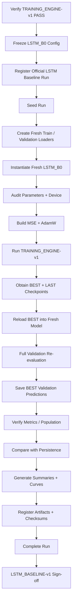
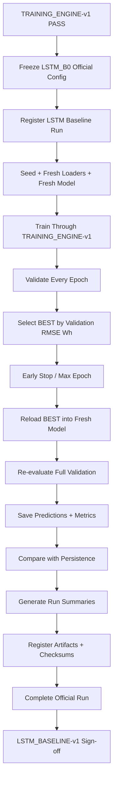

<div align="center">

# PHASE 20 — LSTM BASELINE RUN

## Kế hoạch thực thi official LSTM baseline run trên UCI Appliances Energy Prediction

### Multivariate Time-Series Regression — Sequence-to-One, One-Step-Ahead Forecasting

**Phase kế tiếp sau `Phase_19_Baseline_training_engine.md`**

</div>

---

# 1. Vai trò của Phase 20

Phase 20 là **official learned-baseline run đầu tiên** của coursework.

Nếu:

```text
Phase 14
→ tạo Persistence baseline

Phase 15
→ implement LSTM

Phase 19
→ khóa Training Engine
```

thì:

```text
Phase 20
→ thực thi LSTM_B0 chính thức
```

trên đúng:

```text
data population
feature variant
scaling
window
training engine
metric contract
```

đã được khóa trước đó.

Đây không còn là:

```text
synthetic test
sanity test
dry run
```

mà là:

```text
SCIENTIFIC DEVELOPMENT RUN
```

hợp lệ để so sánh với:

```text
Persistence
```

và sau này:

```text
Transformer B0.
```

Nguyên tắc trung tâm:

\[
\boxed{
Frozen\ Config
+
Fresh\ Run
+
Full\ Training
+
Best\ Validation\ Checkpoint
+
Complete\ Audit
+
No\ Test
}
\]

---

# 2. Câu hỏi Phase 20 phải trả lời

Phase 20 phải trả lời chính xác:

> Với một LSTM baseline được huấn luyện theo protocol đã khóa, hiệu năng trên Validation của bài toán dự báo `Appliances` 10 phút tiếp theo là bao nhiêu, quá trình học có ổn định không, checkpoint tốt nhất nằm ở epoch nào, và baseline này có vượt Persistence trên cùng population hay không?

Phase 20 **không** trả lời:

```text
LSTM có phải model tốt nhất không?

Transformer có tốt hơn LSTM không?

Hyperparameter nào tốt nhất?

Test performance là bao nhiêu?
```

Các câu hỏi đó thuộc phase sau.

---

# 3. Output version

Gán run-level scientific contract:

```text
LSTM_BASELINE-v1
```

Model implementation vẫn:

```text
LSTM-v1
LSTM_IMPL-v1
```

Training engine:

```text
TRAINING_ENGINE-v1.
```

Lineage:

```text
DATA-v1
  ↓
FEATURES-v1
  ↓
FEATURESETS-v1
  ↓
SPLIT-v1
  ↓
SCALING-v1
  ↓
WINDOWS-v1
  ↓
WINDOWPOP-v1
  ↓
DATALOADERS-v1
  ↓
LSTM_IMPL-v1
  ↓
TRAINING_ENGINE-v1
  ↓
LSTM_BASELINE-v1
```

---

# 4. Phase 20 là baseline run, không phải LSTM tuning

Hard distinction:

```text
Phase 20
→ run đúng một baseline configuration đã khóa

Phase 43
→ LSTM tuning
```

Không được nhìn Phase 20 rồi đổi:

```text
hidden size
layers
dropout
LR
weight decay
batch
loss
patience
lookback
```

và gọi đó vẫn là cùng baseline.

---

# 5. Preconditions bắt buộc

Phase 20 chỉ bắt đầu khi:

```text
Phase 19 = PASS
```

và các upstream phase quan trọng:

```text
Phase 10 = PASS
Phase 11 = PASS
Phase 12 = PASS
Phase 13 = PASS
Phase 14 = PASS
Phase 15 = PASS
Phase 18 = PASS
Phase 19 = PASS
```

Bắt buộc có:

```text
WINDOWPOP-v1
METRICS-v1
EXPERIMENTS-v1
PERSISTENCE-v1
LSTM_IMPL-v1
FORWARD_SANITY-v1
TRAINING_ENGINE-v1
```

---

# 6. Hard startup gate

Trước khi tạo run:

```text
assert phase_19_signoff == PASS

assert approved_for_phase20 == True
hoặc equivalent project gate

assert Test access is still locked.
```

Nếu upstream fingerprint mismatch:

```text
STOP.
```

---

# 7. Official LSTM baseline ID

Canonical experiment family:

```text
LSTM_BASELINE
```

Canonical model config ID:

```text
LSTM_B0
```

Recommended human-readable run label:

```text
LSTM_B0__FS1_TF1__L144__H1__YS1__WB0__B64__S42
```

Actual unique:

```text
run_id
```

do `EXPERIMENTS-v1` tạo.

---

# 8. Không tự đặt run_id thủ công nếu Registry đã quản lý

Run label:

```text
descriptive
```

Run ID:

```text
authoritative unique identity.
```

---

# 9. Official data configuration

Phase 20 khóa:

```text
Feature set:
FS1

Time features:
TF1

Feature variant:
FS1_TF1

Lookback:
L144

Lookback steps:
144

Lookback duration:
24 hours

Horizon:
H1

Horizon duration:
10 minutes

Boundary:
WB0

Target scaling:
YS1

Population:
WINDOWPOP-v1

Batch:
64
```

---

# 10. Target formulation

\[
X_{t-143:t}
\rightarrow
Appliances_{t+1}
\]

tương đương index form:

```text
input:
[j-144, ..., j-1]

target:
j.
```

---

# 11. Historical target input

FS1 includes:

```text
past Appliances
```

inside input sequence.

This is valid under:

```text
observed-history forecasting assumption.
```

Target row:

```text
Appliances[j]
```

never enters input.

---

# 12. Time-feature configuration

TF1 includes exactly the engineered calendar fields locked earlier:

```text
hour_sin
hour_cos
dow_sin
dow_cos
weekend.
```

No target-time calendar feature is added ad hoc.

---

# 13. Scaling configuration

X preprocessing:

```text
SCALING-v1
```

with Train-only scaler.

Target:

```text
YS1 StandardScaler
```

fit only under Train protocol.

Model trains in:

```text
standardized target space.
```

Final Validation metrics:

```text
inverse transformed to Wh.
```

---

# 14. Boundary configuration

Baseline:

```text
WB0
```

Validation targets may use earlier historical context across split boundary if:

```text
all context is temporally prior

continuity valid

target assignment is Validation.
```

---

# 15. Common population contract

Official LSTM baseline uses:

```text
WINDOWPOP-v1
```

same controlled population used by:

```text
Persistence
Transformer.
```

No model-specific dropping.

---

# 16. Official architecture configuration

```text
model_family = LSTM

model_name = LSTMRegressor

model_config_id = LSTM_B0

hidden_size = 64

num_layers = 2

dropout = 0.1

bidirectional = False

proj_size = 0

bias = True

batch_first = True

readout = LAST_STEP

output_size = 1

output_activation = NONE.
```

---

# 17. Input size

Runtime:

```text
input_size
=
registered feature_count(FS1_TF1).
```

Do not hard-code:

```text
31
```

even if expected schema currently suggests it.

---

# 18. Output contract

\[
\boxed{
[B,144,F]
\rightarrow
[B,1]
}
\]

---

# 19. LSTM state contract

Official run:

```text
STATELESS BETWEEN WINDOWS.
```

No hidden/cell carry between batches.

---

# 20. Initial state

No explicit persistent h/c.

Each forward starts from standard zero initial state behavior.

---

# 21. Official training configuration

```text
optimizer = AdamW

learning_rate = 3e-4

weight_decay = 1e-4

criterion = MSE

batch_size = 64

max_epochs = 50

early_stopping = True

patience = 10

min_delta = 0.0

gradient_clipping = True

max_norm = 1.0

norm_type = 2.0

scheduler = None

mixed_precision = False

gradient_accumulation_steps = 1

seed = 42.
```

---

# 22. Official selection metric

Hard:

```text
Validation RMSE Wh.
```

Direction:

```text
MIN.
```

---

# 23. Secondary metrics

Record:

```text
Validation MAE Wh

Validation R².
```

Không dùng để chọn best checkpoint.

---

# 24. Training objective

Optimization criterion:

```text
MSE in model target space.
```

Do not confuse with:

```text
Validation RMSE Wh selection metric.
```

---

# 25. No scheduler

Learning rate remains:

```text
3e-4
```

through baseline training.

If optimizer implementation reports slight internal details, LR field remains config truth.

---

# 26. No AMP

Official LSTM_B0:

```text
float32.
```

---

# 27. No gradient accumulation

One optimizer step:

```text
per valid Train batch.
```

---

# 28. No torch.compile

Baseline run uses uncompiled model.

---

# 29. No model-specific tricks

No:

```text
recurrent state carry
custom gate initialization
forget bias tuning
bidirectional mode
projection
extra dense layers
head dropout
```

---

# 30. Seed policy

Official:

```text
seed = 42.
```

Phase 20 uses exactly one seed.

Multiple seeds belong:

```text
Phase 46.
```

---

# 31. Fresh-run rule

At Phase 20 start:

```text
set seed
↓
create fresh Train loader
↓
create fresh Validation loader
↓
instantiate fresh LSTM_B0
↓
move to device
↓
build criterion
↓
build AdamW
↓
run TRAINING_ENGINE-v1.
```

---

# 32. Không reuse sanity LSTM

Không dùng object từ:

```text
Phase 15

Phase 18

Phase 19 dry run.
```

---

# 33. Không reuse sanity Train loader

Fresh generator required.

---

# 34. Test DataLoader

Preferred:

```text
do not create.
```

Phase 20 does not need Test.

---

# 35. Registry registration trước mọi training computation

Required:

```text
register_run()
```

before official training.

---

# 36. Registry lifecycle

```text
PLANNED
→ REGISTERED
→ RUNNING
→ COMPLETED
```

or:

```text
RUNNING
→ FAILED.
```

---

# 37. Run type

```text
execution_type = TRAINING

experiment_family = LSTM_BASELINE

eligible_for_model_selection = True
```

only after successful completion/verification.

---

# 38. Test authorization

```text
test_access_authorized = False.
```

Hard.

---

# 39. Run config fingerprint

Must include:

```text
data config

feature variant

scaler IDs

window/population

model config

training config

seed

training engine

metric version.
```

---

# 40. Duplicate run detection

If exact same LSTM_B0 config + seed already has a valid COMPLETED run:

```text
do not accidentally create duplicate scientific result
```

unless rerun is intentional and Registry policy records it.

---

# 41. Intentional rerun

If verifying reproducibility:

```text
new run_id

rerun_of = prior_run_id

same config fingerprint

explicit purpose.
```

Not required Phase 20 core.

---

# 42. Before training — contract audit

Verify:

```text
DATA version

feature set version

FS1_TF1 fingerprint

split version

scaling version

X scaler bundle ID

Y scaler ID

window version

population fingerprint

DataLoader version

LSTM implementation version

Training Engine version

Metric version.
```

---

# 43. Before training — actual counts

Record runtime:

```text
Train sample count

Validation sample count

Train batch count

Validation batch count

feature count.
```

No hard-coded counts.

---

# 44. No Test count needed for run summary

Structural project manifest may already know it, but Phase 20 does not inspect Test targets/results.

---

# 45. Before training — feature count

Expected from registry, observed from first production batch.

Hard:

```text
expected == observed.
```

---

# 46. Before training — parameter count

Compute:

```text
total parameters

trainable parameters.
```

For actual input F.

Store in run summary.

---

# 47. Parameter-count result is runtime evidence

Do not assume reference count from Phase 15 if actual F differs.

---

# 48. Model parameter initialization fingerprint

Optional but recommended:

```text
initial_model_state_fingerprint.
```

Useful for reproducibility.

---

# 49. First production batch should not be manually inspected for model-quality

Only structural/logging through engine.

Do not cherry-pick.

---

# 50. Training loop ownership

All training must call:

```text
TRAINING_ENGINE-v1.
```

No notebook-local custom epoch loop.

---

# 51. Official train-batch order

Inherited:

```text
zero_grad
→ forward
→ exact shape guard
→ MSE
→ finite loss
→ backward
→ clip gradients
→ optimizer.step.
```

---

# 52. Gradient clipping

```text
max_norm = 1.0.
```

Record per epoch:

```text
mean grad norm preclip

max grad norm preclip

fraction clipped.
```

---

# 53. Why gradient logs matter for LSTM?

LSTMs can exhibit:

```text
large recurrent gradients.
```

Gradient logs help Phase 22 diagnose instability.

Do not change clipping mid-run based on logs.

---

# 54. Full Train coverage each epoch

Expected:

```text
every Train sample exactly once through shuffled loader
```

under DataLoader contract.

---

# 55. No dropped final Train batch

```text
drop_last=False.
```

---

# 56. Train loss aggregation

Sample-weighted mean.

---

# 57. Validation every epoch

Hard:

```text
full Validation population.
```

---

# 58. Validation evaluation path

```text
model.eval()

torch.inference_mode()

full Validation

inverse-transform predictions if YS1

METRICS-v1.
```

---

# 59. Validation output

Every epoch history contains:

```text
validation_loss_model_space

validation_mae_wh

validation_rmse_wh

validation_r2.
```

---

# 60. Best checkpoint rule

Save when:

\[
RMSE_{current}
<
RMSE_{best}
\]

full precision.

---

# 61. Equal RMSE

Not improvement.

---

# 62. Early stopping

```text
patience = 10.
```

Stop after:

```text
10 consecutive non-improving completed Validation epochs.
```

---

# 63. Max epoch

```text
50.
```

---

# 64. Stop reason

One of:

```text
EARLY_STOPPING

MAX_EPOCHS.
```

---

# 65. Best epoch

Must record:

```text
best_epoch.
```

---

# 66. Last epoch

Must record:

```text
last_completed_epoch.
```

They may differ.

---

# 67. Best checkpoint

Official inference/reference checkpoint for Phase 20 result.

---

# 68. Last checkpoint

Recovery/diagnostic checkpoint.

Not official baseline result unless it is also best.

---

# 69. Checkpoint checksum

Both:

```text
BEST

LAST
```

have SHA-256.

---

# 70. Checkpoint lineage

Must bind:

```text
run_id

config fingerprint

feature fingerprint

population fingerprint

model implementation

Training Engine.
```

---

# 71. If run crashes

Do not manually resume from memory.

Use:

```text
TRAINING_ENGINE-v1 epoch-boundary resume protocol.
```

---

# 72. Resume does not create new scientific config

Valid same-run resume:

```text
same run_id
same config fingerprint.
```

---

# 73. If config changes after failure

New run.

---

# 74. OOM behavior

If B64 causes OOM:

```text
run FAILS.
```

Do not silently rerun B32 under same LSTM_B0 ID.

---

# 75. If B32 needed

That becomes:

```text
different training config
different run
```

and baseline protocol must be explicitly amended.

---

# 76. Numerical failure

If:

```text
NaN/Inf prediction
loss
gradient norm
```

run fails.

No skip.

---

# 77. No emergency LR reduction

If unstable:

```text
record failure.
```

Do not change LR within same run.

---

# 78. No emergency clipping change

Same.

---

# 79. No “train a few more epochs” after max 50

Phase 20 config is frozen.

E100 belongs planned Phase 38 for Transformer sweep, and any LSTM extension belongs Phase 43/protocol.

---

# 80. No manual checkpoint selection after run

Do not inspect curve and choose:

```text
epoch 22 looks smoother than best RMSE at epoch 19.
```

Official best:

```text
minimum Validation RMSE Wh.
```

---

# 81. Final best-checkpoint verification

After training:

```text
instantiate fresh LSTM_B0

load best checkpoint strict

model.eval()

full Validation

recompute PredictionBundle

recompute METRICS-v1.
```

---

# 82. Required consistency

Re-evaluated:

```text
MAE
RMSE
R²
```

must match recorded best epoch within numerical tolerance.

---

# 83. Best Validation prediction artifact

Save only from:

```text
verified best checkpoint.
```

---

# 84. Prediction artifact fields

Recommended:

```text
run_id

sample_idx

target_timestamp

y_true_wh

y_pred_wh

residual_wh

absolute_error_wh

squared_error_wh.
```

---

# 85. Prediction artifact ordering

Chronological by:

```text
target timestamp/sample order.
```

---

# 86. No rounding in machine source

Full precision.

---

# 87. Best Validation metrics artifact

Fields:

```text
run_id

checkpoint_type = BEST

best_epoch

n_samples

mae_wh

rmse_wh

r2

r2_status

metric_version

population_version

population_fingerprint

target_unit = Wh

status.
```

---

# 88. Training-history artifact

One row per epoch.

Inherited from Phase 19.

---

# 89. Official learning history fields

At minimum:

```text
epoch

train_loss_model_space

validation_loss_model_space

validation_mae_wh

validation_rmse_wh

validation_r2

learning_rate

mean_grad_norm_preclip

max_grad_norm_preclip

fraction_batches_clipped

is_best

best_epoch_so_far

bad_epochs_after_epoch

early_stop_triggered

epoch_duration_seconds.
```

---

# 90. LSTM run summary

Create:

```text
lstm_baseline_summary.json.
```

---

# 91. Summary fields

```text
baseline_version = LSTM_BASELINE-v1

run_id

model_version

implementation_version

training_engine_version

feature_variant

lookback

horizon

target_scaling

boundary_protocol

batch_size

seed

trainable_parameters

stop_reason

epochs_completed

best_epoch

best_validation_mae_wh

best_validation_rmse_wh

best_validation_r2

persistence_validation_mae_wh

persistence_validation_rmse_wh

persistence_validation_r2

rmse_improvement_vs_persistence_wh

rmse_improvement_vs_persistence_pct

best_checkpoint_sha256

history_path

prediction_path

audit_status

test_status.
```

---

# 92. Persistence comparison

After LSTM best Validation result is verified, compare against:

```text
PERSISTENCE-v1
```

on same:

```text
Validation target IDs

population fingerprint

metric version.
```

---

# 93. Comparison formula — absolute RMSE improvement

\[
\Delta RMSE_{abs}
=
RMSE_{Persistence}
-
RMSE_{LSTM}
\]

Positive:

```text
LSTM better.
```

---

# 94. Relative RMSE improvement

\[
\Delta RMSE_{\%}
=
\frac{
RMSE_{Persistence}-RMSE_{LSTM}
}{
RMSE_{Persistence}
}
\times100.
\]

---

# 95. Similar MAE comparison

Optional:

\[
\Delta MAE_{abs}
=
MAE_P-MAE_L.
\]

---

# 96. R² comparison

Can report:

```text
R²_LSTM - R²_Persistence.
```

No percentage interpretation recommended.

---

# 97. Comparison is descriptive

Persistence result does not alter:

```text
checkpoint selection

early stopping

run success.
```

---

# 98. LSTM is allowed to lose to Persistence

If:

```text
RMSE_LSTM > RMSE_Persistence
```

report honestly.

Do not:

```text
retrain with changed settings
```

inside Phase 20 just to force a win.

---

# 99. If LSTM loses badly

Phase 22 diagnoses:

```text
underfitting

overfitting

optimization

data regime
```

and Phase 43 later tunes LSTM.

---

# 100. No statistical significance test in Phase 20

Not needed.

---

# 101. No 3-seed uncertainty yet

Only seed 42.

Do not report:

```text
mean ± std
```

from one run.

---

# 102. No Test result

Hard:

```text
test_status = LOCKED.
```

---

# 103. No Test prediction artifact

None.

---

# 104. No Test attention

LSTM has no attention anyway.

---

# 105. No final generalization claim

Validation baseline is development evidence only.

---

# 106. Model-selection role

Phase 20 result can be used as:

```text
LSTM development baseline
```

and reference for Phase 21 Transformer comparison.

It is not final LSTM tuned result.

---

# 107. Training curve plot

Phase 20 may generate a minimal operational plot:

```text
train loss vs epoch

Validation RMSE vs epoch
```

but detailed diagnosis belongs Phase 22.

---

# 108. Is plot required?

Recommended but not central.

If created:

```text
do not over-analyze.
```

---

# 109. Minimum run plot

Recommended:

```text
lstm_baseline_training_curve.png
```

with:

```text
best epoch marker.
```

---

# 110. Do not create multi-panel overly complex analysis in Phase 20

Keep Phase 22 separate.

---

# 111. Baseline-vs-Persistence table

Create:

```text
lstm_vs_persistence_validation.csv
```

Fields:

```text
model

run_id

population_fingerprint

mae_wh

rmse_wh

r2

rmse_delta_vs_persistence_wh

rmse_delta_vs_persistence_pct.
```

Persistence row:

```text
delta = 0.
```

---

# 112. Same population fingerprint guard

Comparison only valid if:

```text
LSTM.population_fingerprint
==
Persistence.population_fingerprint.
```

Hard.

---

# 113. Same metric version guard

Hard.

---

# 114. Same target unit guard

Hard:

```text
Wh.
```

---

# 115. Same target IDs guard

Recommended explicit equality check.

---

# 116. If Persistence and LSTM sample order differs

Sort/join by:

```text
sample_idx
```

before comparison.

---

# 117. Do not compare based only on sample count

Equal N is insufficient.

Need identity.

---

# 118. Performance report terminology

Use:

```text
Validation performance
```

not:

```text
final performance.
```

---

# 119. Best checkpoint terminology

Use:

```text
best Validation checkpoint.
```

not:

```text
best model overall.
```

---

# 120. Run reproducibility metadata

Must record:

```text
seed

environment ID

torch version

device

DataLoader version

feature/scaler/window fingerprints

model code fingerprint

Training Engine fingerprint.
```

---

# 121. Training start timestamp

Record.

---

# 122. Training end timestamp

Record.

---

# 123. Duration

Record:

```text
total duration

train time

validation time.
```

No use for model selection.

---

# 124. Device name

Record exact runtime available metadata.

---

# 125. No fabricated runtime details in plan

Actual:

```text
sample counts

epochs completed

best epoch

metrics

duration

gradient norms

checkpoint sizes
```

must be populated only after execution.

---

# 126. Expected vs observed distinction

Plan may state:

```text
expected config
```

but execution artifacts must record:

```text
observed runtime values.
```

---

# 127. Run-level contract file

Create:

```text
lstm_baseline_run_contract.json.
```

---

# 128. Contract fields

```text
baseline_version = LSTM_BASELINE-v1

experiment_family = LSTM_BASELINE

model_config_id = LSTM_B0

feature_variant = FS1_TF1

lookback = 144

horizon = 1

target_scaling = YS1

boundary_protocol = WB0

batch_size = 64

optimizer = AdamW

learning_rate = 3e-4

weight_decay = 1e-4

criterion = MSE

max_epochs = 50

patience = 10

min_delta = 0

gradient_clip_max_norm = 1

seed = 42

selection_metric = validation_rmse_wh

test_access = forbidden.
```

---

# 129. Preflight audit artifact

Create:

```text
lstm_baseline_preflight_audit.csv.
```

Checks:

```text
phase19_pass

feature_variant_match

feature_fingerprint_match

scaler_match

window_match

population_match

dataloader_match

model_impl_match

training_engine_match

metric_match

seed_match

test_firewall

status.
```

---

# 130. Run configuration artifact

```text
config.json
```

inside official run directory.

Must be immutable after run starts except non-semantic runtime metadata stored elsewhere.

---

# 131. Config immutability

If config needs semantic change after `RUNNING`:

```text
invalidate/cancel
create new run.
```

---

# 132. Status artifact

```text
status.json
```

tracks:

```text
REGISTERED

RUNNING

COMPLETED / FAILED.
```

---

# 133. Runtime summary

Recommended:

```text
runtime_summary.json.
```

Fields:

```text
device

start/end times

epochs

batches

duration

peak memory optional

warnings.
```

---

# 134. Gradient summary

Create:

```text
lstm_gradient_summary.json.
```

Fields:

```text
epochs_completed

global_max_grad_norm_preclip

mean_fraction_batches_clipped

epoch_of_max_grad_norm

nonfinite_gradient_events = 0

status.
```

---

# 135. Why separate gradient summary?

Quickly answers:

```text
Was clipping frequently active?

Did gradients explode?
```

without parsing full history.

---

# 136. No gradient-based config change mid-run

Even if fraction clipped high.

Record only.

---

# 137. Training stability summary

Create:

```text
lstm_training_stability_summary.json.
```

Fields:

```text
nonfinite_predictions

nonfinite_losses

nonfinite_gradients

oom_events

early_stopped

best_epoch

last_epoch

best_to_last_rmse_change

status.
```

---

# 138. `best_to_last_rmse_change`

Diagnostic only.

---

# 139. Best-vs-last gap

If Validation worsens after best epoch:

```text
expected sign of overfitting/instability
```

but detailed interpretation Phase 22.

---

# 140. Learning curve artifacts

Recommended:

```text
lstm_baseline_training_curve.png

lstm_baseline_validation_rmse_curve.png
```

Could combine if report style prefers.

---

# 141. No fixed colors required in plan

Plotting implementation can follow project visualization convention.

---

# 142. Best epoch marker

Recommended.

---

# 143. Persistence horizontal reference

Optional:

```text
Persistence Validation RMSE.
```

Can be shown on Validation RMSE curve.

---

# 144. If shown, same metric/population verified first

Hard.

---

# 145. Artifact registry

Register:

```text
config

history

best checkpoint

last checkpoint

best Validation metrics

best Validation predictions

comparison table

summaries

plots

logs.
```

---

# 146. Checksum policy

Machine-critical artifacts:

```text
best checkpoint
last checkpoint
metrics
predictions
config
```

should have checksum per Registry policy.

---

# 147. Run completion gate

LSTM baseline run can become:

```text
COMPLETED
```

only if:

```text
training ended normally

best checkpoint exists

best checkpoint checksum valid

last checkpoint exists

history valid

best checkpoint re-evaluation PASS

Validation population guard PASS

metrics artifact exists

predictions artifact exists

Registry artifacts linked

Test not accessed.
```

---

# 148. `eligible_for_model_selection`

Set:

```text
True
```

only after completion gate.

---

# 149. If best checkpoint verification fails

Run:

```text
FAIL / INVALID
```

not completed.

---

# 150. If only plot generation fails

Model run may still be scientifically valid if all critical source artifacts exist.

Could:

```text
PASS_WITH_WARNING
```

for visualization artifact.

Do not fail entire trained run for cosmetic plot issue.

---

# 151. Critical artifacts

```text
config

history

best checkpoint

best metrics

best predictions

run registry record.
```

---

# 152. Non-critical artifacts

```text
plots

human README formatting.
```

---

# 153. Run README

Create:

```text
README_LSTM_BASELINE_RUN.md.
```

---

# 154. README content

```text
Purpose

Frozen baseline config

Data/population lineage

Training protocol

Stop reason

Best epoch

Validation metrics

Persistence comparison

Checkpoint identity

Warnings

Test lock

Handoff.
```

---

# 155. README must not invent results before execution

Template fields can use:

```text
<runtime value>
```

until run completes.

---

# 156. Run summary table

Could create:

```text
lstm_baseline_run_summary.csv
```

one row with machine-readable baseline details.

---

# 157. Summary fields

```text
run_id

model

seed

feature_variant

lookback

batch_size

epochs_completed

best_epoch

best_mae_wh

best_rmse_wh

best_r2

persistence_rmse_wh

rmse_improvement_pct

trainable_parameters

stop_reason

status.
```

---

# 158. Why a one-row summary CSV?

Easy integration into:

```text
Phase 21 comparison

Phase 22 diagnostics

Phase 58 final tables.
```

---

# 159. No report narrative claiming superiority yet

At most:

```text
LSTM does/does not outperform Persistence on Validation.
```

Do not compare Transformer before Phase 21.

---

# 160. Controlled comparison with Persistence

Persistence has:

```text
0 trainable parameters
```

LSTM learned.

If LSTM beats Persistence:

```text
evidence learned dynamics add value beyond last-value baseline.
```

Not causal inference.

---

# 161. If LSTM barely beats Persistence

Record magnitude.

Do not overstate.

---

# 162. If Persistence better

This is meaningful baseline finding.

---

# 163. No result deletion

Do not remove “bad” baseline result from Registry.

---

# 164. No rerun until favorable score

That would be hidden seed/config selection.

---

# 165. Crash rerun vs score rerun distinction

Valid rerun:

```text
technical failure

corrupt checkpoint

environment interruption.
```

Invalid without explicit protocol:

```text
score looked bad, run again until good.
```

---

# 166. Seed 42 outcome is accepted

Even if initialization unlucky.

Phase 46 later handles multi-seed robustness.

---

# 167. LSTM tuning later

If baseline underperforms:

```text
Phase 43
```

provides legitimate tuning mechanism.

---

# 168. Experiment family consistency

All Phase 20 artifacts must state:

```text
experiment_family = LSTM_BASELINE.
```

Not:

```text
LSTM_TUNING.
```

---

# 169. No sweep ID

Phase 20 not part of a hyperparameter sweep.

Could have:

```text
sweep_id = null.
```

---

# 170. Parent run

None unless deliberate rerun.

---

# 171. Dependency on Persistence run

Reference only:

```text
comparison_baseline_run_id.
```

No parent/child training dependency.

---

# 172. Run failure taxonomy

Use existing Phase 13/19 categories.

LSTM Phase 20 likely:

```text
NUMERICAL_ERROR

OOM_ERROR

DEVICE_ERROR

DATALOADER_ERROR

CHECKPOINT_ERROR

METRIC_ERROR

REGISTRY_ERROR

CONTRACT_ERROR

INTERRUPTED

OTHER.
```

---

# 173. Failure artifact

If failed:

```text
failure.json
```

with:

```text
run_id

epoch

batch optional

failure_type

exception

last valid checkpoint

config fingerprint

timestamp.
```

---

# 174. Failure does not overwrite original config

No.

---

# 175. Resume after interruption

Use same run only if:

```text
same config

valid checkpoint

valid registry resume semantics.
```

---

# 176. Resume count

Record.

---

# 177. Resumed run summary

Include:

```text
resume_count.
```

No hiding interruption.

---

# 178. Training history after resume

Must remain continuous:

```text
epoch 1...
```

No duplicate/restarted rows.

---

# 179. Final checkpoint verification after resumed run

Same as normal.

---

# 180. Model state after official completion

Source of truth:

```text
best_checkpoint.pt
```

not notebook memory model.

---

# 181. Notebook restart safety

Later phases should be able to:

```text
restart kernel

load Registry

reconstruct model

load best checkpoint

reproduce Validation predictions.
```

---

# 182. This is core reproducibility criterion

If Phase 20 result only exists in notebook RAM:

```text
Phase 20 FAIL.
```

---

# 183. Official Validation prediction reproducibility

Fresh reconstruction should reproduce:

```text
same ordered sample IDs

same predictions within tolerance

same metrics.
```

---

# 184. Prediction fingerprint

Recommended:

```text
SHA-256 of ordered sample_idx + prediction values.
```

---

# 185. Why prediction fingerprint?

Later Phase 22/48 can verify source predictions unchanged.

---

# 186. Metric fingerprint

Recommended.

---

# 187. Training history fingerprint

Recommended.

---

# 188. Baseline summary fingerprint

Optional.

---

# 189. Plot reproducibility

Plot should be generated from:

```text
training_history.csv
```

not manually typed values.

---

# 190. Comparison table reproducibility

Generated from:

```text
LSTM best metrics
+
Persistence metrics.
```

---

# 191. No manual metric copy

Avoid transcription errors.

---

# 192. Runtime result acceptance

Do not impose arbitrary target like:

```text
RMSE must < 50 Wh.
```

Phase 20 success is methodological execution, not hitting predetermined performance.

---

# 193. Scientific outcome vs implementation success

Possible:

```text
Run PASS methodologically

but LSTM performance weak.
```

This is valid.

---

# 194. Phase 20 PASS criteria are protocol-based

Not score-based.

---

# 195. Best epoch could be 1

Possible.

Could indicate:

```text
underfitting/rapid overfitting
```

but still valid run if protocol correct.

---

# 196. Best epoch could be 50

Possible.

If no early stop, valid.

---

# 197. Early stopping could trigger

Expected depending learning trajectory.

No pre-assumed epoch.

---

# 198. Gradient clipping could activate zero or many batches

Record actual.

No pre-assumed rate.

---

# 199. No fixed expected metrics

Never put fabricated:

```text
expected RMSE = ...
```

into run contract.

---

# 200. Phase 20 output directory

Canonical:

```text
artifacts/
└── runs/
    └── <run_id>/
        ├── config.json
        ├── status.json
        ├── runtime_summary.json
        ├── training_history.csv
        ├── training.log
        ├── checkpoints/
        │   ├── best_checkpoint.pt
        │   └── last_checkpoint.pt
        ├── metrics/
        │   └── best_validation_metrics.json
        ├── predictions/
        │   └── best_validation_predictions.csv
        ├── diagnostics/
        │   ├── lstm_gradient_summary.json
        │   ├── lstm_training_stability_summary.json
        │   ├── lstm_baseline_training_curve.png
        │   └── lstm_baseline_validation_rmse_curve.png
        └── audits/
            └── best_checkpoint_verification.json
```

Phase-level summary:

```text
artifacts/
└── lstm_baseline/
    ├── lstm_baseline_run_contract.json
    ├── lstm_baseline_preflight_audit.csv
    ├── lstm_baseline_summary.json
    ├── lstm_baseline_run_summary.csv
    ├── lstm_vs_persistence_validation.csv
    ├── lstm_baseline_audit.csv
    ├── lstm_baseline_discrepancies.json
    ├── README_LSTM_BASELINE_RUN.md
    └── phase_20_signoff.json
```

---

# 201. Output O20.1 — Official Registry run

One:

```text
LSTM_BASELINE
```

run.

---

# 202. Output O20.2 — Frozen run config

```text
config.json
```

---

# 203. Output O20.3 — Training history

```text
training_history.csv
```

---

# 204. Output O20.4 — Best checkpoint

```text
best_checkpoint.pt
```

---

# 205. Output O20.5 — Last checkpoint

```text
last_checkpoint.pt
```

---

# 206. Output O20.6 — Best Validation metrics

```text
best_validation_metrics.json
```

---

# 207. Output O20.7 — Best Validation predictions

```text
best_validation_predictions.csv
```

---

# 208. Output O20.8 — Runtime summary

```text
runtime_summary.json
```

---

# 209. Output O20.9 — Gradient summary

```text
lstm_gradient_summary.json
```

---

# 210. Output O20.10 — Stability summary

```text
lstm_training_stability_summary.json
```

---

# 211. Output O20.11 — Persistence comparison

```text
lstm_vs_persistence_validation.csv
```

---

# 212. Output O20.12 — Phase summary

```text
lstm_baseline_summary.json
```

---

# 213. Output O20.13 — One-row run summary

```text
lstm_baseline_run_summary.csv
```

---

# 214. Output O20.14 — Preflight audit

```text
lstm_baseline_preflight_audit.csv
```

---

# 215. Output O20.15 — Phase audit

```text
lstm_baseline_audit.csv
```

---

# 216. Output O20.16 — Discrepancy log

```text
lstm_baseline_discrepancies.json
```

---

# 217. Output O20.17 — README

```text
README_LSTM_BASELINE_RUN.md
```

---

# 218. Output O20.18 — Sign-off

```text
phase_20_signoff.json
```

---

# 219. Phase audit fields

`lstm_baseline_audit.csv` should check:

```text
official_run_registered

correct_experiment_family

config_frozen

seed_42

FS1_TF1

L144

H1

YS1

WB0

B64

LSTM_B0

AdamW

LR_3e-4

WD_1e-4

MSE

max_epochs_50

patience_10

clip_1

fresh_loaders

fresh_model

no_test_access

full_train_epochs

full_validation_epochs

selection_by_rmse_wh

best_checkpoint_valid

last_checkpoint_valid

best_checkpoint_reproduced

population_guard

metric_guard

persistence_comparison_guard

registry_completed

status.
```

---

# 220. Phase 20 execution tests

These are run-level acceptance checks, not synthetic unit tests.

Recommended IDs:

```text
LBR20-001 ...
```

---

# 221. LBR20-001

Phase 19 PASS.

---

# 222. LBR20-002

Official run registered before training.

---

# 223. LBR20-003

Experiment family = LSTM_BASELINE.

---

# 224. LBR20-004

Model config ID = LSTM_B0.

---

# 225. LBR20-005

FS1_TF1 fingerprint match.

---

# 226. LBR20-006

WINDOWPOP-v1 fingerprint match.

---

# 227. LBR20-007

YS1 scaler match.

---

# 228. LBR20-008

WB0 match.

---

# 229. LBR20-009

B64 match.

---

# 230. LBR20-010

Seed 42.

---

# 231. LBR20-011

Fresh Train loader created after seeding.

---

# 232. LBR20-012

Fresh Validation loader created.

---

# 233. LBR20-013

Fresh LSTM instantiated.

---

# 234. LBR20-014

Actual model input size matches feature registry.

---

# 235. LBR20-015

Actual trainable parameter count recorded.

---

# 236. LBR20-016

AdamW LR correct.

---

# 237. LBR20-017

AdamW weight decay correct.

---

# 238. LBR20-018

MSE criterion correct.

---

# 239. LBR20-019

No scheduler.

---

# 240. LBR20-020

No mixed precision.

---

# 241. LBR20-021

No gradient accumulation.

---

# 242. LBR20-022

Gradient clipping max norm 1.

---

# 243. LBR20-023

No state carry across batches.

---

# 244. LBR20-024

No Test loader accessed.

---

# 245. LBR20-025

Training history starts epoch 1.

---

# 246. LBR20-026

Every completed epoch has full Train result.

---

# 247. LBR20-027

Every completed epoch has full Validation result.

---

# 248. LBR20-028

Validation sample count matches expected.

---

# 249. LBR20-029

Validation IDs match WINDOWPOP-v1.

---

# 250. LBR20-030

Validation RMSE Wh recorded full precision.

---

# 251. LBR20-031

Best selection uses RMSE Wh only.

---

# 252. LBR20-032

Patience semantics correct.

---

# 253. LBR20-033

Best checkpoint saved on strict improvement.

---

# 254. LBR20-034

Last checkpoint saved every completed epoch.

---

# 255. LBR20-035

Best checkpoint SHA valid.

---

# 256. LBR20-036

Last checkpoint SHA valid.

---

# 257. LBR20-037

Best checkpoint strict reload PASS.

---

# 258. LBR20-038

Best checkpoint full Validation re-evaluation PASS.

---

# 259. LBR20-039

Re-evaluated RMSE matches recorded best.

---

# 260. LBR20-040

Best Validation predictions saved.

---

# 261. LBR20-041

Prediction IDs complete/unique.

---

# 262. LBR20-042

Prediction unit = Wh.

---

# 263. LBR20-043

Residual convention correct.

---

# 264. LBR20-044

Persistence comparison uses same IDs.

---

# 265. LBR20-045

Persistence comparison uses same metric version.

---

# 266. LBR20-046

Persistence comparison uses same population fingerprint.

---

# 267. LBR20-047

No result rounded before selection/comparison.

---

# 268. LBR20-048

Run summary generated from source artifacts.

---

# 269. LBR20-049

Registry best metrics linked.

---

# 270. LBR20-050

Run transitions COMPLETED only after verification.

---

# 271. LBR20-051

eligible_for_model_selection=True only for valid completed run.

---

# 272. LBR20-052

Test status remains LOCKED.

---

# 273. LBR20-053

Phase summary has observed runtime values, not estimates.

---

# 274. LBR20-054

No hidden reruns for score improvement.

---

# 275. LBR20-055

Phase sign-off created.

---

# 276. Execution workflow — Step 1: Verify contracts

Load and verify:

```text
Phase 19 sign-off

TRAINING_ENGINE-v1 manifest

LSTM_IMPL-v1 manifest

DATALOADERS-v1

METRICS-v1

EXPERIMENTS-v1

PERSISTENCE-v1.
```

---

# 277. Step 2: Resolve official config

Build one canonical config object:

```text
LSTM_B0 data config
+
model config
+
training config
+
seed.
```

---

# 278. Step 3: Compute config fingerprint

Before training.

---

# 279. Step 4: Register run

Get:

```text
run_id.
```

---

# 280. Step 5: Create run directory

Use:

```text
artifacts/runs/<run_id>/.
```

---

# 281. Step 6: Save immutable config

Before training.

---

# 282. Step 7: Seed environment

Seed all required RNGs.

---

# 283. Step 8: Recreate production loaders

Fresh Train + Validation.

---

# 284. Step 9: Validate loader lineage

No Test.

---

# 285. Step 10: Instantiate LSTM_B0

Using authoritative actual F.

---

# 286. Step 11: Record parameter count

And model code/config fingerprints.

---

# 287. Step 12: Move model to selected device

Audit.

---

# 288. Step 13: Build MSE criterion

---

# 289. Step 14: Build AdamW

LR/WD exact.

---

# 290. Step 15: Transition run to RUNNING

---

# 291. Step 16: Execute `TRAINING_ENGINE-v1.fit()`

No custom loop.

---

# 292. Step 17: Monitor only for operational failures

Allowed:

```text
OOM
NaN
device failure
interrupt.
```

Do not tune on the fly.

---

# 293. Step 18: Training ends

Record:

```text
stop reason

epochs completed.
```

---

# 294. Step 19: Reconstruct best checkpoint

Fresh model.

---

# 295. Step 20: Full Validation re-evaluation

METRICS-v1.

---

# 296. Step 21: Save best predictions

---

# 297. Step 22: Compare with Persistence

Same population.

---

# 298. Step 23: Generate summaries/plots

From source artifacts.

---

# 299. Step 24: Register artifacts/checksums

---

# 300. Step 25: Complete run

Only after all critical gates PASS.

---

# 301. Step 26: Phase sign-off

Write:

```text
phase_20_signoff.json.
```

---

# 302. Recommended notebook structure

```text
24–30 cells.
```

## Cell 20.1 — Phase title

## Cell 20.2 — Verify Phase 19 / upstream sign-offs

## Cell 20.3 — Declare LSTM_BASELINE-v1

## Cell 20.4 — Build frozen LSTM_B0 run config

## Cell 20.5 — Preflight lineage audit

## Cell 20.6 — Register official run

## Cell 20.7 — Save immutable config

## Cell 20.8 — Seed run

## Cell 20.9 — Create fresh Train/Validation loaders

## Cell 20.10 — Verify production loader contracts

## Cell 20.11 — Instantiate LSTM_B0 from feature registry F

## Cell 20.12 — Parameter/device audit

## Cell 20.13 — Build criterion/optimizer

## Cell 20.14 — Start Registry run

## Cell 20.15 — Execute TRAINING_ENGINE-v1

## Cell 20.16 — Review completion state only

## Cell 20.17 — Reload best checkpoint into fresh model

## Cell 20.18 — Re-evaluate full Validation

## Cell 20.19 — Save best Validation predictions

## Cell 20.20 — Verify best metric reproduction

## Cell 20.21 — Load Persistence Validation baseline

## Cell 20.22 — Population/metric equality guards

## Cell 20.23 — Build LSTM-vs-Persistence comparison

## Cell 20.24 — Build gradient/stability summaries

## Cell 20.25 — Generate operational learning curves

## Cell 20.26 — Write baseline summary

## Cell 20.27 — Register checksums/artifacts

## Cell 20.28 — Complete Registry run

## Cell 20.29 — Write README/audits

## Cell 20.30 — Phase sign-off

---

# 303. Execution flow



---

# 304. Phase 20 sanity checklist

```text
[ ] Phase 19 PASS.

[ ] TRAINING_ENGINE-v1 verified.

[ ] LSTM_IMPL-v1 verified.

[ ] LSTM_BASELINE-v1 declared.

[ ] Experiment family = LSTM_BASELINE.

[ ] Model config = LSTM_B0.

[ ] FS1_TF1 locked.

[ ] L144 locked.

[ ] H1 locked.

[ ] YS1 locked.

[ ] WB0 locked.

[ ] WINDOWPOP-v1 locked.

[ ] B64 locked.

[ ] Seed 42 locked.

[ ] Hidden size 64.

[ ] Num layers 2.

[ ] Dropout 0.1.

[ ] Unidirectional.

[ ] No projection.

[ ] LAST_STEP readout.

[ ] Linear output head.

[ ] No output activation.

[ ] AdamW.

[ ] LR 3e-4.

[ ] Weight decay 1e-4.

[ ] MSE.

[ ] Max epochs 50.

[ ] Patience 10.

[ ] min_delta 0.

[ ] Gradient clipping enabled.

[ ] max_norm 1.

[ ] No scheduler.

[ ] No AMP.

[ ] No gradient accumulation.

[ ] No compile.

[ ] Run registered before training.

[ ] Config fingerprint generated.

[ ] Config saved immutable.

[ ] Seed set before loader/model creation.

[ ] Fresh Train loader created.

[ ] Fresh Validation loader created.

[ ] Test loader not used.

[ ] Actual F matches feature registry.

[ ] Model input_size uses authoritative F.

[ ] Parameter count recorded.

[ ] Model moved to selected device.

[ ] Criterion built after config verified.

[ ] Optimizer built after model instantiated.

[ ] Registry RUNNING before fit.

[ ] TRAINING_ENGINE-v1 used.

[ ] No custom notebook training loop.

[ ] No hidden state carried across batches.

[ ] Exact output-target shape enforced.

[ ] Nonfinite guards active.

[ ] Gradient clipping occurs after backward.

[ ] Full Train sample coverage.

[ ] Full Validation each epoch.

[ ] Validation population guard every epoch.

[ ] YS1 inverse transform before metrics.

[ ] Validation MAE Wh recorded.

[ ] Validation RMSE Wh recorded.

[ ] Validation R² recorded.

[ ] RMSE Wh selects best.

[ ] Full precision used.

[ ] Best checkpoint immediate save.

[ ] Last checkpoint each epoch.

[ ] Early stopping semantics correct.

[ ] Stop reason recorded.

[ ] Best epoch recorded.

[ ] Best checkpoint checksum valid.

[ ] Last checkpoint checksum valid.

[ ] Best checkpoint reloaded into fresh model.

[ ] Full Validation rerun from best checkpoint.

[ ] Best metrics reproduced.

[ ] Best Validation predictions saved.

[ ] Prediction IDs complete.

[ ] Prediction IDs unique.

[ ] Prediction unit Wh.

[ ] Residuals correctly computed.

[ ] Persistence artifact loaded.

[ ] Persistence comparison same population.

[ ] Persistence comparison same IDs.

[ ] Persistence comparison same metric version.

[ ] RMSE improvement correctly computed.

[ ] No Test metrics.

[ ] No Test prediction.

[ ] No hidden rerun for better score.

[ ] Gradient summary generated.

[ ] Stability summary generated.

[ ] Training curves generated from history.

[ ] Baseline summary generated from artifacts.

[ ] Registry artifacts/checksums linked.

[ ] eligible_for_model_selection=True only after PASS.

[ ] Run status COMPLETED only after all critical gates.

[ ] Phase 20 sign-off saved.
```

---

# 305. Acceptance criteria

Phase 20 chỉ PASS khi:

```text
Exactly the frozen LSTM_B0 configuration is used.

The run starts from fresh seeded objects.

Training is executed only through TRAINING_ENGINE-v1.

Full Train and full Validation populations are respected.

Validation RMSE Wh selects the best checkpoint.

Early stopping follows the locked patience rule.

BEST and LAST checkpoints are valid and checksummed.

The BEST checkpoint reproduces its recorded Validation metrics.

Best Validation predictions are reproducible and population-complete.

Persistence comparison is done on exactly the same target IDs.

No hyperparameter is changed mid-run.

No hidden score-based rerun occurs.

No Test data is accessed.

All critical artifacts are registered.
```

---

# 306. Khi nào Phase 20 FAIL?

```text
Wrong feature variant.

Wrong lookback.

Wrong target scaler.

Wrong boundary protocol.

Wrong batch size.

Wrong seed.

Architecture differs from LSTM_B0.

LR/WD/loss differs from frozen config.

Training loop bypasses TRAINING_ENGINE-v1.

Model or DataLoader reused from sanity phases.

Best checkpoint uses Validation loss instead of RMSE Wh.

Checkpoint cannot be reconstructed.

Validation population incomplete.

Prediction IDs mismatch Persistence comparison.

OOM triggers silent B32 fallback.

NaN batch is silently skipped.

Model is rerun because score looked poor.

Test data is accessed.
```

---

# 307. Các lỗi thường gặp

## Lỗi 1 — “Baseline yếu quá, tăng hidden size ngay”

Không.

Phase 20 baseline phải được ghi nhận như đã khóa.

LSTM tuning ở Phase 43.

---

# 308. Lỗi 2 — Dùng seed khác vì seed 42 cho metric xấu

Không.

Phase 46 mới làm seed robustness.

---

# 309. Lỗi 3 — Run lại nhiều lần và chọn run tốt nhất

Đây là hidden seed/search bias.

---

# 310. Lỗi 4 — Validation loss nhỏ nhất được chọn thay RMSE Wh

Sai selection contract.

---

# 311. Lỗi 5 — Chỉ save last checkpoint

Mất best model.

---

# 312. Lỗi 6 — Chỉ save best checkpoint

Mất resume/recovery state.

---

# 313. Lỗi 7 — Lấy metrics ở epoch best trong history nhưng prediction từ last model

Sai checkpoint identity.

---

# 314. Lỗi 8 — So Persistence và LSTM chỉ vì cùng N

Phải cùng IDs/fingerprint.

---

# 315. Lỗi 9 — Tính % improvement với denominator LSTM

Canonical denominator:

```text
Persistence RMSE.
```

---

# 316. Lỗi 10 — Tuyên bố LSTM “generalizes well” từ Validation

Validation chưa phải final Test.

---

# 317. Lỗi 11 — Xem Test sau khi LSTM train xong “cho biết thôi”

Không.

Final Test Phase 47.

---

# 318. Lỗi 12 — Thấy clipping cao rồi tăng max_norm giữa run

Protocol violation.

---

# 319. Lỗi 13 — Thấy training chưa converge ở epoch 50 rồi kéo đến 80

Không trong Phase 20.

---

# 320. Lỗi 14 — B64 OOM rồi tự B32 cùng run

Config drift.

---

# 321. Lỗi 15 — Dùng `best_model_state = model.state_dict()` live reference

TRAINING_ENGINE-v1 đã cấm; best checkpoint phải serialized.

---

# 322. Lỗi 16 — Quên reseed sau Phase 19 dry run

Official seed trajectory sai.

---

# 323. Lỗi 17 — Dùng Phase 19 SANITY run làm Phase 20 baseline

Không phải official run.

---

# 324. Lỗi 18 — Đưa random training plots vào report như final result

Phase 20 chỉ Validation baseline development evidence.

---

# 325. Lỗi 19 — Không lưu raw predictions

Sau này không residual/error compare được.

---

# 326. Lỗi 20 — Metrics file không ghi checkpoint epoch

Không traceable.

---

# 327. Handoff sang Phase 21

Phase 21 — Transformer B0 Run phải sử dụng cùng:

```text
FS1_TF1

L144

H1

YS1

WB0

WINDOWPOP-v1

B64

AdamW

LR 3e-4

WD 1e-4

MSE

50 epochs

patience 10

clip 1

seed 42

TRAINING_ENGINE-v1.
```

Chỉ model architecture thay:

```text
LSTM_B0
→ TRANSFORMER_B0.
```

---

# 328. Fairness requirement Phase 21

LSTM vs Transformer B0 phải share:

```text
same data lineage

same sample IDs

same scaling

same target

same batch size

same optimizer family/hyperparameters baseline

same loss

same selection metric

same early stopping policy

same seed

same Training Engine.
```

---

# 329. Different architecture is intended

Không cần equal parameter count.

Record both parameter counts.

---

# 330. Handoff sang Phase 22

Phase 22 receives:

```text
LSTM training_history.csv

best Validation predictions

gradient summary

best/last epoch

Persistence comparison.
```

It will diagnose:

```text
underfitting

overfitting

training stability

generalization gap proxies

early stopping trajectory.
```

---

# 331. Handoff sang Phase 43

LSTM tuning later begins from:

```text
documented LSTM_B0 baseline.
```

Tuned configs must never overwrite Phase 20 baseline artifacts.

---

# 332. Handoff sang Phase 46

If LSTM is included in final multi-seed comparison, Phase 46 uses:

```text
locked final/tuned LSTM config
```

not necessarily LSTM_B0.

Phase 20 remains historical baseline.

---

# 333. Handoff sang Phase 47

Final Test uses:

```text
final locked model configuration/checkpoint protocol.
```

Phase 20 Validation result itself never authorizes Test access.

---

# 334. Handoff sang Phase 48–51

If final comparison includes LSTM:

```text
predictions/residuals
```

from appropriate final run can be aligned.

Phase 20 best Validation predictions are useful for development diagnostics only.

---

# 335. Handoff sang Phase 58

Final table may include:

```text
Persistence

LSTM baseline/final tuned variant

Transformer final
```

depending report design.

Clearly distinguish:

```text
baseline LSTM
vs
tuned LSTM
```

if both appear.

---

# 336. Handoff sang Phase 59

Conclusion can state whether the eventual LSTM:

```text
improved over Persistence
```

and how it compared with Transformer.

Phase 20 alone supports only the Validation baseline statement.

---

# 337. Phase 20 Definition of Done



Phase 20 hoàn thành khi:

\[
\boxed{
Frozen\ LSTM\ Baseline
+
Fresh\ Seeded\ Training
+
Verified\ Best\ Validation\ Checkpoint
+
Persistence\ Comparison
+
Complete\ Provenance
+
No\ Test
}
\]

được đảm bảo.

---

# 338. Final status contract

```text
Phase 20 runs exactly ONE official LSTM baseline configuration.

The baseline is:
FS1_TF1
L144
H1
YS1
WB0
B64
seed 42

LSTM:
hidden 64
2 layers
dropout 0.1
unidirectional
last-step readout

Training:
AdamW
LR 3e-4
WD 1e-4
MSE
max 50 epochs
patience 10
clip norm 1.0

Best checkpoint:
minimum Validation RMSE Wh.

Persistence:
comparison only,
same population.

No tuning.
No hidden reruns.
No Test access.

Only after LSTM_BASELINE-v1 PASS
may Phase 21 begin the official Transformer B0 run.
```

---

<div align="center">

# PHASE 20 — FINAL CHECK

**Phase 20 là official baseline run, không còn là sanity run.**

**Config phải được freeze trước khi training.**

**Fresh seed, fresh DataLoaders và fresh LSTM là bắt buộc.**

**Toàn bộ training phải đi qua `TRAINING_ENGINE-v1`; không viết loop riêng.**

**Best checkpoint chỉ được chọn bằng Validation RMSE trên Wh.**

**Kết quả yếu vẫn là kết quả hợp lệ nếu protocol đúng; không được thay config để làm đẹp baseline.**

**Persistence comparison phải dùng đúng cùng target population.**

**Không được mở Test.**

**Chỉ sau khi `LSTM_BASELINE-v1` được sign-off mới chuyển sang PHASE 21 — Transformer B0 Run.**

</div>
