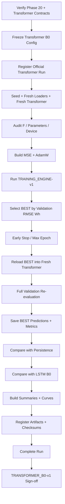
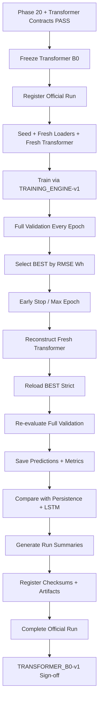

<div align="center">

# PHASE 21 — TRANSFORMER B0 RUN

## Kế hoạch thực thi official Transformer B0 run trên UCI Appliances Energy Prediction

### Multivariate Time-Series Regression — Sequence-to-One, One-Step-Ahead Forecasting

**Phase kế tiếp sau `Phase_20_LSTM_baseline_run.md`**

</div>

---

# 1. Vai trò của Phase 21

Phase 21 là **official Transformer baseline run đầu tiên** của coursework.

Nếu:

```text
Phase 16
→ implement Transformer

Phase 17
→ verify attention-aware encoder

Phase 18
→ actual forward sanity

Phase 19
→ khóa Training Engine

Phase 20
→ chạy official LSTM baseline
```

thì:

```text
Phase 21
→ thực thi Transformer B0 chính thức
```

trên cùng:

```text
data population
feature configuration
windowing protocol
scaling
batch size
training engine
selection metric
seed
```

để có một comparison công bằng với:

```text
Persistence

LSTM_B0.
```

Phase 21 là một:

```text
SCIENTIFIC DEVELOPMENT RUN
```

không phải:

```text
sanity run
dry run
hyperparameter sweep
final Test run.
```

Nguyên tắc trung tâm:

\[
\boxed{
Frozen\ Transformer\ B0
+
Fresh\ Seeded\ Run
+
Shared\ Training\ Engine
+
Best\ Validation\ Checkpoint
+
Fair\ Baseline\ Comparison
+
No\ Test
}
\]

---

# 2. Câu hỏi Phase 21 phải trả lời

Phase 21 phải trả lời:

> Với Transformer Encoder baseline B0 đã được khóa từ trước, hiệu năng Validation của bài toán dự báo `Appliances` 10 phút tiếp theo là bao nhiêu, quá trình train có ổn định không, checkpoint tốt nhất nằm ở epoch nào, và Transformer B0 cải thiện hay suy giảm so với Persistence và LSTM B0 trên cùng target population như thế nào?

Phase 21 không trả lời:

```text
Transformer hyperparameter nào tốt nhất?

Feature set nào tốt nhất?

Lookback nào tốt nhất?

Pooling nào tốt nhất?

Activation nào tốt nhất?

Transformer final Test performance là bao nhiêu?

Attention map cuối cùng nói lên điều gì?
```

Các câu hỏi đó thuộc các phase sau.

---

# 3. Output version

Gán scientific run-level contract:

```text
TRANSFORMER_B0-v1
```

Model implementation:

```text
TRANSFORMER-v1
TRANSFORMER_IMPL-v1
```

Attention verification:

```text
ATTENTION_VERIFY-v1
```

Training Engine:

```text
TRAINING_ENGINE-v1.
```

---

# 4. Lineage bắt buộc

```text
DATA-v1
  ↓
SCHEMA-v1
  ↓
TEMPORAL-v1
  ↓
EDA-v1
  ↓
FEATURES-v1
  ↓
FEATURESETS-v1
  ↓
SPLIT-v1
  ↓
SCALING-v1
  ↓
WINDOWS-v1
  ↓
WINDOWPOP-v1
  ↓
DATALOADERS-v1
  ↓
METRICS-v1
  ↓
EXPERIMENTS-v1
  ↓
TRANSFORMER_IMPL-v1
  ↓
ATTENTION_VERIFY-v1
  ↓
FORWARD_SANITY-v1
  ↓
TRAINING_ENGINE-v1
  ↓
TRANSFORMER_B0-v1
```

---

# 5. Phase 21 không phải Transformer tuning

Hard distinction:

```text
Phase 21
→ chạy đúng một Transformer B0 configuration đã pre-register

Phase 23–41
→ controlled Transformer sweeps

Phase 42
→ candidate synthesis

Phase 44
→ rolling-origin robustness

Phase 45
→ final model lock.
```

Không được nhìn Phase 21 rồi thay:

```text
feature set

time features

target scaling

lookback

pooling

activation

batch size

learning rate

weight decay

dropout

d_model

heads

layers

FFN

loss

epoch cap

gradient clipping

RevIN

boundary protocol
```

và vẫn gọi đó là Transformer B0.

---

# 6. Preconditions bắt buộc

Phase 21 chỉ bắt đầu khi:

```text
Phase 20 = PASS
```

và tối thiểu:

```text
Phase 16 = PASS
Phase 17 = PASS
Phase 18 = PASS
Phase 19 = PASS
Phase 20 = PASS
```

Bắt buộc truy được:

```text
WINDOWPOP-v1

METRICS-v1

EXPERIMENTS-v1

PERSISTENCE-v1

LSTM_BASELINE-v1

TRANSFORMER_IMPL-v1

ATTENTION_VERIFY-v1

FORWARD_SANITY-v1

TRAINING_ENGINE-v1.
```

---

# 7. Hard startup gate

Trước khi tạo official run:

```text
assert TRANSFORMER_IMPL-v1 == PASS

assert ATTENTION_VERIFY-v1 == PASS

assert FORWARD_SANITY-v1 == PASS

assert TRAINING_ENGINE-v1 == PASS

assert LSTM_BASELINE-v1 == PASS

assert Test access == LOCKED.
```

Nếu bất kỳ fingerprint quan trọng nào lệch:

```text
STOP.
```

---

# 8. Official experiment identity

Experiment family:

```text
TRANSFORMER_BASELINE
```

Model config ID:

```text
TRANSFORMER_B0
```

Recommended descriptive run label:

```text
TRANSFORMER_B0__FS1_TF1__L144__H1__YS1__WB0__D64__H4__N2__F128__DR01__GELU__LAST__B64__S42
```

Actual unique:

```text
run_id
```

do `EXPERIMENTS-v1` cấp.

---

# 9. Không tự chế run_id

Use:

```text
run label
```

cho readability.

Use Registry-generated:

```text
run_id
```

cho identity.

---

# 10. Official data configuration

Phase 21 khóa:

```text
Feature set:
FS1

Time features:
TF1

Feature variant:
FS1_TF1

Lookback:
L144

Lookback steps:
144

Lookback duration:
24 hours

Horizon:
H1

Forecast horizon:
10 minutes

Boundary protocol:
WB0

Target scaling:
YS1

Population:
WINDOWPOP-v1

Batch size:
64
```

---

# 11. Forecasting formulation

\[
X_{t-143:t}
\rightarrow
Appliances_{t+1}
\]

hoặc zero-based target-index form:

```text
input rows:
[j-144, ..., j-1]

target:
Appliances[j].
```

---

# 12. Input historical target rule

FS1 includes:

```text
historical Appliances.
```

Valid:

```text
Appliances[j-144 ... j-1].
```

Forbidden:

```text
Appliances[j]
```

inside model input.

---

# 13. Time features

TF1 includes exactly:

```text
hour_sin
hour_cos
dow_sin
dow_cos
weekend.
```

No extra calendar feature created in Phase 21.

---

# 14. Input scaling

Use:

```text
SCALING-v1
```

Train-only fitted feature scaler for:

```text
FS1_TF1.
```

No refit.

---

# 15. Target scaling

Official B0:

```text
YS1.
```

Training model output space:

```text
standardized target.
```

Metric space:

```text
original Wh.
```

---

# 16. Boundary protocol

Official:

```text
WB0.
```

Validation target may use preceding historical observations from earlier chronological period only when:

```text
all input timestamps precede target

continuity is valid

target is assigned to Validation

no target row enters input.
```

---

# 17. Common population

Transformer B0 must evaluate on exact:

```text
WINDOWPOP-v1
```

shared with:

```text
Persistence

LSTM_B0.
```

No Transformer-specific sample removal.

---

# 18. Official Transformer architecture

```text
model_family = TRANSFORMER_ENCODER

model_name = TransformerRegressor

model_config_id = TRANSFORMER_B0

input_projection = Linear(F,64)

positional_encoding = SINUSOIDAL

d_model = 64

num_heads = 4

num_layers = 2

ffn_dim = 128

dropout = 0.1

activation = GELU

pooling = LAST_STEP

norm_policy = POST_NORM

norm_first = False

layer_norm_eps = 1e-5

batch_first = True

is_causal = False

attn_mask = None

key_padding_mask = None

decoder = NONE

CLS_token = NONE

regression_head = Linear(64,1)

output_activation = NONE.
```

---

# 19. Input size

Runtime:

```text
input_size
=
registered feature_count(FS1_TF1).
```

Do not hard-code:

```text
31.
```

---

# 20. Tensor contract

\[
\boxed{
[B,144,F]
\rightarrow
[B,1]
}
\]

---

# 21. Transformer internal contract

```text
[B,144,F]
        ↓
Linear(F,64)
        ↓
[B,144,64]
        ↓
Sinusoidal PE
        ↓
Encoder Layer 1
        ↓
Encoder Layer 2
        ↓
[B,144,64]
        ↓
LAST_STEP
        ↓
[B,64]
        ↓
Linear(64,1)
        ↓
[B,1]
```

---

# 22. Attention-aware implementation remains enabled structurally

Model implementation supports attention inspection.

Nhưng normal training path:

```text
return_attention = False

need_weights = False.
```

---

# 23. Không extract attention trong training loop

Hard.

Không:

```text
save attention every batch

save attention every epoch

average heads during training.
```

---

# 24. Vì sao attention không thuộc Phase 21 training?

Attention đã được mechanics-verified ở Phase 17.

Scientific extraction/analyze thuộc:

```text
Phase 52–57.
```

Phase 21 chỉ cần tạo:

```text
correct trained checkpoint.
```

---

# 25. Optional post-run attention smoke?

Không bắt buộc.

Phase 18 đã smoke actual data.

Phase 21 không cần thêm scientific attention artifact để PASS.

Nếu thực hiện một tiny checkpoint smoke:

```text
label DIAGNOSTIC_ONLY
```

và không diễn giải.

Khuyến nghị:

```text
skip
```

để giữ phase gọn.

---

# 26. Official training configuration

```text
optimizer = AdamW

learning_rate = 3e-4

weight_decay = 1e-4

criterion = MSE

batch_size = 64

max_epochs = 50

early_stopping = True

patience = 10

min_delta = 0.0

gradient_clipping = True

gradient_clip_max_norm = 1.0

gradient_norm_type = 2.0

scheduler = None

mixed_precision = False

gradient_accumulation_steps = 1

torch_compile = False

seed = 42.
```

---

# 27. Official selection metric

Hard:

```text
Validation RMSE Wh.
```

Direction:

```text
MIN.
```

---

# 28. Secondary metrics

Record:

```text
Validation MAE Wh

Validation R².
```

No secondary metric decides checkpoint.

---

# 29. Optimization objective vs model-selection metric

Optimization:

```text
MSE in model space.
```

Selection:

```text
RMSE in original Wh.
```

These must remain distinct.

---

# 30. No scheduler

LR remains fixed:

```text
3e-4.
```

---

# 31. No mixed precision

Reference:

```text
float32.
```

---

# 32. No gradient accumulation

One optimizer step per batch.

---

# 33. No compilation

No:

```text
torch.compile.
```

---

# 34. No EMA/SWA

No moving-average weights.

---

# 35. No warmup

No.

---

# 36. No causal-mask experiment

Current baseline:

```text
full historical self-attention.
```

No mask sweep.

---

# 37. No alternate positional encoding

No learned PE.

---

# 38. No pre-norm switch

No.

---

# 39. No final LayerNorm addition

No architecture drift.

---

# 40. Seed policy

Official:

```text
seed = 42.
```

Exactly one B0 seed.

---

# 41. Fresh-run rule

Official execution sequence:

```text
set seed 42
↓
create fresh Train DataLoader
↓
create fresh Validation DataLoader
↓
instantiate fresh TRANSFORMER_B0
↓
move model to selected device
↓
build MSE
↓
build AdamW
↓
run TRAINING_ENGINE-v1.
```

---

# 42. Không reuse Phase 18 model

No.

---

# 43. Không reuse Phase 19 dry-run model

No.

---

# 44. Không reuse Phase 20 LSTM loader object

Even if data config is same.

Create fresh run-specific loaders.

---

# 45. Why fresh loaders even with same seed?

Each official run must have its own reproducible generator state and lineage.

---

# 46. Test DataLoader

Preferred:

```text
do not create.
```

---

# 47. Registry registration before training

Hard:

```text
register_run()
```

first.

---

# 48. Run lifecycle

```text
REGISTERED
→ RUNNING
→ COMPLETED
```

or:

```text
RUNNING
→ FAILED.
```

---

# 49. Run classification

```text
execution_type = TRAINING

experiment_family = TRANSFORMER_BASELINE

eligible_for_model_selection = False initially.
```

Only after successful completion:

```text
eligible_for_model_selection = True.
```

---

# 50. Test authorization

```text
test_access_authorized = False.
```

---

# 51. Config fingerprint

Must include:

```text
feature variant

scaler IDs

window/population

Transformer config

training config

seed

Training Engine

Metric version

attention implementation version.
```

---

# 52. Attention verification version is part of lineage

Run config must bind:

```text
ATTENTION_VERIFY-v1.
```

This proves trained Transformer implementation is the one whose attention path was verified.

---

# 53. Code fingerprint

Bind:

```text
Transformer source code fingerprint

Training Engine fingerprint.
```

---

# 54. Duplicate exact run detection

If same exact config + seed already completed:

```text
do not duplicate unintentionally.
```

---

# 55. Intentional rerun

If technical reproducibility rerun:

```text
new run_id

rerun_of = original run ID

reason recorded.
```

Not required for normal Phase 21.

---

# 56. Preflight audit

Verify:

```text
feature variant

feature order/fingerprint

X scaler

Y scaler

window version

population fingerprint

DataLoader version

Transformer implementation

attention verification

Training Engine

Metric version

seed

device policy

Test lock.
```

---

# 57. Runtime counts

Record observed:

```text
Train sample count

Validation sample count

Train batch count

Validation batch count

feature count.
```

No fabricated count.

---

# 58. Parameter count

Compute:

```text
total parameters

trainable parameters.
```

Store actual runtime count.

---

# 59. Parameter count fairness

Later compare with LSTM.

Do not claim models are parameter-matched.

---

# 60. Initial model fingerprint

Recommended:

```text
initial_model_state_fingerprint.
```

---

# 61. Training loop ownership

Phase 21 must call:

```text
TRAINING_ENGINE-v1.
```

No custom Transformer-specific train loop.

---

# 62. Training batch order

Inherited:

```text
zero_grad(set_to_none=True)

forward

exact shape assertion

finite prediction

MSE

finite loss

backward

gradient clipping

finite grad norm

optimizer.step.
```

---

# 63. Transformer forward during training

Hard:

```text
prediction = model(x)
```

not:

```text
model.forward_with_attention(x).
```

---

# 64. Gradient clipping

Reference:

```text
max_norm = 1.0

norm_type = 2.
```

---

# 65. Gradient diagnostic logging

Per epoch:

```text
mean_grad_norm_preclip

max_grad_norm_preclip

fraction_batches_clipped.
```

---

# 66. Why gradient logs matter for Transformer?

Can help diagnose:

```text
optimization instability

exploding gradients

excessive clipping
```

before Phase 22.

No mid-run change.

---

# 67. Full Train coverage

Every Train sample used once per epoch under shuffled DataLoader.

---

# 68. Train shuffle

Enabled according to DATALOADERS-v1.

---

# 69. Validation shuffle

Disabled.

---

# 70. Train loss aggregation

Sample-weighted.

---

# 71. Validation every epoch

Hard.

---

# 72. Validation mode

```text
model.eval()

torch.inference_mode().
```

---

# 73. Validation normal forward only

No attention extraction.

---

# 74. Validation full population

Must cover exactly:

```text
expected WINDOWPOP-v1 Validation IDs.
```

---

# 75. Validation prediction conversion

YS1:

```text
model-space prediction
→ inverse_transform
→ Wh.
```

---

# 76. Validation truth

Use:

```text
y_raw_wh.
```

---

# 77. Validation metrics

METRICS-v1:

```text
MAE Wh

RMSE Wh

R².
```

---

# 78. Checkpoint selection

Primary:

```text
minimum Validation RMSE Wh.
```

---

# 79. Full precision

No rounded metric for decision.

---

# 80. Strict improvement

\[
RMSE_{current}<RMSE_{best}
\]

because:

```text
min_delta = 0.
```

---

# 81. Tie

Equal metric:

```text
keep earlier best checkpoint.
```

---

# 82. Patience

```text
10.
```

---

# 83. Early-stop trigger

After:

```text
10 consecutive non-improving completed Validation epochs.
```

---

# 84. Epoch cap

```text
50.
```

---

# 85. Stop reason

Record:

```text
EARLY_STOPPING
```

or:

```text
MAX_EPOCHS.
```

---

# 86. Best epoch

Runtime value.

No assumption.

---

# 87. Last epoch

Runtime value.

May differ from best.

---

# 88. Best checkpoint

Official source for:

```text
Transformer B0 Validation result.
```

---

# 89. Last checkpoint

Resume/debug only.

---

# 90. Checksum

BEST and LAST:

```text
SHA-256.
```

---

# 91. Checkpoint lineage

Must bind:

```text
run_id

config fingerprint

feature fingerprint

population fingerprint

Transformer implementation version

attention verification version

Training Engine version.
```

---

# 92. Failure handling

Use Training Engine.

No custom recovery.

---

# 93. OOM behavior

If B64 normal training OOM:

```text
run FAILS.
```

Do not silently change to B32.

---

# 94. B32 is a registered sweep option

Master plan includes:

```text
B32 / B64
```

but batch sweep belongs:

```text
Phase 29.
```

Therefore B64 OOM in B0 requires explicit protocol decision, not hidden fallback.

---

# 95. Numerical failure

If:

```text
NaN/Inf prediction

loss

gradient norm
```

run fails.

---

# 96. No automatic LR reduction

No.

---

# 97. No automatic dropout increase

No.

---

# 98. No extra regularization mid-run

No.

---

# 99. No extra epochs after 50

No.

---

# 100. No alternate checkpoint because curve looks smoother

Official best determined by RMSE rule only.

---

# 101. Final best-checkpoint verification

After training:

```text
instantiate fresh Transformer B0

load BEST strict

model.eval()

full Validation

recompute predictions in Wh

recompute METRICS-v1.
```

---

# 102. Fresh reconstruction is mandatory

Do not just reuse in-memory final model and load best state informally without audit.

---

# 103. Required consistency

Reconstructed best:

```text
MAE

RMSE

R²
```

must match recorded best result within tolerance.

---

# 104. Best Validation predictions

Save from:

```text
verified BEST checkpoint.
```

---

# 105. Prediction artifact fields

```text
run_id

sample_idx

target_timestamp

y_true_wh

y_pred_wh

residual_wh

absolute_error_wh

squared_error_wh.
```

---

# 106. Residual convention

Use project METRICS-v1 convention.

Recommended:

\[
residual
=
y_{true}-y_{pred}.
\]

Do not flip sign ad hoc.

---

# 107. Prediction ordering

Chronological canonical sample order.

---

# 108. Prediction unit

```text
Wh.
```

---

# 109. No rounding

Full precision source.

---

# 110. Best metrics artifact

```text
best_validation_metrics.json.
```

---

# 111. Metrics fields

```text
run_id

checkpoint_type = BEST

best_epoch

n_samples

mae_wh

rmse_wh

r2

r2_status

metric_version

population_version

population_fingerprint

target_unit = Wh

status.
```

---

# 112. Training history

One row per completed epoch.

---

# 113. Required history fields

At minimum:

```text
epoch

train_loss_model_space

validation_loss_model_space

validation_mae_wh

validation_rmse_wh

validation_r2

learning_rate

mean_grad_norm_preclip

max_grad_norm_preclip

fraction_batches_clipped

is_best

best_epoch_so_far

best_validation_rmse_wh_so_far

bad_epochs_after_epoch

early_stop_triggered

epoch_duration_seconds.
```

---

# 114. Transformer-specific run summary

Create:

```text
transformer_b0_summary.json.
```

---

# 115. Summary minimum fields

```text
baseline_version = TRANSFORMER_B0-v1

run_id

model_version

implementation_version

attention_verification_version

training_engine_version

feature_variant

feature_fingerprint

lookback

horizon

target_scaling

boundary_protocol

batch_size

seed

d_model

num_heads

num_layers

ffn_dim

dropout

activation

pooling

trainable_parameters

stop_reason

epochs_completed

best_epoch

best_validation_mae_wh

best_validation_rmse_wh

best_validation_r2

persistence_run_id

lstm_baseline_run_id

persistence_validation_rmse_wh

lstm_validation_rmse_wh

rmse_delta_vs_persistence_wh

rmse_delta_vs_lstm_wh

rmse_improvement_vs_persistence_pct

rmse_improvement_vs_lstm_pct

best_checkpoint_sha256

test_status

audit_status.
```

---

# 116. Comparison target set

Transformer B0 must be compared with:

```text
Persistence

LSTM_B0
```

on exact same Validation sample IDs.

---

# 117. Comparison guard — population

Hard:

```text
population_fingerprint identical.
```

---

# 118. Comparison guard — metric

Hard:

```text
METRICS-v1 identical.
```

---

# 119. Comparison guard — target unit

Hard:

```text
Wh.
```

---

# 120. Comparison guard — target IDs

Hard equality after canonical ordering.

---

# 121. Comparison guard — horizon

All:

```text
H1.
```

---

# 122. Comparison guard — boundary protocol

All official B0 comparisons:

```text
WB0.
```

---

# 123. Comparison guard — feature/input nuance

Persistence is task-level baseline and does not share exact feature restriction.

LSTM B0 and Transformer B0 share:

```text
FS1_TF1.
```

Report this correctly.

---

# 124. RMSE delta vs Persistence

\[
\Delta RMSE_{T-P}
=
RMSE_{P}
-
RMSE_{T}
\]

Positive:

```text
Transformer better than Persistence.
```

---

# 125. RMSE improvement percentage vs Persistence

\[
Improvement_{T-P}
=
\frac{
RMSE_P-RMSE_T
}{
RMSE_P
}
\times100.
\]

---

# 126. RMSE delta vs LSTM

\[
\Delta RMSE_{T-L}
=
RMSE_L
-
RMSE_T.
\]

Positive:

```text
Transformer better than LSTM.
```

---

# 127. RMSE improvement percentage vs LSTM

\[
Improvement_{T-L}
=
\frac{
RMSE_L-RMSE_T
}{
RMSE_L
}
\times100.
\]

---

# 128. MAE deltas

Can similarly report absolute differences.

---

# 129. R² differences

Report:

```text
R²_Transformer - R²_baseline.
```

No percent.

---

# 130. Comparison table

Create:

```text
transformer_b0_vs_baselines_validation.csv.
```

Rows:

```text
Persistence

LSTM_B0

Transformer_B0.
```

---

# 131. Table fields

```text
model

run_id

feature_variant_or_task_baseline

population_fingerprint

mae_wh

rmse_wh

r2

trainable_parameters

rmse_delta_vs_transformer_wh optional

rmse_improvement_of_transformer_pct optional.
```

---

# 132. Alternative clearer comparison table

Recommended columns:

```text
model

MAE_Wh

RMSE_Wh

R2

RMSE_delta_vs_Persistence_Wh

RMSE_delta_vs_LSTM_Wh

Trainable_parameters

Validation_population_ID.
```

Machine source may use snake_case.

---

# 133. Same target IDs audit

Create explicit:

```text
baseline_comparison_population_audit.csv.
```

---

# 134. Comparison population audit fields

```text
comparison_pair

n_left

n_right

id_set_equal

order_equal_before_sort

population_fingerprint_equal

metric_version_equal

target_unit_equal

status.
```

---

# 135. Do not compare if guard fails

No partial/descriptive workaround.

Fix upstream identity issue.

---

# 136. Transformer B0 is allowed to lose

If:

```text
RMSE_Transformer > RMSE_LSTM
```

or worse than Persistence:

```text
report exactly.
```

No hidden tuning within Phase 21.

---

# 137. Phase 23+ exists specifically for improvement

Therefore Phase 21 baseline need not be artificially optimized.

---

# 138. No result-based rerun

Do not rerun seed 42 because score looks poor.

---

# 139. Technical rerun only

Allowed for:

```text
crash

corrupt artifact

verified infrastructure failure.
```

Must be logged.

---

# 140. No multiple random seeds

Phase 21 = seed 42 only.

---

# 141. Seed robustness later

Phase 46:

```text
42
123
2026.
```

---

# 142. No Test metrics

Hard:

```text
test_status = LOCKED.
```

---

# 143. No Test predictions

None.

---

# 144. No Test attention

None.

---

# 145. No final-generalization statement

Use:

```text
Validation performance.
```

---

# 146. Minimal operational learning curves

Recommended:

```text
Transformer training loss curve

Transformer Validation RMSE curve.
```

Detailed diagnosis belongs Phase 22.

---

# 147. Best epoch marker

Recommended.

---

# 148. LSTM RMSE reference line

Optional on Validation RMSE curve.

---

# 149. Persistence RMSE reference line

Optional.

---

# 150. Comparison lines require guards PASS

Yes.

---

# 151. No attention heatmap Phase 21

Hard.

---

# 152. No “head 3 looks important” Phase 21

Hard.

---

# 153. Runtime summary

Create:

```text
runtime_summary.json.
```

---

# 154. Runtime fields

```text
device

start_time

end_time

total_duration_seconds

epochs_completed

train_batches_total

validation_batches_total

global_optimizer_steps

peak_memory_optional

warnings.
```

---

# 155. Runtime is engineering diagnostic

Not selection metric.

---

# 156. Transformer gradient summary

Create:

```text
transformer_gradient_summary.json.
```

---

# 157. Gradient summary fields

```text
epochs_completed

global_max_grad_norm_preclip

epoch_of_global_max_grad_norm

mean_fraction_batches_clipped

max_fraction_batches_clipped_epoch

nonfinite_gradient_events

status.
```

---

# 158. Transformer training stability summary

Create:

```text
transformer_training_stability_summary.json.
```

Fields:

```text
nonfinite_predictions

nonfinite_losses

nonfinite_gradients

oom_events

early_stopped

stop_reason

best_epoch

last_epoch

best_rmse_wh

last_rmse_wh

best_to_last_rmse_change_wh

status.
```

---

# 159. Best-to-last gap

Diagnostic only.

Phase 22 interprets.

---

# 160. Parameter-count summary

Create:

```text
transformer_parameter_summary.json.
```

Fields:

```text
input_size

d_model

num_heads

head_dim

num_layers

ffn_dim

total_parameters

trainable_parameters

buffer_elements optional

status.
```

---

# 161. Why record head_dim?

Reference:

\[
64/4=16.
\]

But runtime artifact records actual.

---

# 162. Positional encoding buffer

Not trainable parameter.

Can record separately if desired.

---

# 163. Training curve artifact

Recommended:

```text
transformer_b0_training_curve.png.
```

---

# 164. Validation RMSE curve

Recommended:

```text
transformer_b0_validation_rmse_curve.png.
```

---

# 165. Baseline comparison chart

Optional:

```text
transformer_b0_vs_baselines_validation.png.
```

Could be generated Phase 22 instead.

Recommended Phase 21:

```text
table mandatory
plot optional.
```

---

# 166. Source-driven plots only

Generate from:

```text
training_history.csv

comparison CSV.
```

No manually typed values.

---

# 167. Run README

Create:

```text
README_TRANSFORMER_B0_RUN.md.
```

---

# 168. README content

```text
Purpose

Frozen Transformer B0 config

Data lineage

Architecture

Training protocol

Stop reason

Best epoch

Validation metrics

Comparison to Persistence

Comparison to LSTM B0

Checkpoint identity

Parameter count

Warnings

Test lock

Handoff to Phase 22/23.
```

---

# 169. No fabricated result text in template

Until execution:

```text
<runtime value>.
```

---

# 170. One-row run summary

Create:

```text
transformer_b0_run_summary.csv.
```

---

# 171. Summary columns

```text
run_id

model

seed

feature_variant

lookback

d_model

heads

layers

ffn_dim

dropout

activation

pooling

batch_size

epochs_completed

best_epoch

best_mae_wh

best_rmse_wh

best_r2

persistence_rmse_wh

lstm_rmse_wh

rmse_improvement_vs_persistence_pct

rmse_improvement_vs_lstm_pct

trainable_parameters

stop_reason

status.
```

---

# 172. Preflight audit

Create:

```text
transformer_b0_preflight_audit.csv.
```

---

# 173. Preflight checks

```text
phase20_pass

transformer_impl_pass

attention_verify_pass

forward_sanity_pass

training_engine_pass

feature_variant_match

feature_fingerprint_match

x_scaler_match

y_scaler_match

window_match

population_match

dataloader_match

metric_match

seed_match

B0_architecture_match

training_config_match

test_firewall

status.
```

---

# 174. Transformer B0 run contract

Create:

```text
transformer_b0_run_contract.json.
```

---

# 175. Contract minimum fields

```text
baseline_version = TRANSFORMER_B0-v1

experiment_family = TRANSFORMER_BASELINE

model_config_id = TRANSFORMER_B0

feature_variant = FS1_TF1

lookback = 144

horizon = 1

target_scaling = YS1

boundary_protocol = WB0

batch_size = 64

d_model = 64

num_heads = 4

num_layers = 2

ffn_dim = 128

dropout = 0.1

activation = GELU

pooling = LAST_STEP

positional_encoding = SINUSOIDAL

norm_policy = POST_NORM

causal_mask = false

padding_mask = false

optimizer = AdamW

learning_rate = 3e-4

weight_decay = 1e-4

criterion = MSE

max_epochs = 50

patience = 10

min_delta = 0

gradient_clip_max_norm = 1

seed = 42

selection_metric = validation_rmse_wh

attention_collection_during_training = false

test_access = forbidden.
```

---

# 176. Config immutability

Once run transitions:

```text
RUNNING
```

semantic config cannot change.

If semantic change required:

```text
fail/cancel run
create new run.
```

---

# 177. Run status artifact

```text
status.json.
```

---

# 178. Official run directory

```text
artifacts/
└── runs/
    └── <run_id>/
        ├── config.json
        ├── status.json
        ├── runtime_summary.json
        ├── training_history.csv
        ├── training.log
        ├── checkpoints/
        │   ├── best_checkpoint.pt
        │   └── last_checkpoint.pt
        ├── metrics/
        │   └── best_validation_metrics.json
        ├── predictions/
        │   └── best_validation_predictions.csv
        ├── diagnostics/
        │   ├── transformer_gradient_summary.json
        │   ├── transformer_training_stability_summary.json
        │   ├── transformer_parameter_summary.json
        │   ├── transformer_b0_training_curve.png
        │   └── transformer_b0_validation_rmse_curve.png
        └── audits/
            └── best_checkpoint_verification.json
```

---

# 179. Phase-level directory

```text
artifacts/
└── transformer_b0/
    ├── transformer_b0_run_contract.json
    ├── transformer_b0_preflight_audit.csv
    ├── transformer_b0_summary.json
    ├── transformer_b0_run_summary.csv
    ├── transformer_b0_vs_baselines_validation.csv
    ├── baseline_comparison_population_audit.csv
    ├── transformer_b0_audit.csv
    ├── transformer_b0_discrepancies.json
    ├── README_TRANSFORMER_B0_RUN.md
    └── phase_21_signoff.json
```

---

# 180. Output O21.1 — Official Registry run

One official:

```text
TRANSFORMER_BASELINE
```

run.

---

# 181. Output O21.2 — Frozen config

```text
config.json.
```

---

# 182. Output O21.3 — Training history

```text
training_history.csv.
```

---

# 183. Output O21.4 — Best checkpoint

```text
best_checkpoint.pt.
```

---

# 184. Output O21.5 — Last checkpoint

```text
last_checkpoint.pt.
```

---

# 185. Output O21.6 — Best Validation metrics

```text
best_validation_metrics.json.
```

---

# 186. Output O21.7 — Best Validation predictions

```text
best_validation_predictions.csv.
```

---

# 187. Output O21.8 — Runtime summary

```text
runtime_summary.json.
```

---

# 188. Output O21.9 — Gradient summary

```text
transformer_gradient_summary.json.
```

---

# 189. Output O21.10 — Stability summary

```text
transformer_training_stability_summary.json.
```

---

# 190. Output O21.11 — Parameter summary

```text
transformer_parameter_summary.json.
```

---

# 191. Output O21.12 — Baseline comparison

```text
transformer_b0_vs_baselines_validation.csv.
```

---

# 192. Output O21.13 — Population comparison audit

```text
baseline_comparison_population_audit.csv.
```

---

# 193. Output O21.14 — Transformer B0 summary

```text
transformer_b0_summary.json.
```

---

# 194. Output O21.15 — One-row summary

```text
transformer_b0_run_summary.csv.
```

---

# 195. Output O21.16 — Preflight audit

```text
transformer_b0_preflight_audit.csv.
```

---

# 196. Output O21.17 — Phase audit

```text
transformer_b0_audit.csv.
```

---

# 197. Output O21.18 — Discrepancy log

```text
transformer_b0_discrepancies.json.
```

---

# 198. Output O21.19 — README

```text
README_TRANSFORMER_B0_RUN.md.
```

---

# 199. Output O21.20 — Sign-off

```text
phase_21_signoff.json.
```

---

# 200. Phase audit fields

`transformer_b0_audit.csv` should verify:

```text
official_run_registered

experiment_family_correct

config_frozen

seed_42

FS1_TF1

L144

H1

YS1

WB0

B64

D64

H4

N2

FFN128

dropout_01

GELU

LAST_STEP

sinusoidal_PE

POST_NORM

no_causal_mask

no_padding_mask

no_attention_collection_training

AdamW

LR_3e-4

WD_1e-4

MSE

max_epochs_50

patience_10

clip_1

fresh_loaders

fresh_model

full_train_epochs

full_validation_epochs

selection_by_rmse_wh

best_checkpoint_valid

last_checkpoint_valid

best_checkpoint_reproduced

population_guard

metric_guard

persistence_comparison_guard

lstm_comparison_guard

registry_completed

test_locked

status.
```

---

# 201. Run-level acceptance tests

Recommended IDs:

```text
TBR21-001 ...
```

---

# 202. TBR21-001

Phase 20 PASS.

---

# 203. TBR21-002

TRANSFORMER_IMPL-v1 PASS.

---

# 204. TBR21-003

ATTENTION_VERIFY-v1 PASS.

---

# 205. TBR21-004

TRAINING_ENGINE-v1 PASS.

---

# 206. TBR21-005

Official run registered before training.

---

# 207. TBR21-006

Experiment family = TRANSFORMER_BASELINE.

---

# 208. TBR21-007

Model config ID = TRANSFORMER_B0.

---

# 209. TBR21-008

FS1_TF1 fingerprint match.

---

# 210. TBR21-009

WINDOWPOP-v1 fingerprint match.

---

# 211. TBR21-010

YS1 scaler match.

---

# 212. TBR21-011

WB0 match.

---

# 213. TBR21-012

B64 match.

---

# 214. TBR21-013

Seed 42.

---

# 215. TBR21-014

d_model 64.

---

# 216. TBR21-015

num_heads 4.

---

# 217. TBR21-016

head_dim 16.

---

# 218. TBR21-017

num_layers 2.

---

# 219. TBR21-018

ffn_dim 128.

---

# 220. TBR21-019

dropout 0.1.

---

# 221. TBR21-020

activation GELU.

---

# 222. TBR21-021

pooling LAST_STEP.

---

# 223. TBR21-022

sinusoidal PE.

---

# 224. TBR21-023

POST_NORM.

---

# 225. TBR21-024

is_causal=False.

---

# 226. TBR21-025

attn_mask=None.

---

# 227. TBR21-026

key_padding_mask=None.

---

# 228. TBR21-027

attention collection disabled during training.

---

# 229. TBR21-028

Fresh Train loader created after seeding.

---

# 230. TBR21-029

Fresh Validation loader created.

---

# 231. TBR21-030

Fresh Transformer instantiated.

---

# 232. TBR21-031

Actual model input size matches feature registry.

---

# 233. TBR21-032

Actual trainable parameter count recorded.

---

# 234. TBR21-033

AdamW LR correct.

---

# 235. TBR21-034

AdamW weight decay correct.

---

# 236. TBR21-035

MSE criterion correct.

---

# 237. TBR21-036

No scheduler.

---

# 238. TBR21-037

No AMP.

---

# 239. TBR21-038

No gradient accumulation.

---

# 240. TBR21-039

No torch.compile.

---

# 241. TBR21-040

Gradient clipping max norm 1.

---

# 242. TBR21-041

No Test loader accessed.

---

# 243. TBR21-042

Training history begins epoch 1.

---

# 244. TBR21-043

Every completed epoch has full Train result.

---

# 245. TBR21-044

Every completed epoch has full Validation result.

---

# 246. TBR21-045

Validation IDs match WINDOWPOP-v1.

---

# 247. TBR21-046

Validation sample count complete.

---

# 248. TBR21-047

Validation RMSE Wh recorded full precision.

---

# 249. TBR21-048

Best selection uses RMSE Wh only.

---

# 250. TBR21-049

Patience semantics correct.

---

# 251. TBR21-050

Best checkpoint saved on strict improvement.

---

# 252. TBR21-051

Last checkpoint saved every completed epoch.

---

# 253. TBR21-052

Best checkpoint checksum valid.

---

# 254. TBR21-053

Last checkpoint checksum valid.

---

# 255. TBR21-054

Best checkpoint strict reload PASS.

---

# 256. TBR21-055

Best checkpoint full Validation re-evaluation PASS.

---

# 257. TBR21-056

Re-evaluated RMSE matches recorded best.

---

# 258. TBR21-057

Best Validation predictions saved.

---

# 259. TBR21-058

Prediction IDs complete and unique.

---

# 260. TBR21-059

Prediction unit = Wh.

---

# 261. TBR21-060

Residual convention correct.

---

# 262. TBR21-061

Persistence comparison same IDs.

---

# 263. TBR21-062

LSTM comparison same IDs.

---

# 264. TBR21-063

Population fingerprints identical.

---

# 265. TBR21-064

Metric versions identical.

---

# 266. TBR21-065

Target units identical.

---

# 267. TBR21-066

RMSE delta vs Persistence correct.

---

# 268. TBR21-067

RMSE delta vs LSTM correct.

---

# 269. TBR21-068

Percentage improvement formulas correct.

---

# 270. TBR21-069

No result rounded before selection/comparison.

---

# 271. TBR21-070

Run summary generated from source artifacts.

---

# 272. TBR21-071

Gradient summary generated.

---

# 273. TBR21-072

Stability summary generated.

---

# 274. TBR21-073

Parameter summary generated.

---

# 275. TBR21-074

No scientific attention map generated.

---

# 276. TBR21-075

Registry metrics linked to best checkpoint.

---

# 277. TBR21-076

eligible_for_model_selection only after completion.

---

# 278. TBR21-077

Run transitions COMPLETED only after critical verification.

---

# 279. TBR21-078

Test status remains LOCKED.

---

# 280. TBR21-079

No score-based hidden rerun.

---

# 281. TBR21-080

Phase sign-off created.

---

# 282. Execution workflow — Step 1: Verify upstream contracts

Load:

```text
Phase 20 sign-off

TRANSFORMER_IMPL-v1 manifest

ATTENTION_VERIFY-v1 manifest

FORWARD_SANITY-v1 manifest

TRAINING_ENGINE-v1 manifest

METRICS-v1

EXPERIMENTS-v1.
```

---

# 283. Step 2: Freeze TRANSFORMER_B0 config

Build one canonical immutable config object.

---

# 284. Step 3: Preflight audit

Check lineage/fingerprints.

---

# 285. Step 4: Compute config fingerprint

Before model creation.

---

# 286. Step 5: Register official run

Obtain:

```text
run_id.
```

---

# 287. Step 6: Create run directory

```text
artifacts/runs/<run_id>/.
```

---

# 288. Step 7: Save immutable config

Before training.

---

# 289. Step 8: Seed run

Use seed 42.

---

# 290. Step 9: Create fresh Train/Validation loaders

No Test.

---

# 291. Step 10: Verify production loader lineage

Feature count, population, scaler IDs.

---

# 292. Step 11: Instantiate TRANSFORMER_B0

Use authoritative F.

---

# 293. Step 12: Parameter/device audit

Record actual counts.

---

# 294. Step 13: Build MSE + AdamW

Exact baseline hyperparameters.

---

# 295. Step 14: Transition Registry to RUNNING

---

# 296. Step 15: Execute TRAINING_ENGINE-v1

No custom loop.

---

# 297. Step 16: Operational monitoring only

Allowed observations:

```text
NaN

OOM

device failure

interrupt

artifact write failure.
```

No config tuning.

---

# 298. Step 17: End training

Record:

```text
stop reason

epochs completed

best epoch.
```

---

# 299. Step 18: Reconstruct fresh Transformer

Same B0 config.

---

# 300. Step 19: Load BEST strict

---

# 301. Step 20: Full Validation re-evaluation

Normal forward path.

---

# 302. Step 21: Recompute METRICS-v1

Wh.

---

# 303. Step 22: Save best Validation predictions

---

# 304. Step 23: Verify metric reproduction

---

# 305. Step 24: Load Persistence result

---

# 306. Step 25: Load LSTM B0 result

---

# 307. Step 26: Run population/metric identity audits

---

# 308. Step 27: Build three-model Validation comparison

---

# 309. Step 28: Build runtime/gradient/stability/parameter summaries

---

# 310. Step 29: Generate operational learning curves

---

# 311. Step 30: Register artifacts/checksums

---

# 312. Step 31: Complete official run

---

# 313. Step 32: Write Phase 21 sign-off

---

# 314. Recommended notebook structure

Khuyến nghị:

```text
26–32 cells.
```

## Cell 21.1 — Phase title

## Cell 21.2 — Verify Phase 20/upstream sign-offs

## Cell 21.3 — Declare TRANSFORMER_B0-v1

## Cell 21.4 — Build frozen B0 data config

## Cell 21.5 — Build frozen Transformer model config

## Cell 21.6 — Build frozen training config

## Cell 21.7 — Preflight lineage/fingerprint audit

## Cell 21.8 — Register official run

## Cell 21.9 — Save immutable config

## Cell 21.10 — Seed run

## Cell 21.11 — Create fresh Train/Validation DataLoaders

## Cell 21.12 — Verify production loader contracts

## Cell 21.13 — Instantiate fresh Transformer B0

## Cell 21.14 — Parameter/head-dimension/device audit

## Cell 21.15 — Build MSE/AdamW

## Cell 21.16 — Start Registry run

## Cell 21.17 — Execute TRAINING_ENGINE-v1

## Cell 21.18 — Review completion state only

## Cell 21.19 — Reconstruct fresh Transformer

## Cell 21.20 — Strict-load BEST checkpoint

## Cell 21.21 — Full Validation re-evaluation

## Cell 21.22 — Save best predictions

## Cell 21.23 — Verify best metric reproduction

## Cell 21.24 — Load Persistence baseline

## Cell 21.25 — Load LSTM B0 baseline

## Cell 21.26 — Verify comparison populations/metrics

## Cell 21.27 — Build comparison table

## Cell 21.28 — Build gradient/stability/parameter summaries

## Cell 21.29 — Generate operational curves

## Cell 21.30 — Register artifacts/checksums

## Cell 21.31 — Write README/audits

## Cell 21.32 — Phase sign-off

---

# 315. Execution flow



---

# 316. Phase 21 sanity checklist

```text
[ ] Phase 20 PASS.

[ ] TRANSFORMER_IMPL-v1 PASS.

[ ] ATTENTION_VERIFY-v1 PASS.

[ ] FORWARD_SANITY-v1 PASS.

[ ] TRAINING_ENGINE-v1 PASS.

[ ] TRANSFORMER_B0-v1 declared.

[ ] Experiment family = TRANSFORMER_BASELINE.

[ ] Model config = TRANSFORMER_B0.

[ ] FS1_TF1 locked.

[ ] L144 locked.

[ ] H1 locked.

[ ] YS1 locked.

[ ] WB0 locked.

[ ] WINDOWPOP-v1 locked.

[ ] B64 locked.

[ ] Seed 42 locked.

[ ] Input size derived from feature registry.

[ ] Linear input projection enabled.

[ ] d_model 64.

[ ] heads 4.

[ ] head_dim 16.

[ ] layers 2.

[ ] FFN 128.

[ ] dropout 0.1.

[ ] GELU.

[ ] LAST_STEP pooling.

[ ] Sinusoidal PE.

[ ] POST_NORM.

[ ] no causal mask.

[ ] no padding mask.

[ ] no decoder.

[ ] no CLS token.

[ ] linear regression head.

[ ] no output activation.

[ ] AdamW.

[ ] LR 3e-4.

[ ] WD 1e-4.

[ ] MSE.

[ ] max epochs 50.

[ ] patience 10.

[ ] min_delta 0.

[ ] grad clip 1.

[ ] no scheduler.

[ ] no AMP.

[ ] no accumulation.

[ ] no compile.

[ ] attention collection OFF during training.

[ ] Run registered before training.

[ ] Config fingerprint generated.

[ ] Code fingerprints linked.

[ ] Attention verification version linked.

[ ] Config saved immutable.

[ ] Seed set before loader/model creation.

[ ] Fresh Train loader.

[ ] Fresh Validation loader.

[ ] No Test loader used.

[ ] Feature fingerprint matches.

[ ] Population fingerprint matches.

[ ] X/Y scaler identity matches.

[ ] Model input size matches authoritative F.

[ ] Actual parameter count recorded.

[ ] Model moved to selected device.

[ ] PE buffer moved with model.

[ ] Criterion exact.

[ ] Optimizer exact.

[ ] Registry RUNNING before fit.

[ ] TRAINING_ENGINE-v1 used.

[ ] No custom training loop.

[ ] model(x) normal path only.

[ ] No attention weights collected.

[ ] Exact output-target shape enforced.

[ ] Nonfinite guards active.

[ ] Gradient clipping after backward.

[ ] Full Train sample coverage.

[ ] Full Validation each epoch.

[ ] Validation population guard each epoch.

[ ] YS1 inverse-transform before metrics.

[ ] Validation MAE Wh recorded.

[ ] Validation RMSE Wh recorded.

[ ] Validation R² recorded.

[ ] RMSE Wh selects BEST.

[ ] Full precision used.

[ ] BEST checkpoint immediate.

[ ] LAST checkpoint each completed epoch.

[ ] Early stopping semantics correct.

[ ] Stop reason recorded.

[ ] Best epoch recorded.

[ ] BEST SHA valid.

[ ] LAST SHA valid.

[ ] Fresh Transformer reconstructed after training.

[ ] BEST strict-load PASS.

[ ] Full Validation rerun PASS.

[ ] Metrics reproduced.

[ ] Best Validation predictions saved.

[ ] Prediction IDs complete and unique.

[ ] Prediction unit Wh.

[ ] Residual convention correct.

[ ] Persistence baseline loaded.

[ ] LSTM B0 baseline loaded.

[ ] Same population guard PASS.

[ ] Same target IDs guard PASS.

[ ] Same metric version guard PASS.

[ ] RMSE delta vs Persistence correct.

[ ] RMSE delta vs LSTM correct.

[ ] Improvement percentages correct.

[ ] No result rounding before decisions.

[ ] No hidden rerun for better score.

[ ] No Test metrics.

[ ] No Test predictions.

[ ] No Test attention.

[ ] Gradient summary generated.

[ ] Stability summary generated.

[ ] Parameter summary generated.

[ ] Operational curves generated.

[ ] Comparison CSV generated.

[ ] Registry artifacts linked.

[ ] eligible_for_model_selection=True only after critical PASS.

[ ] Run COMPLETED only after verification.

[ ] Phase 21 sign-off saved.
```

---

# 317. Acceptance criteria

Phase 21 chỉ PASS khi:

```text
Exactly the frozen TRANSFORMER_B0 configuration is used.

The run starts from fresh seed/loaders/model.

All training is executed through TRAINING_ENGINE-v1.

Attention-weight collection remains disabled during training.

Full Train and Validation populations are respected.

Validation RMSE Wh is the only checkpoint-selection metric.

BEST and LAST checkpoints are valid and checksummed.

BEST checkpoint reproduces its recorded Validation metrics.

Best Validation predictions are complete and traceable.

Persistence, LSTM and Transformer comparisons use identical target IDs.

No B0 hyperparameter changes mid-run.

No score-based reruns occur.

No Test data is accessed.

Critical artifacts are registered and reproducible.
```

---

# 318. Khi nào Phase 21 FAIL?

```text
Wrong feature variant.

Wrong lookback.

Wrong scaling.

Wrong boundary protocol.

Wrong batch size.

Wrong seed.

Transformer architecture differs from B0.

Causal mask accidentally enabled.

Attention weights collected throughout training.

Training loop bypasses TRAINING_ENGINE-v1.

Validation checkpoint selected by model-space loss.

Validation population incomplete.

Best checkpoint cannot be reconstructed.

Predictions do not align with Persistence/LSTM sample IDs.

OOM causes silent batch fallback.

NaN batch is skipped.

Hyperparameters are changed after seeing curve.

Seed is rerun because metric looks poor.

Test is accessed.
```

---

# 319. Các lỗi thường gặp

## Lỗi 1 — Transformer B0 chưa tốt nên tăng d_model lên 128

Không.

Phase 33 mới là d_model sweep.

---

# 320. Lỗi 2 — Tăng heads từ 4 lên 8

Không nằm B0 và cũng không nằm current planned head sweep.

---

# 321. Lỗi 3 — Thêm causal mask vì thấy đây là time series

Không theo current task formulation.

---

# 322. Lỗi 4 — Bật `forward_with_attention()` mỗi batch

Tốn compute/memory và sai phase responsibility.

---

# 323. Lỗi 5 — Đổi LAST_STEP thành MEAN vì Validation xấu

Phase 27 mới kiểm pooling.

---

# 324. Lỗi 6 — Đổi GELU thành ReLU

Phase 28.

---

# 325. Lỗi 7 — Giảm B64 thành B32 vì OOM mà không tạo config mới

Protocol drift.

Phase 29 có batch sweep.

---

# 326. Lỗi 8 — Thay LR

Phase 30.

---

# 327. Lỗi 9 — Thay WD

Phase 31.

---

# 328. Lỗi 10 — Tăng dropout khi thấy overfit

Phase 32.

---

# 329. Lỗi 11 — Thêm layer

Phase 35.

---

# 330. Lỗi 12 — Tăng FFN

Phase 36.

---

# 331. Lỗi 13 — Đổi MSE thành Huber

Phase 37.

---

# 332. Lỗi 14 — Train đến 100 epochs

Phase 38.

---

# 333. Lỗi 15 — Tắt gradient clipping

Phase 39.

---

# 334. Lỗi 16 — Thêm RevIN

Phase 40.

---

# 335. Lỗi 17 — Đổi WB0 thành WB1

Phase 41.

---

# 336. Lỗi 18 — Run nhiều seed rồi lấy seed tốt nhất làm B0

Sai.

Phase 46 mới multi-seed.

---

# 337. Lỗi 19 — Chọn checkpoint dựa trên R² cao nhất

Sai selection metric.

---

# 338. Lỗi 20 — Chọn checkpoint dựa trên Validation loss thấp nhất

Sai.

---

# 339. Lỗi 21 — So Transformer/LSTM trên cùng N nhưng không cùng sample IDs

Không đủ.

---

# 340. Lỗi 22 — Report attention pattern từ random/best B0 ngay Phase 21

Scientific attention analysis thuộc Phase 52+.

---

# 341. Lỗi 23 — Tuyên bố Transformer final tốt hơn LSTM từ một Validation seed

Chỉ được nói:

```text
Transformer B0 có Validation RMSE thấp/cao hơn LSTM B0 ở run seed 42.
```

Không suy rộng quá mức.

---

# 342. Lỗi 24 — Xem Test để “xác nhận xu hướng”

Forbidden.

---

# 343. Handoff sang Phase 22

Phase 22 — Learning-curve Diagnostics nhận:

```text
Persistence Validation baseline

LSTM B0 training_history

LSTM best predictions

Transformer B0 training_history

Transformer best predictions

gradient summaries

stability summaries

best/last epochs

run metadata.
```

Phase 22 phân tích:

```text
learning dynamics

underfitting

overfitting

optimization stability

early stopping

gradient behavior

relative baseline trajectories.
```

---

# 344. Handoff sang Phase 23

Phase 23 bắt đầu controlled Transformer experiments.

Baseline reference:

```text
TRANSFORMER_B0-v1.
```

---

# 345. One-factor-at-a-time rule

Every sweep should begin from:

```text
current reference config
```

and alter only designated factor according to master experimental schedule.

Do not back-edit Phase 21.

---

# 346. Handoff Phase 23 — Feature-set sweep

Compares:

```text
FS0_TF1

FS1_TF1

FS2_TF1.
```

B0 reference row:

```text
FS1_TF1.
```

---

# 347. Handoff Phase 24 — Time-feature sweep

Compares:

```text
TF0

TF1
```

while feature-set family fixed.

---

# 348. Handoff Phase 25 — Target scaling

```text
YS0 vs YS1.
```

---

# 349. Handoff Phase 26 — Lookback

```text
L36
L72
L144.
```

---

# 350. Handoff Phase 27 — Pooling

```text
LAST_STEP
MEAN.
```

---

# 351. Handoff Phase 28 — Activation

```text
RELU
GELU.
```

---

# 352. Handoff Phase 29 — Batch size

```text
B32
B64.
```

---

# 353. Handoff Phase 30 — Learning rate

```text
1e-4
3e-4
1e-3.
```

---

# 354. Handoff Phase 31 — Weight decay

```text
0
1e-4
1e-3.
```

---

# 355. Handoff Phase 32 — Dropout

```text
0.1
0.2
0.3.
```

---

# 356. Handoff Phase 33 — d_model

```text
32
64.
```

---

# 357. Handoff Phase 34 — Heads

```text
2
4.
```

---

# 358. Handoff Phase 35 — Layers

```text
1
2.
```

---

# 359. Handoff Phase 36 — FFN

```text
64
128
256.
```

---

# 360. Handoff Phase 37 — Loss

```text
MSE
Huber.
```

Selection remains RMSE Wh.

---

# 361. Handoff Phase 38 — Epoch cap

```text
50
100.
```

---

# 362. Handoff Phase 39 — Gradient clipping

```text
OFF
ON max_norm 1.
```

---

# 363. Handoff Phase 40 — RevIN

```text
OFF
ON.
```

---

# 364. Handoff Phase 41 — Boundary protocol

```text
WB0
WB1.
```

---

# 365. Handoff Phase 42

Candidate synthesis will query B0 and sweep runs using:

```text
EXPERIMENTS-v1.
```

---

# 366. Handoff Phase 44

Rolling-origin robustness must not use Phase 21 Validation result to alter fold definitions.

---

# 367. Handoff Phase 45

Final model lock may differ from B0.

Phase 21 remains baseline historical artifact.

---

# 368. Handoff Phase 46

Final seeds apply only after final config is locked.

---

# 369. Handoff Phase 47

No Phase 21 Test access.

Test remains untouched until final evaluation.

---

# 370. Handoff Phase 52–57

Final attention analysis uses:

```text
final locked checkpoint(s)
```

not necessarily Transformer B0.

Phase 21's attention-aware lineage ensures architecture pipeline is ready.

---

# 371. Handoff Phase 58

Final report can include B0 result as:

```text
initial Transformer baseline
```

if useful.

Do not confuse with final tuned Transformer.

---

# 372. Handoff Phase 59

Conclusion can discuss improvement from:

```text
B0
→ tuned/final Transformer
```

if experimentally supported.

---

# 373. Phase 21 Definition of Done



Phase 21 hoàn thành khi:

\[
\boxed{
Frozen\ Transformer\ B0
+
Fresh\ Seeded\ Training
+
Verified\ Best\ Validation\ Checkpoint
+
Fair\ Persistence/LSTM\ Comparison
+
Complete\ Provenance
+
No\ Test
}
\]

được đảm bảo.

---

# 374. Final status contract

```text
Phase 21 runs exactly ONE official Transformer B0.

Data:
FS1_TF1
L144
H1
YS1
WB0
WINDOWPOP-v1
B64

Transformer:
D64
H4
N2
FFN128
dropout 0.1
GELU
LAST_STEP
sinusoidal PE
POST_NORM
no causal mask

Training:
AdamW
LR 3e-4
WD 1e-4
MSE
max 50 epochs
patience 10
clip norm 1.0
seed 42

Training attention extraction:
OFF.

Selection:
minimum Validation RMSE Wh.

Comparison:
Persistence
LSTM_B0
same target IDs.

No tuning.
No score-based rerun.
No Test.

Only after TRANSFORMER_B0-v1 PASS
may the project move to
PHASE 22 — Learning-curve Diagnostics.
```

---

# 375. Nguồn kỹ thuật cần follow khi implement

Phase 21 không cần viết lại API-level logic đã khóa ở các phase trước. Khi implementation thực tế cần tra cứu, ưu tiên:

```text
PyTorch official documentation
```

cho:

```text
torch.optim.AdamW

torch.nn.MSELoss

torch.nn.utils.clip_grad_norm_

torch.inference_mode

state_dict checkpointing.
```

Không thay semantic contract của Phase 19 chỉ vì một implementation convenience.

---

<div align="center">

# PHASE 21 — FINAL CHECK

**Transformer B0 là baseline cố định, không phải nơi tuning.**

**Fresh seed, fresh loaders và fresh Transformer là bắt buộc.**

**Training phải chạy qua cùng `TRAINING_ENGINE-v1` đã dùng cho LSTM.**

**Attention weights không được thu thập trong training.**

**Best checkpoint chỉ chọn bằng Validation RMSE trên Wh.**

**Transformer B0 phải được so với Persistence và LSTM trên đúng cùng target IDs.**

**Kết quả yếu vẫn phải giữ nguyên nếu protocol đúng.**

**Không được mở Test.**

**Chỉ sau khi `TRANSFORMER_B0-v1` được sign-off mới chuyển sang PHASE 22 — Learning-curve Diagnostics.**

</div>
