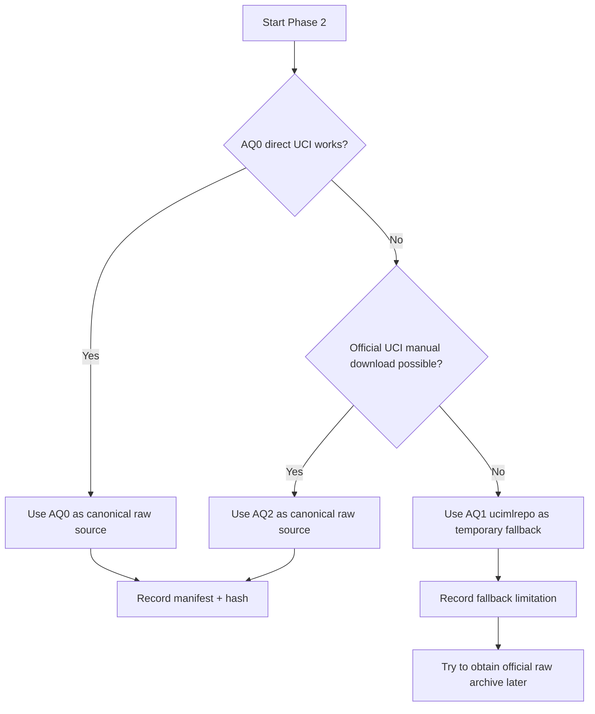
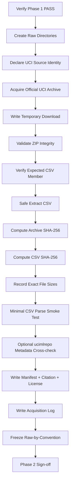
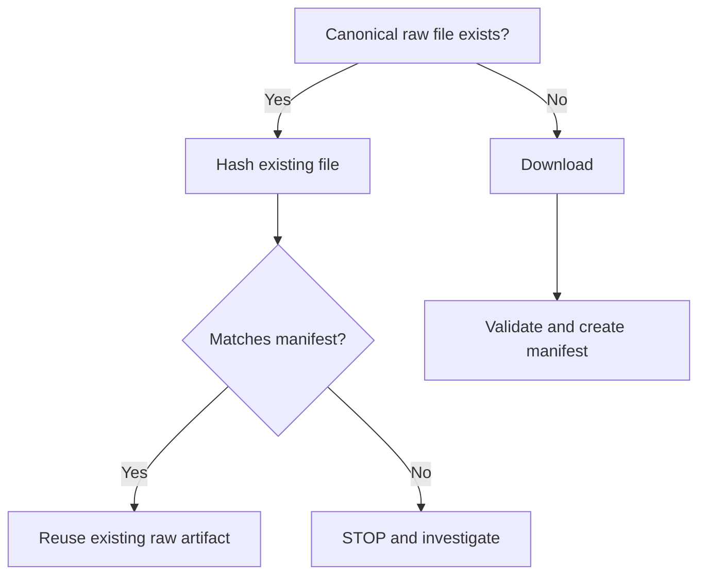
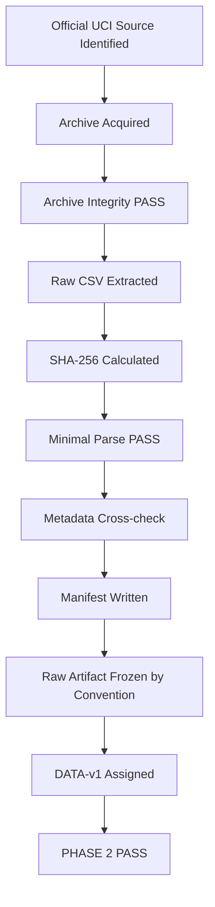

<div align="center">

# PHASE 2 — DATA ACQUISITION

## Kế hoạch thu nhận, xác minh nguồn gốc và đóng băng dữ liệu thô

### Transformer Encoder cho hồi quy chuỗi thời gian đa biến trên UCI Appliances Energy Prediction

**Phase kế tiếp sau `Phase_1_Environment.md`**

</div>

---

# 1. Vai trò của Phase 2

Phase 2 chịu trách nhiệm **thu nhận đúng bộ dữ liệu chính thức, bảo toàn dữ liệu thô và tạo đầy đủ provenance** trước khi bất kỳ xử lý dữ liệu nào diễn ra.

Nếu:

```text
Phase 0
→ khóa experimental contract

Phase 1
→ khóa environment
```

thì:

```text
Phase 2
→ khóa DATA SOURCE và RAW DATA ARTIFACT
```

Phase này phải bảo đảm rằng mọi experiment từ Phase 3 đến Phase 59 đều có thể truy ngược về:

```text
Nguồn dữ liệu chính thức
Dataset ID
DOI
License
Thời điểm tải
Phương pháp tải
File gốc
Checksum
File size
Environment ID
```

Mục tiêu không chỉ là “có một file CSV để đọc”, mà phải bảo đảm:

\[
\boxed{
Source\ Authenticity
+
Raw\ Integrity
+
Provenance
+
Immutability
+
Reproducibility
}
\]

---

# 2. Những gì UCI chính thức xác nhận

Bộ dữ liệu:

```text
Appliances Energy Prediction
```

UCI ID:

```text
374
```

DOI:

```text
10.24432/C5VC8G
```

Loại dữ liệu:

```text
Multivariate
Time-Series
```

Tác vụ:

```text
Regression
```

Số quan sát theo metadata UCI:

```text
19,735
```

Số predictor features theo UCI:

```text
28
```

File dữ liệu chính:

```text
energydata_complete.csv
```

Kích thước hiển thị trên UCI:

```text
khoảng 11.4 MB
```

Sampling:

```text
10 phút
```

Thời gian thu thập:

```text
khoảng 4.5 tháng
```

License:

```text
Creative Commons Attribution 4.0 International
CC BY 4.0
```

UCI cũng cung cấp cách import bằng:

```python
from ucimlrepo import fetch_ucirepo
dataset = fetch_ucirepo(id=374)
```

Tuy nhiên, **canonical raw artifact của coursework nên vẫn là file được tải trực tiếp từ UCI**, không phải CSV tự export lại từ một DataFrame.

---

# 3. Mục tiêu cần đạt sau Phase 2

Sau Phase 2 phải có:

```text
1. Một bản sao raw của archive/file tải từ UCI.

2. File energydata_complete.csv được extract nguyên trạng.

3. Raw file không bị chỉnh sửa trong place.

4. SHA-256 checksum của archive và CSV.

5. Dataset provenance manifest.

6. Citation metadata.

7. License metadata.

8. Acquisition timestamp.

9. Source URL/source identifier.

10. Acquisition method.

11. Minimal file-integrity smoke test.

12. Optional cross-check bằng ucimlrepo.

13. Raw data directory có cấu trúc cố định.

14. Phase 2 sign-off = PASS.
```

---

# 4. Những việc Phase 2 không làm

Phase 2 **không thực hiện**:

```text
Không phân tích dtypes chi tiết.

Không xác định missing-value pattern.

Không kiểm tra correlation.

Không phân tích target distribution.

Không parse date thành datetime cho modeling.

Không drop rv1 / rv2.

Không feature engineering.

Không tạo calendar features.

Không chronological split.

Không fit scaler.

Không tạo sliding windows.

Không tạo DataLoader.

Không sửa raw CSV.

Không train model.
```

Các nhiệm vụ đó thuộc:

```text
Phase 3+
```

Phase 2 chỉ được phép làm các kiểm tra tối thiểu để xác minh:

```text
file có tồn tại
file không rỗng
archive extract được
CSV đọc được ở mức smoke test
```

Không biến Phase 2 thành Schema Audit hoặc EDA.

---

# 5. Nguyên tắc nguồn dữ liệu

Thứ tự ưu tiên nguồn:

```text
PRIMARY
UCI Machine Learning Repository

SECONDARY VERIFICATION
Official ucimlrepo package

REFERENCE ONLY
Tác giả / associated paper / author GitHub

NOT FOR PRIMARY ACQUISITION
Kaggle mirrors
GitHub copies không được UCI chỉ định
blog attachments
random cloud mirrors
```

Nguyên tắc:

> Main coursework phải sử dụng bản dữ liệu có provenance rõ ràng từ UCI.

---

# 6. Acquisition options — phải chuẩn bị đầy đủ

Phase 2 có ba phương án acquisition.

## AQ0 — Direct UCI archive download

Đây là **primary method**.

UCI hiện cung cấp dataset archive tại endpoint dạng:

```text
UCI dataset 374
→ official download archive
→ appliances+energy+prediction.zip
```

Archive chứa file chính:

```text
energydata_complete.csv
```

Ưu điểm:

```text
Giữ được raw upstream artifact.

Dễ hash chính xác.

Dễ lưu immutable copy.

Không phụ thuộc serialization của Pandas.

Provenance rõ.
```

---

## AQ1 — Official `ucimlrepo` fetch

Dùng:

```python
from ucimlrepo import fetch_ucirepo

dataset = fetch_ucirepo(id=374)
```

Vai trò trong coursework:

```text
Metadata verification

Variable-role verification

Programmatic acquisition fallback

Cross-check dataset identity
```

Không dùng:

```text
DataFrame → to_csv()
```

rồi gọi file đó là canonical raw UCI CSV.

Lý do:

```text
Export lại có thể thay formatting,
float serialization,
column ordering behavior,
index behavior,
date representation.
```

AQ1 là **verification/fallback path**, không thay thế raw archive nếu AQ0 hoạt động.

---

## AQ2 — Manual download from official UCI page

Dùng khi:

```text
programmatic download bị lỗi mạng
endpoint thay đổi
environment chặn download trực tiếp
```

Điều kiện:

```text
Chỉ tải từ official UCI dataset page.

Không tải từ mirror khác.

Sau khi tải vẫn phải:
hash
record provenance
extract
verify
```

---

# 7. Quy tắc chọn acquisition method



Khuyến nghị:

```text
AQ0 > AQ2 > AQ1-export
```

đối với raw-file preservation.

---

# 8. Không tải dataset trong Phase 1

Phase 2 phải bắt đầu bằng việc xác nhận:

```text
Phase 1 Sign-off = PASS
```

và có:

```text
ENV-v1
environment_report.json
requirements_freeze.txt
```

Nếu môi trường chưa khóa:

```text
STOP
```

Không acquisition rồi mới quay lại đổi interpreter/package.

---

# 9. Cấu trúc thư mục raw data

Khuyến nghị:

```text
coursework/
│
├── data/
│   └── raw/
│       └── uci_appliances_energy_prediction/
│           ├── source/
│           │   └── appliances_energy_prediction.zip
│           │
│           ├── energydata_complete.csv
│           ├── dataset_manifest.json
│           ├── checksums.sha256
│           ├── source_metadata.json
│           ├── variable_metadata.csv
│           └── README_SOURCE.md
│
└── artifacts/
    └── acquisition/
        ├── acquisition_log.json
        └── phase_2_signoff.json
```

Tên archive local có thể được chuẩn hóa thành:

```text
appliances_energy_prediction.zip
```

nhưng manifest phải lưu:

```text
upstream/original download name
```

nếu khác.

---

# 10. Quy tắc raw immutable copy

Sau khi tải:

```text
Không edit raw archive.

Không edit raw CSV.

Không overwrite raw CSV bằng Pandas.

Không fill missing values trong raw file.

Không đổi column names trong raw file.

Không sort raw file.

Không xóa rv1 / rv2 trong raw file.

Không convert date format trong raw file.
```

Mọi transform sau này phải tạo:

```text
derived object
hoặc
processed artifact
```

Raw directory là:

```text
READ-ONLY BY CONVENTION
```

Có thể thêm file:

```text
README_SOURCE.md
```

ghi rõ:

```text
DO NOT MODIFY RAW DATA IN PLACE
```

---

# 11. Có nên chmod read-only không?

Optional:

```text
Có thể chmod raw archive/CSV thành read-only trên POSIX.
```

Nhưng đây không phải requirement bắt buộc vì:

```text
Windows khác permission model.

Notebook portability quan trọng.

Version-control/data policy có thể khác.
```

Primary protection vẫn là:

```text
code convention + checksum + manifest
```

Nếu chmod:

```text
ghi trong acquisition log.
```

---

# 12. Acquisition timestamp

Ghi cả:

```text
UTC timestamp
Local timestamp / timezone
```

Ví dụ field:

```text
acquired_at_utc
acquired_at_local
timezone
```

Không dùng:

```text
"today"
"yesterday"
```

trong manifest.

---

# 13. Dataset identity fields

Manifest phải có:

```text
dataset_name
uci_id
dataset_doi
dataset_page
associated_task
characteristics
target_name
reported_num_instances
reported_num_features
reported_sampling_interval
reported_duration
license
creator
```

Các giá trị lấy từ UCI metadata.

Không suy luận thêm ở Phase 2.

---

# 14. Source provenance fields

Manifest phải ghi:

```text
source_provider
source_type
source_url
download_method
original_download_name
local_archive_path
local_csv_path
acquisition_timestamp
environment_id
```

Ví dụ:

```text
source_provider = UCI Machine Learning Repository
source_type = official_repository
download_method = AQ0_direct_uci
environment_id = ENV-v1
```

---

# 15. SHA-256 checksum

Sử dụng:

```text
SHA-256
```

cho:

```text
download archive
energydata_complete.csv
```

Mục đích:

```text
detect accidental modification
verify repeat acquisition
trace exact raw version used by experiments
```

Không dùng file size một mình để xác nhận integrity.

---

# 16. Hashing code pattern

Python standard library là đủ:

```python
from hashlib import sha256
from pathlib import Path

def sha256_file(path: Path, chunk_size: int = 1024 * 1024) -> str:
    h = sha256()
    with path.open("rb") as f:
        while chunk := f.read(chunk_size):
            h.update(chunk)
    return h.hexdigest()
```

Không load toàn bộ file vào RAM chỉ để hash.

Dù dataset nhỏ, streaming hashing là pattern chuẩn.

---

# 17. `checksums.sha256`

File nên có dạng:

```text
<SHA256_ARCHIVE>  source/appliances_energy_prediction.zip
<SHA256_CSV>      energydata_complete.csv
```

Hash thực tế chỉ được điền sau acquisition.

Không đưa placeholder giống thật vào final artifact.

---

# 18. Archive integrity check

Nếu UCI cung cấp ZIP:

Kiểm tra:

```text
archive tồn tại
archive size > 0
ZIP mở được
ZIP integrity test pass
expected CSV member tồn tại
```

Có thể dùng:

```python
from zipfile import ZipFile

with ZipFile(archive_path) as zf:
    bad_file = zf.testzip()
    assert bad_file is None
```

Nếu:

```text
bad_file != None
```

thì archive bị lỗi.

Không tiếp tục Phase 3.

---

# 19. Safe extraction

Không extract archive một cách thiếu kiểm soát nếu có thể tránh.

Quy trình:

```text
1. List archive members.
2. Xác nhận expected member.
3. Xác nhận path không escape raw directory.
4. Extract expected file.
```

Dataset này có expected main file:

```text
energydata_complete.csv
```

Không cần extract các file không liên quan nếu archive sau này chứa thêm nội dung và coursework không sử dụng.

---

# 20. Existing-file policy

Nếu raw file đã tồn tại:

```text
Không overwrite ngay.
```

Phải:

```text
1. Hash existing file.
2. Hash newly downloaded candidate.
3. Nếu hash giống:
   reuse existing canonical copy.
4. Nếu hash khác:
   tạo acquisition revision.
5. Không âm thầm replace.
```

Ví dụ:

```text
DATA-v1
DATA-v2
```

nếu upstream artifact thực sự thay đổi.

---

# 21. Dataset revision ID

Sau acquisition thành công:

```text
DATA-v1
```

Experiment registry sau này phải có:

```text
dataset_id = DATA-v1
```

Nếu raw hash thay đổi:

```text
DATA-v2
```

và phải xác định:

```text
các run DATA-v1 có còn so sánh trực tiếp được không.
```

---

# 22. Minimal CSV smoke test

Phase 2 chỉ đọc một số dòng để xác nhận:

```text
File có thể parse dưới dạng CSV.

Header tồn tại.

Không phải HTML error page.

Không bị empty/corrupted.
```

Ví dụ:

```python
preview = pd.read_csv(csv_path, nrows=5)
```

Chỉ kiểm tra:

```text
preview.shape[0] > 0
column header tồn tại
```

Không thực hiện:

```text
dtype audit
missing-value audit
range audit
```

vì đó là Phase 3.

---

# 23. Không dùng `pd.read_csv()` full dataset như một phân tích ở Phase 2

Có thể đọc full CSV chỉ khi:

```text
cần xác minh file parse hoàn chỉnh
```

nhưng không:

```text
describe()
isna()
corr()
sort_values()
```

ở Phase 2.

Nếu full parsing được dùng làm integrity check:

```text
không lưu transformed DataFrame thành raw artifact.
```

---

# 24. File-size check

Ghi:

```text
archive bytes
CSV bytes
```

UCI hiện hiển thị file CSV khoảng:

```text
11.4 MB
```

Tuy nhiên:

```text
Không dùng "11.4 MB" như exact assertion.
```

Lý do:

```text
Website display có rounding.
ZIP/archive size khác CSV size.
Filesystem representation có thể khác.
```

Exact value phải lấy:

```python
path.stat().st_size
```

---

# 25. Optional `ucimlrepo` metadata cross-check

Nếu package khả dụng:

```python
from ucimlrepo import fetch_ucirepo

uci_ds = fetch_ucirepo(id=374)
```

Cross-check:

```text
UCI ID
Dataset name
Target role
Number of instances metadata
Number of features metadata
DOI nếu field có
```

Không dùng discrepancy để “tự sửa” raw CSV trong Phase 2.

Nếu discrepancy:

```text
ghi vào acquisition log
→ Phase 3 điều tra.
```

---

# 26. Optional variable metadata snapshot

Có thể lưu:

```text
variable_metadata.csv
```

từ official UCI/ucimlrepo variable metadata.

Mục đích:

```text
Phase 3 schema audit
Feature documentation
Unit/reference lookup
```

Đây là metadata artifact, không phải modeling data.

---

# 27. Optional source metadata snapshot

Lưu:

```text
source_metadata.json
```

gồm các metadata UCI có thể serialize an toàn.

Không cần lưu mọi field phức tạp nếu package trả object không JSON-safe.

Chỉ lưu:

```text
các field cần provenance.
```

---

# 28. Citation contract

README/source manifest phải chứa citation dataset:

```text
Candanedo, L. (2017).
Appliances Energy Prediction [Dataset].
UCI Machine Learning Repository.
DOI: 10.24432/C5VC8G
```

Không bỏ DOI trong report cuối.

---

# 29. License contract

Ghi:

```text
CC BY 4.0
```

và nguyên tắc:

```text
dataset có thể được chia sẻ/adapt với attribution phù hợp.
```

Không tự suy diễn thêm điều khoản pháp lý ngoài metadata UCI.

---

# 30. `README_SOURCE.md`

Nội dung tối thiểu:

```text
Dataset name
UCI ID
DOI
Source
License
Acquisition date
Acquisition method
Canonical raw files
Dataset revision ID
SHA-256
Immutability rule
Citation
```

File này giúp người chấm hoặc thành viên nhóm hiểu raw data đến từ đâu mà không cần đọc code.

---

# 31. Acquisition log

`acquisition_log.json` nên ghi:

```text
run_id
environment_id
dataset_revision
method
start_time
end_time
status
source
archive_path
csv_path
archive_size_bytes
csv_size_bytes
archive_sha256
csv_sha256
archive_integrity_ok
csv_smoke_test_ok
ucimlrepo_crosscheck_status
notes
```

---

# 32. Acquisition status values

Dùng enum rõ:

```text
PASS
PASS_WITH_WARNING
FAIL
```

Không dùng mô tả mơ hồ:

```text
seems fine
probably okay
```

---

# 33. Khi nào dùng `PASS_WITH_WARNING`?

Ví dụ:

```text
AQ0 direct endpoint thất bại,
nhưng AQ2 manual official UCI download thành công.

ucimlrepo metadata service tạm lỗi,
nhưng official raw archive và hash hợp lệ.
```

Có thể tiếp tục Phase 3 nếu:

```text
canonical official raw data đã có
và integrity pass.
```

---

# 34. Khi nào Phase 2 phải FAIL?

```text
Không xác định được nguồn chính thức.

Archive corrupt.

CSV không extract được.

energydata_complete.csv không tồn tại.

CSV không parse được dù chỉ header/sample.

Hash không tạo được.

File bị overwrite không rõ provenance.

Chỉ có mirror không xác minh được.

Raw artifact đã bị preprocessing trước khi lưu.
```

Nếu FAIL:

```text
Không chuyển Phase 3.
```

---

# 35. Network-failure policy

Nếu download thất bại:

```text
Không retry vô hạn.
```

Quy trình:

```text
Retry có giới hạn
→ ghi lỗi
→ thử official manual download
→ thử ucimlrepo
```

Không chuyển ngay sang Kaggle mirror chỉ vì UCI tạm lỗi.

---

# 36. Download retry policy

Ví dụ:

```text
attempts = 3
```

với delay hợp lý.

Không cần exponential-backoff framework phức tạp cho coursework.

Log:

```text
attempt number
error
time
```

---

# 37. Partial-download protection

Download programmatic nên:

```text
ghi ra temporary file trước
```

ví dụ:

```text
*.part
```

Sau khi:

```text
download hoàn tất
archive validation pass
```

mới atomic rename thành canonical filename.

Mục đích:

```text
không nhầm partial file là raw dataset hợp lệ.
```

---

# 38. Atomic-write policy cho manifest

Tương tự:

```text
write temporary JSON
→ fsync nếu cần
→ rename
```

Coursework nhỏ không bắt buộc implement phức tạp, nhưng ít nhất:

```text
không tạo manifest PASS trước khi hash/integrity checks hoàn tất.
```

---

# 39. Không dùng download timestamp như dataset version duy nhất

Hai lần tải khác ngày có thể là cùng exact bytes.

Dataset identity chính nên dựa trên:

```text
UCI ID
DOI
SHA-256
```

Timestamp chỉ là provenance bổ sung.

---

# 40. No preprocessing during acquisition

Không thực hiện:

```python
df.drop(...)
df.rename(...)
df.fillna(...)
df.sort_values(...)
df.astype(...)
```

rồi ghi lại vào:

```text
data/raw/
```

Nếu cần một derived copy:

```text
data/processed/
```

nhưng processed data chưa thuộc Phase 2.

---

# 41. No train/test split during Phase 2

Không:

```text
train.csv
val.csv
test.csv
```

ở Phase 2.

Lý do:

```text
Phase 8 mới chịu trách nhiệm chronological split.
```

Raw acquisition phải giữ full chronological source.

---

# 42. No `rv1` / `rv2` removal

Dù Phase 0 đã quyết định main model sẽ không dùng `rv1`, `rv2`:

```text
Phase 2 vẫn phải giữ hai cột trong raw CSV.
```

Việc loại chúng xảy ra ở:

```text
feature-set construction
```

không phải acquisition.

---

# 43. No date conversion

Raw:

```text
date
```

phải được giữ đúng cách upstream cung cấp.

Không overwrite thành:

```text
Unix timestamp
ISO timezone
datetime dtype serialization
```

Phase 3/4/6 sẽ xử lý.

---

# 44. Reproducibility contract với Phase 1

Manifest phải chứa:

```text
environment_id = ENV-v1
```

Nếu acquisition được thực hiện trong môi trường khác:

```text
ghi environment revision thực tế.
```

Dù dữ liệu download độc lập với model environment, provenance vẫn nên giữ liên kết.

---

# 45. Notebook structure cho Phase 2

Khuyến nghị:

```text
10–14 cells
```

## Cell 2.1 — Phase title

Markdown.

## Cell 2.2 — Source contract

```text
UCI ID
DOI
License
Expected filename
```

## Cell 2.3 — Path configuration

```text
PROJECT_ROOT
RAW_DIR
SOURCE_DIR
ARTIFACT_DIR
```

## Cell 2.4 — Acquisition-method selection

```text
AQ0 / AQ1 / AQ2
```

## Cell 2.5 — Download

Chỉ acquisition.

## Cell 2.6 — Archive integrity

ZIP check.

## Cell 2.7 — Safe extraction

Extract CSV.

## Cell 2.8 — SHA-256 hashing

Archive + CSV.

## Cell 2.9 — Minimal CSV smoke test

`nrows=5`.

## Cell 2.10 — Optional ucimlrepo cross-check

Không thay raw artifact.

## Cell 2.11 — Manifest creation

## Cell 2.12 — README/source metadata

## Cell 2.13 — Acquisition report

## Cell 2.14 — Phase sign-off

---

# 46. Quy trình thực thi Phase 2



---

# 47. Kỹ thuật follow chuẩn

Thứ tự bắt buộc:

```text
Source identity
→ Download
→ Integrity
→ Extraction
→ Hash
→ Smoke test
→ Metadata cross-check
→ Manifest
→ Sign-off
```

Không:

```text
download
→ preprocess
→ rồi mới hash
```

Hash phải đại diện cho raw artifact.

---

# 48. Minimal programmatic acquisition skeleton

Ví dụ thiết kế, không phải code triển khai cuối:

```python
DATASET = {
    "name": "Appliances Energy Prediction",
    "uci_id": 374,
    "doi": "10.24432/C5VC8G",
    "expected_csv": "energydata_complete.csv",
    "dataset_revision": "DATA-v1",
}
```

Sau đó tách hàm:

```text
download_archive()
validate_archive()
extract_expected_csv()
sha256_file()
smoke_test_csv()
write_manifest()
```

Không viết tất cả logic trong một notebook cell khổng lồ.

---

# 49. Function design khuyến nghị

```text
ensure_directories()

download_with_retries()

validate_zip()

safe_extract_member()

sha256_file()

file_size_bytes()

smoke_test_csv()

fetch_uci_metadata_optional()

write_json_atomic()

write_source_readme()
```

Các function nên:

```text
nhỏ
single-purpose
raise error rõ ràng
không silent fail
```

---

# 50. Idempotency

Phase 2 nên có khả năng chạy lại an toàn.

Nếu file tồn tại và hash hợp lệ:

```text
không download lại bắt buộc.
```

Nếu muốn force refresh:

```text
dùng explicit flag
```

ví dụ:

```text
FORCE_DOWNLOAD = False
```

Không overwrite mặc định.

---

# 51. Idempotency decision



---

# 52. Data-source mismatch handling

Nếu:

```text
UCI metadata says one thing
raw CSV later appears different
```

Phase 2 không tự sửa.

Ghi:

```text
SOURCE_METADATA_MISMATCH
```

vào log.

Phase 3 mới kiểm tra:

```text
actual schema
actual row count
actual columns
```

---

# 53. UCI metadata count lưu ý

UCI page hiện thể hiện:

```text
19,735 instances
28 features
```

Trong một số giao diện browse, tổng column-related display có thể gây nhầm giữa:

```text
predictors
target
date
```

Do đó Phase 2 chỉ lưu metadata nguyên bản.

Phase 3 sẽ xác nhận actual CSV schema.

Không điều chỉnh con số bằng phỏng đoán trong Phase 2.

---

# 54. Security lưu ý khi extract ZIP

Dù đây là nguồn UCI đáng tin cậy, extraction code vẫn nên tránh:

```text
../../path
absolute paths
unexpected destination
```

Safe extraction là best practice chung.

Không dùng:

```text
extractall()
```

một cách mù quáng nếu chỉ cần một known member.

---

# 55. Không dùng OCR hoặc copy-paste dataset

Không:

```text
copy bảng từ website
paste thành CSV
```

Main dataset phải đến từ:

```text
official raw artifact
```

---

# 56. Không dùng browser-save HTML nhầm thành CSV

Minimal smoke test giúp phát hiện:

```text
download response là HTML error page
```

thay vì real archive/CSV.

Nếu file bắt đầu như:

```html
<html>
```

thì:

```text
FAIL acquisition.
```

---

# 57. Optional networkless handoff

Nếu coursework cần chạy trên máy không có internet sau này:

Phase 2 raw artifact + manifest + hashes phải đủ để:

```text
copy project
→ verify hash
→ tiếp tục Phase 3+
```

không phải download lại.

Đây là một lợi ích lớn của canonical raw copy.

---

# 58. Version-control policy

Nếu dùng Git:

Khuyến nghị:

```text
Không commit .venv.

Raw dataset có thể không commit tùy repo policy.

Commit:
manifest
README_SOURCE
checksums
acquisition code
```

Nếu không commit raw CSV:

```text
README phải hướng dẫn tái acquisition.
```

License CC BY 4.0 cho phép sharing với attribution, nhưng repository policy vẫn có thể quyết định không lưu binary/data file lớn.

---

# 59. Output bắt buộc của Phase 2

## O2.1 — Canonical source archive

```text
data/raw/uci_appliances_energy_prediction/source/
appliances_energy_prediction.zip
```

hoặc official equivalent.

---

## O2.2 — Canonical raw CSV

```text
data/raw/uci_appliances_energy_prediction/
energydata_complete.csv
```

---

## O2.3 — SHA-256 file

```text
checksums.sha256
```

---

## O2.4 — Dataset manifest

```text
dataset_manifest.json
```

---

## O2.5 — Source metadata

```text
source_metadata.json
```

---

## O2.6 — Variable metadata

```text
variable_metadata.csv
```

nếu ucimlrepo cross-check thành công.

---

## O2.7 — Source README

```text
README_SOURCE.md
```

---

## O2.8 — Acquisition log

```text
artifacts/acquisition/acquisition_log.json
```

---

## O2.9 — Phase sign-off

```text
artifacts/acquisition/phase_2_signoff.json
```

---

# 60. `dataset_manifest.json` field contract

Khuyến nghị:

```text
dataset_revision
dataset_name
uci_id
doi
creator
license
task
characteristics
reported_num_instances
reported_num_features
reported_sampling_interval_minutes
reported_duration
target
source_provider
source_url
download_method
original_download_filename
local_archive_path
local_csv_path
archive_size_bytes
csv_size_bytes
archive_sha256
csv_sha256
acquired_at_utc
acquired_at_local
timezone
environment_id
archive_integrity_ok
csv_smoke_test_ok
ucimlrepo_crosscheck_status
```

---

# 61. Phase 2 sanity checks

```text
[ ] Phase 1 = PASS.

[ ] ENV-v1 tồn tại.

[ ] UCI dataset ID = 374.

[ ] DOI đã ghi.

[ ] License đã ghi.

[ ] Acquisition method có ID AQ0/AQ1/AQ2.

[ ] Official UCI source được dùng.

[ ] Archive tồn tại.

[ ] Archive > 0 byte.

[ ] ZIP integrity pass.

[ ] energydata_complete.csv có trong archive.

[ ] CSV extract thành công.

[ ] CSV > 0 byte.

[ ] Archive SHA-256 đã tạo.

[ ] CSV SHA-256 đã tạo.

[ ] File sizes đã ghi.

[ ] Minimal CSV smoke test pass.

[ ] Raw file chưa bị transform.

[ ] rv1/rv2 chưa bị drop.

[ ] date chưa bị convert và overwrite.

[ ] Chưa split Train/Val/Test.

[ ] Manifest đã tạo.

[ ] Citation đã ghi.

[ ] License đã ghi.

[ ] README_SOURCE đã tạo.

[ ] Acquisition log đã tạo.

[ ] DATA-v1 đã gán.

[ ] Phase 2 sign-off = PASS.
```

---

# 62. Acceptance criteria

Phase 2 chỉ PASS khi:

```text
Official source xác định rõ.

Canonical raw archive có provenance.

Canonical CSV tồn tại.

Raw bytes được hash.

Archive integrity hợp lệ.

CSV parse smoke test hợp lệ.

Raw data chưa preprocessing.

Manifest đầy đủ.

Acquisition có thể tái kiểm tra bằng checksum.
```

---

# 63. Những lỗi thường gặp

## Lỗi 1 — Tải từ Kaggle vì tiện

Không dùng làm primary source khi UCI đã cung cấp official artifact.

---

## Lỗi 2 — Chỉ giữ DataFrame trong memory

Không đủ provenance.

Phải có raw artifact persistent.

---

## Lỗi 3 — `fetch_ucirepo()` rồi `to_csv()` và gọi đó là raw file

Không chuẩn.

Đó là một reserialization.

---

## Lỗi 4 — Drop `rv1`, `rv2` ngay khi tải

Sai phase.

Raw phải giữ nguyên.

---

## Lỗi 5 — Parse/sort date rồi overwrite raw file

Sai.

---

## Lỗi 6 — Không hash file

Sau này không biết raw data có bị thay đổi hay không.

---

## Lỗi 7 — Chỉ ghi “downloaded from UCI”

Chưa đủ.

Cần:

```text
dataset ID
DOI
method
timestamp
checksum
```

---

## Lỗi 8 — Overwrite file cũ khi download lại

Phải hash và revision trước.

---

## Lỗi 9 — Dùng website file size làm exact integrity check

Website có thể round.

Dùng exact byte size + SHA-256.

---

## Lỗi 10 — Biến Phase 2 thành EDA

Schema/EDA thuộc Phase 3–5.

---

# 64. Điều kiện chuyển sang Phase 3

Chỉ chuyển sang:

```text
PHASE 3 — Schema audit
```

khi:

```text
DATA-v1 canonical raw artifact exists
+
checksums exist
+
manifest exists
+
Phase 2 sign-off = PASS
```

Phase 3 phải đọc:

```text
canonical energydata_complete.csv
```

được xác định ở Phase 2.

Không đọc:

```text
một CSV copy khác
một notebook-exported CSV
một Kaggle version
```

---

# 65. Phase 2 Definition of Done



Phase 2 hoàn thành khi:

\[
\boxed{
Authentic\ Source
+
Immutable\ Raw\ Copy
+
Cryptographic\ Checksum
+
Provenance\ Manifest
+
Integrity\ Verification
}
\]

đã được thiết lập.

---

# 66. Final status contract

```text
Phase 2 không thay đổi nội dung dataset.

Phase 2 không thực hiện modeling preprocessing.

Phase 2 không split data.

Phase 2 chỉ tạo canonical raw source và provenance.

Mọi phase sau phải sử dụng đúng DATA-v1.
```

---

# 67. Nguồn tham chiếu kỹ thuật

## UCI Machine Learning Repository

Dataset:

```text
Appliances Energy Prediction
```

Thông tin chính thức được sử dụng trong Phase 2:

```text
UCI ID 374
19,735 instances
28 predictor features
Multivariate / Time-Series
Regression
energydata_complete.csv
10-minute observations
approximately 4.5 months
DOI 10.24432/C5VC8G
CC BY 4.0
```

## Official `ucimlrepo`

Vai trò:

```text
Programmatic dataset import
Metadata access
Variable metadata access
Dataset ID lookup
```

Dùng như:

```text
verification / fallback acquisition mechanism
```

không thay thế raw-file preservation strategy.

---

<div align="center">

# PHASE 2 — FINAL CHECK

**Source phải là UCI chính thức.**

**Raw file phải được giữ nguyên.**

**Checksum phải được tạo trước mọi preprocessing.**

**Dataset provenance phải đủ để tái xác minh sau nhiều tháng.**

**Chỉ sau khi `DATA-v1` được sign-off mới chuyển sang Phase 3.**

</div>
