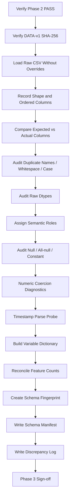
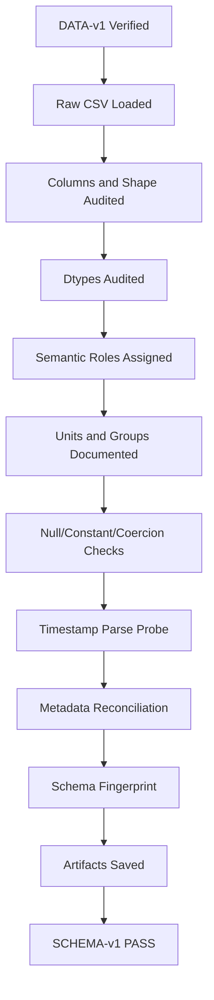

<div align="center">

# PHASE 3 — SCHEMA AUDIT

## Kế hoạch kiểm toán cấu trúc, kiểu dữ liệu, vai trò biến và tính nhất quán schema

### Transformer Encoder cho hồi quy chuỗi thời gian đa biến trên UCI Appliances Energy Prediction

**Phase kế tiếp sau `Phase_2_Data_acquisition.md`**

</div>

---

# 1. Vai trò của Phase 3

Phase 3 chịu trách nhiệm **kiểm toán schema của dữ liệu thô canonical `DATA-v1`** trước khi bắt đầu kiểm tra sâu về temporal integrity, EDA hoặc feature engineering.

Nếu:

```text
Phase 0
→ khóa coursework contract

Phase 1
→ khóa environment

Phase 2
→ khóa nguồn dữ liệu và raw artifact
```

thì:

```text
Phase 3
→ xác minh RAW DATA THỰC TẾ có cấu trúc như thế nào.
```

Phase này phải trả lời chính xác:

```text
CSV có bao nhiêu dòng và bao nhiêu cột?

Tên cột thực tế là gì?

Thứ tự cột là gì?

Pandas đang suy luận dtype nào?

Cột nào là target?

Cột nào là timestamp?

Cột nào là predictor?

Cột nào là random control?

Đơn vị của từng biến là gì?

Metadata UCI và raw CSV có nhất quán không?

Có cột bất ngờ hay cột bị thiếu không?

Có dtype bất thường không?

Có cột toàn null hoặc toàn một giá trị không?

Schema có đủ an toàn để chuyển sang temporal audit không?
```

Phase 3 không được “sửa” dữ liệu ngay khi thấy vấn đề.

Nhiệm vụ của phase này là:

\[
\boxed{
Observe
+
Compare
+
Classify
+
Document
+
Fail\ Fast
}
\]

---

# 2. Mục tiêu cần đạt sau Phase 3

Sau khi hoàn thành Phase 3 phải có:

```text
1. Actual dataset shape.

2. Exact raw column list.

3. Exact column order.

4. Raw inferred dtypes.

5. Semantic role của từng cột.

6. Unit của từng cột.

7. Expected-vs-actual schema comparison.

8. Target identification.

9. Timestamp identification.

10. Predictor-group classification.

11. Random-control identification.

12. Missing-column detection.

13. Unexpected-column detection.

14. Duplicate-column-name detection.

15. Constant-column detection.

16. All-null-column detection.

17. Numeric coercion diagnostics.

18. Schema discrepancy log.

19. Machine-readable schema manifest.

20. Phase 3 sign-off.
```

---

# 3. Nguồn dữ liệu đầu vào

Phase 3 chỉ được đọc:

```text
DATA-v1 canonical raw CSV
```

được Phase 2 xác định tại:

```text
data/raw/uci_appliances_energy_prediction/
energydata_complete.csv
```

Không được dùng:

```text
Kaggle copy

CSV export từ ucimlrepo

training.csv của tác giả

testing.csv của tác giả

CSV đã xử lý

CSV copy từ notebook khác
```

Trước khi đọc, phải xác minh:

```text
Phase 2 Sign-off = PASS

CSV checksum hiện tại
=
CSV checksum trong dataset_manifest.json
```

Nếu hash khác:

```text
STOP
```

và quay lại Phase 2.

---

# 4. Nguồn tham chiếu schema

Schema audit sử dụng ba tầng tham chiếu:

## S0 — Raw CSV

Đây là nguồn sự thật cuối cùng về:

```text
actual columns
actual order
actual row count
actual serialized values
```

---

## S1 — UCI official metadata

Dùng để đối chiếu:

```text
dataset characteristics
target role
variable names
types
units
missing-value claims
reported instance count
reported feature count
```

UCI hiện xác nhận:

```text
Dataset: Appliances Energy Prediction
Instances: 19,735
Detailed page: 28 features
Target: Appliances
Data characteristics: Multivariate, Time-Series
Task: Regression
Missing values: No
```

---

## S2 — Author-linked documentation

Repository của tác giả được UCI liên kết, dùng để hiểu:

```text
column semantics
units
room/location meanings
rv1/rv2 intention
```

S2 không được dùng để override raw CSV khi tên cột thực tế khác.

---

# 5. Điểm cần đặc biệt kiểm tra: metadata feature-count discrepancy

Một điểm quan trọng đã được phát hiện từ nguồn UCI:

```text
Detailed dataset page:
# Features = 28
```

nhưng giao diện browse của UCI hiện có nơi hiển thị:

```text
29 Features
```

Raw CSV phổ biến của dataset này được kỳ vọng có:

```text
29 total columns
```

bao gồm:

```text
date
Appliances
lights
...
rv1
rv2
```

Do đó Phase 3 phải **tách khái niệm**:

```text
Total raw columns
Predictor features
Target
Timestamp/other role
```

Không được thấy:

```text
29 raw columns
```

rồi kết luận UCI metadata sai ngay lập tức.

Cần lập reconciliation table.

---

# 6. Expected raw column schema

Expected raw columns cần kiểm tra:

```text
date
Appliances
lights
T1
RH_1
T2
RH_2
T3
RH_3
T4
RH_4
T5
RH_5
T6
RH_6
T7
RH_7
T8
RH_8
T9
RH_9
T_out
Press_mm_hg
RH_out
Windspeed
Visibility
Tdewpoint
rv1
rv2
```

Tổng expected raw columns:

```text
29
```

Phase 3 phải lấy danh sách actual từ CSV và so sánh bằng code.

Không hard-code kết luận trước khi chạy.

---

# 7. Semantic role contract

Schema audit phải gán role cho từng cột.

## ROLE_TIME

```text
date
```

## ROLE_TARGET

```text
Appliances
```

## ROLE_FEATURE

```text
lights

T1 ... T9
RH_1 ... RH_9

T_out
Press_mm_hg
RH_out
Windspeed
Visibility
Tdewpoint
```

## ROLE_RANDOM_CONTROL

```text
rv1
rv2
```

Random controls vẫn là raw predictors về mặt file structure nhưng được phân loại riêng vì Phase 7 sẽ tạo feature-set variants.

---

# 8. Feature-group taxonomy

Ngoài role, cần gán `feature_group`.

## G0 — Time

```text
date
```

## G1 — Target

```text
Appliances
```

## G2 — Lighting

```text
lights
```

## G3 — Indoor temperature

```text
T1
T2
T3
T4
T5
T7
T8
T9
```

## G4 — Indoor humidity

```text
RH_1
RH_2
RH_3
RH_4
RH_5
RH_7
RH_8
RH_9
```

## G5 — Local outdoor sensor

```text
T6
RH_6
```

## G6 — Weather-station variables

```text
T_out
Press_mm_hg
RH_out
Windspeed
Visibility
Tdewpoint
```

## G7 — Random controls

```text
rv1
rv2
```

Lưu ý:

```text
T6 / RH_6
```

là cảm biến phía ngoài tòa nhà phía bắc, khác nhóm weather-station Chievres.

Không gộp hai nhóm này về mặt semantic documentation.

---

# 9. Expected unit mapping

Schema manifest nên lưu unit.

| Variable | Unit |
|---|---|
| `Appliances` | Wh |
| `lights` | Wh |
| `T1`–`T9` | °C |
| `RH_1`–`RH_9` | % |
| `T_out` | °C |
| `Press_mm_hg` | mm Hg |
| `RH_out` | % |
| `Windspeed` | m/s |
| `Visibility` | km |
| `Tdewpoint` | °C |
| `rv1` | dimensionless |
| `rv2` | dimensionless |
| `date` | timestamp string in raw CSV |

Phase 3 chỉ ghi units từ documentation.

Không chuyển đơn vị.

---

# 10. UCI naming-vs-raw naming reconciliation

UCI additional variable description có thể sử dụng wording như:

```text
To
Pressure
```

trong phần mô tả tự do.

Raw CSV lại được kỳ vọng dùng:

```text
T_out
Press_mm_hg
```

Phase 3 phải lưu:

```text
canonical_raw_name
documentation_alias
```

Ví dụ:

| Raw name | Documentation alias |
|---|---|
| `T_out` | `To` |
| `Press_mm_hg` | `Pressure` |

Không rename raw columns ở Phase 3.

Feature engineering/modeling code sau này nên sử dụng raw canonical names để tránh ambiguity.

---

# 11. Dataset loading strategy

Đọc canonical CSV bằng Pandas.

Baseline:

```python
df_raw = pd.read_csv(RAW_CSV_PATH)
```

Không dùng:

```text
parse_dates
dtype overrides
index_col
usecols
```

trong lần đọc đầu tiên.

Lý do:

> Schema audit cần xem Pandas suy luận raw serialization như thế nào trước khi áp bất kỳ assumption nào.

---

# 12. Raw-load invariants

Ngay sau load phải ghi:

```text
shape
number of rows
number of columns
column names
column order
dtypes
memory usage
```

Không modify `df_raw`.

Nếu cần thử conversion:

```text
tạo Series/DataFrame copy tạm
```

---

# 13. Actual row-count audit

So sánh:

```text
actual_rows
vs
UCI reported 19,735
```

Possible results:

## CASE R0

```text
actual_rows = 19,735
```

→ PASS.

## CASE R1

```text
actual_rows != 19,735
```

→ không tự xóa/thêm row.

Ghi:

```text
SCHEMA_ROW_COUNT_MISMATCH
```

và điều tra:

```text
download corruption?
extra header?
empty lines?
upstream revision?
```

---

# 14. Actual column-count audit

Ghi:

```text
actual_total_columns
```

So sánh với:

```text
expected raw columns = 29
```

Và tách:

```text
1 timestamp
1 target
27 remaining raw predictors/control columns?
```

Phase 3 phải đếm bằng role mapping thực tế, không đoán.

---

# 15. Expected-vs-actual column comparison

Tạo:

```text
expected_columns
actual_columns

missing_columns
unexpected_columns
```

Định nghĩa:

\[
Missing = Expected - Actual
\]

\[
Unexpected = Actual - Expected
\]

Nếu:

```text
missing_columns != ∅
```

→ FAIL hoặc investigation required.

Nếu:

```text
unexpected_columns != ∅
```

→ không drop ngay.

Phải document trước.

---

# 16. Column-order audit

Kiểm tra:

```text
actual order == expected canonical order?
```

Column order không nhất thiết ảnh hưởng model nếu code chọn tên cột rõ ràng, nhưng nó là một provenance signal.

Nếu order khác:

```text
SCHEMA_COLUMN_ORDER_WARNING
```

Không FAIL tự động nếu:

```text
names đầy đủ
values hợp lệ
```

nhưng phải ghi.

---

# 17. Duplicate column names

Kiểm tra:

```python
df_raw.columns.duplicated()
```

Expected:

```text
0 duplicate column names
```

Nếu duplicate:

```text
FAIL
```

vì Pandas có thể auto-mangle names hoặc gây ambiguity.

Không tự rename tại Phase 3.

---

# 18. Leading/trailing whitespace audit

Kiểm tra:

```text
column != column.strip()
```

Expected:

```text
không có whitespace bất ngờ
```

Nếu có:

```text
không strip trực tiếp raw DataFrame.
```

Ghi:

```text
SCHEMA_COLUMN_WHITESPACE_WARNING
```

Phase 6 có thể chuẩn hóa derived feature names nếu cần.

---

# 19. Case-sensitivity audit

Kiểm tra exact case:

```text
Appliances
T_out
Press_mm_hg
Windspeed
Visibility
Tdewpoint
```

Không normalize mọi column thành lowercase một cách tự động.

Lý do:

```text
raw canonical names cần giữ nguyên
documentation/report cần traceable
```

---

# 20. Raw dtype audit

Expected semantic dtypes:

## `date`

Raw Pandas inference thường:

```text
object / string
```

Expected semantic type:

```text
datetime
```

Nhưng conversion thuộc Phase 4/6.

---

## Integer-like energy columns

```text
Appliances
lights
```

Expected raw dtype thường:

```text
integer
```

nhưng Phase 3 không ép `int64` nếu file thực tế khác.

---

## Continuous sensor/weather columns

Expected:

```text
floating numeric
```

## Random controls

Expected:

```text
floating numeric
```

---

# 21. Raw dtype-vs-semantic dtype table

Tạo bảng:

| Column | Raw dtype | Expected semantic type | Status |
|---|---|---|---|
| `date` | actual | datetime-like string | PASS/WARN |
| `Appliances` | actual | numeric continuous target | ... |
| ... | ... | ... | ... |

Quan trọng:

```text
Regression target có thể lưu dưới integer dtype
nhưng semantic role vẫn là continuous regression target.
```

Không nhầm:

```text
integer storage dtype
=
classification target
```

---

# 22. Numeric coercion audit

Đối với tất cả expected numeric columns:

Tạo diagnostic copy:

```python
coerced = pd.to_numeric(df_raw[col], errors="coerce")
```

So sánh:

```text
new_nan_count_after_coercion
```

Nếu > expected original null count:

```text
có non-numeric tokens.
```

Ghi:

```text
SCHEMA_NON_NUMERIC_TOKEN
```

Không overwrite raw Series.

---

# 23. Infinite-value audit

Dù UCI nói không missing, cần kiểm tra:

```text
+inf
-inf
```

trong numeric columns.

Expected:

```text
0
```

Nếu có:

```text
SCHEMA_NON_FINITE_VALUE
```

Không xử lý ở Phase 3.

---

# 24. Null audit ở mức schema

Phase 3 được phép kiểm tra nulls ở mức **schema sanity**, nhưng không làm missing-value analysis sâu.

Ghi:

```text
null_count_per_column
all-null columns
```

Expected từ UCI:

```text
No missing values
```

Nếu null xuất hiện:

```text
không impute.
```

Ghi discrepancy.

Detailed handling decision thuộc phase sau nếu cần.

---

# 25. All-null column audit

Expected:

```text
0 all-null columns
```

Nếu một cột all-null:

```text
FAIL
```

vì đây là schema/data corruption nghiêm trọng đối với expected UCI dataset.

---

# 26. Constant-column audit

Tính:

```text
nunique(dropna=False)
```

Expected:

```text
không có predictor constant
```

Nếu:

```text
nunique == 1
```

gắn:

```text
SCHEMA_CONSTANT_COLUMN_WARNING
```

Không drop ở Phase 3.

---

# 27. Near-constant variables

Không cần feature-selection ở Phase 3.

Có thể ghi optional:

```text
unique_count
unique_ratio
```

nhưng không dùng threshold để drop.

Feature usefulness thuộc Phase 5/7/23.

---

# 28. Target-role audit

Xác minh:

```text
Appliances tồn tại chính xác một lần.

Appliances numeric.

Appliances không all-null.

Appliances không constant.
```

Không phân tích distribution sâu.

Nếu một trong các điều trên fail:

```text
Phase 3 FAIL
```

---

# 29. Timestamp-role audit

Xác minh:

```text
date tồn tại chính xác một lần.

date không all-null.

date có thể parse thử trên COPY.
```

Ví dụ diagnostic:

```python
date_probe = pd.to_datetime(df_raw["date"], errors="coerce")
```

Ghi:

```text
parse_success_count
parse_failure_count
```

Không overwrite `df_raw["date"]`.

Temporal ordering/gaps thuộc Phase 4.

---

# 30. Date-format audit

Ghi ví dụ:

```text
first raw date string
last raw date string
```

và:

```text
inferred/expected format
```

Không dùng:

```text
first date / last date
```

để kết luận chronology đã đúng.

Chronological order sẽ được kiểm tra chính thức ở Phase 4.

---

# 31. Random-control audit

Xác minh:

```text
rv1 tồn tại
rv2 tồn tại
numeric
not all-null
```

Không drop.

Gắn:

```text
semantic_role = random_control
```

và:

```text
default_final_feature_status = excluded_from_main_model
```

nhưng removal thực thi ở Phase 7 feature-set variants.

---

# 32. Predictor-count reconciliation

Sau role assignment, tính:

```text
total_columns
time_columns
target_columns
regular_features
random_control_features
```

Tạo reconciliation:

\[
Total =
Time + Target + RegularFeatures + RandomControls
\]

Mục tiêu:

> Giải thích rõ vì sao UCI detailed page có thể báo 28 features trong khi raw file có tổng 29 columns.

Không dựa vào UI browse number một cách mù quáng.

---

# 33. Variable dictionary

Phase 3 phải tạo một data dictionary chính thức.

Columns:

```text
column_name
column_position
raw_dtype
semantic_dtype
role
feature_group
unit
description
documentation_alias
nullable_observed
unique_count
constant_flag
numeric_coercion_ok
status
notes
```

Đây sẽ là artifact quan trọng cho:

```text
Phase 6 Feature Engineering
Phase 7 Feature Sets
Report Dataset section
```

---

# 34. Expected descriptions

Các mô tả cần giữ học thuật, ví dụ:

```text
T1:
Nhiệt độ khu vực bếp.

RH_1:
Độ ẩm tương đối khu vực bếp.

T2:
Nhiệt độ phòng khách.

RH_2:
Độ ẩm tương đối phòng khách.

T3:
Nhiệt độ phòng giặt.

T4:
Nhiệt độ phòng làm việc.

T5:
Nhiệt độ phòng tắm.

T6:
Nhiệt độ ngoài tòa nhà ở phía bắc.

T7:
Nhiệt độ phòng ủi.

T8:
Nhiệt độ phòng thiếu niên.

T9:
Nhiệt độ phòng cha mẹ.
```

Các humidity variables tương ứng giữ cùng location mapping.

Weather station:

```text
T_out
Press_mm_hg
RH_out
Windspeed
Visibility
Tdewpoint
```

---

# 35. Không nhầm local outdoor sensor với weather-station sensor

Đây là schema semantic detail quan trọng:

```text
T6 / RH_6
```

là cảm biến ngoài tòa nhà phía bắc.

Trong khi:

```text
T_out
Press_mm_hg
RH_out
Windspeed
Visibility
Tdewpoint
```

đến từ weather station gần sân bay Chievres.

Không group tất cả thành một nguồn measurement duy nhất trong documentation.

---

# 36. Range sanity audit — chỉ mức schema

Phase 3 có thể tính:

```text
min
max
```

để phát hiện lỗi parser cực đoan như:

```text
numeric column bị string encode sai
```

Nhưng không làm outlier analysis.

Ví dụ:

```text
temperature min/max
humidity min/max
```

chỉ ghi diagnostic.

Không:

```text
clip
winsorize
remove outlier
```

---

# 37. Physical-domain sanity flags

Có thể thiết lập warning rules rất rộng:

```text
Humidity:
nếu < 0 hoặc > 100 → flag

Energy:
nếu < 0 → flag

Visibility:
nếu < 0 → flag

Windspeed:
nếu < 0 → flag
```

Đây chỉ là:

```text
sanity warning
```

không phải data-cleaning rule.

Nếu có flag:

```text
Phase 3 ghi lại
Phase 5/6 mới quyết định xử lý nếu cần.
```

---

# 38. Decimal precision audit

Không bắt buộc nhưng hữu ích:

```text
numeric decimal representation
```

để hiểu:

```text
sensor variables là continuous
energy columns có integer storage
```

Không round dữ liệu.

---

# 39. Memory audit

Ghi:

```text
df_raw.memory_usage(deep=True)
```

Mục đích:

```text
ước lượng pipeline feasibility
```

Không phải optimization.

Dataset khoảng 20k rows nên dự kiến memory nhỏ; nếu memory bất thường cực lớn:

```text
parser/dtype issue
```

cần điều tra.

---

# 40. Schema fingerprint

Ngoài raw-file checksum từ Phase 2, có thể tạo:

```text
schema fingerprint
```

từ ordered tuple:

```text
(column_name, raw_dtype)
```

Hash fingerprint giúp phát hiện:

```text
schema drift
```

nếu file xử lý sau này vô tình khác.

Ví dụ artifact:

```text
schema_sha256
```

---

# 41. Schema manifest

Tạo:

```text
artifacts/schema/schema_manifest.json
```

Nội dung:

```text
dataset_revision
raw_file_sha256
schema_version
row_count
column_count
ordered_columns
dtype_mapping
role_mapping
feature_group_mapping
target_column
timestamp_column
random_controls
missing_columns
unexpected_columns
duplicate_column_names
all_null_columns
constant_columns
numeric_coercion_failures
schema_fingerprint
audit_status
warnings
```

---

# 42. Schema version

Gán:

```text
SCHEMA-v1
```

Nếu derived pipeline sau này thay đổi feature schema:

```text
không đổi raw SCHEMA-v1.
```

Feature-engineered schema có thể được version riêng sau.

---

# 43. Expected-vs-actual report

Tạo bảng:

| Check | Expected | Actual | Status |
|---|---|---|---|
| Rows | 19,735 | runtime | PASS/WARN/FAIL |
| Raw columns | 29 expected | runtime | ... |
| Target | `Appliances` | runtime | ... |
| Timestamp | `date` | runtime | ... |
| Missing expected columns | 0 | runtime | ... |
| Unexpected columns | 0 | runtime | ... |
| Duplicate names | 0 | runtime | ... |
| All-null columns | 0 | runtime | ... |
| Target numeric | Yes | runtime | ... |
| Timestamp parseable | Yes | runtime | ... |

---

# 44. Status model

Mỗi check dùng:

```text
PASS
WARNING
FAIL
```

## PASS

Đúng expected schema.

## WARNING

Khác metadata nhưng không phá integrity.

Ví dụ:

```text
column order khác
metadata feature count UI không nhất quán
```

## FAIL

Không thể bảo đảm dataset đúng.

Ví dụ:

```text
missing target
missing date
duplicate target
corrupt numeric columns
all-null target
```

---

# 45. Schema discrepancy log

Tạo:

```text
artifacts/schema/schema_discrepancies.json
```

Mỗi discrepancy:

```text
id
severity
field
expected
actual
source_reference
interpretation
action
resolved
```

Không chỉ print warning rồi quên.

---

# 46. Known discrepancy cần đăng ký trước

Khuyến nghị tạo record:

```text
SD-001
```

Nội dung:

```text
Topic:
UCI feature-count display.

Detailed dataset page:
28 features.

Some UCI browse views:
29 features.

Resolution strategy:
Use raw CSV role reconciliation.

Do not alter raw data.
```

Sau Phase 3 actual schema sẽ xác định explanation chính xác.

---

# 47. Không sửa metadata để “khớp”

Nếu UCI UI khác raw CSV:

```text
không chỉnh raw.
không chỉnh UCI value.
```

Báo cáo:

```text
raw actual
+
official reported metadata
+
reconciliation
```

Đây là cách khoa học hơn việc chọn một con số rồi bỏ qua nguồn còn lại.

---

# 48. DataFrame immutability convention

Tên:

```text
df_raw
```

chỉ dùng cho raw DataFrame.

Không viết:

```python
df_raw["date"] = ...
df_raw.drop(...)
df_raw.rename(...)
```

trong Phase 3.

Nếu cần diagnostic conversion:

```text
date_probe
numeric_probe
audit_df
```

---

# 49. Không dùng `inplace=True`

Trong Phase 3:

```text
Không dùng inplace mutation.
```

Lý do:

```text
audit phải traceable
raw object phải giữ nguyên
```

---

# 50. Không tự động infer semantic role bằng dtype

Sai:

```text
integer → categorical
float → continuous feature
```

Role phải dựa:

```text
coursework contract
UCI metadata
variable documentation
raw column identity
```

Ví dụ:

```text
Appliances
```

lưu dạng integer nhưng là continuous regression target.

---

# 51. Không dùng correlation để xác định schema

Correlation thuộc EDA.

Schema role không được quyết định dựa trên:

```text
correlation with target
```

`rv1`/`rv2` vẫn phải giữ trong schema dù dự kiến không predictive.

---

# 52. Không drop constants trong Phase 3

Nếu phát hiện constant:

```text
chỉ flag
```

Việc remove feature phải xảy ra trong preprocessing/feature-set phase và được log như một transformation.

---

# 53. Không impute missing values trong Phase 3

Nếu UCI claim:

```text
No missing values
```

nhưng actual CSV có missing:

```text
ghi discrepancy
```

không:

```text
fillna(mean)
dropna()
```

ngay tại audit.

---

# 54. Không convert `date` chính thức trong Phase 3

Chỉ:

```text
parse probe
```

Temporal conversion chính thức thuộc:

```text
Phase 4 — Temporal integrity audit
```

hoặc Phase 6 feature engineering tùy implementation architecture.

---

# 55. Notebook structure Phase 3

Khuyến nghị:

```text
12–16 cells
```

## Cell 3.1 — Phase title

## Cell 3.2 — Verify DATA-v1 checksum

## Cell 3.3 — Load raw CSV

## Cell 3.4 — Shape and ordered columns

## Cell 3.5 — UCI expected schema declaration

## Cell 3.6 — Expected-vs-actual column comparison

## Cell 3.7 — Raw dtype audit

## Cell 3.8 — Semantic role mapping

## Cell 3.9 — Null/all-null/constant diagnostics

## Cell 3.10 — Numeric coercion check

## Cell 3.11 — Timestamp parse probe

## Cell 3.12 — Unit/description dictionary

## Cell 3.13 — Feature-count reconciliation

## Cell 3.14 — Schema fingerprint

## Cell 3.15 — Save schema artifacts

## Cell 3.16 — Phase sign-off

---

# 56. Quy trình thực thi Phase 3



---

# 57. Function design khuyến nghị

Nên tách:

```text
verify_raw_checksum()

load_raw_csv()

audit_column_names()

audit_dtypes()

audit_numeric_columns()

audit_timestamp_parseability()

build_variable_dictionary()

build_schema_reconciliation()

compute_schema_fingerprint()

write_schema_manifest()

write_discrepancy_log()
```

Không viết toàn bộ audit trong một cell dài.

---

# 58. Machine-readable expected schema

Có thể khai báo:

```python
EXPECTED_SCHEMA = {
    "date": {
        "role": "time",
        "semantic_type": "datetime",
        "unit": None,
    },
    "Appliances": {
        "role": "target",
        "semantic_type": "continuous",
        "unit": "Wh",
    },
    ...
}
```

Không dùng dict này để ép dtype khi load.

Nó chỉ là:

```text
audit reference
```

---

# 59. Schema assertions

Critical assertions có thể dùng:

```text
"date" in columns

"Appliances" in columns

no duplicate column names

row_count > 0

column_count > 0

target not all-null

date not all-null
```

Expected-count mismatch không nhất thiết dùng hard assert nếu muốn tạo discrepancy report trước.

---

# 60. Fail-fast strategy

Nếu thiếu:

```text
date
```

hoặc:

```text
Appliances
```

thì:

```text
STOP immediately.
```

Không cần chạy audit còn lại như thể dataset hợp lệ.

Nếu chỉ:

```text
column order khác
```

thì:

```text
continue with WARNING.
```

---

# 61. Schema report table

Tạo final table:

| Position | Column | Raw dtype | Role | Group | Unit | Nulls | Unique | Constant | Status |
|---:|---|---|---|---|---|---:|---:|---|---|

Bảng này là output quan trọng nhất của Phase 3.

---

# 62. Output bắt buộc của Phase 3

## O3.1 — Schema summary

```text
actual rows
actual columns
target
timestamp
regular features
random controls
```

---

## O3.2 — Variable dictionary

```text
artifacts/schema/variable_dictionary.csv
```

---

## O3.3 — Expected-vs-actual report

```text
artifacts/schema/schema_comparison.csv
```

---

## O3.4 — Schema manifest

```text
artifacts/schema/schema_manifest.json
```

---

## O3.5 — Schema fingerprint

Có trong manifest hoặc riêng:

```text
schema_fingerprint.txt
```

---

## O3.6 — Discrepancy log

```text
artifacts/schema/schema_discrepancies.json
```

---

## O3.7 — Phase sign-off

```text
artifacts/schema/phase_3_signoff.json
```

---

# 63. `variable_dictionary.csv` field contract

```text
position
column_name
raw_dtype
expected_semantic_type
role
feature_group
unit
description
documentation_alias
null_count
unique_count
constant_flag
numeric_coercion_ok
status
notes
```

---

# 64. `schema_manifest.json` field contract

```text
schema_version
dataset_revision
environment_id
raw_csv_sha256
row_count
column_count
ordered_columns
target_column
timestamp_column
regular_feature_columns
random_control_columns
dtype_mapping
role_mapping
feature_group_mapping
unit_mapping
missing_expected_columns
unexpected_columns
duplicate_column_names
column_order_matches_expected
all_null_columns
constant_columns
non_finite_columns
numeric_coercion_failures
timestamp_parse_failure_count
schema_fingerprint
audit_status
warnings
created_at
```

---

# 65. Phase 3 sanity checklist

```text
[ ] Phase 2 PASS.

[ ] DATA-v1 checksum matches.

[ ] Raw CSV loaded without dtype overrides.

[ ] Actual row count recorded.

[ ] Actual column count recorded.

[ ] Ordered column list recorded.

[ ] Target `Appliances` exists exactly once.

[ ] Timestamp `date` exists exactly once.

[ ] Expected-vs-actual comparison completed.

[ ] Missing columns identified.

[ ] Unexpected columns identified.

[ ] Duplicate names checked.

[ ] Whitespace/case checked.

[ ] Raw dtypes recorded.

[ ] Semantic roles assigned.

[ ] Feature groups assigned.

[ ] Units documented.

[ ] Null counts recorded.

[ ] All-null columns checked.

[ ] Constant columns checked.

[ ] Numeric coercion tested.

[ ] Non-finite values checked.

[ ] Timestamp parse probe completed.

[ ] rv1/rv2 classified as random controls.

[ ] T6/RH_6 distinguished from weather station variables.

[ ] UCI feature-count discrepancy documented.

[ ] Variable dictionary saved.

[ ] Schema manifest saved.

[ ] Schema fingerprint saved.

[ ] Discrepancy log saved.

[ ] SCHEMA-v1 assigned.

[ ] Phase 3 sign-off completed.
```

---

# 66. Acceptance criteria

Phase 3 chỉ PASS khi:

```text
Canonical raw file hash còn đúng.

Target tồn tại và usable.

Timestamp tồn tại và parseable ở mức schema.

Expected core columns tồn tại.

Không có duplicate column names nghiêm trọng.

Numeric columns không chứa parser-corruption rõ ràng.

Variable roles được xác định rõ.

Schema discrepancy được document.

Raw DataFrame chưa bị mutate.
```

Có thể PASS_WITH_WARNING nếu:

```text
metadata display count không đồng nhất
column order khác nhưng names đầy đủ
documentation alias khác raw name
```

nhưng phải có explanation.

---

# 67. Khi nào Phase 3 FAIL?

```text
Missing `Appliances`.

Missing `date`.

Duplicate target columns.

Duplicate timestamp columns.

CSV bị parse sai nghiêm trọng.

Nhiều expected numeric columns chứa non-numeric text không giải thích được.

Target all-null.

Timestamp all-null.

Raw checksum không khớp DATA-v1.

Schema không thể reconcile với official dataset.
```

---

# 68. Các lỗi thường gặp

## Lỗi 1 — Tự rename `T_out` thành `To`

Không cần.

Giữ raw canonical name.

---

## Lỗi 2 — Thấy UCI ghi 28 features nhưng raw có 29 columns rồi kết luận dataset sai

Phải tách:

```text
total columns
features
target
time field
```

---

## Lỗi 3 — Parse date rồi overwrite ngay

Đó là mutation ngoài phạm vi Phase 3.

---

## Lỗi 4 — Drop `rv1`, `rv2`

Sai phase.

---

## Lỗi 5 — Integer target bị hiểu là classification

`Appliances` vẫn là continuous regression target.

---

## Lỗi 6 — Xóa feature vì correlation cao

Schema audit không làm feature selection.

---

## Lỗi 7 — Impute null nếu phát hiện

Audit trước, xử lý sau.

---

## Lỗi 8 — Normalize column names để “cho đẹp”

Raw names cần traceability.

---

## Lỗi 9 — Chỉ print `df.info()` rồi xem như schema audit hoàn chỉnh

Chưa đủ.

Cần:

```text
expected-vs-actual
role mapping
units
aliases
coercion
discrepancy log
machine-readable manifest
```

---

# 69. Điều kiện chuyển sang Phase 4

Chỉ chuyển sang:

```text
PHASE 4 — Temporal integrity audit
```

khi:

```text
SCHEMA-v1 = PASS hoặc PASS_WITH_DOCUMENTED_WARNING
```

và có:

```text
variable_dictionary.csv
schema_manifest.json
schema_comparison.csv
schema_discrepancies.json
```

Phase 4 phải sử dụng:

```text
timestamp column = date
```

đã xác nhận từ Phase 3.

---

# 70. Phase 4 handoff contract

Phase 3 phải bàn giao cho Phase 4:

```text
Canonical raw path
Raw checksum
Schema version
Timestamp column
Target column
Numeric feature columns
Random controls
Known aliases
Known schema warnings
```

Phase 4 không cần tự đoán lại schema.

---

# 71. Phase 3 Definition of Done



Phase 3 hoàn thành khi:

\[
\boxed{
Actual\ Structure
+
Semantic\ Meaning
+
Metadata\ Reconciliation
+
Machine\ Readable\ Schema
+
No\ Raw\ Mutation
}
\]

đã được xác nhận.

---

# 72. Final status contract

```text
Phase 3 chỉ kiểm toán schema.

Phase 3 không làm temporal-order analysis sâu.

Phase 3 không làm EDA.

Phase 3 không làm feature selection.

Phase 3 không làm preprocessing.

Mọi phase sau phải sử dụng SCHEMA-v1
thay vì tự suy luận schema lại từ đầu.
```

---

# 73. Nguồn tham chiếu kỹ thuật

## UCI Machine Learning Repository

Dataset:

```text
Appliances Energy Prediction
```

Thông tin dùng để xây expected schema:

```text
19,735 instances
Regression
Multivariate / Time-Series
Target: Appliances
No missing values according to UCI metadata
Variable descriptions and units
```

Một điểm cần audit đặc biệt:

```text
Detailed dataset page reports 28 features,
while some UCI browse views display 29 features.
```

Phase 3 phải reconcile bằng actual raw schema.

---

## Author-linked repository

Repository của Luis M. Candanedo được UCI liên kết.

Vai trò:

```text
variable descriptions
unit interpretation
room mapping
random-variable interpretation
```

Không override raw CSV naming.

---

<div align="center">

# PHASE 3 — FINAL CHECK

**Không sửa dữ liệu trong Schema Audit.**

**Quan sát trước, document trước, xử lý sau.**

**Raw schema và semantic schema phải được tách rõ.**

**Mọi discrepancy phải có log thay vì bị sửa âm thầm.**

**Chỉ sau khi `SCHEMA-v1` được sign-off mới chuyển sang Phase 4.**

</div>
