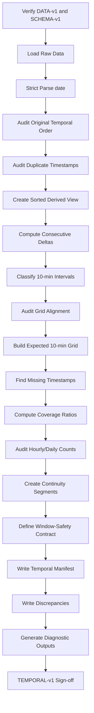
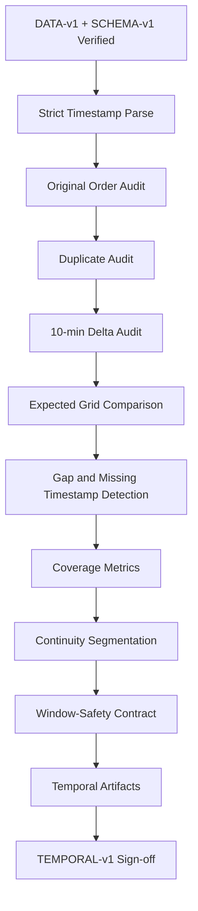

<div align="center">

# PHASE 4 — TEMPORAL INTEGRITY AUDIT

## Kế hoạch kiểm toán tính toàn vẹn thời gian, tần suất lấy mẫu và tính liên tục của chuỗi

### Transformer Encoder cho hồi quy chuỗi thời gian đa biến trên UCI Appliances Energy Prediction

**Phase kế tiếp sau `Phase_3_Schema_audit.md`**

</div>

---

# 1. Vai trò của Phase 4

Phase 4 chịu trách nhiệm xác minh rằng dữ liệu thực sự hình thành một **chuỗi thời gian hợp lệ** trước khi EDA, feature engineering, chronological split và sliding-window forecasting được thực hiện.

Nếu:

```text
Phase 0
→ khóa experimental contract

Phase 1
→ khóa environment

Phase 2
→ khóa DATA-v1

Phase 3
→ khóa SCHEMA-v1
```

thì:

```text
Phase 4
→ khóa TEMPORAL-v1
```

Phase này phải trả lời chính xác:

```text
Timestamp có parse được đầy đủ hay không?

Dữ liệu có được sắp theo thời gian hay không?

Có timestamp trùng lặp hay không?

Có timestamp đi ngược thời gian hay không?

Khoảng cách giữa hai quan sát liên tiếp có đúng 10 phút hay không?

Có missing timestamps hoặc temporal gaps hay không?

Có các đoạn chuỗi rời rạc hay không?

Một ngày đầy đủ có đủ 144 quan sát hay không?

Một giờ đầy đủ có đủ 6 quan sát hay không?

Có cửa sổ tương lai nào có nguy cơ đi qua temporal gap hay không?

Raw order có thể sử dụng trực tiếp hay cần tạo sorted derived view?

Mức độ temporal integrity có đủ để Phase 5–10 tiếp tục hay không?
```

Nguyên tắc của Phase 4:

\[
\boxed{
Parse
+
Order
+
Measure
+
Detect
+
Segment
+
Document
}
\]

Chưa:

```text
interpolate
resample
impute
split
window
model
```

---

# 2. Cơ sở từ nguồn dữ liệu chính thức

UCI mô tả bộ dữ liệu ở độ phân giải:

```text
10 phút
```

trong khoảng:

```text
xấp xỉ 4.5 tháng
```

UCI cũng cho biết:

```text
cảm biến nhiệt độ/độ ẩm ZigBee truyền khoảng mỗi 3.3 phút,
sau đó dữ liệu được trung bình hóa theo các khoảng 10 phút;

energy data được ghi mỗi 10 phút;

weather data từ Chievres Airport được ghép với dữ liệu thực nghiệm
bằng date/time.
```

Do đó, **10 phút** là temporal interval chuẩn cần kiểm toán trong raw dataset.

Một chuỗi time-series hợp lệ cho coursework phải được kiểm tra dựa trên dữ liệu thực tế chứ không chỉ dựa vào metadata.

---

# 3. Tại sao Phase 4 đặc biệt quan trọng?

Coursework sử dụng:

\[
X_{t-L+1:t}
\rightarrow
Appliances_{t+1}
\]

Nếu timestamp không liên tục nhưng window builder chỉ dùng row index:

```text
row i
row i+1
row i+2
```

thì một window có thể vô tình biểu diễn:

```text
10 phút
10 phút
70 phút
10 phút
```

nhưng model vẫn tưởng mỗi step cách nhau đúng 10 phút.

Điều này làm sai:

```text
lookback duration

forecast horizon

positional meaning

attention interpretation

LSTM recurrence

persistence baseline

error attribution
```

Vì vậy Phase 4 phải hoàn thành trước sliding-window construction.

---

# 4. Mục tiêu cần đạt sau Phase 4

Sau Phase 4 phải có:

```text
1. Timestamp parse success rate.

2. Parsed temporal view không làm thay đổi raw artifact.

3. Minimum timestamp.

4. Maximum timestamp.

5. Actual temporal coverage.

6. Monotonic-order status.

7. Duplicate timestamp count.

8. Duplicate timestamp details.

9. Consecutive time-delta distribution.

10. Expected interval = 10 minutes verification.

11. Zero-delta count.

12. Negative-delta count.

13. Gap count.

14. Gap severity distribution.

15. Missing expected timestamp list.

16. Continuity ratio.

17. Hourly observation-count audit.

18. Daily observation-count audit.

19. Continuity segment IDs.

20. Window-safety contract cho Phase 10.

21. Temporal discrepancy log.

22. Machine-readable temporal manifest.

23. TEMPORAL-v1 sign-off.
```

---

# 5. Những việc Phase 4 không làm

Không:

```text
Không interpolate missing timestamps.

Không resample dữ liệu.

Không forward fill.

Không backward fill.

Không drop duplicate timestamps một cách tự động.

Không aggregate duplicate timestamps.

Không feature engineering hour/day-of-week.

Không chronological Train/Validation/Test split.

Không tạo sliding windows.

Không scale dữ liệu.

Không train model.

Không dùng test set.

Không sửa DATA-v1.
```

Phase 4 chỉ:

```text
audit
classify
document
prepare temporal contract
```

---

# 6. Input contract

Phase 4 chỉ được sử dụng:

```text
DATA-v1
+
SCHEMA-v1
```

Trước khi chạy:

```text
Phase 2 sign-off = PASS

Phase 3 sign-off = PASS
hoặc
PASS_WITH_DOCUMENTED_WARNING
```

Phải xác minh:

```text
raw CSV SHA-256
=
hash đã lưu trong DATA-v1 manifest
```

và:

```text
timestamp column
=
date
```

theo SCHEMA-v1.

Nếu hash khác:

```text
STOP
```

---

# 7. Raw-vs-derived data rule

Không mutate:

```text
df_raw
```

Tạo:

```text
df_time
```

là derived audit view.

Ví dụ:

```python
df_time = df_raw.copy(deep=True)
```

Sau đó chỉ trong derived view mới được:

```text
parse timestamp
sort để kiểm tra
create delta columns
create continuity labels
```

Raw CSV và `df_raw` phải giữ nguyên.

---

# 8. Timestamp parsing contract

Raw `date` được UCI mô tả theo cấu trúc:

```text
year-month-day hour:minute:second
```

Primary parsing nên dùng explicit format:

```text
%Y-%m-%d %H:%M:%S
```

Thay vì dựa hoàn toàn vào format inference.

Lợi ích:

```text
fail fast khi raw format thay đổi
không parse mơ hồ
dễ audit
```

---

# 9. Strict parsing trước, fallback sau

Quy trình:

```text
STEP 1
Strict parse với expected format.

STEP 2
Đếm parse failures.

STEP 3
Nếu 0 failures:
PASS.

STEP 4
Nếu có failure:
Không silently fallback.

STEP 5
Ghi các raw values lỗi.

STEP 6
Chỉ dùng fallback parser như diagnostic,
không thay raw interpretation một cách âm thầm.
```

---

# 10. Timestamp parse status

Các field cần lưu:

```text
total_timestamp_rows
parse_success_count
parse_failure_count
parse_success_rate
```

Expected:

```text
parse_failure_count = 0
```

Nếu > 0:

```text
TEMPORAL_TIMESTAMP_PARSE_FAILURE
```

---

# 11. Timezone contract

Raw dataset không nên tự động được gán timezone nếu official source không cung cấp một timezone contract rõ ràng cho timestamp serialization.

Do đó baseline:

```text
naive datetime
```

và manifest ghi:

```text
timezone_status = unspecified_in_raw_data
```

Không tự động:

```text
tz_localize("Europe/Brussels")
```

trong Phase 4.

Lý do:

```text
việc gán timezone có thể đưa vào DST assumptions
không có trong raw representation.
```

---

# 12. Daylight-saving-time lưu ý

Belgium có daylight-saving-time trong năm, nhưng raw timestamp cần được audit **đúng như được lưu**.

Phase 4 phải:

```text
không giả định trước có hoặc không có DST discontinuity;

phát hiện bằng actual timestamp deltas;

nếu có discontinuity gần DST transition:
ghi riêng trong temporal discrepancy log.
```

Không sửa timestamp vì suy đoán DST.

---

# 13. Original-order audit

Trước khi sort:

```text
kiểm tra thứ tự raw rows.
```

Tạo:

```text
is_monotonic_increasing
```

trên parsed timestamp theo original row order.

Expected:

```text
True
```

Nếu False:

```text
TEMPORAL_RAW_ORDER_NOT_MONOTONIC
```

---

# 14. Không sort âm thầm trước audit

Sai:

```python
df = df.sort_values("date")
# rồi kết luận timestamps sorted
```

Đúng:

```text
1. Audit original order.
2. Ghi violation nếu có.
3. Sau đó tạo sorted derived view để tiếp tục diagnostics.
```

---

# 15. Negative-delta audit

Trong original order:

\[
\Delta t_i=t_i-t_{i-1}
\]

Kiểm tra:

```text
delta < 0
```

Negative delta nghĩa:

```text
row order đi ngược thời gian
```

Lưu:

```text
row index
previous timestamp
current timestamp
delta
```

---

# 16. Zero-delta audit

Kiểm tra:

```text
delta = 0
```

Điều này thường liên quan:

```text
duplicate timestamps
```

Nhưng duplicate timestamp audit phải thực hiện độc lập vì duplicates có thể không nằm liền nhau nếu raw order sai.

---

# 17. Duplicate timestamp audit

Tính:

```text
duplicate timestamp count
number of duplicated timestamp groups
```

Tách hai loại:

## DT0 — Exact duplicate rows

```text
same timestamp
+
same values ở tất cả columns
```

## DT1 — Conflicting duplicate timestamps

```text
same timestamp
+
ít nhất một feature/target khác
```

DT1 nghiêm trọng hơn DT0.

---

# 18. Duplicate handling contract

Phase 4:

```text
không drop duplicates.
```

Chỉ:

```text
detect
classify
export
```

Nếu duplicate tồn tại, action cuối phải được quyết định trước Phase 8/10.

Không được để window builder tự xử lý mơ hồ.

---

# 19. Expected interval contract

Official expected interval:

\[
\boxed{10\text{ minutes}}
\]

Tạo:

```text
EXPECTED_DELTA = 10 minutes
```

Không suy ra expected interval chỉ từ mode của dữ liệu vì:

```text
metadata chính thức đã cung cấp temporal granularity.
```

Actual deltas vẫn phải được đo.

---

# 20. Delta distribution audit

Trên timestamp đã sort:

Tính:

```text
count
min
max
median
mode
unique delta values
frequency per delta
```

Các nhóm:

```text
< 10 min
= 10 min
> 10 min
```

Expected primary mass:

```text
10 min
```

---

# 21. Interval-status taxonomy

## TI0 — Expected

```text
delta = 10 minutes
```

## TI1 — Too short

```text
0 < delta < 10 minutes
```

## TI2 — Gap

```text
delta > 10 minutes
```

## TI3 — Duplicate

```text
delta = 0
```

## TI4 — Reverse

```text
delta < 0
```

---

# 22. Gap-size calculation

Với:

\[
\Delta t > 10\text{ min}
\]

số expected timestamps bị thiếu:

\[
MissingSteps
=
\frac{\Delta t}{10\text{ min}}-1
\]

chỉ khi delta là bội chính xác của 10 phút.

Nếu không phải bội 10 phút:

```text
TEMPORAL_OFF_GRID_GAP
```

phải được flag riêng.

---

# 23. Grid-alignment audit

Một chuỗi có thể không có duplicate nhưng timestamp nằm ngoài grid 10 phút.

Ví dụ:

```text
10:00
10:10
10:23
```

Phải kiểm tra:

```text
delta % 10 minutes == 0
```

và có thể kiểm tra:

```text
minute values
second values
```

Expected:

```text
second = 00

minute nằm trên grid:
00, 10, 20, 30, 40, 50
```

Nếu khác:

```text
TEMPORAL_OFF_GRID_TIMESTAMP
```

---

# 24. Expected timestamp grid

Sau khi xác định:

```text
t_min
t_max
```

tạo diagnostic expected grid:

```text
date_range(
    start=t_min,
    end=t_max,
    freq="10min"
)
```

Sau đó tính:

```text
expected timestamps
actual unique timestamps
missing timestamps
unexpected/off-grid timestamps
```

Đây là audit artifact.

Không dùng expected grid để tự động tạo rows mới.

---

# 25. Missing timestamp list

Export:

```text
artifacts/temporal/missing_timestamps.csv
```

Fields:

```text
missing_timestamp
previous_observed_timestamp
next_observed_timestamp
gap_id
```

Nếu không thiếu:

```text
file vẫn có thể được tạo với header và 0 rows.
```

---

# 26. Gap event table

Tạo:

```text
timestamp_gaps.csv
```

Fields:

```text
gap_id
previous_timestamp
next_timestamp
delta_minutes
missing_steps
is_multiple_of_10min
severity
notes
```

---

# 27. Gap severity

Không dùng threshold tùy tiện để xóa data.

Chỉ phân loại phục vụ diagnostics.

Ví dụ:

```text
G1:
20 phút tổng delta
→ thiếu 1 expected point

G2:
30–60 phút

G3:
> 60 phút

G4:
> 24 giờ
```

Các threshold chỉ dùng để report.

Không tự động quyết định imputation.

---

# 28. Temporal coverage

Tính:

```text
minimum timestamp
maximum timestamp
elapsed duration
number of unique timestamps
```

Nếu chuỗi hoàn toàn đều:

\[
ExpectedCount
=
\frac{t_{max}-t_{min}}
{10\text{ min}}
+1
\]

So sánh:

```text
expected_grid_count
actual_unique_timestamp_count
```

---

# 29. Continuity ratio

Định nghĩa audit metric:

\[
ContinuityRatio
=
\frac{
\#\{\Delta t = 10\text{ min}\}
}{
N_{sorted}-1
}
\]

Expected:

```text
gần hoặc bằng 1.0
```

Đây là diagnostic metric, không phải model metric.

---

# 30. Coverage completeness ratio

Có thể tính:

\[
CoverageCompleteness
=
\frac{
ActualUniqueTimestamps
}{
ExpectedGridTimestamps
}
\]

Nếu:

```text
1.0
```

và không off-grid/duplicate:

```text
temporal coverage hoàn chỉnh trên interval min–max.
```

---

# 31. Hourly-count audit

Vì:

```text
10-minute sampling
```

một giờ đầy đủ dự kiến có:

\[
6\text{ observations/hour}
\]

Tạo count theo hour bucket.

Phân biệt:

```text
partial first hour
partial last hour
full interior hours
```

Không flag boundary partial hour như missing-data error.

---

# 32. Daily-count audit

Một ngày đầy đủ dự kiến:

\[
24\times 6 = 144
\]

observations.

Tạo:

```text
count per calendar day
```

Phân biệt:

```text
first partial day
last partial day
full interior days
```

Expected full day:

```text
144 observations
```

Nếu khác:

```text
cross-reference gap table.
```

---

# 33. Không dùng daily count một mình để xác nhận continuity

Một ngày có thể có 144 rows nhưng:

```text
duplicate timestamp
+
missing timestamp
```

nên count vẫn bằng 144.

Do đó daily-count audit chỉ là:

```text
secondary diagnostic
```

Source of truth:

```text
exact timestamp grid + deltas.
```

---

# 34. Weekly-count diagnostic

Optional:

\[
7\times144=1008
\]

observations cho một tuần đầy đủ.

Có thể dùng để:

```text
visualize long gaps
check coverage
```

Không bắt buộc làm hard assertion vì first/last week có thể partial.

---

# 35. Continuity segments

Nếu có gap:

```text
không coi toàn dataset là một chuỗi liên tục duy nhất.
```

Tạo:

```text
continuity_segment_id
```

Mỗi khi:

```text
delta != 10 minutes
```

bắt đầu segment mới.

Ví dụ:

```text
SEG-0001
SEG-0002
...
```

---

# 36. Vì sao continuity segments quan trọng?

Phase 10 tạo window:

\[
X_{t-L+1:t}
\]

Nếu window đi qua gap:

```text
row sequence liên tục
≠
time sequence liên tục
```

Do đó Phase 10 phải có rule:

> Một forecasting sample chỉ hợp lệ nếu toàn bộ input timestamps và target relationship nằm trong một temporal continuity segment phù hợp.

---

# 37. Window-safety contract cho Phase 10

Một sample với lookback \(L\), horizon \(H=1\) chỉ hợp lệ khi:

```text
1. Có đúng L input rows.

2. Mọi adjacent input delta = 10 phút.

3. target_timestamp - input_end_timestamp = 10 phút.

4. Không crossing temporal gap.

5. Không duplicate timestamp.

6. Input timestamps < target timestamp.
```

Tức:

\[
\forall j,\ 
t_{j+1}-t_j=10\text{ min}
\]

và:

\[
t_{target}-t_{input,end}=10\text{ min}
\]

---

# 38. Lookback-specific continuity requirement

Với:

```text
L36
L72
L144
```

một sample cần tối thiểu continuous history tương ứng:

```text
6 giờ
12 giờ
24 giờ
```

Nếu segment quá ngắn:

```text
sample đó không được tạo.
```

Không pad artificial history trong baseline.

---

# 39. Boundary protocol liên hệ Phase 0

Phase 0 có:

```text
WB0 — Context Carry-over
WB1 — Strict Isolation
```

Phase 4 chưa thực hiện split nên chưa chạy WB0/WB1.

Nhưng Phase 4 phải tạo temporal metadata đủ để Phase 41 kiểm tra:

```text
input continuity qua split boundary
```

một cách chính xác.

---

# 40. Forecast-horizon contract

Primary:

```text
H = 1
```

tương ứng:

```text
10 phút
```

Phase 4 phải xác minh temporal grid đủ chính xác để:

```text
row + 1
```

không bị nhầm thành:

```text
future 20/30/... phút
```

Phase 10 không được định nghĩa horizon chỉ theo row offset nếu continuity check fail.

---

# 41. Persistence baseline dependency

Persistence baseline:

\[
\hat y_{t+1}=y_t
\]

chỉ có ý nghĩa đúng nếu:

```text
t+1 thực sự = 10 phút sau t
```

Do đó Phase 14 phụ thuộc trực tiếp vào TEMPORAL-v1.

---

# 42. Transformer positional meaning dependency

Transformer positional encoding biết:

```text
position 0
position 1
...
```

nhưng không tự biết:

```text
position 1 cách position 0 bao nhiêu phút
```

Nếu temporal gap tồn tại nhưng không được kiểm soát:

```text
model nhận sai temporal geometry.
```

Đây là lý do continuity audit bắt buộc.

---

# 43. LSTM dependency

LSTM recurrence giả định chuỗi được đưa theo đúng thứ tự.

Nếu raw order sai:

```text
LSTM hidden state truyền qua sai temporal direction.
```

Phase 4 phải xác minh chronology trước Phase 15.

---

# 44. Attention-map dependency

Attention map sẽ được diễn giải theo:

```text
-24 h
-12 h
-1 h
-10 min
```

Các nhãn này chỉ hợp lệ nếu window thực sự có 10-minute spacing liên tục.

TEMPORAL-v1 là điều kiện tiên quyết để attention analysis Phase 52–57 có ý nghĩa.

---

# 45. Weather-data temporal note

UCI cho biết một phần weather data ban đầu là dữ liệu theo giờ và sau đó được nội suy/ghép vào bộ dữ liệu 10 phút.

Phase 4 không đánh giá giá trị interpolation.

Chỉ kiểm tra:

```text
mọi row cuối cùng có timestamp trên grid chung.
```

Các pattern giá trị weather theo thời gian thuộc EDA/feature analysis.

---

# 46. Duplicate timestamp conflict analysis

Nếu duplicate timestamp tồn tại:

So sánh columns:

```text
Appliances
lights
sensors
weather
rv1
rv2
```

Tạo:

```text
exact_match_flag
conflicting_columns
```

Không quyết định:

```text
mean
first
last
drop
```

ở Phase 4.

---

# 47. Duplicate-row audit

Có thể kiểm tra:

```text
full-row duplicates
```

nhưng trọng tâm là temporal impact.

Nếu full duplicate rows có cùng timestamp:

```text
DT0
```

Nếu full duplicate rows nhưng timestamp khác:

```text
không phải duplicate timestamp,
có thể là repeated state;
không xóa chỉ vì values giống nhau.
```

---

# 48. Timestamp uniqueness contract

Primary desired invariant:

\[
timestamp\rightarrow one\ row
\]

Expected:

```text
date is unique
```

Nếu không unique:

```text
Phase 4 ít nhất PASS_WITH_WARNING,
hoặc FAIL nếu chưa có explicit resolution policy.
```

Không chuyển thẳng sang windowing.

---

# 49. Temporal sort derived view

Sau original-order audit:

```python
df_time_sorted = (
    df_time
    .sort_values("timestamp_parsed", kind="stable")
    .reset_index(drop=False)
)
```

Giữ:

```text
original_row_index
```

để trace.

Không overwrite raw file.

---

# 50. Stable sort lưu ý

Nếu duplicate timestamp tồn tại, stable sort giúp giữ original relative order của duplicates.

Tuy nhiên:

```text
stable sort không giải quyết duplicate semantics.
```

Chỉ phục vụ audit.

---

# 51. Row-index traceability

Derived temporal table nên giữ:

```text
raw_row_index
```

để mọi gap/duplicate có thể truy ngược raw CSV.

Artifacts gap/duplicate nên chứa:

```text
raw_row_index_prev
raw_row_index_current
```

khi phù hợp.

---

# 52. Temporal audit table

Tạo derived table tối thiểu:

```text
raw_row_index
timestamp_raw
timestamp_parsed
delta_from_previous
delta_minutes
interval_status
continuity_segment_id
```

Không cần lưu toàn bộ predictors vào artifact này.

---

# 53. Temporal manifest

Tạo:

```text
artifacts/temporal/temporal_manifest.json
```

Fields:

```text
temporal_version
dataset_revision
schema_version
environment_id
raw_csv_sha256
timestamp_column
timestamp_format
timezone_status
expected_interval_minutes
row_count
parsed_timestamp_count
parse_failure_count
min_timestamp
max_timestamp
elapsed_duration_minutes
unique_timestamp_count
duplicate_timestamp_count
duplicate_timestamp_group_count
negative_delta_count
zero_delta_count
expected_delta_count
gap_count
off_grid_timestamp_count
off_grid_gap_count
expected_grid_count
missing_timestamp_count
continuity_ratio
coverage_completeness_ratio
continuity_segment_count
largest_gap_minutes
raw_order_monotonic
sorted_view_monotonic
audit_status
warnings
created_at
```

---

# 54. Temporal version

Gán:

```text
TEMPORAL-v1
```

Không gắn temporal version vào raw file.

Đây là:

```text
audit interpretation version
```

Nếu sau này thay gap-handling policy:

```text
có thể tạo TEMPORAL-v2
```

mà không thay DATA-v1.

---

# 55. Temporal discrepancy log

Tạo:

```text
artifacts/temporal/temporal_discrepancies.json
```

Mỗi record:

```text
id
severity
category
timestamp
previous_timestamp
expected
actual
interpretation
recommended_action
resolved
notes
```

Categories:

```text
PARSE_FAILURE
NON_MONOTONIC
DUPLICATE
CONFLICTING_DUPLICATE
TOO_SHORT_INTERVAL
GAP
OFF_GRID
MISSING_TIMESTAMP
DST_SUSPECT
OTHER
```

---

# 56. Status model

## PASS

```text
Parse complete.
Timestamps unique.
Raw order monotonic.
All deltas expected 10 minutes.
No missing/off-grid points.
```

## PASS_WITH_WARNING

Ví dụ:

```text
Raw order không monotonic nhưng sorted view hoàn chỉnh;
hoặc có một anomaly đã được document và có safe downstream rule.
```

## FAIL

Ví dụ:

```text
Timestamp parse failure unresolved.

Conflicting duplicate timestamps unresolved.

Temporal gaps tồn tại nhưng window policy chưa bảo vệ.

Timestamp structure không thể reconcile với expected 10-minute series.
```

---

# 57. Không bắt buộc chuỗi phải hoàn hảo để tiếp tục

Một time series có gap không nhất thiết phải hủy coursework.

Điều quan trọng:

```text
gap phải được biết
và window builder không được crossing gap.
```

Do đó có thể:

```text
PASS_WITH_WARNING
```

nếu continuity segments đã được tạo và downstream contract rõ ràng.

---

# 58. Gap-handling decision hierarchy

Nếu Phase 4 phát hiện gap, ưu tiên cho coursework:

```text
OPTION G0 — Do not impute;
segment sequence;
drop invalid windows crossing gaps.

OPTION G1 — Interpolate/resample
chỉ khi có research justification rõ
và được thêm như preprocessing protocol mới.
```

Baseline khuyến nghị:

```text
G0
```

vì không tạo synthetic target/sensor observations không cần thiết.

---

# 59. Vì sao không nội suy tự động?

Nội suy có thể:

```text
làm mượt energy spikes;

tạo target giả;

thay đổi autocorrelation;

thay đổi attention pattern;

làm optimistic forecasting;
```

Vì vậy Phase 4 không interpolation.

---

# 60. Unexpected sub-10-minute interval

Nếu:

```text
0 < delta < 10 minutes
```

không được gộp tự động.

Có thể là:

```text
duplicate-like acquisition artifact
timestamp corruption
unexpected source revision
```

Ghi severity cao hơn một missing 10-minute point thông thường.

---

# 61. Non-multiple-of-10-minute gap

Ví dụ:

```text
delta = 17 minutes
```

khác:

```text
delta = 20 minutes
```

17 phút cho thấy:

```text
timestamp grid mismatch
```

không chỉ đơn giản thiếu một sample.

Flag:

```text
TEMPORAL_OFF_GRID_GAP
```

---

# 62. Partial boundary handling

First/last day và hour có thể không đầy đủ vì dataset bắt đầu/kết thúc giữa ngày.

Do đó:

```text
không yêu cầu mọi day = 144 rows.
```

Chỉ yêu cầu:

```text
interior full-day counts
phù hợp với exact timestamp grid.
```

---

# 63. Calendar aggregation chỉ phục vụ audit

Trong Phase 4 có thể dùng:

```text
floor hour
calendar date
```

để đếm coverage.

Nhưng chưa tạo:

```text
hour_sin
hour_cos
dow_sin
dow_cos
weekend
```

cho model.

Đó là Phase 6.

---

# 64. Temporal EDA boundary

Phase 4 được phép vẽ:

```text
delta histogram
gap timeline
daily observation counts
```

vì đây là integrity diagnostics.

Không vẽ:

```text
Appliances distribution
correlation heatmap
energy by hour
```

vì đó là Phase 5 EDA.

---

# 65. Diagnostic Figure T1 — Delta distribution

```text
X:
delta minutes

Y:
frequency
```

Mục tiêu:

```text
xác minh 10 phút chiếm ưu thế.
```

Nếu mọi delta đều đúng:

```text
figure có thể rất đơn giản.
```

---

# 66. Diagnostic Figure T2 — Gap timeline

Nếu có gaps:

```text
X:
timestamp

Y:
gap size
```

Nếu không gap:

```text
không cần tạo figure rỗng trong report;
chỉ log 0 gaps.
```

---

# 67. Diagnostic Figure T3 — Daily counts

```text
X:
calendar day

Y:
number of observations
```

Reference:

```text
144
```

cho full day.

Không biến hình này thành consumption EDA.

---

# 68. Temporal summary table

Tạo:

| Metric | Value | Expected | Status |
|---|---:|---:|---|
| Parsed timestamps | runtime | all rows | ... |
| Unique timestamps | runtime | all rows | ... |
| Duplicate timestamps | runtime | 0 | ... |
| Raw monotonic | runtime | True | ... |
| Expected 10-min deltas | runtime | all intervals | ... |
| Gaps | runtime | 0 preferred | ... |
| Missing timestamps | runtime | 0 preferred | ... |
| Off-grid timestamps | runtime | 0 | ... |
| Continuity segments | runtime | 1 preferred | ... |
| Continuity ratio | runtime | 1.0 preferred | ... |

---

# 69. Function design

Khuyến nghị:

```text
verify_temporal_inputs()

parse_timestamp_strict()

audit_original_order()

audit_duplicate_timestamps()

classify_duplicate_groups()

compute_time_deltas()

classify_intervals()

build_expected_grid()

find_missing_timestamps()

compute_temporal_coverage()

compute_hourly_counts()

compute_daily_counts()

assign_continuity_segments()

build_temporal_manifest()

write_temporal_artifacts()
```

Mỗi function:

```text
single-purpose
non-mutating nếu có thể
explicit input/output
```

---

# 70. Notebook structure Phase 4

Khuyến nghị:

```text
14–18 cells
```

## Cell 4.1 — Phase title

## Cell 4.2 — Verify DATA-v1 + SCHEMA-v1

## Cell 4.3 — Load raw data

## Cell 4.4 — Strict timestamp parsing

## Cell 4.5 — Raw-order audit

## Cell 4.6 — Duplicate timestamp audit

## Cell 4.7 — Sorted temporal view

## Cell 4.8 — Delta distribution

## Cell 4.9 — 10-minute grid alignment

## Cell 4.10 — Expected-grid/missing timestamps

## Cell 4.11 — Hourly/daily coverage

## Cell 4.12 — Continuity segmentation

## Cell 4.13 — Window-safety contract

## Cell 4.14 — Temporal figures

## Cell 4.15 — Temporal summary

## Cell 4.16 — Save artifacts

## Cell 4.17 — Discrepancy report

## Cell 4.18 — Phase sign-off

---

# 71. Quy trình thực thi Phase 4



---

# 72. Machine-readable temporal configuration

Có thể tạo:

```python
TEMPORAL_CONTRACT = {
    "timestamp_column": "date",
    "timestamp_format": "%Y-%m-%d %H:%M:%S",
    "expected_interval_minutes": 10,
    "forecast_horizon_steps": 1,
    "lookbacks": [36, 72, 144],
    "timezone_status": "unspecified_in_raw_data",
    "gap_policy": "segment_and_reject_cross_gap_windows",
}
```

Đây là audit/downstream contract.

Không phải model configuration.

---

# 73. Window-validity function requirement cho Phase 10

Phase 4 phải giao specification để Phase 10 implement:

```text
is_temporally_valid_window(...)
```

Input:

```text
timestamps
lookback
horizon
```

Return:

```text
True / False
reason
```

Possible reasons:

```text
VALID
INSUFFICIENT_HISTORY
INPUT_GAP
DUPLICATE_TIMESTAMP
OFF_GRID_TIMESTAMP
TARGET_GAP
TARGET_NOT_FUTURE
```

---

# 74. Temporal leakage guardrail

Phase 4 chưa split data, nhưng phải khóa:

\[
\max(timestamp_{input}) < timestamp_{target}
\]

và với `H=1`:

\[
timestamp_{target}
-
timestamp_{input,end}
=
10\text{ minutes}
\]

Không cho phép:

```text
row offset = 1
```

thay thế time-delta validation.

---

# 75. Relation với TimeSeriesSplit / rolling-origin

Time-series validation yêu cầu dữ liệu được time-ordered; các công cụ như `TimeSeriesSplit` được thiết kế để tránh train trên tương lai rồi đánh giá quá khứ.

Scikit-learn cũng lưu ý rằng để các fold đại diện thời lượng tương đương, các samples cần được equally spaced.

Do đó Phase 4 phải xác nhận:

```text
equal temporal spacing
```

hoặc tạo continuity segmentation trước Phase 44 rolling-origin evaluation.

---

# 76. Raw timestamps vs sample timestamps

Sau này một forecasting sample có nhiều timestamp:

```text
input_start
input_end
target
```

Phase 4 phải chuẩn hóa naming:

```text
input_start_timestamp
input_end_timestamp
target_timestamp
```

Không gọi chung tất cả là:

```text
date
```

trong experiment registry/prediction artifacts.

---

# 77. Expected temporal metadata bàn giao

Phase 4 phải bàn giao:

```text
timestamp-parsed view
continuity segment IDs
missing timestamp list
gap table
duplicate timestamp table
temporal contract
```

Không bàn giao:

```text
interpolated sequence
```

trừ khi có explicit protocol amendment.

---

# 78. Output bắt buộc Phase 4

## O4.1 — Temporal manifest

```text
artifacts/temporal/temporal_manifest.json
```

## O4.2 — Temporal summary

```text
artifacts/temporal/temporal_summary.csv
```

## O4.3 — Gap table

```text
artifacts/temporal/timestamp_gaps.csv
```

## O4.4 — Missing timestamps

```text
artifacts/temporal/missing_timestamps.csv
```

## O4.5 — Duplicate timestamp report

```text
artifacts/temporal/duplicate_timestamps.csv
```

## O4.6 — Continuity segments

```text
artifacts/temporal/continuity_segments.csv
```

Không cần chứa mọi row.

Có thể lưu:

```text
segment_id
start_timestamp
end_timestamp
row_count
duration
```

## O4.7 — Interval distribution

```text
artifacts/temporal/interval_distribution.csv
```

## O4.8 — Daily observation counts

```text
artifacts/temporal/daily_observation_counts.csv
```

## O4.9 — Discrepancy log

```text
artifacts/temporal/temporal_discrepancies.json
```

## O4.10 — Phase sign-off

```text
artifacts/temporal/phase_4_signoff.json
```

---

# 79. Optional derived audit view

Có thể lưu:

```text
artifacts/temporal/temporal_index_audit.csv
```

gồm:

```text
raw_row_index
timestamp_raw
timestamp_parsed
delta_minutes
interval_status
continuity_segment_id
```

Không chứa toàn bộ sensor data để tránh duplicate raw dataset không cần thiết.

---

# 80. Phase 4 sanity checklist

```text
[ ] Phase 2 PASS.

[ ] Phase 3 PASS/PASS_WITH_WARNING.

[ ] DATA-v1 hash khớp.

[ ] Timestamp column = date.

[ ] Strict timestamp parse hoàn tất.

[ ] Parse failure count đã ghi.

[ ] Raw order monotonicity đã kiểm tra trước sort.

[ ] Negative deltas đã kiểm tra.

[ ] Duplicate timestamps đã kiểm tra.

[ ] Duplicate groups đã phân loại exact/conflicting.

[ ] Sorted derived view đã tạo.

[ ] Expected interval = 10 phút đã khóa.

[ ] Delta distribution đã tính.

[ ] Zero deltas đã tính.

[ ] Short intervals đã kiểm tra.

[ ] Gaps đã kiểm tra.

[ ] Off-grid timestamps đã kiểm tra.

[ ] Off-grid gaps đã kiểm tra.

[ ] Expected timestamp grid đã tạo.

[ ] Missing timestamps đã liệt kê.

[ ] Minimum timestamp đã ghi.

[ ] Maximum timestamp đã ghi.

[ ] Coverage duration đã ghi.

[ ] Continuity ratio đã tính.

[ ] Coverage completeness ratio đã tính.

[ ] Hourly counts đã audit.

[ ] Daily counts đã audit.

[ ] Boundary partial days được phân biệt.

[ ] Continuity segment IDs đã tạo.

[ ] Gap policy đã khóa.

[ ] Window-safety contract đã viết.

[ ] Temporal manifest đã lưu.

[ ] Gap table đã lưu.

[ ] Duplicate report đã lưu.

[ ] Missing timestamps artifact đã lưu.

[ ] Discrepancy log đã lưu.

[ ] TEMPORAL-v1 đã gán.

[ ] Phase 4 sign-off hoàn tất.
```

---

# 81. Acceptance criteria

Phase 4 PASS khi:

```text
Timestamp parse đầy đủ.

Temporal ordering đã được biết rõ.

Duplicate status đã được biết rõ.

10-minute interval consistency đã được đo.

Gaps/missing timestamps đã được biết rõ.

Không có unresolved corruption làm target timing mơ hồ.

Continuity segments đủ để bảo vệ window builder.

No raw mutation.

Window-safety contract rõ.
```

Có thể:

```text
PASS_WITH_WARNING
```

nếu có gaps nhưng:

```text
đã được segment
và downstream windows sẽ reject crossing gaps.
```

---

# 82. Khi nào Phase 4 FAIL?

```text
Timestamp parse failures chưa giải thích.

Timestamp column không thể tạo chronology đáng tin cậy.

Conflicting duplicates chưa có resolution policy.

Off-grid timestamps nghiêm trọng làm 10-minute horizon không xác định.

Raw order/data không thể reconcile.

Gap tồn tại nhưng pipeline vẫn dự kiến tạo windows bằng row index mà không continuity check.

Temporal metadata không đủ để xác định t+1 = 10 phút.
```

---

# 83. Các lỗi thường gặp

## Lỗi 1 — Sort trước rồi mới audit order

Làm mất bằng chứng raw order.

---

## Lỗi 2 — Chỉ dùng `pd.infer_freq()`

Nếu trả:

```text
10min
```

vẫn chưa thay thế:

```text
duplicate audit
gap audit
expected-grid comparison
```

Nếu trả `None`, phải xem delta distribution thay vì dừng.

---

## Lỗi 3 — Kiểm tra row count rồi kết luận không thiếu timestamp

Sai.

Có thể có:

```text
duplicate + missing
```

với tổng row count vẫn đúng.

---

## Lỗi 4 — Tạo `date_range` rồi reindex ngay

Đó là resampling/implicit missing-row creation.

Phase 4 chỉ dùng `date_range` để audit.

---

## Lỗi 5 — Nội suy gaps vì “time series cần đều”

Không tự động làm.

---

## Lỗi 6 — Chỉ kiểm tra `date.is_unique`

Unique không chứng minh:

```text
regular spacing.
```

---

## Lỗi 7 — Chỉ kiểm tra monotonic

Monotonic không chứng minh:

```text
10-minute continuity.
```

---

## Lỗi 8 — Dùng row `i+1` làm target mà không kiểm tra timestamp delta

Đây là lỗi forecasting nghiêm trọng.

---

## Lỗi 9 — Gán timezone tùy ý

Không có contract nguồn thì không tự localize.

---

## Lỗi 10 — Window đi qua gap

Model sẽ hiểu sai duration.

---

# 84. Handoff sang Phase 5

Phase 5 — EDA nhận:

```text
DATA-v1
SCHEMA-v1
TEMPORAL-v1
```

Phase 5 có thể sử dụng:

```text
parsed timestamp derived view
```

để plot temporal data.

Nhưng:

```text
không được làm mất continuity metadata.
```

---

# 85. Handoff sang Phase 6

Phase 6 — Feature Engineering sẽ dùng:

```text
timestamp_parsed
```

để tạo:

```text
hour
day_of_week
weekend
cyclical features
```

Không parse `date` lại theo một rule mới.

---

# 86. Handoff sang Phase 8

Phase 8 — Chronological Split sẽ dùng:

```text
target timestamp ordering
```

và temporal contract.

Không chia bằng:

```text
random row index
```

---

# 87. Handoff sang Phase 10

Phase 10 — Window Builder bắt buộc sử dụng:

```text
continuity_segment_id
expected_interval_minutes
forecast_horizon_steps
window validity rules
```

để loại windows không hợp lệ.

---

# 88. Handoff sang Phase 44

Rolling-origin robustness sau này phải:

```text
giữ chronological order
không crossing unresolved temporal discontinuity
```

và chỉ tạo folds trên valid temporal sample sequence.

---

# 89. Phase 4 Definition of Done



Phase 4 hoàn thành khi:

\[
\boxed{
Chronology
+
Uniqueness
+
Regularity
+
Continuity
+
Window\ Safety
}
\]

đều được xác minh hoặc được document bằng explicit warning/policy.

---

# 90. Final status contract

```text
Phase 4 không sửa raw data.

Phase 4 không nội suy.

Phase 4 không resample.

Phase 4 không split Train/Validation/Test.

Phase 4 không tạo model windows.

Phase 4 tạo temporal evidence và continuity contract.

Mọi phase forecasting sau phải tuân thủ TEMPORAL-v1.
```

---

# 91. Nguồn tham chiếu kỹ thuật

## UCI Machine Learning Repository

**Appliances Energy Prediction**

Thông tin được dùng:

```text
Multivariate, Time-Series
Regression
19,735 observations
10-minute dataset resolution
approximately 4.5 months
energy logged every 10 minutes
ZigBee measurements averaged to 10-minute periods
weather data merged using date/time
```

Dataset DOI:

```text
10.24432/C5VC8G
```

---

## Candanedo, Feldheim & Deramaix

**Data driven prediction models of energy use of appliances in a low-energy house**

Energy and Buildings, 2017.

DOI:

```text
10.1016/j.enbuild.2017.01.083
```

Vai trò:

```text
nguồn nghiên cứu gốc liên quan tới quá trình thu thập và mô tả dữ liệu.
```

---

## Scikit-learn — `TimeSeriesSplit`

Tài liệu chính thức nhấn mạnh:

```text
time-series split phải giữ thứ tự thời gian;

cross-validation thông thường có thể dẫn đến
training trên future data và evaluating past data;

equally spaced samples giúp các fold đại diện
các khoảng thời lượng tương đương.
```

Phase 4 không trực tiếp chạy `TimeSeriesSplit`, nhưng phải tạo temporal integrity đủ để Phase 44 sử dụng evaluation theo thời gian một cách hợp lệ.

---

<div align="center">

# PHASE 4 — FINAL CHECK

**Không được giả định rằng “row kế tiếp = 10 phút kế tiếp”.**

**Phải chứng minh bằng timestamp.**

**Không được nội suy hoặc sửa gap trong audit.**

**Mọi gap phải được phát hiện trước sliding-window construction.**

**Chỉ sau khi `TEMPORAL-v1` được sign-off mới chuyển sang PHASE 5 — EDA.**

</div>
