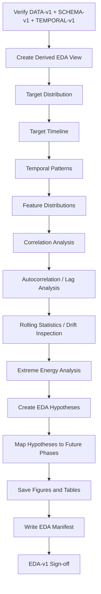
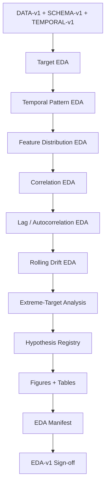

<div align="center">

# PHASE 5 — EDA

## Kế hoạch phân tích dữ liệu khám phá cho chuỗi thời gian đa biến

### Transformer Encoder cho hồi quy chuỗi thời gian đa biến trên UCI Appliances Energy Prediction

**Phase kế tiếp sau `Phase_4_Temporal_integrity_audit.md`**

</div>

---

# 1. Vai trò của Phase 5

Phase 5 chịu trách nhiệm **hiểu cấu trúc thống kê và hành vi của dữ liệu trước khi feature engineering, split, scaling và modeling**.

Nếu:

```text
Phase 0
→ khóa experimental contract

Phase 1
→ khóa environment

Phase 2
→ khóa DATA-v1

Phase 3
→ khóa SCHEMA-v1

Phase 4
→ khóa TEMPORAL-v1
```

thì:

```text
Phase 5
→ xây dựng EDA-v1
```

Mục tiêu của EDA không phải là:

```text
tìm cách làm Transformer thắng LSTM
```

mà là:

```text
Hiểu target
Hiểu temporal behavior
Hiểu feature distributions
Hiểu multivariate relationships
Hiểu autocorrelation
Hiểu seasonality/cycles
Hiểu spikes
Hiểu redundancy
Đặt các giả thuyết sẽ được kiểm chứng ở phase sau
```

Nguyên tắc:

\[
\boxed{
Describe
+
Visualize
+
Compare
+
Hypothesize
+
Do\ Not\ Tune
}
\]

---

# 2. Mục tiêu cần đạt sau Phase 5

Sau Phase 5 phải trả lời được:

```text
1. Target Appliances phân phối như thế nào?

2. Target có skew hay long tail hay không?

3. Target có các spike lớn hay không?

4. Energy consumption thay đổi theo thời gian ra sao?

5. Có daily pattern hay weekly pattern rõ không?

6. Mức tiêu thụ theo giờ trong ngày có khác nhau không?

7. Mức tiêu thụ giữa weekday/weekend có khác nhau không?

8. Các temperature/humidity sensor phân phối như thế nào?

9. Các sensor nào có correlation cao với nhau?

10. Target có correlation tuyến tính mạnh với feature nào không?

11. Past Appliances có autocorrelation mạnh ở lag gần không?

12. Có signal ở lag 6h / 12h / 24h không?

13. Những feature nào có thể redundant?

14. Dataset có temporal drift/rolling mean shift hay không?

15. Những vùng target nào có thể khó dự báo?

16. EDA có phát hiện bất thường nào cần chuyển thành hypothesis
    cho Feature Engineering hoặc Overfitting Analysis không?

17. Có EDA conclusion nào vô tình dùng future information
    để quyết định model không?

18. Output nào sẽ được bàn giao sang Phase 6, 7, 8, 22, 40 và 50?
```

---

# 3. EDA không phải là feature selection

Phase 5 không được kết luận:

```text
Feature X phải bị drop vì correlation thấp.

Feature Y phải được giữ vì correlation cao.

Transformer cần lookback 144 vì ACF đẹp.

Huber chắc chắn tốt hơn MSE.

RevIN chắc chắn cần thiết.

LSTM sẽ kém Transformer.
```

EDA chỉ được tạo:

```text
Hypothesis
```

Ví dụ:

```text
H-EDA-01:
Past Appliances có autocorrelation mạnh ở short lags.

H-EDA-02:
Target distribution có right-skew và energy spikes.

H-EDA-03:
Nhiều indoor temperature sensors có correlation cao.

H-EDA-04:
Rolling statistics thay đổi theo thời gian.

H-EDA-05:
Energy consumption có daily cycle.
```

Các hypothesis sẽ được kiểm chứng bằng experiment ở phase sau.

---

# 4. Quy tắc tránh leakage trong EDA

Đây là một trong những điểm quan trọng nhất của Phase 5.

Vì chronological split chính thức chỉ được tạo ở:

```text
Phase 8
```

nên EDA ở Phase 5 phải chia thành hai loại.

---

# 5. EDA loại A — Global descriptive EDA

Được phép dùng full dataset để:

```text
mô tả dataset
vẽ target timeline
mô tả range
mô tả toàn bộ feature distributions
visualize correlation
visualize temporal cycles
document anomalies
```

Nhưng:

> Kết quả Global EDA không được dùng để chọn final hyperparameter hoặc quyết định final model.

Nó chỉ là:

```text
descriptive / explanatory
```

---

# 6. EDA loại B — Decision-sensitive EDA

Các phân tích có thể ảnh hưởng trực tiếp tới model design phải được:

```text
coi là hypothesis ở Phase 5
```

và phải được:

```text
xác nhận bằng Train/Validation sau Phase 8
```

Ví dụ:

```text
ACF cho thấy lag 144 có signal
→ không được tự chọn L144 là final.

Correlation cho thấy rv1 correlation nhỏ
→ không được bỏ phase FS2 ablation.

Target có spikes
→ không được tự chọn Huber.
```

Các quyết định cuối phải theo protocol đã khóa:

```text
Validation RMSE
```

---

# 7. Input contract

Phase 5 sử dụng:

```text
DATA-v1
SCHEMA-v1
TEMPORAL-v1
```

Phải xác minh:

```text
Phase 2 PASS
Phase 3 PASS hoặc PASS_WITH_WARNING
Phase 4 PASS hoặc PASS_WITH_WARNING
```

Không chạy EDA nếu:

```text
timestamp integrity unresolved
```

vì temporal plots và lag analysis sẽ không đáng tin cậy.

---

# 8. Derived EDA view

Không mutate:

```text
df_raw
```

Tạo:

```text
df_eda
```

dựa trên:

```text
timestamp-parsed
sorted temporal view
```

và giữ:

```text
raw_row_index
continuity_segment_id
```

Nếu Phase 4 có gap:

```text
lag/autocorrelation analysis
phải được segment-aware.
```

---

# 9. EDA-only temporal columns

Phase 5 được phép tạo **temporary analytical columns**:

```text
hour
day_of_week
day_name
is_weekend
calendar_date
month
week
```

chỉ trong:

```text
df_eda
```

Mục đích:

```text
grouping
plotting
descriptive analysis
```

Không xem đây là final feature engineering.

Phase 6 sẽ tạo feature chính thức:

```text
hour_sin
hour_cos
dow_sin
dow_cos
weekend
```

theo contract riêng.

---

# 10. Không tạo cyclical features chính thức ở Phase 5

Có thể dùng:

```text
hour
day_of_week
```

để group.

Không cần tạo:

```text
hour_sin
hour_cos
dow_sin
dow_cos
```

trừ khi dùng để minh họa concept.

Feature-engineered columns chính thức thuộc Phase 6.

---

# 11. EDA structure tổng thể

Phase 5 nên chia thành 8 nhóm:

```text
EDA-A
Target Distribution

EDA-B
Target Over Time

EDA-C
Temporal Patterns

EDA-D
Feature Distributions

EDA-E
Multivariate Correlations

EDA-F
Autocorrelation / Lag Structure

EDA-G
Temporal Drift / Rolling Statistics

EDA-H
Hypothesis Registry
```

---

# 12. EDA-A — Target distribution

Target:

```text
Appliances
```

Các thống kê phải tính:

```text
count
mean
std
min
Q1
median
Q3
max
IQR
skewness
selected quantiles
```

Quantiles khuyến nghị:

```text
1%
5%
25%
50%
75%
90%
95%
99%
```

Không gọi các quantile này là:

```text
low / medium / high regime thresholds
```

cho final evaluation.

Regime thresholds cuối Phase 50 phải:

```text
derive từ Train only
```

sau Phase 8.

---

# 13. Target histogram

## Figure EDA-01

```text
Appliances Distribution
```

Trục:

```text
X = Appliances (Wh)
Y = Count hoặc Density
```

Nên có:

```text
histogram
```

và optional:

```text
KDE
```

Nếu dùng KDE:

```text
không để KDE che mất discrete/integer-like target structure.
```

---

# 14. Target ECDF

## Figure EDA-02

ECDF rất hữu ích khi target skew.

```text
X = Appliances Wh
Y = cumulative probability
```

Giúp trả lời:

```text
bao nhiêu phần trăm sample nằm dưới một consumption level.
```

Không chọn threshold từ test-sensitive interpretation.

---

# 15. Target boxplot

## Figure EDA-03

Boxplot hỗ trợ thấy:

```text
median
IQR
upper tail
extreme values
```

Nhưng:

```text
điểm nằm ngoài 1.5 × IQR
không tự động được gọi là lỗi.
```

Energy spikes có thể là hành vi thật.

---

# 16. Không xóa outlier dựa trên boxplot

Không:

```text
remove all values > Q3 + 1.5 IQR
```

vì:

```text
energy peaks có thể là signal quan trọng
và coursework cần phân tích high-consumption error.
```

Chỉ đánh dấu:

```text
extreme-energy observations
```

để điều tra.

---

# 17. EDA-B — Target over time

## Figure EDA-04

Plot full target timeline:

```text
X = timestamp
Y = Appliances Wh
```

Mục tiêu:

```text
nhìn long-term temporal structure
spikes
regime changes
periods of high/low consumption
```

Không dùng line plot quá dày mà không rasterize/downsample display nếu hình khó đọc.

Raw data vẫn giữ nguyên.

---

# 18. Multi-resolution target timeline

Nên tạo ba mức:

```text
Full 4.5-month timeline

Representative 7-day window

Representative 24-hour window
```

Mục đích:

```text
macro trend
weekly behavior
intra-day behavior
```

Representative windows phải được chọn theo rule rõ:

```text
first complete week/day
hoặc
fixed deterministic window
```

Không cherry-pick một đoạn đẹp nhất.

---

# 19. Representative-window selection contract

Baseline:

```text
Representative 24h:
first full continuous day after dataset start.

Representative 7d:
first full continuous 7-day block.
```

Nếu continuity segment không đủ:

```text
chọn earliest valid continuous block.
```

Ghi timestamps rõ trong figure caption.

---

# 20. Energy-spike timeline

## Figure EDA-05

Có thể overlay:

```text
95th percentile
99th percentile
```

trên full timeline để minh họa high-consumption observations.

Lưu ý:

```text
đây là descriptive full-data threshold,
không phải final regime boundary.
```

Final error regime thresholds phải Train-derived.

---

# 21. Spike-event definition trong EDA

Có thể định nghĩa descriptive event:

```text
Appliances >= global 95th percentile
```

chỉ để:

```text
count
timeline visualization
```

Không được dùng label này làm training target hoặc final evaluation rule.

---

# 22. EDA-C — Hour-of-day pattern

Temporary:

```text
hour = timestamp.hour
```

Tính theo hour:

```text
mean
median
std
count
Q25
Q75
```

## Figure EDA-06

```text
Average/Median Appliances by Hour
```

Khuyến nghị plot:

```text
median line
mean line
IQR ribbon
```

nếu dễ đọc.

---

# 23. Mean vs median

Target có thể skew.

Do đó không chỉ plot:

```text
mean
```

Nên so:

```text
mean
median
```

Nếu mean >> median ở một giờ:

```text
spikes đang ảnh hưởng mạnh.
```

---

# 24. Day-of-week pattern

Temporary:

```text
day_of_week
```

## Figure EDA-07

```text
Appliances by Day of Week
```

Dùng:

```text
median
mean
boxplot/violin
```

Không quá nhiều plot trùng lặp nếu report bị giới hạn trang.

Notebook có thể sinh đầy đủ.

---

# 25. Weekday vs weekend

## Figure EDA-08

So sánh:

```text
weekday
weekend
```

bằng:

```text
distribution
median
mean
```

Đây là descriptive evidence cho:

```text
weekend feature
```

nhưng `TF1` vẫn phải được kiểm thử theo plan, không được tự chốt chỉ từ EDA.

---

# 26. Hour × weekday heatmap

## Figure EDA-09

Heatmap:

```text
rows = day of week
columns = hour
values = median hoặc mean Appliances
```

Khuyến nghị:

```text
median
```

nếu target skew mạnh.

Mục đích:

```text
visualize repeated temporal cycle.
```

---

# 27. EDA-D — Feature distributions

Không cần tạo histogram riêng cho toàn bộ 27 predictors trong main report.

Trong notebook nên group theo:

```text
Indoor temperatures
Indoor humidities
Local outdoor sensors
Weather variables
Energy-related variables
Random controls
```

---

# 28. Indoor temperature summary

Tạo table cho:

```text
T1
T2
T3
T4
T5
T6
T7
T8
T9
T_out
```

Statistics:

```text
mean
std
min
Q1
median
Q3
max
```

Visual:

## Figure EDA-10

```text
Temperature boxplots
```

Có thể dùng horizontal orientation để dễ đọc.

---

# 29. Humidity summary

Tạo tương tự cho:

```text
RH_1
RH_2
RH_3
RH_4
RH_5
RH_6
RH_7
RH_8
RH_9
RH_out
```

## Figure EDA-11

```text
Humidity boxplots
```

---

# 30. Weather-feature distributions

Các biến:

```text
T_out
Press_mm_hg
RH_out
Windspeed
Visibility
Tdewpoint
```

Tạo:

```text
summary table
compact small-multiple plots
```

Không dùng một x-axis chung nếu units khác.

---

# 31. Lighting distribution

`lights` cần EDA riêng vì:

```text
có ý nghĩa trực tiếp về energy usage
```

## Figure EDA-12

```text
lights distribution
```

Kiểm tra:

```text
zero frequency
positive-value distribution
```

Không biến zero thành missing.

---

# 32. Random-control distribution

`rv1`, `rv2`:

Tạo summary:

```text
mean
std
range
correlation with each other
correlation with target
```

Không cần nhiều plot trong report.

Mục tiêu:

```text
document rằng chúng là random controls
trước FS2 ablation.
```

---

# 33. EDA-E — Correlation analysis

Tạo numeric correlation matrix.

Primary:

```text
Pearson correlation
```

vì dataset gốc và nhiều EDA regression workflow thường dùng linear correlation.

Optional bổ sung:

```text
Spearman correlation
```

để xem monotonic relationships không tuyến tính.

Không dùng correlation để suy ra causality.

---

# 34. Full correlation heatmap

## Figure EDA-13

```text
All numeric variables
```

Nếu label quá dày:

```text
increase figure size
rotate labels
```

Không bỏ feature chỉ để heatmap đẹp.

---

# 35. Target-correlation ranking

Tạo table:

```text
feature
Pearson r with Appliances
absolute r
Spearman rho optional
```

Sort:

```text
abs(Pearson)
```

nhưng report phải ghi:

> Correlation ranking chỉ phản ánh pairwise association, không đại diện đầy đủ cho predictive importance trong mô hình phi tuyến hoặc temporal.

---

# 36. Feature-to-feature redundancy

Tìm các pair:

\[
|r|\geq threshold
\]

Threshold chỉ dùng descriptive.

Ví dụ:

```text
0.80
```

Nhưng không được:

```text
drop tự động feature có |r| > 0.8.
```

Output:

```text
high_correlation_pairs.csv
```

---

# 37. Correlation threshold contract

Nếu dùng:

```text
|r| >= 0.8
```

phải ghi rõ:

```text
EDA flag threshold
not feature-removal threshold
```

Không biến threshold heuristic thành modeling rule.

---

# 38. Sensor-cluster visualization

Optional:

```text
hierarchical clustered correlation heatmap
```

Nếu dùng thêm SciPy sẽ tăng dependency.

Vì Phase 1 chưa khóa SciPy như core:

```text
không thêm chỉ để tạo clustered heatmap
trừ khi thật sự cần.
```

Plain correlation heatmap là đủ.

---

# 39. EDA-F — Autocorrelation structure

Target:

```text
Appliances
```

Autocorrelation rất quan trọng vì primary model có option:

```text
past Appliances
```

và lookback:

```text
36
72
144
```

---

# 40. ACF contract

Compute ACF cho lags ít nhất:

```text
1
6
36
72
144
```

Có thể mở rộng đến:

```text
1008
```

để quan sát weekly scale nếu temporal continuity cho phép.

Nhưng full ACF tới 1008 không được dùng để tự chọn final lookback.

---

# 41. Segment-aware autocorrelation

Nếu TEMPORAL-v1 có nhiều continuity segments:

```text
không tính lag bằng cách nối giả các segment.
```

Options:

```text
compute trên largest continuous segment
hoặc
compute segment-wise rồi aggregate phù hợp
```

Baseline đơn giản:

```text
largest continuous segment
```

và ghi rõ.

---

# 42. ACF implementation dependency

Có thể dùng:

```text
statsmodels
```

nhưng Phase 1 core environment chưa bắt buộc `statsmodels`.

Để tránh dependency drift, ưu tiên:

```text
Pandas/NumPy lag correlation
```

cho selected lags.

Nếu muốn full ACF plot bằng `statsmodels`:

```text
thêm dependency có kiểm soát
ENV revision nếu cần
```

Không `pip install` giữa notebook mà không log.

---

# 43. Selected-lag correlation table

Tạo:

| Lag | Time | Corr(Appliances_t, Appliances_t-lag) |
|---:|---|---:|
| 1 | 10 min | runtime |
| 6 | 1 h | runtime |
| 36 | 6 h | runtime |
| 72 | 12 h | runtime |
| 144 | 24 h | runtime |
| 1008 | 7 d | runtime nếu đủ |

Đây là descriptive output.

---

# 44. ACF plot

## Figure EDA-14

Nếu implementation phù hợp:

```text
X = lag
Y = autocorrelation
```

Mark:

```text
36
72
144
```

để liên hệ Phase 26.

Không viết:

```text
lag 144 cao nên L144 là tốt nhất.
```

Chỉ viết:

```text
24-hour lag exhibits X descriptive autocorrelation;
final lookback remains validation-selected.
```

---

# 45. Partial autocorrelation

PACF là optional.

Không bắt buộc vì:

```text
coursework không phải ARIMA modeling
```

Nếu dùng:

```text
chỉ để exploratory temporal dependence.
```

Không làm Phase 5 quá nặng với classical time-series diagnostics không phục vụ coursework.

---

# 46. Cross-correlation với selected exogenous features

Có thể thử lagged correlation của target với:

```text
lights
selected temperature variables
selected humidity variables
T_out
```

Mục tiêu:

```text
đặt hypothesis về delayed relationships.
```

Nhưng:

```text
không scan hàng nghìn lag/feature combination rồi cherry-pick.
```

---

# 47. Cross-correlation scope

Giới hạn:

```text
selected features
selected lags:
1, 6, 36, 72, 144
```

Không biến EDA thành exhaustive feature mining.

---

# 48. EDA-G — Rolling statistics

Tính rolling:

```text
mean
std
```

của target ở các window descriptive:

```text
6 h = 36 steps
24 h = 144 steps
7 d = 1008 steps
```

Nếu gaps:

```text
rolling không crossing continuity segment.
```

---

# 49. Rolling mean plot

## Figure EDA-15

Overlay:

```text
Appliances
24h rolling mean
7d rolling mean optional
```

Mục tiêu:

```text
quan sát drift / regime changes.
```

---

# 50. Rolling standard deviation

## Figure EDA-16

```text
24h rolling std
```

Mục tiêu:

```text
quan sát volatility thay đổi theo thời gian.
```

---

# 51. Distribution shift hypothesis

Nếu rolling mean/std thay đổi:

Không kết luận:

```text
RevIN chắc chắn cần.
```

Ghi hypothesis:

```text
H-EDA-DIST-01:
Temporal moments appear non-stationary.

Required confirmation:
Phase 8 split-aware distribution comparison
+
Phase 40 RevIN sweep.
```

---

# 52. Formal stationarity tests có bắt buộc không?

Không.

ADF/KPSS không phải requirement của coursework.

Có thể làm optional nếu:

```text
có lý do nghiên cứu rõ
và dependency đã được quản lý.
```

Không nên:

```text
ADF p-value
→ quyết định Transformer architecture.
```

Deep forecasting không yêu cầu chuỗi phải stationary theo điều kiện classical ARIMA.

---

# 53. Split-aware distribution analysis

Master plan có yêu cầu:

```text
Train
Validation
Test
distribution comparison
```

Nhưng split chính thức nằm ở Phase 8.

Do đó Phase 5 phải:

```text
chuẩn bị function/report template
```

nhưng **không dùng split-aware results để ra quyết định trước Phase 8**.

Sau Phase 8, function này sẽ được gọi lại và artifact được cập nhật.

---

# 54. Split-distribution helper

Chuẩn bị function:

```text
compare_temporal_splits(...)
```

sẽ tính:

```text
target mean
target std
target quantiles
selected feature mean/std
hourly profile
```

cho:

```text
Train
Validation
Test
```

Nhưng không chạy final trong Phase 5 nếu Phase 8 chưa tạo official split boundaries.

---

# 55. EDA output status cho split-aware item

Trong Phase 5 manifest ghi:

```text
split_distribution_analysis_status
=
DEFERRED_TO_PHASE_8
```

Không giả vờ hoàn thành.

---

# 56. EDA-H — Hypothesis registry

Tất cả EDA insight phải được chuyển thành hypothesis có ID.

Ví dụ:

```text
H-EDA-001
Target is right-skewed.

H-EDA-002
High-consumption spikes are rare.

H-EDA-003
Short-lag target autocorrelation is strong.

H-EDA-004
24-hour lag exhibits repeated temporal dependence.

H-EDA-005
Indoor temperature sensors show redundancy.

H-EDA-006
Daily energy pattern exists.

H-EDA-007
Weekday/weekend profiles differ.

H-EDA-008
Rolling moments vary over time.

H-EDA-009
lights has meaningful association with target.

H-EDA-010
rv1/rv2 show no stable semantic relationship.
```

---

# 57. Hypothesis fields

`eda_hypotheses.csv`:

```text
hypothesis_id
category
statement
evidence_type
figure_or_table
modeling_implication
future_phase
decision_status
notes
```

`decision_status` ở Phase 5 thường:

```text
UNTESTED
```

Không:

```text
CONFIRMED_FOR_MODEL
```

---

# 58. Mapping EDA hypothesis → future phase

Ví dụ:

| Hypothesis | Future Phase |
|---|---|
| Past target useful | Phase 23 FS sweep |
| Time features useful | Phase 24 TF sweep |
| Scaling useful | Phase 25 |
| 6/12/24h lookback | Phase 26 |
| Spikes challenge MSE | Phase 37 Loss sweep |
| Drift exists | Phase 40 RevIN |
| High-energy regime difficult | Phase 50 |
| Attention may focus recent history | Phase 54–56 |

---

# 59. Descriptive summary table

Tạo:

```text
eda_numeric_summary.csv
```

Fields:

```text
variable
role
group
count
mean
std
min
q01
q05
q25
median
q75
q90
q95
q99
max
skewness
```

Không áp dụng tất cả quantile cho `date`.

---

# 60. Skewness interpretation

Không hard-code:

```text
|skew| > 1 = bad
```

Skewness chỉ là descriptor.

Đặc biệt:

```text
Appliances skew
```

có thể là đặc tính tự nhiên của energy usage.

---

# 61. Feature range table

Tạo compact:

```text
variable
min
max
median
IQR
```

Giúp Phase 9 scaling hiểu:

```text
different units/scales
```

Nhưng không quyết định scaler ở Phase 5 vì:

```text
StandardScaler baseline đã được contract
và YS0/YS1 sẽ được test.
```

---

# 62. Zero-value audit cho energy variables

Tính:

```text
zero count
zero ratio
```

cho:

```text
Appliances
lights
```

Không coi zero là missing.

---

# 63. Extreme target sample table

Tạo:

```text
top 20 Appliances values
```

Fields:

```text
timestamp
Appliances
lights
selected sensor/weather context
```

Mục tiêu:

```text
understand spike context descriptively
```

Không dùng table để xóa observations.

---

# 64. Extreme-target temporal clustering

Optional:

```text
các spike có cluster theo time-of-day hay không?
```

Có thể group:

```text
global 95th percentile descriptive spikes
```

theo:

```text
hour
weekday/weekend
```

Không chuyển thành causal claim.

---

# 65. Missing-value visualization có cần không?

Phase 3 đã audit missing schema.

Nếu:

```text
0 missing
```

không cần tạo missingness heatmap vô nghĩa.

Chỉ report:

```text
No missing values observed in DATA-v1 according to Phase 3 audit.
```

Nếu có missing:

```text
EDA có thể visualize pattern,
nhưng không impute.
```

---

# 66. Duplicate visualization có cần không?

Phase 4 đã audit duplicates.

Không cần lặp lại.

Phase 5 chỉ reference:

```text
TEMPORAL-v1 duplicate status
```

---

# 67. Correlation vs prediction

Một feature có:

```text
low instantaneous Pearson correlation
```

vẫn có thể:

```text
predictive qua nonlinear relation
predictive qua lag
predictive qua interaction
```

Do đó không feature selection theo target correlation.

---

# 68. Sensor redundancy vs feature removal

Một cặp sensor có correlation cao:

```text
không đồng nghĩa một sensor vô dụng.
```

Transformer có thể học:

```text
cross-variable interactions
```

Việc feature ablation chỉ làm khi có experiment design rõ.

---

# 69. EDA and causal language

Không viết:

```text
Temperature causes Appliances to increase.
```

Chỉ viết:

```text
Temperature variable X is positively associated with Appliances
in the observed dataset.
```

EDA là observational.

---

# 70. Visualization style contract

Tất cả figure phải có:

```text
title
x-label
y-label
unit
legend nếu cần
timestamp range nếu subset
caption/figure ID
```

Không dùng:

```text
3D chart
unnecessary color palette complexity
```

Mục tiêu:

```text
readability
reproducibility
academic presentation
```

---

# 71. Color policy

Không encode information chỉ bằng màu nếu:

```text
line style / marker
```

có thể hỗ trợ.

Report nên:

```text
print-friendly
```

Nhưng Phase 5 plan không cần khóa exact color palette.

---

# 72. Figure export

Lưu vào:

```text
artifacts/eda/figures/
```

Format:

```text
PNG
```

và optional:

```text
SVG/PDF
```

cho vector plots nếu cần report.

Tên:

```text
EDA_01_target_distribution.png
EDA_04_target_timeline.png
...
```

---

# 73. Table export

Lưu:

```text
artifacts/eda/tables/
```

Ví dụ:

```text
eda_numeric_summary.csv
target_quantiles.csv
hourly_energy_profile.csv
weekday_energy_profile.csv
target_correlations.csv
high_correlation_pairs.csv
selected_lag_correlations.csv
extreme_target_samples.csv
eda_hypotheses.csv
```

---

# 74. EDA manifest

Tạo:

```text
artifacts/eda/eda_manifest.json
```

Fields:

```text
eda_version
dataset_revision
schema_version
temporal_version
environment_id
row_count
target
timestamp
global_eda_scope
decision_sensitive_policy
figures_generated
tables_generated
hypotheses_count
split_aware_analysis_status
warnings
created_at
```

---

# 75. EDA version

Gán:

```text
EDA-v1
```

Nếu sau Phase 8 bổ sung split-aware distribution diagnostics:

```text
EDA-v1.1
```

hoặc artifact bổ sung riêng.

Không thay DATA-v1.

---

# 76. EDA discrepancy / anomaly log

Tạo:

```text
artifacts/eda/eda_anomalies.json
```

Mỗi record:

```text
id
category
timestamp_or_variable
observation
possible_interpretation
requires_action
future_phase
status
```

Không gọi mọi extreme value là:

```text
error
```

---

# 77. EDA anomaly categories

```text
TARGET_SPIKE
UNUSUAL_FEATURE_RANGE
TEMPORAL_DRIFT
HIGH_REDUNDANCY
ZERO_INFLATION
UNEXPECTED_DISTRIBUTION
OTHER
```

Nếu anomaly thuộc schema/temporal integrity:

```text
reference Phase 3/4 discrepancy
```

không duplicate logic.

---

# 78. Notebook structure Phase 5

## Human-approved direct notebook EDA amendment

Theo plan `CW-PHASE-5-EDA-DIRECT-001`, `CourseWork.ipynb` được phép chứa direct descriptive EDA để trình bày đầy đủ reference `EDA.ipynb`.

Ngoại lệ này yêu cầu:

```text
Dùng validated Phase 4 view thay vì fetch lại UCI.
Không ghi table, figure hoặc DataFrame từ direct cells.
Không thay đổi raw data hoặc signed EDA-v1 artifacts.
Không dùng notebook-smoothed copy cho Phase 6 hoặc modeling.
Không mở rộng ngoại lệ sang split, scaling, windowing hoặc training.
```

Khuyến nghị:

```text
20–28 cells
```

## Cell 5.1 — Phase title

## Cell 5.2 — Verify DATA/SCHEMA/TEMPORAL versions

## Cell 5.3 — Create `df_eda`

## Cell 5.4 — Target numeric summary

## Cell 5.5 — Target histogram/ECDF/boxplot

## Cell 5.6 — Full target timeline

## Cell 5.7 — Representative 7-day / 24-hour windows

## Cell 5.8 — Spike descriptive analysis

## Cell 5.9 — Hour-of-day profile

## Cell 5.10 — Day-of-week profile

## Cell 5.11 — Weekday/weekend profile

## Cell 5.12 — Hour × weekday heatmap

## Cell 5.13 — Temperature summary

## Cell 5.14 — Humidity summary

## Cell 5.15 — Weather summary

## Cell 5.16 — lights / rv1 / rv2 summary

## Cell 5.17 — Correlation matrix

## Cell 5.18 — Target correlation ranking

## Cell 5.19 — High-correlation feature pairs

## Cell 5.20 — Selected-lag autocorrelation

## Cell 5.21 — Optional full ACF

## Cell 5.22 — Rolling mean/std

## Cell 5.23 — Extreme-target samples

## Cell 5.24 — Hypothesis registry

## Cell 5.25 — Save tables

## Cell 5.26 — Save figures

## Cell 5.27 — EDA summary

## Cell 5.28 — Phase sign-off

---

# 79. Quy trình thực thi Phase 5



---

# 80. Function design khuyến nghị

```text
verify_eda_inputs()

build_eda_view()

summarize_numeric_features()

summarize_target()

plot_target_distribution()

plot_target_timeline()

select_representative_continuous_window()

build_hourly_profile()

build_weekday_profile()

plot_feature_group_distributions()

compute_correlation_matrix()

extract_high_correlation_pairs()

compute_selected_lag_correlations()

compute_segment_safe_rolling_stats()

extract_extreme_target_samples()

register_eda_hypothesis()

write_eda_artifacts()
```

Không viết mọi analysis trong một cell khổng lồ.

---

# 81. Segment-aware time-series helper

Nếu TEMPORAL-v1 có:

```text
continuity_segment_id
```

các function:

```text
lag
rolling
representative window
```

phải nhận segment ID.

Không:

```text
shift() across a gap
```

mà không kiểm tra.

---

# 82. Autocorrelation implementation nguyên tắc

Với selected lag \(k\):

\[
Corr_k
=
Corr(y_t,y_{t-k})
\]

chỉ tính trên pairs mà:

```text
temporal spacing thực sự = k × 10 phút
```

Không chỉ dựa:

```text
row index difference = k
```

nếu chuỗi có gaps.

---

# 83. Rolling implementation nguyên tắc

Nếu chuỗi hoàn toàn liên tục:

```text
rolling(window=144)
```

có thể dùng.

Nếu có gaps:

```text
groupby continuity_segment_id
→ rolling within segment
```

Không crossing segment.

---

# 84. Descriptive statistical tests

Không bắt buộc chạy:

```text
t-test
ANOVA
Mann–Whitney
```

cho EDA này.

Coursework trọng tâm:

```text
Deep Learning forecasting
```

Nên ưu tiên:

```text
effect visualization
distribution
temporal patterns
```

hơn việc tạo nhiều p-values không phục vụ model.

---

# 85. EDA outcome classification

Mỗi insight phải thuộc một trong:

```text
DESCRIPTIVE_ONLY

HYPOTHESIS_FOR_VALIDATION

DATA_QUALITY_WARNING

MODEL_DIAGNOSTIC_PREPARATION
```

Không có category:

```text
FINAL_MODEL_DECISION
```

trong Phase 5.

---

# 86. EDA summary narrative

Cuối phase viết khoảng:

```text
5–10 bullet/paragraph conclusions
```

theo format:

```text
Observation
Evidence
Implication
Future validation phase
```

Ví dụ:

```text
Observation:
Target exhibits a long upper tail.

Evidence:
EDA-01 / target quantiles.

Implication:
Large errors may dominate MSE/RMSE.

Future validation:
Phase 37 compares MSE with Huber.
```

---

# 87. Không viết conclusion quá mức

Không:

```text
Transformer is suitable because data has autocorrelation.
```

Đúng hơn:

```text
The observed temporal dependence provides a rationale
for evaluating sequence models such as LSTM and Transformer,
whose actual benefit will be tested empirically.
```

---

# 88. EDA and lookback options

Phase 0 đã khóa:

```text
36
72
144
```

EDA được phép:

```text
giải thích temporal meaning của các lựa chọn
```

nhưng không thay search space chỉ vì ACF.

Nếu EDA phát hiện signal ngoài 144:

```text
ghi future-extension hypothesis
```

không mở rộng main search space giữa chừng.

---

# 89. EDA and FS0/FS1/FS2

EDA có thể quan sát:

```text
past target autocorrelation
rv1/rv2 correlations
```

nhưng phải giữ đủ:

```text
FS0
FS1
FS2
```

cho Phase 23.

Không bỏ option.

---

# 90. EDA and TF0/TF1

Daily/weekly patterns có thể hỗ trợ rationale cho TF1.

Nhưng Phase 24 vẫn phải chạy:

```text
TF0 vs TF1
```

---

# 91. EDA and loss

Target spikes có thể tạo rationale cho:

```text
MSE vs Huber
```

Nhưng Phase 37 mới chọn.

---

# 92. EDA and RevIN

Rolling drift có thể tạo rationale cho:

```text
RN0 vs RN1
```

Nhưng Phase 40 mới kiểm chứng.

Không viết:

```text
RevIN fixes this.
```

trước experiment.

---

# 93. EDA and error regimes

Phase 5 có thể mô tả:

```text
low / typical / extreme observations
```

nhưng Phase 50 thresholds cuối phải:

```text
fit từ Train only
```

sau split.

Điều này tránh:

```text
using Test distribution to define evaluation regime.
```

---

# 94. EDA and attention hypotheses

Có thể tạo hypothesis:

```text
Model may attend strongly to recent history.

Model may exhibit 24h-periodic attention patterns.
```

Nhưng attention chỉ được kết luận sau:

```text
Phase 52–57
```

---

# 95. Output bắt buộc của Phase 5

## O5.1 — EDA manifest

```text
artifacts/eda/eda_manifest.json
```

## O5.2 — Numeric summary

```text
artifacts/eda/tables/eda_numeric_summary.csv
```

## O5.3 — Target quantiles

```text
target_quantiles.csv
```

## O5.4 — Hourly profile

```text
hourly_energy_profile.csv
```

## O5.5 — Day-of-week profile

```text
weekday_energy_profile.csv
```

## O5.6 — Correlation matrix

```text
correlation_matrix.csv
```

## O5.7 — Target correlations

```text
target_correlations.csv
```

## O5.8 — High-correlation pairs

```text
high_correlation_pairs.csv
```

## O5.9 — Selected-lag correlations

```text
selected_lag_correlations.csv
```

## O5.10 — Extreme-target samples

```text
extreme_target_samples.csv
```

## O5.11 — EDA hypotheses

```text
eda_hypotheses.csv
```

## O5.12 — EDA anomalies

```text
eda_anomalies.json
```

## O5.13 — Figures

```text
artifacts/eda/figures/
```

## O5.14 — Phase sign-off

```text
artifacts/eda/phase_5_signoff.json
```

---

# 96. Minimum figure set phải tạo

```text
EDA-01 Target histogram
EDA-02 Target ECDF
EDA-03 Target boxplot
EDA-04 Target full timeline
EDA-05 Spike timeline
EDA-06 Hour-of-day profile
EDA-07 Day-of-week profile
EDA-08 Weekday/weekend comparison
EDA-09 Hour × weekday heatmap
EDA-10 Temperature distributions
EDA-11 Humidity distributions
EDA-12 lights distribution
EDA-13 Correlation heatmap
EDA-14 Target autocorrelation/lag profile
EDA-15 Rolling mean
EDA-16 Rolling standard deviation
```

Notebook có thể tạo thêm.

Main report sau này chỉ chọn figure cần thiết.

---

# 97. Figure naming contract

```text
EDA_01_target_histogram.png
EDA_02_target_ecdf.png
EDA_03_target_boxplot.png
EDA_04_target_timeline.png
EDA_05_energy_spikes.png
EDA_06_hourly_profile.png
...
```

Không:

```text
plot1.png
finalplot.png
new_plot.png
```

---

# 98. Table naming contract

Dùng descriptive snake_case.

Ví dụ:

```text
target_quantiles.csv
hourly_energy_profile.csv
target_correlations.csv
selected_lag_correlations.csv
```

---

# 99. EDA reproducibility

Tất cả representative windows phải:

```text
deterministic
```

Không dùng random sample trừ khi:

```text
seed = 42
```

và reason rõ.

Ưu tiên:

```text
earliest valid complete block
```

để tránh cherry-picking.

---

# 100. Phase 5 sanity checklist

```text
[ ] Phase 2 PASS.

[ ] Phase 3 PASS/PASS_WITH_WARNING.

[ ] Phase 4 PASS/PASS_WITH_WARNING.

[ ] DATA-v1 hash verified.

[ ] SCHEMA-v1 loaded.

[ ] TEMPORAL-v1 loaded.

[ ] df_raw không mutate.

[ ] df_eda derived view được tạo.

[ ] Target summary hoàn tất.

[ ] Histogram hoàn tất.

[ ] ECDF hoàn tất.

[ ] Boxplot hoàn tất.

[ ] Full target timeline hoàn tất.

[ ] Representative 24h window deterministic.

[ ] Representative 7d window deterministic.

[ ] Spike analysis descriptive-only.

[ ] Hourly profile hoàn tất.

[ ] Day-of-week profile hoàn tất.

[ ] Weekday/weekend analysis hoàn tất.

[ ] Hour × weekday heatmap hoàn tất.

[ ] Temperature summary hoàn tất.

[ ] Humidity summary hoàn tất.

[ ] Weather summary hoàn tất.

[ ] lights summary hoàn tất.

[ ] rv1/rv2 summary hoàn tất.

[ ] Correlation matrix hoàn tất.

[ ] Target correlation ranking hoàn tất.

[ ] High-correlation pairs được flag.

[ ] Selected-lag target autocorrelation hoàn tất.

[ ] Lag analysis segment-aware nếu có gaps.

[ ] Rolling mean/std segment-aware.

[ ] Extreme target samples đã lưu.

[ ] Không xóa outlier.

[ ] Không feature selection dựa trên EDA.

[ ] Không model tuning trong EDA.

[ ] Hypothesis registry đã tạo.

[ ] Split-aware EDA marked DEFERRED_TO_PHASE_8.

[ ] EDA manifest đã lưu.

[ ] Figures đã lưu.

[ ] Tables đã lưu.

[ ] EDA-v1 đã gán.

[ ] Phase 5 sign-off hoàn tất.
```

---

# 101. Acceptance criteria

Phase 5 PASS khi:

```text
Target behavior đã được mô tả đầy đủ.

Temporal patterns đã được visualize.

Feature distributions đã được kiểm tra.

Multivariate relationships đã được mô tả.

Autocorrelation đã được kiểm tra.

Rolling temporal drift đã được khảo sát.

All EDA insights được chuyển thành hypothesis hoặc descriptive finding.

Không có preprocessing/model decision dựa trên future/Test information.

Không mutate raw data.

EDA artifacts reproducible.
```

---

# 102. Khi nào Phase 5 FAIL?

```text
EDA chạy trên temporal data chưa được audit.

Raw data bị mutate.

Outliers bị xóa trong EDA mà không có protocol.

Lookback final bị chọn trực tiếp từ full-data ACF.

Feature final bị drop trực tiếp từ full-data correlation.

Test-sensitive threshold được xác định từ full data
rồi dùng làm final evaluation rule.

Figures không có units/timestamp context.

Representative period được cherry-pick.

EDA output không traceable về DATA-v1.
```

---

# 103. Các lỗi thường gặp

## Lỗi 1 — EDA quá nhiều plot nhưng không trả lời research question

Mỗi plot phải có mục đích.

---

## Lỗi 2 — Chỉ nhìn correlation matrix

Time-series prediction không thể được hiểu chỉ bằng same-time Pearson correlation.

---

## Lỗi 3 — ACF dùng để khóa lookback final

Sai protocol.

Lookback final chọn ở Phase 26.

---

## Lỗi 4 — Xóa spike như outlier

Có thể xóa signal thật.

---

## Lỗi 5 — Dùng mean-only profile cho skewed target

Nên so mean và median.

---

## Lỗi 6 — Rolling qua temporal gap

Sai temporal geometry.

---

## Lỗi 7 — Dùng full dataset để định nghĩa final low/medium/high regimes

Final thresholds phải Train-derived.

---

## Lỗi 8 — Thấy drift rồi bật RevIN ngay

RevIN phải được kiểm thử Phase 40.

---

## Lỗi 9 — Thấy rv1 correlation thấp rồi bỏ FS2

FS2 vẫn phải chạy.

---

## Lỗi 10 — EDA mang tính causal

Không được suy ra causal relationship.

---

# 104. Handoff sang Phase 6

Phase 6 — Feature Engineering nhận:

```text
EDA-v1
```

và các hypothesis liên quan:

```text
daily pattern
weekly pattern
feature scale differences
temporal drift observations
```

Phase 6 chỉ tạo feature đã được contract:

```text
hour_sin
hour_cos
dow_sin
dow_cos
weekend
```

Không tạo feature chỉ vì một EDA plot tình cờ đẹp.

---

# 105. Handoff sang Phase 7

Phase 7 dùng EDA để document rationale cho:

```text
FS0
FS1
FS2
```

nhưng không bỏ variant nào.

---

# 106. Handoff sang Phase 8

Sau chronological split:

```text
Phase 8 phải gọi lại split-aware distribution analysis helper.
```

Cần so:

```text
Train
Validation
Test
```

về:

```text
target
selected sensor variables
hourly profile
mean/std
quantiles
```

Mục đích:

```text
distribution-shift diagnosis
```

không tune trực tiếp bằng Test.

---

# 107. Handoff sang Phase 22

Learning-curve diagnostics sau training có thể so với EDA hypotheses:

```text
spikes
drift
volatility
```

để phân biệt:

```text
classic overfitting
vs
distribution shift.
```

---

# 108. Handoff sang Phase 26

Selected-lag EDA hỗ trợ giải thích:

```text
L36
L72
L144
```

nhưng validation sweep mới quyết định winner.

---

# 109. Handoff sang Phase 37

Nếu target có spikes:

```text
MSE vs Huber
```

được biện minh bằng EDA.

Không thay protocol trước sweep.

---

# 110. Handoff sang Phase 40

Rolling mean/std là evidence descriptive cho:

```text
possible distribution shift
```

Phase 40 sẽ kiểm tra:

```text
RN0 vs RN1
```

---

# 111. Handoff sang Phase 50

Phase 50 phải tạo:

```text
Train-derived consumption regime thresholds
```

rồi đánh giá:

```text
Test errors by regime
```

Không tái sử dụng global Phase 5 quantiles làm final threshold.

---

# 112. Handoff sang Phase 52–57

EDA temporal hypotheses có thể hỗ trợ interpretation attention:

```text
recent-history dependence
daily repetition
spike windows
```

Nhưng attention analysis phải dựa actual final model weights.

---

# 113. Phase 5 Definition of Done



Phase 5 hoàn thành khi:

\[
\boxed{
Understand\ Data
+
Document\ Patterns
+
Generate\ Testable\ Hypotheses
+
Avoid\ Leakage
+
Avoid\ Premature\ Model\ Decisions
}
\]

được bảo đảm.

---

# 114. Final status contract

```text
Phase 5 mô tả dữ liệu.

Phase 5 không chọn final feature set.

Phase 5 không chọn final lookback.

Phase 5 không chọn final loss.

Phase 5 không bật RevIN mặc định.

Phase 5 không xóa energy spikes.

Phase 5 không sử dụng EDA để tune Test.

Phase 5 tạo EDA-v1 và hypothesis registry.

Mọi quyết định modeling phải được validation ở các phase đã khóa.
```

---

<div align="center">

# PHASE 5 — FINAL CHECK

**EDA phải trả lời câu hỏi, không chỉ tạo hình.**

**Global EDA được dùng để hiểu dữ liệu, không được dùng để tune future test behavior.**

**Outlier không đồng nghĩa lỗi.**

**Correlation không đồng nghĩa causality hoặc predictive importance.**

**Autocorrelation không tự động quyết định lookback.**

**Chỉ sau khi `EDA-v1` được sign-off mới chuyển sang PHASE 6 — Feature Engineering.**

</div>
