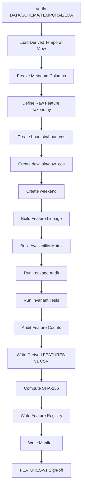
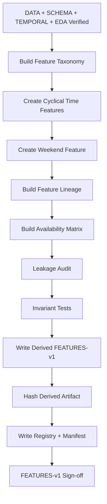

<div align="center">

# PHASE 6 — FEATURE ENGINEERING

## Kế hoạch xây dựng đặc trưng có kiểm soát, chống leakage và bảo toàn lineage

### Transformer Encoder cho hồi quy chuỗi thời gian đa biến trên UCI Appliances Energy Prediction

**Phase kế tiếp sau `Phase_5_EDA.md`**

</div>

---

# 1. Vai trò của Phase 6

Phase 6 chịu trách nhiệm chuyển dữ liệu đã được xác minh về:

```text
DATA-v1
SCHEMA-v1
TEMPORAL-v1
EDA-v1
```

thành một **bảng đặc trưng dẫn xuất có cấu trúc rõ ràng**, sẵn sàng cho:

```text
Phase 7 — Feature-set variants
Phase 8 — Chronological split
Phase 9 — Train-only scaling
Phase 10 — Window builder
```

Nếu các phase trước trả lời:

```text
Dữ liệu có đúng nguồn không?
Schema có đúng không?
Chuỗi thời gian có liên tục không?
Dữ liệu thể hiện những pattern gì?
```

thì Phase 6 phải trả lời:

```text
Từ raw variables, ta sẽ tạo những model features nào?

Feature nào là raw observed variable?

Feature nào là engineered deterministic variable?

Feature nào chỉ là metadata và tuyệt đối không được đưa vào model?

Feature nào cần train-fit preprocessing nên chưa được tạo ở Phase 6?

Feature nào có nguy cơ leakage?

Mỗi engineered feature được tạo từ cột nào và công thức nào?

Sau feature engineering, row count và chronology có được bảo toàn không?
```

Nguyên tắc cốt lõi:

\[
\boxed{
Deterministic
+
Leakage\text{-}Safe
+
Traceable
+
Non\text{-}Destructive
+
Minimal
}
\]

---

# 2. Mục tiêu cần đạt sau Phase 6

Sau Phase 6 phải có:

```text
1. Parsed timestamp được sử dụng thống nhất từ TEMPORAL-v1.

2. Bộ time features chính thức theo coursework contract.

3. hour_sin.

4. hour_cos.

5. dow_sin.

6. dow_cos.

7. weekend.

8. Feature lineage đầy đủ.

9. Feature availability audit.

10. Metadata columns được phân biệt khỏi model features.

11. Raw target Appliances vẫn được bảo toàn.

12. rv1 / rv2 vẫn được bảo toàn để Phase 7 tạo FS2.

13. Không có scaling.

14. Không có imputation.

15. Không có future-target leakage.

16. Không có rolling statistics làm model feature.

17. Không có manual lag features ngoài sequence-window formulation.

18. Row count được bảo toàn.

19. Timestamp order được bảo toàn.

20. Continuity metadata được bảo toàn.

21. Engineered-feature validation hoàn tất.

22. Machine-readable feature manifest.

23. Derived feature artifact có version.

24. FEATURES-v1 sign-off.
```

---

# 3. Những việc Phase 6 không làm

Phase 6 không thực hiện:

```text
Không chia Train / Validation / Test.

Không fit StandardScaler.

Không fit target scaler.

Không dùng toàn dataset để học transformation parameters.

Không tạo sliding windows.

Không tạo y(t+1).

Không tạo DataLoader.

Không drop Appliances.

Không drop rv1 / rv2 khỏi derived master table.

Không chọn FS0 / FS1 / FS2 là final.

Không chọn TF0 / TF1 là final.

Không tạo rolling mean làm input feature.

Không tạo future weather.

Không tạo future lights.

Không dùng target future để xây feature.

Không PCA.

Không feature selection bằng correlation.

Không train model.
```

Những nhiệm vụ trên thuộc các phase sau.

---

# 4. Input contract

Phase 6 chỉ bắt đầu khi:

```text
Phase 2 = PASS
Phase 3 = PASS / PASS_WITH_WARNING
Phase 4 = PASS / PASS_WITH_WARNING
Phase 5 = PASS
```

Các version đầu vào:

```text
DATA-v1
SCHEMA-v1
TEMPORAL-v1
EDA-v1
ENV-v1
```

Phải xác minh:

```text
raw checksum vẫn đúng
timestamp column vẫn là date
target vẫn là Appliances
continuity metadata tồn tại
```

---

# 5. Output version

Feature engineering artifact chính được gán:

```text
FEATURES-v1
```

`FEATURES-v1` không thay thế:

```text
DATA-v1
```

Mà là một **derived dataset version**.

Quan hệ:

```text
DATA-v1
   ↓
SCHEMA-v1
   ↓
TEMPORAL-v1
   ↓
EDA-v1
   ↓
FEATURES-v1
```

---

# 6. Triết lý feature engineering cho Transformer/LSTM

Vì coursework dùng sequence models:

```text
LSTM
Transformer Encoder
```

nên Phase 6 phải tránh tạo quá nhiều manual features kiểu classical ML.

Mục tiêu không phải:

```text
biến dataset thành hàng trăm lag columns.
```

Mục tiêu là:

```text
giữ raw multivariate signal
+
bổ sung temporal context tối thiểu
+
để sequence model tự học temporal representation.
```

Do đó baseline feature engineering ưu tiên:

```text
calendar/time encoding
```

và không thêm:

```text
manual lag explosion
rolling aggregates
PCA
polynomial interactions
```

---

# 7. Feature categories chính

Phase 6 phân loại feature thành năm nhóm.

## C0 — Raw target

```text
Appliances
```

## C1 — Raw exogenous observed features

```text
lights
T1 ... T9
RH_1 ... RH_9
T_out
Press_mm_hg
RH_out
Windspeed
Visibility
Tdewpoint
```

## C2 — Random controls

```text
rv1
rv2
```

## C3 — Engineered time features

```text
hour_sin
hour_cos
dow_sin
dow_cos
weekend
```

## C4 — Metadata-only columns

```text
raw_row_index
date
timestamp_parsed / timestamp
continuity_segment_id
```

C4 tuyệt đối không tự động đi vào model feature matrix.

---

# 8. Expected raw exogenous feature count

Theo schema dự kiến:

```text
lights                          = 1
T1...T9                         = 9
RH_1...RH_9                     = 9
weather station variables       = 6
-----------------------------------
regular exogenous raw features  = 25
```

Random controls:

```text
rv1
rv2
= 2
```

Raw historical target candidate:

```text
Appliances
= 1
```

Engineered time features:

```text
5
```

Các count này phải được đối chiếu bằng `SCHEMA-v1`.

Không hard-code nếu actual schema khác.

---

# 9. Expected Phase 7 feature counts

Nếu schema đúng như dự kiến:

## FS0

```text
25 exogenous
+
5 time features
=
30 model features
```

## FS1

```text
FS0
+
past Appliances
=
31 model features
```

## FS2

```text
FS1
+
rv1
+
rv2
=
33 model features
```

Phase 6 chỉ chuẩn bị đầy đủ columns.

Phase 7 mới tạo chính thức:

```text
FS0
FS1
FS2
```

---

# 10. Time-feature contract kế thừa Phase 0

Coursework contract đã khóa:

```text
TF0
=
Không dùng engineered calendar features

TF1
=
hour_sin
hour_cos
dow_sin
dow_cos
weekend
```

Phase 6 phải tạo TF1 columns.

Không được vì EDA mà thay TF1 bằng một set mới.

Phase 24 sau này sẽ so:

```text
TF0 vs TF1
```

---

# 11. Không feature-engineer theo kết quả Validation/Test ở Phase 6

Feature engineering core phải được xác định trước:

```text
Phase 8 split
Phase 20+ training
```

Điều này bảo vệ khỏi:

```text
post-hoc feature invention
test-set adaptation
```

Nếu sau này muốn thêm feature mới:

```text
phải tạo protocol amendment
+
feature version mới
```

Ví dụ:

```text
FEATURES-v2
```

---

# 12. Timestamp source

Phase 6 không parse raw `date` theo rule mới.

Phải dùng:

```text
timestamp interpretation từ TEMPORAL-v1
```

Ví dụ:

```text
timestamp_parsed
```

hoặc canonical derived name:

```text
timestamp
```

Không có hai parser khác nhau giữa Phase 4 và Phase 6.

---

# 13. Raw `date` contract

Raw:

```text
date
```

được giữ lại để traceability.

Nhưng:

```text
date
```

không phải model feature.

Không:

```text
encode raw string
hash raw date
tokenize date
```

---

# 14. Canonical timestamp metadata

Khuyến nghị derived master table có:

```text
timestamp
```

là datetime semantic column.

Nguồn:

```text
TEMPORAL-v1 parsed timestamp
```

Raw `date` vẫn có thể giữ riêng.

Không biến:

```text
timestamp
```

thành model input trực tiếp.

---

# 15. `hour_sin` / `hour_cos` — mục tiêu

Hour là biến tuần hoàn.

Ví dụ:

```text
23:50
```

và:

```text
00:00
```

gần nhau về thời gian nhưng integer hour:

```text
23
0
```

trông rất xa.

Cyclical encoding giải quyết vấn đề này.

---

# 16. Nên dùng minute-of-day thay vì integer hour thô

Dữ liệu có độ phân giải:

```text
10 phút
```

Nếu chỉ dùng:

```text
timestamp.hour
```

thì:

```text
10:00
10:10
10:20
10:30
10:40
10:50
```

đều có cùng giá trị hour.

Do đó, để `hour_sin/hour_cos` giữ đúng temporal resolution, khuyến nghị dùng:

\[
MinuteOfDay
=
60\times Hour+Minute
\]

và:

\[
DayFraction
=
\frac{MinuteOfDay}{1440}
\]

Sau đó:

\[
hour_{\sin}
=
\sin(2\pi DayFraction)
\]

\[
hour_{\cos}
=
\cos(2\pi DayFraction)
\]

Tên feature vẫn giữ đúng contract:

```text
hour_sin
hour_cos
```

nhưng encoding phản ánh chính xác 10-minute phase.

---

# 17. Công thức `hour_sin`

\[
\boxed{
hour_{\sin}
=
\sin
\left(
2\pi
\frac{60h+m}{1440}
\right)
}
\]

Trong đó:

```text
h = hour
m = minute
```

Expected range:

\[
[-1,1]
\]

---

# 18. Công thức `hour_cos`

\[
\boxed{
hour_{\cos}
=
\cos
\left(
2\pi
\frac{60h+m}{1440}
\right)
}
\]

Expected range:

\[
[-1,1]
\]

---

# 19. Invariant của cặp hour

Với floating-point tolerance:

\[
hour_{\sin}^2
+
hour_{\cos}^2
\approx 1
\]

Phase 6 phải kiểm tra invariant này.

Ví dụ tolerance:

```text
1e-6 hoặc phù hợp với dtype trước khi model cast
```

Không cần exact bitwise equality.

---

# 20. `dow_sin` / `dow_cos`

Day-of-week:

```text
Monday    = 0
Tuesday   = 1
...
Sunday    = 6
```

Công thức:

\[
dow_{\sin}
=
\sin
\left(
2\pi
\frac{dow}{7}
\right)
\]

\[
dow_{\cos}
=
\cos
\left(
2\pi
\frac{dow}{7}
\right)
\]

---

# 21. Vì sao encode day-of-week theo chu kỳ?

Vì:

```text
Sunday
```

và:

```text
Monday
```

là hai ngày kế tiếp nhau.

Integer encoding:

```text
6
0
```

không thể hiện được quan hệ vòng tròn này.

Sin/cos giữ:

```text
cyclic topology
```

---

# 22. Có nên thêm fractional day vào `dow_sin/cos`?

Main contract không yêu cầu.

Baseline giữ:

```text
integer day_of_week
→ dow_sin/dow_cos
```

Không tự mở rộng sang:

```text
continuous week phase
```

trong `FEATURES-v1`.

Nếu muốn nghiên cứu sau:

```text
FEATURES-v2 extension
```

nhưng không thuộc main coursework hiện tại.

---

# 23. `weekend`

Định nghĩa:

```text
Saturday
Sunday
→ 1

Monday–Friday
→ 0
```

Expected values:

```text
{0, 1}
```

Không one-hot thêm:

```text
weekday
weekend
```

vì một binary column là đủ.

---

# 24. `weekend` dtype

Trong derived table:

```text
int8 / bool
```

đều có thể chấp nhận.

Trước khi đưa vào neural network:

```text
cast chung thành float32
```

sẽ xảy ra ở downstream tensor pipeline.

---

# 25. Time helper columns

Có thể tạo tạm trong function:

```text
minute_of_day
day_of_week
```

nhưng chúng phải được phân loại:

```text
helper-only
```

Nếu không nằm trong TF1 contract:

```text
không đưa vào model-feature registry.
```

Khuyến nghị:

```text
không lưu helper columns vào final model feature table
```

nếu không cần audit.

---

# 26. Month feature có tạo không?

Không trong `FEATURES-v1`.

Lý do:

```text
không nằm trong Phase 0 contract;

dataset chỉ khoảng 4.5 tháng;

absolute month có thể trở thành temporal regime proxy;

không cần để hoàn thành coursework.
```

Có thể giữ:

```text
month
```

trong EDA-only temporary view nhưng không phải model feature.

---

# 27. Day-of-month feature có tạo không?

Không.

Không có hypothesis chính thức cần:

```text
day_of_month
```

và nó có thể tạo spurious calendar signal.

---

# 28. Absolute time index có tạo làm feature không?

Không trong baseline.

Không tạo:

```text
row_number
days_since_start
timestamp_numeric
```

làm model feature.

Lý do:

```text
model có thể memorize position trong 4.5-month dataset
thay vì học generalizable temporal dynamics.
```

Metadata time vẫn được giữ để tracking.

---

# 29. NSM — seconds/minutes since midnight

Nghiên cứu gốc có sử dụng time-of-day derived variable kiểu:

```text
seconds since midnight
```

Tuy nhiên main coursework contract đã khóa TF1 dưới dạng cyclical features.

Do đó:

```text
không thêm NSM như model feature trong FEATURES-v1.
```

Thông tin time-of-day đã được biểu diễn bằng:

```text
hour_sin
hour_cos
```

Nếu muốn ablation NSM sau này:

```text
protocol amendment
```

---

# 30. Historical `Appliances`

Raw:

```text
Appliances
```

phải được giữ trong derived master table.

Nhưng Phase 6 không tạo:

```text
Appliances_lag_1
Appliances_lag_2
...
Appliances_lag_144
```

Lý do:

> Sliding window ở Phase 10 đã biến historical `Appliances` thành một temporal channel nếu FS1/FS2 được chọn.

---

# 31. Vì sao không tạo hàng trăm lag columns?

Nếu tạo:

```text
Appliances_lag_1
...
Appliances_lag_144
```

rồi vẫn đưa một sequence 144 timestamps vào Transformer:

```text
temporal information bị duplicate mạnh
feature dimension phình to
leakage/debug complexity tăng
```

Do đó main sequence formulation là:

```text
channel = Appliances
time axis = sliding window
```

không phải:

```text
flattened lag engineering.
```

---

# 32. Manual lag features cho exogenous variables

Không tạo:

```text
T1_lag_1
RH_1_lag_6
...
```

vì LSTM/Transformer đã nhìn toàn bộ past sequence.

Các lag relationships được model học từ:

```text
sequence dimension
```

---

# 33. Rolling statistics có tạo không?

Không tạo làm model feature trong `FEATURES-v1`.

Không thêm:

```text
rolling_mean_6h
rolling_std_24h
rolling_max
EMA
```

Lý do:

```text
sequence models có thể học temporal aggregates;

rolling features tăng leakage risk nếu implementation sai;

centered rolling đặc biệt nguy hiểm;

không nằm trong coursework contract.
```

Phase 5 rolling statistics chỉ phục vụ EDA.

---

# 34. Centered rolling bị cấm

Không:

```python
rolling(..., center=True)
```

để tạo model feature.

Centered window sử dụng:

```text
future observations
```

so với thời điểm hiện tại.

Đây là leakage trực tiếp.

---

# 35. Future covariates contract

Main coursework input được định nghĩa là:

```text
past multivariate readings
```

Do đó Phase 6 không tạo model features từ:

```text
future lights
future actual weather
future sensor observations
```

---

# 36. Known-future calendar covariates

Về phương pháp luận:

```text
calendar information tại target time
```

có thể biết trước.

Tuy nhiên architecture chính hiện tại không yêu cầu:

```text
target-time calendar branch.
```

Để giữ contract đơn giản:

```text
FEATURES-v1 chỉ gắn TF1 vào historical timestamps.
```

Không thêm:

```text
future_target_hour_sin
future_target_dow_sin
```

trong main pipeline.

---

# 37. Weather availability lưu ý

Raw weather variables ở mỗi historical timestamp là hợp lệ vì:

```text
đã quan sát trong quá khứ.
```

Không dùng:

```text
actual future T_out
actual future RH_out
```

để dự đoán `Appliances(t+1)`.

Nếu tương lai dùng forecast weather:

```text
đó là một task khác
```

và phải có protocol riêng.

---

# 38. `lights`

`lights` được giữ như raw exogenous feature.

Không tạo:

```text
future lights
```

Không tự drop dù có thể nhiều zero.

Phase 23/other ablation mới có quyền kiểm tra giá trị của feature groups nếu plan mở rộng.

---

# 39. `rv1` và `rv2`

Phase 6 giữ nguyên:

```text
rv1
rv2
```

và gán:

```text
feature_status = RANDOM_CONTROL
```

Không:

```text
drop khỏi derived master table.
```

Phase 7 sẽ dùng để tạo:

```text
FS2
```

---

# 40. Không feature-select theo EDA correlation

Dù Phase 5 có:

```text
target_correlations.csv
high_correlation_pairs.csv
```

Phase 6 không:

```text
drop low-correlation feature
drop high-correlation duplicate-looking sensor
```

Vì:

```text
correlation không tương đương predictive usefulness;

Transformer có nonlinear/multivariate interactions;

feature selection không nằm trong core contract.
```

---

# 41. Không PCA

PCA bị hoãn/loại khỏi main pipeline.

Lý do:

```text
PCA cần fit statistics;

nếu fit trước split sẽ leakage;

nếu fit Train-only sẽ tăng pipeline complexity;

attention/feature semantics kém trực quan hơn;

coursework không yêu cầu dimensionality reduction.
```

Nếu sau này dùng:

```text
phải fit sau Phase 8 trên Train only.
```

Nhưng không thuộc `FEATURES-v1`.

---

# 42. Không standardization ở Phase 6

Không:

```text
StandardScaler
MinMaxScaler
RobustScaler
```

Phase 9 chịu trách nhiệm:

```text
Train-only scaling.
```

Phase 6 chỉ tạo raw-scale engineered features.

---

# 43. Không target scaling

Không standardize:

```text
Appliances
```

ở Phase 6.

Phase 25 sẽ thử:

```text
YS0 vs YS1
```

và Phase 9 cung cấp train-only scaling infrastructure.

---

# 44. Không imputation

Nếu Phase 3/4 phát hiện missing:

```text
không tự fill tại đây.
```

Phải có explicit preprocessing decision.

Theo UCI/expected audit, dataset dự kiến không missing.

---

# 45. Deterministic transformation classification

Mỗi engineered transformation phải được gắn:

```text
SAFE_GLOBAL_DETERMINISTIC
```

nếu:

```text
không học parameter từ dataset;

chỉ phụ thuộc timestamp của chính row;

không dùng target future;

không dùng validation/test statistics.
```

TF1 thuộc loại này.

---

# 46. Fit-required transformation classification

Các transformation như:

```text
StandardScaler
PCA
quantile transformer
learned encoding
```

gắn:

```text
FIT_REQUIRED_AFTER_SPLIT
```

và **không được thực hiện trong Phase 6**.

---

# 47. Feature availability audit

Mỗi feature cần được gắn một trong:

```text
PAST_OBSERVED
KNOWN_CALENDAR
RANDOM_CONTROL
TARGET_HISTORY_CANDIDATE
METADATA_ONLY
FORBIDDEN_FUTURE
```

Ví dụ:

| Feature | Availability |
|---|---|
| `T1` | PAST_OBSERVED |
| `lights` | PAST_OBSERVED |
| `Appliances` | TARGET_HISTORY_CANDIDATE |
| `hour_sin` | KNOWN_CALENDAR |
| `rv1` | RANDOM_CONTROL |
| `timestamp` | METADATA_ONLY |

---

# 48. Feature availability at prediction time

Đối với một historical input row:

\[
t_i\le t
\]

thì:

```text
sensor values ở t_i
```

đã biết.

Target:

\[
Appliances_{t+1}
\]

chưa biết.

Feature audit phải bảo đảm:

```text
không có column được tạo từ y(t+1).
```

---

# 49. Feature lineage

Mỗi engineered feature phải lưu:

```text
feature_name
source_columns
transformation
parameters
uses_dataset_statistics
uses_future_information
output_unit
role
```

Ví dụ:

```text
hour_sin
source = timestamp
transform = sin(2π * minute_of_day / 1440)
uses_dataset_statistics = False
uses_future_information = False
```

---

# 50. Feature-lineage artifact

Tạo:

```text
artifacts/features/feature_lineage.csv
```

Fields:

```text
feature_name
feature_type
source_columns
formula
transformation_class
unit
availability
uses_train_fit
uses_future_information
default_model_status
notes
```

---

# 51. Feature registry

Tạo:

```text
artifacts/features/feature_registry.csv
```

Một row cho mọi raw/engineered/metadata column.

Fields:

```text
column_name
origin
role
feature_group
model_eligible
feature_set_membership_candidate
unit
dtype
availability
lineage_id
status
notes
```

---

# 52. Feature-set membership candidate

Phase 6 có thể gắn:

```text
FS0_CANDIDATE
FS1_CANDIDATE
FS2_CANDIDATE
METADATA_ONLY
```

Nhưng Phase 7 mới tạo list chính thức.

Ví dụ:

```text
T1:
FS0 / FS1 / FS2 candidate

Appliances:
FS1 / FS2 candidate

rv1:
FS2 candidate

hour_sin:
FS0 / FS1 / FS2 khi TF1 bật
```

---

# 53. Metadata columns không model-eligible

Các cột:

```text
raw_row_index
date
timestamp
continuity_segment_id
```

phải:

```text
model_eligible = False
```

Nhưng vẫn phải giữ để:

```text
traceability
split
window validation
plots
prediction analysis
attention analysis
```

---

# 54. `continuity_segment_id`

Không phải model feature.

Nó là:

```text
window validity metadata
```

Phase 10 dùng để tránh crossing temporal gaps.

Không encode:

```text
SEG-0001
SEG-0002
```

vào neural network.

---

# 55. Raw row index

Không phải feature.

Nó chỉ phục vụ:

```text
trace back to DATA-v1
debug
audit
```

Không đưa vào model vì:

```text
absolute row position có thể trở thành leakage-like temporal shortcut.
```

---

# 56. Row-count invariant

Sau deterministic feature engineering:

\[
N_{after}
=
N_{before}
\]

Phase 6 không được:

```text
drop rows
duplicate rows
create missing rows
```

Nếu row count đổi:

```text
FEATURE_ENGINEERING_ROW_COUNT_VIOLATION
```

---

# 57. Timestamp invariant

Sau Phase 6:

```text
timestamp sequence phải giống TEMPORAL-v1.
```

Kiểm tra:

```text
same length
same values
same order
```

Không sort lại theo một rule mới nếu TEMPORAL-v1 đã cung cấp canonical sorted audit view.

---

# 58. Continuity invariant

`continuity_segment_id` phải:

```text
không thay đổi
```

sau feature engineering.

TF1 không được:

```text
tạo hoặc xóa continuity segment.
```

---

# 59. Target invariant

`Appliances` phải giữ nguyên giá trị.

Có thể verify:

```text
hash / equality
```

giữa source derived view và output.

Không:

```text
normalize
clip
round
log-transform
```

ở Phase 6.

---

# 60. Raw numeric-feature invariant

Các raw feature:

```text
lights
T/RH
weather
rv1/rv2
```

phải được copy nguyên giá trị.

Feature engineering không mutate raw measurements.

---

# 61. No-new-missing-values invariant

TF1 phải không tạo NaN nếu timestamp hợp lệ.

Kiểm tra:

```text
hour_sin NaN count = 0
hour_cos NaN count = 0
dow_sin NaN count = 0
dow_cos NaN count = 0
weekend NaN count = 0
```

Nếu có NaN:

```text
Phase 6 FAIL
```

vì Phase 4 đã phải xác minh timestamp parseability.

---

# 62. Range invariant — hour features

```text
-1 <= hour_sin <= 1
-1 <= hour_cos <= 1
```

với tolerance floating-point nhỏ.

---

# 63. Range invariant — dow features

```text
-1 <= dow_sin <= 1
-1 <= dow_cos <= 1
```

---

# 64. Binary invariant — weekend

Unique values phải là subset của:

```text
{0, 1}
```

Expected nếu dataset trải nhiều ngày:

```text
cả 0 và 1
```

nhưng không hard-fail chỉ vì một dataset khác không có weekend.

Với dataset hiện tại, có thể kỳ vọng cả hai.

---

# 65. Unit-norm invariant

Kiểm tra:

\[
hour_{\sin}^2+hour_{\cos}^2\approx1
\]

\[
dow_{\sin}^2+dow_{\cos}^2\approx1
\]

Nếu sai đáng kể:

```text
formula bug.
```

---

# 66. Cyclical-boundary sanity test

Chọn deterministic timestamps:

```text
23:50
00:00
```

kiểm tra vectors:

```text
(hour_sin, hour_cos)
```

ở gần nhau theo Euclidean/circular representation.

Không cần model training.

---

# 67. Day-boundary sanity test

Kiểm tra:

```text
Sunday
Monday
```

trong `dow_sin/dow_cos`.

Mục tiêu:

```text
xác minh cyclic mapping hoạt động đúng.
```

---

# 68. Weekend sanity test

Kiểm tra ví dụ:

```text
Friday  → 0
Saturday → 1
Sunday → 1
Monday → 0
```

Dùng actual timestamps hoặc synthetic unit test.

---

# 69. Leakage audit table

Tạo:

```text
feature_leakage_audit.csv
```

Fields:

```text
feature_name
depends_on_future_target
depends_on_future_feature
depends_on_full_dataset_statistics
available_at_prediction_time
safe_for_pre_split_engineering
status
notes
```

TF1 phải:

```text
PASS
```

---

# 70. Feature-engineering audit table

Tạo:

```text
feature_engineering_audit.csv
```

Checks:

```text
row_count_preserved
timestamp_preserved
target_preserved
raw_features_preserved
continuity_segments_preserved
no_duplicate_column_names
no_new_nulls
time_feature_ranges_valid
cyclical_norm_valid
weekend_binary_valid
no_future_leakage
```

---

# 71. Derived dataset artifact

Khuyến nghị tạo:

```text
data/interim/uci_appliances_energy_prediction/
energydata_feature_engineered_v1.csv
```

Đây là:

```text
derived artifact
```

không phải raw data.

---

# 72. Nội dung derived master table

Khuyến nghị giữ:

```text
raw_row_index
date
timestamp
continuity_segment_id

Appliances
lights
T1...T9
RH_1...RH_9
T_out
Press_mm_hg
RH_out
Windspeed
Visibility
Tdewpoint
rv1
rv2

hour_sin
hour_cos
dow_sin
dow_cos
weekend
```

Không chứa:

```text
target_t_plus_1
scaled columns
manual lags
rolling features
```

---

# 73. CSV datetime serialization lưu ý

Nếu lưu derived CSV:

```text
timestamp
```

nên serialize theo một format ISO thống nhất.

Ví dụ:

```text
YYYY-MM-DD HH:MM:SS
```

Khi đọc lại:

```text
Phase 8 phải parse theo contract.
```

Do CSV không giữ datetime dtype tự nhiên, manifest phải ghi:

```text
timestamp_serialization_format
```

---

# 74. Có nên dùng Parquet?

Parquet có lợi:

```text
giữ dtype tốt hơn
nhanh hơn
```

nhưng thường cần:

```text
pyarrow
```

mà Phase 1 chưa khóa làm core dependency.

Do đó baseline artifact:

```text
CSV
```

đủ cho coursework.

Không thêm dependency chỉ vì convenience.

---

# 75. Derived artifact checksum

Tạo:

```text
SHA-256
```

cho:

```text
energydata_feature_engineered_v1.csv
```

Mục đích:

```text
Phase 7/8 biết đang dùng đúng FEATURES-v1.
```

---

# 76. Feature manifest

Tạo:

```text
artifacts/features/feature_engineering_manifest.json
```

Fields:

```text
feature_version
dataset_revision
schema_version
temporal_version
eda_version
environment_id
source_raw_sha256
derived_file_path
derived_file_sha256
row_count
column_count
raw_feature_count
engineered_feature_count
metadata_column_count
target_column
engineered_features
time_feature_formula_version
timestamp_serialization_format
row_count_preserved
timestamp_preserved
target_preserved
continuity_preserved
new_missing_values_count
leakage_audit_status
audit_status
warnings
created_at
```

---

# 77. Feature formula version

Có thể gán:

```text
TIME-FEATURES-v1
```

Nội dung:

```text
hour_sin/cos from minute-of-day / 1440
dow_sin/cos from integer weekday / 7
weekend from Saturday/Sunday
```

Nếu sau này đổi công thức:

```text
TIME-FEATURES-v2
```

và phải tạo:

```text
FEATURES-v2
```

---

# 78. Feature-engineering discrepancy log

Tạo:

```text
artifacts/features/feature_engineering_discrepancies.json
```

Categories:

```text
ROW_COUNT_CHANGE
TIMESTAMP_CHANGE
TARGET_CHANGE
RAW_FEATURE_CHANGE
NEW_MISSING_VALUE
INVALID_RANGE
INVALID_CYCLIC_NORM
INVALID_WEEKEND
DUPLICATE_COLUMN
LEAKAGE_RISK
SCHEMA_MISMATCH
OTHER
```

---

# 79. Feature status model

## PASS

```text
All invariants hold.
No leakage.
Expected features created.
```

## PASS_WITH_WARNING

Ví dụ:

```text
optional helper metadata serialized differently
nhưng model features/invariants hợp lệ.
```

## FAIL

Ví dụ:

```text
row count thay đổi
target thay đổi
NaN mới xuất hiện
time formula sai
future information được dùng
```

---

# 80. Không log-transform target ở Phase 6

Dù target skew:

```text
không tạo log1p(Appliances)
```

trong main FEATURES-v1.

Lý do:

```text
loss/target transformation không nằm trong contract;
final metrics cần original Wh;
có thể thay đổi task interpretation.
```

Nếu muốn nghiên cứu:

```text
separate future protocol
```

---

# 81. Không clip feature range

Không:

```text
clip humidity
clip windspeed
clip target
```

Nếu Phase 3/5 thấy unusual value:

```text
giữ nguyên
+
document
```

trừ khi có data-correction protocol rõ.

---

# 82. Không one-hot encode day-of-week

Không tạo:

```text
dow_mon
dow_tue
...
```

vì main TF1 đã dùng cyclical encoding.

Không thử cả hai nếu chưa có protocol.

---

# 83. Không learned embedding cho calendar ở Phase 6

Có thể dùng learned temporal embeddings trong advanced architectures, nhưng:

```text
không thuộc baseline Transformer contract.
```

TF1 dùng fixed deterministic sin/cos.

---

# 84. Positional Encoding vs Time Features

Không nhầm:

```text
Transformer Positional Encoding
```

với:

```text
hour_sin/hour_cos
dow_sin/dow_cos
```

Hai loại giải quyết hai vấn đề khác nhau.

## Positional Encoding

Cho biết:

```text
vị trí thứ bao nhiêu trong window.
```

## Calendar features

Cho biết:

```text
thời điểm đó nằm ở phase nào của ngày/tuần.
```

Do đó Transformer Phase 16 vẫn phải có:

```text
positional encoding
```

dù TF1 được bật.

---

# 85. Time feature không thay thế continuity metadata

`hour_sin` không thể cho biết:

```text
hai rows có thực sự cách nhau 10 phút không.
```

Do đó:

```text
continuity_segment_id
```

vẫn phải giữ.

---

# 86. Raw target vs future label

Phase 6 giữ:

```text
Appliances_t
```

theo từng row.

Phase 10 mới tạo forecasting relation:

\[
X_{t-L+1:t}
\rightarrow
Appliances_{t+1}
\]

Không tạo:

```text
target_next
```

sớm ở Phase 6 để tránh:

```text
feature/label confusion.
```

---

# 87. Feature naming convention

Engineered features dùng:

```text
snake_case
```

và tên đã khóa:

```text
hour_sin
hour_cos
dow_sin
dow_cos
weekend
```

Không dùng:

```text
HourSin
sin_hour
day_sin2
```

ở các notebook khác.

---

# 88. Metadata naming convention

Khuyến nghị:

```text
raw_row_index
timestamp
continuity_segment_id
```

Không đổi tên giữa Phase 6–10.

---

# 89. Dtype contract cho derived dataset

Model-eligible raw continuous columns:

```text
numeric
```

Engineered cyclical columns:

```text
float
```

Weekend:

```text
integer/bool
```

Metadata:

```text
timestamp = datetime semantic
IDs = integer/string metadata
```

Final tensor dtype:

```text
float32
```

nhưng cast diễn ra downstream.

---

# 90. Floating-point precision

Cyclical features có thể được tính bằng:

```text
NumPy float64
```

trong DataFrame.

Không vấn đề.

Trước model:

```text
cast float32
```

ở tensor stage.

Không cần ép mọi DataFrame numeric column thành float32 ở Phase 6.

---

# 91. Feature-engineering pure function

Khuyến nghị:

```python
def engineer_time_features(df):
    ...
    return df_out
```

Yêu cầu:

```text
không mutate input
deterministic
không dùng global mutable state
không fit statistics
```

---

# 92. Function decomposition

Khuyến nghị:

```text
verify_feature_inputs()

build_feature_base_view()

add_cyclical_time_features()

add_weekend_feature()

build_feature_lineage()

build_feature_availability_audit()

validate_feature_invariants()

write_derived_feature_artifact()

compute_derived_checksum()

write_feature_manifest()

write_feature_discrepancies()
```

---

# 93. Không viết feature engineering trong một cell lớn

Mỗi transformation cần:

```text
rõ source
rõ formula
rõ validation
```

Điều này rất quan trọng cho:

```text
audit
debug
report
reproducibility
```

---

# 94. Unit tests đề xuất

Tạo synthetic timestamps:

```text
2026-01-05 00:00:00  Monday
2026-01-10 12:00:00  Saturday
2026-01-11 23:50:00  Sunday
```

Kiểm tra:

```text
weekend
hour cyclic encoding
dow cyclic encoding
```

Synthetic tests không ảnh hưởng dataset.

---

# 95. Determinism test

Chạy feature function hai lần:

```text
output A
output B
```

trên cùng input.

Expected:

```text
engineered columns identical
```

Nếu khác:

```text
FAIL
```

vì feature engineering không được có randomness.

---

# 96. Idempotency test

Nếu vô tình gọi feature function lên một DataFrame đã có TF1 columns:

Nên:

```text
raise clear error
```

hoặc:

```text
replace deterministically sau explicit validation.
```

Không silently tạo:

```text
hour_sin_x
hour_sin_y
```

---

# 97. Duplicate-column guard

Trước save:

```text
no duplicate column names
```

Hard failure nếu duplicate.

---

# 98. Feature order contract

Khuyến nghị derived table order:

```text
1. Metadata
2. Target
3. Raw exogenous
4. Random controls
5. Engineered time features
```

Model feature order sau này phải lấy từ:

```text
Phase 7 feature-set registry
```

không chỉ dựa vào CSV column position.

---

# 99. Không sử dụng raw CSV order làm model feature order

Model feature order phải explicit.

Lý do:

```text
nếu file order đổi,
model semantics có thể silently thay đổi.
```

Phase 7 sẽ tạo ordered feature lists.

---

# 100. Feature count audit

Sau feature engineering:

```text
expected new model-engineered columns = 5
```

Nếu TF1 tạo:

```text
> 5
```

phải giải thích helper/metadata.

Không để helper columns vô tình model-eligible.

---

# 101. Leakage matrix

Tạo final matrix:

| Feature/Transformation | Future target? | Full-data fit? | Prediction-time available? | Safe? |
|---|---|---|---|---|
| `T1` historical | No | No | Yes | PASS |
| `Appliances` historical | No | No | Yes | PASS for FS1/FS2 |
| `hour_sin` | No | No | Yes | PASS |
| `rv1` | No | No | Historical yes | CONTROL ONLY |
| StandardScaler | No | Yes if fitted now | N/A | DEFER |
| PCA | No | Yes | N/A | DEFER |
| centered rolling | Yes indirectly | No | No | FORBIDDEN |
| future `T_out` actual | No target, but future info | No | No | FORBIDDEN |

---

# 102. Prediction-time availability principle

Một feature hợp lệ phải đáp ứng:

\[
InformationTime(feature)
\le
PredictionTime
\]

Trong main sequence:

```text
mọi dynamic feature nằm ở past timestamps.
```

Không chỉ hỏi:

```text
feature có phải target hay không?
```

Mà còn hỏi:

```text
feature đó có tồn tại trước thời điểm prediction hay chưa?
```

---

# 103. EDA hypothesis mapping

Phase 6 có thể ghi rationale:

```text
Daily cycle observed
→ TF1 includes hour_sin/cos

Weekday/weekend difference observed
→ TF1 includes dow_sin/cos + weekend

Autocorrelation observed
→ preserve Appliances as FS1/FS2 candidate

Random controls exist
→ preserve rv1/rv2 for FS2

Sensor redundancy observed
→ keep raw features; do not drop pre-validation
```

Không biến rationale thành final decision.

---

# 104. Feature-engineering notebook structure

Khuyến nghị:

```text
14–18 cells
```

## Cell 6.1 — Phase title

## Cell 6.2 — Verify input versions

## Cell 6.3 — Load canonical derived temporal view

## Cell 6.4 — Define feature taxonomy

## Cell 6.5 — Define time-feature formulas

## Cell 6.6 — Unit tests for time encoding

## Cell 6.7 — Create FEATURES-v1 derived view

## Cell 6.8 — Feature availability registry

## Cell 6.9 — Feature lineage

## Cell 6.10 — Leakage audit

## Cell 6.11 — Invariant checks

## Cell 6.12 — Feature-count audit

## Cell 6.13 — Save derived dataset

## Cell 6.14 — Compute checksum

## Cell 6.15 — Save feature registry

## Cell 6.16 — Save manifest

## Cell 6.17 — Discrepancy report

## Cell 6.18 — Phase sign-off

---

# 105. Quy trình thực thi Phase 6



---

# 106. Phase 6 output directory

Khuyến nghị:

```text
data/
└── interim/
    └── uci_appliances_energy_prediction/
        └── energydata_feature_engineered_v1.csv

artifacts/
└── features/
    ├── feature_engineering_manifest.json
    ├── feature_registry.csv
    ├── feature_lineage.csv
    ├── feature_availability.csv
    ├── feature_leakage_audit.csv
    ├── feature_engineering_audit.csv
    ├── feature_engineering_discrepancies.json
    ├── feature_engineered_v1.sha256
    └── phase_6_signoff.json
```

---

# 107. Output O6.1 — Derived feature table

```text
energydata_feature_engineered_v1.csv
```

Không phải raw artifact.

---

# 108. Output O6.2 — Feature registry

```text
feature_registry.csv
```

Giúp Phase 7 tạo feature sets.

---

# 109. Output O6.3 — Feature lineage

```text
feature_lineage.csv
```

Giúp report giải thích:

```text
feature được tạo như thế nào.
```

---

# 110. Output O6.4 — Feature availability

```text
feature_availability.csv
```

Giúp chống leakage.

---

# 111. Output O6.5 — Leakage audit

```text
feature_leakage_audit.csv
```

Phải có:

```text
PASS
```

cho toàn bộ main eligible features.

---

# 112. Output O6.6 — Engineering audit

```text
feature_engineering_audit.csv
```

Chứa invariant results.

---

# 113. Output O6.7 — Manifest

```text
feature_engineering_manifest.json
```

---

# 114. Output O6.8 — Derived checksum

```text
feature_engineered_v1.sha256
```

---

# 115. Output O6.9 — Discrepancy log

```text
feature_engineering_discrepancies.json
```

---

# 116. Output O6.10 — Phase sign-off

```text
phase_6_signoff.json
```

---

# 117. Feature manifest sign-off fields

Tối thiểu:

```text
feature_version = FEATURES-v1
time_feature_version = TIME-FEATURES-v1
dataset_revision = DATA-v1
schema_version = SCHEMA-v1
temporal_version = TEMPORAL-v1
eda_version = EDA-v1
environment_id = ENV-v1

row_count_preserved
timestamp_preserved
target_preserved
raw_features_preserved
continuity_preserved
no_new_missing_values
feature_count_valid
leakage_audit_passed
derived_checksum
status
```

---

# 118. Phase 6 sanity checklist

```text
[ ] Phase 2 PASS.

[ ] Phase 3 PASS/PASS_WITH_WARNING.

[ ] Phase 4 PASS/PASS_WITH_WARNING.

[ ] Phase 5 PASS.

[ ] DATA-v1 checksum verified.

[ ] SCHEMA-v1 loaded.

[ ] TEMPORAL-v1 loaded.

[ ] EDA-v1 loaded.

[ ] Raw data không mutate.

[ ] Parsed timestamp dùng cùng TEMPORAL-v1.

[ ] hour_sin created.

[ ] hour_cos created.

[ ] dow_sin created.

[ ] dow_cos created.

[ ] weekend created.

[ ] hour encoding dùng 10-minute time resolution.

[ ] hour sin/cos range valid.

[ ] hour unit-norm check pass.

[ ] dow sin/cos range valid.

[ ] dow unit-norm check pass.

[ ] weekend binary check pass.

[ ] Raw row count preserved.

[ ] Timestamp preserved.

[ ] Target preserved.

[ ] Raw features preserved.

[ ] rv1 preserved.

[ ] rv2 preserved.

[ ] continuity_segment_id preserved.

[ ] Không tạo manual lag columns.

[ ] Không tạo rolling model features.

[ ] Không scaling.

[ ] Không imputation.

[ ] Không PCA.

[ ] Không future weather.

[ ] Không future lights.

[ ] Không future target.

[ ] Metadata columns model_eligible=False.

[ ] Feature lineage created.

[ ] Feature availability audit created.

[ ] Leakage audit PASS.

[ ] Derived feature count audited.

[ ] Derived CSV saved.

[ ] Derived SHA-256 created.

[ ] Feature registry saved.

[ ] Manifest saved.

[ ] FEATURES-v1 assigned.

[ ] Phase 6 sign-off completed.
```

---

# 119. Acceptance criteria

Phase 6 chỉ PASS khi:

```text
TF1 features được tạo đúng công thức.

Không có future leakage.

Không có full-data fitted transformation.

Không mất hoặc thêm row.

Không thay raw target.

Không thay raw measurements.

Timestamp/continuity metadata được giữ.

Feature lineage đầy đủ.

Feature roles rõ.

Derived artifact reproducible.

Phase 7 có thể tạo FS0/FS1/FS2 mà không đoán lại column semantics.
```

---

# 120. Khi nào Phase 6 FAIL?

```text
Target bị shift hoặc biến đổi.

Row count thay đổi.

Timestamp thay đổi.

TF1 tạo NaN.

Cyclical formula sai.

weekend mapping sai.

Raw features bị overwrite.

rv1/rv2 bị drop.

Scaling đã được fit trên full data.

PCA được fit trước split.

Future covariate được tạo.

Centered rolling được tạo.

Manual target-next column bị dùng như feature.

Metadata ID bị đưa vào model eligibility.

Feature lineage không xác định được.
```

---

# 121. Các lỗi thường gặp

## Lỗi 1 — Dùng integer hour làm model feature duy nhất

Không biểu diễn cyclic boundary tốt.

---

## Lỗi 2 — Tạo `hour_sin/cos` chỉ từ integer hour

Làm mất resolution 10 phút.

Kế hoạch này ưu tiên:

```text
minute-of-day
```

trong công thức.

---

## Lỗi 3 — Thêm hàng trăm lag columns

Không cần cho sequence model baseline.

---

## Lỗi 4 — Rolling mean có `center=True`

Future leakage.

---

## Lỗi 5 — Scaling ở Phase 6

Sai thứ tự.

Scaling thuộc Phase 9.

---

## Lỗi 6 — PCA trước split

Leakage.

---

## Lỗi 7 — Drop rv1/rv2 quá sớm

Phase 7 cần FS2.

---

## Lỗi 8 — Drop Appliances vì “đó là target”

FS1/FS2 cần historical Appliances làm input channel.

---

## Lỗi 9 — Dùng future weather actual value

Không hợp lệ với past-readings contract.

---

## Lỗi 10 — Đưa row index vào model

Có thể tạo absolute-time shortcut.

---

## Lỗi 11 — Đưa continuity segment ID vào model

Đây là metadata, không phải sensor feature.

---

## Lỗi 12 — Time feature thay positional encoding

Không đúng.

Transformer vẫn cần positional encoding.

---

# 122. Handoff sang Phase 7

Phase 7 nhận:

```text
FEATURES-v1
feature_registry.csv
feature_lineage.csv
feature_availability.csv
```

Phase 7 sẽ tạo ordered lists:

```text
FS0
FS1
FS2
```

và:

```text
TF0
TF1
```

mà không phải sửa derived data.

---

# 123. Handoff sang Phase 8

Phase 8 dùng:

```text
timestamp
```

và:

```text
FEATURES-v1
```

để chronological split.

Không split dựa:

```text
CSV row number ngẫu nhiên.
```

---

# 124. Handoff sang Phase 9

Phase 9 nhận:

```text
unscaled model-eligible numeric features
```

và fit:

```text
scaler trên Train only.
```

Không cần undo bất kỳ scaling nào từ Phase 6.

---

# 125. Handoff sang Phase 10

Phase 10 nhận:

```text
historical Appliances
exogenous features
TF1 features
continuity_segment_id
timestamp
```

để tạo:

\[
X_{t-L+1:t}\rightarrow Appliances_{t+1}
\]

Không cần manual lag features.

---

# 126. Handoff sang Phase 23

Phase 23 sẽ dùng feature registry để so:

```text
FS0
FS1
FS2
```

Không feature engineer lại từ đầu.

---

# 127. Handoff sang Phase 24

Phase 24 so:

```text
TF0
vs
TF1
```

TF1 đã được tạo deterministic từ Phase 6.

---

# 128. Handoff sang Phase 40

Nếu RevIN được thử:

```text
RevIN áp lên dynamic continuous model channels
```

không áp một cách mù quáng lên:

```text
hour_sin
hour_cos
dow_sin
dow_cos
weekend
metadata
```

Feature registry của Phase 6 giúp Phase 40 biết cột nào thuộc nhóm nào.

---

# 129. Handoff sang Attention Analysis

TF1 features không thay đổi cách attention map được hiểu theo temporal positions.

Attention map vẫn theo:

```text
sequence positions
```

Feature engineering chỉ bổ sung contextual channels.

---

# 130. Phase 6 Definition of Done



Phase 6 hoàn thành khi:

\[
\boxed{
Useful\ Temporal\ Context
+
No\ Leakage
+
No\ Train\text{-}Fit\ Transformation
+
Feature\ Lineage
+
Downstream\ Ready\ Dataset
}
\]

được đảm bảo.

---

# 131. Final status contract

```text
Phase 6 chỉ thực hiện deterministic feature engineering.

Phase 6 không chọn final feature set.

Phase 6 không scale.

Phase 6 không tạo target future.

Phase 6 không tạo windows.

Phase 6 không train model.

Phase 6 giữ raw measurements và random controls.

Phase 6 tạo FEATURES-v1.

Mọi phase sau phải sử dụng feature registry thay vì tự chọn columns thủ công.
```

---

<div align="center">

# PHASE 6 — FINAL CHECK

**Feature engineering phải làm giàu context, không làm rò rỉ tương lai.**

**Sequence model đã có time axis, vì vậy không cần bùng nổ manual lag features.**

**Time features phải biểu diễn đúng tính tuần hoàn của ngày và tuần.**

**Mọi feature phải có lineage và prediction-time availability rõ ràng.**

**Chỉ sau khi `FEATURES-v1` được sign-off mới chuyển sang PHASE 7 — Feature-set Variants.**

</div>
