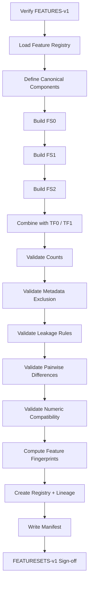
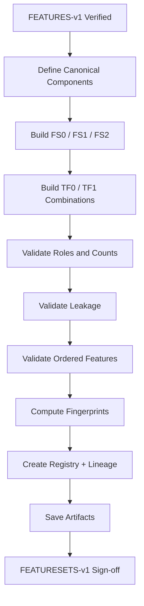

<div align="center">

# PHASE 7 — FEATURE-SET VARIANTS

## Kế hoạch xây dựng, kiểm toán và đóng băng các biến thể tập đặc trưng

### Transformer Encoder cho hồi quy chuỗi thời gian đa biến trên UCI Appliances Energy Prediction

**Phase kế tiếp sau `Phase_6_Feature_engineering.md`**

</div>

---

# 1. Vai trò của Phase 7

Phase 7 chịu trách nhiệm biến `FEATURES-v1` thành các **tập đặc trưng thực nghiệm được định nghĩa rõ ràng, có thứ tự cố định và có thể tái sử dụng nhất quán** trong toàn bộ pipeline.

Nếu:

```text
Phase 6
→ tạo toàn bộ raw + engineered features hợp lệ
```

thì:

```text
Phase 7
→ quyết định những cột nào thuộc từng experimental feature-set variant
```

Phase này không chọn biến thể nào là tốt nhất.

Mục tiêu là tạo đầy đủ các option đã được khóa từ Phase 0:

```text
FS0 — Exogenous-only
FS1 — Autoregressive + Exogenous
FS2 — FS1 + Random Controls

TF0 — Time features OFF
TF1 — Time features ON
```

và chuyển chúng thành một **feature-set registry chuẩn hóa** để các Phase 8–43 dùng chung.

Nguyên tắc:

\[
\boxed{
Explicit
+
Ordered
+
Leakage\text{-}Safe
+
Comparable
+
Immutable
}
\]

---

# 2. Tại sao Phase 7 phải tách riêng khỏi Phase 6?

Phase 6 trả lời:

```text
Có những feature nào tồn tại?
Feature đó được tạo ra như thế nào?
Feature đó có an toàn về leakage không?
```

Phase 7 trả lời:

```text
Feature nào thuộc FS0?
Feature nào được thêm vào FS1?
Feature nào chỉ xuất hiện trong FS2?
TF0 loại time features nào?
TF1 giữ time features nào?
Model input order cụ thể là gì?
Mỗi variant có bao nhiêu channels?
```

Nếu trộn Phase 6 và Phase 7:

```text
feature engineering
+
feature selection
```

sẽ khó audit và dễ làm các experiment sau dùng không cùng input.

---

# 3. Mục tiêu cần đạt sau Phase 7

Sau Phase 7 phải có:

```text
1. Ordered feature list cho FS0.

2. Ordered feature list cho FS1.

3. Ordered feature list cho FS2.

4. Ordered feature list cho TF0.

5. Ordered feature list cho TF1.

6. Combination rules giữa FS* và TF*.

7. Feature count cho mọi valid combination.

8. Feature-set leakage audit.

9. Feature-set semantic audit.

10. Feature-order invariant.

11. Target-exclusion audit.

12. Metadata-exclusion audit.

13. Random-control isolation audit.

14. Historical-target inclusion audit.

15. Machine-readable registry.

16. Feature-set fingerprints.

17. Variant manifest.

18. Feature-set comparison table.

19. Handoff contract cho Phase 8–10.

20. FEATURESETS-v1 sign-off.
```

---

# 4. Những việc Phase 7 không làm

Không:

```text
Không chronological split.

Không fit scaler.

Không target scaling.

Không tạo windows.

Không train LSTM.

Không train Transformer.

Không tính Validation RMSE.

Không chọn FS0/FS1/FS2 winner.

Không chọn TF0/TF1 winner.

Không drop feature vì correlation.

Không thêm feature mới.

Không tạo future label.

Không tạo lag columns.

Không tune hyperparameter.
```

Phase 7 chỉ:

```text
construct
validate
freeze
register
```

các variant.

---

# 5. Input contract

Phase 7 chỉ bắt đầu khi:

```text
Phase 6 = PASS
```

và có:

```text
FEATURES-v1
feature_registry.csv
feature_lineage.csv
feature_availability.csv
feature_leakage_audit.csv
feature_engineering_manifest.json
```

Đồng thời phải truy ngược được:

```text
DATA-v1
SCHEMA-v1
TEMPORAL-v1
EDA-v1
ENV-v1
```

---

# 6. Output version

Gán:

```text
FEATURESETS-v1
```

Quan hệ version:

```text
DATA-v1
   ↓
SCHEMA-v1
   ↓
TEMPORAL-v1
   ↓
EDA-v1
   ↓
FEATURES-v1
   ↓
FEATURESETS-v1
```

Nếu sau này thêm hoặc đổi một feature-set:

```text
FEATURESETS-v2
```

Không sửa âm thầm `FEATURESETS-v1`.

---

# 7. Feature taxonomy dùng trong Phase 7

Kế thừa Phase 6.

## G0 — Metadata-only

```text
raw_row_index
date
timestamp
continuity_segment_id
```

## G1 — Target

```text
Appliances
```

## G2 — Raw exogenous

```text
lights

T1
RH_1
T2
RH_2
T3
RH_3
T4
RH_4
T5
RH_5
T6
RH_6
T7
RH_7
T8
RH_8
T9
RH_9

T_out
Press_mm_hg
RH_out
Windspeed
Visibility
Tdewpoint
```

## G3 — Random controls

```text
rv1
rv2
```

## G4 — Engineered time features

```text
hour_sin
hour_cos
dow_sin
dow_cos
weekend
```

---

# 8. Feature order contract

Thứ tự feature phải được **explicitly defined**.

Không:

```text
df.select_dtypes(...)
```

rồi dùng thứ tự trả về làm model order.

Không:

```text
set(...)
```

vì set không bảo đảm semantic order mong muốn.

Khuyến nghị canonical order:

```text
lights

T1
RH_1
T2
RH_2
T3
RH_3
T4
RH_4
T5
RH_5
T6
RH_6
T7
RH_7
T8
RH_8
T9
RH_9

T_out
Press_mm_hg
RH_out
Windspeed
Visibility
Tdewpoint

Appliances

rv1
rv2

hour_sin
hour_cos
dow_sin
dow_cos
weekend
```

Tuy nhiên từng variant chỉ lấy subset tương ứng.

---

# 9. Vì sao feature order là critical?

Tensor input có dạng:

\[
X\in\mathbb{R}^{B\times L\times F}
\]

Feature index:

```text
X[:,:,0]
X[:,:,1]
...
```

không chứa tên cột.

Nếu order thay đổi giữa:

```text
Train
Validation
Test
```

hoặc giữa:

```text
LSTM
Transformer
```

thì semantics bị sai dù shape vẫn hợp lệ.

Do đó:

\[
\boxed{
Feature\ Order
=
Part\ Of\ The\ Model\ Contract
}
\]

---

# 10. FS0 — Exogenous-only

FS0 chứa:

```text
raw exogenous features
+
time features nếu TF1 được bật
```

FS0 **không chứa**:

```text
Appliances lịch sử
rv1
rv2
metadata
```

---

# 11. Base exogenous ordered list

Khuyến nghị:

```python
EXOGENOUS_FEATURES = [
    "lights",
    "T1", "RH_1",
    "T2", "RH_2",
    "T3", "RH_3",
    "T4", "RH_4",
    "T5", "RH_5",
    "T6", "RH_6",
    "T7", "RH_7",
    "T8", "RH_8",
    "T9", "RH_9",
    "T_out",
    "Press_mm_hg",
    "RH_out",
    "Windspeed",
    "Visibility",
    "Tdewpoint",
]
```

Expected count nếu SCHEMA-v1 đúng:

```text
25
```

---

# 12. FS0 + TF0

Variant:

```text
FS0_TF0
```

Input:

```text
25 raw exogenous features
```

Không calendar engineered features.

Expected feature count:

\[
F=25
\]

---

# 13. FS0 + TF1

Variant:

```text
FS0_TF1
```

Input:

```text
25 raw exogenous
+
5 engineered time features
```

Expected:

\[
F=30
\]

---

# 14. FS1 — Autoregressive + Exogenous

FS1 thêm:

```text
historical Appliances
```

vào FS0.

Ý nghĩa:

> Mô hình được sử dụng các giá trị `Appliances` trong quá khứ, nhưng target ở tương lai vẫn bị loại khỏi input.

---

# 15. FS1 không có target leakage nếu làm đúng

Với sample:

\[
X_{t-L+1:t}
\rightarrow
Appliances_{t+1}
\]

input có thể chứa:

\[
Appliances_{t-L+1:t}
\]

Điều này hợp lệ vì:

```text
tất cả là lịch sử
```

Không được chứa:

\[
Appliances_{t+1}
\]

trong input.

---

# 16. FS1 + TF0

Variant:

```text
FS1_TF0
```

Input:

```text
25 exogenous
+
historical Appliances
```

Expected:

\[
F=26
\]

---

# 17. FS1 + TF1

Variant:

```text
FS1_TF1
```

Đây là **baseline feature configuration** trong master plan.

Input:

```text
25 exogenous
+
historical Appliances
+
5 time features
```

Expected:

\[
F=31
\]

---

# 18. FS2 — Random-control ablation

FS2:

```text
FS1
+
rv1
+
rv2
```

Mục đích:

```text
không phải cải thiện model
```

mà để kiểm tra:

```text
model có overfit vào random-control signal hay không.
```

---

# 19. FS2 + TF0

Variant:

```text
FS2_TF0
```

Input:

```text
25 exogenous
+
historical Appliances
+
rv1
+
rv2
```

Expected:

\[
F=28
\]

---

# 20. FS2 + TF1

Variant:

```text
FS2_TF1
```

Input:

```text
25 exogenous
+
historical Appliances
+
rv1
+
rv2
+
5 time features
```

Expected:

\[
F=33
\]

---

# 21. TF0 contract

TF0:

```text
hour_sin     excluded
hour_cos     excluded
dow_sin      excluded
dow_cos      excluded
weekend      excluded
```

TF0 không làm mất:

```text
timestamp metadata
```

Timestamp vẫn cần cho:

```text
split
window validation
prediction analysis
```

nhưng không phải model feature.

---

# 22. TF1 contract

TF1 thêm chính xác:

```text
hour_sin
hour_cos
dow_sin
dow_cos
weekend
```

Không thêm:

```text
raw hour
raw day_of_week
month
day_of_month
absolute time index
```

---

# 23. Valid variant matrix

Phase 7 phải đăng ký đủ 6 tổ hợp:

| Variant ID | Feature Set | Time Features | Expected F |
|---|---|---|---:|
| `FS0_TF0` | Exogenous | Off | 25 |
| `FS0_TF1` | Exogenous | On | 30 |
| `FS1_TF0` | Exogenous + Past Target | Off | 26 |
| `FS1_TF1` | Exogenous + Past Target | On | 31 |
| `FS2_TF0` | FS1 + rv1/rv2 | Off | 28 |
| `FS2_TF1` | FS1 + rv1/rv2 | On | 33 |

Các count phải được xác minh runtime.

---

# 24. Experimental-plan mapping

Master plan đã tách:

```text
Phase 23 — S1 Feature-set sweep
Phase 24 — S2 Time-feature sweep
```

Vì vậy không nhất thiết chạy cả 6 variants ở cùng một sweep.

Recommended protocol:

## Phase 23

Giữ:

```text
TF1
```

cố định.

So:

```text
FS0_TF1
FS1_TF1
FS2_TF1
```

## Phase 24

Giữ winner/reference FS từ Phase 23 hoặc B0 reference theo master protocol.

So:

```text
FSx_TF0
FSx_TF1
```

Phase 7 chỉ chuẩn bị đầy đủ mọi variant.

---

# 25. Không chọn feature-set winner ở Phase 7

Không được:

```text
FS1 có vẻ hợp lý nhất nên bỏ FS0.
```

Không được:

```text
rv1/rv2 là random nên không cần FS2.
```

Phase 0 đã yêu cầu:

```text
thử hết option.
```

Do đó Phase 7 phải giữ đủ.

---

# 26. Metadata exclusion contract

Không variant nào được chứa:

```text
raw_row_index
date
timestamp
continuity_segment_id
```

Check:

```text
intersection(model_features, metadata_columns) = empty
```

Đây là hard assertion.

---

# 27. Future-target exclusion contract

Phase 7 chưa tạo target future.

Nhưng phải khóa rule:

```text
Feature list chỉ mô tả channels tại historical timestamps.
```

Phase 10 phải tạo:

```text
future target riêng
```

Không đưa target label column vào cùng current-row feature array theo cách có thể bị shift sai.

---

# 28. Current target vs historical target semantics

Cột:

```text
Appliances
```

trong master table có hai vai trò tùy vị trí thời gian.

## Historical input positions

```text
Appliances_t
```

có thể là input của FS1/FS2.

## Forecast target position

```text
Appliances_t+1
```

là label.

Do đó Phase 7 chỉ đánh dấu:

```text
Appliances = HISTORICAL_TARGET_CHANNEL_CANDIDATE
```

không gọi nó đơn giản là:

```text
feature
```

trong mọi ngữ cảnh.

---

# 29. Random-control isolation contract

Chỉ FS2 được phép chứa:

```text
rv1
rv2
```

Assertions:

```text
rv1 not in FS0
rv2 not in FS0

rv1 not in FS1
rv2 not in FS1

rv1 in FS2
rv2 in FS2
```

---

# 30. Historical-target isolation contract

Assertions:

```text
Appliances not in FS0

Appliances in FS1

Appliances in FS2
```

---

# 31. Time-feature isolation contract

Assertions:

```text
TF0 variants:
no time engineered features

TF1 variants:
all 5 time engineered features
```

Không cho trường hợp:

```text
TF1 thiếu weekend
```

hoặc:

```text
TF0 vẫn còn hour_sin.
```

---

# 32. Raw-exogenous consistency contract

Mọi FS variant phải giữ cùng 25 raw exogenous features.

Tức:

```text
FS0 raw exogenous base
=
FS1 raw exogenous base
=
FS2 raw exogenous base
```

Chỉ khác:

```text
Appliances
rv1/rv2
```

Điều này đảm bảo feature-set sweep có ý nghĩa.

---

# 33. Fair-ablation principle

Một ablation hợp lệ cần:

```text
chỉ thay một conceptual factor.
```

FS0 → FS1:

```text
thêm historical Appliances
```

FS1 → FS2:

```text
thêm rv1/rv2
```

TF0 → TF1:

```text
thêm 5 calendar features
```

Không thay thêm:

```text
lookback
scaling
model size
loss
```

cùng lúc trong sweep.

---

# 34. Feature-set registry design

Tạo dictionary:

```python
FEATURE_SET_REGISTRY = {
    "FS0_TF0": [...],
    "FS0_TF1": [...],
    "FS1_TF0": [...],
    "FS1_TF1": [...],
    "FS2_TF0": [...],
    "FS2_TF1": [...],
}
```

Lists phải ordered.

Không dùng:

```text
set
```

làm canonical structure.

---

# 35. Component registry

Ngoài full variants, nên có:

```python
FEATURE_COMPONENTS = {
    "EXOGENOUS": [...],
    "HISTORICAL_TARGET": ["Appliances"],
    "RANDOM_CONTROLS": ["rv1", "rv2"],
    "TIME_FEATURES": [
        "hour_sin",
        "hour_cos",
        "dow_sin",
        "dow_cos",
        "weekend",
    ],
    "METADATA": [...],
}
```

Full variants được build từ components.

---

# 36. Vì sao build variants từ components?

Giảm lỗi:

```text
copy-paste feature list
quên một cột
thứ tự khác nhau
FS1 và FS2 thiếu consistency
```

Ví dụ:

```python
FS1_TF1 = (
    EXOGENOUS
    + HISTORICAL_TARGET
    + TIME_FEATURES
)
```

---

# 37. Canonical order giữa historical target và time features

Khuyến nghị:

```text
EXOGENOUS
→ HISTORICAL_TARGET
→ RANDOM_CONTROLS nếu có
→ TIME_FEATURES
```

Lý do:

```text
raw observed channels trước
engineered channels sau
```

Quan trọng nhất là:

```text
giữ cố định.
```

---

# 38. Feature-set fingerprint

Mỗi ordered feature list phải có fingerprint.

Ví dụ hash của:

```text
variant_id
+
ordered feature names
```

Dùng SHA-256.

Mục tiêu:

```text
phát hiện feature order drift.
```

---

# 39. Fingerprint không cần hash data values

Phase 7 chỉ hash:

```text
feature specification
```

Không cần hash toàn derived dataset lần nữa vì Phase 6 đã có derived checksum.

---

# 40. Fingerprint example concept

Input string:

```text
FS1_TF1|lights|T1|RH_1|...|Appliances|hour_sin|...
```

Hash:

```text
SHA-256
```

Lưu trong registry.

---

# 41. Feature count audit

Với mỗi variant:

```text
actual_feature_count
expected_feature_count
```

Nếu khác:

```text
FAIL
```

trừ khi SCHEMA-v1 có documented schema difference làm expected count thay đổi.

Trong trường hợp đó:

```text
expected count phải derive từ component list
```

không hard-code 25/30/... một cách mù quáng.

---

# 42. Missing-feature audit

Với mỗi variant:

```text
required_features - FEATURES-v1 columns
```

Expected:

```text
empty
```

Nếu missing:

```text
FEATURESET_MISSING_REQUIRED_FEATURE
```

Phase 7 FAIL.

---

# 43. Unexpected-feature audit

Variant không được tự động hút thêm numeric columns.

Ví dụ:

```text
month
raw_row_index
helper_day
```

nếu tồn tại trong derived table thì:

```text
không được tự thêm.
```

Canonical variant lấy:

```text
explicit registry only.
```

---

# 44. Duplicate-feature audit

Kiểm tra:

```text
len(features)
==
len(set(features))
```

Expected:

```text
True
```

Nếu cùng cột xuất hiện hai lần:

```text
FAIL
```

vì model input shape có thể hợp lệ nhưng channel duplicate.

---

# 45. Model-eligibility audit

Mỗi feature trong variant phải:

```text
model_eligible = True
```

theo Phase 6 registry.

Nếu một metadata column lọt vào:

```text
FAIL
```

---

# 46. Leakage-status audit

Mọi feature trong FS0/FS1 phải có status:

```text
PASS
```

trong Phase 6 leakage audit.

FS2:

```text
rv1/rv2
```

được phép status:

```text
CONTROL_ONLY
```

nhưng không:

```text
FORBIDDEN
```

---

# 47. Dtype audit

Mọi model-eligible feature phải có numeric semantic dtype.

TF1 `weekend` có thể là:

```text
bool/int
```

nhưng phải có thể cast sang float32.

Không variant nào chứa:

```text
string/object
```

model feature.

---

# 48. Non-finite audit

Phase 7 không scale nhưng phải xác minh:

```text
all selected feature values finite
```

trên `FEATURES-v1`.

Nếu Phase 6 đã PASS thì đây là downstream defense.

---

# 49. Missing-value audit

Mỗi variant:

```text
NaN count = 0
```

nếu dataset audit trước đó xác nhận no missing.

Nếu có NaN:

```text
không tự impute.
```

Phase 7 FAIL hoặc explicit preprocessing amendment.

---

# 50. Feature-set matrix shape sanity

Trích:

```text
small deterministic sample
```

và tạo:

```python
X_probe = df[feature_list].to_numpy()
```

Expected:

```text
shape = [N, F]
```

Không tạo windows.

Chỉ kiểm tra:

```text
column order
numeric conversion
finite values
```

---

# 51. Matrix round-trip semantic check

Với một row probe:

```text
feature list index i
```

phải map đúng:

```text
column_name_i
value_i
```

Có thể test vài cột:

```text
first
middle
last
```

để phát hiện order mismatch.

---

# 52. No scaling invariant

Giá trị matrix probe phải vẫn là:

```text
raw/engineered unscaled values
```

Không:

```text
mean≈0
std≈1
```

do vô tình scale trước Phase 9.

---

# 53. TF1 scale heterogeneity note

TF1 features nằm trong:

```text
[-1,1]
```

trong khi raw features có scale khác.

Điều này không phải vấn đề cần xử lý tại Phase 7.

Phase 9 sẽ quyết định scaling protocol nhất quán.

---

# 54. Có nên scale binary `weekend`?

Không quyết định ở Phase 7.

Phase 9 phải có preprocessing rule rõ.

Không để Phase 7 tự scale một cột.

---

# 55. Random-control semantic note

UCI mô tả `rv1` và `rv2` là random variables phục vụ việc test/filter feature selection.

Phase 7 giữ chúng trong FS2 để thực hiện đúng ablation đã khóa.

Không diễn giải:

```text
rv1/rv2 có ý nghĩa vật lý.
```

---

# 56. FS2 interpretation contract

Nếu sau này FS2 tốt hơn FS1:

Không kết luận ngay:

```text
random variables có predictive value thật.
```

Cần xem:

```text
variance theo seed
generalization gap
rolling-origin robustness
```

Có thể là:

```text
chance correlation
overfitting
optimization noise
```

---

# 57. FS0 interpretation contract

FS0 trả lời câu hỏi:

> Nếu không dùng historical target, chỉ dùng past exogenous readings thì model dự báo được tới đâu?

Đây là một ablation khoa học có giá trị.

---

# 58. FS1 interpretation contract

FS1 trả lời:

> Historical Appliances có cung cấp predictive signal bổ sung trên cùng exogenous context hay không?

Nếu FS1 tốt hơn FS0:

```text
có evidence rằng autoregressive history hữu ích
trong evaluation protocol.
```

Không suy ra causality.

---

# 59. TF0/TF1 interpretation contract

TF1 tốt hơn TF0:

```text
calendar phase encoding cải thiện validation prediction
```

trong experimental setup.

Không kết luận:

```text
calendar causes consumption.
```

---

# 60. Variant naming convention

Canonical:

```text
FS0_TF0
FS0_TF1
FS1_TF0
FS1_TF1
FS2_TF0
FS2_TF1
```

Không dùng:

```text
feature_set_1
best_features
all_features
without_target
```

vì khó audit.

---

# 61. Experiment run naming dependency

Sau này có thể dùng:

```text
S1_FS0_TF1_SEED42
S1_FS1_TF1_SEED42
S1_FS2_TF1_SEED42
```

Feature-set ID phải xuất hiện trong:

```text
run_id
registry
checkpoint name
prediction artifact
```

---

# 62. Feature-set manifest

Tạo:

```text
artifacts/feature_sets/feature_set_manifest.json
```

Fields:

```text
feature_set_version
feature_version
dataset_revision
schema_version
temporal_version
eda_version
environment_id
variants
baseline_variant
component_counts
metadata_columns
target_column
random_controls
time_features
fingerprints
audit_status
warnings
created_at
```

---

# 63. Baseline variant

Master B0 dùng:

```text
FS1
TF1
```

Do đó:

```text
baseline_variant = FS1_TF1
```

Phase 7 chỉ ghi baseline reference.

Không gọi:

```text
best_variant.
```

---

# 64. Feature-set comparison table

Tạo:

| Variant | Exogenous | Past Appliances | rv1/rv2 | Time Features | F |
|---|---|---|---|---|---:|
| FS0_TF0 | Yes | No | No | No | runtime |
| FS0_TF1 | Yes | No | No | Yes | runtime |
| FS1_TF0 | Yes | Yes | No | No | runtime |
| FS1_TF1 | Yes | Yes | No | Yes | runtime |
| FS2_TF0 | Yes | Yes | Yes | No | runtime |
| FS2_TF1 | Yes | Yes | Yes | Yes | runtime |

---

# 65. Feature-set registry CSV

Tạo:

```text
feature_set_registry.csv
```

Một row cho mỗi feature trong mỗi variant.

Fields:

```text
feature_set_version
variant_id
feature_position
feature_name
component
origin
role
availability
unit
dtype
model_eligible
leakage_status
fingerprint
```

---

# 66. Variant summary CSV

Tạo:

```text
feature_set_variants.csv
```

Fields:

```text
variant_id
feature_set_id
time_feature_id
feature_count
contains_past_target
contains_random_controls
contains_time_features
fingerprint
status
notes
```

---

# 67. Feature-component registry

Tạo:

```text
feature_components.json
```

Gồm:

```text
EXOGENOUS
HISTORICAL_TARGET
RANDOM_CONTROLS
TIME_FEATURES
METADATA
```

Lists ordered.

---

# 68. Feature-order test artifact

Có thể tạo:

```text
feature_order_checks.csv
```

Fields:

```text
variant_id
first_feature
last_feature
feature_count
duplicate_count
missing_count
metadata_leak_count
order_fingerprint
status
```

---

# 69. Feature-set leakage audit

Tạo:

```text
feature_set_leakage_audit.csv
```

Checks cho từng variant:

```text
contains_metadata
contains_future_target
contains_forbidden_feature
contains_random_control_as_expected
contains_historical_target_as_expected
time_features_match_variant
all_features_model_eligible
all_features_prediction_time_valid
status
```

---

# 70. Feature-set invariants

## Invariant V1

```text
FS0 ⊂ FS1
```

về conceptual components:

\[
FS1 = FS0 + Appliances
\]

## Invariant V2

\[
FS2 = FS1 + rv1 + rv2
\]

## Invariant V3

\[
TF1 = TF0 + 5\ time\ features
\]

## Invariant V4

Không variant chứa metadata.

## Invariant V5

Feature order deterministic.

---

# 71. Set-difference audit

Kiểm tra:

```text
FS1_base - FS0_base
```

Expected:

```text
{"Appliances"}
```

Kiểm tra:

```text
FS2_base - FS1_base
```

Expected:

```text
{"rv1", "rv2"}
```

Kiểm tra:

```text
TF1 - TF0
```

Expected:

```text
5 time features
```

---

# 72. Không dùng unordered set làm canonical output

Set chỉ dùng:

```text
audit difference
```

Canonical lists vẫn phải:

```text
ordered list
```

---

# 73. Fingerprint determinism test

Build registry hai lần.

Expected:

```text
same variant
→ same fingerprint
```

Nếu khác:

```text
FEATURESET_NONDETERMINISTIC_ORDER
```

---

# 74. Registry idempotency

Chạy Phase 7 lại trên cùng `FEATURES-v1`:

```text
feature lists
counts
fingerprints
```

phải giống hệt.

Không phụ thuộc:

```text
random seed
```

Phase 7 hoàn toàn deterministic.

---

# 75. No-data-copy option

Không bắt buộc tạo 6 CSV riêng:

```text
FS0_TF0.csv
FS0_TF1.csv
...
```

Khuyến nghị **không** làm vậy.

Giữ một:

```text
FEATURES-v1 master table
```

và registry các ordered column lists.

Lợi ích:

```text
không duplicate data
không sinh version drift
không lãng phí storage
```

---

# 76. Khi nào cần materialize variant matrix?

Chỉ khi downstream cần:

```text
NumPy matrix
Torch Dataset
```

Phase 7 có thể tạo probe nhưng không lưu full matrix bắt buộc.

Phase 8/9/10 mới materialize theo split/scaling/window.

---

# 77. Không tạo feature-set sau scaling

Feature-set semantics phải được khóa **trước** scaling.

Phase 9 nhận:

```text
ordered feature list
```

và fit scaler đúng channels.

Nếu feature order thay đổi sau scaling:

```text
scaler statistics map sai feature.
```

---

# 78. Scaler dependency contract

Phase 9 phải lưu:

```text
feature_variant_id
feature_order
feature_fingerprint
```

cùng scaler.

Như vậy scaler của:

```text
FS1_TF1
```

không bị reuse nhầm cho:

```text
FS0_TF1.
```

---

# 79. Window-builder dependency contract

Phase 10 phải nhận:

```text
variant_id
ordered_feature_list
```

để tạo:

\[
X[N,L,F]
\]

Feature dimension:

```text
F
```

phải khớp registry.

---

# 80. LSTM/Transformer fairness dependency

Cùng một run comparison:

```text
LSTM
Transformer
```

phải dùng **cùng variant fingerprint**.

Không chỉ cùng tên:

```text
FS1_TF1
```

mà phải cùng:

```text
ordered feature fingerprint.
```

---

# 81. Experiment registry dependency

Phase 13 cần fields:

```text
feature_set_version
feature_variant_id
feature_fingerprint
feature_count
```

Phase 7 phải bàn giao đầy đủ.

---

# 82. FS sweep dependency — Phase 23

Phase 23 sẽ dùng:

```text
FS0_TF1
FS1_TF1
FS2_TF1
```

trong controlled sweep.

Giữ:

```text
lookback
model architecture
scaling
optimizer
loss
seed
```

theo baseline reference.

---

# 83. Time-feature sweep dependency — Phase 24

Phase 24 sử dụng:

```text
FSx_TF0
FSx_TF1
```

với same FS component.

Không tạo time feature mới tại Phase 24.

---

# 84. Baseline-model dependency

Persistence không dùng toàn feature matrix.

Nhưng Phase 14 vẫn phải log:

```text
feature variant context
```

nếu persistence được so trên cùng sample population.

Persistence prediction chỉ cần:

```text
historical Appliances_t
```

---

# 85. FS0 và Persistence nuance

Nếu experiment dùng:

```text
FS0
```

thì model không dùng past Appliances.

Persistence lại dùng:

```text
Appliances_t.
```

Đây không phải cùng feature restriction.

Do đó persistence được xem là:

```text
task-level naive baseline
```

chứ không phải FS0 architectural ablation.

Report phải nói rõ.

---

# 86. Prediction sample population fairness

Dù variant khác feature count:

```text
FS0
FS1
FS2
```

cần dùng cùng:

```text
target timestamps
window validity
lookback
horizon
```

Không để một variant có nhiều sample hơn vì feature handling khác.

---

# 87. Missingness fairness

Nếu một variant có feature missing:

```text
không drop sample riêng cho variant
```

mà không có protocol.

Với dataset hiện tại dự kiến no missing.

Nếu phát sinh:

```text
phải tạo shared valid-sample policy
```

để comparison công bằng.

---

# 88. Data availability fairness

FS0/FS1/FS2 đều dựa historical timestamps giống nhau.

Không cho FS2 sử dụng:

```text
additional future metadata
```

hoặc khác temporal availability.

---

# 89. Feature-set audit probe

Chọn:

```text
first valid 5 rows
```

hoặc deterministic rows.

Print table:

```text
variant
feature count
first 5 feature names
last 5 feature names
```

Không cần in toàn 33 columns mỗi lần nếu notebook quá dài.

Full list lưu artifact.

---

# 90. Human-readable feature-set specification

Tạo:

```text
README_FEATURE_SETS.md
```

Nội dung:

```text
FS0 definition
FS1 definition
FS2 definition
TF0 definition
TF1 definition
all six combined variants
baseline variant
ablation rationale
feature-order rule
leakage rule
```

Giúp người đọc hiểu experiment mà không cần mở JSON.

---

# 91. Machine-readable registry

Khuyến nghị Python:

```python
FEATURE_SET_REGISTRY = {...}
```

Có thể serialize:

```text
feature_set_registry.json
```

Lists giữ order trong JSON array.

---

# 92. JSON structure đề xuất

```json
{
  "feature_set_version": "FEATURESETS-v1",
  "baseline_variant": "FS1_TF1",
  "variants": {
    "FS0_TF0": {
      "features": [],
      "feature_count": 0,
      "fingerprint": ""
    }
  }
}
```

Thực tế values được populate runtime.

---

# 93. Không hard-code counts làm source of truth

Counts:

```text
25
30
26
31
28
33
```

là expected theo SCHEMA-v1 hiện tại.

Source of truth runtime:

```text
len(ordered_feature_list)
```

Nếu khác:

```text
audit
```

không sửa list cho khớp một con số hard-coded.

---

# 94. Dtype-to-model contract

Phase 7 phải xác định:

```text
all variant columns can ultimately become float32 tensor.
```

Không cast lúc này.

Chỉ kiểm tra:

```text
numeric compatibility.
```

---

# 95. Feature-set statistical summary có cần không?

Không cần làm EDA lại.

Có thể lưu:

```text
feature_count
dtype categories
```

Không:

```text
mean/std/correlation
```

cho từng variant.

Đó không phải mục tiêu Phase 7.

---

# 96. Feature-set selection criteria chưa dùng ở Phase 7

Không tính:

```text
score
rank
winner
```

Phase 23–24 mới tạo validation evidence.

Trong registry:

```text
selection_status = UNTESTED
```

---

# 97. Selection status enum

```text
UNTESTED
TESTED
CANDIDATE
SELECTED
REJECTED
```

Phase 7 tất cả variants:

```text
UNTESTED
```

Baseline reference:

```text
BASELINE_REFERENCE
```

có thể là field riêng.

---

# 98. Phase 7 discrepancy categories

```text
MISSING_REQUIRED_FEATURE
UNEXPECTED_FEATURE
DUPLICATE_FEATURE
METADATA_LEAK
TARGET_ROLE_ERROR
RANDOM_CONTROL_ROLE_ERROR
TIME_FEATURE_MISMATCH
NON_NUMERIC_FEATURE
NON_FINITE_FEATURE
ORDER_DRIFT
FINGERPRINT_MISMATCH
COUNT_MISMATCH
FEATURE_VERSION_MISMATCH
OTHER
```

---

# 99. Feature-set discrepancy log

Tạo:

```text
artifacts/feature_sets/feature_set_discrepancies.json
```

Fields:

```text
id
severity
variant_id
category
expected
actual
interpretation
recommended_action
resolved
notes
```

---

# 100. Status model

## PASS

```text
All six variants valid.
Counts valid.
No leakage.
Order deterministic.
```

## PASS_WITH_WARNING

Ví dụ:

```text
expected feature count differs from old plan
because SCHEMA-v1 documented an upstream schema variation,
but registry is internally valid.
```

## FAIL

Ví dụ:

```text
metadata leaked
Appliances missing from FS1
rv1 appears in FS1
duplicate channel
non-numeric model feature
```

---

# 101. Unit-test strategy

Tạo unit tests cho:

```text
FS0 excludes Appliances.

FS1 includes Appliances once.

FS2 includes rv1/rv2 once.

TF0 excludes all time features.

TF1 includes exactly all 5.

No metadata in any variant.

All variant feature names exist in FEATURES-v1.

All variants deterministic.
```

---

# 102. Pairwise difference tests

Phải pass:

```text
FS1_TF0 - FS0_TF0
= Appliances

FS2_TF0 - FS1_TF0
= rv1 + rv2

FS0_TF1 - FS0_TF0
= 5 time features

FS1_TF1 - FS1_TF0
= 5 time features

FS2_TF1 - FS2_TF0
= 5 time features
```

Với set comparison chỉ cho audit.

---

# 103. Ordered-prefix consistency

Khuyến nghị kiểm tra:

```text
FS0 exogenous order
```

là prefix/consistent subsequence của FS1 và FS2.

Điều này giúp:

```text
debug channel semantics
```

---

# 104. Random-control position

Khuyến nghị order:

```text
... exogenous
Appliances
rv1
rv2
time features
```

Nếu FS2.

Không để:

```text
rv1 giữa T4 và RH_4
```

vì khó audit.

---

# 105. Time-feature position

Khuyến nghị luôn đặt cuối:

```text
hour_sin
hour_cos
dow_sin
dow_cos
weekend
```

LSTM/Transformer không quan tâm semantic order theo lý thuyết nếu projection học đúng, nhưng implementation/reproducibility cần order ổn định.

---

# 106. Feature-set lineage

Mỗi variant cần lineage:

```text
variant_id
built_from_components
source_feature_version
construction_rule
```

Ví dụ:

```text
FS1_TF1
=
EXOGENOUS
+ HISTORICAL_TARGET
+ TIME_FEATURES
```

---

# 107. Feature-set lineage artifact

Tạo:

```text
feature_set_lineage.csv
```

Fields:

```text
variant_id
component_order
component_name
feature_start_position
feature_end_position
source_version
notes
```

---

# 108. Variant freeze contract

Sau Phase 7:

```text
Không sửa feature list trong notebook Phase 23.
```

Nếu Phase 23 cần FS1_TF1:

```text
load registry
```

không viết lại manual list.

---

# 109. Central registry principle

Một và chỉ một source of truth:

```text
feature_set_registry.json
```

hoặc Python config generated từ file đó.

Không có:

```text
notebook A list khác
notebook B list khác
```

---

# 110. Runtime validation helper

Khuyến nghị function:

```python
def get_feature_list(variant_id: str) -> list[str]:
    ...
```

Phải:

```text
validate variant exists
return copy, not mutable canonical reference
```

để caller không vô tình sửa registry.

---

# 111. Immutable registry pattern

Có thể:

```text
tuple
```

trong Python internal config.

Ví dụ:

```python
FEATURE_SET_REGISTRY["FS1_TF1"] = tuple(...)
```

Khi cần list:

```text
list(tuple_value)
```

Điều này giảm accidental mutation.

---

# 112. Variant validation function

Khuyến nghị:

```text
validate_feature_variant(
    variant_id,
    feature_list,
    feature_registry,
    leakage_registry
)
```

Return:

```text
PASS/FAIL
errors
warnings
fingerprint
```

---

# 113. No seed dependency

Phase 7 không sử dụng:

```text
seed
```

vì deterministic.

Nếu output thay đổi giữa run cùng inputs:

```text
bug.
```

---

# 114. Notebook structure Phase 7

Khuyến nghị:

```text
14–18 cells
```

## Cell 7.1 — Phase title

## Cell 7.2 — Verify FEATURES-v1

## Cell 7.3 — Load feature registry/lineage

## Cell 7.4 — Define components

## Cell 7.5 — Build FS0 base

## Cell 7.6 — Build FS1 base

## Cell 7.7 — Build FS2 base

## Cell 7.8 — Build TF0 / TF1 combinations

## Cell 7.9 — Feature-count audit

## Cell 7.10 — Leakage/metadata audit

## Cell 7.11 — Pairwise difference tests

## Cell 7.12 — Ordered feature fingerprints

## Cell 7.13 — Matrix probe

## Cell 7.14 — Feature-set summary table

## Cell 7.15 — Save registry

## Cell 7.16 — Save lineage/audits

## Cell 7.17 — Manifest

## Cell 7.18 — Phase sign-off

---

# 115. Quy trình thực thi Phase 7



---

# 116. Function design khuyến nghị

```text
verify_feature_set_inputs()

load_feature_registry()

build_feature_components()

build_variant()

validate_variant_columns()

validate_feature_count()

validate_feature_roles()

validate_metadata_exclusion()

validate_random_control_contract()

validate_historical_target_contract()

validate_time_feature_contract()

compute_feature_fingerprint()

build_variant_summary()

write_feature_set_registry()

write_feature_set_manifest()

write_feature_set_discrepancies()
```

---

# 117. Output directory

```text
artifacts/
└── feature_sets/
    ├── feature_set_registry.json
    ├── feature_set_registry.csv
    ├── feature_set_variants.csv
    ├── feature_components.json
    ├── feature_set_lineage.csv
    ├── feature_set_leakage_audit.csv
    ├── feature_order_checks.csv
    ├── feature_set_discrepancies.json
    ├── README_FEATURE_SETS.md
    └── phase_7_signoff.json
```

---

# 118. Output O7.1 — Feature-set registry

```text
feature_set_registry.json
```

Source of truth cho downstream.

---

# 119. Output O7.2 — Long-format registry

```text
feature_set_registry.csv
```

Dễ inspect/filter.

---

# 120. Output O7.3 — Variant summary

```text
feature_set_variants.csv
```

---

# 121. Output O7.4 — Components

```text
feature_components.json
```

---

# 122. Output O7.5 — Lineage

```text
feature_set_lineage.csv
```

---

# 123. Output O7.6 — Leakage audit

```text
feature_set_leakage_audit.csv
```

---

# 124. Output O7.7 — Order checks

```text
feature_order_checks.csv
```

---

# 125. Output O7.8 — Discrepancies

```text
feature_set_discrepancies.json
```

---

# 126. Output O7.9 — Human-readable specification

```text
README_FEATURE_SETS.md
```

---

# 127. Output O7.10 — Sign-off

```text
phase_7_signoff.json
```

---

# 128. Feature-set manifest fields

Tối thiểu:

```text
feature_set_version = FEATURESSETS-v1 / FEATURESETS-v1
```

Canonical value nên dùng:

```text
FEATURESETS-v1
```

Fields:

```text
feature_set_version
feature_version
dataset_revision
schema_version
temporal_version
eda_version
environment_id
baseline_variant
variant_ids
variant_feature_counts
variant_fingerprints
metadata_columns
target_column
historical_target_channel
random_controls
time_features
all_variants_valid
leakage_audit_passed
order_audit_passed
audit_status
warnings
created_at
```

---

# 129. Typo guard cho version name

Chỉ dùng:

```text
FEATURESETS-v1
```

Không dùng đồng thời:

```text
FEATURESSETS-v1
FEATURE-SETS-v1
FS-v1
```

trong artifact metadata.

---

# 130. Phase 7 sanity checklist

```text
[ ] Phase 6 PASS.

[ ] FEATURES-v1 checksum verified.

[ ] Feature registry loaded.

[ ] Feature lineage loaded.

[ ] Feature availability loaded.

[ ] EXOGENOUS component created.

[ ] HISTORICAL_TARGET component created.

[ ] RANDOM_CONTROLS component created.

[ ] TIME_FEATURES component created.

[ ] METADATA component created.

[ ] FS0_TF0 created.

[ ] FS0_TF1 created.

[ ] FS1_TF0 created.

[ ] FS1_TF1 created.

[ ] FS2_TF0 created.

[ ] FS2_TF1 created.

[ ] FS0 excludes Appliances.

[ ] FS1 includes Appliances exactly once.

[ ] FS2 includes Appliances exactly once.

[ ] FS0 excludes rv1/rv2.

[ ] FS1 excludes rv1/rv2.

[ ] FS2 includes rv1/rv2 exactly once.

[ ] TF0 excludes all 5 time features.

[ ] TF1 includes all 5 time features.

[ ] No metadata column in any variant.

[ ] All variant columns exist in FEATURES-v1.

[ ] No duplicate features.

[ ] All model features numeric-compatible.

[ ] No forbidden future features.

[ ] Pairwise difference tests pass.

[ ] Feature order deterministic.

[ ] Variant fingerprints created.

[ ] Baseline variant = FS1_TF1.

[ ] Selection status = UNTESTED.

[ ] Registry JSON saved.

[ ] Registry CSV saved.

[ ] Variant summary saved.

[ ] Lineage saved.

[ ] Leakage audit saved.

[ ] Feature-order checks saved.

[ ] README_FEATURE_SETS saved.

[ ] FEATURESETS-v1 assigned.

[ ] Phase 7 sign-off completed.
```

---

# 131. Acceptance criteria

Phase 7 chỉ PASS khi:

```text
All six variants tồn tại.

Variant semantics đúng contract.

Feature order explicit.

No metadata leakage.

No future leakage.

Historical target chỉ xuất hiện ở FS1/FS2.

Random controls chỉ xuất hiện ở FS2.

TF1 chứa đúng 5 time features.

TF0 không chứa time engineered features.

All feature names tồn tại trong FEATURES-v1.

All fingerprints deterministic.

Downstream phases có thể load registry thay vì chọn columns thủ công.
```

---

# 132. Khi nào Phase 7 FAIL?

```text
FS0 chứa Appliances.

FS1 thiếu Appliances.

FS1 chứa rv1/rv2.

FS2 thiếu rv1 hoặc rv2.

TF0 vẫn chứa engineered time feature.

TF1 thiếu một time feature.

Metadata lọt vào model list.

Feature list chứa duplicate.

Feature order thay đổi giữa hai lần build.

Feature không tồn tại trong FEATURES-v1.

Future-only feature xuất hiện.

Registry không traceable về FEATURES-v1.
```

---

# 133. Các lỗi thường gặp

## Lỗi 1 — Dùng `df.select_dtypes()` làm feature selection

Có thể hút metadata numeric ngoài ý muốn.

---

## Lỗi 2 — Dùng `set` để build features

Mất canonical order.

---

## Lỗi 3 — Drop `Appliances` khỏi toàn bộ model inputs vì đó là target

FS1/FS2 cần historical target channel.

---

## Lỗi 4 — Đưa `Appliances(t+1)` vào FS1

Leakage.

Phase 10 phải tách label tương lai.

---

## Lỗi 5 — Bỏ FS2 vì rv1/rv2 random

Đi ngược yêu cầu thử hết option.

---

## Lỗi 6 — Thêm helper `hour` vào TF1

TF1 contract chỉ có 5 engineered features.

---

## Lỗi 7 — Đưa timestamp numeric vào model

Không nằm trong contract và dễ tạo temporal shortcut.

---

## Lỗi 8 — Tạo 6 CSV riêng và để chúng drift

Nên dùng one master data artifact + centralized registry.

---

## Lỗi 9 — Tự chọn FS1 winner vì nghe “hợp lý”

Validation sweep chưa diễn ra.

---

## Lỗi 10 — Dùng feature count làm đủ bằng chứng

Phải kiểm tra:

```text
names
roles
order
leakage
```

---

# 134. Handoff sang Phase 8

Phase 8 nhận:

```text
FEATURES-v1
FEATURESETS-v1
```

và:

```text
timestamp metadata
```

để tạo chronological split.

Phase 8 chưa cần chọn final feature variant.

Split boundaries phải độc lập với feature-set winner.

---

# 135. Handoff sang Phase 9

Phase 9 nhận:

```text
variant ID
ordered feature list
feature fingerprint
```

để fit scaler.

Scaler artifact phải bind với:

```text
variant fingerprint
```

---

# 136. Handoff sang Phase 10

Phase 10 nhận:

```text
ordered feature channels
continuity metadata
lookback
horizon
```

và tạo:

\[
X[N,L,F]
\]

Phải assert:

```text
X.shape[-1]
=
feature_count in FEATURESETS-v1
```

---

# 137. Handoff sang Phase 11

DataLoader không cần biết feature names, nhưng dataset metadata phải giữ:

```text
variant_id
feature_count
feature_fingerprint
```

---

# 138. Handoff sang Phase 12

Metrics không phụ thuộc feature set nhưng result record phải có:

```text
variant_id
```

để so đúng experiment.

---

# 139. Handoff sang Phase 13

Experiment registry fields:

```text
feature_set_version
variant_id
feature_count
feature_fingerprint
```

bắt buộc.

---

# 140. Handoff sang Phase 20–21

LSTM và Transformer baseline B0:

```text
FS1_TF1
```

theo master contract.

Cùng fingerprint.

---

# 141. Handoff sang Phase 23

Phase 23 chạy S1:

```text
FS0_TF1
FS1_TF1
FS2_TF1
```

Mục tiêu:

```text
historical target value
random-control effect
```

---

# 142. Handoff sang Phase 24

Phase 24 chạy:

```text
FSx_TF0
FSx_TF1
```

với FS reference đã được protocol quyết định.

---

# 143. Handoff sang Phase 42

Candidate synthesis phải ghi:

```text
selected feature variant
```

không chỉ hyperparameters.

---

# 144. Handoff sang Phase 45

Final model lock phải freeze:

```text
feature_set_version
variant_id
fingerprint
feature_count
ordered features
```

Sau Phase 45 không được đổi feature set.

---

# 145. Handoff sang Phase 46–47

Three-seed final runs phải dùng:

```text
same feature fingerprint
```

cho cả 3 seeds.

Không seed nào được feature variant khác.

---

# 146. Handoff sang Attention Analysis

Attention map chủ yếu diễn giải:

```text
temporal positions
```

không trực tiếp feature importance.

Tuy nhiên feature-set variant phải được report vì representation phụ thuộc channels được cung cấp cho model.

---

# 147. Phase 7 Definition of Done



Phase 7 hoàn thành khi:

\[
\boxed{
Explicit\ Variants
+
Stable\ Feature\ Order
+
No\ Leakage
+
Fair\ Ablation\ Structure
+
Reusable\ Registry
}
\]

được bảo đảm.

---

# 148. Final status contract

```text
Phase 7 không chọn winner.

Phase 7 không scale.

Phase 7 không split.

Phase 7 không tạo windows.

Phase 7 không train model.

Phase 7 khóa semantics và order của feature variants.

Mọi experiment sau phải load FEATURESETS-v1
thay vì tự chọn columns bằng tay.
```

---

<div align="center">

# PHASE 7 — FINAL CHECK

**Feature-set variant là một phần của experimental protocol, không phải một list cột viết tùy ý.**

**FS0, FS1, FS2 và TF0, TF1 phải được định nghĩa độc lập, có thứ tự và có fingerprint.**

**Historical target chỉ được dùng ở các timestamp quá khứ.**

**Random controls chỉ được xuất hiện trong FS2.**

**Metadata tuyệt đối không được lọt vào tensor input.**

**Chỉ sau khi `FEATURESETS-v1` được sign-off mới chuyển sang PHASE 8 — Chronological Split.**

</div>
