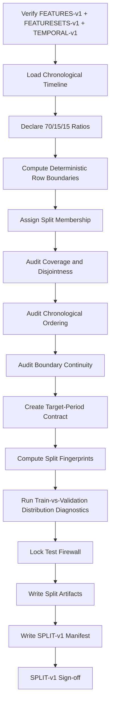
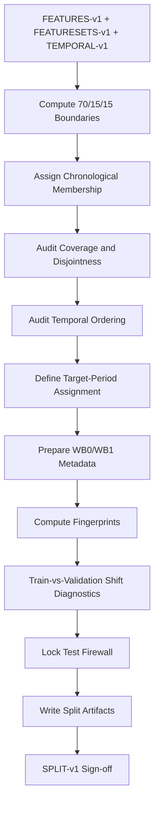

<div align="center">

# PHASE 8 — CHRONOLOGICAL SPLIT

## Kế hoạch chia Train / Validation / Test theo thời gian, khóa biên dữ liệu và bảo vệ Test set

### Transformer Encoder cho hồi quy chuỗi thời gian đa biến trên UCI Appliances Energy Prediction

**Phase kế tiếp sau `Phase_7_Feature_set_variants.md`**

</div>

---

# 1. Vai trò của Phase 8

Phase 8 chịu trách nhiệm **chia timeline thành Train / Validation / Test theo thứ tự thời gian**, tạo split contract cố định cho toàn bộ pipeline từ Phase 9 đến Phase 59.

Nếu:

```text
Phase 6
→ tạo FEATURES-v1

Phase 7
→ tạo FEATURESETS-v1
```

thì:

```text
Phase 8
→ tạo SPLIT-v1
```

Phase này phải khóa:

```text
Train period
Validation period
Test period

Boundary timestamps

Target-period membership

Context policy metadata

Test-use policy

Split fingerprints

Split-aware sample identity
```

Nguyên tắc:

\[
\boxed{
Past
\rightarrow
Train
\rightarrow
Validation
\rightarrow
Test
\rightarrow
Future
}
\]

Không được:

```text
shuffle trước split
random train_test_split
stratified random split
random window split
```

---

# 2. Tại sao chronological split là bắt buộc?

Coursework giải bài toán:

\[
X_{t-L+1:t}
\rightarrow
Appliances_{t+1}
\]

Mục tiêu là dự báo **tương lai từ quá khứ**.

Nếu random split:

```text
Train:
có samples tháng sau

Validation/Test:
có samples tháng trước
```

thì model có thể học information regime của tương lai rồi được đánh giá trên quá khứ.

Điều này không phản ánh forecasting deployment.

Do đó chronological split phải đảm bảo:

\[
\max(T_{train})
<
\min(T_{validation})
<
\min(T_{test})
\]

và tương tự:

\[
\max(T_{validation})
<
\min(T_{test})
\]

---

# 3. Split contract đã khóa từ Phase 0

Primary split:

```text
Train      = 70%
Validation = 15%
Test       = 15%
```

theo timeline.

Không thay tỷ lệ sau khi nhìn model results.

Nếu sau này muốn:

```text
60/20/20
80/10/10
```

phải xem đó là:

```text
protocol amendment
```

và tạo split version mới.

---

# 4. Mục tiêu cần đạt sau Phase 8

Sau Phase 8 phải có:

```text
1. Chính xác số rows trong Train period.

2. Chính xác số rows trong Validation period.

3. Chính xác số rows trong Test period.

4. Start/end timestamp của từng split.

5. Chronological ordering được chứng minh.

6. Không overlap target periods.

7. Không random shuffle trước split.

8. Target-period membership cho từng timestamp.

9. Context-carry-over metadata được chuẩn bị.

10. Strict-isolation metadata được chuẩn bị.

11. Train/Validation distribution diagnostics được thực hiện.

12. Test set được khóa và không dùng để tune.

13. Split fingerprint cho Train.

14. Split fingerprint cho Validation.

15. Split fingerprint cho Test.

16. SPLIT-v1 manifest.

17. Split membership artifact.

18. Boundary audit.

19. Leakage audit.

20. Handoff chính xác sang Phase 9 và Phase 10.

21. Phase 8 sign-off.
```

---

# 5. Những việc Phase 8 không làm

Không:

```text
Không fit StandardScaler.

Không target scaling.

Không tạo windows chính thức.

Không tạo DataLoader.

Không train model.

Không tính Validation RMSE.

Không xem Test RMSE.

Không chọn feature-set winner.

Không chọn lookback.

Không tune hyperparameters.

Không dùng Test distribution để quyết định model.

Không shuffle timeline trước split.

Không merge Train/Validation.

Không dùng rolling-origin folds chính thức.
```

---

# 6. Input contract

Phase 8 chỉ bắt đầu khi:

```text
Phase 6 = PASS
Phase 7 = PASS
```

và có thể truy ngược:

```text
ENV-v1
DATA-v1
SCHEMA-v1
TEMPORAL-v1
EDA-v1
FEATURES-v1
FEATURESETS-v1
```

Phải xác minh:

```text
FEATURES-v1 checksum đúng

timestamp order đúng TEMPORAL-v1

continuity metadata vẫn tồn tại

row count không đổi
```

---

# 7. Output version

Gán:

```text
SPLIT-v1
```

Version lineage:

```text
DATA-v1
   ↓
SCHEMA-v1
   ↓
TEMPORAL-v1
   ↓
FEATURES-v1
   ↓
FEATURESETS-v1
   ↓
SPLIT-v1
```

---

# 8. Nguyên tắc split theo timestamp

Split membership phải được xác định theo:

```text
timestamp
```

không theo:

```text
random row ID
```

Vì dữ liệu đã được TEMPORAL-v1 xác minh và canonical sorted view tồn tại, Phase 8 dùng:

```text
ordered timestamps
```

làm basis.

---

# 9. Split theo row proportion hay wall-clock duration?

Primary contract đã khóa:

```text
70 / 15 / 15
```

theo số observations chronological.

Do dataset dự kiến có spacing đều 10 phút:

```text
row proportion
≈
time-duration proportion
```

TEMPORAL-v1 phải xác nhận spacing trước khi dùng assumption này.

Nếu có gaps:

```text
vẫn chia theo ordered valid observation timeline
```

nhưng phải report:

```text
wall-clock duration
```

của từng split.

---

# 10. Canonical split computation

Với:

\[
N = \text{total number of chronological rows}
\]

khuyến nghị:

```text
train_end_index = floor(0.70 * N)

val_end_index   = floor(0.85 * N)
```

Sau đó:

```text
Train:
[0, train_end_index)

Validation:
[train_end_index, val_end_index)

Test:
[val_end_index, N)
```

Phải dùng một rule duy nhất và ghi rõ.

---

# 11. Rounding contract

Không để Python implicit rounding làm split khác giữa notebook.

Canonical:

```text
floor
```

cho Train và cumulative Train+Validation boundary.

Sau đó:

```text
Test nhận toàn bộ rows còn lại.
```

Invariant:

\[
N_{train}
+
N_{val}
+
N_{test}
=
N
\]

---

# 12. Không hard-code row counts trước runtime

Mặc dù UCI report:

```text
19,735 observations
```

Phase 8 phải dùng:

```text
actual row_count từ FEATURES-v1
```

làm source of truth.

Expected approximate counts chỉ để sanity check.

Không viết:

```text
train = first 13,814 rows
```

trước khi runtime xác nhận.

---

# 13. Target-period membership

Một điểm phương pháp rất quan trọng:

> Split membership của forecasting sample sau này phải dựa trên **target timestamp**, không phải input-start timestamp.

Ví dụ:

```text
Input history:
cuối Train

Target:
đầu Validation
```

thì sample thuộc:

```text
Validation
```

nếu dùng context-carry-over protocol.

Điều này mô phỏng deployment thực tế:

```text
để dự báo Validation future,
ta được phép dùng lịch sử đã tồn tại trước đó.
```

---

# 14. Phase 8 chưa tạo windows nhưng phải khóa target periods

Tạo ba khoảng thời gian:

```text
TRAIN_TARGET_PERIOD
VALIDATION_TARGET_PERIOD
TEST_TARGET_PERIOD
```

Mỗi future label ở Phase 10 sẽ được gán theo:

```text
target_timestamp
```

---

# 15. Target-period boundary definition

Ví dụ conceptual:

```text
Train target period:
t <= train_end_timestamp

Validation target period:
train_end_timestamp < t <= validation_end_timestamp

Test target period:
t > validation_end_timestamp
```

Implementation exact inequality phải dựa vào half-open intervals để tránh overlap.

Khuyến nghị:

```text
Train:
[start, val_start)

Validation:
[val_start, test_start)

Test:
[test_start, end]
```

---

# 16. Half-open interval principle

Canonical:

\[
Train=[t_0,t_{val\_start})
\]

\[
Validation=[t_{val\_start},t_{test\_start})
\]

\[
Test=[t_{test\_start},t_{end}]
\]

Lợi ích:

```text
không duplicate boundary timestamp
không ambiguity
```

---

# 17. Context carry-over — WB0

Phase 0 đã khóa:

```text
WB0 = Context Carry-over
```

Primary realistic forecasting protocol.

Một Validation target có thể sử dụng input history nằm ở:

```text
Train period
```

nếu toàn bộ history:

```text
xảy ra trước target timestamp
```

Tương tự Test target có thể dùng history từ:

```text
Train
Validation
```

nếu history đã tồn tại trước prediction time.

---

# 18. Vì sao WB0 hợp lệ?

Vì trong deployment:

```text
ngày đầu Validation/Test
```

ta vẫn biết:

```text
24 giờ trước đó
```

dù chúng thuộc period trước.

Đây không phải leakage.

Leakage chỉ xảy ra nếu input chứa:

```text
future relative to target
```

---

# 19. Strict isolation — WB1

Phase 41 sẽ kiểm tra:

```text
WB1
```

Trong WB1:

```text
Validation input history
phải nằm hoàn toàn trong Validation period.

Test input history
phải nằm hoàn toàn trong Test period.
```

Phase 8 chưa chạy comparison.

Nhưng phải tạo boundary metadata để Phase 10/41 hỗ trợ cả hai.

---

# 20. Không được cắt context vĩnh viễn ở Phase 8

Sai:

```text
Train dataframe
Validation dataframe
Test dataframe

rồi xóa toàn bộ cross-boundary context
```

nếu pipeline sau cần WB0.

Khuyến nghị giữ:

```text
một full chronological master table
+
split membership labels
```

thay vì materialize ba isolated CSV như source of truth.

---

# 21. Master split-membership table

Tạo:

```text
split_membership.csv
```

Fields:

```text
raw_row_index
timestamp
continuity_segment_id
split_id
split_position
```

Trong đó:

```text
split_id:
TRAIN
VALIDATION
TEST
```

---

# 22. Không cần duplicate toàn bộ feature table ba lần

Khuyến nghị không tạo:

```text
train_features.csv
validation_features.csv
test_features.csv
```

ở Phase 8 nếu không cần.

Source of truth:

```text
FEATURES-v1
+
split_membership.csv
+
SPLIT-v1 manifest
```

Điều này giảm:

```text
data duplication
version drift
accidental mismatch
```

---

# 23. Khi nào materialize split views?

Phase 9 có thể tạo:

```text
train_df
validation_df
test_df
```

từ membership table để fit scaler.

Nhưng views đó nên:

```text
derived in memory
```

hoặc artifacts có checksum riêng nếu lưu.

---

# 24. Split row-count invariants

Phải đảm bảo:

\[
N_{train}+N_{val}+N_{test}=N
\]

và:

```text
N_train > 0
N_val > 0
N_test > 0
```

---

# 25. Split disjointness invariant

Theo target-period membership:

\[
Train \cap Validation = \emptyset
\]

\[
Train \cap Test = \emptyset
\]

\[
Validation \cap Test = \emptyset
\]

---

# 26. Split coverage invariant

\[
Train\cup Validation\cup Test
=
AllRows
\]

Mọi row phải có đúng một split label.

---

# 27. Timestamp-order invariant

Phải chứng minh:

\[
\max(T_{train})
<
\min(T_{validation})
\]

và:

\[
\max(T_{validation})
<
\min(T_{test})
\]

nếu timestamps unique.

---

# 28. Continuity-segment interaction

Split boundary có thể rơi:

```text
giữa continuity segment
```

hoặc:

```text
đúng tại gap.
```

Phase 8 phải ghi:

```text
segment_id ở boundary
```

nhưng không tự dịch boundary để làm cho “đẹp”.

Lý do:

```text
dịch boundary theo dữ liệu có thể thay tỷ lệ đã khóa.
```

---

# 29. Nếu boundary nằm ngay sau gap

Không có vấn đề nếu:

```text
TEMPORAL-v1
```

đã đánh dấu continuity.

Phase 10 sẽ dùng segment validity.

Không cần resample.

---

# 30. Nếu boundary nằm giữa segment

WB0:

```text
cross-boundary history hợp lệ
```

nếu vẫn nằm trong cùng continuity segment.

WB1:

```text
Phase 41 sẽ không cho cross-boundary input.
```

---

# 31. Primary split vs rolling-origin

Phase 8 tạo:

```text
fixed primary Train / Validation / Test split
```

Phase 44 mới tạo:

```text
rolling-origin development folds
```

Không trộn hai protocol.

---

# 32. Validation set role

Validation được phép dùng:

```text
early stopping
hyperparameter selection
feature-set selection
lookback selection
regularization selection
candidate synthesis
```

Validation không phải final unbiased evaluation.

---

# 33. Test set role

Test:

```text
FINAL EVALUATION ONLY
```

Không dùng để:

```text
select feature set
select lookback
select dropout
select LR
select loss
select RevIN
select architecture
```

---

# 34. Test set firewall

Sau Phase 8 cần đặt:

```text
TEST LOCK
```

conceptually.

Tạo field:

```text
test_locked = True
```

trong split manifest.

Downstream code trước Phase 47 không nên:

```text
compute test metrics
plot test predictions
compute test target quantiles for tuning
```

---

# 35. Có được xem Test row count và date range không?

Có.

Được phép xem:

```text
number of rows
start timestamp
end timestamp
continuity status
schema integrity
```

vì đây là structural integrity.

Không được dùng:

```text
target distribution
feature distribution
prediction error
```

để điều chỉnh model trước Phase 47.

---

# 36. Sửa một điểm từ EDA plan để tăng rigor

Phase 5 từng chuẩn bị:

```text
Train / Validation / Test distribution comparison
```

cho Phase 8.

Để bảo vệ Test set đúng hơn, Phase 8 nên thực hiện:

```text
Train vs Validation distribution diagnostics
```

trong development.

Đối với Test:

```text
chỉ structural diagnostics
```

và defer detailed Test distribution analysis đến:

```text
Phase 47–50
```

sau final model lock.

---

# 37. Train-vs-Validation distribution diagnostics

Có thể tính:

```text
target mean
target std
target quantiles
selected feature mean/std
hourly profile
```

cho:

```text
Train
Validation
```

Mục tiêu:

```text
distribution-shift diagnosis
```

Không dùng để:

```text
thay split boundary
```

---

# 38. Test distribution diagnostics status

Trong manifest:

```text
test_distribution_analysis_status
=
LOCKED_UNTIL_PHASE_47
```

Không phải:

```text
MISSING
```

mà là deliberate holdout protection.

---

# 39. Train-vs-Validation target summary

Tạo:

```text
train_validation_target_summary.csv
```

Fields:

```text
split
count
mean
std
min
q05
q25
median
q75
q95
max
```

Không include Test.

---

# 40. Selected feature distribution comparison

Chọn trước, deterministic:

```text
Appliances
lights
T1
RH_1
T_out
RH_out
```

hoặc một compact representative set đã đăng ký.

Không chọn feature sau khi nhìn khác biệt.

---

# 41. Distribution-shift metrics

Có thể dùng descriptive differences:

```text
difference in mean
difference in std
relative mean change
quantile shifts
```

Không cần thêm:

```text
KS test
PSI
KL divergence
```

trong baseline nếu không cần.

Giữ Phase 8 tập trung.

---

# 42. Không normalize trước distribution comparison

Phase 8 chưa scaling.

So sánh:

```text
raw units
```

giúp interpretation rõ.

Scaling thuộc Phase 9.

---

# 43. Hourly profile comparison

Có thể dùng `timestamp` để so:

```text
Train median Appliances by hour
Validation median Appliances by hour
```

Mục tiêu:

```text
quan sát temporal regime shift.
```

Không xem Test hourly profile trước Phase 47.

---

# 44. Split duration audit

Ghi:

```text
number of rows
wall-clock start
wall-clock end
duration days
```

cho từng split.

Vì có thể có gaps:

```text
row ratio
```

và:

```text
wall-clock duration ratio
```

không nhất thiết hoàn toàn giống.

---

# 45. Split ratio audit

Tính:

\[
r_{train}
=
\frac{N_{train}}{N}
\]

\[
r_{val}
=
\frac{N_{val}}{N}
\]

\[
r_{test}
=
\frac{N_{test}}{N}
\]

Expected gần:

```text
0.70
0.15
0.15
```

Do rounding có thể lệch rất nhỏ.

---

# 46. Feature independence of split

Split boundaries phải độc lập với:

```text
FS0
FS1
FS2
TF0
TF1
```

Tất cả feature variants dùng:

```text
cùng SPLIT-v1
```

---

# 47. Model independence of split

Persistence, LSTM, Transformer phải dùng:

```text
cùng target periods
```

Không model-specific split.

---

# 48. Hyperparameter independence

Không thay split vì:

```text
Transformer overfit
LSTM underfit
validation khó
```

Nếu validation khó, đó là:

```text
evidence
```

không phải lý do reshuffle.

---

# 49. Seed independence

Chronological split:

```text
không phụ thuộc seed
```

`SEED=42` không có vai trò trong boundary computation.

Nếu chạy lại cùng `FEATURES-v1`:

```text
SPLIT-v1 phải identical.
```

---

# 50. Split determinism test

Build split hai lần.

Expected:

```text
same counts
same boundaries
same membership labels
same fingerprints
```

Nếu khác:

```text
FAIL
```

---

# 51. Split fingerprint

Tạo fingerprint cho từng split dựa trên ordered:

```text
timestamp
raw_row_index
split_id
```

Có thể dùng SHA-256.

Mục tiêu:

```text
phát hiện split drift.
```

---

# 52. Global split fingerprint

Ngoài:

```text
TRAIN fingerprint
VALIDATION fingerprint
TEST fingerprint
```

tạo:

```text
SPLIT-v1 global fingerprint
```

từ:

```text
boundaries
ratios
ordered membership
```

---

# 53. Split fingerprint không hash target values

Không cần.

Target values đã được bảo vệ bởi:

```text
FEATURES-v1 checksum
```

Split fingerprint chỉ xác nhận:

```text
membership + ordering.
```

---

# 54. Boundary audit artifact

Tạo:

```text
split_boundaries.csv
```

Fields:

```text
split_id
start_row_position
end_row_position
start_timestamp
end_timestamp
row_count
duration_minutes
continuity_segment_start
continuity_segment_end
fingerprint
```

---

# 55. Boundary neighborhood audit

Để debug, export vài rows quanh:

```text
Train → Validation boundary

Validation → Test boundary
```

Ví dụ:

```text
5 rows before
5 rows after
```

Artifact:

```text
split_boundary_neighborhood.csv
```

Không cần lưu feature values nhạy; timestamp + membership đủ.

---

# 56. Boundary non-overlap assertions

Check:

```text
last Train timestamp
<
first Validation timestamp

last Validation timestamp
<
first Test timestamp
```

Hard assertion nếu timestamps unique.

---

# 57. Split membership ID

Dùng canonical strings:

```text
TRAIN
VALIDATION
TEST
```

Không dùng lẫn:

```text
val
valid
validation
```

trong artifacts.

---

# 58. Split position

Trong mỗi split có thể thêm:

```text
split_position
```

bắt đầu từ:

```text
0
```

Metadata only.

Không model feature.

---

# 59. Global chronological position

`raw_row_index` và canonical timestamp đủ.

Không cần tạo:

```text
absolute_time_feature
```

cho model.

---

# 60. Target-period label vs context-period label

Phase 8 chỉ cần:

```text
row split membership
```

nhưng Phase 10 sẽ dùng target timestamp để quyết định sample split.

Vì vậy không giả định:

```text
mọi input row của Validation sample
phải label VALIDATION
```

trong WB0.

---

# 61. Sample-split assignment contract cho Phase 10

Given:

```text
target_timestamp
```

Phase 10 phải map:

```text
TRAIN target period
→ training sample

VALIDATION target period
→ validation sample

TEST target period
→ test sample
```

Input rows có thể thuộc prior periods theo WB0.

---

# 62. No label contamination

Dù input history carry-over:

```text
Validation target
```

không được dùng để train.

Tức:

```text
target membership
```

quyết định optimization set.

Không:

```text
window có 90% Train rows nên xếp Train
```

Sai.

---

# 63. Train optimization contract

Only samples whose:

```text
target_timestamp ∈ TRAIN
```

được phép cập nhật gradient.

---

# 64. Validation optimization contract

Validation samples:

```text
no optimizer step
```

chỉ dùng:

```text
metric
early stopping
model selection
```

---

# 65. Test optimization contract

Test samples:

```text
không xuất hiện trong development loop.
```

---

# 66. Phase 9 scaling dependency

Scaler phải fit trên:

```text
Train rows / Train input values
```

không toàn dataset.

Một nuance quan trọng:

> Phase 9 fit scaler trên Train-period observations, không dùng Validation/Test statistics.

Đối với WB0 validation windows có context từ Train:

```text
context values đã được transform bằng scaler fit từ Train
```

hoàn toàn hợp lệ.

---

# 67. Target scaler dependency

Nếu YS1:

```text
target scaler
```

chỉ fit trên:

```text
Train target values
```

Validation/Test target không tham gia fit.

---

# 68. Phase 10 window dependency

Window builder nhận:

```text
full chronological feature timeline
+
split membership
+
target periods
+
continuity segments
```

Không chỉ nhận ba DataFrame isolated.

Đây là điểm giúp WB0 hoạt động đúng.

---

# 69. Strict isolation support

Phase 10 có thể implement:

```text
WB0:
allow prior-period context

WB1:
require all input rows same split as target
```

Phase 8 phải bàn giao split membership cho từng row.

---

# 70. Phase 11 DataLoader dependency

DataLoader phải được tạo **sau** sample split assignment.

Không:

```text
shuffle full windows
→ rồi split
```

---

# 71. Phase 13 experiment registry dependency

Mỗi run phải log:

```text
split_version
split_fingerprint
train_period
validation_period
test_period
boundary_protocol
```

---

# 72. Split artifact không chứa model outcome

Không lưu:

```text
RMSE
loss
best epoch
```

trong SPLIT-v1 manifest.

Phase 8 là data protocol, không model result.

---

# 73. Split manifest

Tạo:

```text
artifacts/splits/split_manifest.json
```

Fields:

```text
split_version
feature_version
feature_set_version
dataset_revision
schema_version
temporal_version
environment_id

split_method
train_ratio
validation_ratio
test_ratio

total_rows
train_rows
validation_rows
test_rows

train_start_timestamp
train_end_timestamp
validation_start_timestamp
validation_end_timestamp
test_start_timestamp
test_end_timestamp

train_duration_minutes
validation_duration_minutes
test_duration_minutes

train_fingerprint
validation_fingerprint
test_fingerprint
global_split_fingerprint

target_assignment_policy
primary_boundary_protocol
test_locked
test_distribution_analysis_status

audit_status
warnings
created_at
```

---

# 74. `split_method`

Canonical:

```text
chronological_observation_proportion
```

Không ghi mơ hồ:

```text
time split
```

---

# 75. `target_assignment_policy`

Canonical:

```text
by_target_timestamp
```

---

# 76. `primary_boundary_protocol`

Canonical:

```text
WB0_CONTEXT_CARRY_OVER
```

Nhưng Phase 41 vẫn sẽ test:

```text
WB1_STRICT_ISOLATION
```

---

# 77. Split audit table

Tạo:

```text
split_summary.csv
```

| Split | Rows | Ratio | Start | End | Duration | Fingerprint |
|---|---:|---:|---|---|---:|---|
| TRAIN | runtime | runtime | ... | ... | ... | ... |
| VALIDATION | runtime | runtime | ... | ... | ... | ... |
| TEST | runtime | runtime | ... | ... | ... | ... |

---

# 78. Split membership artifact

```text
split_membership.csv
```

Fields:

```text
raw_row_index
timestamp
continuity_segment_id
split_id
split_position
```

---

# 79. Split leakage audit

Tạo:

```text
split_leakage_audit.csv
```

Checks:

```text
chronological_order_valid
splits_disjoint
splits_cover_all_rows
no_randomization
train_before_validation
validation_before_test
test_locked
feature_variants_share_same_split
sample_assignment_by_target_timestamp
status
```

---

# 80. Distribution-shift artifact

Development-only:

```text
train_validation_distribution_summary.csv
```

Không có detailed Test distribution.

---

# 81. Train-vs-Validation visual

Optional:

```text
target distribution overlay
```

hoặc:

```text
boxplot
```

và:

```text
hourly profile comparison
```

Lưu:

```text
artifacts/splits/figures/
```

---

# 82. Split timeline figure

## Figure SPLIT-01

Full timeline với vertical lines tại:

```text
Train → Validation
Validation → Test
```

Có thể vẽ:

```text
Appliances timeline
```

nhưng lưu ý:

```text
Test target values sẽ xuất hiện nếu plot full target timeline.
```

Để giữ Test firewall nghiêm hơn, Phase 8 nên dùng:

```text
timestamp-only band/timeline
```

không target values.

---

# 83. Preferred split visualization

Dùng:

```text
horizontal timeline bar
```

với:

```text
Train period
Validation period
Test period
```

Không cần plot `Appliances` của Test.

---

# 84. Test firewall figure rule

Trước Phase 47:

```text
không vẽ Test target distribution.

không vẽ Test energy timeline riêng để inspect behavior.

không vẽ Test feature distributions.
```

Chỉ plot:

```text
date-range boundaries
row counts
continuity integrity.
```

---

# 85. Split discrepancy log

Tạo:

```text
artifacts/splits/split_discrepancies.json
```

Categories:

```text
ROW_COUNT_MISMATCH
RATIO_MISMATCH
BOUNDARY_OVERLAP
BOUNDARY_ORDER_ERROR
MEMBERSHIP_MISSING
MEMBERSHIP_DUPLICATED
TIMESTAMP_ORDER_ERROR
CONTINUITY_WARNING
FINGERPRINT_MISMATCH
TEST_FIREWALL_VIOLATION
OTHER
```

---

# 86. Status model

## PASS

```text
Chronological split valid.
No overlap.
All rows covered.
Test locked.
Artifacts reproducible.
```

## PASS_WITH_WARNING

Ví dụ:

```text
split boundary nằm gần temporal gap,
nhưng TEMPORAL-v1 + Phase 10 validity rule bảo vệ windows.
```

## FAIL

Ví dụ:

```text
randomization occurred
boundary overlap
missing rows
test used for tuning
chronology invalid
```

---

# 87. Không stratify target

Regression time-series không dùng:

```text
stratify=y
```

vì sẽ phá chronological order.

---

# 88. Không balance energy regimes trước split

Không:

```text
equalize high/low energy
```

giữa Train/Val/Test.

Distribution shift là một phần của forecasting reality.

---

# 89. Không chọn boundary để target distributions giống nhau

Đây là lỗi nghiêm trọng.

Không dịch split:

```text
để Validation dễ hơn
```

hoặc:

```text
để Test giống Train.
```

Boundary theo fixed protocol.

---

# 90. Không select split dựa trên model performance

Không chạy:

```text
split A
split B
split C
```

rồi chọn split có Validation RMSE đẹp nhất.

Đó là protocol hacking.

---

# 91. Không dùng random seed trong split

Chronological split phải deterministic và seed-independent.

---

# 92. Không scale trước split

Nếu Phase 8 phát hiện dữ liệu đã scale bằng full data:

```text
FAIL / protocol violation
```

vì Phase 9 mới fit Train-only scaler.

---

# 93. No target transformation before split

`Appliances` phải còn original raw scale.

---

# 94. No feature filtering per split

Không:

```text
drop column ở Validation vì variance thấp
```

Feature set phải giống giữa splits.

---

# 95. Feature schema equality across splits

Mọi split view phải có:

```text
same FEATURES-v1 columns
```

khác nhau chỉ:

```text
rows/timestamps
```

---

# 96. Split membership consistency across feature variants

`FS0_TF0`, `FS1_TF1`, ... đều dùng:

```text
same row membership
```

Không variant-specific split.

---

# 97. Split membership consistency across seeds

3 final seeds cùng:

```text
SPLIT-v1
```

---

# 98. Split membership consistency across models

Persistence, LSTM, Transformer cùng:

```text
SPLIT-v1
```

---

# 99. Split version lock

Sau Phase 8:

```text
SPLIT-v1 = immutable protocol artifact
```

Nếu phải đổi split:

```text
SPLIT-v2
```

và tất cả runs SPLIT-v1 phải được giữ riêng.

---

# 100. Split amendment protocol

Nếu đổi:

```text
ratio
boundary
assignment rule
```

phải ghi:

```text
what changed
why
old split fingerprint
new split fingerprint
which runs are invalidated
```

---

# 101. Reproducibility test

Chạy split builder hai lần.

Expected:

```text
same membership file hash
same boundary timestamps
same counts
same fingerprints
```

---

# 102. Idempotency

Nếu artifacts tồn tại:

```text
không overwrite âm thầm
```

Nếu newly computed fingerprint giống:

```text
reuse
```

Nếu khác:

```text
STOP
```

và investigate.

---

# 103. Split builder pure function

Khuyến nghị:

```python
def build_chronological_split(
    timestamps,
    train_ratio=0.70,
    validation_ratio=0.15,
    test_ratio=0.15,
):
    ...
```

Return:

```text
membership
boundaries
summary
```

Không mutate original data.

---

# 104. Ratio validation

Before split:

\[
train+validation+test=1
\]

với tolerance floating-point.

Nếu không:

```text
raise ValueError
```

---

# 105. Timestamps validation

Input phải:

```text
sorted
unique theo TEMPORAL-v1 policy
not null
```

Nếu không:

```text
STOP
```

Không sort âm thầm nếu Phase 4 contract bị vi phạm.

---

# 106. Notebook structure Phase 8

Khuyến nghị:

```text
14–18 cells
```

## Cell 8.1 — Phase title

## Cell 8.2 — Verify input versions

## Cell 8.3 — Load FEATURES-v1 + TEMPORAL metadata

## Cell 8.4 — Declare split ratios

## Cell 8.5 — Compute deterministic boundaries

## Cell 8.6 — Assign TRAIN/VALIDATION/TEST membership

## Cell 8.7 — Count/ratio audit

## Cell 8.8 — Timestamp-order audit

## Cell 8.9 — Boundary continuity audit

## Cell 8.10 — Split fingerprints

## Cell 8.11 — Train-vs-Validation distribution diagnostics

## Cell 8.12 — Test firewall check

## Cell 8.13 — Split timeline visualization

## Cell 8.14 — Save membership

## Cell 8.15 — Save split summary

## Cell 8.16 — Save manifest

## Cell 8.17 — Discrepancy report

## Cell 8.18 — Phase sign-off

---

# 107. Quy trình thực thi Phase 8



---

# 108. Function design khuyến nghị

```text
verify_split_inputs()

validate_split_ratios()

compute_split_boundaries()

assign_split_membership()

validate_split_coverage()

validate_split_disjointness()

validate_chronology()

audit_boundary_continuity()

compute_split_fingerprint()

build_split_summary()

compare_train_validation_distributions()

validate_test_firewall()

write_split_artifacts()

write_split_manifest()

write_split_discrepancies()
```

---

# 109. Output directory

```text
artifacts/
└── splits/
    ├── split_manifest.json
    ├── split_summary.csv
    ├── split_membership.csv
    ├── split_boundaries.csv
    ├── split_boundary_neighborhood.csv
    ├── split_leakage_audit.csv
    ├── train_validation_distribution_summary.csv
    ├── split_discrepancies.json
    ├── figures/
    │   └── SPLIT_01_timeline.png
    └── phase_8_signoff.json
```

---

# 110. Output O8.1 — Split manifest

```text
split_manifest.json
```

Source of truth của split protocol.

---

# 111. Output O8.2 — Split membership

```text
split_membership.csv
```

Source of truth của row membership.

---

# 112. Output O8.3 — Split summary

```text
split_summary.csv
```

---

# 113. Output O8.4 — Boundary table

```text
split_boundaries.csv
```

---

# 114. Output O8.5 — Boundary neighborhood

```text
split_boundary_neighborhood.csv
```

---

# 115. Output O8.6 — Leakage audit

```text
split_leakage_audit.csv
```

---

# 116. Output O8.7 — Train/Validation shift summary

```text
train_validation_distribution_summary.csv
```

Không Test statistics.

---

# 117. Output O8.8 — Timeline figure

```text
SPLIT_01_timeline.png
```

---

# 118. Output O8.9 — Discrepancy log

```text
split_discrepancies.json
```

---

# 119. Output O8.10 — Sign-off

```text
phase_8_signoff.json
```

---

# 120. Split manifest minimum fields

```text
split_version = SPLIT-v1
feature_version = FEATURES-v1
feature_set_version = FEATURESETS-v1
temporal_version = TEMPORAL-v1
dataset_revision = DATA-v1
schema_version = SCHEMA-v1
environment_id = ENV-v1

split_method
target_assignment_policy
train_ratio
validation_ratio
test_ratio

total_rows
train_rows
validation_rows
test_rows

train_start_timestamp
train_end_timestamp
validation_start_timestamp
validation_end_timestamp
test_start_timestamp
test_end_timestamp

train_fingerprint
validation_fingerprint
test_fingerprint
global_split_fingerprint

primary_boundary_protocol
test_locked
test_distribution_analysis_status

audit_status
warnings
created_at
```

---

# 121. Phase 8 sanity checklist

```text
[ ] Phase 6 PASS.

[ ] Phase 7 PASS.

[ ] FEATURES-v1 checksum verified.

[ ] FEATURESETS-v1 loaded.

[ ] TEMPORAL-v1 loaded.

[ ] Timestamp sorted.

[ ] Timestamp validity confirmed.

[ ] Split ratios = 0.70 / 0.15 / 0.15.

[ ] Ratio sum = 1.0.

[ ] Rounding rule documented.

[ ] Deterministic row boundaries computed.

[ ] TRAIN membership assigned.

[ ] VALIDATION membership assigned.

[ ] TEST membership assigned.

[ ] Every row has exactly one membership.

[ ] No overlap.

[ ] All rows covered.

[ ] Train precedes Validation.

[ ] Validation precedes Test.

[ ] Boundary timestamps recorded.

[ ] Boundary continuity segments recorded.

[ ] Target assignment policy = by_target_timestamp.

[ ] WB0 metadata prepared.

[ ] WB1 support prepared.

[ ] No feature-set-specific split.

[ ] No model-specific split.

[ ] No seed-dependent split.

[ ] Train fingerprint created.

[ ] Validation fingerprint created.

[ ] Test fingerprint created.

[ ] Global split fingerprint created.

[ ] Train-vs-Validation distribution summary created.

[ ] No detailed Test distribution inspected.

[ ] Test firewall active.

[ ] Split membership saved.

[ ] Split summary saved.

[ ] Boundary table saved.

[ ] Leakage audit PASS.

[ ] SPLIT-v1 assigned.

[ ] Phase 8 sign-off completed.
```

---

# 122. Acceptance criteria

Phase 8 chỉ PASS khi:

```text
Chronological ordering đúng.

70/15/15 protocol được áp dụng deterministic.

No randomization.

No overlap.

Full row coverage.

Target-period assignment rõ.

WB0/WB1 downstream support rõ.

Test set locked.

Train/Validation diagnostics không dùng để thay split.

Fingerprints reproducible.

Phase 9 có thể fit Train-only scaler mà không đoán lại boundary.
```

---

# 123. Khi nào Phase 8 FAIL?

```text
Random split được dùng.

Shuffle trước split.

Boundary overlap.

Rows không được assign.

Một row thuộc hai split.

Train chứa timestamp sau Validation.

Validation chứa timestamp sau Test theo sai order.

Test distribution được dùng để đổi model plan.

Split khác nhau giữa feature variants.

Split khác nhau giữa models.

Split phụ thuộc seed.

FEATURES-v1 checksum mismatch.

Test firewall bị phá.
```

---

# 124. Các lỗi thường gặp

## Lỗi 1 — `train_test_split(shuffle=False)` hai lần nhưng boundary logic không rõ

Có thể dùng được về mặt kỹ thuật, nhưng manual deterministic timestamp protocol dễ audit hơn.

---

## Lỗi 2 — Random split vì dataset lớn

Sai với forecasting.

---

## Lỗi 3 — Tạo windows toàn dataset rồi random split

Temporal leakage rất cao vì windows overlap.

---

## Lỗi 4 — Split theo input-start timestamp

Sample membership nên theo target timestamp.

---

## Lỗi 5 — Validation đầu tiên không được dùng Train history

Đó chỉ là WB1.

Primary WB0 nên cho phép historical context từ trước boundary.

---

## Lỗi 6 — Dùng Test để kiểm tra “distribution có giống Train không” rồi đổi model

Test leakage ở mức model design.

---

## Lỗi 7 — Scale full data rồi mới split

Sai thứ tự.

---

## Lỗi 8 — Di chuyển boundary vì Validation khó

Protocol hacking.

---

## Lỗi 9 — Stratify energy regimes

Phá chronology.

---

## Lỗi 10 — Tạo split riêng cho FS0/FS1/FS2

Làm ablation không công bằng.

---

# 125. Handoff sang Phase 9

Phase 9 nhận:

```text
SPLIT-v1
FEATURESETS-v1
FEATURES-v1
```

và phải:

```text
fit all learned scaling statistics trên TRAIN only.
```

Scaler artifacts phải bind:

```text
split_version = SPLIT-v1
variant_id
feature_fingerprint
```

---

# 126. Handoff sang Phase 10

Phase 10 nhận:

```text
full chronological timeline
split_membership
continuity_segment_id
target-period boundaries
variant feature order
lookback
horizon
```

để tạo sample split theo:

```text
target timestamp
```

---

# 127. Handoff sang Phase 11

DataLoaders chỉ được tạo:

```text
sau khi windows đã được assign
TRAIN / VALIDATION / TEST.
```

Training:

```text
shuffle=True
```

không làm thay đổi split.

---

# 128. Handoff sang Phase 13

Experiment registry phải lưu:

```text
split_version
global_split_fingerprint
target_assignment_policy
boundary_protocol
```

---

# 129. Handoff sang Phase 22

Nếu Train tốt nhưng Validation xấu:

```text
Phase 22 phải xem Train-vs-Validation distribution diagnostics
```

để phân biệt:

```text
overfitting
vs
distribution shift.
```

---

# 130. Handoff sang Phase 23–41

Mọi sweep phải dùng:

```text
same SPLIT-v1
```

Không re-split cho từng run.

---

# 131. Handoff sang Phase 44

Rolling-origin robustness:

```text
không thay final Test period.
```

Folds phải nằm trong development timeline:

```text
Train + Validation region
```

hoặc theo protocol được Phase 44 định nghĩa, nhưng tuyệt đối không sử dụng final Test để tune.

---

# 132. Handoff sang Phase 45

Final model lock phải ghi:

```text
SPLIT-v1
global fingerprint
```

---

# 133. Handoff sang Phase 46

Three seeds:

```text
42
123
2026
```

dùng cùng:

```text
SPLIT-v1
```

---

# 134. Handoff sang Phase 47

Chỉ ở Phase 47 mới mở:

```text
TEST evaluation firewall
```

và tính:

```text
Test MAE
Test RMSE
Test R²
```

cho final locked models.

---

# 135. Handoff sang Phase 48–50

Sau Phase 47:

```text
Test predictions
Test residuals
Test regime analysis
```

mới được phép thực hiện đầy đủ.

---

# 136. Handoff sang Phase 52–57

Attention samples lấy từ Test chỉ sau:

```text
final model lock
```

và Test evaluation protocol đã được mở.

---

# 137. Phase 8 Definition of Done



Phase 8 hoàn thành khi:

\[
\boxed{
Chronological\ Integrity
+
Fixed\ Boundaries
+
Target\text{-}Timestamp\ Assignment
+
Test\ Firewall
+
Reproducible\ Split
}
\]

được bảo đảm.

---

# 138. Final status contract

```text
Phase 8 không scale.

Phase 8 không window.

Phase 8 không train.

Phase 8 không tune.

Phase 8 khóa Train / Validation / Test.

Phase 8 bảo vệ final Test set.

Mọi phase sau phải dùng SPLIT-v1
thay vì tự chia dữ liệu lại.
```

---

<div align="center">

# PHASE 8 — FINAL CHECK

**Forecasting phải được đánh giá theo chiều quá khứ → tương lai.**

**Sample split phải dựa trên target timestamp.**

**Validation được dùng để phát triển mô hình; Test được giữ làm holdout cuối.**

**Không được đổi split vì model performance.**

**Chỉ sau khi `SPLIT-v1` được sign-off mới chuyển sang PHASE 9 — Train-only Scaling.**

</div>
