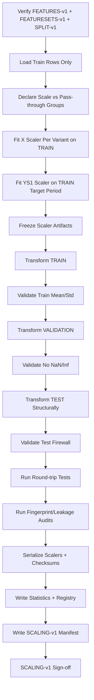
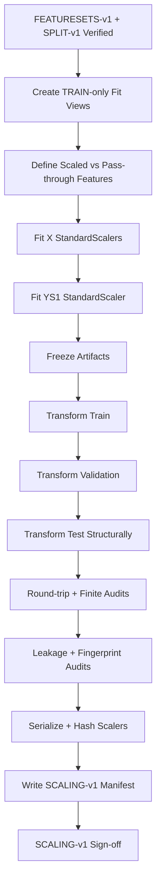

<div align="center">

# PHASE 9 — TRAIN-ONLY SCALING

## Kế hoạch chuẩn hóa đặc trưng và target chỉ bằng thống kê của Train

### Transformer Encoder cho hồi quy chuỗi thời gian đa biến trên UCI Appliances Energy Prediction

**Phase kế tiếp sau `Phase_8_Chronological_split.md`**

</div>

---

# 1. Vai trò của Phase 9

Phase 9 chịu trách nhiệm xây dựng **preprocessing scaling protocol không rò rỉ dữ liệu tương lai**, sử dụng duy nhất thống kê được học từ `TRAIN` trong `SPLIT-v1`.

Nếu:

```text
Phase 7
→ khóa FEATURESETS-v1

Phase 8
→ khóa SPLIT-v1
```

thì:

```text
Phase 9
→ khóa SCALING-v1
```

Phase này phải trả lời:

```text
Những feature nào cần StandardScaler?

Những feature nào đã bounded nên được pass-through?

Scaler được fit trên những rows nào?

Validation/Test được transform như thế nào?

Historical Appliances trong FS1/FS2 được scale ra sao?

Target YS0/YS1 được tổ chức thế nào?

Làm sao inverse-transform prediction về Wh?

Scaler được bind với feature order/fingerprint thế nào?

Làm sao chứng minh scaler không nhìn Validation/Test?

Làm sao phát hiện feature có zero variance chỉ trong Train?

Làm sao tránh nhầm scaler giữa FS0/FS1/FS2?

Output nào phải được bàn giao cho Phase 10?
```

Nguyên tắc cốt lõi:

\[
\boxed{
Fit\ on\ Train
\rightarrow
Freeze
\rightarrow
Transform\ Validation/Test
\rightarrow
Never\ Refit
}
\]

---

# 2. Vì sao Train-only scaling là bắt buộc?

Với StandardScaler:

\[
z
=
\frac{x-\mu}{\sigma}
\]

Nếu:

\[
\mu,\sigma
\]

được tính từ:

```text
Train + Validation + Test
```

thì preprocessing đã biết trước:

```text
future feature distribution
```

trước khi model được huấn luyện.

Đây là:

```text
data leakage
```

dù target không trực tiếp được sử dụng.

Do đó:

\[
\boxed{
\mu,\sigma
\text{ phải được fit chỉ từ TRAIN}
}
\]

---

# 3. Cơ sở kỹ thuật của `StandardScaler`

Theo tài liệu chính thức scikit-learn, `StandardScaler`:

```text
tính mean và standard deviation cho từng feature từ dữ liệu được truyền vào `fit`;

lưu các statistics này;

sau đó dùng cùng statistics trong `transform` cho dữ liệu mới.
```

Công thức:

\[
z = \frac{x-u}{s}
\]

Trong đó:

```text
u = mean của training samples

s = standard deviation của training samples
```

Scikit-learn hiện sử dụng variance estimator tương đương:

```text
numpy.std(..., ddof=0)
```

và nếu một feature có zero variance thì scaler không thể đạt unit variance cho feature đó; scaling factor của feature được giữ ở `1`.

StandardScaler cũng nhạy với outliers.

Những đặc điểm này phải được ghi vào scaling manifest để interpretation nhất quán.

---

# 4. Mục tiêu cần đạt sau Phase 9

Sau Phase 9 phải có:

```text
1. Scaling policy rõ ràng.

2. Train-only fit mask.

3. X-scaler cho từng feature variant cần thiết.

4. Feature order binding.

5. Feature fingerprint binding.

6. Split fingerprint binding.

7. Continuous-feature scaling registry.

8. Pass-through feature registry.

9. Historical Appliances scaling policy.

10. rv1/rv2 scaling policy.

11. TF1 pass-through policy.

12. YS0 target option.

13. YS1 target scaler.

14. Target inverse-transform utility.

15. Train transformed-statistics audit.

16. Validation transform audit.

17. Structural Test transform audit.

18. Zero-variance Train feature audit.

19. No-new-NaN audit.

20. No-new-Inf audit.

21. Scaler serialization.

22. Scaler-statistics export.

23. Leakage audit.

24. Determinism/idempotency audit.

25. SCALING-v1 manifest.

26. Phase 9 sign-off.
```

---

# 5. Những việc Phase 9 không làm

Không:

```text
Không tạo sliding windows chính thức.

Không tạo DataLoader.

Không train LSTM.

Không train Transformer.

Không tune feature set.

Không tune lookback.

Không chọn YS0 hay YS1 winner.

Không xem Test metrics.

Không xem detailed Test target distribution.

Không fit scaler trên Validation.

Không fit scaler trên Test.

Không refit scaler riêng cho từng split.

Không RobustScaler.

Không MinMaxScaler.

Không PCA.

Không clipping z-score.

Không winsorization.

Không log-transform target.

Không RevIN.
```

Các nhiệm vụ khác thuộc phase sau.

---

# 6. Input contract

Phase 9 chỉ bắt đầu khi:

```text
Phase 7 = PASS
Phase 8 = PASS
```

và có:

```text
FEATURES-v1
FEATURESETS-v1
SPLIT-v1
```

Phải truy ngược được:

```text
ENV-v1
DATA-v1
SCHEMA-v1
TEMPORAL-v1
EDA-v1
```

---

# 7. Input integrity checks

Trước fit:

```text
FEATURES-v1 checksum phải khớp.

FEATURESETS-v1 fingerprint phải khớp.

SPLIT-v1 global fingerprint phải khớp.

Mỗi row phải có split_id.

Timestamp ordering phải giữ nguyên.

No unexpected NaN/Inf trong selected features.
```

Nếu mismatch:

```text
STOP
```

---

# 8. Output version

Gán:

```text
SCALING-v1
```

Lineage:

```text
DATA-v1
   ↓
SCHEMA-v1
   ↓
TEMPORAL-v1
   ↓
FEATURES-v1
   ↓
FEATURESETS-v1
   ↓
SPLIT-v1
   ↓
SCALING-v1
```

---

# 9. Hai loại scaling cần phân biệt

Phase 9 có:

## X scaling

Dành cho:

```text
model input features
```

## y scaling

Dành cho:

```text
forecast target Appliances
```

Hai loại phải:

```text
tách artifact

tách registry

tách inverse-transform logic
```

Không dùng một scaler object chung cho cả X và y.

---

# 10. X-scaling là fixed preprocessing protocol

Trong coursework hiện tại:

```text
X scaling không phải hyperparameter sweep.
```

Baseline protocol:

```text
raw dynamic continuous channels
→ StandardScaler fit Train-only
```

Không thử:

```text
X unscaled vs X scaled
```

trừ khi sau này có protocol amendment.

---

# 11. y-scaling là experimental option

Phase 0 đã khóa:

```text
YS0 = target không scale

YS1 = target StandardScaler Train-only
```

Phase 9 phải chuẩn bị cả hai.

Winner chỉ được chọn ở:

```text
Phase 25 — S3 Target-scaling sweep
```

---

# 12. Scaling-group taxonomy

Phase 9 chia columns thành:

## SG0 — SCALE_CONTINUOUS

```text
raw continuous/exogenous features
historical Appliances nếu có
rv1
rv2
```

## SG1 — PASSTHROUGH_CYCLICAL

```text
hour_sin
hour_cos
dow_sin
dow_cos
```

## SG2 — PASSTHROUGH_BINARY

```text
weekend
```

## SG3 — METADATA_ONLY

```text
raw_row_index
date
timestamp
continuity_segment_id
split_id
split_position
```

SG3 không vào scaler và không vào model.

---

# 13. Vì sao không StandardScaler TF1 cyclical features?

Các feature:

```text
hour_sin
hour_cos
dow_sin
dow_cos
```

đã có range:

\[
[-1,1]
\]

và encode một hình học vòng tròn.

Nếu StandardScaler từng chiều riêng:

```text
mean-center + variance scaling
```

thì hình học unit circle có thể bị stretch theo từng trục.

Điều này không nhất thiết làm model sai, nhưng không cần thiết cho baseline.

Do đó policy chính:

```text
cyclical sin/cos
→ pass-through
```

---

# 14. Vì sao không scale `weekend`?

`weekend` đã là binary:

```text
0 / 1
```

và range nhỏ.

Baseline:

```text
pass-through
```

Lợi ích:

```text
giữ semantic rõ
không cần thêm statistics
```

---

# 15. Continuous-feature scaling policy

Các feature có physical/raw scale khác nhau:

```text
Wh
°C
%
mm Hg
m/s
km
random continuous values
```

được scale bằng:

```text
StandardScaler
```

fit trên Train.

---

# 16. `lights`

`lights` được xem là:

```text
continuous numeric energy feature
```

dù raw storage có thể integer-like.

Policy:

```text
StandardScaler
```

---

# 17. Temperature features

```text
T1...T9
T_out
```

Policy:

```text
StandardScaler
```

---

# 18. Humidity features

```text
RH_1...RH_9
RH_out
```

Policy:

```text
StandardScaler
```

---

# 19. Weather features

```text
Press_mm_hg
Windspeed
Visibility
Tdewpoint
```

Policy:

```text
StandardScaler
```

---

# 20. Historical `Appliances` input channel

Ở:

```text
FS1
FS2
```

historical `Appliances` là một input channel.

Do đó:

```text
X-side historical Appliances
→ StandardScaler
```

fit trên TRAIN rows.

---

# 21. X-side `Appliances` và y-scaler phải tách logic

Dù cùng raw variable:

```text
Appliances
```

hai semantics khác nhau.

## X-side

```text
historical input channel
```

## y-side

```text
forecast label
```

Do đó lưu:

```text
X scaler stats
```

riêng với:

```text
y scaler stats
```

Ngay cả khi mean/std có thể giống nhau trong một số configuration.

---

# 22. `rv1` và `rv2`

Trong:

```text
FS2
```

`rv1`/`rv2` là random-control channels.

Policy:

```text
StandardScaler
```

vì chúng là continuous numeric variables.

Việc scale không thay đổi vai trò:

```text
CONTROL_ONLY
```

---

# 23. Metadata columns

Không scale:

```text
raw_row_index
date
timestamp
continuity_segment_id
split_id
split_position
```

Không đưa chúng vào scaler input.

Hard assertion:

\[
ScaledColumns\cap MetadataColumns=\emptyset
\]

---

# 24. Canonical Train fit rows

X scaler được fit trên:

```text
rows có split_id = TRAIN
```

trong `SPLIT-v1`.

Không dùng:

```text
VALIDATION
TEST
```

trong `fit`.

---

# 25. Vì sao fit X scaler trên Train rows trước windowing?

Phase 9 đứng trước Phase 10.

Input scaler cần học:

```text
feature distributions của historical training period
```

Tất cả Train rows là information đã quan sát trong development history.

Điều này:

```text
không leakage
```

và cho phép cùng scaler tái sử dụng cho:

```text
L36
L72
L144
```

mà không thay statistics chỉ vì lookback.

---

# 26. Không fit X scaler trên training windows riêng cho từng lookback

Nếu mỗi lookback dùng statistics khác:

```text
L36 scaler
L72 scaler
L144 scaler
```

thì lookback sweep thay đồng thời:

```text
context length
+
preprocessing statistics
```

làm ablation kém sạch.

Do đó X-scaler fit scope:

```text
TRAIN rows
```

độc lập lookback.

---

# 27. y-scaler fit scope

YS1 được fit trên:

```text
Appliances values thuộc TRAIN target period
```

theo `SPLIT-v1`.

Không dùng:

```text
Validation target
Test target
```

---

# 28. Vì sao không fit y-scaler theo mỗi lookback?

Nếu y-scaler thay đổi với L36/L72/L144:

```text
lookback comparison
```

sẽ bị confound bởi:

```text
target normalization statistics khác nhau.
```

Do đó:

```text
YS1 scaler
```

được fit một lần trên TRAIN target period và dùng xuyên suốt.

---

# 29. Earliest rows không trở thành labels vẫn có thể nằm trong y fit?

Theo protocol chính:

```text
y-scaler dùng tất cả TRAIN target-period Appliances rows.
```

Điều này giữ target scaling:

```text
lookback-independent
```

và không sử dụng future data.

Đây là lựa chọn methodological đã được khóa để tăng consistency giữa lookback sweeps.

---

# 30. Nếu muốn fit y scaler chỉ trên actual training labels?

Có thể làm trong một study khác.

Nhưng sẽ phụ thuộc:

```text
lookback
continuity
window validity
```

và làm các sweep khó so sánh hơn.

Không dùng trong `SCALING-v1`.

---

# 31. Scaler granularity theo feature variant

Khuyến nghị tạo:

```text
một X scaler bundle cho mỗi full feature variant
```

Ví dụ:

```text
FS0_TF0
FS0_TF1
FS1_TF0
FS1_TF1
FS2_TF0
FS2_TF1
```

Mỗi bundle bind với:

```text
ordered feature list
feature fingerprint
scaled feature subset
pass-through feature subset
SPLIT-v1 fingerprint
```

---

# 32. Vì sao không dùng một global superset scaler rồi subset statistics thủ công?

Có thể về kỹ thuật.

Nhưng tăng nguy cơ:

```text
mapping sai feature
order mismatch
manual statistic slicing bug
```

Với chỉ sáu variants:

```text
per-variant scaler bundle
```

dễ audit hơn.

---

# 33. TF0/TF1 scaler relation

Ví dụ:

```text
FS1_TF0
FS1_TF1
```

có cùng continuous channels.

Do TF1 channels pass-through:

```text
continuous fitted statistics
```

sẽ giống nhau nếu cùng Train rows.

Tuy nhiên vẫn lưu hai bundle riêng:

```text
để fingerprint và full feature order không bị nhầm.
```

---

# 34. Scaler bundle ID

Canonical:

```text
XSCALER__FS0_TF0
XSCALER__FS0_TF1
XSCALER__FS1_TF0
XSCALER__FS1_TF1
XSCALER__FS2_TF0
XSCALER__FS2_TF1
```

Target:

```text
YSCALER__YS1
```

YS0:

```text
YSCALER__YS0_IDENTITY
```

---

# 35. StandardScaler parameters

Baseline:

```text
with_mean = True
with_std  = True
```

Không dùng:

```text
sample_weight
partial_fit
```

trong main coursework.

Dataset đủ nhỏ để:

```text
fit
```

một lần.

---

# 36. Không dùng `partial_fit`

`partial_fit` hữu ích cho streaming/large data.

Dataset hiện tại không cần.

Dùng full TRAIN rows giúp:

```text
protocol đơn giản
deterministic
audit dễ
```

---

# 37. Fit/transform pattern chuẩn

Đúng:

```python
scaler.fit(X_train_continuous)

X_train_scaled = scaler.transform(X_train_continuous)
X_val_scaled   = scaler.transform(X_val_continuous)
X_test_scaled  = scaler.transform(X_test_continuous)
```

Sai:

```python
scaler.fit_transform(X_train)
scaler.fit_transform(X_val)
scaler.fit_transform(X_test)
```

vì mỗi split học statistics riêng.

---

# 38. Validation/Test không bao giờ gọi `.fit()`

Hard rule:

```text
fit calls allowed
=
TRAIN only
```

Scaling audit phải ghi:

```text
fit_split = TRAIN
```

---

# 39. Transform full timeline bằng Train scaler có hợp lệ không?

Có.

Sau fit:

```text
transform
```

có thể được áp dụng cho:

```text
Train
Validation
Test
full chronological timeline
```

miễn là statistics đã được khóa từ Train.

Khuyến nghị Phase 9:

```text
validate split-wise
```

và Phase 10 có thể transform full timeline bằng cùng bundle để hỗ trợ WB0 context carry-over.

---

# 40. WB0 Context Carry-over và scaling

Validation window có thể gồm:

```text
một phần Train history
+
Validation target
```

Scaler vẫn:

```text
Train-fitted
```

Áp cùng transformation lên tất cả historical rows.

Không cần:

```text
validation scaler.
```

---

# 41. WB1 Strict Isolation và scaling

WB1 cũng sử dụng:

```text
cùng Train-fitted scaler.
```

Strict isolation chỉ thay:

```text
window context eligibility
```

không thay preprocessing statistics.

Điều này giữ Boundary sweep sạch.

---

# 42. Scaler feature order

StandardScaler statistics map theo column position.

Do đó scaler bundle phải lưu:

```text
fitted_scaled_feature_order
```

Ví dụ:

```text
["lights", "T1", "RH_1", ...]
```

Không chỉ lưu:

```text
mean_
scale_
```

---

# 43. Feature fingerprint binding

Mỗi X scaler phải bind:

```text
feature_set_version
variant_id
feature_fingerprint
```

Nếu fingerprint mismatch:

```text
không transform.
```

---

# 44. Split fingerprint binding

Mỗi scaler phải bind:

```text
split_version = SPLIT-v1
train_fingerprint
global_split_fingerprint
```

Nếu split thay:

```text
scaler không còn hợp lệ.
```

---

# 45. Environment binding

Scaler manifest lưu:

```text
environment_id = ENV-v1
sklearn_version
```

Dù scaler math ổn định, serialized estimator có thể phụ thuộc version.

---

# 46. Dataset binding

Scaler artifact phải truy ngược:

```text
DATA-v1
FEATURES-v1
```

và checksum.

---

# 47. Scaler-fit audit fields

Mỗi X scaler:

```text
variant_id
train_row_count
scaled_feature_count
pass_through_feature_count
feature_fingerprint
train_split_fingerprint
fit_start_timestamp
fit_end_timestamp
```

---

# 48. Export scaler statistics

Tạo long-format table:

```text
x_scaler_statistics.csv
```

Fields:

```text
variant_id
feature_position
feature_name
mean
variance
scale
n_samples_seen
zero_variance_flag
```

Pass-through features có thể:

```text
mean = null
scale = null
policy = PASSTHROUGH
```

---

# 49. Target scaler statistics

Tạo:

```text
y_scaler_statistics.csv
```

Fields:

```text
target
option
mean
variance
scale
n_samples_seen
fit_split
```

YS0:

```text
identity
```

có thể không có fitted mean/std.

---

# 50. Zero-variance audit

Một feature có thể:

```text
không constant toàn dataset
```

nhưng:

```text
constant trong TRAIN
```

Do đó Phase 9 phải audit lại variance trên Train.

Nếu:

\[
Var_{train}(X_j)=0
\]

gắn:

```text
TRAIN_ZERO_VARIANCE
```

---

# 51. Zero variance không được drop tự động

Scikit-learn có thể để feature unchanged với:

```text
scale = 1
```

khi variance bằng 0.

Nhưng methodological issue vẫn cần report:

> Model chưa từng thấy variation của feature trong Train nhưng có thể thấy variation trong Validation/Test.

Do đó:

```text
PASS_WITH_WARNING
```

hoặc investigation.

Không tự drop feature vì Phase 7 đã khóa variant.

---

# 52. Near-zero variance

Có thể tính:

```text
train_std
```

và flag descriptive nếu rất nhỏ.

Không cần heuristic threshold tự động drop.

---

# 53. Train transformed mean audit

Với scaled continuous Train features:

Expected:

\[
mean(z_{train})\approx0
\]

Floating-point tolerance phù hợp.

Không yêu cầu:

```text
exact 0.
```

---

# 54. Train transformed variance audit

Expected:

\[
std(z_{train},ddof=0)\approx1
\]

ngoại trừ:

```text
zero-variance features.
```

---

# 55. Validation transformed statistics

Validation sau transform:

```text
không cần mean = 0
không cần std = 1
```

Nếu khác Train:

```text
đây có thể là distribution shift
```

không phải scaler bug.

---

# 56. Test transformed statistics

Để giữ Test firewall:

Phase 9 chỉ kiểm tra Test:

```text
shape
finite
feature order
transform success
```

Không phân tích chi tiết:

```text
Test mean z-score
Test max z-score
Test quantile drift
```

để thay preprocessing/model.

Detailed Test analysis defer:

```text
Phase 47+
```

---

# 57. No-new-NaN audit

Sau transform:

```text
Train
Validation
Test
```

không được xuất hiện NaN mới.

Nếu có:

```text
SCALING_NEW_NAN
```

Phase 9 FAIL.

---

# 58. No-new-Inf audit

Không:

```text
+Inf
-Inf
```

sau transform.

Nếu có:

```text
FAIL.
```

---

# 59. StandardScaler và outliers

StandardScaler nhạy với outliers.

Điều này có nghĩa:

```text
energy spikes hoặc extreme feature values
có thể ảnh hưởng mean/std.
```

Tuy nhiên master protocol đã khóa:

```text
StandardScaler baseline
```

Do đó Phase 9 không tự chuyển sang:

```text
RobustScaler
```

dựa trên cảm giác.

---

# 60. Không clip z-scores

Không:

```text
clip to [-3,3]
clip to [-5,5]
```

trong baseline.

Clipping:

```text
thay đổi distribution
```

và có thể xóa legitimate extremes.

Nếu model khó ở spikes:

```text
Phase 37 MSE vs Huber
Phase 50 error-regime analysis
```

sẽ xử lý bằng experiment/diagnostics.

---

# 61. Không dùng Validation/Test để điều chỉnh scaling range

Không:

```text
Validation có z-score 8
→ refit scaler trên Train+Validation
```

Đây là leakage.

Validation extreme z-score là:

```text
distribution-shift evidence.
```

---

# 62. X-scaling và time features

Sau transform, full ordered vector vẫn giữ:

```text
same feature order
```

Ví dụ:

```text
scaled continuous channels
+
pass-through time channels
```

phải được assemble lại theo:

```text
FEATURESETS-v1 order
```

Không group scaled columns lên đầu nếu registry order khác.

---

# 63. Order-preserving transform

Khuyến nghị transform function:

```text
1. Copy selected variant DataFrame.
2. Scale only SCALE_CONTINUOUS columns.
3. Leave pass-through columns unchanged.
4. Reindex exactly by ordered variant feature list.
5. Validate fingerprint.
```

Không dựa vào ColumnTransformer output order nếu không audit.

---

# 64. Vì sao không ưu tiên `ColumnTransformer` ở baseline?

`ColumnTransformer` hoàn toàn có thể dùng.

Nhưng custom transparent transform với DataFrame:

```text
dễ giữ original feature order
dễ audit mapping
dễ export statistics
```

Với dataset nhỏ và ít preprocessing steps:

```text
explicit DataFrame transform
```

được ưu tiên cho coursework.

---

# 65. Scaler object serialization

Có thể dùng:

```text
joblib.dump
```

vì joblib đã là dependency của scikit-learn ecosystem.

Lưu:

```text
scalers/x/
scalers/y/
```

---

# 66. Serialized estimator security note

Không load:

```text
joblib/pickle scaler từ nguồn không tin cậy.
```

Artifacts của coursework được tạo local và có checksum.

---

# 67. Scaler checksum

Mỗi serialized scaler artifact nên có:

```text
SHA-256
```

để phát hiện corruption/version drift.

---

# 68. Scaler registry

Tạo:

```text
scaler_registry.json
```

Gồm:

```text
bundle_id
variant_id
feature_fingerprint
split_fingerprint
scaled_features
pass_through_features
artifact_path
artifact_sha256
fit_row_count
status
```

---

# 69. X scaler không bao gồm target y

Đối với:

```text
FS0
```

`Appliances` không nằm trong X scaler.

Đối với:

```text
FS1/FS2
```

historical `Appliances` nằm trong X scaler.

Nhưng future label y không bao giờ được truyền vào X-scaler fit matrix như một separate future column.

---

# 70. YS0 contract

YS0:

```text
y model target
=
raw Appliances Wh
```

Training loss nhận:

```text
raw Wh scale
```

Phase 25 sẽ so với YS1.

---

# 71. YS1 contract

YS1:

\[
y'=\frac{y-\mu_{train,y}}{\sigma_{train,y}}
\]

Model dự đoán:

```text
scaled target
```

Evaluation:

```text
inverse-transform
→ Wh
```

---

# 72. Target inverse transformation

Prediction scaled:

\[
\hat{y}'
\]

Inverse:

\[
\hat{y}
=
\hat{y}'\sigma_y+\mu_y
\]

Final metrics:

```text
MAE
RMSE
R²
```

phải tính trên:

```text
original Wh
```

---

# 73. Không clamp inverse-transformed prediction về >= 0 mặc định

Mô hình regression có thể tạm dự đoán:

```text
negative value
```

Không tự:

```text
max(pred, 0)
```

trước metric nếu protocol chưa khóa.

Lý do:

```text
clamping thay đổi model output và metrics.
```

Nếu cần physical post-processing:

```text
phải là explicit experiment.
```

---

# 74. Target-scaler inverse round-trip test

Test synthetic/train values:

```text
y
→ transform
→ inverse_transform
```

Expected:

\[
y_{recovered}\approx y
\]

trong tolerance.

Hard sanity check.

---

# 75. X scaler round-trip test

Selected Train values:

```text
x
→ transform
→ inverse_transform
```

cho continuous subset.

Expected:

```text
recovered ≈ original
```

Pass-through columns không cần inverse scaler.

---

# 76. YS0 identity test

YS0:

```text
transform(y) = y
inverse(y)   = y
```

Utility nên có cùng API với YS1 để training code đơn giản.

---

# 77. Unified target-transform interface

Khuyến nghị:

```text
transform_target(y, option)
inverse_transform_target(y, option)
```

YS0:

```text
identity
```

YS1:

```text
fitted scaler
```

---

# 78. HuberLoss interaction

Phase 37 sẽ thử:

```text
Huber
```

Primary Huber experiment đã được contract:

```text
YS1
delta=1.0
```

Phase 9 phải bảo đảm YS1 scaler artifact ổn định để `delta=1` có standardized-scale interpretation.

---

# 79. Learning-rate interaction

Target scaling có thể thay:

```text
loss magnitude
gradient magnitude
```

Phase 25 sẽ đánh giá controlled YS0 vs YS1.

Phase 9 không tune LR theo target option.

---

# 80. X scaler reuse across LSTM và Transformer

Cùng:

```text
feature variant
split
```

thì LSTM và Transformer phải dùng:

```text
cùng X scaler artifact.
```

Không fit riêng per model.

---

# 81. Y scaler reuse across LSTM và Transformer

YS1 cũng phải dùng:

```text
cùng y scaler
```

cho cả hai model.

Điều này bảo đảm fairness.

---

# 82. X scaler reuse across seeds

Seeds:

```text
42
123
2026
```

dùng cùng scaler.

Scaling deterministic và không seed-dependent.

---

# 83. X scaler reuse across batch sizes

Batch sweep không refit scaler.

---

# 84. X scaler reuse across learning rates

LR sweep không refit scaler.

---

# 85. X scaler reuse across dropout

Dropout sweep không refit scaler.

---

# 86. Lookback sweep reuse

L36/L72/L144 sử dụng:

```text
cùng scaler cho cùng variant.
```

Đây là một design decision quan trọng để isolate lookback effect.

---

# 87. Feature-set sweep scalers

FS0/FS1/FS2 có feature dimensions khác nhau.

Do đó dùng:

```text
variant-specific scaler bundles.
```

Không reuse FS1 scaler object trực tiếp cho FS0 matrix.

---

# 88. Time-feature sweep scalers

TF0/TF1 bundle khác full feature fingerprint.

Dù continuous scaler stats có thể giống:

```text
bundle vẫn riêng.
```

---

# 89. Scaling pipeline không được thay đổi sample membership

Phase 9 transform phải bảo toàn:

```text
row count
timestamp
split_id
continuity_segment_id
```

---

# 90. Row-count invariant

\[
N_{before}=N_{after}
\]

cho mọi transformed view.

---

# 91. Timestamp invariant

```text
timestamps identical
same order
```

---

# 92. Split-membership invariant

```text
TRAIN remains TRAIN
VALIDATION remains VALIDATION
TEST remains TEST
```

Scaling không được merge/shuffle rows.

---

# 93. Continuity invariant

```text
continuity_segment_id
```

không thay.

---

# 94. Feature-name invariant

Transform output vẫn map 1:1 với:

```text
FEATURESETS-v1 ordered features.
```

---

# 95. Feature-count invariant

\[
F_{scaled}=F_{variant}
\]

Không được:

```text
drop constant columns automatically.
```

---

# 96. Dtype contract

Sau transform, model matrix có thể được chuẩn bị là:

```text
float32
```

Nhưng Phase 9 artifact có thể giữ:

```text
float64 DataFrame/NumPy
```

nếu cần precision.

Canonical tensor cast vẫn thuộc:

```text
Phase 10/11
```

Khuyến nghị transform utility hỗ trợ:

```text
output float32
```

khi materialize model arrays.

---

# 97. No in-place mutation of FEATURES-v1

Không:

```python
df[features] = scaler.transform(...)
```

trên master DataFrame source of truth.

Tạo:

```text
derived transformed view
```

hoặc transform on-the-fly.

---

# 98. Có nên lưu full scaled CSV?

Khuyến nghị:

```text
không bắt buộc.
```

Lý do:

```text
6 feature variants
×
YS options
```

có thể tạo nhiều redundant files.

Source of truth nên là:

```text
FEATURES-v1
+
SCALING-v1 scaler artifacts
+
transform function
```

---

# 99. Nếu muốn cache scaled matrices

Chỉ làm optional.

Cache phải bind:

```text
variant_id
split_version
scaling_version
feature_fingerprint
```

Không xem cache là source of truth.

---

# 100. Scaling function contract

Khuyến nghị:

```python
transform_features(
    df,
    variant_id,
    scaler_bundle,
) -> DataFrame
```

Yêu cầu:

```text
no fit
preserve row order
preserve feature order
return only model feature columns hoặc explicit metadata separately
```

---

# 101. Fit function contract

```python
fit_feature_scaler(
    train_df,
    variant_id,
    feature_registry,
) -> ScalerBundle
```

Hard check:

```text
all passed rows split_id = TRAIN
```

Nếu không:

```text
raise error.
```

---

# 102. Train-only fit guard

Fit function nên nhận:

```text
train_df
```

không full DataFrame + mask nếu có thể.

Lý do:

```text
giảm chance vô tình fit future rows.
```

---

# 103. Secondary fit guard

Vẫn audit:

```text
min timestamp
max timestamp
split labels
row count
```

của fit data.

---

# 104. Fit provenance

Lưu:

```text
fit_timestamp_start
fit_timestamp_end
fit_row_count
fit_split_id
```

---

# 105. Scaler statistics fingerprint

Ngoài serialized artifact checksum, có thể hash:

```text
feature names
mean_
var_
scale_
```

thành:

```text
statistics_fingerprint
```

Giúp detect accidental refit.

---

# 106. Determinism

Scaling hoàn toàn deterministic.

Run lại:

```text
same Train data
same feature order
same sklearn version
```

phải tạo:

```text
same statistics
```

trong numeric tolerance.

---

# 107. Scaler idempotency

Nếu scaler artifact tồn tại:

```text
recompute statistics
compare fingerprint
```

Nếu giống:

```text
reuse.
```

Nếu khác:

```text
STOP
```

không overwrite âm thầm.

---

# 108. Scaling version revision

Nếu đổi policy, ví dụ:

```text
bắt đầu scale time features
```

phải tạo:

```text
SCALING-v2
```

Không sửa `SCALING-v1`.

---

# 109. Policy amendment examples

Những thay đổi yêu cầu version mới:

```text
StandardScaler → RobustScaler

pass-through cyclical → scaled cyclical

weekend pass-through → standardized

X scaler fit scope thay đổi

y scaler fit scope thay đổi

feature set thay đổi

split thay đổi
```

---

# 110. Feature-statistics inspection

Được phép inspect:

```text
Train mean/std

Validation transformed mean/std
```

để diagnose distribution shift.

Không được:

```text
dùng Validation mean/std để refit scaler.
```

---

# 111. Validation distribution shift table

Optional nhưng hữu ích:

```text
train_validation_scaled_feature_summary.csv
```

Fields:

```text
variant_id
feature_name
train_scaled_mean
train_scaled_std
validation_scaled_mean
validation_scaled_std
mean_shift
std_ratio
```

Không Test.

---

# 112. Không dùng Validation shift để đổi split

Chỉ:

```text
diagnostic
```

Nếu shift lớn:

```text
Phase 22 overfitting diagnostics
Phase 40 RevIN
```

mới xử lý bằng planned experiments.

---

# 113. Test structural transform audit

Được phép:

```text
transform Test

check:
shape
finite values
feature order
dtype
```

Không export:

```text
test mean/std
test extreme z-score ranking
```

trước Phase 47.

---

# 114. Test firewall manifest field

```text
test_distribution_inspection
=
STRUCTURAL_ONLY
```

---

# 115. Scaling leakage audit

Tạo:

```text
scaling_leakage_audit.csv
```

Checks:

```text
x_fit_uses_train_only
y_fit_uses_train_only
no_validation_in_fit
no_test_in_fit
feature_order_matches_registry
split_fingerprint_matches
no_metadata_in_scaler
no_future_target_in_x_fit
no_test_distribution_tuning
status
```

---

# 116. Scaling audit

Tạo:

```text
scaling_audit.csv
```

Checks:

```text
bundle_id
variant_id
train_row_count
scaled_feature_count
pass_through_count
train_scaled_mean_ok
train_scaled_std_ok
zero_variance_count
validation_transform_ok
test_structural_transform_ok
no_new_nan
no_new_inf
roundtrip_ok
status
```

---

# 117. X scaler statistics artifact

```text
x_scaler_statistics.csv
```

---

# 118. y scaler statistics artifact

```text
y_scaler_statistics.csv
```

---

# 119. Scaler registry artifact

```text
scaler_registry.json
```

---

# 120. Scaling manifest

```text
scaling_manifest.json
```

---

# 121. Discrepancy log

```text
scaling_discrepancies.json
```

Categories:

```text
FIT_SPLIT_VIOLATION
FEATURE_FINGERPRINT_MISMATCH
SPLIT_FINGERPRINT_MISMATCH
FEATURE_ORDER_MISMATCH
ZERO_VARIANCE
NEW_NAN
NEW_INF
ROUNDTRIP_FAILURE
SERIALIZATION_FAILURE
TARGET_SCALER_FAILURE
TEST_FIREWALL_VIOLATION
OTHER
```

---

# 122. Status model

## PASS

```text
All scalers Train-only.
No leakage.
All audits valid.
```

## PASS_WITH_WARNING

Ví dụ:

```text
Train zero-variance feature
nhưng StandardScaler behavior được document
và variant vẫn giữ nguyên.
```

## FAIL

Ví dụ:

```text
Validation/Test xuất hiện trong fit.
Feature fingerprint mismatch.
NaN/Inf sau scaling.
Inverse transform sai.
```

---

# 123. X-scaler serialized directory

Khuyến nghị:

```text
artifacts/
└── scalers/
    ├── x/
    │   ├── XSCALER__FS0_TF0.joblib
    │   ├── XSCALER__FS0_TF1.joblib
    │   ├── XSCALER__FS1_TF0.joblib
    │   ├── XSCALER__FS1_TF1.joblib
    │   ├── XSCALER__FS2_TF0.joblib
    │   └── XSCALER__FS2_TF1.joblib
    │
    └── y/
        └── YSCALER__YS1.joblib
```

YS0 không cần estimator serialized nếu identity utility rõ.

---

# 124. Scaling artifacts directory

```text
artifacts/
└── scaling/
    ├── scaling_manifest.json
    ├── scaler_registry.json
    ├── x_scaler_statistics.csv
    ├── y_scaler_statistics.csv
    ├── scaling_audit.csv
    ├── scaling_leakage_audit.csv
    ├── scaling_discrepancies.json
    ├── scaler_checksums.sha256
    └── phase_9_signoff.json
```

---

# 125. Scaler checksums

```text
scaler_checksums.sha256
```

ghi:

```text
SHA-256 của từng .joblib
```

---

# 126. Scaling manifest field contract

Tối thiểu:

```text
scaling_version = SCALING-v1
dataset_revision = DATA-v1
feature_version = FEATURES-v1
feature_set_version = FEATURESETS-v1
split_version = SPLIT-v1
environment_id = ENV-v1
sklearn_version

x_scaling_method = StandardScaler
x_fit_split = TRAIN
x_scaled_groups
x_pass_through_groups

target_options = [YS0, YS1]
y_scaling_method_YS1 = StandardScaler
y_fit_split = TRAIN

variant_scaler_bundles
train_fingerprint
global_split_fingerprint

zero_variance_features
leakage_audit_passed
test_distribution_inspection

audit_status
warnings
created_at
```

---

# 127. Scaler bundle manifest fields

Mỗi bundle:

```text
bundle_id
variant_id
feature_fingerprint
feature_count
scaled_feature_order
pass_through_feature_order
full_feature_order
train_row_count
fit_start_timestamp
fit_end_timestamp
mean
variance
scale
artifact_path
artifact_sha256
statistics_fingerprint
status
```

---

# 128. Target scaler manifest fields

```text
target = Appliances
option = YS1
fit_split = TRAIN
fit_row_count
fit_start_timestamp
fit_end_timestamp
mean
variance
scale
artifact_path
artifact_sha256
roundtrip_status
```

---

# 129. Train transformed summary

Sau scaling continuous features:

```text
mean approximately 0
std approximately 1
```

cho non-zero-variance features.

Export không cần full rows.

---

# 130. Numeric tolerance

Khuyến nghị:

```text
mean tolerance ~ 1e-6 đến 1e-5
std tolerance ~ 1e-6 đến 1e-5
```

tùy dtype.

Không dùng:

```text
exact equality.
```

---

# 131. Pass-through feature audit

TF1 features phải giữ:

```text
exact values
```

trước và sau transform.

Hard check:

```text
hour_sin unchanged
hour_cos unchanged
dow_sin unchanged
dow_cos unchanged
weekend unchanged
```

---

# 132. Pass-through equality tolerance

Sin/cos:

```text
numeric allclose
```

Weekend:

```text
exact equality
```

---

# 133. X inverse-transform utility

Có thể xây:

```text
inverse_transform_continuous_features
```

cho debugging.

Không cần trong inference chính, nhưng hữu ích để:

```text
round-trip sanity.
```

---

# 134. y inverse transform là bắt buộc

Vì Phase 47 metrics phải về:

```text
Wh.
```

---

# 135. Metric-computation contract

Nếu YS1:

```text
model output scaled
→ inverse transform
→ MAE/RMSE/R²
```

Nếu YS0:

```text
model output raw Wh
→ direct metrics
```

Shared metrics Phase 12 phải tuân thủ.

---

# 136. No metric computation trong Phase 9

Phase 9 chỉ chuẩn bị transform.

Không tính:

```text
model metrics.
```

---

# 137. Scaler and persistence baseline

Persistence:

\[
\hat y_{t+1}=y_t
\]

nên final metric vẫn ở:

```text
Wh.
```

Không cần dùng neural target scaler để tính Persistence metric.

Nếu pipeline thống nhất, có thể transform/inverse-transform để test utility nhưng không cần.

---

# 138. Scaler and LSTM

LSTM nhận:

```text
scaled X
```

và:

```text
YS0 hoặc YS1 target
```

theo experiment.

---

# 139. Scaler and Transformer

Transformer nhận cùng:

```text
scaled X
```

với LSTM cho fairness.

---

# 140. Scaler and RevIN

Phase 40 RevIN:

```text
không thay Train-only preprocessing protocol một cách âm thầm.
```

RevIN là model-side normalization experiment.

Feature registry phải giúp xác định:

```text
dynamic continuous channels
```

và bỏ qua:

```text
cyclical time features
weekend
metadata
```

---

# 141. RevIN không thay thế SCALING-v1

Baseline pipeline:

```text
Train-only scaling
+
optional model-side RevIN
```

theo design Phase 40.

Nếu Phase 40 quyết định khác:

```text
phải document rõ.
```

---

# 142. Potential concern: double normalization

Khi thử RevIN, cần nhận thức:

```text
StandardScaler
+
RevIN
```

là hai lớp normalization khác mục đích.

Phase 40 phải làm ablation đúng contract.

Phase 9 không thay đổi vì điều này.

---

# 143. StandardScaler và binary feature

Nếu sau này một reviewer hỏi:

> Tại sao không scale weekend?

Giải thích:

```text
weekend đã bounded [0,1];
baseline giữ binary semantics;
continuous channels được standardized;
time encoding vẫn pass-through.
```

Đây là design choice, không universal rule.

---

# 144. StandardScaler và cyclical geometry

Sin/cos pair encode:

\[
(\sin\theta,\cos\theta)
\]

trên unit circle.

Pass-through giữ:

\[
\sin^2\theta+\cos^2\theta=1
\]

sau Phase 9.

Đây là một invariant hữu ích.

---

# 145. Post-scaling cyclic invariant

Kiểm tra lại:

\[
hour_{\sin}^2+hour_{\cos}^2\approx1
\]

\[
dow_{\sin}^2+dow_{\cos}^2\approx1
\]

Nếu không:

```text
pass-through policy đã bị vi phạm.
```

---

# 146. Scaling statistical summary không phải EDA mới

Không mở rộng Phase 9 thành EDA.

Chỉ kiểm tra:

```text
fit correctness
transform correctness
shift diagnostic tối thiểu.
```

---

# 147. Outlier-induced extreme standardized values

Nếu Validation có large z-score:

```text
không clip
không refit
```

Ghi:

```text
distribution shift candidate
```

cho Phase 22/40.

---

# 148. No Test-informed outlier policy

Không:

```text
xem Test max z-score
→ rồi thêm clipping.
```

Đây là Test leakage.

---

# 149. Memory strategy

Dataset nhỏ.

Không cần:

```text
streaming scaler
batch-wise fit
partial_fit
```

---

# 150. Scaling pure-function design

Khuyến nghị objects/functions:

```text
build_scaling_policy()

get_scaled_feature_columns()

fit_x_scaler_bundle()

fit_y_scaler()

transform_feature_variant()

transform_target()

inverse_transform_target()

validate_scaler_bundle()

compute_scaler_statistics_fingerprint()

serialize_scaler_bundle()

write_scaling_manifest()
```

---

# 151. ScalerBundle abstraction

Có thể dùng dataclass conceptual:

```text
bundle_id
variant_id
full_feature_order
scaled_feature_order
pass_through_feature_order
feature_fingerprint
split_fingerprint
scaler
```

Giúp Phase 10 dùng đúng mapping.

---

# 152. `transform_feature_variant` contract

Input:

```text
DataFrame
ScalerBundle
```

Checks:

```text
required columns exist
feature fingerprint matches
no duplicate columns
```

Output:

```text
ordered model feature DataFrame
```

---

# 153. `fit_x_scaler_bundle` hard guard

Nếu input có bất kỳ:

```text
split_id != TRAIN
```

thì:

```text
raise ValueError.
```

Đây là anti-leakage guard.

---

# 154. `fit_y_scaler` hard guard

Tương tự:

```text
TRAIN target period only.
```

---

# 155. Unit tests cho anti-leakage

Synthetic test:

```text
pass Train + one Validation row
```

Expected:

```text
fit function raises.
```

---

# 156. Unit test feature-order mismatch

Load scaler FS1_TF1 nhưng pass:

```text
features reversed
```

Expected:

```text
error trước transform.
```

---

# 157. Unit test wrong variant

Load:

```text
XSCALER__FS1_TF1
```

cho:

```text
FS0_TF1
```

Expected:

```text
fingerprint mismatch
→ error.
```

---

# 158. Unit test split mismatch

Nếu scaler bind:

```text
SPLIT-v1
```

nhưng active split:

```text
SPLIT-v2
```

Expected:

```text
error.
```

---

# 159. Unit test target round-trip

YS1:

```text
y → scaled → inverse
```

Expected:

```text
allclose.
```

---

# 160. Unit test cyclical pass-through

Before/after:

```text
hour_sin identical
...
```

---

# 161. Unit test zero variance

Synthetic Train feature:

```text
[5,5,5,5]
```

Expected:

```text
zero_variance_flag=True
scale=1
no NaN
```

và audit warning.

---

# 162. Notebook structure Phase 9

Khuyến nghị:

```text
18–22 cells
```

## Cell 9.1 — Phase title

## Cell 9.2 — Verify FEATURES/FEATURESETS/SPLIT

## Cell 9.3 — Declare scaling policy

## Cell 9.4 — Declare scaling groups

## Cell 9.5 — Build Train-only fit views

## Cell 9.6 — Fit X scalers

## Cell 9.7 — Fit YS1 scaler

## Cell 9.8 — Define YS0 identity transform

## Cell 9.9 — Train transform audit

## Cell 9.10 — Validation transform audit

## Cell 9.11 — Test structural transform audit

## Cell 9.12 — Zero-variance audit

## Cell 9.13 — Pass-through invariants

## Cell 9.14 — X round-trip test

## Cell 9.15 — y round-trip test

## Cell 9.16 — Leakage tests

## Cell 9.17 — Feature fingerprint checks

## Cell 9.18 — Serialize scalers

## Cell 9.19 — Save scaler statistics

## Cell 9.20 — Save registry/manifest

## Cell 9.21 — Discrepancy report

## Cell 9.22 — Phase sign-off

---

# 163. Quy trình thực thi Phase 9



---

# 164. Thứ tự follow chuẩn

```text
Verify lineage
→ Build Train-only views
→ Fit
→ Freeze
→ Transform
→ Audit
→ Serialize
→ Manifest
→ Sign-off
```

Không:

```text
transform full data bằng temporary scaler
→ rồi mới fit lại Train.
```

---

# 165. Feature-variant processing loop

Khuyến nghị:

```text
for variant_id in FEATURESETS-v1:
    load ordered features
    identify scale subset
    identify passthrough subset
    fit Train-only scaler
    validate
    serialize
```

---

# 166. Không chọn chỉ baseline scaler

Dù B0 dùng:

```text
FS1_TF1
```

Phase 9 nên chuẩn bị đầy đủ scaler bundles cho sáu variants.

Lý do:

```text
Phase 23–24 cần tất cả.
```

---

# 167. Target scaler chỉ cần một YS1 artifact

Vì target:

```text
Appliances
```

và split:

```text
SPLIT-v1
```

không đổi theo feature variant.

---

# 168. No target scaler per feature set

Không tạo:

```text
YSCALER_FS0
YSCALER_FS1
YSCALER_FS2
```

vì dư thừa và có nguy cơ statistics drift.

---

# 169. No target scaler per model

Không:

```text
YSCALER_LSTM
YSCALER_TRANSFORMER
```

Fairness yêu cầu dùng cùng scaler.

---

# 170. Scaler artifact naming

```text
XSCALER__FS0_TF0__SCALING-v1.joblib
...
YSCALER__YS1__SCALING-v1.joblib
```

---

# 171. Checksum naming

```text
scaler_checksums.sha256
```

---

# 172. Human-readable scaling README

Khuyến nghị tạo:

```text
README_SCALING.md
```

Giải thích:

```text
Train-only fit
StandardScaler
scaled groups
pass-through groups
YS0/YS1
inverse transform
Test firewall
```

---

# 173. Output O9.1 — X scalers

```text
6 X scaler bundles
```

---

# 174. Output O9.2 — YS1 scaler

```text
1 target scaler
```

---

# 175. Output O9.3 — YS0 identity policy

Machine-readable config.

---

# 176. Output O9.4 — Scaler registry

```text
scaler_registry.json
```

---

# 177. Output O9.5 — X statistics

```text
x_scaler_statistics.csv
```

---

# 178. Output O9.6 — y statistics

```text
y_scaler_statistics.csv
```

---

# 179. Output O9.7 — Scaling audit

```text
scaling_audit.csv
```

---

# 180. Output O9.8 — Leakage audit

```text
scaling_leakage_audit.csv
```

---

# 181. Output O9.9 — Scaler checksums

```text
scaler_checksums.sha256
```

---

# 182. Output O9.10 — Manifest

```text
scaling_manifest.json
```

---

# 183. Output O9.11 — Discrepancy log

```text
scaling_discrepancies.json
```

---

# 184. Output O9.12 — README

```text
README_SCALING.md
```

---

# 185. Output O9.13 — Sign-off

```text
phase_9_signoff.json
```

---

# 186. Phase 9 sanity checklist

```text
[ ] Phase 7 PASS.

[ ] Phase 8 PASS.

[ ] FEATURES-v1 checksum verified.

[ ] FEATURESETS-v1 loaded.

[ ] SPLIT-v1 fingerprint verified.

[ ] Train-only fit rows created.

[ ] No Validation row in fit.

[ ] No Test row in fit.

[ ] SCALE_CONTINUOUS registry created.

[ ] PASSTHROUGH_CYCLICAL registry created.

[ ] PASSTHROUGH_BINARY registry created.

[ ] Metadata excluded.

[ ] FS0_TF0 X scaler fit.

[ ] FS0_TF1 X scaler fit.

[ ] FS1_TF0 X scaler fit.

[ ] FS1_TF1 X scaler fit.

[ ] FS2_TF0 X scaler fit.

[ ] FS2_TF1 X scaler fit.

[ ] Historical Appliances scaled only for FS1/FS2.

[ ] rv1/rv2 scaled only for FS2.

[ ] TF1 cyclical features pass-through.

[ ] weekend pass-through.

[ ] YS0 identity defined.

[ ] YS1 scaler fit on TRAIN target period only.

[ ] X feature order bound to fingerprint.

[ ] X scaler bound to SPLIT-v1.

[ ] y scaler bound to SPLIT-v1.

[ ] Train scaled mean audit completed.

[ ] Train scaled std audit completed.

[ ] Zero-variance Train features audited.

[ ] Validation transform completed.

[ ] Validation not used for fit.

[ ] Test structural transform completed.

[ ] Detailed Test distribution not inspected.

[ ] No new NaN.

[ ] No new Inf.

[ ] X round-trip test pass.

[ ] y round-trip test pass.

[ ] YS0 identity test pass.

[ ] Cyclical pass-through invariant pass.

[ ] Weekend pass-through invariant pass.

[ ] Scalers serialized.

[ ] Scaler checksums created.

[ ] Scaler statistics exported.

[ ] Scaling leakage audit PASS.

[ ] Scaling manifest saved.

[ ] SCALING-v1 assigned.

[ ] Phase 9 sign-off completed.
```

---

# 187. Acceptance criteria

Phase 9 chỉ PASS khi:

```text
Tất cả fit statistics chỉ dùng TRAIN.

Validation/Test chỉ được transform.

Feature order khớp FEATURESETS-v1.

Scaler bind đúng split fingerprint.

No metadata leakage.

No future target leakage.

No new NaN/Inf.

Continuous Train features được standardized đúng.

TF1 pass-through features giữ nguyên.

YS0 và YS1 đều sẵn sàng.

YS1 inverse-transform hoạt động.

Scalers reproducible và serialized.

Phase 10 có thể tạo windows mà không cần refit preprocessing.
```

---

# 188. Khi nào Phase 9 FAIL?

```text
Scaler fit trên full data.

Scaler fit lại trên Validation.

Scaler fit lại trên Test.

Feature order mismatch.

Wrong variant scaler được dùng.

Split fingerprint mismatch.

Metadata column lọt vào scaler.

Target future lọt vào X fit.

NaN/Inf mới xuất hiện.

Target inverse transform sai.

Test distribution được dùng để thay scaling policy.

Scaler artifact không traceable về TRAIN.
```

---

# 189. Các lỗi thường gặp

## Lỗi 1 — `scaler.fit_transform(full_df)`

Leakage trực tiếp.

---

## Lỗi 2 — Fit riêng Train/Validation/Test

Làm mỗi split ở một coordinate system khác nhau.

---

## Lỗi 3 — Scale trước chronological split

Sai thứ tự pipeline.

---

## Lỗi 4 — Dùng scaler của FS1 cho FS0

Feature mapping sai.

---

## Lỗi 5 — Không lưu feature order

Scaler mean/std trở thành các vector không còn semantic traceability.

---

## Lỗi 6 — Scale `timestamp`

Không hợp lệ.

---

## Lỗi 7 — Scale `continuity_segment_id`

Metadata leakage/shortcut.

---

## Lỗi 8 — Drop feature có zero variance ở Train ngay lập tức

Làm thay FEATURESETS-v1.

Chỉ flag và xử lý bằng protocol nếu cần.

---

## Lỗi 9 — Thấy Validation z-score lớn rồi refit scaler

Leakage.

---

## Lỗi 10 — Scale sin/cos rồi quên unit-circle semantics

Plan hiện tại pass-through chúng.

---

## Lỗi 11 — Fit target scaler riêng theo lookback

Confound lookback sweep.

---

## Lỗi 12 — Tính final RMSE trên standardized target

Final report phải dùng Wh.

---

## Lỗi 13 — Clamp negative prediction trước inverse/report

Không có trong contract.

---

## Lỗi 14 — RobustScaler vì target có outlier

Không nằm trong current option set.

---

# 190. Handoff sang Phase 10

Phase 10 nhận:

```text
SCALING-v1
FEATURESETS-v1
SPLIT-v1
TEMPORAL-v1
```

và:

```text
X scaler bundles
YS0 identity
YS1 scaler
```

Phase 10 sẽ:

```text
transform selected variant
+
build sliding windows
+
assign samples theo target timestamp.
```

---

# 191. Handoff detail — feature variant

Phase 10 input:

```text
variant_id
feature_fingerprint
scaler_bundle_id
```

Hard assert:

```text
variant fingerprint
=
scaler fingerprint.
```

---

# 192. Handoff detail — target scaling

Phase 10 có thể tạo:

```text
raw y
```

và optionally:

```text
scaled y
```

theo YS0/YS1.

Không fit lại target scaler.

---

# 193. Handoff sang Phase 11

DataLoader nhận tensors đã:

```text
X scaled
y according to target option
```

và cast:

```text
float32.
```

---

# 194. Handoff sang Phase 12

Metrics utility phải biết:

```text
target_scaling option
```

để inverse-transform prediction trước final metric calculation.

---

# 195. Handoff sang Phase 13

Experiment registry phải log:

```text
scaling_version
x_scaler_bundle_id
x_scaler_checksum
target_scaling_option
y_scaler_id
split_version
feature_variant_id
```

---

# 196. Handoff sang Phase 20/21

Baseline:

```text
FS1_TF1
+
SCALING-v1
+
YS1
```

theo B0 reference.

---

# 197. Handoff sang Phase 23

Feature-set sweep:

```text
mỗi variant dùng đúng scaler bundle tương ứng.
```

---

# 198. Handoff sang Phase 24

TF sweep:

```text
TF0/TF1 dùng bundle riêng
```

nhưng cùng Train-only policy.

---

# 199. Handoff sang Phase 25

Phase 25 so:

```text
YS0
vs
YS1
```

trong khi giữ:

```text
X scaler fixed.
```

---

# 200. Handoff sang Phase 26

Lookback sweep:

```text
same X scaler
same y scaler option
```

cho L36/L72/L144.

---

# 201. Handoff sang Phase 40

RevIN sweep:

```text
SCALING-v1 vẫn là preprocessing baseline.
```

Feature groups giúp xác định channels RevIN hợp lệ.

---

# 202. Handoff sang Phase 47

Final Test evaluation:

Nếu YS1:

```text
prediction inverse-transform về Wh
```

trước:

```text
MAE
RMSE
R²
```

---

# 203. Phase 9 Definition of Done



Phase 9 hoàn thành khi:

\[
\boxed{
Train\text{-}Only\ Statistics
+
Stable\ Feature\ Mapping
+
Target\ Inverse\ Transform
+
No\ Leakage
+
Reusable\ Scalers
}
\]

được đảm bảo.

---

# 204. Final status contract

```text
Phase 9 fit scaler chỉ trên TRAIN.

Phase 9 không tạo windows.

Phase 9 không train model.

Phase 9 không chọn YS winner.

Phase 9 không dùng Test để tune.

Phase 9 giữ TF1 cyclical/binary features pass-through.

Phase 9 tạo SCALING-v1.

Mọi phase sau phải load scaler artifacts
thay vì fit preprocessing lại.
```

---

# 205. Nguồn tham chiếu kỹ thuật

## Scikit-learn — `StandardScaler`

Tài liệu chính thức xác nhận:

```text
StandardScaler tính mean và standard deviation
từ samples được truyền vào fit;

transform dùng lại statistics đã lưu;

feature được standardize độc lập;

zero-variance feature có scaling factor 1;

StandardScaler nhạy với outliers;

variance estimator tương đương NumPy ddof=0.
```

Các đặc điểm này là cơ sở cho:

```text
Train-only fit policy
zero-variance audit
outlier caution
scaler-statistics manifest
```

---

<div align="center">

# PHASE 9 — FINAL CHECK

**Không bao giờ fit scaler trên Validation hoặc Test.**

**Feature order phải được bind với scaler artifact.**

**Historical Appliances chỉ được scale như một past input channel trong FS1/FS2.**

**Target scaling YS0/YS1 phải tách khỏi X scaling.**

**Mọi final metric phải quay về đơn vị Wh.**

**Chỉ sau khi `SCALING-v1` được sign-off mới chuyển sang PHASE 10 — Window Builder.**

</div>
