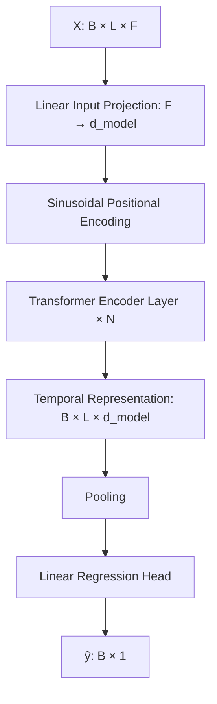
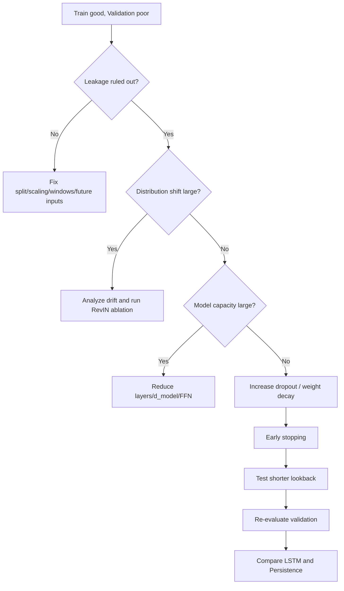
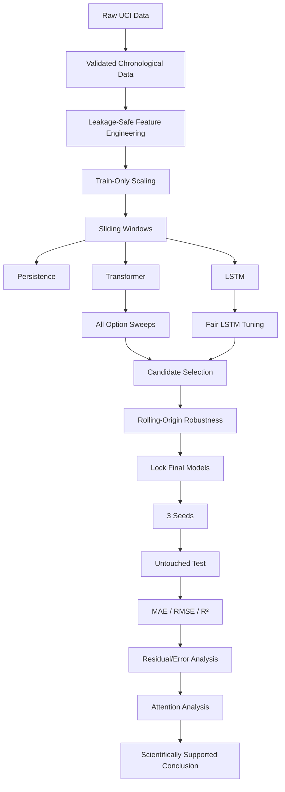

<div align="center">

# KẾ HOẠCH THỰC THI TOÀN DIỆN COURSEWORK

## TRANSFORMER ENCODER CHO HỒI QUY CHUỖI THỜI GIAN ĐA BIẾN

### Dự báo mức tiêu thụ năng lượng với UCI Appliances Energy Prediction

**Coursework môn Deep Learning**

</div>

---

# 0. Mục đích của kế hoạch

Kế hoạch này hợp nhất hai tài liệu đã xây dựng trước đó:

```text
1. KE_HOACH_COURSEWORK_TRANSFORMER_HOI_QUY_CHUOI_THOI_GIAN_DA_BIEN.md

2. CHONG_OVERFITTING_TRANSFORMER_TIME_SERIES_REGRESSION.md
```

và bổ sung các điểm kỹ thuật đã được kiểm tra lại từ:

```text
UCI Machine Learning Repository
PyTorch Documentation
Attention Is All You Need
Dropout
AdamW
RevIN
LTSF-Linear
TimeSeriesSplit
Attention interpretability literature
```

Mục tiêu của kế hoạch không chỉ là làm cho code chạy, mà phải tạo được một coursework có:

```text
Correct forecasting formulation
+
Leakage-safe data pipeline
+
Transformer Encoder Regression
+
Fair LSTM baseline
+
Persistence baseline
+
Controlled hyperparameter experiments
+
Overfitting diagnosis
+
All listed optional experiments
+
Attention-map analysis
+
Final untouched test evaluation
+
Scientifically defensible conclusion
```

---

# 1. Đặc tả chính thức của coursework

```text
Task:
Multivariate Time-Series Regression

Goal:
Predict energy consumption from past multivariate readings.

Dataset:
UCI Appliances Energy Prediction

Main Model:
Transformer Encoder for Regression

Task Type:
Regression

Required Extension:
Compare with LSTM baseline
Analyze attention maps
```

Bài toán phải được triển khai theo hướng:

\[
\boxed{
X_{t-L+1:t}
\rightarrow
Appliances_{t+H}
}
\]

thay vì:

\[
X_t\rightarrow Appliances_t
\]

vì đề bài yêu cầu dự đoán từ **past multivariate readings**.

---

# 2. Câu hỏi nghiên cứu

## RQ1 — Khả năng dự báo

> Transformer Encoder có học được các phụ thuộc thời gian đa biến hữu ích để dự báo ngắn hạn mức tiêu thụ năng lượng thiết bị gia dụng hay không?

## RQ2 — So sánh mô hình

> Transformer Encoder có tạo ra hiệu năng dự báo tốt hơn LSTM baseline dưới cùng một protocol dữ liệu và đánh giá hay không?

## RQ3 — Độ phức tạp và generalization

> Độ phức tạp bổ sung của Transformer có mang lại lợi ích thực nghiệm hay chỉ làm tăng nguy cơ overfitting?

## RQ4 — Attention

> Những temporal patterns nào có thể quan sát được từ các self-attention maps của Transformer?

## RQ5 — Historical target

> Việc bổ sung `Appliances` trong quá khứ có cải thiện dự báo so với chỉ sử dụng các biến ngoại sinh hay không?

## RQ6 — Lookback

> Lookback 6 giờ, 12 giờ hay 24 giờ phù hợp hơn với bài toán này?

## RQ7 — Regularization

> Những chiến lược regularization nào giúp Transformer duy trì generalization tốt hơn trên future validation data?

---

# 3. Các nguyên tắc không được vi phạm

```text
RULE 1
Không random split time-series observations/windows.

RULE 2
Không fit scaler trên validation hoặc test.

RULE 3
Không dùng future information không có sẵn tại thời điểm inference.

RULE 4
Không dùng test set để chọn architecture hoặc hyperparameter.

RULE 5
Không chọn model theo training loss thấp nhất.

RULE 6
Không tạo số liệu, loss curves hoặc metrics giả.

RULE 7
Transformer và LSTM phải dùng cùng forecasting task và data protocol.

RULE 8
Attention map không được diễn giải như bằng chứng nhân quả.

RULE 9
Mọi option trong hai tài liệu nguồn phải được thử ít nhất một lần
trong experiment plan, nhưng không brute-force toàn bộ Cartesian product.

RULE 10
Mọi cải tiến chỉ được chấp nhận khi validation evidence hỗ trợ.
```

---

# 4. Vì sao không brute-force toàn bộ tổ hợp?

Hai tài liệu cung cấp nhiều option:

```text
lookback
historical target
target scaling
pooling
activation
batch size
learning rate
weight decay
dropout
d_model
n_heads
n_layers
FFN
loss
max epochs
gradient clipping
RevIN
multiple seeds
rolling-origin validation
```

Nếu lấy Cartesian product của toàn bộ lựa chọn, số experiment sẽ tăng lên hàng nghìn.

Điều đó:

```text
tốn compute
khó diễn giải
tăng nguy cơ overfit validation
không phù hợp coursework
```

Do đó kế hoạch sử dụng:

```text
Controlled One-Factor Screening
        ↓
Candidate Synthesis
        ↓
Robustness Validation
        ↓
Final Locked Models
```

Như vậy:

> Mọi option đều được thử, nhưng mỗi experiment có mục tiêu rõ ràng và không thay nhiều yếu tố cùng lúc.

---

# 5. Đặc điểm bộ dữ liệu cần xác nhận khi chạy

UCI Appliances Energy Prediction có đặc điểm đã được tài liệu chính thức mô tả:

```text
19,735 observations
28 predictor features
Regression target: Appliances
Sampling interval: 10 minutes
Duration: approximately 4.5 months
No missing values according to repository metadata
Two random variables: rv1 and rv2
One household / one low-energy building
```

Tuy nhiên notebook vẫn phải tự kiểm tra lại file CSV thực tế.

---

# 6. Định nghĩa bài toán chính

Baseline forecasting task:

```text
Target:
Appliances

Forecast horizon:
H = 1

Sampling:
10 minutes

Therefore:
H = 1 → 10 minutes ahead
```

Baseline lookback:

```text
L = 144
```

vì:

\[
144\times10\text{ phút}=24\text{ giờ}
\]

Do đó:

\[
\boxed{
X_{t-143:t}
\rightarrow
Appliances_{t+1}
}
\]

---

# 7. Tất cả lookback option phải thử

| Option | Steps | Thời gian lịch sử |
|---|---:|---:|
| L36 | 36 | 6 giờ |
| L72 | 72 | 12 giờ |
| L144 | 144 | 24 giờ |

Baseline ban đầu:

```text
L144
```

Nhưng không được kết luận 24 giờ tốt nhất trước experiment.

---

# 8. Tất cả feature-set option phải thử

## FS0 — Exogenous-only

```text
Temperature history
Humidity history
Weather history
lights history
Calendar/time features
```

Không có:

```text
past Appliances
```

Target:

```text
future Appliances
```

---

## FS1 — Autoregressive + Exogenous

```text
Past Appliances
+
Temperature
+
Humidity
+
Weather
+
lights
+
Calendar/time features
```

Đây là feature set chính được đề xuất.

---

## FS2 — Random-Control Ablation

```text
FS1
+
rv1
+
rv2
```

Mục tiêu:

```text
Kiểm tra random controls có làm validation kém hơn
hoặc tăng overfitting hay không.
```

`rv1` và `rv2` không được dùng trong final model trừ khi experiment cho thấy lý do đặc biệt và được giải thích rõ.

---

# 9. Time features

Từ `date`, tạo:

```text
hour_sin
hour_cos
dow_sin
dow_cos
weekend
```

Không đưa raw date string vào neural network.

Optional ablation bổ sung trong plan:

```text
TF0:
Không calendar features

TF1:
Có cyclic calendar features
```

TF1 là baseline chính.

---

# 10. Data-quality audit

Notebook phải kiểm tra:

```text
shape
columns
dtypes
missing values
duplicate rows
duplicate timestamps
timestamp ordering
sampling-interval distribution
numerical ranges
target distribution
rv1/rv2 range
```

Assertions:

```text
timestamp monotonic increasing

Appliances >= 0

all model features finite

no unexpected NaN / Inf
```

Nếu phát hiện sampling interval không đều:

```text
Không tự động interpolate ngay.

Đầu tiên:
report frequency deviations
xác định số lượng gap
xác định nguyên nhân

Sau đó mới quyết định resampling nếu thật sự cần.
```

---

# 11. EDA bắt buộc

## Figure E1 — Appliances theo thời gian

```text
X: Date
Y: Appliances Wh
```

## Figure E2 — Target distribution

```text
Histogram
Boxplot
```

## Figure E3 — Mean energy by hour

```text
Hour
vs
Average Appliances
```

## Figure E4 — Correlation heatmap

Các sensor + target.

## Figure E5 — Representative 24-hour profile

Một hoặc nhiều ngày đại diện.

## Figure E6 — Lag / autocorrelation analysis

Bổ sung để hỗ trợ lookback experiment.

Các lag quan trọng:

```text
1 step   = 10 minutes
6 steps  = 1 hour
36       = 6 hours
72       = 12 hours
144      = 24 hours
```

## Figure E7 — Split-distribution comparison

So sánh:

```text
Train target distribution
Validation target distribution
Test target distribution
```

và một số feature chính.

Mục đích:

```text
phát hiện temporal distribution shift
```

---

# 12. Chia dữ liệu

Primary split:

```text
Train      = first 70%
Validation = next 15%
Test       = final 15%
```

Tất cả chia theo timestamp.


Không shuffle trước split.

---

# 13. Cải tiến quan trọng: chia theo target timestamp

Kế hoạch triển khai nên định nghĩa membership của một sample dựa trên:

```text
TARGET TIMESTAMP
```

thay vì cắt dataset thành ba block rồi buộc toàn bộ history của validation/test phải nằm bên trong block đó.

Ví dụ:

```text
Validation target:
timestamp thuộc Validation period

Input:
chỉ các timestamps quá khứ trước target
```

Đối với những target đầu tiên của validation, historical input có thể sử dụng các quan sát cuối của train period vì tại thời điểm forecasting thực tế chúng đã tồn tại.

Điều này:

```text
không sử dụng future label
không dùng future statistics
không vi phạm temporal ordering
không làm mất 144 target đầu của mỗi future split
```

Điều kiện bắt buộc:

```text
Scaler vẫn chỉ fit trên Train.
No target after prediction timestamp enters the input.
```

Đây là protocol được ưu tiên.

---

# 14. Strict-isolation sanity check

Để kiểm tra sensitivity, thêm một diagnostic nhỏ:

```text
Window Protocol A — Context Carry-over
Validation/Test được phép lấy past context từ giai đoạn trước.

Window Protocol B — Strict Isolation
Mọi input của một split phải nằm hoàn toàn trong split đó.
```

Không dùng kết quả test để chọn.

Mục tiêu:

```text
xác nhận conclusion không hoàn toàn do boundary handling.
```

Protocol A là primary vì phản ánh realistic one-step forecasting hơn.

---

# 15. Scaling

## Input scaling

Dùng baseline:

```text
StandardScaler
```

Fit:

```text
TRAIN ONLY
```

Transform:

```text
Train
Validation
Test
```

## Target scaling option

Phải thử cả:

```text
YS0:
Không scale y

YS1:
Standardize y bằng train mean/std
```

Nếu scale target:

\[
y'=\frac{y-\mu_{train,y}}{\sigma_{train,y}}
\]

Metrics cuối:

```text
inverse-transform prediction
compute metrics in Wh
```

Baseline đề xuất:

```text
YS1
```

---

# 16. RevIN option

RevIN phải được thử như extension vì nó có trong tài liệu chống overfitting/distribution shift.

Hai option:

```text
RN0:
Standard train-only scaling

RN1:
Standard scaling + RevIN
```

Thiết kế RevIN phải cẩn thận:

```text
Apply reversible normalization trên dynamic continuous channels.

Không RevIN:
hour_sin
hour_cos
dow_sin
dow_cos
weekend
```

Nếu output là `Appliances`, denormalization cuối phải dùng statistics tương ứng với target channel.

RevIN được xem là:

```text
distribution-shift ablation
```

không được mô tả là regularization bắt buộc.

---

# 17. Sliding-window builder

Function phải nhận:

```text
features
target
lookback
horizon
target_index_range
```

Output:

\[
X\in\mathbb{R}^{N\times L\times F}
\]

\[
y\in\mathbb{R}^{N\times1}
\]

và metadata:

```text
input_start_time
input_end_time
target_time
```

Metadata là bắt buộc vì cần:

```text
debug leakage
plot predictions
error analysis
attention analysis
```

---

# 18. Window assertions

Với từng sample:

```text
input_end_time < target_time

target_time - input_end_time = 10 minutes
```

Với primary horizon.

Không có:

```text
timestamp > target_time
```

trong input.

---

# 19. DataLoader

Training:

```text
shuffle=True
```

là hợp lệ sau khi windows đã được tạo đúng và thuộc hoàn toàn training target period, vì shuffle chỉ đổi thứ tự mini-batch, không phá thứ tự bên trong từng sequence.

Validation/Test:

```text
shuffle=False
```

Batch-size options phải thử:

```text
B32
B64
```

---

# 20. Baseline 0 — Persistence

Bắt buộc đưa vào plan.

\[
\boxed{
\hat y_{t+1}=y_t
}
\]

Metrics:

```text
MAE
RMSE
R²
```

Mục đích:

```text
đặt mức tối thiểu mà neural models cần vượt qua.
```

---

# 21. Baseline 1 — LSTM

Architecture:

```text
Input [B,L,F]
        ↓
LSTM
        ↓
Last hidden state
        ↓
Linear(hidden_size, 1)
        ↓
Prediction
```

Baseline:

```text
hidden_size = 64
num_layers  = 2
dropout     = 0.1
batch_first = True
```

---

# 22. LSTM fairness protocol

LSTM phải dùng cùng:

```text
feature set
lookback
horizon
train/val/test
scalers
target scaling option
training samples
metrics
early stopping criterion
```

Tuning budget cho LSTM:

```text
LR:
1e-4
3e-4
1e-3

Dropout:
0.1
0.2
0.3

Batch:
32
64
```

Không cần full Cartesian.

Thực hiện one-factor screening giống Transformer.

---

# 23. Main Model — Attention-Aware Transformer Encoder

Không nên train một Transformer chuẩn rồi sau đó tạo một model architecture khác để lấy attention.

Ngay từ đầu xây một:

```text
AttentionAwareTransformerRegressor
```

Có khả năng:

```text
return_attention=False
```

trong training và:

```text
return_attention=True
```

khi phân tích.

Điều này đảm bảo:

```text
same trained model
same parameters
same predictions
same architecture
```

được dùng cho attention analysis.

---

# 24. Transformer architecture



---

# 25. Custom encoder layer

Mỗi layer phải có:

```text
MultiheadAttention
Dropout
Residual Connection
LayerNorm
Feed-Forward Network
Dropout
Residual Connection
LayerNorm
```

Attention interface:

```text
Training:
need_weights=False

Attention analysis:
need_weights=True
average_attn_weights=False
```

Khi `average_attn_weights=False`, attention tensor phải có dạng:

\[
[B,H,L,L]
\]

cho self-attention.

---

# 26. Positional Encoding

Baseline:

```text
Sinusoidal Positional Encoding
```

Phải thêm sau input projection:

\[
H_0=Projection(X)+PE
\]

Không bỏ positional encoding trong vanilla Transformer baseline.

Cyclical calendar features và positional encoding không thay thế nhau:

```text
Positional encoding:
vị trí tương đối trong input window

Calendar features:
phase thực tế của thời gian trong ngày/tuần
```

---

# 27. Pooling options — thử hết

## P0 — Last-step pooling

\[
h=H[:,-1,:]
\]

## P1 — Mean pooling

\[
h=
\frac1L\sum_{t=1}^{L}H_t
\]

Cả hai phải được thử.

Baseline:

```text
P0
```

---

# 28. Activation options — thử hết

```text
A0 = ReLU
A1 = GELU
```

Cả hai được dùng trong controlled sweep.

---

# 29. Transformer capacity options — thử hết

## d_model

```text
D32
D64
```

## number of heads

```text
H2
H4
```

Phải đảm bảo:

\[
d_{model}\bmod n_{heads}=0
\]

## encoder layers

```text
N1
N2
```

## FFN dimensions

```text
F64
F128
F256
```

---

# 30. Dropout options — thử hết

```text
DR01 = 0.1
DR02 = 0.2
DR03 = 0.3
```

Không dùng `0.5` trừ khi sau cùng có lý do mới.

---

# 31. Learning-rate options — thử hết

```text
LR1 = 1e-4
LR2 = 3e-4
LR3 = 1e-3
```

Optimizer:

```text
AdamW
```

---

# 32. Weight-decay options — thử hết

```text
WD0 = 0
WD1 = 1e-4
WD2 = 1e-3
WD3 = 1e-2
```

Selection dựa validation RMSE.

---

# 33. Loss options — thử hết

## L0 — MSE

\[
MSE
=
\frac1N\sum(y-\hat y)^2
\]

## L1 — Huber

Huber phải được thử.

Quan trọng:

```text
HuberLoss(delta=1.0)
```

chỉ có ý nghĩa trực quan phù hợp khi target đã được standardized.

Do đó primary Huber experiment sử dụng:

```text
YS1 = standardized target
```

Nếu muốn Huber trên Wh scale, `delta` phải được định nghĩa riêng dựa trên train data; không dùng 1 Wh một cách tùy ý.

---

# 34. Max-epoch options — thử hết

```text
E50  = max 50 epochs
E100 = max 100 epochs
```

Luôn có early stopping.

Nếu cả hai dừng ở cùng best epoch:

```text
report rằng max-epoch cap không ảnh hưởng.
```

---

# 35. Early-stopping option

Baseline:

```text
monitor = validation RMSE
patience = 10
```

Sensitivity range được ghi nhận:

```text
8
10
12
```

Không cần chạy full patience grid nếu best epoch không nhạy, nhưng ba giá trị phải được kiểm tra trong pilot/diagnostic runs theo kế hoạch.

Checkpoint:

```text
lowest validation RMSE
```

---

# 36. Gradient-clipping options — thử hết

```text
GC0:
No clipping

GC1:
clip_grad_norm_(..., max_norm=1.0)
```

Mục đích:

```text
training-stability diagnostic
```

Không gọi gradient clipping là regularizer chính.

---

# 37. Training metrics phải log mỗi epoch

```text
Train loss
Validation loss

Train MAE
Validation MAE

Train RMSE
Validation RMSE

Train R²
Validation R²

Learning rate

Gradient norm
Epoch time
```

Với Transformer:

```text
parameter count
```

Với LSTM:

```text
parameter count
```

---

# 38. Generalization-gap logging

Tính:

\[
Gap_{RMSE}
=
RMSE_{val}
-
RMSE_{train}
\]

Tương tự:

\[
Gap_{MAE}
=
MAE_{val}
-
MAE_{train}
\]

Plot gap theo epoch.

Mục đích:

```text
phát hiện classic overfitting.
```

---

# 39. Baseline Transformer B0

Configuration khởi đầu:

```text
Feature set       = FS1
Time features     = TF1
Target scaling    = YS1
RevIN             = RN0
Lookback          = 144
Horizon           = 1

d_model           = 64
heads             = 4
layers            = 2
FFN               = 128
dropout           = 0.1
activation        = GELU
pooling           = Last-step

batch_size        = 64
learning_rate     = 3e-4
weight_decay      = 1e-4
loss              = MSE
max_epochs        = 50
patience          = 10
gradient_clip     = 1.0
seed              = 42
```

Đây là baseline làm điểm neo cho option screening.

---

# 40. Giai đoạn screening — nguyên tắc

Mỗi sweep:

```text
Chỉ thay một yếu tố so với B0.
```

Mục đích:

```text
hiểu tác động của option
không chỉ tìm score tốt nhất
```

Sau mỗi sweep:

```text
ghi bảng
validation MAE
validation RMSE
validation R²
best epoch
generalization gap
training time
```

---

# 41. Sweep S1 — Historical target / feature-set

Chạy:

```text
S1-A = FS0
S1-B = FS1
S1-C = FS2
```

Mục tiêu:

```text
past Appliances value?
random controls harmful?
```

---

# 42. Sweep S2 — Calendar features

```text
S2-A = TF0
S2-B = TF1
```

---

# 43. Sweep S3 — Target scaling

```text
S3-A = YS0
S3-B = YS1
```

Dùng MSE cho comparison này.

---

# 44. Sweep S4 — Lookback

```text
S4-A = L36
S4-B = L72
S4-C = L144
```

---

# 45. Sweep S5 — Pooling

```text
S5-A = Last-step
S5-B = Mean
```

---

# 46. Sweep S6 — Activation

```text
S6-A = ReLU
S6-B = GELU
```

---

# 47. Sweep S7 — Batch Size

```text
S7-A = 32
S7-B = 64
```

---

# 48. Sweep S8 — Learning Rate

```text
S8-A = 1e-4
S8-B = 3e-4
S8-C = 1e-3
```

---

# 49. Sweep S9 — Weight Decay

```text
S9-A = 0
S9-B = 1e-4
S9-C = 1e-3
S9-D = 1e-2
```

---

# 50. Sweep S10 — Dropout

```text
S10-A = 0.1
S10-B = 0.2
S10-C = 0.3
```

---

# 51. Sweep S11 — d_model

```text
S11-A = 32
S11-B = 64
```

---

# 52. Sweep S12 — Heads

```text
S12-A = 2
S12-B = 4
```

---

# 53. Sweep S13 — Encoder layers

```text
S13-A = 1
S13-B = 2
```

---

# 54. Sweep S14 — FFN

```text
S14-A = 64
S14-B = 128
S14-C = 256
```

---

# 55. Sweep S15 — Loss

```text
S15-A = MSE
S15-B = Huber
```

Huber run:

```text
target standardized
delta = 1.0
```

---

# 56. Sweep S16 — Max Epoch Cap

```text
S16-A = 50
S16-B = 100
```

Early stopping vẫn bật.

---

# 57. Sweep S17 — Gradient clipping

```text
S17-A = Off
S17-B = max_norm 1.0
```

Ghi thêm:

```text
gradient norm history
```

---

# 58. Sweep S18 — RevIN

```text
S18-A = RN0
S18-B = RN1
```

Đánh giá:

```text
Validation RMSE
generalization gap
split distribution diagnostics
```

---

# 59. Sweep S19 — Boundary-window protocol

```text
S19-A = Context Carry-over
S19-B = Strict Isolation
```

Đây là methodological sensitivity analysis.

---

# 60. Candidate synthesis

Sau screening, không lấy từng winner riêng rẽ một cách mù quáng.

Tạo tối đa:

```text
3 candidate Transformer configurations
```

## C1 — Best Validation RMSE

Kết hợp các option mạnh nhất.

## C2 — Best Regularized / Small Model

Ưu tiên:

```text
lower parameter count
smaller generalization gap
competitive RMSE
```

## C3 — Best Robust / RevIN Candidate

Nếu RevIN có giá trị.

Mục tiêu:

```text
không chỉ tối ưu raw RMSE
mà xem generalization + complexity.
```

---

# 61. LSTM candidate synthesis

LSTM baseline cũng được tune có kiểm soát:

```text
Learning rate:
1e-4 / 3e-4 / 1e-3

Dropout:
0.1 / 0.2 / 0.3

Batch:
32 / 64
```

Giữ:

```text
hidden_size = 64
layers = 2
```

để baseline dễ diễn giải và bám kế hoạch gốc.

Tạo:

```text
LSTM-C1
```

là configuration tốt nhất trên validation.

---

# 62. Rolling-origin robustness evaluation — phải thực hiện

Đây là option trong tài liệu chống overfitting nên không bỏ.

Chỉ chạy trên:

```text
Top Transformer candidates
Best LSTM
Persistence
```

Không cần chạy trên toàn bộ screening runs.

Ví dụ ba expanding folds trong development timeline:

```text
Fold 1
Train early history
→ Validate next block

Fold 2
Expand train
→ Validate next block

Fold 3
Expand train
→ Validate next block
```

Mọi fold phải nằm trước final test period.

Report:

```text
mean validation MAE
mean validation RMSE
std validation RMSE
mean R²
```

---

# 63. Chọn Transformer cuối

Selection rule theo thứ tự:

```text
1. Không leakage / không invalid run
2. Competitive fixed-validation RMSE
3. Rolling-origin robustness
4. Generalization gap
5. Parameter count
6. Training stability
7. Training time
```

Không dùng test.

---

# 64. Multiple-seed experiment — phải thực hiện

Sau khi khóa architecture:

```text
Seed 42
Seed 123
Seed 2026
```

Áp dụng cho:

```text
Final Transformer
Final LSTM
```

Report:

\[
mean\pm std
\]

cho validation:

```text
MAE
RMSE
R²
best epoch
```

Sau khi configs đã khóa:

```text
evaluate all fixed-seed final runs on Test
```

Test results được dùng để báo cáo, không dùng để tune tiếp.

---

# 65. Final test protocol

Khi toàn bộ decisions đã khóa:

```text
Persistence
Final LSTM × 3 seeds
Final Transformer × 3 seeds
```

được đánh giá trên final 15% test period.

Không thay hyperparameter sau khi xem test results.

---

# 66. Final metrics

Bắt buộc:

\[
MAE
=
\frac1N\sum |y-\hat y|
\]

\[
RMSE
=
\sqrt{\frac1N\sum(y-\hat y)^2}
\]

\[
R^2
=
1-
\frac{\sum(y-\hat y)^2}
{\sum(y-\bar y)^2}
\]

Báo cáo:

```text
MAE in Wh
RMSE in Wh
R² dimensionless
```

---

# 67. Final comparison table

| Model | MAE | RMSE | R² | Params | Train Time | Best Epoch |
|---|---:|---:|---:|---:|---:|---:|
| Persistence | actual | actual | actual | 0 | 0 | N/A |
| LSTM | mean ± std | mean ± std | mean ± std | actual | actual | actual |
| Transformer | mean ± std | mean ± std | mean ± std | actual | actual | actual |

---

# 68. Overfitting diagnostics bắt buộc

## Figure O1

```text
Train vs Validation Loss
```

## Figure O2

```text
Train vs Validation RMSE
```

## Figure O3

```text
Generalization Gap vs Epoch
```

## Table O1

```text
Best epoch
Train RMSE at best epoch
Validation RMSE at best epoch
Gap
```

cho:

```text
LSTM
Transformer
```

---

# 69. Distribution-shift diagnostics

Trước khi diễn giải một train–validation gap là overfitting, so sánh:

```text
Target mean / std
Selected feature mean / std
Target quantiles
hourly profile
```

giữa:

```text
Train
Validation
Test
```

Nếu shift rõ:

```text
report distinction:
overfitting vs distribution shift.
```

---

# 70. Prediction analysis

## Figure P1 — Actual vs Predicted Over Time

Cùng một test interval:

```text
Ground Truth
LSTM
Transformer
```

## Figure P2 — Actual vs Predicted Scatter

Thêm:

\[
y=x
\]

reference line.

## Figure P3 — Residual distribution

LSTM vs Transformer.

## Figure P4 — Residual over time

## Figure P5 — Residual vs Actual

---

# 71. Error-by-regime analysis

Tạo các nhóm từ **train-derived quantile thresholds**.

Ví dụ:

```text
Low
Medium
High
```

Threshold không được lấy từ test distribution để tránh data-driven test adaptation.

Report:

```text
MAE by regime
RMSE by regime
sample count
```

Câu hỏi:

```text
Transformer có underpredict high-energy spikes không?
LSTM có ổn định hơn không?
```

---

# 72. Worst-error analysis

Lấy:

```text
Top 10 absolute errors
```

cho mỗi model.

Bảng:

```text
timestamp
actual
predicted
absolute error
hour
recent Appliances
```

Với Transformer còn lưu:

```text
attention metadata
```

để dùng cho attention analysis.

---

# 73. Attention extraction — tất cả option phải làm

Chỉ dùng:

```text
Final locked Transformer
```

và:

```text
model.eval()
torch.no_grad()
```

Lấy:

```text
per-layer
per-head
attention weights
```

---

# 74. Attention visualization 1 — Full per-head heatmaps

Tạo heatmap:

\[
L\times L
\]

cho:

```text
Head 1
Head 2
...
Head H
```

trên representative test windows.

---

# 75. Attention visualization 2 — Average attention map

\[
A_{avg}
=
\frac1H\sum_hA_h
\]

Dùng như summary nhưng không thay thế per-head maps.

---

# 76. Attention visualization 3 — Last-query profile

Trích:

\[
A[:,h,-1,:]
\]

Plot:

```text
X = hours/minutes before forecast
Y = attention weight
```

Đây là visualization ưu tiên để diễn giải sequence-to-one prediction.

---

# 77. Attention visualization 4 — Head comparison

So sánh:

```text
recent-history focus
longer-history focus
distributed attention
periodic-looking attention
```

Không gán semantic label trước khi xem data.

---

# 78. Attention visualization 5 — Error-conditioned analysis

Phải thử cả:

```text
Low-error test windows
High-error test windows
```

và:

```text
Normal-consumption windows
High-consumption spike windows
```

Câu hỏi:

> Temporal attention profile có thay đổi trong những prediction khó hay không?

---

# 79. Attention interpretation guardrail

Không viết:

```text
Timestamp X gây ra mức tiêu thụ năng lượng.
```

Nên viết:

```text
Timestamp X nhận attention weight cao hơn
trong phép tính self-attention của model đối với sample này.
```

Attention analysis là:

```text
internal model-behavior inspection
```

không phải causal proof.

---

# 80. Optional attention robustness check

Vì final model chạy 3 seeds:

```text
so sánh last-query attention
trên cùng một sample
qua 3 seeds
```

Mục đích:

```text
attention interpretation có ổn định hay phụ thuộc initialization?
```

Nếu khác mạnh:

```text
ghi limitation.
```

---

# 81. Artifact structure

```text
coursework/
│
├── data/
│   ├── raw/
│   └── processed/
│
├── notebooks/
│   └── coursework_transformer_energy.ipynb
│
├── src/
│   ├── config.py
│   ├── data.py
│   ├── features.py
│   ├── windows.py
│   ├── metrics.py
│   ├── train.py
│   ├── models/
│   │   ├── lstm.py
│   │   ├── transformer.py
│   │   └── revin.py
│   └── attention.py
│
├── artifacts/
│   ├── scalers/
│   ├── checkpoints/
│   ├── histories/
│   ├── predictions/
│   ├── attention/
│   ├── figures/
│   └── tables/
│
└── results/
    └── experiment_registry.csv
```

Nếu coursework yêu cầu một notebook duy nhất, vẫn có thể giữ toàn bộ code trong notebook theo các phase tương ứng.

---

# 82. Experiment registry

Mọi run phải ghi:

```text
run_id
timestamp
seed
feature_set
time_features
target_scaling
RevIN
lookback
horizon
pooling
activation
d_model
heads
layers
FFN
dropout
batch
lr
weight_decay
loss
max_epochs
patience
gradient_clip
parameter_count
best_epoch
train_mae
train_rmse
train_r2
val_mae
val_rmse
val_r2
generalization_gap
train_time
checkpoint_path
status
notes
```

Điều này ngăn:

```text
quên configuration
cherry-picking
nhầm results
```

---

# 83. Notebook execution phases

## PHASE 0 — Coursework contract

```text
Task
Research questions
Target
Lookback options
Horizon
Metrics
Rules
```

## PHASE 1 — Environment

```text
Python
PyTorch
NumPy
Pandas
Scikit-learn
Matplotlib
Device
Seed
```

Device detection:

```text
CUDA
MPS
CPU
```

## PHASE 2 — Data acquisition

Tải:

```text
energydata_complete.csv
```

Lưu raw immutable copy.

## PHASE 3 — Schema audit

## PHASE 4 — Temporal integrity audit

## PHASE 5 — EDA

## PHASE 6 — Feature engineering

## PHASE 7 — Feature-set variants

## PHASE 8 — Chronological split

## PHASE 9 — Train-only scaling

## PHASE 10 — Window builder

## PHASE 11 — DataLoaders

## PHASE 12 — Shared metrics

## PHASE 13 — Experiment registry

## PHASE 14 — Persistence baseline

## PHASE 15 — LSTM implementation

## PHASE 16 — Transformer implementation

## PHASE 17 — Attention-aware encoder verification

## PHASE 18 — Forward-pass sanity tests

## PHASE 19 — Baseline training engine

## PHASE 20 — LSTM baseline run

## PHASE 21 — Transformer B0 run

## PHASE 22 — Learning-curve diagnostics

## PHASE 23 — S1 Feature-set sweep

## PHASE 24 — S2 Time-feature sweep

## PHASE 25 — S3 Target-scaling sweep

## PHASE 26 — S4 Lookback sweep

## PHASE 27 — S5 Pooling sweep

## PHASE 28 — S6 Activation sweep

## PHASE 29 — S7 Batch sweep

## PHASE 30 — S8 Learning-rate sweep

## PHASE 31 — S9 Weight-decay sweep

## PHASE 32 — S10 Dropout sweep

## PHASE 33 — S11 d_model sweep

## PHASE 34 — S12 Head sweep

## PHASE 35 — S13 Layer sweep

## PHASE 36 — S14 FFN sweep

## PHASE 37 — S15 Loss sweep

## PHASE 38 — S16 Epoch-cap sweep

## PHASE 39 — S17 Gradient-clipping sweep

## PHASE 40 — S18 RevIN sweep

## PHASE 41 — S19 Boundary protocol check

## PHASE 42 — Candidate synthesis

## PHASE 43 — LSTM tuning

## PHASE 44 — Rolling-origin robustness

## PHASE 45 — Final model lock

## PHASE 46 — Three-seed final runs

## PHASE 47 — Final test evaluation

## PHASE 48 — Prediction analysis

## PHASE 49 — Residual analysis

## PHASE 50 — Error-by-regime analysis

## PHASE 51 — Worst-error analysis

## PHASE 52 — Attention extraction

## PHASE 53 — Attention heatmaps

## PHASE 54 — Last-query attention

## PHASE 55 — Head comparison

## PHASE 56 — Error-conditioned attention

## PHASE 57 — Seed-stability attention check

## PHASE 58 — Final tables

## PHASE 59 — Final conclusions

---

# 84. Forward sanity checks

Transformer:

```text
Input:
[B,L,F]

Projected:
[B,L,d_model]

Encoder:
[B,L,d_model]

Prediction:
[B,1]
```

LSTM:

```text
Input:
[B,L,F]

Output:
[B,L,hidden]

Prediction:
[B,1]
```

Attention:

```text
[B,heads,L,L]
```

Assertions:

```text
all finite
correct dtype
correct device
no NaN
```

---

# 85. Backward sanity check

Trước full training:

```text
one batch
forward
loss
backward
gradient norm
optimizer step
```

Xác nhận:

```text
loss finite
gradients exist
gradients finite
parameters change after step
```

---

# 86. Overfitting decision tree



---

# 87. Underfitting decision tree

Nếu:

```text
Train error cao
Validation error cao
gap nhỏ
```

thì:

```text
không tăng regularization.
```

Thử:

```text
larger d_model
larger FFN
2 layers thay vì 1
lower dropout
learning-rate tuning
longer training nếu early stop chưa kích hoạt
```

---

# 88. Optimization-instability decision tree

Nếu:

```text
loss zig-zag
gradient norms rất lớn
NaN/Inf
```

kiểm tra:

```text
LR
target scaling
input scaling
gradient clipping
batch size
```

Không tự động gọi đây là overfitting.

---

# 89. Final-result acceptance criteria

Một final result được xem là hợp lệ khi:

```text
No leakage detected.

Test was not used for model selection.

Transformer and LSTM use same forecasting task.

Metrics are on original Wh scale.

All mandatory and listed option experiments are executed.

Best checkpoint chosen by validation.

Rolling-origin robustness is reported.

Multiple seeds are reported.

Attention maps come from the same trained Transformer.

Attention interpretation is cautious.

All plots/tables use actual executed results.
```

---

# 90. Definition of Done



Coursework chỉ hoàn chỉnh khi toàn bộ flow trên chạy end-to-end.

---

# 91. Final report structure

## 1. Introduction

```text
Problem
Motivation
Coursework objective
Research questions
```

## 2. Dataset

```text
UCI dataset
Sensors
Target
Sampling
Limitations
```

## 3. Methodology

```text
Forecast definition
Temporal split
Feature engineering
Scaling
Sliding windows
```

## 4. Models

```text
Persistence
LSTM
Transformer Encoder
Attention-aware implementation
RevIN extension
```

## 5. Experimental Design

```text
All option sweeps
Early stopping
Hyperparameter protocol
Rolling-origin
Multiple seeds
```

## 6. Results

```text
Validation experiments
Final test table
Training curves
```

## 7. Error Analysis

```text
Actual vs Predicted
Residual
Consumption regimes
Worst errors
```

## 8. Attention Analysis

```text
Per-head
Average
Last-query
Error-conditioned
Seed robustness
```

## 9. Discussion

```text
Transformer vs LSTM
Complexity vs performance
Overfitting
Distribution shift
Attention limitations
```

## 10. Conclusion

```text
Answer RQ1–RQ7
```

---

# 92. Bảng thí nghiệm cuối cùng cần có

## Table T1 — Dataset Summary

## Table T2 — Feature Sets

## Table T3 — Baseline Configurations

## Table T4 — Hyperparameter / Option Screening

## Table T5 — Rolling-Origin Results

## Table T6 — Final 3-Seed Test Results

## Table T7 — Error by Consumption Regime

## Table T8 — Top Worst Errors

## Table T9 — Model Complexity and Runtime

---

# 93. Figures cuối cùng cần có

```text
F1  Target over time
F2  Target distribution
F3  Hour-of-day profile
F4  Correlation heatmap
F5  24-hour profile
F6  Lag/autocorrelation
F7  Split distribution comparison
F8  Train vs Validation loss
F9  Train vs Validation RMSE
F10 Generalization gap
F11 Actual vs Predicted
F12 Actual-vs-Predicted scatter
F13 Residual distribution
F14 Residual over time
F15 Error by consumption regime
F16 Per-head attention
F17 Average attention
F18 Last-query attention
F19 High-error vs low-error attention
```

Không cần đưa mọi figure vào report nếu bị giới hạn trang, nhưng notebook phải sinh được toàn bộ.

---

# 94. Những điều không làm

```text
Không dùng Informer thay Transformer Encoder.

Không dùng PatchTST thay bài chính.

Không dùng iTransformer thay bài chính.

Không dùng test để tune.

Không random split.

Không dùng future features không available.

Không bỏ LSTM.

Không bỏ attention maps.

Không bỏ optional experiments đã ghi trong hai kế hoạch nguồn.

Không giả định Transformer phải thắng LSTM.

Không giải thích attention như causality.

Không báo normalized metric thay Wh.

Không chọn một run vì “curve nhìn đẹp”.
```

---

# 95. Nguồn kỹ thuật đã kiểm tra lại

## Dataset

Luis Candanedo.

*Appliances Energy Prediction.*

UCI Machine Learning Repository.

```text
DOI: 10.24432/C5VC8G
```

## Transformer

Vaswani et al.

*Attention Is All You Need.*

NeurIPS 2017.

```text
arXiv:1706.03762
```

## Dropout

Srivastava et al.

*Dropout: A Simple Way to Prevent Neural Networks from Overfitting.*

JMLR 2014.

## AdamW

Loshchilov & Hutter.

*Decoupled Weight Decay Regularization.*

```text
arXiv:1711.05101
```

## Early Stopping

Lutz Prechelt.

*Early Stopping — But When?*

Neural Networks: Tricks of the Trade.

## Time-Series Validation

Scikit-learn official documentation:

```text
TimeSeriesSplit
```

## Time-Series Transformer Critical Baseline

Zeng et al.

*Are Transformers Effective for Time Series Forecasting?*

```text
arXiv:2205.13504
```

## Distribution Shift

Kim et al.

*Reversible Instance Normalization for Accurate Time-Series Forecasting against Distribution Shift.*

ICLR 2022.

## Attention Interpretation

Jain & Wallace.

*Attention is not Explanation.*

NAACL 2019.

Wiegreffe & Pinter.

*Attention is not not Explanation.*

EMNLP-IJCNLP 2019.

## PyTorch APIs

```text
torch.nn.TransformerEncoderLayer
torch.nn.MultiheadAttention
torch.nn.LSTM
torch.optim.AdamW
torch.nn.HuberLoss
torch.nn.utils.clip_grad_norm_
```

---

# 96. Thứ tự thực thi thực tế

Nếu bắt đầu code từ đầu, thực hiện theo thứ tự:

```text
STEP 1
Data integrity

STEP 2
EDA

STEP 3
Forecasting formulation

STEP 4
Chronological split

STEP 5
Scaling

STEP 6
Window builder + leakage tests

STEP 7
Persistence

STEP 8
LSTM baseline

STEP 9
Attention-aware Transformer B0

STEP 10
Overfitting diagnosis

STEP 11
Run all controlled option sweeps

STEP 12
Synthesize top candidates

STEP 13
Rolling-origin robustness

STEP 14
Lock models

STEP 15
3-seed final runs

STEP 16
Untouched test evaluation

STEP 17
Error analysis

STEP 18
Attention analysis

STEP 19
Final tables and figures

STEP 20
Write conclusions from actual evidence
```

---

<div align="center">

# TRẠNG THÁI

**Đã hoàn tất kế hoạch thực thi toàn diện**

**Kế hoạch đã bao phủ toàn bộ yêu cầu bắt buộc và toàn bộ option được nêu trong hai tài liệu nguồn**

**Bước kế tiếp: triển khai notebook theo Phase 0 → Phase 59**

</div>
