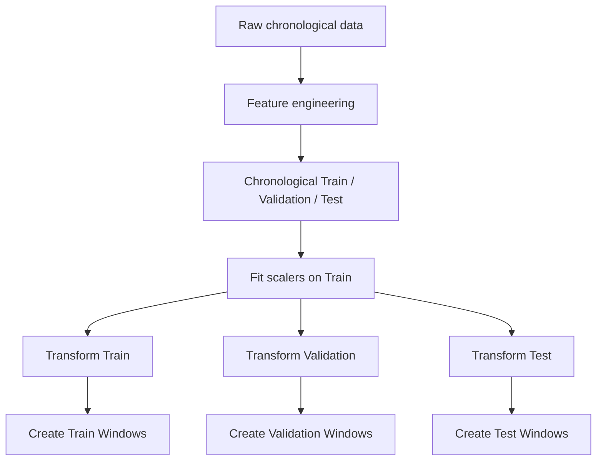
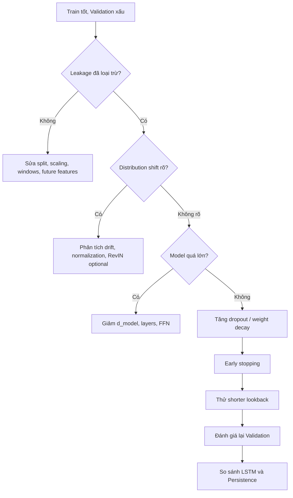

<div align="center">

# CHỐNG OVERFITTING TRONG TRANSFORMER CHO HỒI QUY CHUỖI THỜI GIAN

## Cơ sở lý thuyết, nguyên nhân, chẩn đoán và chiến lược khắc phục

### Áp dụng cho coursework: UCI Appliances Energy Prediction

</div>

---

# 1. Mục tiêu

Tài liệu này tổng hợp có hệ thống vấn đề **overfitting trong Transformer cho time-series regression/forecasting**, đồng thời chuyển các nguyên lý thành một quy trình thực nghiệm phù hợp với coursework:

```text
Task:
Multivariate Time-Series Regression

Dataset:
UCI Appliances Energy Prediction

Main Model:
Transformer Encoder for Regression

Baseline:
LSTM

Extension:
Attention Map Analysis
```

Trọng tâm:

1. Phân biệt overfitting với leakage, distribution shift và optimization instability.
2. Phân tích các nguyên nhân khiến Transformer dễ overfit.
3. Xây dựng quy trình chẩn đoán.
4. Tổng hợp các phương pháp chống overfitting.
5. Đề xuất protocol cụ thể cho bộ dữ liệu Appliances Energy Prediction.
6. Xác định thứ tự ưu tiên khi sửa mô hình.

---

# 2. Overfitting là gì?

Một mô hình overfit khi học rất tốt training data nhưng không duy trì được hiệu năng trên dữ liệu chưa quan sát.

Một biểu hiện điển hình:

\[
\mathcal{L}_{train} \ll \mathcal{L}_{validation}
\]

hoặc:

\[
RMSE_{train} \ll RMSE_{validation}
\]

Pattern thường gặp:

```text
Training loss
      ↓
      ↓
      ↓
      ↓

Validation loss
      ↓
      ↓
      ↑
      ↑
```

Có thể theo dõi:

\[
GeneralizationGap
=
RMSE_{validation}
-
RMSE_{train}
\]

Tuy nhiên trong time series, gap lớn không tự động đồng nghĩa với overfitting vì validation có thể thuộc một temporal regime khác training.

---

# 3. Phải phân biệt bốn hiện tượng

## 3.1. Overfitting thực sự

Dấu hiệu:

```text
Train error rất thấp
Validation/Test error cao
```

Nguyên nhân thường gặp:

```text
Model quá lớn
Training quá lâu
Regularization quá yếu
Dữ liệu hiệu dụng quá ít
Model học noise hoặc transient correlations
```

---

## 3.2. Data leakage

Leakage xảy ra khi pipeline dùng thông tin không được phép biết tại thời điểm inference.

Ví dụ:

```text
Fit scaler trên toàn bộ dataset

Tạo toàn bộ sliding windows rồi random split

Dùng future covariates không thực sự có sẵn

Dùng test set để chọn hyperparameter
```

Leakage thường làm validation/test đẹp giả tạo và có thể che giấu overfitting.

---

## 3.3. Distribution shift / non-stationarity

Time series thường có:

\[
P_{train}(X,Y)

eq
P_{future}(X,Y)
\]

Ví dụ:

```text
Train:
một khoảng nhiệt độ, thói quen sử dụng điện, độ ẩm

Validation:
một distribution khác
```

Khi đó:

```text
Train tốt
Validation xấu
```

có thể là distribution shift chứ không chỉ memorization.

---

## 3.4. Optimization instability

Biểu hiện:

```text
Loss dao động mạnh
Gradient rất lớn
NaN / Inf
Prediction không ổn định
```

Nguyên nhân:

```text
Learning rate quá lớn
Gradient explosion
Numerical instability
Batch quá nhỏ
```

Gradient clipping hỗ trợ ổn định optimization nhưng **không phải** regularization chống overfitting chính.

---

# 4. Vì sao Transformer dễ overfit trong time-series regression?

Transformer có năng lực biểu diễn lớn nhờ:

```text
Multi-head self-attention
Feed-forward networks
Multiple encoder layers
High-dimensional latent representations
```

Điều này cho phép mô hình học được các pattern phức tạp nhưng cũng làm tăng khả năng học:

```text
noise
spurious correlations
position-specific shortcuts
patterns chỉ xuất hiện trong train period
```

Đối với bộ dữ liệu Appliances:

```text
19,735 timestamps
10-minute sampling
khoảng 4.5 tháng
một household
```

dataset tương đối nhỏ so với capacity của một Transformer lớn.

---

# 5. Nguyên nhân 1 — Capacity quá lớn so với dữ liệu

Các tham số làm tăng capacity:

```text
d_model
n_heads
n_layers
dim_feedforward
Regression head complexity
```

Nếu model quá lớn:

```text
Train loss ↓ rất nhanh
Validation loss không cải thiện tương ứng
```

### Cách khắc phục

Bắt đầu bằng lightweight Transformer:

```text
d_model          = 32 hoặc 64
n_heads          = 2 hoặc 4
n_layers         = 1 hoặc 2
dim_feedforward  = 64, 128 hoặc 256
```

Nguyên tắc:

```text
Train xấu + Validation xấu
→ có thể thiếu capacity.

Train rất tốt + Validation xấu
→ không nên tăng capacity.
```

---

# 6. Nguyên nhân 2 — Sliding windows làm số sample trông lớn hơn lượng thông tin hiệu dụng

Ví dụ:

```text
Window 1:
[t1 ... t144]

Window 2:
[t2 ... t145]
```

Hai sample chia sẻ:

```text
143 / 144 timestamps
```

Do đó số windows lớn không có nghĩa là có cùng số lượng thông tin độc lập.

### Rủi ro

Model có thể học rất tốt các sequence gần giống nhau trong train nhưng kém khi chuyển sang giai đoạn thời gian mới.

### Khắc phục

```text
Không đánh giá data size chỉ bằng số windows.

Dùng chronological validation.

Dùng rolling-origin evaluation nếu cần robust evaluation hơn.
```

---

# 7. Nguyên nhân 3 — Training quá lâu

Classic pattern:

```text
Train loss:
giảm liên tục

Validation loss:
giảm → đạt tốt nhất → tăng trở lại
```

### Giải pháp: Early Stopping

Chọn checkpoint có:

```text
lowest validation RMSE
```

Đề xuất cho coursework:

```text
max_epochs = 50
patience   = 8–12
monitor    = validation RMSE
```

Các giá trị này là search space thực dụng, không phải universal optimum.

Model cuối phải là:

```text
best validation checkpoint
```

không phải:

```text
last epoch model
```

---

# 8. Nguyên nhân 4 — Dropout quá thấp hoặc bị bỏ quên

Dropout giảm co-adaptation bằng cách ngẫu nhiên loại một phần activation trong training.

Trong Transformer có thể có dropout tại:

```text
Attention output
Feed-forward network
Residual pathways
Projected input
Regression head
```

PyTorch `TransformerEncoderLayer` có dropout tích hợp; giá trị mặc định hiện tại là `0.1`.

### Grid hợp lý

```text
0.1
0.2
0.3
```

Không nên tự động đặt `0.5` nếu chưa có bằng chứng vì có thể làm underfit.

### Lưu ý đặc biệt cho coursework

Nếu tự viết custom encoder để lấy attention maps:

```text
Custom MultiHeadAttention
Custom residual connection
Custom FFN
```

phải kiểm tra rằng dropout vẫn được giữ.

Viết custom attention layer nhưng quên dropout có thể làm model overfit mạnh hơn bản `TransformerEncoderLayer` chuẩn.

---

# 9. Nguyên nhân 5 — Weight decay không phù hợp

Với adaptive optimizer, AdamW tách weight decay khỏi adaptive gradient update.

Khuyến nghị:

```python
torch.optim.AdamW
```

Grid nhỏ:

```text
weight_decay:
0
1e-4
1e-3
1e-2
```

Dấu hiệu regularization hữu ích:

```text
Train error tăng nhẹ
Validation error giảm
```

Dấu hiệu quá mạnh:

```text
Train error tăng mạnh
Validation error cũng tăng
```

---

# 10. Nguyên nhân 6 — Lookback quá dài

Lookback dài không trực tiếp tăng số parameter như `d_model`, nhưng làm tăng:

```text
lượng context
số attention interactions
noise được đưa vào model
cơ hội học correlation không ổn định
compute cost
```

Self-attention có attention matrix:

\[
L	imes L
\]

### Với Appliances dataset

Nên thử:

| Lookback | Số bước |
|---|---:|
| 6 giờ | 36 |
| 12 giờ | 72 |
| 24 giờ | 144 |

Giữ các hyperparameter khác cố định khi so sánh.

Nếu:

```text
L = 72
validation tốt hơn L = 144
```

thì 24 giờ context chưa chắc có lợi cho configuration hiện tại.

---

# 11. Nguyên nhân 7 — Feature nhiễu

Dataset có:

```text
rv1
rv2
```

là random control variables.

Main experiment nên:

```text
Drop rv1
Drop rv2
```

Một Transformer capacity cao có thể vô tình fit các correlation ngẫu nhiên tồn tại trong train period.

Có thể làm ablation phụ:

```text
Real features
vs
Real features + rv1 + rv2
```

---

# 12. Nguyên nhân 8 — Feature redundancy và multicollinearity

Bộ dữ liệu có nhiều temperature/humidity sensors trong cùng một ngôi nhà.

Nhiều feature có thể mang thông tin tương quan cao.

Không cần tự động xóa mọi biến tương quan, nhưng nên:

```text
Correlation analysis
Feature-group inspection
Ablation khi cần
Giữ model nhỏ
Regularize model
```

Không nên vừa dùng nhiều feature tương quan vừa xây Transformer rất lớn nếu validation không chứng minh lợi ích.

---

# 13. Nguyên nhân 9 — Temporal leakage

Đây là lỗi nghiêm trọng.

Sai:

```text
Create all windows
        ↓
random train_test_split
```

Ví dụ:

```text
Train window:
[t1 ... t144]

Validation window:
[t2 ... t145]
```

chia sẻ gần toàn bộ lịch sử.

### Pipeline đúng

```text
Raw chronological timeline
        ↓
Chronological Train / Validation / Test
        ↓
Fit train-only preprocessing
        ↓
Create windows
        ↓
Train
```

---

# 14. Nguyên nhân 10 — Scaling leakage

Sai:

```python
scaler.fit(full_dataset)
```

Đúng:

```text
Split first

scaler.fit(train)

train = scaler.transform(train)
val   = scaler.transform(val)
test  = scaler.transform(test)
```

Áp dụng cho:

```text
StandardScaler
MinMaxScaler
RobustScaler
Target scaler
```

---

# 15. Nguyên nhân 11 — Overfit validation set do hyperparameter search quá rộng

Nếu thử quá nhiều configuration trên cùng một validation period:

```text
100 architectures
nhiều lookbacks
nhiều losses
nhiều learning rates
```

có thể chọn configuration đặc biệt phù hợp đoạn validation đó.

### Khắc phục

Giới hạn search space:

```text
d_model:
32, 64

layers:
1, 2

dropout:
0.1, 0.2, 0.3

weight_decay:
1e-4, 1e-3, 1e-2

lookback:
72, 144
```

Tune theo giả thuyết, không brute-force mọi Cartesian combination.

---

# 16. Nguyên nhân 12 — Temporal distribution shift

Time series có thể có:

\[
\mu_{train}
eq\mu_{validation}
\]

\[
\sigma_{train}
eq\sigma_{validation}
\]

thậm chí:

\[
P(Y|X)_{train}
eq P(Y|X)_{future}
\]

### Baseline

Dùng:

```text
StandardScaler fit trên Train
```

### Optional experiment

Nếu EDA và diagnostics chứng minh shift rõ:

```text
Transformer
vs
Transformer + RevIN
```

RevIN xử lý vấn đề temporal distribution shift bằng reversible normalization/denormalization.

Tuy nhiên RevIN không phải cách chữa mọi loại overfitting và không nên được đưa vào baseline ngay từ đầu.

Nghiên cứu mới hơn cũng cho thấy cần đánh giá RevIN bằng ablation thay vì giả định mọi thành phần của nó luôn có lợi.

---

# 17. Nguyên nhân 13 — Target spikes và rare regimes

Energy consumption có thể có các đỉnh lớn nhưng ngắn.

Nếu đa số sample nằm ở vùng bình thường:

```text
low/medium energy
```

mô hình có thể fit tốt majority regime nhưng dự báo kém high-energy events.

Biểu hiện:

```text
MAE không quá xấu
nhưng RMSE cao
```

### Chẩn đoán

```text
Error by target quantile
Worst-error windows
Residual vs actual
Actual vs predicted around spikes
```

### Loss experiment

```text
MSE
vs
Huber
```

Huber giúp robust hơn với large residual nhưng không phải regularizer chính cho Transformer.

---

# 18. Nguyên nhân 14 — Transformer học shortcut thay vì temporal relation bền vững

Self-attention có khả năng học rất nhiều correlation.

Trong time series, điều này có thể dẫn đến:

```text
position shortcuts
transient correlation
noise memorization
```

Nghiên cứu LTSF-Linear cho thấy các linear models đơn giản có thể vượt nhiều Transformer forecasting architectures trên nhiều benchmark.

Thông điệp:

```text
Transformer complexity
≠
guaranteed better forecasting
```

Vì vậy coursework nên có:

```text
Persistence
LSTM
Transformer
```

Nếu LSTM generalize tốt nhưng Transformer overfit:

```text
Giảm Transformer capacity
Tăng regularization
Xem lại lookback
Xem lại temporal split
```

---

# 19. Cách chẩn đoán bằng learning curves

Vẽ:

```text
Epoch
vs
Training Loss
Validation Loss
```

## Pattern A — Healthy learning

```text
Train ↓
Validation ↓
```

Chưa có overfit rõ.

## Pattern B — Classic overfitting

```text
Train ↓↓↓
Validation ↓ rồi ↑
```

Sửa:

```text
Early stopping
Dropout
Weight decay
Smaller model
```

## Pattern C — Underfitting

```text
Train cao
Validation cao
Hai đường gần nhau
```

Có thể:

```text
Tăng capacity
Train lâu hơn
Giảm regularization
Tune learning rate
```

## Pattern D — Distribution shift

```text
Train thấp
Validation cao gần như ngay từ đầu
```

Kiểm tra:

```text
Feature distribution by split
Target distribution by split
Mean / std drift
Temporal regime
```

## Pattern E — Optimization instability

```text
Train zig-zag mạnh
Validation zig-zag mạnh
```

Kiểm tra:

```text
Learning rate
Gradient norm
NaN/Inf
Batch size
```

---

# 20. Chẩn đoán bằng train–validation gap

Theo epoch lưu:

```text
Train MAE
Validation MAE

Train RMSE
Validation RMSE
```

Tính:

\[
Gap_{RMSE}
=
RMSE_{val}
-
RMSE_{train}
\]

Quan trọng nhất là trend:

```text
Gap mở rộng liên tục?
```

Nếu có, overfitting risk tăng.

---

# 21. Rolling-origin evaluation

Một validation split duy nhất có thể phụ thuộc temporal regime.

Rolling-origin:

```text
Split 1:
TRAIN → VAL1

Split 2:
TRAIN + new history → VAL2

Split 3:
TRAIN + more history → VAL3
```

giúp đánh giá robustness qua nhiều giai đoạn.

Coursework baseline có thể dùng:

```text
Chronological 70 / 15 / 15
```

Nếu cần nâng chất lượng nghiên cứu:

```text
Rolling-origin validation
```

là extension rất tốt.

---

# 22. Multiple seeds

Training neural network có randomness.

Khuyến nghị:

```text
Development:
1 seed

Final comparison nếu runtime cho phép:
3 seeds
```

Ví dụ:

```text
42
123
2026
```

Report:

\[
mean\pm std
\]

cho:

```text
MAE
RMSE
R²
```

---

# 23. Baseline đơn giản là công cụ phát hiện overfitting

Persistence:

\[
\hat y_{t+1}=y_t
\]

Nếu:

```text
Transformer train RMSE rất thấp
nhưng test RMSE không thắng Persistence
```

thì model chưa chứng minh được forecasting value.

LSTM cũng là diagnostic:

```text
LSTM generalize tốt
Transformer không
→ Transformer có thể quá phức tạp.
```

---

# 24. Residual analysis

Residual:

\[
e_t=y_t-\hat y_t
\]

Nên xem:

```text
Residual over time
Residual distribution
Residual vs actual
Residual by hour
Residual by target quantile
```

Điều này giúp phân biệt:

```text
random error
systematic bias
regime-specific failure
spike failure
```

---

# 25. Attention maps có thể giúp gì?

Attention map không chứng minh overfitting.

Nhưng có thể dùng như diagnostic phụ.

Quan sát:

```text
Attention có luôn tập trung một absolute position?

Attention có cực kỳ peaky?

Different windows nhưng pattern attention gần như bất biến?

High-error windows có attention pattern khác low-error windows?
```

Chỉ được coi đây là bằng chứng gợi ý.

Phải kết hợp với:

```text
Validation metrics
Ablation
Residual analysis
Temporal robustness
```

---

# 26. Strategy 1 — Giảm model capacity

Thứ tự có thể giảm:

```text
1. n_layers
2. d_model
3. dim_feedforward
4. n_heads
5. Regression head complexity
```

Ví dụ model quá lớn:

```text
d_model = 256
heads   = 8
layers  = 6
FFN     = 1024
```

Baseline phù hợp hơn:

```text
d_model = 64
heads   = 4
layers  = 2
FFN     = 128
```

Nếu vẫn overfit:

```text
d_model = 32
heads   = 2
layers  = 1
FFN     = 64
```

---

# 27. Strategy 2 — Dropout

Thử có kiểm soát:

```text
Run A:
dropout = 0.1

Run B:
dropout = 0.2

Run C:
dropout = 0.3
```

Giữ cố định:

```text
split
seed
model size
learning rate
weight decay
lookback
```

---

# 28. Strategy 3 — AdamW + Weight Decay

Grid:

```text
0
1e-4
1e-3
1e-2
```

Đánh giá trên validation.

Không chọn theo train loss.

---

# 29. Strategy 4 — Early Stopping

Pseudo-protocol:

```text
best_val_rmse = +∞
patience_counter = 0

for each epoch:

    train

    compute validation RMSE

    if validation improves:
        save model
        patience_counter = 0

    else:
        patience_counter += 1

    if patience_counter >= patience:
        stop
```

Final checkpoint:

```text
best validation model
```

---

# 30. Strategy 5 — Learning-rate control

Learning rate không phải explicit regularizer nhưng ảnh hưởng training dynamics và generalization.

Grid nhỏ:

```text
1e-4
3e-4
1e-3
```

Không thay đồng thời:

```text
learning rate
dropout
weight decay
depth
lookback
```

trong cùng một experiment.

---

# 31. Strategy 6 — Gradient clipping

Ví dụ:

```python
torch.nn.utils.clip_grad_norm_(model.parameters(), max_norm=1.0)
```

Vai trò chính:

```text
Ổn định gradient
```

Không được diễn giải như:

```text
biện pháp chống overfit chính
```

---

# 32. Strategy 7 — Tune lookback

Coursework baseline:

```text
L = 144
```

Thử:

```text
36
72
144
```

Giữ architecture cố định để phân tích tác động thật của context length.

---

# 33. Strategy 8 — Leakage-safe preprocessing



Mọi preprocessing có tham số học từ dữ liệu phải fit trên train.

---

# 34. Strategy 9 — Feature control

Main features:

```text
Temperature sensors
Humidity sensors
Weather variables
lights
Past Appliances nếu formulation cho phép
Time features
```

Loại:

```text
rv1
rv2
raw date string sau feature engineering
```

Không tạo lag features dư thừa nếu Transformer đã nhận toàn sequence, trừ khi có hypothesis.

---

# 35. Strategy 10 — Normalization khi có distribution shift

Baseline:

```text
Train-only StandardScaler
```

Extension:

```text
Transformer
vs
Transformer + RevIN
```

chỉ sau khi:

```text
EDA cho thấy shift
và baseline đã ổn định.
```

---

# 36. Strategy 11 — Robust loss

Nếu high-consumption spikes làm RMSE bị thống trị:

```text
MSE
vs
Huber
```

Cần report đồng thời:

```text
MAE
RMSE
R²
```

để hiểu trade-off.

---

# 37. Strategy 12 — Fair LSTM comparison

LSTM và Transformer phải dùng cùng:

```text
split
lookback
horizon
features
scaling
samples
metrics
early stopping protocol
```

Nếu Transformer có nhiều parameter hơn đáng kể, report parameter count.

---

# 38. Strategy 13 — Persistence baseline

Bộ comparison lý tưởng:

```text
Persistence
LSTM
Transformer
```

Nếu Transformer không thắng Persistence trên test:

```text
Không thể kết luận architecture phức tạp mang lại lợi ích dự báo.
```

---

# 39. Protocol chống overfitting được đề xuất cho coursework

## Stage A — Data correctness

```text
Parse date
Sort chronologically
Check missing
Check duplicate timestamp
Drop rv1 / rv2
Create cyclic time features
Define t+1 target
Check future leakage
```

## Stage B — Split

```text
70% Train
15% Validation
15% Test
```

theo timeline.

## Stage C — Scaling

```text
Fit X scaler on Train
Fit y scaler on Train
Transform all splits
```

## Stage D — Baseline Transformer

```text
lookback = 144
horizon  = 1

d_model = 64
heads   = 4
layers  = 2
FFN     = 128
dropout = 0.1
```

## Stage E — Training

```text
optimizer = AdamW
loss = MSE
monitor = Validation RMSE
early stopping = patience khoảng 10
```

Gradient clipping `1.0` chỉ dùng khi cần stability.

## Stage F — Diagnose

Vẽ:

```text
Train vs Validation Loss
Train vs Validation RMSE
```

Kiểm tra:

```text
generalization gap
best epoch
stability
```

## Stage G — Regularization experiments

Nếu classic overfitting:

```text
R1: dropout 0.2
R2: stronger weight decay
R3: smaller Transformer
R4: shorter lookback
R5: Huber nếu spike problem
R6: RevIN nếu distribution shift
```

---

# 40. Thứ tự ưu tiên sửa overfitting



---

# 41. Search space thực dụng cho coursework

| Hyperparameter | Baseline | Khi overfit |
|---|---:|---|
| `d_model` | 64 | 32 |
| `n_heads` | 4 | 2 |
| `n_layers` | 2 | 1 |
| `dim_feedforward` | 128 | 64 |
| `dropout` | 0.1 | 0.2, 0.3 |
| `weight_decay` | `1e-4` hoặc `1e-3` | `1e-3`, `1e-2` |
| `lookback` | 144 | 72, 36 |
| `patience` | khoảng 10 | 8–12 |
| `max_epochs` | 50 | giữ fixed, để early stopping quyết định |
| Loss | MSE | Huber khi cần |
| Gradient clipping | optional | `1.0` khi unstable |

Các giá trị này là search space được đề xuất, không phải universal optimum.

---

# 42. Experiment matrix

## B0 — Baseline

```text
d_model=64
heads=4
layers=2
FFN=128
dropout=0.1
weight_decay=1e-4
lookback=144
```

## R1 — Dropout

```text
dropout=0.2
```

## R2 — Weight decay

```text
weight_decay=1e-3
```

## R3 — Smaller Transformer

```text
d_model=32
heads=2
layers=1
FFN=64
```

## R4 — Shorter context

```text
lookback=72
```

## R5 — Robust loss

```text
HuberLoss
```

chỉ khi spike errors chi phối.

## R6 — RevIN

Chỉ khi có evidence distribution shift.

---

# 43. Tiêu chí chọn model cuối

Không chọn:

```text
lowest training loss
```

Không chọn:

```text
best test score
```

Chọn:

```text
best validation RMSE checkpoint
```

Sau khi khóa toàn bộ decisions:

```text
Load checkpoint
        ↓
Evaluate Test đúng một lần
```

---

# 44. Diễn giải kết quả regularization

## Trường hợp A

```text
Train RMSE tăng nhẹ
Validation RMSE giảm
```

Kết luận:

```text
Generalization được cải thiện.
```

## Trường hợp B

```text
Train RMSE tăng mạnh
Validation RMSE cũng tăng
```

Kết luận:

```text
Regularization quá mạnh hoặc underfitting.
```

## Trường hợp C

```text
Train rất thấp
Validation vẫn cao sau regularization
```

Kiểm tra:

```text
Distribution shift
Leakage
Feature availability
Forecasting formulation
```

## Trường hợp D

```text
Train và Validation cùng cao
```

Không nên tăng dropout tiếp.

Kiểm tra:

```text
Model capacity
LR
Feature signal
Task difficulty
```

---

# 45. Attention-map analysis sau khi xử lý overfitting

Chỉ phân tích attention từ:

```text
best validation Transformer
```

Nên chọn các nhóm window:

```text
Low-error windows
High-error windows
Normal consumption
High-consumption spikes
```

Phân tích:

```text
Per-head heatmap
Average attention
Last-query attention
```

Câu hỏi:

```text
High-error windows có temporal focus khác low-error windows không?
```

Attention chỉ là model-behavior diagnostic, không phải causal explanation.

---

# 46. Các cách không nên áp dụng máy móc

Không:

```text
Tăng dropout lên 0.5 ngay lập tức.
```

Không:

```text
Tăng số layer khi train loss đã rất thấp.
```

Không:

```text
Dùng test để chọn dropout/weight decay.
```

Không:

```text
Random split overlapping windows.
```

Không:

```text
Fit scaler trên toàn dataset.
```

Không:

```text
Coi RevIN là bắt buộc.
```

Không:

```text
Coi gradient clipping là regularization chính.
```

Không:

```text
Tối ưu chỉ để training loss thấp nhất.
```

---

# 47. Cấu hình an toàn để bắt đầu

```text
Split:
Chronological 70 / 15 / 15

Lookback:
144

Nếu overfit:
thử 72

Transformer:
d_model = 64
heads = 4
layers = 2
FFN = 128

Nếu vẫn overfit:
d_model = 32
heads = 2
layers = 1
FFN = 64

Dropout:
0.1 → 0.2 → 0.3

Optimizer:
AdamW

Learning rate search:
1e-4
3e-4
1e-3

Weight decay search:
1e-4
1e-3
1e-2

Loss:
MSE

Optional:
Huber

Early stopping:
monitor Validation RMSE
patience khoảng 10

Gradient clipping:
max_norm = 1.0 nếu unstable

Metrics:
MAE
RMSE
R²
```

---

# 48. Các biểu đồ nên có

## Figure 1 — Train vs Validation Loss

```text
X: Epoch
Y: Loss
```

## Figure 2 — Train vs Validation RMSE

```text
X: Epoch
Y: RMSE
```

## Figure 3 — Actual vs Predicted on Test

```text
Ground Truth
Transformer
LSTM
```

## Figure 4 — Residual Distribution

```text
Transformer
LSTM
```

## Figure 5 — Error by Consumption Regime

```text
Low
Medium
High
```

## Figure 6 — Attention Map

```text
Per-head hoặc Last-query Attention
```

---

# 49. Checklist trước khi kết luận model overfit

```text
[ ] Train tốt hơn Validation đáng kể?

[ ] Validation từng tốt rồi xấu dần theo epoch?

[ ] Split đã chronological?

[ ] Windows có bị random split sau khi tạo?

[ ] Scaler chỉ fit trên Train?

[ ] Có future information trong input?

[ ] Test có được dùng trong tuning?

[ ] rv1 và rv2 đã được xử lý?

[ ] Transformer có quá nhiều parameters?

[ ] Custom attention layer vẫn có dropout?

[ ] Có AdamW/weight decay phù hợp?

[ ] Có early stopping?

[ ] Lookback có quá dài?

[ ] Train và Validation có distribution shift?

[ ] LSTM có gặp cùng vấn đề?

[ ] Persistence baseline mạnh tới đâu?

[ ] Kết quả có ổn định qua nhiều seeds?
```

---

# 50. Checklist fix theo thứ tự

```text
[1] Loại leakage.

[2] Xác nhận formulation forecasting đúng.

[3] Chia dữ liệu theo thời gian.

[4] Fit preprocessing chỉ trên Train.

[5] Loại feature ngẫu nhiên / không hợp lệ.

[6] Dùng Early Stopping.

[7] Giữ Transformer nhỏ.

[8] Tăng Dropout có kiểm soát.

[9] Tune AdamW Weight Decay.

[10] Thử shorter lookback.

[11] Kiểm tra Learning Rate.

[12] So sánh LSTM và Persistence.

[13] Phân tích Distribution Shift.

[14] Sau cùng mới cân nhắc RevIN hoặc kỹ thuật nâng cao.
```

---

# 51. Kết luận học thuật

Overfitting trong Transformer time-series regression thường là kết quả của nhiều yếu tố cùng lúc:

```text
Model capacity lớn
+
Sliding-window overlap cao
+
Dataset hiệu dụng nhỏ
+
Weak regularization
+
Training quá lâu
+
Lookback chưa phù hợp
+
Feature noise / redundancy
+
Temporal distribution shift
+
Evaluation protocol không phù hợp
```

Do đó chiến lược đúng không phải:

```text
Chỉ tăng dropout
```

mà là:

\[
oxed{
Data\ Correctness

ightarrow
Leakage	ext{-}Free\ Evaluation

ightarrow
Capacity\ Control

ightarrow
Regularization

ightarrow
Early\ Stopping

ightarrow
Temporal\ Robustness
}
\]

Đối với coursework Appliances Energy Prediction, ba biện pháp ưu tiên sau khi pipeline đã xác nhận không leakage là:

\[
oxed{
Lightweight\ Transformer
+
Dropout/AdamW\ Weight\ Decay
+
Early\ Stopping\ theo\ Validation\ RMSE
}
\]

Sau đó mới mở rộng sang:

```text
Lookback ablation
Huber loss
Distribution-shift analysis
RevIN
```

---

# 52. Tài liệu nền tảng

## [1] Vaswani et al. — Attention Is All You Need

Ashish Vaswani et al., NeurIPS 2017.

```text
arXiv:1706.03762
```

Dùng cho:

```text
Transformer architecture
Self-attention
Feed-forward blocks
Regularization trong Transformer gốc
```

---

## [2] Srivastava et al. — Dropout

Nitish Srivastava, Geoffrey Hinton, Alex Krizhevsky, Ilya Sutskever, Ruslan Salakhutdinov.

*Dropout: A Simple Way to Prevent Neural Networks from Overfitting.*

Journal of Machine Learning Research, 2014.

Dùng cho:

```text
Dropout
Co-adaptation reduction
Generalization
```

---

## [3] Loshchilov & Hutter — AdamW

Ilya Loshchilov, Frank Hutter.

*Decoupled Weight Decay Regularization.*

```text
arXiv:1711.05101
```

Dùng cho:

```text
AdamW
Decoupled weight decay
```

---

## [4] Prechelt — Early Stopping

Lutz Prechelt.

*Early Stopping — But When?*

Neural Networks: Tricks of the Trade.

Dùng cho:

```text
Validation-based stopping
Generalization vs training duration
```

---

## [5] Zeng et al. — LTSF-Linear

Ailing Zeng, Muxi Chen, Lei Zhang, Qiang Xu.

*Are Transformers Effective for Time Series Forecasting?*

```text
arXiv:2205.13504
```

Dùng cho:

```text
Cảnh báo rằng Transformer complexity không bảo đảm forecasting tốt.
Simple linear baselines có thể rất mạnh.
```

---

## [6] Kim et al. — RevIN

Taesung Kim, Jinhee Kim, Yunwon Tae, Cheonbok Park, Jang-Ho Choi, Jaegul Choo.

*Reversible Instance Normalization for Accurate Time-Series Forecasting against Distribution Shift.*

ICLR 2022.

Dùng cho:

```text
Temporal distribution shift
Reversible normalization
```

---

## [7] Tashman — Out-of-Sample Forecast Evaluation

Leonard J. Tashman.

*Out-of-sample tests of forecasting accuracy: an analysis and review.*

International Journal of Forecasting, 2000.

Dùng cho:

```text
Fixed-origin evaluation
Rolling-origin evaluation
Out-of-sample forecasting
```

---

## [8] Bergmeir & Benítez — Time-Series Cross-Validation

Christoph Bergmeir, José M. Benítez.

*On the use of cross-validation for time series predictor evaluation.*

Information Sciences, 2012.

Dùng cho:

```text
Temporal model validation
Blocked cross-validation
```

---

## [9] Nie et al. — PatchTST

Yuqi Nie, Nam H. Nguyen, Phanwadee Sinthong, Jayant Kalagnanam.

*A Time Series is Worth 64 Words: Long-term Forecasting with Transformers.*

```text
arXiv:2211.14730
```

Dùng như tài liệu mở rộng về:

```text
Patching
Long historical context
Efficient Transformer design
```

---

## [10] UCI Appliances Energy Prediction

Luis Candanedo.

*Appliances Energy Prediction.*

UCI Machine Learning Repository.

```text
DOI: 10.24432/C5VC8G
```

Thông tin chính:

```text
19,735 observations
28 predictors
10-minute sampling
approximately 4.5 months
multivariate time-series regression
rv1 / rv2 random variables
```

---

## [11] PyTorch TransformerEncoderLayer

Tài liệu chính thức PyTorch.

Dùng cho:

```text
TransformerEncoderLayer structure
dropout parameter
batch-first tensor configuration
```

---

## [12] PyTorch AdamW

Tài liệu chính thức PyTorch.

Dùng cho:

```text
AdamW implementation
decoupled weight decay
```

---

## [13] PyTorch clip_grad_norm_

Tài liệu chính thức PyTorch.

Dùng cho:

```text
Gradient-norm clipping
Optimization stability
```

---

# 53. Phân biệt bằng chứng từ literature và khuyến nghị coursework

## Được hỗ trợ trực tiếp bởi nghiên cứu/tài liệu

```text
Dropout có tác dụng regularization.

AdamW sử dụng decoupled weight decay.

Early stopping dựa trên validation có thể cải thiện generalization.

Forecast evaluation cần tôn trọng temporal structure.

Distribution shift là một thách thức thực tế của time-series forecasting.

Transformer không luôn vượt simple forecasting baselines.

UCI Appliances có khoảng 19.7k timestamp trong khoảng 4.5 tháng.
```

## Search space được đề xuất riêng cho coursework

```text
d_model = 32 / 64
heads = 2 / 4
layers = 1 / 2
dropout = 0.1 / 0.2 / 0.3
weight_decay = 1e-4 / 1e-3 / 1e-2
lookback = 36 / 72 / 144
patience ≈ 8–12
gradient clipping = 1.0 khi cần
```

Các giá trị này phải được lựa chọn bằng validation, không phải xem là chuẩn tuyệt đối.

---

<div align="center">

## Kết luận thực hành

**Không bắt đầu bằng regularization ngẫu nhiên.**

**Trước tiên phải loại trừ leakage và phân biệt distribution shift với overfitting.**

**Sau đó kiểm soát capacity, Dropout, AdamW weight decay và Early Stopping.**

**Cuối cùng mới cân nhắc RevIN hoặc các kỹ thuật forecasting nâng cao.**

</div>
