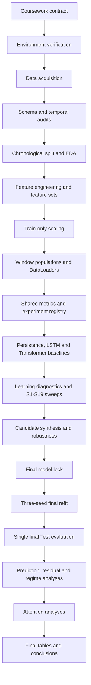

# Deep Learning Lab and Practice

Repository này lưu trữ bài tập thực hành Deep Learning và coursework chính về dự báo mức tiêu thụ năng lượng bằng mô hình chuỗi thời gian đa biến. Phần được tài liệu hóa đầy đủ trong README này là `COURSE_WORK`, nơi triển khai toàn bộ quy trình từ kiểm tra dữ liệu, xây dựng đặc trưng, huấn luyện mô hình, tối ưu siêu tham số, đánh giá trên tập Test khóa, đến phân tích sai số và attention.

## Mục lục

- [Tổng quan coursework](#tổng-quan-coursework)
- [Bài toán và mục tiêu](#bài-toán-và-mục-tiêu)
- [Dữ liệu](#dữ-liệu)
- [Giao thức thực nghiệm](#giao-thức-thực-nghiệm)
- [Mô hình và chỉ số đánh giá](#mô-hình-và-chỉ-số-đánh-giá)
- [Kết quả đã khóa](#kết-quả-đã-khóa)
- [Kiến trúc thư mục](#kiến-trúc-thư-mục)
- [Trách nhiệm của từng tầng](#trách-nhiệm-của-từng-tầng)
- [Luồng xử lý đầu cuối](#luồng-xử-lý-đầu-cuối)
- [Chi tiết Phase 0–59](#chi-tiết-phase-059)
- [Cơ chế artifact, log và selective resume](#cơ-chế-artifact-log-và-selective-resume)
- [Vai trò của notebook](#vai-trò-của-notebook)
- [Cài đặt và sử dụng](#cài-đặt-và-sử-dụng)
- [Kiểm thử và tái lập](#kiểm-thử-và-tái-lập)
- [Tài liệu dự án](#tài-liệu-dự-án)
- [Những gì dự án đã hoàn thành](#những-gì-dự-án-đã-hoàn-thành)
- [Giới hạn và hướng phát triển](#giới-hạn-và-hướng-phát-triển)

## Tổng quan coursework

`COURSE_WORK` giải quyết bài toán hồi quy chuỗi thời gian đa biến trên bộ dữ liệu UCI Appliances Energy Prediction. Hệ thống sử dụng các quan sát lịch sử về nhiệt độ, độ ẩm, điều kiện thời tiết ngoài trời, ánh sáng và các biến liên quan để dự đoán điện năng tiêu thụ của thiết bị gia dụng ở bước thời gian kế tiếp.

Các thành phần chính của coursework gồm:

- Persistence baseline để thiết lập mức tham chiếu tối thiểu.
- LSTM baseline để đại diện cho mô hình tuần tự hồi quy.
- Transformer Encoder cho hồi quy sequence-to-one.
- Chuỗi sweep có kiểm soát để lựa chọn đặc trưng và siêu tham số.
- Giao thức chia dữ liệu theo thời gian và chuẩn hóa chỉ học trên Train.
- Cơ chế khóa Test cho đến giai đoạn đánh giá cuối cùng.
- Đánh giá bằng MAE, RMSE, R² và MAPE bổ sung.
- Phân tích dự đoán, residual, chế độ tiêu thụ, trường hợp sai số lớn và attention.
- Artifact, checksum, signoff và processing log cho khả năng tái lập và chạy tiếp theo trạng thái đã lưu.

Notebook trung tâm của dự án là [CourseWork.ipynb](COURSE_WORK/notebook_course_work/CourseWork.ipynb). Notebook đóng vai trò điều phối và trực quan hóa; phần xử lý nghiệp vụ được đặt trong package `src/course_work`.

## Bài toán và mục tiêu

### Định nghĩa bài toán

Đây là bài toán supervised multivariate time-series regression với cấu trúc sequence-to-one:

\[
X[t-L+1:t] \longrightarrow \widehat{y}[t+1]
\]

Trong đó:

- `X[t-L+1:t]` là cửa sổ lịch sử gồm nhiều biến đầu vào.
- `L` là độ dài lookback.
- `y` là biến mục tiêu `Appliances`.
- Mỗi bước dữ liệu tương ứng 10 phút.
- Forecast horizon là 1 bước, tương đương dự báo trước 10 phút.
- Đơn vị mục tiêu và các sai số MAE, RMSE là watt-hour (`Wh`).

### Mục tiêu nghiên cứu

Dự án trả lời các câu hỏi chính sau:

1. Transformer Encoder có cải thiện dự báo so với persistence baseline và LSTM baseline hay không.
2. Nhóm đặc trưng, time feature, target scaling và lookback nào phù hợp nhất với bài toán.
3. Các lựa chọn pooling, activation, batch size, learning rate, weight decay, dropout, kích thước mô hình, số head, số layer, FFN, loss, epoch cap, gradient clipping và RevIN ảnh hưởng thế nào đến Validation RMSE.
4. Cấu hình tốt nhất có ổn định qua nhiều seed và qua rolling-origin hay không.
5. Mô hình hoạt động thế nào trên tập Test bị khóa.
6. Sai số tập trung ở chế độ tiêu thụ nào và ở các giai đoạn biến động nào.
7. Attention tập trung vào những vị trí lịch sử nào, khác nhau ra sao giữa các head và có ổn định qua seed hay không.

### Phạm vi

Coursework tập trung vào một bộ dữ liệu, một hộ gia đình, bài toán dự báo một bước và một quy trình thực nghiệm ngoại tuyến. Dự án không tuyên bố khả năng triển khai production, khả năng tổng quát hóa sang hộ gia đình khác hoặc quan hệ nhân quả từ attention.

## Dữ liệu

### Nguồn dữ liệu

- Dataset: [UCI Appliances Energy Prediction](https://archive.ics.uci.edu/dataset/374/appliances+energy+prediction).
- Tệp dữ liệu chính: `energydata_complete.csv`.
- Tần suất lấy mẫu: 10 phút.
- Biến mục tiêu: `Appliances`.
- Dạng dữ liệu: chuỗi thời gian đa biến với cảm biến trong nhà, thời tiết ngoài trời, ánh sáng và biến ngẫu nhiên đi kèm bộ dữ liệu gốc.

### Nguyên tắc xử lý dữ liệu

- Giữ nguyên thứ tự thời gian trong mọi bước xử lý.
- Kiểm tra schema, kiểu dữ liệu, timestamp, khoảng lấy mẫu, trùng lặp và giá trị thiếu trước khi tạo đặc trưng.
- Không dùng thông tin tương lai để tạo đặc trưng cho một thời điểm hiện tại.
- Chia Train, Validation và Test theo thời gian, không shuffle trước khi chia.
- Fit scaler trên Train rồi áp dụng cùng tham số cho Validation và Test.
- Chỉ dùng Validation để lựa chọn mô hình và siêu tham số.
- Giữ Test khóa cho đến Phase 47.

### Phân bổ dữ liệu

Giao thức chính sử dụng tỷ lệ thời gian:

| Tập dữ liệu | Tỷ lệ | Vai trò |
|---|---:|---|
| Train | 70% | Học tham số mô hình và fit các phép biến đổi |
| Validation | 15% | Chọn cấu hình, early stopping và so sánh sweep |
| Test | 15% | Đánh giá cuối cùng sau khi khóa mô hình |

Hai giao thức biên cửa sổ được xem xét:

- `WB0_CONTEXT_CARRY_OVER`: cho phép cửa sổ của Validation hoặc Test nhận phần lịch sử cần thiết từ đoạn thời gian ngay trước biên, trong khi target vẫn thuộc đúng tập.
- `WB1_STRICT_ISOLATION`: chỉ tạo cửa sổ từ dữ liệu nằm hoàn toàn trong từng partition.

WB0 là giao thức cuối cùng được khóa cho báo cáo chính.

## Giao thức thực nghiệm

### Nguyên tắc lựa chọn

- Metric lựa chọn chính là Validation RMSE trên thang đo gốc `Wh`.
- MAE và R² được báo cáo đồng thời để mô tả chất lượng dự báo.
- MAPE là metric bổ sung, không thay thế tiêu chí lựa chọn RMSE.
- Mỗi sweep chỉ thay đổi yếu tố đang nghiên cứu và giữ cố định cấu hình tham chiếu còn lại.
- Nếu có hòa chính xác, quy tắc tie-break của từng phase được áp dụng và lưu trong contract.
- Mọi cấu hình thắng được chuyển tiếp qua canonical handoff hoặc reference update.
- Test không được dùng để chọn feature set, hyperparameter hay checkpoint.

### Kiểm soát leakage

Các lớp bảo vệ chính gồm:

- Chronological split trước các phép học từ dữ liệu.
- Train-only scaling cho cả feature và target.
- Cửa sổ dự báo chỉ sử dụng các thời điểm không muộn hơn thời điểm dự báo cho phép.
- Validation chịu trách nhiệm lựa chọn; Test chỉ dùng cho đánh giá cuối.
- Artifact và checksum ghi lại đầu vào, đầu ra và quan hệ phụ thuộc giữa các phase.
- Final model lock đóng băng cấu hình trước khi mở Test.

### Đơn vị thực nghiệm

Mỗi run có mã định danh, cấu hình, seed, metric, checkpoint và metadata. Experiment registry bảo đảm run không bị ghi đè tùy tiện và có thể truy vết ngược về dữ liệu, scaler, window population và cấu hình đã dùng.

## Mô hình và chỉ số đánh giá

### Persistence baseline

Persistence dự đoán mức tiêu thụ ở bước kế tiếp bằng giá trị mục tiêu gần nhất:

\[
\widehat{y}_{t+1}=y_t
\]

Baseline này kiểm tra liệu mô hình học sâu có tạo ra giá trị vượt quá tính tự tương quan ngắn hạn của chuỗi hay không.

### LSTM baseline

LSTM nhận cửa sổ đa biến và tạo dự đoán sequence-to-one. Mô hình đóng vai trò baseline học sâu tuần tự để so sánh với Transformer. Cấu hình LSTM được huấn luyện, tinh chỉnh và kiểm tra robustness trong các phase riêng.

### Transformer Encoder

Transformer sử dụng projection đầu vào, positional encoding, nhiều encoder layer và regression head. Thiết kế hỗ trợ trích xuất attention để phân tích hành vi mô hình sau huấn luyện.

Cấu hình khoa học cuối cùng:

| Thành phần | Giá trị |
|---|---|
| Candidate | `TR_C2_ALT_LOOKBACK` |
| Feature set | `FS2_TF1` |
| Số feature | 33 |
| Lookback | 72 bước, tương đương 12 giờ |
| Forecast horizon | 1 bước, tương đương 10 phút |
| Target scaling | `YS1`, Train-only StandardScaler |
| Feature scaler | `XSCALER__FS2_TF1` |
| Model | Transformer Encoder regression |
| `d_model` | 64 |
| Attention heads | 4 |
| Encoder layers | 2 |
| FFN width | 256 |
| Dropout | 0.1 |
| Activation | GELU |
| Pooling | `LAST_STEP` |
| Positional encoding | Sinusoidal |
| Optimizer | AdamW |
| Learning rate | 0.0003 |
| Weight decay | 0.001 |
| Loss | MSE |
| Gradient clipping | 1.0 |
| Batch size | 32 |
| RevIN | Disabled |
| Boundary protocol | `WB0_CONTEXT_CARRY_OVER` |
| Final refit | 30 epochs trên Train + Validation |
| Final seeds | 42, 123, 2026 |

### Chỉ số đánh giá

| Metric | Ý nghĩa | Vai trò |
|---|---|---|
| MAE | Sai số tuyệt đối trung bình trên thang `Wh` | Dễ diễn giải theo mức sai lệch trung bình |
| RMSE | Căn bậc hai của sai số bình phương trung bình | Metric lựa chọn chính, nhạy với sai số lớn |
| R² | Tỷ lệ phương sai mục tiêu được mô hình giải thích | Đánh giá mức cải thiện so với dự đoán trung bình |
| MAPE | Sai số phần trăm tuyệt đối trung bình | Metric bổ sung, cần xử lý rõ trường hợp target bằng hoặc gần 0 |

MAPE đã được bổ sung vào lớp metric dùng chung và được kiểm tra trên các nguồn Validation hiện có. Addendum hiện có trạng thái `PASS_WITH_BLOCKED_TEST_EXTENSION`: phần Validation hợp lệ, nhưng Test MAPE chưa được tuyên bố vì bundle dự đoán Test đóng băng cần thiết không khả dụng hoặc không hợp lệ. Dự án không chạy lại Test chỉ để điền MAPE, nhằm giữ nguyên giao thức đánh giá đã khóa.

## Kết quả đã khóa

### Kết quả trên Final Test

Tập đánh giá cuối là `FINAL_TEST_POP-v1` với 2.961 mẫu. Transformer được chạy với ba seed 42, 123 và 2026.

| Mô hình | MAE (Wh) | RMSE (Wh) | R² | Ghi chú |
|---|---:|---:|---:|---|
| Persistence | 26.7376 | 66.8369 | 0.4590 | Baseline task-level |
| Transformer, trung bình 3 seed | 28.5286 ± 1.2589 | 63.8297 ± 1.6080 | 0.5064 ± 0.0247 | Mô hình cuối đã khóa |

Transformer đạt RMSE và R² tốt hơn persistence trên tập Test, nhưng MAE cao hơn. Kết quả này cho thấy mô hình cải thiện sai số bình phương tổng thể và khả năng giải thích phương sai, trong khi persistence vẫn cạnh tranh mạnh về sai số tuyệt đối trung bình.

LSTM không được gán kết quả trên `FINAL_TEST_POP-v1` vì checkpoint LSTM và cấu hình cuối của Transformer dùng lookback khác nhau (`L36` so với `L72`). Dự án không ghép các population không tương thích để tạo ra một so sánh Test thiếu công bằng.

### Kết quả phân tích

- Sai số tăng trong các giai đoạn tiêu thụ cao và biến động nhanh.
- Các trường hợp sai số lớn nhất đã được kiểm tra và giữ lại như quan sát hợp lệ thay vì tự động xem là dữ liệu lỗi.
- Attention có xu hướng tập trung đáng kể vào phần lịch sử gần thời điểm dự báo.
- Các attention head không có hồ sơ giống hệt nhau, cho thấy sự phân hóa hành vi giữa head.
- Phân tích attention theo nhóm sai số chỉ mang tính mô tả, không được diễn giải như quan hệ nhân quả hoặc feature importance tuyệt đối.
- Attention trung bình theo head ở cấp layer ổn định hơn khi so sánh qua seed so với từng head riêng lẻ.

Tóm tắt kết quả chính thức nằm tại [FINAL_PROJECT_SUMMARY.md](COURSE_WORK/artifacts/final_conclusions/FINAL_PROJECT_SUMMARY.md).

## Kiến trúc thư mục

Cấu trúc dưới đây phản ánh filesystem hiện tại của `COURSE_WORK`:

```text
COURSE_WORK/
├── artifacts/
├── configs/
│   └── base/
├── docs/
│   ├── analysis_error/
│   ├── current_flow/
│   ├── link&discussion_to_result/
│   ├── plan/
│   │   ├── plan_before_process/
│   │   ├── plan_detail_for_each_phase/
│   │   ├── plan_overview/
│   │   └── plan_to_refactor&fix/
│   ├── rule_base/
│   └── save_log_in_processing/
├── link/
│   ├── interim/
│   └── raw_data/
├── notebook_course_work/
│   └── CourseWork.ipynb
├── scripts/
├── src/
│   └── course_work/
│       ├── analysis/
│       ├── attention/
│       ├── baselines/
│       ├── contracts/
│       ├── data/
│       ├── diagnostics/
│       ├── evaluation/
│       ├── experiments/
│       ├── final_model_lock/
│       ├── final_test_evaluation/
│       ├── lstm_tuning/
│       ├── metric_addendum/
│       ├── models/
│       ├── reporting/
│       ├── rolling_origin/
│       ├── sanity/
│       ├── scaling/
│       ├── scripts/
│       ├── sweeps/
│       ├── training/
│       ├── utils/
│       └── verification/
├── tests/
│   ├── contracts/
│   ├── integration/
│   └── unit/
├── pyproject.toml
└── requirements.txt
```

Một số tài liệu kiến trúc cũ vẫn mô tả dữ liệu dưới đường dẫn `data/` và phạm vi phase trước khi dự án mở rộng. Filesystem hiện tại sử dụng `link/raw_data` và `link/interim`; README này lấy cấu trúc thực tế làm nguồn tham chiếu. Khi chỉnh sửa kiến trúc trong tương lai, cần đồng bộ lại tài liệu rule tương ứng thay vì tự động di chuyển dữ liệu trong một tác vụ tài liệu.

## Trách nhiệm của từng tầng

### `COURSE_WORK/configs`

Chứa contract và cấu hình đầu vào ổn định. `configs/base/coursework_contract.json` xác định bài toán, target, horizon, đơn vị, tiêu chí đánh giá, giao thức thời gian và các ràng buộc cốt lõi. Cấu hình phải được version hóa và fingerprint trước khi dùng làm đầu vào cho artifact.

### `COURSE_WORK/link`

- `raw_data`: dữ liệu nguồn, gói tải về, metadata, checksum và acquisition manifest.
- `interim`: dữ liệu trung gian sau các bước làm sạch hoặc feature engineering nhưng trước những tầng downstream tương ứng.

Tầng này chứa dữ liệu và metadata dữ liệu; không chứa logic huấn luyện hoặc code trực quan hóa.

### `COURSE_WORK/src/course_work/data`

Chịu trách nhiệm cho acquisition, schema audit, temporal audit, feature engineering, feature-set registry, chronological split, window construction và DataLoader preparation. Mỗi module nên chỉ phục vụ một nhóm trách nhiệm dữ liệu rõ ràng.

### `COURSE_WORK/src/course_work/scaling`

Quản lý feature scaler và target scaler, đặc biệt là quy tắc fit trên Train. Scaler phải được lưu thành artifact kèm metadata để các phase sau tái sử dụng đúng phiên bản.

### `COURSE_WORK/src/course_work/models`

Chứa định nghĩa LSTM, Transformer và các component như attention, encoder layer, positional encoding, LoRA hoặc RevIN. Tầng model chỉ định nghĩa kiến trúc và forward behavior; không đảm nhiệm orchestration của sweep hoặc trình bày notebook.

### `COURSE_WORK/src/course_work/training`

Chứa training engine, checkpointing, early stopping, pretraining, fine-tuning và reproducibility utilities. Tầng này nhận model, DataLoader và contract để thực hiện huấn luyện có thể tái lập.

### `COURSE_WORK/src/course_work/evaluation`

Chứa metric dùng chung, inference và các hàm đánh giá. Metric phải được tính trên thang đo quy định, dùng cùng implementation giữa các mô hình và không tự ý mở Test.

### `COURSE_WORK/src/course_work/experiments`

Quản lý registry, sweep orchestration, adaptation và final reference. Tầng này quyết định run nào cần thực thi hoặc có thể tái sử dụng dựa trên artifact hiện có.

### `COURSE_WORK/src/course_work/sweeps`

Mỗi phase sweep có module chuyên trách cho contract, prerequisite, condition evidence, training invocation, winner selection, signoff và reference update. Các sweep sử dụng Validation RMSE làm metric lựa chọn và giữ nguyên Test firewall.

### `COURSE_WORK/src/course_work/analysis`

Chứa các phân tích sau khi mô hình đã được khóa và đánh giá: prediction, residual, error regime, worst error, attention extraction, heatmap, last-query, head comparison, error-conditioned attention, seed stability, final tables và final conclusions.

### `COURSE_WORK/src/course_work/reporting`

Chuyển artifact JSON hoặc bảng kết quả thành HTML tĩnh phù hợp với notebook. Reporting không huấn luyện model, không thay đổi artifact khoa học và không quyết định winner.

### `COURSE_WORK/src/course_work/contracts` và `verification`

- `contracts`: định nghĩa và materialize các giao kèo giữa phase.
- `verification`: kiểm tra checksum, schema, quan hệ phụ thuộc, trạng thái prerequisite và tính nhất quán của artifact.

### `COURSE_WORK/scripts`

Chứa entry point chạy từ terminal, công cụ bảo trì, selective execution và recovery. Các tác vụ huấn luyện tốn tài nguyên được chạy tại đây hoặc qua module Python tương ứng, không đặt trực tiếp trong notebook.

### `COURSE_WORK/artifacts`

Lưu đầu ra khoa học của từng phase, gồm JSON, CSV, model checkpoint, scaler, prediction bundle, figure, table, manifest, signoff và checksum. Đây là nguồn dữ liệu đầu vào cho các phase downstream và cho chế độ resume.

### `COURSE_WORK/docs/save_log_in_processing`

Lưu processing log rút gọn theo phase. Log cho biết phase đã chạy chưa, trạng thái, artifact liên quan, điều kiện thiếu và hành động tiếp theo. Log hỗ trợ notebook hiển thị kết quả mà không phải chạy lại toàn bộ pipeline.

### `COURSE_WORK/notebook_course_work`

Chứa notebook trình bày. Notebook gọi API từ package, đọc artifact hoặc processing log, và hiển thị HTML. Notebook không phải nơi đặt thuật toán xử lý dữ liệu, vòng lặp train, logic sweep hay quy tắc chọn winner.

### `COURSE_WORK/tests`

- `unit`: kiểm tra hàm và module độc lập.
- `integration`: kiểm tra liên kết giữa các tầng và phase.
- `contracts`: kiểm tra schema, invariant và giao kèo khoa học.

### `COURSE_WORK/docs`

Chứa kế hoạch, phân tích lỗi, quy tắc kiến trúc, mô tả current flow, walkthrough notebook, kết quả thảo luận và hồ sơ refactor. Tài liệu phải phản ánh artifact đã tạo, không thay thế artifact khoa học.

## Luồng xử lý đầu cuối



Mỗi mũi tên biểu thị một quan hệ phụ thuộc có thể được kiểm tra bằng artifact, manifest, checksum hoặc signoff. Phase downstream không nên dựa vào biến còn tồn tại trong bộ nhớ notebook nếu cùng dữ liệu đã được materialize thành artifact.

## Chi tiết Phase 0–59

### Phase 0–14: hợp đồng, dữ liệu và baseline tối thiểu

| Phase | Tên | Công việc chính | Đầu ra tiêu biểu |
|---:|---|---|---|
| 0 | Coursework Contract | Khóa bài toán, target, horizon, protocol, metric, câu hỏi nghiên cứu và leakage control | Contract JSON, fingerprint, signoff |
| 1 | Environment | Kiểm tra Python, kernel, package, device và deterministic setup | Environment report, signoff |
| 2 | Data Acquisition | Xác nhận nguồn, checksum, metadata và tệp dữ liệu gốc | Acquisition manifest, raw dataset evidence |
| 3 | Schema Audit | Kiểm tra cột, kiểu dữ liệu, target, null, duplicate và miền giá trị | Schema manifest, discrepancy report |
| 4 | Temporal Integrity Audit | Kiểm tra timestamp, thứ tự, tần suất và khoảng trống thời gian | Temporal manifest, signoff |
| 5 | Chronological Split | Gán quan sát vào Train, Validation và Test theo thời gian | Split manifest, membership và fingerprints |
| 6 | Exploratory Data Analysis | Khảo sát phân phối, thống kê, tương quan và hành vi theo thời gian | EDA tables, figures, report |
| 7 | Feature Engineering | Tạo time feature và đặc trưng hợp lệ theo thời gian | Feature-engineered data, feature manifest |
| 8 | Feature-Set Variants | Đăng ký các nhóm feature dùng cho thí nghiệm | Feature-set registry, signoff |
| 9 | Train-Only Scaling | Fit feature và target scaler trên Train | Scaler artifacts, scaling manifest |
| 10 | Window Builder | Tạo cửa sổ sequence-to-one theo lookback và horizon | Window populations, boundary metadata |
| 11 | DataLoaders | Đóng gói tensor và DataLoader theo partition | Loader manifest, batch evidence |
| 12 | Shared Metrics | Chuẩn hóa MAE, RMSE, R² và contract metric dùng chung | Metric contract, verification output |
| 13 | Experiment Registry | Đăng ký run, cấu hình, seed và quan hệ artifact | Experiment registry, run identity |
| 14 | Persistence Baseline | Đánh giá dự báo `y(t+1)=y(t)` trên Validation | Baseline metrics, predictions, signoff |

Phase 0 là contract nội bộ và có thể được ẩn khỏi phần trình bày chính của notebook, nhưng vẫn là dependency khoa học của toàn pipeline.

### Phase 15–22: mô hình và baseline học sâu

| Phase | Tên | Công việc chính | Đầu ra tiêu biểu |
|---:|---|---|---|
| 15 | LSTM Implementation | Xây dựng LSTM regression theo input contract | Model definition, shape checks |
| 16 | Transformer Implementation | Xây dựng Transformer Encoder regression | Model definition, configuration contract |
| 17 | Attention-Aware Encoder Verification | Xác minh attention có thể được trích xuất đúng hình dạng | Attention verification artifact |
| 18 | Forward-Pass Sanity Tests | Kiểm tra shape, finite output và forward behavior | Sanity signoff |
| 19 | Baseline Training Engine | Chuẩn hóa train loop, validation, checkpoint và early stopping | Engine verification, training contract |
| 20 | LSTM Baseline Run | Huấn luyện và đánh giá LSTM trên Validation | Checkpoint, history, metrics, signoff |
| 21 | Transformer B0 Run | Huấn luyện Transformer cấu hình gốc | Checkpoint, history, metrics, signoff |
| 22 | Learning-Curve Diagnostics | Phân tích train/validation curves và dấu hiệu underfit hoặc overfit | Diagnostic report, curves |

### Phase 23–41: chuỗi sweep S1–S19

| Phase | Sweep | Yếu tố thay đổi | Mục đích |
|---:|---|---|---|
| 23 | S1 | Feature set | Chọn nhóm biến đầu vào |
| 24 | S2 | Time feature | Chọn biểu diễn thời gian |
| 25 | S3 | Target scaling | Chọn cách chuẩn hóa target |
| 26 | S4 | Lookback | Chọn chiều dài lịch sử |
| 27 | S5 | Pooling | Chọn cách gom representation theo thời gian |
| 28 | S6 | Activation | Chọn activation của encoder |
| 29 | S7 | Batch size | Chọn kích thước batch |
| 30 | S8 | Learning rate | Chọn tốc độ học AdamW |
| 31 | S9 | Weight decay | Chọn mức regularization của AdamW |
| 32 | S10 | Dropout | Chọn dropout tại các vị trí encoder |
| 33 | S11 | `d_model` | Chọn chiều rộng embedding Transformer |
| 34 | S12 | Attention heads | Chọn số multi-head attention head |
| 35 | S13 | Encoder layers | Chọn độ sâu encoder |
| 36 | S14 | FFN width | Chọn chiều rộng feed-forward network |
| 37 | S15 | Loss | So sánh hàm loss huấn luyện |
| 38 | S16 | Epoch cap | Chọn giới hạn epoch phù hợp |
| 39 | S17 | Gradient clipping | Đánh giá ngưỡng clipping |
| 40 | S18 | RevIN | Đánh giá normalization đảo ngược |
| 41 | S19 | Boundary protocol | So sánh WB0 và WB1, kiểm tra tính hợp lệ biên |

Mỗi sweep tạo condition evidence, results, winner, reference update và phase signoff. Khi artifact hợp lệ đã tồn tại, phase có thể tái sử dụng kết quả thay vì train lại.

### Phase 42–47: tổng hợp, khóa mô hình và Test

| Phase | Tên | Công việc chính | Đầu ra tiêu biểu |
|---:|---|---|---|
| 42 | Candidate Synthesis | Tổng hợp các cấu hình Transformer ứng viên từ sweep | Candidate registry, comparison evidence |
| 43 | LSTM Tuning | Tinh chỉnh baseline LSTM theo protocol Validation | LSTM tuning artifacts |
| 44 | Rolling-Origin Robustness | Đánh giá độ bền theo nhiều origin thời gian | Fold metrics, robustness report |
| 45 | Final Model Lock | Chọn và đóng băng model, feature, scaler, window và training recipe | Final lock, frozen config, checksums |
| 46 | Three-Seed Final Runs | Refit cấu hình khóa trên Train + Validation với ba seed | Checkpoints, histories, prediction bundles |
| 47 | Final Test Evaluation | Mở Test một lần theo protocol và tính metric cuối | Final Test metrics, comparison tables, signoff |

### Phase 48–59: phân tích và kết luận

| Phase | Tên | Công việc chính | Đầu ra tiêu biểu |
|---:|---|---|---|
| 48 | Prediction Analysis | So sánh dự đoán và giá trị thật theo thời gian | Prediction figures, summary tables |
| 49 | Residual Analysis | Khảo sát bias, phân phối residual và cấu trúc theo thời gian | Residual plots, diagnostics |
| 50 | Error-by-Regime Analysis | Phân tích sai số theo mức tiêu thụ và chế độ biến động | Regime tables, figures |
| 51 | Worst-Error Analysis | Xác minh các mẫu sai số lớn và ngữ cảnh xung quanh | Worst-case table, audit evidence |
| 52 | Attention Extraction | Trích xuất tensor attention từ model đã khóa | Attention bundles, metadata |
| 53 | Attention Heatmaps | Trực quan attention theo layer, head và sample | Heatmaps, figure manifest |
| 54 | Last-Query Attention | Phân tích attention từ query cuối đến toàn bộ lookback | Lag profile, summary |
| 55 | Head Comparison | So sánh mức độ khác biệt giữa attention head | Head metrics, comparison plots |
| 56 | Error-Conditioned Attention | So sánh attention giữa nhóm sai số thấp và cao | Conditioned summaries |
| 57 | Seed-Stability Attention Check | Kiểm tra độ ổn định attention qua seed | Stability metrics, signoff |
| 58 | Final Results Summary | Chuẩn hóa bảng kết quả cuối và liên kết nguồn | Final tables, evidence map |
| 59 | Final Conclusions | Khóa kết luận khoa học, giới hạn và trạng thái hoàn tất | Final conclusions, project summary, signoff |

## Cơ chế artifact, log và selective resume

### Vì sao không chạy lại toàn bộ notebook

Các phase huấn luyện và sweep có thể tốn nhiều thời gian và tài nguyên. Dự án materialize kết quả theo phase để một phase downstream có thể đọc trạng thái đã lưu, kiểm tra đủ điều kiện và chỉ thực thi phần còn thiếu.

### Các lớp trạng thái

1. `artifacts`: nguồn bằng chứng khoa học đầy đủ, gồm kết quả, model, scaler, prediction và signoff.
2. `docs/save_log_in_processing`: log trình bày và trạng thái rút gọn cho từng phase.
3. Experiment registry: định danh run, cấu hình và quan hệ giữa run với artifact.
4. Checksum và fingerprint: xác minh artifact chưa bị thay đổi ngoài quy trình.
5. Prerequisite resolver: quyết định `REUSE`, `RUN_MISSING`, `REFRESH` hoặc `BLOCK` tùy trạng thái đầu vào.

### Quy trình selective resume

```text
Chọn phase cần tiếp tục
        |
        v
Đọc processing log và signoff đã có
        |
        v
Xác minh prerequisite, checksum và environment
        |
        +--> Hợp lệ và đầy đủ: tái sử dụng artifact
        |
        +--> Thiếu condition: chỉ chạy condition còn thiếu
        |
        +--> Artifact stale nhưng có thể tái tạo: refresh đúng phạm vi
        |
        +--> Upstream không hợp lệ hoặc Test firewall vi phạm: block
        |
        v
Cập nhật artifact, signoff và processing log
        |
        v
Notebook đọc JSON và render HTML tĩnh
```

Trạng thái như `VALID_REUSABLE` mô tả khả năng tái sử dụng artifact, không phải lỗi và cũng không đồng nghĩa với `BLOCKED`. Reporting layer cần chuẩn hóa trạng thái này thành thông tin dễ hiểu trong overview mà không thay đổi trạng thái khoa học gốc.

### Nguyên tắc sử dụng

- Không xem output còn trong kernel là nguồn sự thật.
- Không bỏ qua prerequisite chỉ vì file đích đã tồn tại.
- Không sửa thủ công winner hoặc signoff để vượt qua trạng thái block.
- Không chạy lại Test khi chưa có lý do được protocol cho phép.
- Khi environment khác với environment đã ghi, phải xác minh compatibility trước khi tái sử dụng checkpoint hoặc artifact nhạy cảm.

## Vai trò của notebook

[CourseWork.ipynb](COURSE_WORK/notebook_course_work/CourseWork.ipynb) là giao diện trình bày của pipeline.

Notebook được phép:

- Import API công khai từ `course_work`.
- Gọi entry point materialize hoặc render của phase.
- Đọc JSON, CSV, figure và metadata đã được tạo.
- Hiển thị bảng, biểu đồ và HTML tĩnh.
- Trình bày định nghĩa bài toán, quyết định thực nghiệm và kết quả.

Notebook không nên:

- Chứa vòng lặp huấn luyện hoặc logic tối ưu siêu tham số.
- Tự xây dựng feature, scaler, split hoặc window bằng code nghiệp vụ nội tuyến.
- Tự chọn winner bằng logic chỉ tồn tại trong cell.
- Phụ thuộc vào thứ tự chạy cell để giữ dữ liệu quan trọng trong bộ nhớ.
- Dùng widget state làm nguồn duy nhất cho kết quả đã lưu.
- Chạy lại toàn pipeline khi chỉ cần render một phase từ artifact.

HTML được tạo ở reporting layer phải là output tĩnh có thể hiển thị ổn định trong Jupyter và VS Code. Cách này tránh lỗi mất widget model khi notebook được mở ở môi trường khác.

## Cài đặt và sử dụng

### Yêu cầu môi trường

- Python từ 3.10 và nhỏ hơn 3.11.
- Môi trường ảo riêng cho coursework.
- Các dependency theo `requirements.txt` hoặc metadata trong `pyproject.toml`.

### Tạo môi trường

Từ thư mục gốc repository:

```bash
cd COURSE_WORK
python3.10 -m venv .venv
source .venv/bin/activate
python -m pip install --upgrade pip
python -m pip install -r requirements.txt
python -m pip install -e .
```

Editable install giúp notebook và script import `course_work` từ `src/course_work` mà không chèn đường dẫn thủ công vào từng cell.

### Mở notebook

```bash
cd COURSE_WORK
jupyter notebook notebook_course_work/CourseWork.ipynb
```

Chọn đúng kernel thuộc `.venv`. Trước khi chạy một phase, đọc phần prerequisite và trạng thái artifact của phase đó. Với phase đã materialize, ưu tiên cell render từ JSON thay vì chạy lại training.

### Chạy module hoặc script từ terminal

Các phase tốn tài nguyên phải được chạy bằng entry point hiện có trong `COURSE_WORK/scripts` hoặc module tương ứng dưới `src/course_work`. Trước khi chạy:

1. Kích hoạt đúng virtual environment.
2. Đứng tại thư mục `COURSE_WORK`.
3. Kiểm tra processing log của phase trước.
4. Kiểm tra artifact và signoff prerequisite.
5. Chỉ chạy phase hoặc condition cần thiết.
6. Xác minh output, checksum, signoff và log ngay sau khi hoàn thành.

Tên lệnh cụ thể phụ thuộc phase. Không suy đoán tên script từ tên phase; đối chiếu [walkthrough notebook](COURSE_WORK/docs/link&discussion_to_result/NOTEBOOK_CELLS_WALKTHROUGH.md), kế hoạch phase và nội dung `COURSE_WORK/scripts` trước khi thực thi.

## Kiểm thử và tái lập

### Chạy test

```bash
cd COURSE_WORK
source .venv/bin/activate
python -m pytest tests
```

Có thể chạy test theo tầng:

```bash
python -m pytest tests/unit
python -m pytest tests/integration
python -m pytest tests/contracts
```

### Kiểm tra tối thiểu sau mỗi thay đổi

- Import module đã sửa.
- Chạy unit test liên quan trực tiếp.
- Chạy contract hoặc integration test của phase.
- Xác minh upstream artifact vẫn hợp lệ.
- Xác minh phase signoff không báo discrepancy mới.
- Kiểm tra notebook render được artifact mới mà không huấn luyện lại.
- Kiểm tra Test firewall nếu thay đổi liên quan split, scaler, window, metric hoặc evaluation.

### Tái lập kết quả

Khả năng tái lập dựa trên:

- Environment report và phiên bản dependency.
- Fixed seed và deterministic configuration khi được hỗ trợ.
- Dataset checksum và manifest.
- Config fingerprint.
- Train-only scaler artifact.
- Window population identity.
- Run ID, checkpoint metadata và experiment registry.
- Phase signoff và checksum đầu vào/đầu ra.
- Final model lock trước Test.

Phase 59 ghi nhận 49 acceptance check của chính phase này đều đạt. Con số này mô tả bộ acceptance của Phase 59, không được hiểu là tổng số test hiện có trong toàn repository.

## Tài liệu dự án

### Quy tắc và kiến trúc

- [Quy tắc làm việc chung](working_rule.md)
- [Quy tắc kiến trúc](COURSE_WORK/docs/rule_base/architecture_rule.md)
- [Quy tắc code](COURSE_WORK/docs/rule_base/rule_code.md)

### Kế hoạch và phân tích yêu cầu

- [Phân tích yêu cầu và kế hoạch](COURSE_WORK/docs/plan/plan_overview/Requirement_analyst_&_plan_to_make.md)
- [Kế hoạch chính](COURSE_WORK/docs/plan/plan_overview/Main_plan.md)
- [Kế hoạch chi tiết từng phase](COURSE_WORK/docs/plan/plan_detail_for_each_phase)
- [Phân tích lỗi](COURSE_WORK/docs/analysis_error)
- [Kế hoạch trước xử lý](COURSE_WORK/docs/plan/plan_before_process)
- [Hồ sơ refactor và fix](COURSE_WORK/docs/plan/plan_to_refactor&fix)

### Current flow và kết quả

- [Tổng hợp current flow](COURSE_WORK/docs/current_flow/CURRENT_FLOW_SUMMARY.md)
- [Chi tiết Phase 1–33](COURSE_WORK/docs/current_flow/PHASE_1_TO_33_CURRENT_FLOW_DETAIL.md)
- [Chi tiết Phase 34–59](COURSE_WORK/docs/current_flow/PHASE_34_TO_59_CURRENT_FLOW_DETAIL.md)
- [Walkthrough notebook và liên kết cell](COURSE_WORK/docs/link&discussion_to_result/NOTEBOOK_CELLS_WALKTHROUGH.md)
- [Tóm tắt dự án cuối](COURSE_WORK/artifacts/final_conclusions/FINAL_PROJECT_SUMMARY.md)

## Những gì dự án đã hoàn thành

- Xây dựng pipeline đầy đủ từ contract đến kết luận cuối cho 60 phase đánh số 0–59.
- Audit schema và tính toàn vẹn thời gian trước khi huấn luyện.
- Triển khai chronological split, Train-only scaling và window protocol có kiểm soát leakage.
- Xây dựng persistence baseline, LSTM baseline và Transformer Encoder regression.
- Chuẩn hóa training engine, metric, registry, checkpoint và reproducibility metadata.
- Thực hiện chuỗi 19 sweep từ feature set đến boundary protocol.
- Tổng hợp candidate, đánh giá rolling-origin và khóa cấu hình cuối trước Test.
- Refit Transformer với ba seed và thực hiện Final Test evaluation theo population khóa.
- Bổ sung MAPE có safe policy mà không thay đổi metric lựa chọn RMSE.
- Thực hiện prediction analysis, residual analysis, error-by-regime và worst-error audit.
- Trích xuất và phân tích attention theo heatmap, last query, head, mức sai số và seed.
- Tạo final tables, project summary, conclusion signoff và evidence map.
- Tách logic xử lý khỏi notebook, dùng artifact JSON và HTML reporting để hỗ trợ selective resume.

## Giới hạn và hướng phát triển

### Giới hạn hiện tại

- Dữ liệu đến từ một hộ gia đình nên chưa chứng minh được khả năng tổng quát hóa rộng.
- Bài toán chỉ dự báo một bước 10 phút; chưa đánh giá multi-horizon forecasting.
- Chuỗi sweep tuần tự hiệu quả về chi phí nhưng không khám phá đầy đủ tương tác giữa mọi hyperparameter.
- Ba seed cung cấp ước lượng độ ổn định ban đầu nhưng chưa phải phân tích bất định quy mô lớn.
- Dữ liệu chuỗi thời gian có phụ thuộc mạnh nên không thể diễn giải các mẫu như quan sát độc lập.
- Attention là bằng chứng mô tả hành vi mô hình, không phải giải thích nhân quả.
- LSTM và Transformer cuối không dùng cùng lookback population, vì vậy chưa có so sánh LSTM–Transformer cuối trên cùng `FINAL_TEST_POP-v1`.
- Test MAPE chưa được công bố do thiếu bundle dự đoán đóng băng hợp lệ cho phép tính bổ sung mà không chạy lại Test.

### Hướng phát triển phù hợp

- Đánh giá multi-horizon và direct multi-output forecasting.
- Thực hiện nested hoặc blocked time-series validation khi ngân sách cho phép.
- So sánh các mô hình time-series hiện đại khác trên cùng protocol và cùng population.
- Mở rộng sang nhiều hộ gia đình hoặc domain khác để kiểm tra external validity.
- Nghiên cứu uncertainty estimation và prediction interval.
- Thêm kiểm tra drift và quy trình inference phục vụ triển khai.
- Tạo prediction bundle chuẩn ngay tại Final Test để mọi metric bổ sung có thể được tính mà không mở lại Test.
- Đồng bộ toàn bộ tài liệu kiến trúc cũ với filesystem hiện tại và phạm vi Phase 0–59 trong một tác vụ quản trị tài liệu riêng.

## Trạng thái dự án

Luồng khoa học Phase 0–59 đã hoàn tất và kết luận cuối đã được khóa trong artifact Phase 59. Mọi thay đổi tiếp theo có khả năng ảnh hưởng đến kết quả khoa học phải bắt đầu bằng phân tích phạm vi, kế hoạch được duyệt, kiểm tra dependency và một phiên bản artifact mới; không ghi đè im lặng lên kết quả đã khóa.
