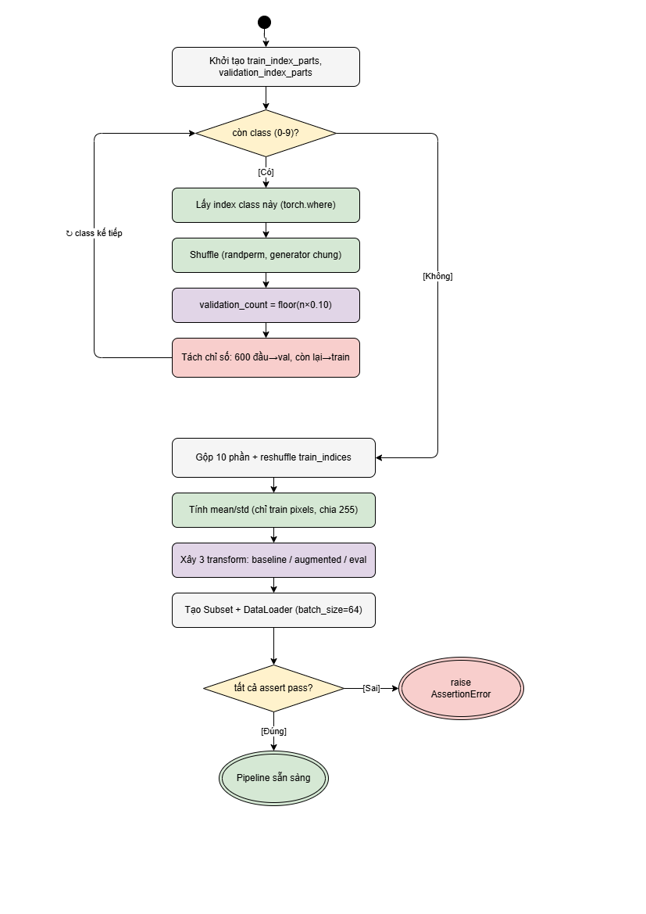
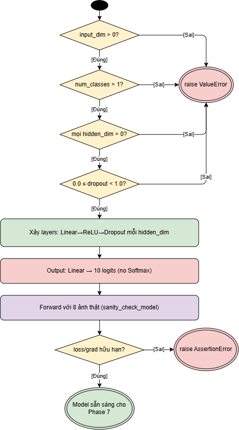
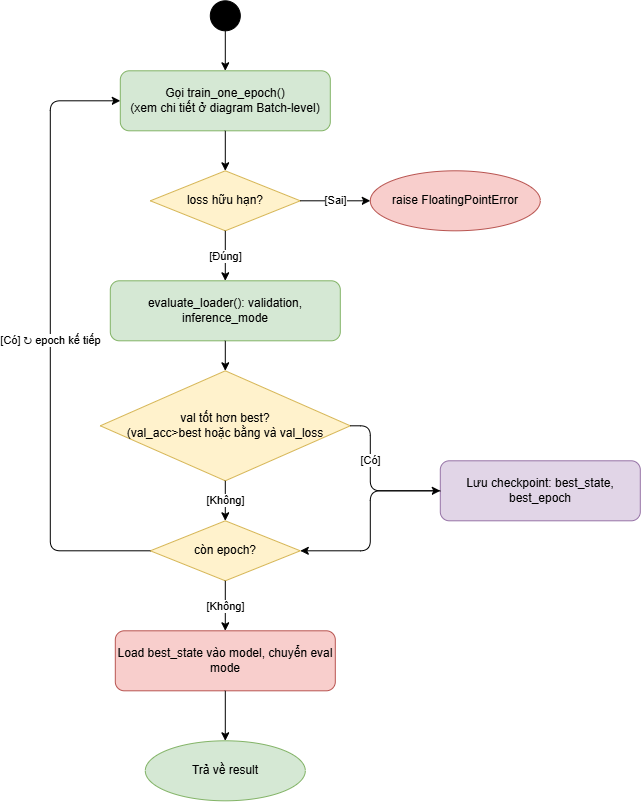
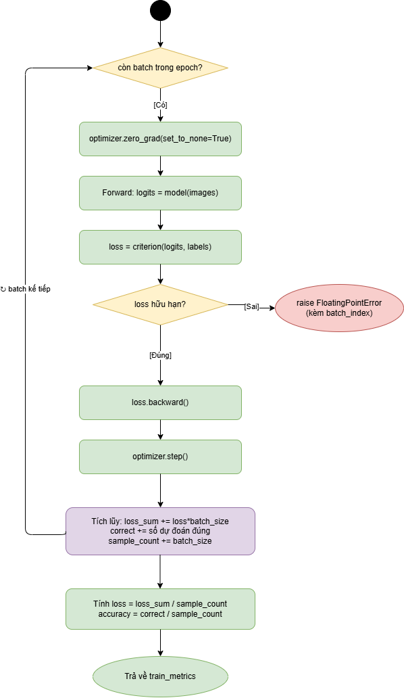

# PyTorch FashionMNIST Classification

## 1. Giới thiệu

Project này triển khai một pipeline Deep Learning hoàn chỉnh bằng PyTorch để
phân loại ảnh FashionMNIST vào 10 nhóm trang phục. Deliverable trung tâm là
notebook [`practice_1.ipynb`](practice_1.ipynb), được tổ chức thành chín phase từ
định nghĩa bài toán đến lưu, nạp lại và trực quan hóa dự đoán của model.

Project phục vụ hai mục tiêu song song:

- Học đúng các thành phần nền tảng của PyTorch: tensor, Dataset, DataLoader,
  transform, `nn.Module`, Autograd, loss, optimizer và checkpoint.
- Xây một baseline có evaluation protocol rõ ràng, tránh data leakage và có thể
  giải thích được toàn bộ modeling decision.

### 1.1. Bài toán

| Thuộc tính | Giá trị |
|---|---|
| Learning paradigm | Supervised learning |
| Task | Single-label multi-class classification |
| Dataset | FashionMNIST |
| Input | Ảnh grayscale `28 x 28` |
| Tensor input | `[batch_size, 1, 28, 28]`, `torch.float32` |
| Target | Một class index trong `[0, 9]`, `torch.int64` |
| Model output | 10 raw logits |
| Optimization objective | `CrossEntropyLoss` |
| Primary metric | Accuracy |
| Supporting metrics | Loss, precision, recall, F1-score và confusion matrix |
| Baseline model | Configurable multi-layer perceptron |

Contract đầy đủ của bài toán được khóa trước khi modeling tại
[Cell 1][cell-1].

### 1.2. Trạng thái hiện tại

Notebook hiện có một stored run hoàn chỉnh với execution count liên tục từ
`In [1]` đến `In [54]`. Stored run đã thực hiện đủ data loading, EDA,
preprocessing, training, validation, final retraining, official-test evaluation
và checkpoint round trip.

| Hạng mục | Trạng thái hiện tại |
|---|---|
| Độ phủ yêu cầu bài tập | Đầy đủ trong notebook |
| Data split và leakage control | Đúng protocol |
| Stored training/evaluation outputs | Có |
| Final checkpoint | Có và load được |
| Clean-kernel `Run All` | Chưa đạt |
| EDA numerical health | Còn runtime warnings tại bốn cell |
| Dependency lock | Chưa có |

Hai giới hạn cần hiểu trước khi chạy lại:

1. [Cell 10][cell-10] import `practice_1.processing_own_phase.data` và
   `practice_1.processing_own_phase.visualize`, nhưng package
   `processing_own_phase/` không tồn tại trong project hiện tại.
2. Stored outputs tại [Cell 27][cell-27], [Cell 29][cell-29],
   [Cell 32][cell-32] và [Cell 36][cell-36] chứa numerical warnings từ
   scikit-learn linear algebra operations.

Vì vậy, stored results có thể được đọc và audit, nhưng chưa nên tuyên bố project
`clean-run reproducible` cho tới khi hai vấn đề trên được xử lý. Chi tiết nằm
trong [Code Base Audit](description/code_base_audit/code_base_audit.md).

## 2. Điều hướng nhanh

### 2.1. Tài liệu chính

| Tài liệu | Vai trò |
|---|---|
| [Notebook](practice_1.ipynb) | Source code, Markdown và stored outputs của toàn pipeline |
| [Mô tả từng phase](description/description_own_phase/README.md) | Giải thích chi tiết và deep-link tới code/output từng phase |
| [Chỉ mục kết quả](description/description_result/README.md) | Danh sách ngắn gọn 40 cell kết quả đang lưu |
| [Code Base Audit](description/code_base_audit/code_base_audit.md) | Đánh giá correctness, reproducibility, findings và release gate |
| [Notebook-link helper](tools/vscode-notebook-links/README.md) | Cách cài extension mở chính xác notebook cell từ Markdown |

### 2.2. Bản đồ phase

| Phase | Phạm vi notebook | Trách nhiệm | Mô tả | Kết quả |
|---|---:|---|---|---|
| 1 - Problem Definition | Cell 1 | Khóa task, tensor contract, metric và protocol | [Chi tiết](description/description_own_phase/phase_01_problem_definition.md) | [Outputs](description/description_result/phase_01_results.md) |
| 2 - Environment Setup | Cell 2-5 | Paths, versions và imports | [Chi tiết](description/description_own_phase/phase_02_environment_setup.md) | [Outputs](description/description_result/phase_02_results.md) |
| 3 - Data Loading | Cell 6-7 | Load hai official partitions | [Chi tiết](description/description_own_phase/phase_03_data_loading.md) | [Outputs](description/description_result/phase_03_results.md) |
| 4 - Exploratory Data Analysis | Cell 8-43 | Audit official training pool | [Chi tiết](description/description_own_phase/phase_04_exploratory_data_analysis.md) | [Outputs](description/description_result/phase_04_results.md) |
| 5 - Data Preprocessing | Cell 44-54 | Split, normalize, transform và DataLoader | [Chi tiết](description/description_own_phase/phase_05_data_preprocessing.md) | [Outputs](description/description_result/phase_05_results.md) |
| 6 - Model Building | Cell 55-59 | Xây MLP và sanity check | [Chi tiết](description/description_own_phase/phase_06_model_building.md) | [Outputs](description/description_result/phase_06_results.md) |
| 7 - Model Training | Cell 60-78 | Train, validate, experiment và final retraining | [Chi tiết](description/description_own_phase/phase_07_model_training.md) | [Outputs](description/description_result/phase_07_results.md) |
| 8 - Model Evaluation | Cell 79-84 | Official-test metrics và error analysis | [Chi tiết](description/description_own_phase/phase_08_model_evaluation.md) | [Outputs](description/description_result/phase_08_results.md) |
| 9 - Save Model & Visualization | Cell 85-88 | Checkpoint round trip và prediction display | [Chi tiết](description/description_own_phase/phase_09_save_model_and_visualization.md) | [Outputs](description/description_result/phase_09_results.md) |

### 2.3. Deep-link tới notebook

Các liên kết **Mở Cell** trong README dùng URI handler
`ticoder.practice1-notebook-links`. Trong VS Code Markdown Preview, liên kết sẽ
mở notebook, chọn đúng cell và đưa cell đó lên đầu viewport.

Để cài helper một lần từ workspace root:

```bash
code --install-extension total_practice/practice_1/tools/vscode-notebook-links/practice1-notebook-links-0.1.0.vsix --force
```

Nếu terminal không có command `code`, mở file VSIX bằng giao diện Extensions của
VS Code. [Notebook-link helper](tools/vscode-notebook-links/README.md) mô tả đầy
đủ quy trình và giới hạn của deep-link.

## 3. Đối chiếu yêu cầu bài tập

| Yêu cầu | Cách project đáp ứng | Bằng chứng |
|---|---|---|
| PyTorch tensors | `ToTensor`, normalize, batch contracts và device transfer | [Cell 7][cell-7], [Cell 47][cell-47], [Cell 54][cell-54] |
| Dataset và DataLoader | FashionMNIST, Subset và loader riêng cho từng partition | [Cell 49][cell-49], [Cell 51][cell-51] |
| Transforms | Raw, baseline, augmented và evaluation transforms | [Cell 7][cell-7], [Cell 47][cell-47] |
| Model building | Configurable MLP trả 10 logits | [Cell 57][cell-57] |
| Autograd | Forward, loss, backward, gradient checks và parameter update | [Cell 59][cell-59], [Cell 65][cell-65] |
| Optimization | Adam, SGD và controlled experiments | [Cell 63][cell-63], [Cell 69][cell-69] |
| Training loop | Sample-weighted metrics và validation mỗi epoch | [Cell 65][cell-65], [Cell 67][cell-67] |
| Evaluate accuracy | Official-test loss và accuracy trên 10,000 ảnh | [Cell 81][cell-81] |
| Detailed evaluation | Classification report và confusion matrix | [Cell 82][cell-82], [Cell 84][cell-84] |
| Hyperparameter experiments | So sánh architecture, dropout, optimizer và augmentation | [Cell 69][cell-69], [Cell 72][cell-72] |
| Visualize loss | Train/validation learning curves | [Cell 73][cell-73] |
| Predicted vs actual | Grid 4 x 4 trên official-test batch | [Cell 88][cell-88] |
| Save và load model | State-dict checkpoint, reconstruction và logit verification | [Cell 86][cell-86], [Cell 87][cell-87] |
| Brief report | Problem statement, EDA conclusions và result analysis | [Cell 1][cell-1], [Cell 43][cell-43], [Cell 83][cell-83] |
| PyTorch docs/tutorials | Chưa có references section trong notebook | Xem gap trong [audit](description/code_base_audit/code_base_audit.md) |

## 4. Dataset và class mapping

FashionMNIST cung cấp hai official partitions:

| Partition | Kích thước | Vai trò trong project |
|---|---:|---|
| Official training pool | 60,000 | EDA; nguồn tạo internal train/validation; final retraining |
| Official test set | 10,000 | Một lần đánh giá cuối cùng sau khi modeling decision đã cố định |

Stored output xác nhận đúng hai kích thước tại [Cell 7][cell-7].

### 4.1. Class mapping

| Index | Class | Official-train count | Official-test support |
|---:|---|---:|---:|
| 0 | T-shirt/top | 6,000 | 1,000 |
| 1 | Trouser | 6,000 | 1,000 |
| 2 | Pullover | 6,000 | 1,000 |
| 3 | Dress | 6,000 | 1,000 |
| 4 | Coat | 6,000 | 1,000 |
| 5 | Sandal | 6,000 | 1,000 |
| 6 | Shirt | 6,000 | 1,000 |
| 7 | Sneaker | 6,000 | 1,000 |
| 8 | Bag | 6,000 | 1,000 |
| 9 | Ankle boot | 6,000 | 1,000 |

Official training pool cân bằng hoàn toàn, được kiểm chứng tại
[Cell 13][cell-13]. Điều này làm accuracy phù hợp làm primary metric và khiến
baseline class weighting không cần thiết.

### 4.2. Internal split

Official training pool được chia class-stratified với seed `42`:

| Internal partition | Kích thước | Mỗi class | Vai trò |
|---|---:|---:|---|
| Training subset | 54,000 | 5,400 | Normalization, gradient updates và controlled experiments |
| Validation subset | 6,000 | 600 | Epoch monitoring, checkpoint selection và experiment selection |

Sau model selection, selected configuration được train lại từ fresh state trên
toàn bộ 60,000 official-training images. Official test set luôn giữ nguyên
10,000 images và không tham gia bước chọn model.

## 5. Luồng xử lý end-to-end

```text
Problem definition
    -> environment and imports
    -> load 60,000 official-train + 10,000 official-test
    -> EDA on official training pool only
    -> class-stratified split: 54,000 train + 6,000 validation
    -> compute mean/std from 54,000 train images only
    -> build deterministic and augmented dataset views
    -> create train/validation/test DataLoaders
    -> build and sanity-check configurable MLP
    -> run E0-E4 with fresh model/optimizer/loader state
    -> select experiment and epoch by validation metrics
    -> rebuild and train on all 60,000 official-training images
    -> evaluate once on 10,000 official-test images
    -> save checkpoint
    -> reconstruct model and verify logits
    -> display predicted-versus-actual images
```

### 5.1. Data-governance rules

1. Official test images và labels không được dùng trong EDA.
2. Official test set không được dùng để tính normalization statistics.
3. Official test loader không được truyền vào training functions.
4. Official test metrics không được dùng để chọn architecture, optimizer,
   learning rate, dropout, augmentation hoặc epoch.
5. Train và validation indices phải disjoint và phủ đủ 60,000 images.
6. Validation transform và test transform không được chứa random operation.
7. Mỗi experiment phải bắt đầu từ fresh model, optimizer và shuffle generator.
8. Experiment selection chỉ dùng validation accuracy; validation loss là
   tie-breaker.
9. Final retraining chỉ bắt đầu sau khi configuration và epoch count đã khóa.
10. Result analysis sau test không được quay lại thay đổi model trong cùng
    evaluation protocol.

Các assertions tại [Cell 53][cell-53] kiểm chứng split, disjointness, coverage,
class balance và validation determinism.

## 6. Cấu trúc project hiện tại

```text
practice_1/
  README.md
  practice_1.ipynb
  data/
    FashionMNIST/
  description/
    code_base_audit/
      code_base_audit.md
    description_own_phase/
      README.md
      phase_01_...md -> phase_09_...md
    description_result/
      README.md
      phase_01_results.md -> phase_09_results.md
  diagrams/
    01_preprocessing.png
    02_model_building.png
    03_training_epoch.png
    04_training_batch.png
    Pratice_diagram.pdf
    pratice1_diagram.drawio
  outputs/
    experiments/
    fashion_mnist_model.pth
    EDA images and historical report artifacts
  runs/
    <timestamp>/<experiment-id>/
  save_log_agent_process_each_phase/
  tools/
    vscode-notebook-links/
```

Không có thư mục `processing_own_phase/` trong tree hiện tại. Những hướng dẫn cũ
về `python -m ...processing_own_phase.main`, quick mode hoặc
`processing_own_phase/requirements.txt` không còn hợp lệ và đã được loại khỏi
README này.

## 7. Môi trường thực thi

### 7.1. Environment của stored notebook run

| Thuộc tính | Giá trị | Bằng chứng |
|---|---|---|
| Python | `3.10.11` | [Cell 4][cell-4] |
| PyTorch | `2.13.0` | [Cell 4][cell-4] |
| TorchVision | `0.28.0` | [Cell 4][cell-4] |
| CUDA available | `False` | [Cell 4][cell-4] |
| MPS available | `True` | [Cell 4][cell-4] |
| Selected device | `mps` | [Cell 62][cell-62] |

`mps` là backend GPU của PyTorch cho Apple Silicon. Model và batch tensors được
đưa lên MPS trong training; đây không phải CPU fallback.

### 7.2. Dependency roles

| Dependency | Vai trò |
|---|---|
| `torch` | Tensor, `nn.Module`, Autograd, loss, optimizer và checkpoint |
| `torchvision` | FashionMNIST và transforms |
| `numpy` | Array processing và EDA |
| `matplotlib` | Plotting trong notebook |
| `seaborn` | Distribution và confusion-matrix visualization |
| `scikit-learn` | PCA, t-SNE, classification report và confusion matrix |
| `tensorboard` | Epoch-level experiment logging |
| `ipykernel`/Jupyter | Notebook execution |

Project hiện chưa có dependency manifest hoặc lock file. Cell 4 ghi versions của
một run nhưng chưa đủ để dựng lại environment từ đầu. Khi bổ sung manifest, cần
pin một tổ hợp NumPy/SciPy/scikit-learn đã chạy sạch PCA và t-SNE trên máy này.

### 7.3. Chọn kernel

Trong VS Code:

1. Mở `practice_1.ipynb`.
2. Chọn `Select Kernel`.
3. Chọn `Python Environments` hoặc `Jupyter Kernel`.
4. Chọn interpreter tại workspace `venv`, hiện dùng Python `3.10.11`.
5. Chạy [Cell 4][cell-4] để xác nhận Python, PyTorch, TorchVision và MPS.

Từ workspace root, có thể kiểm tra interpreter:

```bash
./venv/bin/python --version
./venv/bin/python -m pip check
```

Không nên force-reinstall scientific packages chỉ để làm mất warning. Cần xác
định và pin một dependency set tương thích, sau đó chạy lại numerical assertions.

### 7.4. Trình tự chạy notebook

Notebook phụ thuộc state theo thứ tự cell. Quy trình đúng là:

1. Chọn đúng kernel.
2. Restart kernel để xóa object từ run trước.
3. Khôi phục package `processing_own_phase` được import tại Cell 10.
4. Chạy notebook từ trên xuống dưới.
5. Dừng và xử lý mọi error hoặc numerical warning trước khi dùng kết quả.
6. Không chạy Phase 8 trước khi Phase 7 và final retraining hoàn tất.
7. Đối chiếu checkpoint, plot và report phải thuộc cùng run session.

Với codebase hiện tại, bước 3 là blocker bắt buộc; stored outputs không thay thế
khả năng chạy source từ kernel sạch.

## 8. Phase 1 - Problem Definition

[Mở Phase 1 trong notebook][cell-1]

### 8.1. Mục tiêu

Phase 1 định nghĩa bài toán trước khi chọn model:

- Input là ảnh grayscale `28 x 28`.
- Mỗi sample có đúng một label trong 10 classes.
- Model phải trả 10 raw logits.
- Cross-entropy là optimization objective.
- Accuracy là primary metric.
- Train/validation/test protocol phải khóa trước experiment.

### 8.2. Tensor contract

| Thành phần | Shape | Dtype | Ý nghĩa |
|---|---|---|---|
| Một ảnh | `[1, 28, 28]` | `torch.float32` | Channel-first grayscale tensor |
| Batch ảnh | `[B, 1, 28, 28]` | `torch.float32` | Input của model |
| Batch labels | `[B]` | `torch.int64` | Class indices cho loss |
| Model output | `[B, 10]` | Floating point | Raw logits |
| Predictions | `[B]` | Integer indices | `argmax(logits, dim=1)` |

Model không trả class name. Prediction index được ánh xạ sang `class_names` sau
`argmax`.

### 8.3. Tại sao dùng CrossEntropyLoss?

Với target class `y`, loss cho một sample có thể hiểu là:

```text
loss = -log(softmax(logits)[y])
```

`CrossEntropyLoss` nhận raw logits và nội bộ kết hợp log-softmax với negative
log-likelihood. Model vì vậy không thêm Softmax vào output layer.

### 8.4. Success criteria

Một baseline hoàn chỉnh phải:

1. Load đúng hai official partitions.
2. Tạo train/validation split không overlap.
3. Fit preprocessing statistics chỉ trên train subset.
4. Build model tương thích tensor contract.
5. Chạy forward, loss, backward và optimizer update.
6. Chọn experiment bằng validation metrics.
7. Final-train model từ fresh state.
8. Evaluate đủ 10,000 official-test samples.
9. Có learning curves và predicted-versus-actual display.
10. Save/load checkpoint và verify output của loaded model.

## 9. Phase 2 - Environment Setup

[Mở Phase 2 trong notebook][cell-2]

### 9.1. Path resolution

[Cell 3][cell-3] tìm `PROJECT_DIR` từ current working directory, sau đó định
nghĩa:

| Path object | Vai trò |
|---|---|
| `PROJECT_DIR` | Root của `practice_1` |
| `DATA_DIR` | FashionMNIST storage |
| `OUTPUT_DIR` | Checkpoints và figures |
| `RUNS_DIR` | TensorBoard event logs |

Parent của project được thêm vào `sys.path` để import local package. Chính cơ
chế này làm [Cell 10][cell-10] tìm package `practice_1.processing_own_phase`.

### 9.2. Environment record

[Cell 4][cell-4] bật inline plotting, import Torch/TorchVision và in version cùng
backend availability. Việc ghi environment giúp phân biệt ba loại thay đổi:

- Code regression.
- Dependency incompatibility.
- Sai khác numerical kernel giữa CPU, CUDA và MPS.

### 9.3. Imports

[Cell 5][cell-5] tập hợp dependency cho toàn pipeline: model, optimizer,
TorchVision datasets/transforms, plotting, scikit-learn metrics, DataLoader,
Subset, TensorBoard và typing.

Phase này hiện chưa có import smoke test độc lập. Vì vậy missing local package
chỉ được phát hiện khi sang Phase 4.

## 10. Phase 3 - Data Loading

[Mở Phase 3 trong notebook][cell-6]

### 10.1. Official partitions

[Cell 7][cell-7] tạo:

| Object | TorchVision option | Kích thước | Mục đích |
|---|---|---:|---|
| `train_dataset` | `train=True` | 60,000 | EDA và nguồn train/validation |
| `test_dataset` | `train=False` | 10,000 | Final evaluation only |

`SEED = 42` được áp dụng cho Python, NumPy và Torch trước các bước ngẫu nhiên.

### 10.2. `ToTensor()` xử lý gì?

Ở giai đoạn load, `raw_transform = transforms.ToTensor()` thực hiện bốn chuyển
đổi quan trọng:

1. Chuyển PIL/NumPy image thành `torch.Tensor`.
2. Chuyển layout sang channel-first `[1, 28, 28]`.
3. Chuyển dtype sang `torch.float32`.
4. Scale pixel từ integer `[0, 255]` sang floating-point `[0, 1]`.

Channel-first là convention PyTorch dùng cho image tensors. Floating-point input
là điều kiện để neural-network layers và Autograd thực hiện phép toán liên tục.
Scale `[0, 1]` tạo numerical range có ý nghĩa trước bước normalize.

### 10.3. Tại sao chưa normalize ở Phase 3?

Normalization cần mean/std được fit trên internal training subset. Nếu tính từ
official test hoặc future validation subset, preprocessing sẽ tiếp nhận thông tin
ngoài train boundary.

Phase 3 chỉ load raw partitions. Split và training-only statistics được trì hoãn
đến Phase 5 để giữ evaluation protocol đúng.

## 11. Phase 4 - Exploratory Data Analysis

[Mở Phase 4 trong notebook][cell-8]

### 11.1. Phạm vi EDA

EDA chỉ quan sát official training pool 60,000 ảnh. Official test images và labels
không được dùng cho statistics, visualization hoặc modeling decision.

EDA có hai vai trò:

- Xác minh dataset contract trước preprocessing.
- Tạo hypotheses mô tả dữ liệu để giải thích model behavior sau evaluation.

EDA không fit model parameters. Mean/std dùng để normalize vẫn được tính lại chỉ
từ internal train subset ở Phase 5.

### 11.2. Local analysis dependency

[Cell 10][cell-10] kỳ vọng hai module:

```text
practice_1.processing_own_phase.data
practice_1.processing_own_phase.visualize
```

`analyze_training_pool()` phải tạo `EDA_ANALYSIS` và `EDA_SUMMARY`; plotting
functions phải tạo các EDA artifacts. Các source modules này hiện thiếu khỏi
filesystem, dù stored outputs và PNG từ lần chạy trước vẫn còn.

Đây là blocker về reproducibility, không phải bằng chứng rằng stored outputs tự
động sai. Tuy nhiên, source implementation cần được khôi phục trước khi audit
logic chunking, duplicate detection và plotting một cách đầy đủ.

### 11.3. Raw data contract

Stored output tại [Cell 11][cell-11]:

| Thuộc tính | Giá trị |
|---|---|
| Samples | 60,000 |
| Raw shape | `(60000, 28, 28)` |
| Transformed sample shape | `(1, 28, 28)` |
| Raw dtype | `torch.uint8` |
| Raw range | `[0, 255]` |
| Label range | `[0, 9]` |
| Classes | 10 |

Assertions bảo vệ sample count, image dimensions, channel count, dtype, pixel
range và label domain.

### 11.4. Class distribution

[Cell 13][cell-13] xác nhận mỗi class có đúng 6,000 images, tương đương 10% pool.
Artifact canonical cho phần này là
[eda_class_distribution.png](outputs/eda_class_distribution.png).

Notebook đồng thời có một pie chart và sampled pixel histogram tại
[Cell 15][cell-15]. Cell này materialize toàn bộ transformed dataset thành một
batch 60,000 ảnh, tạo floating-point copy lớn. Nó cũng lặp lại class-distribution
visualization đã được tạo ở Cell 13.

### 11.5. Pixel intensity

Stored statistics tại [Cell 17][cell-17]:

| Statistic | Giá trị |
|---|---:|
| Pixel count | 47,040,000 |
| Mean | 0.286041 |
| Standard deviation | 0.353024 |
| Median | 0.000000 |
| Q05 | 0.000000 |
| Q95 | 0.905882 |
| Zero-valued fraction | 50.21% |
| Maximum-valued fraction | 0.81% |

Khoảng một nửa pixel là background zero. Distribution vẫn rộng ở foreground,
ủng hộ global normalization nhưng không quyết định giá trị mean/std dùng cho
model. Artifact: [pixel_intensity_distribution.png](outputs/pixel_intensity_distribution.png).

### 11.6. Brightness và contrast

Với mỗi ảnh:

```text
brightness = mean(pixel_values)
contrast   = std(pixel_values)
```

[Cell 20][cell-20] báo overall brightness mean `0.286041` và overall contrast
mean `0.320249`. Per-class values khác nhau rõ, nhưng class-specific
normalization không hợp lệ vì true class không có sẵn tại inference time.

Artifacts:

- [image_brightness_contrast.png](outputs/image_brightness_contrast.png)
- [per_class_intensity_boxplot.png](outputs/per_class_intensity_boxplot.png)

### 11.7. Data-quality audit

[Cell 23][cell-23] lưu các kết quả sau:

| Check | Count |
|---|---:|
| Non-finite images | 0 |
| All-black images | 0 |
| All-white images | 0 |
| Constant images | 0 |
| Invalid labels | 0 |
| Missing classes | 0 |
| Exact duplicate groups | 0 |
| Conflicting-label duplicate groups | 0 |

Audit report chứ không tự động xóa image. Extreme brightness/contrast không đồng
nghĩa với corruption.

### 11.8. Correlation, PCA và t-SNE

[Cell 24][cell-24] và [Cell 25][cell-25] vẽ correlation heatmaps. PCA được fit ở
[Cell 27][cell-27], sau đó fit lặp lại tại [Cell 29][cell-29]. Full PCA trên
standardized features chạy tại [Cell 32][cell-32], còn t-SNE trên toàn bộ pool
chạy tại [Cell 36][cell-36].

Stored numerical results gồm:

- PC1 explained variance: `29.03%`.
- PC2 explained variance: `17.76%`.
- PC3 explained variance: `6.02%`.
- 137 components cho 90% cumulative variance.
- 256 components cho 95% cumulative variance.

Tuy nhiên, bốn output cells 27, 29, 32 và 36 chứa `divide by zero`, `overflow`
và `invalid value encountered in matmul` warnings. Trước khi dùng PCA/t-SNE làm
bằng chứng khoa học cần:

1. Ổn định NumPy/SciPy/scikit-learn stack.
2. Assert `np.isfinite` cho input, scaled data, embeddings và variance arrays.
3. Chọn PCA solver rõ ràng.
4. Pre-reduce và dùng stratified sample cho t-SNE.
5. Chạy lại mà không còn unexplained stderr warning.

### 11.9. Representative và extreme images

[Cell 38][cell-38] tạo hai deterministic samples mỗi class và class-average
images. [Cell 41][cell-41] tạo brightness/contrast extremes.

Artifacts:

- [class_samples.png](outputs/class_samples.png)
- [class_mean_images.png](outputs/class_mean_images.png)
- [eda_outliers.png](outputs/eda_outliers.png)

Mean images cho thấy visual overlap giữa T-shirt/top, Pullover, Coat và Shirt.
Đây là hypothesis phù hợp để kiểm tra bằng confusion matrix, chưa phải bằng chứng
để quy toàn bộ lỗi cho dataset.

### 11.10. EDA conclusions

[Cell 43][cell-43] kết luận:

- Dataset contract hợp lệ và class-balanced.
- Accuracy phù hợp làm primary metric.
- Baseline không cần class weights.
- Global normalization có lý do hợp lý.
- Không có bằng chứng phải tự động loại ảnh.
- Upper-body garments là nhóm cần theo dõi ở error analysis.

Các conclusions không phụ thuộc PCA/t-SNE để quyết định data split hoặc model
selection; vì vậy warnings ở projection cells không làm thay đổi training
protocol, nhưng vẫn phải được sửa để EDA sạch.

## 12. Phase 5 - Data Preprocessing

[Mở Phase 5 trong notebook][cell-44]



### 12.1. Class-stratified split

[Cell 47][cell-47] thực hiện split theo từng class:

1. Lấy indices của class.
2. Shuffle bằng `torch.Generator().manual_seed(42)`.
3. Đưa 10% đầu vào validation.
4. Đưa 90% còn lại vào train.
5. Ghép và shuffle lại từng partition.

Kết quả chính xác:

| Partition | Total | Mỗi class |
|---|---:|---:|
| Train | 54,000 | 5,400 |
| Validation | 6,000 | 600 |

Stratification giữ class composition ổn định giữa experiments và làm per-class
validation support nhất quán.

### 12.2. Training-only normalization

Chỉ raw pixels tại `train_indices` được dùng để tính:

```text
TRAIN_MEAN = 0.286139
TRAIN_STD  = 0.353084
```

Normalization:

```text
normalized_pixel = (pixel - TRAIN_MEAN) / TRAIN_STD
```

Validation và test chỉ tiêu thụ hai statistics đã fit từ train. Chúng không đóng
góp dữ liệu vào phép tính.

### 12.3. Transform strategy

| Dataset view | Pipeline | Random? |
|---|---|---|
| Baseline train | `ToTensor -> Normalize` | Không |
| Augmented train | `RandomHorizontalFlip -> RandomRotation -> ToTensor -> Normalize` | Có |
| Validation | `ToTensor -> Normalize` | Không |
| Test | `ToTensor -> Normalize` | Không |

Augmentation chỉ thuộc E4. Baseline và architecture/optimizer experiments dùng
deterministic transform để comparison được kiểm soát.

### 12.4. Dataset views và Subset

[Cell 49][cell-49] tạo parent dataset riêng cho baseline train, augmented train,
validation và test. `Subset` chỉ lưu indices và gọi transform của parent, nên
parent riêng ngăn validation vô tình dùng random training transform.

| Object | Parent transform | Indices |
|---|---|---|
| `train_subset` | Baseline | 54,000 train indices |
| `augmented_train_subset` | Augmented | Cùng 54,000 train indices |
| `validation_subset` | Evaluation | 6,000 validation indices |
| `test_dataset` | Evaluation | Official test partition |

### 12.5. DataLoaders

[Cell 51][cell-51] tạo:

| Loader | Samples | Batch size | Shuffle | Stored batch count |
|---|---:|---:|---|---:|
| Train | 54,000 | 64 | Có | 844 |
| Validation | 6,000 | 64 | Không | 94 |
| Test | 10,000 | 64 | Không | 157 |

Phase 7 tạo lại train loader cho từng experiment với fresh seeded generator.

### 12.6. Sanity checks

[Cell 53][cell-53] kiểm tra:

- Đúng kích thước train, augmented train, validation và test.
- Train/validation intersection rỗng.
- Train/validation union có 60,000 unique indices.
- Train có 5,400 và validation có 600 samples mỗi class.
- Validation sample deterministic qua hai lần đọc.

[Cell 54][cell-54] kiểm tra batch contract:

| Split | Images | Labels | Normalized range trong stored first batch |
|---|---|---|---|
| Train | `(64, 1, 28, 28)` float32 | `(64,)` int64 | `[-0.810, 2.022]` |
| Validation | `(64, 1, 28, 28)` float32 | `(64,)` int64 | `[-0.810, 2.022]` |
| Test | `(64, 1, 28, 28)` float32 | `(64,)` int64 | `[-0.810, 2.022]` |

Normalized values không còn bị giới hạn ở `[0, 1]`; đây là expected behavior.

## 13. Phase 6 - Model Building

[Mở Phase 6 trong notebook][cell-55]



### 13.1. Architecture

[Cell 57][cell-57] định nghĩa `FashionMNISTModel` dưới dạng configurable MLP:

```text
Input [B, 1, 28, 28]
    -> Flatten [B, 784]
    -> one or more Linear + ReLU blocks
    -> optional Dropout after each hidden activation
    -> Linear output [B, 10]
```

Baseline architecture:

```text
Flatten
Linear(784, 128)
ReLU
Linear(128, 10)
```

Deeper architecture:

```text
Flatten
Linear(784, 256)
ReLU
Linear(256, 128)
ReLU
Linear(128, 10)
```

### 13.2. Constructor validation

Model validate:

- `input_dim > 0`.
- `num_classes > 1`.
- Mọi hidden dimension phải dương.
- `0 <= dropout < 1`.

Configuration lỗi vì vậy fail trước training thay vì xuất hiện giữa một run dài.

### 13.3. Raw logits, không Softmax

Output layer trả raw logits. `CrossEntropyLoss` tự thực hiện numerically-stable
log-softmax bên trong. Thêm Softmax vào model sẽ lặp transformation và làm sai
loss contract.

### 13.4. Parameter count

Baseline:

```text
Linear(784, 128): 784 * 128 + 128 = 100,480
Linear(128, 10):  128 * 10 + 10   =   1,290
Total                                  101,770
```

Deeper MLP:

```text
Linear(784, 256): 784 * 256 + 256 = 200,960
Linear(256, 128): 256 * 128 + 128 =  32,896
Linear(128, 10):  128 * 10 + 10   =   1,290
Total                                  235,146
```

[Cell 58][cell-58] xác nhận baseline có 101,770 trainable parameters.

### 13.5. Fail-fast model sanity check

[Cell 59][cell-59] tạo model riêng và chạy tám real samples:

1. Kiểm tra input shape, dtype và device.
2. Forward để tạo logits `(8, 10)`.
3. Kiểm tra logits và loss finite.
4. Snapshot parameters.
5. `zero_grad(set_to_none=True)`.
6. `loss.backward()`.
7. Kiểm tra mọi gradient tồn tại và finite.
8. Xác nhận có non-zero gradient.
9. `optimizer.step()`.
10. Xác nhận parameters thay đổi.

Stored result:

| Check | Giá trị |
|---|---|
| Output shape | `(8, 10)` |
| Finite loss | `2.219638` |
| Gradients finite | `True` |
| Parameters changed | `True` |

Sanity model độc lập nên optimizer step này không làm bẩn state của controlled
experiments.

## 14. Phase 7 - Model Training

[Mở Phase 7 trong notebook][cell-60]





### 14.1. Device và reproducibility

[Cell 62][cell-62] seed Python, NumPy và Torch, sau đó chọn device theo thứ tự:

```text
CUDA -> MPS -> CPU
```

Stored run chọn `mps`. Mỗi experiment gọi lại reproducibility setup và nhận fresh
train loader với generator có seed tại [Cell 63][cell-63].

Seed làm run có khả năng lặp trong cùng environment nhưng không bảo đảm bitwise
identity giữa CPU, CUDA và MPS. Numerical kernels khác nhau có thể làm metric và
best epoch thay đổi nhẹ.

### 14.2. Optimizer factory

[Cell 63][cell-63] hỗ trợ:

| Optimizer | Parameters |
|---|---|
| Adam | Learning rate, weight decay |
| SGD | Learning rate, momentum, weight decay |

Unsupported optimizer tạo `ValueError` thay vì silently fallback.

### 14.3. Batch-level training loop

[Cell 65][cell-65] thực hiện đúng thứ tự:

```text
images, labels -> device
optimizer.zero_grad(set_to_none=True)
logits = model(images)
loss = criterion(logits, labels)
assert finite loss
loss.backward()
optimizer.step()
accumulate loss and correct predictions
```

Ý nghĩa:

| Bước | Vai trò |
|---|---|
| `zero_grad` | Xóa gradients của batch trước |
| Forward | Tính logits từ input |
| Loss | Đo mức sai của logits so với labels |
| `backward` | Autograd tính gradient cho parameters |
| `step` | Optimizer cập nhật parameters |
| Accumulation | Tính epoch metrics trên đủ samples |

Epoch loss được sample-weighted:

```text
loss_sum += batch_loss * actual_batch_size
epoch_loss = loss_sum / total_samples
```

Cách này xử lý đúng batch cuối nhỏ hơn 64.

### 14.4. Validation loop

[Cell 64][cell-64] dùng:

- `model.eval()`.
- `torch.inference_mode()`.
- Không backward.
- Không optimizer step.
- Sample-weighted validation loss.
- Accuracy trên toàn bộ validation subset.

Validation function không biết official test loader; training API vì vậy giữ
test set ngoài Phase 7.

### 14.5. Best-checkpoint rule

[Cell 67][cell-67] xem epoch mới tốt hơn khi:

1. Validation accuracy cao hơn best hiện tại.
2. Nếu accuracy bằng nhau, validation loss thấp hơn.

Best `state_dict` được clone về CPU. Sau run, model load lại best state thay vì
giữ epoch cuối. `SummaryWriter` được đóng trong `finally` để flush logs cả khi
có exception.

### 14.6. Controlled experiments

[Cell 69][cell-69] định nghĩa:

| ID | Hidden dims | Dropout | Optimizer | Learning rate | Momentum | Augmentation |
|---|---|---:|---|---:|---:|---|
| E0_baseline | `(128,)` | 0.0 | Adam | 0.001 | N/A | Không |
| E1_deeper | `(256, 128)` | 0.0 | Adam | 0.001 | N/A | Không |
| E2_dropout | `(256, 128)` | 0.2 | Adam | 0.001 | N/A | Không |
| E3_sgd | `(256, 128)` | 0.0 | SGD | 0.01 | 0.9 | Không |
| E4_augmentation | `(256, 128)` | 0.0 | Adam | 0.001 | N/A | Có |

Các yếu tố cố định:

- Train/validation indices.
- Seed.
- Batch size `64`.
- Epoch budget `10`.
- Normalization statistics.
- Primary selection metric.
- Fresh model, optimizer và loader state.

E3 thay optimizer cùng learning rate phù hợp với optimizer đó, nên đây là một
optimizer configuration comparison chứ không phải phép thử chỉ thay đúng một
scalar.

### 14.7. Experiment results của stored run

[Cell 70][cell-70] chạy năm experiments; [Cell 72][cell-72] tổng hợp best
validation checkpoint:

| Experiment | Best epoch | Validation loss | Validation accuracy | Parameters | Runtime |
|---|---:|---:|---:|---:|---:|
| E0_baseline | 6 | 0.3265 | 88.43% | 101,770 | 69.3 s |
| E1_deeper | 7 | 0.3177 | 89.15% | 235,146 | 76.1 s |
| E2_dropout | 8 | 0.3279 | 88.72% | 235,146 | 80.0 s |
| E3_sgd | 10 | 0.3183 | 88.93% | 235,146 | 81.3 s |
| E4_augmentation | 10 | 0.3366 | 87.82% | 235,146 | 104.2 s |

`E1_deeper` được chọn vì validation accuracy `89.15%` là cao nhất. Kết quả chỉ
hỗ trợ kết luận cho configuration, seed, epoch budget và environment của run
này; nó không chứng minh deeper model luôn tốt hơn trên mọi run.

### 14.8. Learning curves và comparison

[Cell 73][cell-73] hiển thị train/validation loss và accuracy theo epoch cho
selected experiment. [Cell 74][cell-74] hiển thị best validation accuracy của
năm experiments.

Hai cell hiện chỉ gọi `plt.show()` và không lưu canonical PNG. Các file
`loss_curve.png`, `accuracy_curve.png` và `experiment_comparison.png` trong
`outputs/` có provenance cũ hơn stored notebook run, nên không được xem là bản
export của các metrics trong bảng trên.

### 14.9. Final retraining

Sau model selection, [Cell 76][cell-76] và [Cell 77][cell-77]:

1. Copy selected configuration.
2. Đặt epoch count bằng selected best epoch.
3. Rebuild model từ fresh random state.
4. Tạo optimizer và loader mới.
5. Train trên toàn bộ 60,000 official-training images.
6. Không validation và không official-test feedback trong final training.

Stored final-training result:

| Thuộc tính | Giá trị |
|---|---:|
| Selected configuration | `E1_deeper` |
| Training samples | 60,000 |
| Epochs | 7 |
| Final epoch loss | 0.2323 |
| Final epoch train accuracy | 91.30% |

Internal validation images chỉ được đưa lại vào parameter fitting sau khi model
configuration và epoch count đã khóa.

### 14.10. TensorBoard

[Cell 78][cell-78] nhúng TensorBoard với root log directory `runs/`.

Mở từ terminal:

```bash
./venv/bin/tensorboard --logdir total_practice/practice_1/runs
```

Mỗi session dùng timestamp và mỗi experiment có subdirectory riêng, tránh ghi
đè event logs giữa các lần chạy.

## 15. Phase 8 - Model Evaluation

[Mở Phase 8 trong notebook][cell-79]

### 15.1. Evaluation contract

Phase 8 chỉ bắt đầu sau khi:

- Preprocessing đã khóa.
- Experiments hoàn thành.
- Configuration và epoch count đã chọn.
- Final model đã train xong.

[Cell 80][cell-80] chạy model với `eval()` và `torch.inference_mode()`, tích lũy
sample-weighted loss, correct count, predictions và targets.

### 15.2. Official-test result

[Cell 81][cell-81] xác nhận:

| Metric | Giá trị |
|---|---:|
| Test samples | 10,000 |
| Test loss | 0.3294 |
| Test accuracy | 88.79% |
| Macro precision | 88.92% |
| Macro recall | 88.79% |
| Macro F1 | 88.79% |

### 15.3. Per-class report

[Cell 82][cell-82]:

| Class | Precision | Recall | F1-score | Support |
|---|---:|---:|---:|---:|
| T-shirt/top | 0.8247 | 0.8610 | 0.8425 | 1,000 |
| Trouser | 0.9928 | 0.9670 | 0.9797 | 1,000 |
| Pullover | 0.7874 | 0.8480 | 0.8166 | 1,000 |
| Dress | 0.8815 | 0.9150 | 0.8979 | 1,000 |
| Coat | 0.8474 | 0.7720 | 0.8080 | 1,000 |
| Sandal | 0.9763 | 0.9490 | 0.9625 | 1,000 |
| Shirt | 0.7202 | 0.7000 | 0.7099 | 1,000 |
| Sneaker | 0.9039 | 0.9780 | 0.9395 | 1,000 |
| Bag | 0.9805 | 0.9560 | 0.9681 | 1,000 |
| Ankle boot | 0.9770 | 0.9330 | 0.9545 | 1,000 |

### 15.4. Error analysis

Observed results:

- Trouser, Bag, Sandal và Ankle boot có F1 cao.
- Shirt có F1 thấp nhất: `0.7099`.
- Pullover và Coat cũng thấp hơn nhóm có silhouette rõ.
- Upper-body garment classes bị nhầm lẫn nhiều hơn.

Giải thích hợp lý là sự kết hợp của:

- Visual overlap trong ảnh grayscale `28 x 28`.
- Mất fine-grained texture/detail ở resolution thấp.
- MLP flatten ảnh và không khai thác spatial locality như CNN.

[Cell 83][cell-83] hiện quy pattern lỗi chủ yếu cho giới hạn dataset và nói đó
không phải flaw của architecture. Cách kết luận này mạnh hơn bằng chứng. Confusion
matrix cho thấy lỗi xảy ra ở đâu, nhưng không tách được nguyên nhân dataset khỏi
giới hạn của MLP nếu chưa có controlled CNN comparison.

### 15.5. Confusion matrix

[Cell 84][cell-84] tạo raw-count confusion matrix:

- Row là actual class.
- Column là predicted class.
- Diagonal là correct predictions.
- Off-diagonal là confusion pairs.

Cell hiện hiển thị bằng `plt.show()` nhưng không lưu canonical file của run này.
`outputs/confusion_matrix.png` là artifact cũ và không nên ghép tự động với stored
MPS metrics.

## 16. Phase 9 - Save Model & Visualization

[Mở Phase 9 trong notebook][cell-85]

### 16.1. Canonical checkpoint

[Cell 86][cell-86] lưu:

```text
outputs/fashion_mnist_model.pth
```

Checkpoint keys:

| Key | Nội dung |
|---|---|
| `model_state_dict` | Learned weights và biases đã clone về CPU |
| `model_config` | Hidden dims, dropout, class count và input dimension |
| `training_config` | Selected optimizer, learning rate, epochs và settings |
| `selected_experiment` | Experiment thắng validation |
| `best_epoch` | Epoch validation đã chọn |
| `best_validation_accuracy` | Best validation accuracy |
| `best_validation_loss` | Best validation loss |
| `test_accuracy` | Official-test accuracy của cùng run |
| `test_loss` | Official-test loss của cùng run |
| `train_mean` | Training-only normalization mean |
| `train_std` | Training-only normalization std |
| `class_names` | Mapping index sang label |

Checkpoint hiện load được bằng `weights_only=True` và chứa:

```text
selected_experiment = E1_deeper
best_epoch          = 7
test_accuracy       = 0.8879
```

### 16.2. Tại sao lưu `state_dict` cùng config?

Weights một mình không cho biết architecture, hidden dimensions, dropout,
normalization hoặc class mapping. Lưu state dict cùng explicit config:

- Giảm phụ thuộc vào serialized model object.
- Cho phép reconstruct architecture có kiểm soát.
- Cho phép load trên device khác qua `map_location`.
- Làm preprocessing và label contract kiểm tra được.

### 16.3. Reload verification

[Cell 87][cell-87]:

1. `torch.load(..., map_location=device, weights_only=True)`.
2. Rebuild `FashionMNISTModel` từ `model_config`.
3. Load `model_state_dict`.
4. Chuyển model lên selected device và gọi `eval()`.
5. Chạy original và loaded model trên cùng test batch.
6. So sánh predictions và logits.

Stored verification:

| Check | Result |
|---|---|
| Predictions match | `True` |
| `torch.allclose` logits | Pass |
| Maximum logit difference | `0.00000000` |

Đây là round-trip check mạnh hơn việc chỉ xác nhận file load không báo lỗi.

### 16.4. Predicted-versus-actual display

[Cell 88][cell-88]:

1. Chạy loaded model trên test batch.
2. Lấy prediction bằng `argmax`.
3. Unnormalize image bằng `image * TRAIN_STD + TRAIN_MEAN`.
4. Clamp về `[0, 1]`.
5. Hiển thị grid 4 x 4.
6. Ghi predicted và actual labels.
7. Dùng xanh cho đúng, đỏ cho sai.

Cell đáp ứng yêu cầu image display trong notebook nhưng không lưu
`predictions_grid.png` cho run hiện tại.

## 17. Configuration reference

### 17.1. Shared configuration

| Hyperparameter | Giá trị |
|---|---|
| Seed | `42` |
| Validation ratio | `0.10` |
| Batch size | `64` |
| Number of workers | `0` |
| Input dimension | `784` |
| Number of classes | `10` |
| Experiment epoch budget | `10` |
| Weight decay | `0.0` |
| Primary selection metric | Validation accuracy |
| Tie-breaker | Validation loss |

### 17.2. Preprocessing reference

| Value | Stored result |
|---|---:|
| Train normalization mean | 0.286139 |
| Train normalization std | 0.353084 |
| Normalized first-batch minimum | -0.810 |
| Normalized first-batch maximum | 2.022 |

### 17.3. Model reference

| Model | Hidden dims | Dropout | Parameters |
|---|---|---:|---:|
| Baseline | `(128,)` | 0.0 | 101,770 |
| Deeper | `(256, 128)` | 0.0 | 235,146 |
| Deeper + dropout | `(256, 128)` | 0.2 | 235,146 |

## 18. Outputs và provenance

### 18.1. Canonical current-run artifacts

| Artifact | Nguồn tạo | Trạng thái |
|---|---|---|
| `outputs/experiments/E0_baseline.pth` | Cell 70 | Experiment checkpoint |
| `outputs/experiments/E1_deeper.pth` | Cell 70 | Selected experiment checkpoint |
| `outputs/experiments/E2_dropout.pth` | Cell 70 | Experiment checkpoint |
| `outputs/experiments/E3_sgd.pth` | Cell 70 | Experiment checkpoint |
| `outputs/experiments/E4_augmentation.pth` | Cell 70 | Experiment checkpoint |
| `outputs/fashion_mnist_model.pth` | Cell 86 | Canonical final checkpoint |
| `runs/20260801-083732/...` | Phase 7 | TensorBoard logs của stored run |

### 18.2. EDA artifacts được notebook tham chiếu

| Artifact | Vai trò |
|---|---|
| [eda_class_distribution.png](outputs/eda_class_distribution.png) | Class balance |
| [pixel_intensity_distribution.png](outputs/pixel_intensity_distribution.png) | Pixel histogram |
| [image_brightness_contrast.png](outputs/image_brightness_contrast.png) | Overall image statistics |
| [per_class_intensity_boxplot.png](outputs/per_class_intensity_boxplot.png) | Per-class distributions |
| [class_samples.png](outputs/class_samples.png) | Stratified samples |
| [class_mean_images.png](outputs/class_mean_images.png) | Mean image per class |
| [eda_outliers.png](outputs/eda_outliers.png) | Statistical extremes |

### 18.3. Historical hoặc potentially stale artifacts

Các file sau tồn tại nhưng current notebook cells không ghi chúng trong stored
run ngày 2026-08-01:

- `outputs/loss_curve.png`
- `outputs/accuracy_curve.png`
- `outputs/experiment_comparison.png`
- `outputs/confusion_matrix.png`
- `outputs/predictions_grid.png`
- `outputs/summary.json`
- `outputs/summary_quick.json`
- `outputs/notebook_verification.json`
- Root-level `outputs/E*.pt` files.
- `fashion_mnist_model.pth` ở project root.

Không dùng các file này để thay cho stored notebook metrics nếu chưa xác minh run
provenance. Nguồn ưu tiên cho snapshot hiện tại là notebook output,
`outputs/experiments/*.pth`, `outputs/fashion_mnist_model.pth` và TensorBoard
session `20260801-083732`.

### 18.4. Artifact policy đề xuất

Để lần chạy sau không bị drift:

1. Mỗi run có `run_id` duy nhất.
2. Checkpoint, metrics và plots cùng nằm dưới một run directory.
3. Mọi figure gọi `savefig` trước `show`.
4. Summary ghi environment, seed, split hash và checkpoint path.
5. README chỉ cập nhật số liệu sau khi Run All và artifact verification pass.

## 19. Verification checklist

### 19.1. Environment

- Kernel trỏ đúng workspace venv.
- Python, PyTorch và TorchVision import thành công.
- NumPy, SciPy và scikit-learn binary stack tương thích.
- MPS/CUDA/CPU device được ghi lại.
- Local EDA package import thành công.

### 19.2. Data

- Official training pool có 60,000 samples.
- Official test set có 10,000 samples.
- Internal train có 54,000 samples.
- Internal validation có 6,000 samples.
- Train/validation không overlap.
- Train/validation union có 60,000 unique indices.
- Train có 5,400 và validation có 600 samples mỗi class.
- Mean/std chỉ tính từ train indices.
- Validation/test transforms deterministic.

### 19.3. Tensor và loader

- Images có shape `[B, 1, 28, 28]`.
- Labels có shape `[B]`.
- Images là `torch.float32`.
- Labels là `torch.int64`.
- Tất cả input values finite.
- Train loader shuffle; validation/test loaders không shuffle.

### 19.4. Model

- Baseline có 101,770 parameters.
- Deeper model có 235,146 parameters.
- Forward output có shape `[B, 10]`.
- Logits và loss finite.
- Mọi required gradient tồn tại và finite.
- Optimizer step làm parameter thay đổi.

### 19.5. Training

- Mỗi experiment dùng fresh model, optimizer và loader.
- Epoch loss được sample-weighted.
- Validation chạy trong inference mode.
- Best state chọn bằng validation rule đã khai báo.
- Official test loader không xuất hiện trong training path.
- Final training dùng 60,000 samples và selected epoch count.
- TensorBoard writer được close.

### 19.6. Evaluation và checkpoint

- Test evaluation xử lý đủ 10,000 samples.
- Test result không thay đổi modeling decisions.
- Classification report dùng đúng class order.
- Confusion matrix rows/columns được label đúng.
- Checkpoint chứa weights, model config, preprocessing và class names.
- Loaded predictions khớp original predictions.
- Loaded logits nằm trong tolerance.
- Prediction display dùng ảnh đã unnormalize.

### 19.7. Documentation và artifacts

- Không có unexplained stderr warnings.
- Markdown conclusions khớp stored outputs.
- Plot files được tạo trong cùng run.
- Deep-links vẫn trỏ đúng cell sau khi notebook thay đổi.
- README, phase descriptions, result index và audit cùng một notebook version.

## 20. Known issues và release gate

### 20.1. Blocker

`processing_own_phase` thiếu khỏi project trong khi [Cell 10][cell-10] import
package này. Cần khôi phục source và thêm import smoke test.

### 20.2. High-priority issue

PCA/t-SNE stored outputs tại Cells 27, 29, 32 và 36 có numerical warnings. Cần
sửa environment/solver/data path và thêm finiteness assertions.

### 20.3. Medium-priority issues

- Chưa có dependency manifest.
- EDA materialize full transformed pool và fit PCA lặp lại.
- Current learning/evaluation figures không được lưu bởi notebook cells.
- Cell 83 đưa ra causal conclusion mạnh hơn evidence.

### 20.4. Low-priority issues

- Reproducibility trên MPS/CUDA mới ở mức best effort.
- Config dùng broad `Dict` thay vì typed schema.
- Train/final-train và validation/test logic có duplication.
- Chưa có automated pipeline tests ngoài notebook assertions.

### 20.5. Release gate

Project chỉ nên được đánh dấu `Reproducible Baseline: Pass` khi:

1. Restart Kernel + Run All hoàn tất từ đầu đến cuối.
2. Không có error hoặc unexplained stderr warning.
3. EDA modules tồn tại và import được trong venv mới.
4. Data split và leakage assertions pass.
5. Numerical arrays của PCA/t-SNE đều finite.
6. Final evaluation vẫn dùng đủ 10,000 official-test images.
7. Checkpoint round trip pass.
8. Required figures được regenerate trong cùng run.
9. Report và README khớp run artifacts.
10. Dependency manifest dựng lại được environment.

## 21. Design decisions cần giữ

### 21.1. Baseline-first

Simple MLP giúp quan sát rõ tensor flow, Autograd và optimizer. Model phức tạp hơn
chỉ nên được chấp nhận khi validation evidence cho thấy lợi ích.

### 21.2. Validation-driven selection

Chọn model bằng official test result sẽ biến test thành validation không chính
thức. Project hiện chọn architecture và epoch bằng internal validation, đây là
quyết định đúng cần giữ nguyên.

### 21.3. Best checkpoint thay vì last checkpoint

Validation performance có thể giảm dù train loss tiếp tục giảm. Lưu best state
theo predefined rule đáng tin hơn giữ epoch cuối.

### 21.4. Final retraining trên toàn official training pool

Validation subset chỉ cần tách trong model-selection stage. Sau khi decisions đã
khóa, 6,000 validation images trở thành labeled data hợp lệ cho final parameter
fitting.

### 21.5. Save preprocessing cùng model

Inference không thể tái tạo nếu chỉ có weights mà thiếu architecture,
normalization và class mapping. Checkpoint hiện lưu đủ ba contract này.

### 21.6. Không tối ưu accuracy trước correctness

Missing source và numerical warning phải được xử lý trước khi mở rộng model. Một
accuracy cao hơn từ pipeline không tái tạo hoặc numerically unstable không phải
cải thiện đáng tin.

## 22. Hướng phát triển tiếp theo

Sau khi release gate pass, các hướng hợp lệ gồm:

1. Thêm CNN baseline để khai thác spatial locality.
2. Chạy nhiều seeds và report mean cùng standard deviation.
3. Tuning learning rate, weight decay và batch size bằng validation.
4. Thử learning-rate scheduler như một controlled experiment.
5. Thiết kế augmentation phù hợp hơn với FashionMNIST.
6. Thêm calibration và confidence analysis.
7. Lưu run manifest liên kết environment, split, metrics, plots và checkpoint.
8. Thêm command-line smoke tests và notebook execution test.
9. Thêm references tới PyTorch tensors, data loading, training và save/load docs.

Mọi experiment mới phải:

- Có hypothesis trước khi chạy.
- Giữ baseline và evaluation protocol cố định.
- Chỉ dùng validation cho quyết định.
- Không dùng official test set để tuning.
- Ghi run provenance riêng.
- Không ghi đè kết quả cũ mà không có run identifier.

## 23. Tóm tắt kết quả

Stored notebook run hiện cho thấy:

```text
Dataset:                 FashionMNIST
Internal split:          54,000 train / 6,000 validation
Official test:           10,000
Selected device:         MPS
Selected experiment:     E1_deeper
Selected architecture:   784 -> 256 -> 128 -> 10
Selected epoch:          7
Best validation accuracy: 89.15%
Final training samples:  60,000
Official-test loss:      0.3294
Official-test accuracy:  88.79%
Checkpoint reload diff:  0.00000000
```

Về mặt học tập, notebook đã bao phủ đầy đủ PyTorch classification workflow và
có data-governance tốt. Về mặt bàn giao kỹ thuật, trạng thái đúng là
`Conditional Pass`: cần khôi phục EDA source modules, sửa numerical warnings,
khóa dependencies và đồng bộ artifacts trước khi tuyên bố baseline có thể tái
tạo hoàn toàn.

[cell-1]: <vscode://ticoder.practice1-notebook-links/open-cell?notebook=total_practice%2Fpractice_1%2Fpractice_1.ipynb&cell=1>
[cell-2]: <vscode://ticoder.practice1-notebook-links/open-cell?notebook=total_practice%2Fpractice_1%2Fpractice_1.ipynb&cell=2>
[cell-3]: <vscode://ticoder.practice1-notebook-links/open-cell?notebook=total_practice%2Fpractice_1%2Fpractice_1.ipynb&cell=3>
[cell-4]: <vscode://ticoder.practice1-notebook-links/open-cell?notebook=total_practice%2Fpractice_1%2Fpractice_1.ipynb&cell=4>
[cell-5]: <vscode://ticoder.practice1-notebook-links/open-cell?notebook=total_practice%2Fpractice_1%2Fpractice_1.ipynb&cell=5>
[cell-6]: <vscode://ticoder.practice1-notebook-links/open-cell?notebook=total_practice%2Fpractice_1%2Fpractice_1.ipynb&cell=6>
[cell-7]: <vscode://ticoder.practice1-notebook-links/open-cell?notebook=total_practice%2Fpractice_1%2Fpractice_1.ipynb&cell=7>
[cell-8]: <vscode://ticoder.practice1-notebook-links/open-cell?notebook=total_practice%2Fpractice_1%2Fpractice_1.ipynb&cell=8>
[cell-10]: <vscode://ticoder.practice1-notebook-links/open-cell?notebook=total_practice%2Fpractice_1%2Fpractice_1.ipynb&cell=10>
[cell-11]: <vscode://ticoder.practice1-notebook-links/open-cell?notebook=total_practice%2Fpractice_1%2Fpractice_1.ipynb&cell=11>
[cell-13]: <vscode://ticoder.practice1-notebook-links/open-cell?notebook=total_practice%2Fpractice_1%2Fpractice_1.ipynb&cell=13>
[cell-15]: <vscode://ticoder.practice1-notebook-links/open-cell?notebook=total_practice%2Fpractice_1%2Fpractice_1.ipynb&cell=15>
[cell-17]: <vscode://ticoder.practice1-notebook-links/open-cell?notebook=total_practice%2Fpractice_1%2Fpractice_1.ipynb&cell=17>
[cell-20]: <vscode://ticoder.practice1-notebook-links/open-cell?notebook=total_practice%2Fpractice_1%2Fpractice_1.ipynb&cell=20>
[cell-23]: <vscode://ticoder.practice1-notebook-links/open-cell?notebook=total_practice%2Fpractice_1%2Fpractice_1.ipynb&cell=23>
[cell-24]: <vscode://ticoder.practice1-notebook-links/open-cell?notebook=total_practice%2Fpractice_1%2Fpractice_1.ipynb&cell=24>
[cell-25]: <vscode://ticoder.practice1-notebook-links/open-cell?notebook=total_practice%2Fpractice_1%2Fpractice_1.ipynb&cell=25>
[cell-27]: <vscode://ticoder.practice1-notebook-links/open-cell?notebook=total_practice%2Fpractice_1%2Fpractice_1.ipynb&cell=27>
[cell-29]: <vscode://ticoder.practice1-notebook-links/open-cell?notebook=total_practice%2Fpractice_1%2Fpractice_1.ipynb&cell=29>
[cell-32]: <vscode://ticoder.practice1-notebook-links/open-cell?notebook=total_practice%2Fpractice_1%2Fpractice_1.ipynb&cell=32>
[cell-36]: <vscode://ticoder.practice1-notebook-links/open-cell?notebook=total_practice%2Fpractice_1%2Fpractice_1.ipynb&cell=36>
[cell-38]: <vscode://ticoder.practice1-notebook-links/open-cell?notebook=total_practice%2Fpractice_1%2Fpractice_1.ipynb&cell=38>
[cell-41]: <vscode://ticoder.practice1-notebook-links/open-cell?notebook=total_practice%2Fpractice_1%2Fpractice_1.ipynb&cell=41>
[cell-43]: <vscode://ticoder.practice1-notebook-links/open-cell?notebook=total_practice%2Fpractice_1%2Fpractice_1.ipynb&cell=43>
[cell-44]: <vscode://ticoder.practice1-notebook-links/open-cell?notebook=total_practice%2Fpractice_1%2Fpractice_1.ipynb&cell=44>
[cell-47]: <vscode://ticoder.practice1-notebook-links/open-cell?notebook=total_practice%2Fpractice_1%2Fpractice_1.ipynb&cell=47>
[cell-49]: <vscode://ticoder.practice1-notebook-links/open-cell?notebook=total_practice%2Fpractice_1%2Fpractice_1.ipynb&cell=49>
[cell-51]: <vscode://ticoder.practice1-notebook-links/open-cell?notebook=total_practice%2Fpractice_1%2Fpractice_1.ipynb&cell=51>
[cell-53]: <vscode://ticoder.practice1-notebook-links/open-cell?notebook=total_practice%2Fpractice_1%2Fpractice_1.ipynb&cell=53>
[cell-54]: <vscode://ticoder.practice1-notebook-links/open-cell?notebook=total_practice%2Fpractice_1%2Fpractice_1.ipynb&cell=54>
[cell-55]: <vscode://ticoder.practice1-notebook-links/open-cell?notebook=total_practice%2Fpractice_1%2Fpractice_1.ipynb&cell=55>
[cell-57]: <vscode://ticoder.practice1-notebook-links/open-cell?notebook=total_practice%2Fpractice_1%2Fpractice_1.ipynb&cell=57>
[cell-58]: <vscode://ticoder.practice1-notebook-links/open-cell?notebook=total_practice%2Fpractice_1%2Fpractice_1.ipynb&cell=58>
[cell-59]: <vscode://ticoder.practice1-notebook-links/open-cell?notebook=total_practice%2Fpractice_1%2Fpractice_1.ipynb&cell=59>
[cell-60]: <vscode://ticoder.practice1-notebook-links/open-cell?notebook=total_practice%2Fpractice_1%2Fpractice_1.ipynb&cell=60>
[cell-62]: <vscode://ticoder.practice1-notebook-links/open-cell?notebook=total_practice%2Fpractice_1%2Fpractice_1.ipynb&cell=62>
[cell-63]: <vscode://ticoder.practice1-notebook-links/open-cell?notebook=total_practice%2Fpractice_1%2Fpractice_1.ipynb&cell=63>
[cell-64]: <vscode://ticoder.practice1-notebook-links/open-cell?notebook=total_practice%2Fpractice_1%2Fpractice_1.ipynb&cell=64>
[cell-65]: <vscode://ticoder.practice1-notebook-links/open-cell?notebook=total_practice%2Fpractice_1%2Fpractice_1.ipynb&cell=65>
[cell-67]: <vscode://ticoder.practice1-notebook-links/open-cell?notebook=total_practice%2Fpractice_1%2Fpractice_1.ipynb&cell=67>
[cell-69]: <vscode://ticoder.practice1-notebook-links/open-cell?notebook=total_practice%2Fpractice_1%2Fpractice_1.ipynb&cell=69>
[cell-70]: <vscode://ticoder.practice1-notebook-links/open-cell?notebook=total_practice%2Fpractice_1%2Fpractice_1.ipynb&cell=70>
[cell-72]: <vscode://ticoder.practice1-notebook-links/open-cell?notebook=total_practice%2Fpractice_1%2Fpractice_1.ipynb&cell=72>
[cell-73]: <vscode://ticoder.practice1-notebook-links/open-cell?notebook=total_practice%2Fpractice_1%2Fpractice_1.ipynb&cell=73>
[cell-74]: <vscode://ticoder.practice1-notebook-links/open-cell?notebook=total_practice%2Fpractice_1%2Fpractice_1.ipynb&cell=74>
[cell-76]: <vscode://ticoder.practice1-notebook-links/open-cell?notebook=total_practice%2Fpractice_1%2Fpractice_1.ipynb&cell=76>
[cell-77]: <vscode://ticoder.practice1-notebook-links/open-cell?notebook=total_practice%2Fpractice_1%2Fpractice_1.ipynb&cell=77>
[cell-78]: <vscode://ticoder.practice1-notebook-links/open-cell?notebook=total_practice%2Fpractice_1%2Fpractice_1.ipynb&cell=78>
[cell-79]: <vscode://ticoder.practice1-notebook-links/open-cell?notebook=total_practice%2Fpractice_1%2Fpractice_1.ipynb&cell=79>
[cell-80]: <vscode://ticoder.practice1-notebook-links/open-cell?notebook=total_practice%2Fpractice_1%2Fpractice_1.ipynb&cell=80>
[cell-81]: <vscode://ticoder.practice1-notebook-links/open-cell?notebook=total_practice%2Fpractice_1%2Fpractice_1.ipynb&cell=81>
[cell-82]: <vscode://ticoder.practice1-notebook-links/open-cell?notebook=total_practice%2Fpractice_1%2Fpractice_1.ipynb&cell=82>
[cell-83]: <vscode://ticoder.practice1-notebook-links/open-cell?notebook=total_practice%2Fpractice_1%2Fpractice_1.ipynb&cell=83>
[cell-84]: <vscode://ticoder.practice1-notebook-links/open-cell?notebook=total_practice%2Fpractice_1%2Fpractice_1.ipynb&cell=84>
[cell-85]: <vscode://ticoder.practice1-notebook-links/open-cell?notebook=total_practice%2Fpractice_1%2Fpractice_1.ipynb&cell=85>
[cell-86]: <vscode://ticoder.practice1-notebook-links/open-cell?notebook=total_practice%2Fpractice_1%2Fpractice_1.ipynb&cell=86>
[cell-87]: <vscode://ticoder.practice1-notebook-links/open-cell?notebook=total_practice%2Fpractice_1%2Fpractice_1.ipynb&cell=87>
[cell-88]: <vscode://ticoder.practice1-notebook-links/open-cell?notebook=total_practice%2Fpractice_1%2Fpractice_1.ipynb&cell=88>
