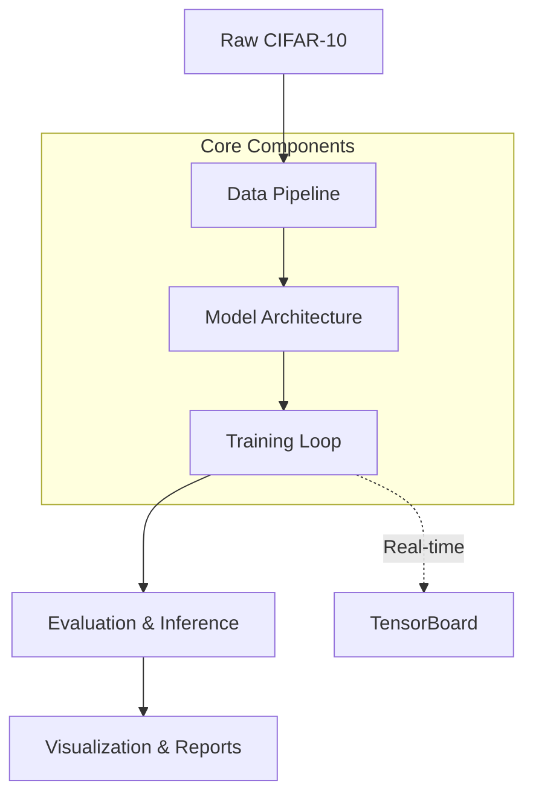

# Practice 2: Pre-trained Neural Networks (Transfer Learning)


## 1. Project Overview
This repository contains a **production-ready Deep Learning pipeline** for applying **Transfer Learning** and **Fine-Tuning** to image classification tasks. Built on PyTorch and `torchvision`, it demonstrates how to leverage powerful pre-trained neural networks (like ResNet, VGG, MobileNet) on the CIFAR-10 dataset using a clean, reproducible, and scalable software architecture.

## 2. Project Objectives
- Demonstrate mastery in **Transfer Learning strategies** (Feature Extraction / Head-only training vs Partial Fine-Tuning).
- Establish a **Clean Architecture** separating Data, Model, Training, and Visualization logic.
- Ensure **Reproducibility** through strict seeding and robust configurations.
- Provide a **Professional Portfolio Piece** for AI Engineering.

## 3. Features & Highlights
- **Transfer Learning**: Seamlessly switch between freezing backbones or unfreezing specific blocks.
- **Multiple Pretrained Models**: Support for ResNet18, VGG16, DenseNet121, and MobileNetV3.
- **Experiment Management**: Config-driven hyperparameter tuning and model tracking.
- **TensorBoard Integration**: Real-time logging of scalars (loss, accuracy) and execution graphs.
- **Comprehensive Evaluation**: Metrics reporting including Accuracy, Precision, Recall, Macro-F1, and Confusion Matrices.
- **Visualization**: Rich EDA and post-training gallery generation (predictions, learning curves).
- **Research Notebook**: Highly documented presentation notebook importing logic directly from the source.

## 4. Dataset
We use the **CIFAR-10** dataset:
- **Classes**: 10 (Airplane, Automobile, Bird, Cat, Deer, Dog, Frog, Horse, Ship, Truck).
- **Image Size**: Resized to `224x224` to match standard ImageNet dimensions required by most pre-trained models.
- **Splits**: 45,000 (Train) / 5,000 (Validation) / 10,000 (Test). Data leakage is strictly prevented by initializing independent Dataset objects with appropriate transformations.

## 5. Project Architecture

The pipeline follows a modular execution flow, ensuring strict separation of concerns.



## 6. Repository Structure

```
practice_2/
├── checkpoints/             # Saved model weights (.pth)
├── configs/                 # Configurations (Core, Training, Experiments)
├── docs/                    # Documentation and logs
├── notebooks/               # Research and presentation notebooks
├── processing_own_phase/    # Main Python source package (Data, Model, Train, Eval, Viz)
├── reports/                 # Generated visualizations (Plots, Confusion Matrices)
├── runs/                    # TensorBoard event logs
├── scripts/                 # Utility scripts (if any)
├── tests/                   # Pytest test suite
├── README.md                # Project documentation
├── requirements.txt         # Dependencies
└── LICENSE                  # MIT License
```

## 7. Installation

1. Clone the repository and navigate to the project directory:
   ```bash
   git clone <repository_url>
   cd practice_2
   ```
2. Create and activate a Python virtual environment:
   ```bash
   python -m venv .venv
   source .venv/bin/activate  # On Windows: .venv\Scripts\activate
   ```
3. Install dependencies:
   ```bash
   pip install -r requirements.txt
   ```

*(Note for macOS users: If you encounter SSL verification issues when downloading CIFAR-10, run `Install Certificates.command` in your Python Applications folder).*

## 8. Quick Start

Run a fast sanity check (1 epoch, small batch size) to ensure the pipeline executes successfully end-to-end:
```bash
python -m processing_own_phase.main --quick
```

## 9. Training

To run the complete suite of experiments defined in `configs/experiment_config.py`:
```bash
python -m processing_own_phase.main
```
This will automatically execute the Data Pipeline, loop through the configurations, select the Best Model based on Validation Accuracy, and run Final Evaluation.

## 10. Evaluation

Evaluation is integrated into the main pipeline. The `processing_own_phase/evaluate.py` module computes loss, accuracy, precision, recall, and macro F1-score for both validation and test sets.

## 11. TensorBoard

Monitor your training progress (Loss/Accuracy scalars and Model Graphs) in real-time:
```bash
tensorboard --logdir=runs
```
Then navigate to `http://localhost:6006` in your browser.

## 12. Notebook

We provide a presentation-ready Research Notebook.
1. Open Jupyter or your IDE:
   ```bash
   jupyter notebook notebooks/notebook.ipynb
   ```
2. Ensure you select the correct Python kernel (`.venv`) to avoid import errors.

## 13. Results

*(Note: The following table reflects a fast 1-epoch execution track from our Quick Run validation phase).*

| Best Model | Best Accuracy | Best Hyperparameters |
| :--- | :--- | :--- |
| **ResNet18 (Partial Fine-Tune)** | 83.85% | Optimizer: Adam, LR: 0.0005, Batch Size: 8 |

## 14. Future Improvements

While this repository is production-ready, possible future iterations could include:
- **Vision Transformers (ViT)**: Adding support for self-attention based architectures.
- **ONNX Export**: Serializing the trained PyTorch model to ONNX for cross-platform deployment.
- **Deployment**: Serving the model via FastAPI or TorchServe.
- **MLflow / Weights & Biases**: Upgrading experiment tracking beyond TensorBoard.
- **Dockerization**: Containerizing the environment and training pipeline.

## 15. License

This project is licensed under the MIT License - see the [LICENSE](LICENSE) file for details.
