<div align="center">

# 🤖 MACHINE LEARNING OVERVIEW 🤖

</div>

---

# 🧭 ML PIPELINE

> 🗺️ **Bản đồ tư duy tổng quan** — Roadmap đi từ bản chất dữ liệu đến vòng lặp cải tiến mô hình

```mermaid
%%{init: { 'flowchart': { 'curve': 'basis', 'nodeSpacing': 30, 'rankSpacing': 50 }, 'themeVariables': { 'primaryColor': '#1e3a8a', 'primaryTextColor': '#fff', 'primaryBorderColor': '#60a5fa', 'lineColor': '#60a5fa', 'tertiaryColor': '#0f172a' } } }%%
flowchart TD
    A["🧠 BẢN ĐỒ TƯ DUY<br/>(Define Problem - 5W1H)"]:::start
    B["💎 BẢN CHẤT CỐT LÕI<br/>(Core Nature of Data)"]:::stage
    C["📐 KHẢO SÁT HÌNH HỌC<br/>KHÔNG GIAN DỮ LIỆU ĐẦU VÀO<br/>(Data Geometry - EDA)"]:::stage
    D["🧹 XỬ LÍ KHUYẾT THIẾU<br/>& GIÁ TRỊ DỊ BIỆT<br/>(Missing & Outlier)"]:::stage
    E["⚖️ FEATURE SCALING<br/>(Tại sao các tt bị mù<br/>khoảng cách thước đo?)"]:::stage
    F["🏷️ CATEGORICAL ENCODING<br/>& LỜI NGUYỀN CHIỀU DỮ LIỆU<br/>(Curse of Dimensionality)"]:::stage
    G["⚠️ MẤT CÂN BẰNG CẤU TRÚC<br/>(Cạm bẫy mật độ<br/>& hàm mất mát)"]:::stage
    H["🛠️ FEATURE ENGINEERING"]:::stage
    I["✂️ CHIẾN LƯỢC CHIA DỮ LIỆU<br/>TỔNG QUAN<br/>(Tránh Data Leakage)"]:::stage
    J["📊 STRATIFIED SPLIT<br/>& TIME SERIES SPLIT"]:::stage
    K["🎯 BASELINE THINKING<br/>(Mốc chuẩn tối thiểu)"]:::stage
    L["🍕 ĐỊNH LÝ<br/>'NO FREE LUNCH'"]:::stage
    M["⚖️ BIAS & VARIANCE<br/>(Đánh đổi độ chệch - phương sai)"]:::stage
    N["🎛️ HYPERPARAMETER TUNNING<br/>(Grid - Random - Bayesian)"]:::stage
    O["📏 EVALUATION METRIC<br/>(Accuracy - F1 - ROC - RMSE - R²...)"]:::stage
    P["🔁 K-FOLD CROSS VALIDATION<br/>(Stratified - Time Series - Group)"]:::stage
    Q["🧪 PHƯƠNG PHÁP LUẬN<br/>THỰC NGHIỆM ML<br/>(Chỉ đổi 1 yếu tố / lần)"]:::stage
    R["📊 STATISTICAL SIGNIFICANCE<br/>(p-value - t-test - Wilcoxon)"]:::stage
    S["🔍 PHƯƠNG PHÁP LUẬN<br/>PHÂN TÍCH LỖI<br/>(General Error Analyst)"]:::stage
    T["🔮 MODEL INTERPRETABILITY<br/>(Hộp đen của ML<br/>SHAP - LIME - Permutation)"]:::stage
    U["🔄 CHU TRÌNH VÒNG LẶP ML<br/>(Critical ML Pipeline)<br/>↻ Quay lại bước bất kỳ"]:::finish

    A --> B --> C --> D --> E --> F --> G --> H --> I --> J --> K --> L --> M --> N --> O --> P --> Q --> R --> S --> T --> U
    U -. "Cải tiến liên tục" .-> A

    classDef start fill:#10b981,stroke:#34d399,stroke-width:3px,color:#fff,font-weight:bold
    classDef stage fill:#1e3a8a,stroke:#60a5fa,stroke-width:2px,color:#fff,font-weight:bold
    classDef finish fill:#dc2626,stroke:#f87171,stroke-width:3px,color:#fff,font-weight:bold
```



# CHI TIẾT 
## 1. Bản đồ tư duy của ML (Define problem)
- Xác định 5W - 1H
Xác định bài toán thuộc loại nào
    Dữ liệu có nhãn (Y) => Mục tiêu: Dự đoán Y từ X => Bài toán classification (supervised learning)
    Dữ liệu không nhãn => Mục tiêu: Khám phá phân phối P(x) - phân cụm/ giảm chiều => Bài toán unsupervised learning 
    Có môi trường và phần thưởng => Mục tiêu: tối ưu Q(s, a) - Policy Q-value => Bài toán Reinforcement learning

- Pipeline define problem: Hiểu đặc điểm dữ liệu -> Chọn đúng nhánh ML -> Giải quyết bài toán hiệu quả -> Tạo ra giá trị thực tiễn
## 2. 3 trụ cột trong ML
### a) Supervised learning: classification, regression
- Dữ liệu có nhãn Y 
- f(x) Ánh xạ X -> Y
### b) Unsupervised learning: clustering, dimentionality reduction, association rule, density estimation
- Dữ liệu không có nhãn
- f(x) phân phối P(x)
### c) Reinforcement learning: Robot, Game, LLM Alignment

```
Trạng thái (S) ---> Hành động (X)
    ^                        |
    |                        |
Môi trường      Agent        |
    ^                        |
    |                        |
    v                        |
Phần thưởng (R) <-------------
```

- Dữ liệu: phần thưởng R
Q(s, a): Tối ưu Q(s, a)
## 3. Những sai xót
- Dữ liệu thực tế không nhãn
- Cố gắn nhãn thủ công
- Huấn luyện trên label sai
- Kết quả sai lệch và đánh giá ảo

### 4. Quy tắc chọn nhánh Ml cho từng bài toán

```
Start --> Have label ---No--> Explore structure --No--> Have environment --No--> Restart
              |Yes                    |                        |
              |                       |                        |
              V                       V                        V
      Supervised learning     Unsupervised learning     Reinforcement learning

```

## 5. EDA (Exploring data analyst)
- Hiểu dữ liệu thô:
    1. 1Lăng kính cấu trúc tổng quan: ds.info(), ds.describe()
    2. 2Lăng kính phân phối đơn biến: Histogram, KDE plot
    3. 3Lăng kính tương quan đa biến: correlation matrix (hearmap)

    ### 5.1 Lăng kính cấu trúc tổng quan: ds.info(), ds.describe()
    - Xác định kích thước không gian dữ liệu (N x D)
    - Nhận diện các kiểu biểu diễn dữ liệu: liên tục, rời rạc, phân loại
    - Phát hiện bất thường ở mức tổng quan (trước khi xử lý)
    => Phải có các bảng, bảng ma trận tứ phân vị , biểu đồ

    ### 5.2 Lăng kính phân phối đơn biến: Histogram, KDE plot
    - Phân phối chuẩn (normal): phân phối chuẩn là phân phối có dạng đối xứng, hai bên trái / phải gần như đối xứng, phần lớn dữ liệu nằm quanh trung tâm, càng xa trung tâm thì số quan sát càng ít
    - Phân phối lệch phải (right skewed): phân phối có đuôi kéo dài về bên phải, phần lớn dữ liệu nằm ở bên trái và một số giá trị rất lớn kéo dài sang phải
    - Phân phối lệch trái: phân phối có đuôi kéo dài về phía bên trái, phần lớn dữ liệu nằm ở bên phải và một số giá trị rất lớn nằm ở bên trái
    ===> Công cụ để làm các vấn đề trên là histogram và KDE plot
    Quy trình: Chọn từng thuộc tính (1 chiều dữ liệu) ---> Vẽ histogram, KDE plot ---> Nhận diện phân phối (phân phối cheese, phân phối đều, phân phối lệch, tail, gap, ....) ---> Ghi nhận & chuẩn bị cho bước tiếp theo 

    Từ đó xác định tail và gap trong dữ liệu
        Tail: phần thừa, phân dư => phân tích nó trong dữ liệu => Xử lí => Biểu đồ R^2 (Regression), Roc-curve(classification)
        Long tail/short tail: xác định bằng biểu đồ lệch trái, lệch phải
    
    ### 5.3. Lăng kính tương quan đa biến: correlation matrix (hearmap)

    r = +1 : tương quan dương mạnh
    0 < r < 0,3 : tương quan dương yếu
    r = 0 : không tương quan
    - 0,3 < 0 < 0 : tương quan âm yếu
    r = -1 : tương quan âm mạnh

    ==> Dùng để tìm hạng ma trận hay số feature matrix độc lập tuyến tính hay đa cộng tuyến

    - Nên kết hợp với VIF (varience inflation factor) để đánh giá chi tiết hơn ---- (VIF là một kĩ thuật dùng để kiểm tra feature đó có đang là đa cộng tuyến hay không,nếu một feature là đa cộng tuyến thì rất dễ xảy ra hiện tượng trùng lặp thông tin)
    - Tìm các cặp giá trị trong khoảng từ /0,8/ -> /0,9/ để xem xét (loại bỏ, hay tạo biến mới)
    - Phân tích này để chọn feature, nên cân bằng cho mọi loại (chọn số feature cho cân bằng giữa các nhóm)
    - Nên chọn ít feature (vừa đủ) -- liên kết với heatmap và số label của mỗi data để chọn (từ heatmap vẽ ra các biểu đồ cho từng thuộc tính để minh hoạ cho rõ ràng hơn cho các tương quan)

    - Hiểu bản chất của dữ liệu:
        Hiểu phân phối dữ liệu
        Phát hiện missing value, outlier,duplicate, ...
*** Bước tiếp theo là: làm sạch, chuẩn hoá, mã hoá, feature engineering (TẤT CẢ CÁC BƯỚC ĐỀU PHẢI GHI LẠI LOG) ***
## 6. Data cleaning & Feature engineering

### 6.1. Data cleaning
- Sau khi hiểu bản chất dữ liệu thì chọn phương pháp xử lí phù hợp
- Cho mô hình học outlier để nó tốt trên thực tế hơn nhưng có thể không ổn định cho mô hình => phải có cách xử lí.

   Nếu không có phương pháp phù hợp có thể phá hỏng dữ liệu vì:
        1. 1Phân phối ban đầu: mean = 50 (phân phối cân đối, không có ngoại lai)
        2. 2Xuất hiện outlier: Mean bị kéo lệch (chỉ một điểm dữ liệu ngoại lệ nhưng đã kéo dãn mean và dịch chuyển mean)
        3. 3Phân phối sau khi điền mean => phân phối biến dạng khiến cho dữ liệu nhạy cảm hơn với outlier và có thể giá trị mean hay mode điền vào theo các phương pháp xử lí truyền thống có thể là outlier mới (
            Mean: nhạy cảm với ngoại lai: mọi giá trị đều có trọng số nhỏ như nhau, giá trị cực trị có ảnh hưởng rất lớn, kéo lêhcj trung tâm và làm méo phân phối
            Median: có vẻ ổn hơn nhưng vẫn không phù hợp bằng L1 và L2 regulization)
   Cách xử lí ở đây là dùng L1 và L2 regulization để xử lí cho outlier

*** QUY TẮC BẤT DI BẤT DỊCH ***: bảo toàn cấu trúc và không gian dữ liệu
            Dữ liệu sạch -> Model tốt -> Quyết định chính xác

### 6.2. Feature engineering baseline

Baseline thinking:
    - Chuẩn mực tối thiểu
    - Đánh giá công bằng
    - Tiết kiệm tài nguyên
    - Nền tảng cải tiến

Trả lời câu hỏi baseline là gì?

#### 🎯 Baseline là gì?

> 📌 **Định nghĩa:** Baseline là **mô hình/thuật toán đơn giản nhất** được xây dựng trước tiên, dùng làm **mốc chuẩn (benchmark)** để đánh giá xem các mô hình phức tạp hơn có thực sự tốt hơn hay không.

**🎯 Tại sao PHẢI có Baseline?**
- ✅ **Chuẩn mực tối thiểu:** Nếu mô hình phức tạp không đánh bại được baseline → thuật toán đó vô dụng trên bài toán này
- ✅ **Đánh giá công bằng:** Mọi mô hình sau này đều phải so sánh với baseline, tránh ảo tưởng về độ chính xác
- ✅ **Tiết kiệm tài nguyên:** Baseline thường rất nhanh, rẻ, giúp kiểm tra pipeline trước khi đầu tư tính toán lớn
- ✅ **Nền tảng cải tiến:** Mọi cải tiến sau đó đều đo lường được "lợi ích thật" so với baseline

**📊 Các loại Baseline phổ biến:**


**🔄 Quy trình sử dụng Baseline:**
```
   🎯 Xây dựng Baseline đơn giản nhất
              ↓
   📊 Đánh giá Baseline trên validation set
              ↓
   🤖 Xây dựng các mô hình phức tạp hơn
              ↓
   ⚖️ So sánh mô hình phức tạp với Baseline
              ↓
   ✅ Kết luận: có cải thiện thật sự hay không?
```

**⚠️ Lưu ý quan trọng:**
- 🚫 **KHÔNG** được bỏ qua baseline vì "quá đơn giản" — đó là sai lầm phổ biến nhất
- 📈 **Một baseline tốt** đôi khi đã đủ cho nhiều bài toán production
- 🔬 Baseline cũng giúp phát hiện **data leakage** hoặc **feature engineering sai** (nếu baseline cho kết quả quá cao)

*** ĐẦU TIÊN PHẢI CÓ BASE LINE MODEL ***:
  1. 1Đối với supervised learning: baseline là mô hình dự đoán theo lớp phổ biến hoặc tuyến tính đơn giản
  2. 2Đối với unsupervised learning: baseline K-Means với cấu hình mặc định
  3. 3Reinforcement learning: random policy, heritic policy

   ➕ **Bổ sung thêm:**
      - **Supervised Classification:** thêm `LogisticRegression` với hyperparameter mặc định, `DummyClassifier(strategy='most_frequent')`, `DummyClassifier(strategy='stratified')` để đánh giá mô hình có học được gì hay không
      - **Supervised Regression:** thêm `LinearRegression`, `DummyRegressor(strategy='mean')`, `DummyRegressor(strategy='median')` để so sánh với baseline đơn giản nhất
      - **Unsupervised Learning:** thêm `K-Means` với K được chọn bằng **Elbow Method** hoặc **Silhouette Score** tối ưu, có thể so sánh với `Random Clustering` (gán nhãn ngẫu nhiên) làm baseline thấp nhất
      - **Reinforcement Learning:** thêm `Heuristic Policy` (chính sách heuristic dựa trên domain knowledge), `Greedy Policy` (chọn action có reward tức thì cao nhất) làm baseline để so sánh với policy học được
      - **Time Series:** baseline quan trọng là **naive forecast** (dự đoán giá trị tiếp theo = giá trị hiện tại) hoặc **seasonal naive** (dự đoán theo mùa vụ)
*** Quy tắc khi làm việc với baseline ***: (TRONG KHI LÀM VIỆC VỚI MACHINE LEARNING NÊN CHÚ Ý VÀO PHẦN NÀY ĐẺ ĐẠT ĐƯỢC MỘT BASELINE CHUẨN CHỈ CHO MODEL)
### 1. Không vượt baseline: quay lại và cải thiện nền tảng: Kết quả mới mà không vượt được baseline thì quay lại và phân tích nền tảng
### 2. Vượt nhẹ baseline (đánh giá toàn diện): cải thiện nhưng không có nhiễu, cần xem xét, thời gian, độ phức tạp
### 3. Vượt rõ rệt baseline (tiếp tục phát triển và tinh chỉnh baseline)
    - Cải thiện đáng kể, có ý nghĩa về mặt khoa học và thực tiễn
    - Lợi ích vượt trội so với chi phí bỏ ra
    - Mô hình có tìm năng triển khai thực tế.


*** CÁC LƯU Ý QUAN TRỌNG ***:
Phải "no free lunch"
Trả lời câu hỏi SVM và RBF sử dụng khi nào? 

#### 🎯 SVM (Support Vector Machine) sử dụng khi nào?

> 📌 **Định nghĩa:** SVM là thuật toán tìm **siêu phẳng (hyperplane)** tối ưu để phân chia các lớp dữ liệu với **margin lớn nhất**.

**🎯 Khi nào NÊN dùng SVM:**    


**❌ Khi nào KHÔNG NÊN dùng SVM:**


**⚙️ Các Kernel phổ biến của SVM:**


---

#### 🎯 RBF Kernel (Radial Basis Function) sử dụng khi nào?

> 📌 **Định nghĩa:** RBF kernel (Gaussian kernel) là hàm kernel phổ biến nhất của SVM, ánh xạ dữ liệu lên **không gian vô hạn chiều** để tìm ranh giới phi tuyến.

**🧮 Công thức RBF:**
```
   K(x, y) = exp(-γ × ||x - y||²)
```
Trong đó:
- `γ` (gamma): tham số quyết định "phạm vi ảnh hưởng" của mỗi điểm dữ liệu
- `||x - y||²`: bình phương khoảng cách Euclidean giữa 2 điểm
- Khi `γ` lớn → ảnh hưởng cục bộ, ranh giới phức tạp (dễ overfit)
- Khi `γ` nhỏ → ảnh hưởng toàn cục, ranh giới mượt hơn (dễ underfit)

**🎯 Khi nào NÊN dùng RBF Kernel:**


**❌ Khi nào KHÔNG NÊN dùng RBF Kernel:**


**⚙️ Hyperparameters quan trọng của RBF SVM:**


**🔄 Workflow chọn Kernel đúng cách:**

```
   📊 Dữ liệu linearly separable?
          │
   ┌──────┴──────┐
   │ Yes         │ No
   ▼             ▼
   📏 Linear    ❓ Có giả thuyết về cấu trúc?
   Kernel           │
              ┌─────┴─────┐
              │ No        │ Yes (vd: đa thức)
              ▼           ▼
            🔵 RBF      📊 Polynomial
              (default)   Kernel
```

**💡 Mẹo thực nghiệm:**
- 🎯 **Luôn thử Linear Kernel trước** (nhanh, đơn giản, dễ debug)
- 🔵 **Dùng RBF làm default** khi không biết cấu trúc dữ liệu
- 🔧 **GridSearchCV** trên `(C, γ)` với RBF thường cho kết quả rất tốt
- 📏 **Scale dữ liệu (StandardScaler)** TRƯỚC KHI dùng RBF (vì RBF dựa trên khoảng cách Euclidean)
- 📐 **Số feature < 10:** RBF thường cho kết quả tốt nhất
- 📊 **Số feature > 1000:** Linear Kernel thường tốt hơn RBF 

## 6.5. Main feature engineering
1. 1Relationship (quan hệ mới): tạo ra các mối quan hệ mới giữa các biến
    - Ratio feature: So sánh tương đối giữa 2 đại lượng loại bỏ ảnh hưởng của thang đo, phản ánh bản chất tốt hơn
        Công thức: Ratio = A/B
    - Interaction feature: kết hợp 2 hoặc nhiều biểu đồ mô tả hiệu ứng tương tác giữa chúng
        Công thức: X x Y
    ==> 2 hàm này giúp mô hình nắm bắt quan hệ ổn và tương tác phức tạp giữa các biến
2. 2Structure (cấu trúc mới): khai thác cấu trúc và ngữ cảnh bên trong dữ liệu
    - Aggregation feature (đối tượng tổng hợp): tổng hợp nhiều bản ghi của cùng một đối tượng thành các thống kê có ý nghĩa
    - Time-base feature (đặc trưng thời gian): khai thác thông tin thời gian và thứ tự xảy ra sự kiện để mô hình hiểu xu hướng của thời gian
3. 3Gemetry feature (hình học mới của feature): thay đổi hình học của không gian đặc trưng để bọc quan hệ phi tuyến


## 7. Evaluation metric

*** LƯU Ý ***: khi so sánh 2 model, nếu model 1 có 91% model 2 có 92% => chênh 1% thì lấy 1% đó đem đi trực quan lên và so sánh để cải thiện mô hình

### 7.1. Evaluation metric for classification
- Khái niệm **threshold**: là một giá trị trong khoảng từ 0 đến 1, dùng để chuyển xác suất dự đoán thành nhãn dự đoán.
  - Có thể tạo dãy threshold bằng `np.arange(0, 1.01, 0.01)`.
  - Trực quan hóa lên bảng threshold gồm các cột: TP, FN, TN, FP, TPR, FPR.
  - Nếu bài toán yêu cầu kiểm soát báo động nhầm, có thể chọn threshold sao cho `FPR = 0.01` hay 1%.

- **Supervised classification:** accuracy, precision, recall, f1-score, roc-auc, roc-curve, precision-recall auc


- **Supervised regression:** MAE, RMSE, R^2, MAPE

#### 1. MAE — Mean Absolute Error

> **MAE** là sai số tuyệt đối trung bình.

**Công thức:**
```text
MAE = mean(|y_true - y_pred|)
```

**Nói dễ hiểu:** MAE cho biết trung bình model dự đoán sai bao nhiêu đơn vị tiền.

**Ví dụ:** `MAE = 29,536` nghĩa là trung bình model dự đoán lệch khoảng `29,536` so với giá thật.


**Dùng MAE khi:**
- Muốn biết trung bình model sai bao nhiêu tiền.
- Dữ liệu có outlier và muốn metric dễ giải thích cho báo cáo.

#### 2. RMSE — Root Mean Squared Error

> **RMSE** là căn bậc hai của sai số bình phương trung bình.

**Công thức:**
```text
RMSE = sqrt(mean((y_true - y_pred)^2))
```

**Nói dễ hiểu:** RMSE cũng đo sai số dự đoán, nhưng phạt rất mạnh các lỗi lớn.

**Ví dụ:** `RMSE = 45,651` nghĩa là model có sai số kiểu RMSE khoảng `45,651`. Vì RMSE phạt lỗi lớn, nên nếu có vài căn nhà bị dự đoán sai rất nhiều, RMSE sẽ tăng mạnh.


**Dùng RMSE khi:**
- Sai số lớn là vấn đề nghiêm trọng.
- Muốn model hạn chế dự đoán sai quá xa.
- Muốn phát hiện model có lỗi lớn ở một số case.

#### 3. So sánh MAE và RMSE


**Quy tắc quan trọng:** `RMSE >= MAE` luôn đúng.

Nếu **RMSE cao hơn MAE rất nhiều**, nghĩa là model có một số dự đoán sai rất lớn và cần làm **Error Analysis**.

**Ví dụ:**
```text
MAE  = 29,536
RMSE = 45,651
```

RMSE cao hơn MAE khá rõ, nghĩa là model nhìn chung sai trung bình khoảng `29.5k`, nhưng vẫn có một số case sai lớn kéo RMSE lên.

#### 4. MAPE — Mean Absolute Percentage Error

> **MAPE** là sai số phần trăm tuyệt đối trung bình.

**Công thức:**
```text
MAPE = mean(|y_true - y_pred| / y_true) * 100%
```

**Nói dễ hiểu:** MAPE cho biết model dự đoán sai trung bình bao nhiêu phần trăm so với giá thật.

**Ví dụ:** `MAPE = 16.88%` nghĩa là trung bình model dự đoán sai khoảng `16.88%` so với giá trị thật.


**Lưu ý:** MAPE không phù hợp nếu `y_true` có giá trị bằng 0 hoặc quá gần 0, vì khi chia cho số rất nhỏ thì phần trăm lỗi bị phóng đại.

#### 5. R² — R-squared / Coefficient of Determination

> **R²** đo xem model giải thích được bao nhiêu phần biến động của target.

**Nói dễ hiểu:** R² cho biết mô hình dự đoán tốt hơn việc chỉ đoán bằng giá trị trung bình bao nhiêu.


**Ví dụ:** `R² = 0.8425` nghĩa là model giải thích được khoảng `84.25%` biến động của giá nhà. Đây là mức khá tốt cho bài toán dự đoán giá nhà.

- Unsupervised learning: silhoutte score, davies bouldin index, calnski-harbosz index (tuỳ bài)
            1. 1silhouette_score
                - Silhouette đo mỗi điểm có “thuộc đúng cụm” không.
                - Nó nằm trong khoảng -1 đến 1:
                    •	Gần 1: rất tốt, điểm nằm sát cụm mình và xa cụm khác.
                    •	Gần 0: cụm bị chồng lấn, ranh giới không rõ.
                    •	Nhỏ hơn 0: có thể điểm bị gán sai cụm.
            2. 2davies_bouldin_score
                - Davies-Bouldin đo mức “cụm có lẫn vào nhau không”.
                - Nó càng thấp càng tốt:
                    •	Cụm bên trong càng chặt.
                    •	Các cụm càng xa nhau.
                    •	DB càng nhỏ thì cụm càng đẹp.
            3. 3calinski_harabasz_score
                - Calinski-Harabasz đo tỉ lệ độ xa giữa các cụm / độ phân tán bên trong cụm
                - Càng cao càng tốt. Nhưng chỉ số này phụ thuộc số dòng dữ liệu, nên project mình đánh giá bằng CH / n_samples.
            4. 4inertia
                - Inertia là tổng khoảng cách bình phương từ từng điểm đến tâm cụm của nó.
                - Nói đơn giản: inertia thấp = các điểm nằm gần tâm cụm hơn = cụm chặt hơn
                - Nhưng có một bẫy: tăng số cụm K thì inertia gần như luôn giảm. Vì vậy không nên nói “inertia thấp là model tốt nhất” một mình. Nó chủ yếu dùng để vẽ elbow curve khi chọn K.
            5. 5stability_ari_mean
                - ARI là Adjusted Rand Index, dùng để so sánh hai cách phân cụm.
                - ARI:
                    •	Gần 1: kết quả gần như giống nhau.
                    •	Gần 0: giống ngẫu nhiên.
                    •	Nhỏ hơn 0: tệ hơn ngẫu nhiên.
            6. 6stability_ari_std
                - Chỉ số này đo ARI có dao động nhiều không.
                    •	std thấp: các lần chạy ổn định.
                    •	std cao: seed khác nhau làm kết quả thay đổi nhiều.
- **Reinforcement learning:** average return, cumulative reward, episode length, success rate, sample rate, regret


- Tối ưu **precision**: precision càng cao càng tốt, càng cao càng tin cậy.
- Tối ưu **recall**: recall cao được ưu tiên khi cần hạn chế bỏ sót positive; recall cao thường dẫn tới FPR cao hơn và precision giảm.
- Tùy bài toán mà chọn một hệ số tối ưu riêng để ưu tiên tính productivity.

- Dạng thứ 2 khác với ROC-Curve là **PR-Curve**.

- Classification: ROC-Curve được tạo từ trục X = FPR (càng thấp càng tốt), trục Y = TPR (càng cao càng tốt). Phần diện tích bên dưới đường cong là AUC; AUC càng cao thì mô hình càng tốt. Từ đó có thể xác định threshold phù hợp cho mô hình.

- Biểu đồ PR-Curve được tạo từ trục X = recall, trục Y = precision. Biểu đồ này thay đổi theo threshold; để vẽ được biểu đồ này, ta tính các chỉ số từ confusion matrix.

Trả lời 2 câu hỏi
    **How to build ROC-Curve & PR-Curve?**
        - **ROC-Curve (Receiver Operating Characteristic Curve):**
            1. 1Bước 1: Lấy xác suất dự đoán `y_score = model.predict_proba(X)[:, 1]` (xác suất thuộc lớp positive)
            2. 2Bước 2: Tạo dãy threshold bằng `thresholds = np.arange(0, 1.01, 0.01)` (từ 0 đến 1, bước nhảy 0.01)
            3. 3Bước 3: Với mỗi threshold, phân loại `y_pred = (y_score >= threshold).astype(int)` rồi tính TPR và FPR từ confusion matrix
            4. 4Bước 4: Gắn các điểm `(FPR, TPR)` lên đồ thị với trục X = FPR, trục Y = TPR
            5. 5Bước 5: Tính AUC = diện tích dưới đường ROC bằng `roc_auc_score(y_true, y_score)`
            6. 6Bước 6: Vẽ đường chéo `y = x` (baseline của mô hình random) để đánh giá
            - **Công thức nhanh (sklearn):** `fpr, tpr, thresholds = roc_curve(y_true, y_score)` → `plt.plot(fpr, tpr)`
        - **PR-Curve (Precision-Recall Curve):**
            1. 1Bước 1: Lấy xác suất dự đoán `y_score` (giống ROC)
            2. 2Bước 2: Tạo dãy threshold tương tự ROC
            3. 3Bước 3: Với mỗi threshold, tính `precision = TP / (TP + FP)` và `recall = TP / (TP + FN)`
            4. 4Bước 4: Vẽ các điểm `(recall, precision)` với trục X = recall, trục Y = precision
            5. 5Bước 5: Tính AUC-PR = `average_precision_score(y_true, y_score)`
            6. 6Bước 6: PR-Curve đặc biệt hữu ích khi dữ liệu mất cân bằng nặng (imbalanced) vì nó không bị ảnh hưởng bởi số lượng negative quá lớn như ROC
            - **Công thức nhanh (sklearn):** `precision, recall, thresholds = precision_recall_curve(y_true, y_score)` → `plt.plot(recall, precision)`

    **How to calculate tpr, fpr info?**
        - **TPR (True Positive Rate) = Recall = Sensitivity:**
            - `TPR = TP / (TP + FN)`
            - Tỷ lệ positive thật được dự đoán đúng trong tổng số positive thật
            - Trong tổng số ca bệnh thật, bao nhiêu ca được phát hiện ra
            - **Càng cao càng tốt** (không bỏ sót positive)
        - **FPR (False Positive Rate) = 1 - Specificity:**
            - `FPR = FP / (FP + TN)`
            - Tỷ lệ negative thật bị dự đoán sai thành positive trong tổng số negative thật
            - Trong tổng số người khỏe mạnh, bao nhiêu người bị chẩn đoán nhầm là bệnh
            - **Càng thấp càng tốt** (không báo động nhầm)
        - **Cách tính từ confusion matrix:**
            ```
            Confusion Matrix:
                         Predicted
                        Pos    Neg
            Actual Pos  TP     FN
            Actual Neg  FP     TN

            TPR = TP / (TP + FN)        ← Recall/Sensitivity
            FPR = FP / (FP + TN)        ← Fall-out
            Precision = TP / (TP + FP)
            F1 = 2 * P * R / (P + R)
            ```
        - **Mối liên hệ giữa ROC và TPR/FPR:** ROC được vẽ bằng cách quét qua các threshold khác nhau, tại mỗi threshold tính cặp `(FPR, TPR)` rồi nối các điểm lại. Đường ROC càng cong về góc trên-trái thì mô hình càng tốt, AUC = 1.0 là hoàn hảo, AUC = 0.5 là random guess.
        - **Ví dụ số:** TP=90, FN=10, FP=20, TN=80
            - TPR = 90/(90+10) = 0.9 (90% ca bệnh thật được phát hiện)
            - FPR = 20/(20+80) = 0.2 (20% người khỏe bị chẩn đoán nhầm)
### 7.2. Evaluation metric for regression
- Chênh lệch giữa RMSE và MAE cao => không ổn định
- Ngoài ra còn một cái để xem nữa là R^2 và MAPE (nhìn bằng đồ thì, nếu làm cho bài toán này thì nên vẽ các đồ thị ra để hiểu và trực quan hơn)
- Chọn MAE (càng nhỏ càng tốt) khi
    1. Dữ liệu có nhiều outlier
    2. Muốn mô hình ổn định, không bị ảnh hưởng bởi các giá trị cực đoan
    3. Sai số lớn và nhỏ đều không quá quan trọng
- RMSE
    1. Sai số lớn rất nghiệm trọng và cần tránh
    2. Muốn mô hình học chính xác các gía trị
    3. Bổ sung thêm một số cái...........
        - **Công thức RMSE:** `RMSE = sqrt(Σ(y_true - y_pred)² / n)`
        - **Ý nghĩa:** RMSE cùng đơn vị với y (vì lấy căn bậc hai của MSE), dễ diễn giải cho business
        - **Khi nào nên dùng RMSE:**
            - Sai số lớn không thể chấp nhận được (bài toán tài chính, an toàn)
            - Phạt nặng outlier để mô hình cẩn thận hơn
            - Dữ liệu phân phối Gaussian (gần chuẩn)
        - **Khi nào KHÔNG nên dùng RMSE:**
            - Dữ liệu có nhiều outlier thực sự (sẽ bị kéo méo)
            - Dữ liệu có phân phối lệch (skewed) mạnh
        - **Mối quan hệ RMSE - MAE:** `RMSE >= MAE` luôn luôn (do bình phương penalty lớn). Khoảng cách `RMSE - MAE` càng lớn → variance của lỗi càng cao → mô hình càng không ổn định
        - **Mẹo thực nghiệm:** Log-transform target trước khi tính RMSE khi dữ liệu lệch phải mạnh (giá nhà, doanh thu)
        - **Robust variant:** Huber Loss kết hợp ưu điểm của MAE (robust với outlier ở vùng lỗi nhỏ) và RMSE (smooth gradient ở vùng lỗi nhỏ)

- R^2 (càng gần với đường chéo chính càng tốt)
    1. Đánh giá mức độ giải thích được dữ liệu
    2. So sánh giá trị hiệu quả giữa các mô hình
    3. Dữ liệu không có giá trị 0 hoặc âm ít

    R^2 = 0 => mô hình không giải thích được gì
    R^2 = 0,5 => mô hình giải thích được 50% biến động
    R^2 = 1 => mô hình giải thích được 100% biến động

- MAPE:
    1. Đo sai số dự báo ở dạng %
    2. Do sánh giữa các đơn vị dữ liệu khác nhau
    3. Dữ liệu mang ý nghĩa kinh doanh rõ ràng
- SMAPE

### 7.3. Evaluation metric for unsupervised learning
- Dữ liệu thực tế: không biết nhãn
- Thuật toán phân cụm: KMean, GMM, DBScan, ...
- Kết quả phân cụm: có cụm, nhưng phải biết được cụm nào xấu cụm nào tốt
- Đánh giá dựa trên hình học: đo lường cấu trúc hiện tại

- Phân cụm thường có 2 vấn đề:
    1. Nội tại: các dữ liệu có cùng cụm thì gần nhau
    2. Ngoại lai: khoảng cách lớn
- Silhoutte score (chỉ số so sánh trên từng K)
   - Hệ số K (hệ số cụm)
   - S < 0 rất kém, 0 < S <= 0.25 kém, 0,25 < S <= 0,5 trung bình, 0,5 < S <= 0,75 tốt, S > 0.75 rất tốt

### 7.4. Evaluation metric for reinforcement learning
1. **Policy metric**

| Metric | Ý nghĩa | Hướng tối ưu |
|:---|:---|:---|
| **Average return** | Phần thưởng trung bình agent nhận được sau nhiều episode; dùng để đánh giá policy có ổn định và hiệu quả không. | Càng cao càng tốt. |
| **Cumulative reward** | Tổng phần thưởng agent nhận được trong một episode hoặc một quá trình tương tác với môi trường. | Càng cao càng tốt. |
| **Episode length** | Số bước agent thực hiện trước khi episode kết thúc. | Thường ngắn hơn nếu mục tiêu là hoàn thành nhiệm vụ nhanh; có thể dài hơn nếu bài toán là duy trì/sống sót. |

2. **Đánh giá khả năng học của agent**

| Metric | Ý nghĩa | Hướng tối ưu |
|:---|:---|:---|
| **Success rate** | Tỷ lệ episode agent hoàn thành đúng mục tiêu. | Càng cao càng tốt. |
| **Sample rate / Sample efficiency** | Lượng step, episode hoặc sample cần dùng để agent đạt một mức hiệu suất mong muốn. | Càng ít bước để đạt hiệu suất tốt thì càng tốt. |
| **Regret** | Tổng mức thiệt hại do agent chọn hành động kém hơn hành động tối ưu trong quá trình học. | Càng thấp càng tốt. |

*** LƯU Ý***: muốn đánh giá được mô hình có thật sự tốt trên môi trường production hay không thì phải có một bộ data thật lớn, thậm chí có thể lớn hơn train set để đánh giá thật chuẩn => bổ sung thêm một bộ data cho test set trước khi test
    - **Tại sao cần bộ test set riêng biệt:**
        1. Tránh **data leakage** - thông tin từ test lọt vào quá trình train
        2. Đánh giá khả năng **generalization** thực sự trên dữ liệu chưa thấy
        3. Phát hiện **overfitting** khi train_score >> test_score
        4. Đảm bảo ước lượng metric **không lạc quan** một cách giả tạo
    - **Quy trình chuẩn 3 tập:**
        - **Train set (60-70%):** Huấn luyện mô hình, tìm hyperparameters
        - **Validation set (10-20%):** Tuning hyperparameters, early stopping, chọn mô hình tốt nhất
        - **Test set (15-25%):** Đánh giá cuối cùng, KHÔNG ĐƯỢC dùng trước đó
    - **Lưu ý phân chia theo loại bài toán:**
        - Phân loại mất cân bằng → dùng **stratified split** để giữ tỷ lệ nhãn
        - Time series → dùng **time-based split** (train: quá khứ, test: tương lai gần nhất)
        - Dữ liệu có nhóm (user, session) → dùng **group split** để tránh leakage giữa các nhóm
    - **Quy tắc vàng:** Test set chỉ được "mở" đúng 1 lần ở cuối pipeline, mọi quyết định phải dựa trên validation set


*** RADOM SPLIT & K-FOLD SPLIT *** (RẤT QUAN TRỌNG CHO BƯỚC SPLIT CẦN CHÚ Ý VÀ NÓ CÓ LIÊN HỆ VỚI PHẦN "*** TỪ TẤT CẢ NHỮNG CÁI TRÊN CÓ THỂ SUY RA ĐƯỢC QUY TRÌNH TRONG ML CHUẨN NHƯ SAU***")
## Random split: random về độ dài chứ không phải random lộn xộn. Và train là đoạn đầu tiên, test là đoạn phía sau

## Cơ chế k-fold cross validation

- Khi nào dùng và cách dùng: 
    +) Nếu train và test có 2 feature khác nhau thì để xử lí ta sẽ sử dụng k-fold
    +) Cứ mỗi lần fold sẽ báo cáo độ lệch và đem đi phân tích. Các chỉ số báo cáo gồm:
        Trung bình (u) và Độ lệch chuẩn
    ==> Xác định tính hiệu quả và hiệu năng mô hình
B1: Chia dữ liệu (kfold1, kfold2, ...)
B2: Thực hiện K lần huấn luyện và đánh gía
B3: Tổng hợp kết quả: tính giá trị trung bình, tính độ lệch chuẩn

** Phải chọn đúng K-fold cho bài toán
    1. Stratified k-fold: giữ nguyên tỉ lệ phân bố trong mã fold, đảm bảo mã fold đại diện cho toàn bộ dữ liệu => dùng khi dữ liệu mất cân bằng, dữ liệu mất cân bằng lớn
    2. K-fold thông thường
       - Chia dữ liệu ngẫu nhiên thành K phần bằng nhau
       - Phù hợp khi dữ liệu liên tục và các lớp phân bố tương đối cân bằng
    3. Time seriessplit
        - Giữ nguyên thứ tự thời gian
        - Mỗi lần: train trên quá khứ và validation ở tương lại
        -klhông dùng dữ liệu tương lai đi huấn luyện

- Và báo cáo cuối cùng phải có quá trình so sánh K và so sánh 2 mô hình (với điều kiện: cùng trung bình, khác độ ổn định)


*** TỪ TẤT CẢ NHỮNG CÁI TRÊN CÓ THỂ SUY RA ĐƯỢC QUY TRÌNH TRONG ML CHUẨN NHƯ SAU***: Data collection ---> Tách dữ liệu (split data) ---> eda trên train set ---> data processing trên train set ---> preparing data trên train set ---> huấn luyện trên train set (input: clean data, feature, hyperparaeter) ---> đánh giá cuối trên train set


    Nhưng mà có một lưu ý: thường có một số trường hơp feature của train và test sẽ khác nhau: nên chúng ta phải xác định lại pipeline chuẩn như sau: Split data -> EDA trên train set -> chọn feature trên train và đem đi đánh giá để ra thông số
                                                -> EDA trên test set (lấy feature của train test lại dựa trên tất cả các behavior của tập train để chứng minh các bước chọn feature & eda trên train set có đúng ko . Nếu sai -> bươc train có lỗi và phải làm lại)


            Quy trình train chuẩn là: transform train set -> transform trên test set (bằng thông số của train) ->evaliuation và đánh gái mô hình
*** QUY TẮC CHỌN THUẬT TOÁN ***:
    1. Hiểu rõ cấu trúc dữ liệu: bước này được thực hiện qua việc EDA
    2. Xác định mục tiêu & ràng buộc: bước này được thực hiện qua việc define problem
    3. Chọn baseline phù hợp
    4. Đánh giá bằng thực nghiệm: phải có số, biểu đồ,... để so sánh
    5. Lựa chọn & tinh chỉnh thông minh

*** QUY TRÌNH TRAIN MODEL ***

```
 TRAIN BASELINE ------------> HYPERPARAMETER TUNNING & DEFAULT ------------> TRAIN LATEST
    |                                                                               |
    ------------------------- SO SÁNH VÀ ĐÁNH GÍA CẢ 2 MODEL ------------------------
```

*** QUY TRÌNH THỰC NGHIỆM ***
    1. Đổi thuật toán (nếu là ensemble learning thì đổi 1 thuật toán và giữ nguyên các thuật toán còn lại và tiến hành kiểm tra đánh giá)
    2. Thay đổi tham số (thay đổi một tham số và giữ nguyên các tham số còn lại. Sau đó tiến hành kiểm tra đánh giá )
    3. Thêm hoặc bớt feature (mỗi lần chỉ thêm hoặc bớt 1 feature. Sau đó tiến hành kiểm tra đánh giá)
    4. Đổi cách scale
    5. Thay hàm mất mát
    6. Đổi cách chia dữ liệu
    (*** QUY TẮC ***: MỖI LẦN CHỈ ĐỔI 1 CÁI VÀ THỰC THI KIỂM TRA)

*** QUY TRÌNH LÀM BÁO CÁO/ NOTEBOOK***
    1. Hypothesis (nêu ra giả thuyết) hay còn gọi là bước define problem (5W, 1H)
        - Bắt đầu với các câu hỏi nghiên cứu dựa trên lý thuyết để hiểu tất cả về bản chất dữ liệu và bài toán cần làm
    2. Experience (thực nghiệm kiểm chứng)
        - Thực nghiệm có kiểm xoát
        - Chỉ thay đổi 1 yếu tố duy nhất và giữ nguyên các yếu tố khác trong quá trình đánh giá

    3. Result (đua ra kết quả)
       - Thu thập kết quả hiệu năng của model 
       - Ghi lại đầy đủ metric

    4. Statistical validation (xác định thống kê)
        - Áp dụng kiểm định thống kê
        - Kiểm ta xem chênh lệch có ý nghĩa thống kê hay chỉ đo thực nghiệm
        Quy  trình kiểm định thống kê chuẩn chỉ: 
            1. Thu thập kết quả
            2. Chọn kiểm định (các kiểm định hay dùng: paired t-test, wilcoxon signed-rank test, McNEMAK test)
            3. Tính thống kê kiểm định
            4. Tính p-value
            5. So sánh với ý nghĩa phải 0 <= p <= 0,5
            6. Kết luận

    5. Conslusional (kết luận)

    6. Next interation (vòng lặp cải tiến) - để làm được này phải có một model baseline để làm cơ sở đánh giá ban đầu và xem xét áp dụng các phương pháp khác nhau để đánh giá lại

        - Đặt theo timestamp
        - Quy trình chuẩn:
```
        Hình thành giả thuyết mới ------------> Thiết kế thực nghiệm ------------> Chạy lại và thu thập kết quả
                ^                                                                           |
                |                                                                           |
                |                                                                           |
       Kết luận & lưu log ------------> Phân tích & kiểm định -------------------------------
                                           Quy trình phân tích lỗi chuẩn:
                                            1. 1Trích xuất lỗi
                                            2. 2Kiểm tra lỗi
                                            3. 3Phân tích nguyên nhân
                                            4. 4Nhóm lõi theo loại
                                                4. 4Supervised learning
                                                    - Trích xuất lỗi
                                                    - Kiểm tra lỗi
                                                    - Phân tích thực nghiệm: thiếu feature, thiếu thông tin, nhãn sai/ thiếu, mất cân bằng dữ liệu, nhóm hiếm, phân phối khác biệt, kiểm tra kết chất lượng dữ liệu kém
                                                    - Quyết định hành động, cải thiện
                                                    - Bổ sung làm sạch và xử lí dữ liệu (nếu cần)
                                                    - Cải thiện feature, điều chỉnh dữ liệu và xử lí mất cân bằng (nếu cần)
                                                    - Lặp lại
                                                    
                                                4.2. Unsupevised learning
                                                    1. 1Trích xuất các trường hợp yếu
                                                        - Trích xuất lỗi
                                                        - Đếm và kiểm tra xem có silhoutte score nào gán 0 hoặc âm không
                                                        - Đếm outlier, noise, ...
                                                    2. 2Phân tích và xác định nguyên nhân
                                                        - Dữ liệu lỗi
                                                        - Cụm mới chưa được phát hiện
                                                        - Phân bố mật độ không đều
                                                        - Thông số chưa phù hợp
                                                        - Feature chưa đủ hoặc chưa tốt
                                                        - Thuật toán chưa phù hợp

                                                    3. 3Thực hiện cải thiện
                                                        (bổ sung)
                                                            - **Cải thiện dữ liệu:**
                                                                1. 1**Làm sạch dữ liệu:** loại bỏ noise, duplicate, xử lý missing value bằng KNN Imputer hoặc Iterative Imputer
                                                                2. 2**Xử lý outlier:** dùng IQR, Isolation Forest, hoặc Local Outlier Factor (LOF) trước khi phân cụm
                                                                3. 3**Chuẩn hoá & Scale:** dùng `StandardScaler`, `MinMaxScaler`, hoặc `RobustScaler` (vì K-Means, GMM nhạy cảm với scale)
                                                                4. 4**Giảm chiều dữ liệu:** dùng `PCA`, `t-SNE`, `UMAP` để giảm noise và visualize cụm
                                                                5. 5**Tăng cường feature:** tạo feature mới qua `Feature Engineering`, encoding categorical, tạo feature tương tác
                                                                6. 6**Cân bằng mật độ:** dùng `SMOTE` cho feature space hoặc resample dữ liệu nếu cụm quá mất cân bằng
                                                            - **Cải thiện thuật toán:**
                                                                1. 1**Đổi thuật toán phân cụm:** thử `K-Means` → `GMM` (cụm ellipsoid) → `DBSCAN` (mật độ) → `HDBSCAN` → `Spectral Clustering`
                                                                2. 2**Tuning hyperparameters:**
                                                                    - K-Means: thử n_init, max_iter, init='k-means++'
                                                                    - DBSCAN: thử eps (khoảng cách lân cận), min_samples (số điểm tối thiểu)
                                                                    - GMM: thử n_components, covariance_type ('full', 'tied', 'diag', 'spherical')
                                                                    - Agglomerative: thử linkage ('ward', 'complete', 'average', 'single')
                                                                3. 3**Ensemble clustering:** kết hợp nhiều thuật toán voting (Consensus Clustering)
                                                                4. 4**Soft clustering:** dùng `GMM` với soft assignment thay vì hard assignment
                                                                5. 5**Hierarchical clustering:** dùng dendrogram để chọn K tối ưu
                                                            - **Đánh giá lại:**
                                                                1. 1Tính lại Silhouette Score, Davies-Bouldin Index, Calinski-Harabasz Index
                                                                2. 2So sánh với baseline bằng statistical test (nếu có ground truth)
                                                                3. 3Visualize cụm bằng t-SNE/UMAP để kiểm tra trực quan
                                                                4. 4Phân tích đặc trưng từng cụm để xem có ý nghĩa nghiệp vụ không
                                                                5. 5**Lặp lại** cho đến khi metric và chất lượng cụm đạt yêu cầu

```

*** NGUYÊN TẮC VIẾT LOG***
    1. Lưu lại gỉa thuyết (hypothesis)
    2. Configuration: thiết lập thực nghiệm
    3. Data and setup: dữ liệu, cách chia, ....
    4. Result
    5. Conclustion
    6. Note & insight

---

<div align="center">

# 📚 NỘI DUNG BỔ SUNG TỪ `ML_PIPELINE_REFERENCE_v3`

### *Hoàn thiện các phần còn thiếu trong ML Pipeline*

`Data Geometry → Preprocessing → Leakage Control → Modeling → Validation → Interpretation`

</div>

> [!IMPORTANT]
> Phần bên dưới **bổ sung** kiến thức cho các mục phía trên. Nguyên tắc xuyên suốt là: bắt đầu từ bài toán và dữ liệu, chia dữ liệu trước khi học bất kỳ thống kê nào, chỉ dùng validation/Cross-Validation để lựa chọn mô hình và chỉ đánh giá test set một lần ở cuối.

## 🗂️ Bản đồ nội dung bổ sung

| Mục | Nội dung | Giá trị bổ sung chính |
|:---:|:---|:---|
| 8 | Label quality & EDA | Kiểm tra chất lượng nhãn, phân phối và quan hệ phi tuyến. |
| 9 | Missing value & outlier | Chọn imputation và xử lý ngoại lai theo bản chất dữ liệu. |
| 10 | Feature scaling | Hiểu ảnh hưởng của scale theo từng thuật toán. |
| 11 | Categorical encoding | Tránh thứ tự giả, leakage và lời nguyền số chiều. |
| 12 | Class imbalance | Metric, resampling, class weight và cost-sensitive learning. |
| 13 | Feature engineering | Xây dựng, lựa chọn và kiểm chứng feature mới. |
| 14 | Data split & leakage | Phân biệt `fit` và `transform`, chọn đúng kiểu split. |
| 15 | No Free Lunch | Ghép inductive bias của thuật toán với hình học dữ liệu. |
| 16 | Bias–variance & tuning | Chẩn đoán underfitting/overfitting và tuning có kiểm soát. |
| 17 | Metric & benchmark | Chọn metric, xử lý xung đột metric và giải thích bằng 5W. |
| 18 | Cross-Validation & thống kê | Báo cáo độ ổn định và độ bất định của kết quả. |
| 19 | Error analysis | Phân tích nguyên nhân lỗi cho supervised và RL. |
| 20 | Model interpretability | Phân biệt giải thích global và local. |
| 21 | Checklist triển khai | Thứ tự thực thi an toàn cho một pipeline hoàn chỉnh. |

## 8. Label Quality & EDA mở rộng

### 8.1. Chất lượng nhãn là giới hạn trên của Supervised Learning

Các bộ dữ liệu công khai thường đã có nhãn, nhưng dữ liệu thực tế thường phải được con người gán nhãn thủ công. Quá trình này có thể tạo ra nhãn chủ quan, không nhất quán hoặc chứa thiên kiến.

```
Dữ liệu thô chưa có nhãn
        ↓
Con người gán nhãn
        ↓
Nhãn chủ quan / không nhất quán
        ↓
Mô hình học cả sai sót và thiên kiến của người gán nhãn
        ↓
Dự đoán sai lệch khi triển khai
```

> **Kết luận:** Chất lượng nhãn là “trần hiệu năng” của mô hình supervised. Thuật toán phức tạp không thể tự sửa một ground truth đã bị sai.

Trước khi huấn luyện cần kiểm tra:

- Hướng dẫn gán nhãn có rõ ràng và thống nhất không.
- Tỷ lệ đồng thuận giữa nhiều annotator.
- Các mẫu có nhãn mơ hồ hoặc mâu thuẫn.
- Phân phối nhãn theo nguồn dữ liệu, thời gian và từng nhóm người dùng.
- Một tập mẫu được chuyên gia kiểm tra lại để ước lượng label noise.

### 8.2. Ba lăng kính EDA và câu hỏi cần trả lời

| Lăng kính | Cần kiểm tra | Công cụ gợi ý |
|:---|:---|:---|
| **Tổng quan** | Số mẫu, số feature, kiểu dữ liệu, missing value, miền giá trị và giá trị bất khả thi. | `shape`, `info()`, `dtypes`, `isnull().sum()`, `describe()` |
| **Đơn biến** | Đối xứng hay lệch, đa đỉnh, tail, gap, outlier, skewness và kurtosis. | Histogram, KDE, box plot, summary statistics |
| **Đa biến** | Tương quan tuyến tính, quan hệ phi tuyến, interaction và đa cộng tuyến. | Heatmap, scatter/pair plot, mutual information, VIF |

> [!WARNING]
> Correlation chỉ đo quan hệ tuyến tính. Hai feature có thể có `r ≈ 0` nhưng vẫn phụ thuộc phi tuyến rất mạnh. Không nên loại feature chỉ dựa trên correlation; cần kết hợp scatter plot, domain knowledge và kết quả thực nghiệm.

### 8.3. Phân phối quyết định các bước phía sau

| Quyết định | Thông tin cần lấy từ EDA |
|:---|:---|
| Imputation | Dữ liệu đối xứng hay lệch; missing có liên quan feature khác không. |
| Outlier treatment | Ngoại lai là lỗi hay sự kiện hiếm có ý nghĩa. |
| Scaling | Feature có biên cố định, Gaussian hay chứa nhiều outlier. |
| Feature engineering | Có skew, interaction, seasonality hoặc quan hệ phi tuyến không. |
| Model selection | Biên quyết định tuyến tính hay phi tuyến; cụm tròn, ellipsoid hay theo mật độ. |

## 9. Missing Value & Outlier

### 9.1. Chọn cách điền missing value

#### Numerical feature

| Trường hợp | Phương pháp ưu tiên | Lý do |
|:---|:---|:---|
| Phân phối gần đối xứng/Gaussian | Mean imputation | Mean đại diện tốt cho tâm phân phối. |
| Phân phối lệch hoặc có outlier | Median imputation | Median ít bị giá trị cực đoan kéo lệch. |
| Missing liên quan đến nhiều feature khác | KNN/Iterative Imputer | Ước lượng theo cấu trúc lân cận hoặc quan hệ đa biến. |

#### Categorical feature

| Phương pháp | Khi nên dùng |
|:---|:---|
| Mode (`most_frequent`) | Một category chiếm ưu thế rõ ràng. |
| Tạo category `Unknown` | Bản thân việc bị thiếu có thể mang thông tin. |
| Domain-specific fill | Quy tắc nghiệp vụ xác định được giá trị hợp lý. |
| KNN sau encoding | Missing có liên hệ rõ với các feature khác. |

> [!CAUTION]
> Không dùng mean cho categorical feature. Mọi tham số imputation phải được **fit trên train set**, sau đó dùng đúng imputer đó để `transform` validation/test set.

### 9.2. Outlier: lỗi dữ liệu hay tín hiệu quan trọng?

Outlier có thể thuộc hai nhóm hoàn toàn khác nhau:

- **Lỗi:** nhập sai dữ liệu, cảm biến hỏng, sai đơn vị đo → sửa hoặc loại bỏ khi đã xác minh.
- **Tín hiệu hiếm nhưng thật:** fraud, bệnh hiếm, sự cố thiết bị → cần giữ lại vì đây có thể chính là hiện tượng mô hình phải học.

> **Quy tắc:** Không tự động xóa mọi outlier. Luôn xác định nguyên nhân và ý nghĩa nghiệp vụ trước.

### 9.3. Vì sao outlier có thể phá hỏng pipeline?

| Ảnh hưởng | Cơ chế |
|:---|:---|
| **Loss bị chi phối** | Với squared error, một lỗi `50` đóng góp `50² = 2500`, lớn hơn rất nhiều lỗi nhỏ cộng lại. |
| **Scale bị nén** | Một giá trị cực lớn kéo `min/max`, khiến các điểm bình thường bị ép vào vùng rất hẹp. |
| **Imputation bị lệch** | Outlier kéo mean ra xa tâm thật, tạo ra các giá trị điền thiếu không đại diện. |

### 9.4. Phát hiện và xử lý outlier

**IQR rule:**

```
IQR         = Q3 - Q1
Lower bound = Q1 - 1.5 × IQR
Upper bound = Q3 + 1.5 × IQR
```

| Phương pháp phát hiện | Đặc điểm |
|:---|:---|
| Box plot | Trực quan nhanh trong EDA. |
| IQR | Không cần giả định Gaussian, dễ giải thích. |
| Z-score | Phù hợp hơn khi phân phối gần Gaussian. |
| Isolation Forest | Hữu ích với dữ liệu nhiều chiều. |
| Local Outlier Factor | Tìm điểm có mật độ cục bộ khác lân cận. |

| Cách xử lý | Khi nên dùng |
|:---|:---|
| Remove | Đã xác nhận là lỗi dữ liệu. |
| Cap/Winsorize | Giá trị cực đoan nhưng vẫn hợp lệ. |
| `log1p` | Phân phối lệch phải, có giá trị `0`. |
| Square-root | Mức lệch vừa phải. |
| Box-Cox | Feature dương hoàn toàn. |
| Yeo-Johnson | Cho phép giá trị `0` hoặc âm. |

Mọi ngưỡng IQR, tham số transform hoặc quy tắc capping đều phải được học từ **train set**, sau đó áp dụng nguyên trạng cho validation/test set.

## 10. Feature Scaling

### 10.1. Bản chất hình học

Với hai feature có miền giá trị rất khác nhau:

```
Age    ∈ [0, 100]
Salary ∈ [0, 100,000,000]

d = √(ΔAge² + ΔSalary²)
```

Khoảng cách gần như bị `Salary` quyết định hoàn toàn. Feature `Age` dù hữu ích cũng trở nên gần như “vô hình” với thuật toán dựa trên khoảng cách.

### 10.2. Ảnh hưởng theo thuật toán

| Thuật toán | Điều xảy ra nếu không scale |
|:---|:---|
| KNN | Khoảng cách bị feature có scale lớn chi phối. |
| SVM-RBF | Kernel distance bị méo; `gamma` khó tuning. |
| Linear/Logistic Regression dùng Gradient Descent | Hội tụ chậm hoặc dao động. |
| Neural Network | Gradient thiếu ổn định, thời gian train tăng. |
| PCA | Principal component nghiêng về feature có variance lớn do đơn vị đo. |
| K-Means/GMM | Khoảng cách/covariance bị méo, phân cụm sai. |
| Decision Tree/Random Forest/Boosted Tree | Thường không cần scale vì split theo threshold. |

### 10.3. Chọn scaler

| Scaler | Công thức | Khi nên dùng | Lưu ý |
|:---|:---|:---|:---|
| **StandardScaler** | `(x - μ) / σ` | Gần Gaussian; SVM, linear model, MLP, PCA, K-Means, GMM. | Không giới hạn dữ liệu trong `[0, 1]`. |
| **MinMaxScaler** | `(x - min) / (max - min)` | Feature có biên rõ; pixel; activation sigmoid/tanh. | Nhạy với outlier. |
| **RobustScaler** | `(x - median) / IQR` | Có outlier thật không thể loại bỏ. | Bền vững hơn nhờ median/IQR. |

```
Có biên cố định và không có outlier đáng kể?
    Có  → Min-Max Scaling
    Không → Có outlier không thể loại bỏ?
                Có  → Robust Scaling
                Không → Standardization (lựa chọn mặc định)
```

```
# Đúng: chỉ học thống kê từ train set
scaler.fit(X_train)
X_train_scaled = scaler.transform(X_train)
X_val_scaled = scaler.transform(X_val)
X_test_scaled = scaler.transform(X_test)
```

## 11. Categorical Encoding

### 11.1. Encoding tạo ra giả định hình học

Encoding không chỉ đổi text thành số; nó còn định nghĩa khoảng cách và quan hệ giữa các category.

| Phương pháp | Khi nên dùng | Rủi ro cần nhớ |
|:---|:---|:---|
| Label Encoding | Chủ yếu dùng để mã hóa target label; với input feature chỉ dùng khi thứ tự số có ý nghĩa thật. | Với category độc lập, `0, 1, 2` tạo ra thứ tự giả. |
| Ordinal Encoding | `Small < Medium < Large` là quan hệ có thật. | Phải khai báo thứ tự theo domain. |
| One-Hot Encoding | Số category nhỏ, không có thứ tự. | Tăng số chiều và tạo dữ liệu sparse. |
| Frequency/Count Encoding | High-cardinality, không muốn one-hot quá rộng. | Map phải học trên train set. |
| Target Encoding | Category có quan hệ mạnh với target. | Leakage rất cao; chỉ tính bên trong từng CV fold. |
| Soft/Probabilistic Encoding | Muốn biểu diễn category bằng phân phối mềm thay vì vector one-hot cứng. | Không phải encoder chuẩn của `sklearn`; cần custom transform hoặc embedding. |
| Learned Embedding | Category rất nhiều, dùng neural network. | Cần đủ dữ liệu để học representation ổn định. |

Với linear model, có thể `drop='first'` khi one-hot để tránh perfect multicollinearity. Với category mới xuất hiện ở validation/test, nên cấu hình `handle_unknown='ignore'` hoặc có chính sách `Unknown` rõ ràng.

### 11.2. Curse of Dimensionality

Khi số chiều tăng cao:

- Dữ liệu trở nên thưa, cần nhiều sample hơn để phủ không gian.
- Khoảng cách giữa các điểm dần trở nên tương tự nhau; “nearest neighbor” mất ý nghĩa.
- Memory và compute tăng.
- Linear model cần regularization mạnh hơn.
- KNN, K-Means, GMM và các thuật toán dựa trên khoảng cách suy giảm rõ rệt.

```
Category có thứ tự tự nhiên?
    Có  → Ordinal Encoding
    Không → Số category nhỏ (khoảng ≤ 10–15)?
                Có  → One-Hot Encoding
                Không → Kiểm soát được target leakage?
                            Có  → Target Encoding trong CV folds
                            Không → Frequency/Count Encoding
```

## 12. Class Imbalance

### 12.1. Accuracy có thể tạo ảo giác

```
Healthy: 99%
Cancer:   1%
```

Mô hình luôn dự đoán `Healthy` đạt `99% accuracy` nhưng không phát hiện được ca bệnh nào. Với dữ liệu mất cân bằng, cần báo cáo tối thiểu **Precision, Recall và F1-score theo từng lớp**, đồng thời ưu tiên PR-AUC khi positive class hiếm.

### 12.2. Các chiến lược xử lý

| Chiến lược | Bản chất | Lưu ý |
|:---|:---|:---|
| Random oversampling | Lặp lại minority samples. | Có thể overfit vào các mẫu bị lặp. |
| SMOTE | Nội suy để sinh minority samples mới. | Chỉ áp dụng cho train set, không dùng cho validation/test. |
| Class weighting | Phạt lỗi trên minority class nặng hơn. | Không làm thay đổi phân phối dữ liệu gốc. |
| Cost-sensitive learning | Gán chi phí khác nhau cho FP và FN. | Phù hợp khi hậu quả nghiệp vụ bất đối xứng. |
| Undersampling | Giảm majority samples. | Mất thông tin; hợp lý hơn khi dữ liệu rất lớn. |

### 12.3. Liên hệ với Reinforcement Learning

| Kỹ thuật RL | Vai trò tương tự xử lý mất cân bằng |
|:---|:---|
| Prioritized Experience Replay | Lấy mẫu thường xuyên hơn các transition có TD-error cao. |
| ε-greedy exploration | Buộc agent khám phá state/action ít gặp. |
| Entropy-based exploration | Khuyến khích policy đa dạng hành động. |
| Upper Confidence Bound | Ưu tiên lựa chọn còn nhiều bất định. |

## 13. Feature Engineering mở rộng

### 13.1. Mục tiêu và góc nhìn hình học

Feature Engineering biến dữ liệu thô thành representation giúp mô hình tìm pattern dễ hơn. Thông tin gốc có thể không đổi, nhưng hệ tọa độ mới có thể làm các lớp dễ tách hoặc các cụm dễ nhận diện hơn.

Trong **classical ML**, con người chủ động thiết kế feature bằng domain knowledge. Trong **Deep Learning**, mạng học feature phân cấp từ dữ liệu thô; tuy nhiên các bước nền như xử lý missing value, chuẩn hóa đầu vào, kiểm soát leakage và data augmentation vẫn cần được thiết kế cẩn thận.

```
Raw data
    ↓ Domain knowledge + EDA
Feature construction + Encoding + Transformation + Dimensionality reduction
    ↓
Không gian feature phù hợp hơn
    ↓
Mô hình đơn giản hơn vẫn có thể đạt hiệu quả tốt
```

### 13.2. Các nhóm feature construction

| Nhóm | Ví dụ | Ý nghĩa |
|:---|:---|:---|
| Ratio | `debt / income`, `fails / total`, BMI | Chuẩn hóa một đại lượng theo ngữ cảnh của đại lượng khác. |
| Interaction | `temperature × humidity`, `age × eligibility` | Biểu diễn tác động kết hợp không đơn thuần là cộng. |
| Aggregation | count, sum, mean, std, P95/P99 theo user | Gom nhiều bản ghi thành đặc trưng của một entity. |
| Calendar | day-of-week, month, weekend, holiday | Bóc tách cấu trúc từ timestamp. |
| Lag | `sales_t-1`, `sales_t-7` | Dùng trạng thái quá khứ để dự đoán tương lai. |
| Rolling | Trung bình trượt 7 ngày | Biểu diễn xu hướng cục bộ theo thời gian. |
| Time difference | Số ngày từ lần mua gần nhất | Đo recency hoặc thời gian giữa sự kiện. |
| Polynomial | `x²`, `x·y`, `x³` | Đưa quan hệ phi tuyến về gần tuyến tính trong không gian mới. |

> [!WARNING]
> Polynomial expansion tăng số feature theo cấp tổ hợp, dễ overfit và kích hoạt curse of dimensionality. Luôn đi kèm regularization và Cross-Validation.

### 13.3. Tiêu chuẩn của một feature tốt

- Tăng predictive signal, class separability hoặc cluster quality.
- Có thể tính được tại thời điểm inference.
- Không dùng thông tin tương lai hoặc target trá hình.
- Có ý nghĩa hợp lý theo domain.
- Tạo ra mức cải thiện ổn định qua nhiều fold, không chỉ trên một split.

### 13.4. Feature selection sau khi tạo feature

1. Loại feature gần như hằng số bằng variance threshold.
2. Xem xét các cặp gần trùng thông tin, ví dụ `|r| > 0.95`.
3. Dùng L1 regularization hoặc model-based importance để tìm feature yếu.
4. Kiểm tra lại khả năng tính feature trong production.
5. Loại từng feature và đánh giá lại bằng Cross-Validation.

> **Cách làm dễ kiểm soát:** Bắt đầu với `2–3` feature có triển vọng, trực quan hóa, train baseline, sau đó thêm từng feature một và ghi lại performance delta.

## 14. Data Split & Data Leakage

### 14.1. Phân biệt `fit` và `transform`

Test set không phải là dữ liệu “không được chạm vào”; test set chỉ **không được cung cấp thông tin** cho quá trình xây dựng mô hình.

| Loại biến đổi | Ví dụ | Cách áp dụng |
|:---|:---|:---|
| Không cần học thống kê | `debt / income`, `x²`, tách day-of-week, `log1p(x)` | Áp dụng cùng một công thức độc lập trên từng dòng của train/val/test. |
| Cần học thống kê | scaler, mean imputer, frequency map, target encoding, IQR bounds | `fit` trên train; chỉ `transform` val/test bằng tham số đã học. |

```
Split dữ liệu trước
        ↓
Fit toàn bộ preprocessing trên TRAIN ONLY
        ↓
Transform train bằng tham số đã fit
        ↓
Transform validation/test bằng CÙNG tham số đó
        ↓
Train model và tuning bằng train/validation hoặc CV
        ↓
Đánh giá test set đúng một lần ở cuối
```

### 14.2. Bốn quy tắc vàng chống leakage

1. Split trước, tính thống kê sau.
2. Mean, std, min/max, IQR, encoding map và feature-selection decision chỉ được học từ train set.
3. Hyperparameter tuning dùng validation set hoặc Cross-Validation bên trong train set.
4. Không xem lặp lại test metric để quyết định cách sửa model; đó cũng là test-set contamination.

### 14.3. Chọn chiến lược split

| Cấu trúc dữ liệu | Split phù hợp | Điều cần tránh |
|:---|:---|:---|
| i.i.d., cân bằng | Random split | Split không reproducible. |
| Classification mất cân bằng | Stratified split | Tỷ lệ lớp khác biệt mạnh giữa các tập. |
| Time series/sequential | Chronological/Time Series split | Shuffle và look-ahead bias. |
| Nhiều dòng thuộc cùng user/session/device | Group split | Cùng entity xuất hiện ở cả train và test. |

Với time series, lag và rolling feature tại thời điểm `t` chỉ được dùng dữ liệu trước hoặc tại `t`; tuyệt đối không dùng quan sát tương lai.

## 15. No Free Lunch & Inductive Bias

### 15.0. Chốt mục tiêu và ràng buộc trước khi chọn baseline

| Ràng buộc | Câu hỏi cần trả lời |
|:---|:---|
| Thời gian | Mỗi experiment được phép train trong bao lâu? |
| Compute | Hardware và ngân sách có đủ để lặp lại tuning nhiều lần không? |
| Hiệu năng | Mức metric tối thiểu nào mới tạo ra giá trị thực tế? |
| Interpretability | Quyết định có bắt buộc phải giải thích được không? |
| Latency/maintenance | Model phức tạp hơn có đáp ứng production và dễ bảo trì không? |

| Bối cảnh | Baseline phù hợp |
|:---|:---|
| Bài tập/course project | Model đơn giản nhất hợp lệ cho bài toán. |
| Industry project | Model đơn giản đang chạy trong production hoặc heuristic đã được kiểm chứng. |
| Scientific research | Kết quả tốt đã công bố trên cùng benchmark và cùng protocol đánh giá. |

### 15.1. Không có thuật toán tốt nhất cho mọi bài toán

No Free Lunch nói rằng khi xét trên mọi phân phối bài toán có thể có, không thuật toán nào luôn vượt trội. Lựa chọn model là bài toán ghép **giả định toán học của thuật toán** với **hình học thật của dữ liệu**.

| Thuật toán | Inductive bias / giả định chính |
|:---|:---|
| Linear Regression | Quan hệ giữa feature và target gần tuyến tính. |
| KNN | Các điểm gần nhau có target tương tự. |
| K-Means | Cụm gần dạng cầu, scale tương đương và tách biệt. |
| GMM | Dữ liệu sinh từ hỗn hợp các phân phối Gaussian. |
| Decision Tree | Biên quyết định có thể mô tả bằng các split song song với trục. |
| SVM-RBF | Độ tương đồng giảm theo khoảng cách trong không gian đã scale. |

Nếu EDA cho thấy cụm kéo dài, mật độ không đều và chứa nhiều noise, việc tuning K-Means liên tục khó sửa được sự sai lệch giả định; cần cân nhắc GMM, DBSCAN/HDBSCAN hoặc representation khác.

### 15.2. Quy trình chọn thuật toán

```
Hiểu cấu trúc dữ liệu
        ↓
Xác định mục tiêu và ràng buộc
        ↓
Chọn baseline đơn giản
        ↓
Chọn model family có inductive bias phù hợp
        ↓
Đánh giá bằng thực nghiệm có kiểm soát
        ↓
Chỉ tuning sâu khi model đã chứng minh tốt hơn baseline
```

Trước khi chấp nhận model phức tạp hơn, cần cân nhắc performance delta có đáng với chi phí compute, latency, bảo trì và mất khả năng giải thích hay không.

## 16. Bias–Variance & Hyperparameter Tuning

### 16.1. Phân rã sai số

```
Total Error = Bias² + Variance + Irreducible Noise
```

| Thành phần | Ý nghĩa | Dấu hiệu thực tế |
|:---|:---|:---|
| Bias cao | Model quá đơn giản, không học được cấu trúc thật. | Train error cao, validation error cũng cao, gap nhỏ. |
| Variance cao | Model quá nhạy với dữ liệu train. | Train error thấp nhưng validation error cao, gap lớn. |
| Irreducible noise | Nhiễu vốn có trong dữ liệu/quy trình sinh dữ liệu. | Không thể loại bỏ hoàn toàn bằng model. |

```
Train error cao + gap nhỏ  → Underfitting / high bias
Train error thấp + gap lớn → Overfitting / high variance
Train error thấp + gap nhỏ → Generalization tốt hơn
```

### 16.2. Parameter và hyperparameter

| | Parameter | Hyperparameter |
|:---|:---|:---|
| Ai xác định? | Model học trong quá trình train. | Con người/search procedure đặt trước hoặc lựa chọn qua CV. |
| Ví dụ | Weight, bias, learned centroid. | Learning rate, `max_depth`, regularization, số layer, `k`. |
| Cách tìm | Gradient descent, EM, closed-form optimization. | Grid Search, Random Search, Bayesian Optimization, manual experiment. |

### 16.3. Tác động của các hyperparameter chính

| Hyperparameter | Quá thấp | Quá cao |
|:---|:---|:---|
| Regularization strength | Dễ overfit, variance cao. | Dễ underfit, bias cao. |
| Model capacity | Dễ underfit. | Dễ overfit và tốn compute. |
| Learning rate | Hội tụ rất chậm trong budget hữu hạn. | Loss dao động hoặc diverge do vượt qua điểm tối ưu. |

> **Ngoại lệ cần nhớ:** “Giá trị hyperparameter lớn hơn” không phải lúc nào cũng đồng nghĩa “model phức tạp hơn”. Với KNN, `k` lớn làm biên quyết định mượt hơn và thường giảm variance. Phải suy luận theo tác động thật của từng hyperparameter lên capacity.

## 17. Metric, Benchmark & 5W

### 17.1. Bổ sung metric classification

| Metric | Công thức | Ý nghĩa |
|:---|:---|:---|
| Specificity / TNR | `TN / (TN + FP)` | Trong các negative thật, tỷ lệ được nhận diện đúng. |
| FPR | `FP / (FP + TN)` | Trong các negative thật, tỷ lệ bị báo nhầm thành positive. |
| PR-AUC | Diện tích dưới Precision–Recall Curve | Phù hợp hơn ROC-AUC khi positive class rất hiếm. |

```
Dữ liệu tương đối cân bằng → ROC Curve + ROC-AUC
Positive class rất hiếm    → PR Curve + PR-AUC, kèm Precision/Recall theo lớp
```

### 17.2. Khi Silhouette và Elbow chọn `k` khác nhau

Elbow là heuristic và điểm gãy có thể chủ quan; Silhouette đo trực tiếp độ chặt trong cụm và độ tách giữa cụm. Có thể ưu tiên Silhouette, nhưng xung đột mạnh giữa hai metric thường là tín hiệu cần quay lại kiểm tra:

1. Dữ liệu có thật sự tạo thành các cụm tách biệt không.
2. Scaling đã đúng chưa.
3. Feature space có quá nhiều chiều hoặc nhiều feature nhiễu không.
4. Inductive bias của K-Means có phù hợp hình dạng cụm không.
5. Kết quả có ổn định qua nhiều random seed không.

### 17.3. Giải thích mọi con số bằng 5W

| Câu hỏi | Nội dung phải trả lời |
|:---|:---|
| **What** | Metric nào và nó đo đúng điều gì? |
| **Where** | Tính trên train/validation/test hay fold nào? |
| **When** | Ở epoch, iteration hoặc checkpoint nào? |
| **Why** | Vì sao cao/thấp hơn kỳ vọng hoặc baseline? |
| **Which** | Thuộc class, subgroup, cluster hoặc giai đoạn thời gian nào? |

Một metric tổng hợp có thể che giấu thất bại của minority class hoặc subgroup quan trọng. Vì vậy luôn phân tích theo từng lớp/nhóm khi hậu quả sai lệch không đồng đều.

## 18. Cross-Validation & Statistical Validation

### 18.1. Phạm vi đúng của Cross-Validation

```
Full dataset
    ↓ Train/Test split
Test set được niêm phong
    ↓
K-Fold/Stratified K-Fold/Time Series CV chỉ chạy trong TRAIN set
    ↓
Chọn model và hyperparameter
    ↓
Train final model trên toàn bộ train set
    ↓
Đánh giá test set đúng một lần
```

| CV variant | Khi nên dùng |
|:---|:---|
| K-Fold | Dữ liệu i.i.d., không có cấu trúc lớp/thời gian cần bảo toàn. |
| Stratified K-Fold | Classification hoặc class imbalance. |
| Group K-Fold | Các sample cùng entity không được nằm ở hai fold khác nhau. |
| Time Series Split | Validation luôn nằm sau train theo thời gian. |

### 18.2. Báo cáo độ ổn định

Không chỉ báo cáo một score; cần báo cáo:

```
F1-score = mean ± standard deviation
Ví dụ: 0.873 ± 0.012
```

- Mean thể hiện mức hiệu năng trung bình.
- Standard deviation nhỏ cho thấy kết quả ổn định hơn giữa các fold.
- Standard deviation lớn là tín hiệu cần kiểm tra dataset nhỏ, fold mất cân bằng, distribution shift hoặc model có variance cao.
- Không nên dùng một ngưỡng `std` cố định cho mọi bài toán; cần diễn giải theo scale của metric, baseline và mức rủi ro nghiệp vụ.

### 18.3. Statistical validation

| Phương pháp | Mục đích |
|:---|:---|
| Paired t-test | Kiểm tra chênh lệch trung bình của hai model trên các cặp kết quả tương ứng khi giả định phù hợp. |
| Wilcoxon signed-rank | So sánh theo cặp khi không muốn dựa mạnh vào giả định phân phối chuẩn. |
| McNemar test | So sánh lỗi của hai classifier trên cùng tập mẫu. |
| Bootstrap | Resample nhiều lần để ước lượng phân phối metric. |
| Confidence interval | Biểu diễn khoảng bất định thay vì chỉ một point estimate. |

> [!IMPORTANT]
> So sánh p-value với mức ý nghĩa `α` đã chọn trước (thường gặp là `α = 0.05`, tùy thiết kế nghiên cứu), **không phải mặc định `0.5`**. P-value không đo kích thước cải thiện; cần báo cáo thêm **effect size**, confidence interval và ý nghĩa thực tiễn.

## 19. Error Analysis mở rộng

### 19.1. Quy trình ưu tiên nguyên nhân lỗi

```
Trích xuất mẫu lỗi
        ↓
Kiểm tra và nhóm theo root cause
        ↓
Phân tích chi tiết trajectory: sta
        ↓
Đo frequency × severity
        ↓
Ưu tiên nhóm lỗi có tác động cao nhất
        ↓
Chỉ thay đổi một yếu tố VÀ đánh giá lại và lưu log

```

| Root cause | Ví dụ |
|:---|:---|
| Thiếu feature/thông tin | Dự đoán bệnh nhưng không có lịch sử bệnh nhân. |
| Label noise | Annotator gán nhãn không nhất quán. |
| Class imbalance | Minority class liên tục bị bỏ sót. |
| Outlier/noisy data | Sensor lỗi hoặc nhập sai đơn vị. |
| Distribution shift | Train theo mùa cũ, test/production theo mùa mới. |
| Data quality thấp | Ảnh mờ, text bị cắt, tín hiệu độ phân giải thấp. |

### 19.3. Error Analysis cho Supervised Learning
Trích xuất mẫu lỗi: lấy ra và trực quan lên những cái sai để phân tích
        ↓
Kiểm tra và nhóm theo root cause: quan sát chi tiết trùng mẫu để hiểu chúng khác gì so với mẫu đúng
        ↓
Để phân tích nhóm nguyên nhân thuộc trong các nhóm nào trong các nhóm: thiếu feature/ thông tin, nhãn sai/thiếu, mất cân bằng dữ liệu (xem ở output và phân tích lỗi), outlier/ nhiễu dữ liệu: nếu dữ liệu có quá nhiều outlier thì phải xử lí lại, nhóm hiếm (các nhóm chưa phát hiện ra thì cần tìm hiểu và eda thật kĩ để tìm ra data)/ phân phối khác/ hiếm mà chúng ta chưa tìm ra, chất lượng dữ liệu kém
        ↓
Quyết định và hành động cải thiện: Chỉ thay đổi một yếu tố (như là: bổ sung dữ liệu, làm sạch & xử lí dữ liệu, cải thiện feature, điều chỉnh mô hình, xử lí mất cân bằng, huấn luyện lại) VÀ đánh giá lại và lưu log

### 19.3. Error Analysis cho Reinforcement Learning

> Không chỉ nhìn reward tổng; cần xem chính hành vi và trajectory của agent.

| Hiện tượng | Câu hỏi cần điều tra |
|:---|:---|
| Episode reward thấp | Agent thất bại ở state nào, có lặp lại theo pattern không? |
| Action lặp vô ích | Policy có mắc trong loop/local optimum không? |
| Dead state | Quyết định nào đưa agent vào trạng thái không thể hồi phục? |
| Rare scenario | State/transition hiếm nào chưa được khám phá đủ? |
| Reward hacking | Agent tối đa reward theo cách trái với mục tiêu thật không? |

Khi tìm được episode xấu, truy ngược trajectory đến decision point đầu tiên làm agent rời khỏi đường đi tốt. Mọi thay đổi reward/policy cần được kiểm tra trong môi trường cô lập trước khi triển khai rộng.

Quy trình:
Trích xuất mẫu thất bại: lấy ra và trực quan lên những cái sai để phân tích
        ↓
Phân tích chi tiết trajecttory: state, action, reward, next state
        ↓
Trích xuất mẫu lỗi: lấy ra và trực quan lên những cái sai để phân tích
        ↓
Tìm đúng nhóm nguyên nhân gốc rễ
        ↓
Hành động cải thiện

## 20. Model Interpretability

Model interpretability trả lời hai nhóm câu hỏi khác nhau:

| Loại | Câu hỏi | Kỹ thuật ví dụ |
|:---|:---|:---|
| **Global interpretability** | Model nhìn chung dựa vào feature nào và phản ứng ra sao trên toàn bộ feature space? | Feature importance, permutation importance, Partial Dependence Plot. |
| **Local interpretability** | Vì sao model đưa ra dự đoán này cho đúng sample này? | SHAP, LIME, đường đi của một sample trong Decision Tree. |

Interpretability đặc biệt quan trọng trong y tế, tài chính, pháp lý và các hệ thống có tác động lớn. Không chỉ hỏi model “đúng bao nhiêu”, mà còn phải kiểm tra model có dựa vào tín hiệu hợp lý hay shortcut/feature leakage hay không.

## 21. Checklist triển khai ML Pipeline

### 21.1. Thứ tự thực thi an toàn

```
1. 1Define problem, target, metric và constraint
2. 2Audit dữ liệu và chất lượng nhãn
3. 3Tách train/test đúng cấu trúc dữ liệu
4. 4EDA trên train set
5. 5Fit outlier rule, imputer, scaler, encoder trên train set
6. 6Transform train/validation/test bằng cùng pipeline
7. 7Xử lý imbalance chỉ trên train/fold train
8. 8Xây baseline
9. 9Feature engineering và feature selection trong leakage boundary
10. 10Chọn model theo inductive bias
11. 11Tuning bằng validation/Cross-Validation
12. 12Báo cáo mean ± std, uncertainty và effect size khi cần
13. 13Train final model với cấu hình đã khóa
14. 14Đánh giá test set đúng một lần
15. 15Error analysis, interpretability và kiểm tra subgroup
16. 16Lưu log, kết luận và tạo hypothesis cho vòng lặp tiếp theo
```

### 21.2. Mẫu code chống leakage

```python
# 1. Split trước khi fit bất kỳ preprocessing nào
X_train, X_test, y_train, y_test = train_test_split(
    X,
    y,
    test_size=0.2,
    random_state=42,
    stratify=y,  # Chỉ dùng stratify cho classification
)

# 2. Fit trên train, transform cả train và test bằng cùng tham số
imputer.fit(X_train)
X_train_imputed = imputer.transform(X_train)
X_test_imputed = imputer.transform(X_test)

scaler.fit(X_train_imputed)
X_train_scaled = scaler.transform(X_train_imputed)
X_test_scaled = scaler.transform(X_test_imputed)

# 3. Tuning/Cross-Validation chỉ diễn ra bên trong training set
# 4. Test set chỉ được dùng sau khi model và hyperparameter đã được khóa
```

> [!NOTE]
> Khi dùng `sklearn`, nên đóng gói preprocessing và model bằng `Pipeline`/`ColumnTransformer` để mỗi fold chỉ fit preprocessing trên fold train tương ứng. Với target encoding, feature selection hoặc SMOTE, cần bảo đảm chúng cũng nằm đúng bên trong Cross-Validation pipeline.

---

<div align="center">

## 👨‍💻 Tác giả


---

*📧 Liên hệ & Hợp tác: [voanhnhat1612.@gmail.com]*

*© 2026 Võ Anh Nhật - All Rights Reserved*

</div>
